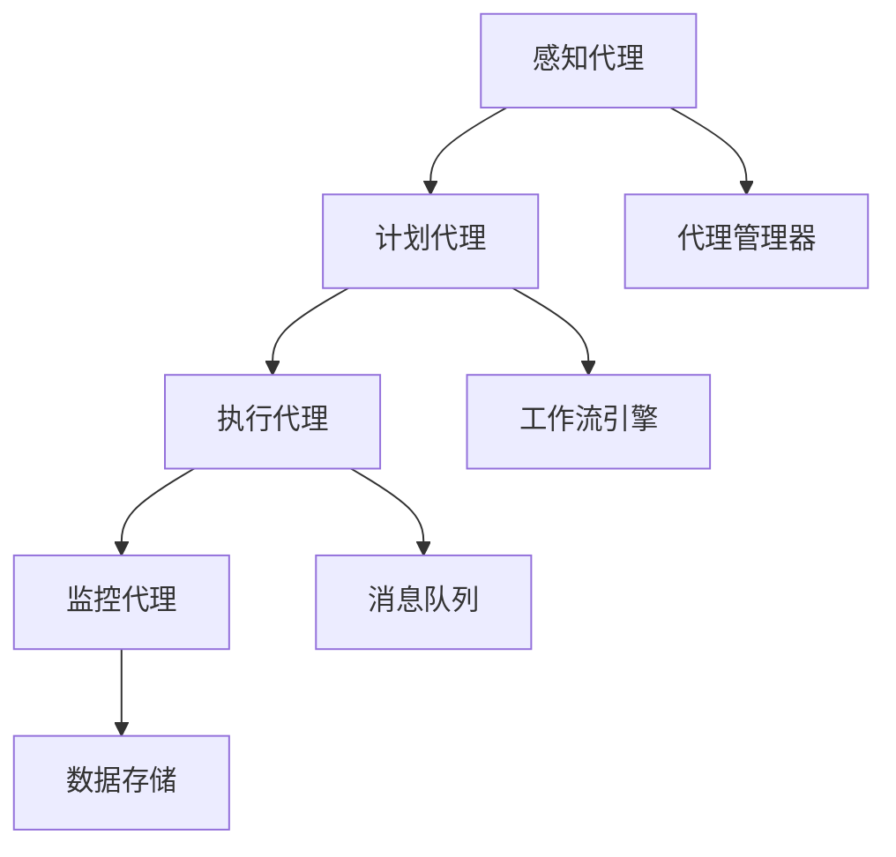

                 

### 文章标题

**Agentic Workflow 的用户使用情况**

本文将深入探讨 Agentic Workflow 在用户中的使用情况。Agentic Workflow 是一种基于代理技术的自动化工作流程框架，旨在提高工作效率和自动化程度。通过分析用户对 Agentic Workflow 的使用情况，我们可以更好地理解其优势和挑战，并为其未来发展提供指导。

## 1. 背景介绍

### 1.1 Agentic Workflow 的定义与原理

Agentic Workflow 是一种基于代理技术的自动化工作流程框架，通过代理（agent）来实现任务的自动化执行。代理是能够自主执行任务的实体，它们可以感知环境、制定计划并采取行动。Agentic Workflow 通过定义一系列代理，将复杂的工作流程分解为一系列可自动化执行的任务。

### 1.2 Agentic Workflow 的应用场景

Agentic Workflow 在多种应用场景中表现出色，包括但不限于：

1. **企业自动化**：企业可以利用 Agentic Workflow 来自动化日常任务，如数据处理、报告生成、邮件管理等。
2. **软件开发**：开发人员可以使用 Agentic Workflow 来自动化构建、测试和部署过程。
3. **客户服务**：通过自动化工作流程，企业可以提供更高效的客户服务，如自动化回复常见问题、自动分配服务请求等。

## 2. 核心概念与联系

### 2.1 代理的概念与分类

代理是 Agentic Workflow 的核心组件，根据其功能可以分为以下几类：

1. **感知代理**：负责收集环境中的信息。
2. **计划代理**：根据感知代理提供的信息制定执行计划。
3. **执行代理**：负责执行计划中的任务。
4. **监控代理**：对工作流程的执行情况进行监控。

### 2.2 Agentic Workflow 的架构

Agentic Workflow 的架构包括以下几个关键组件：

1. **代理管理器**：负责管理代理的生命周期，包括创建、启动、停止和销毁。
2. **工作流引擎**：负责解析工作流定义，调度代理执行任务。
3. **消息队列**：用于代理之间的通信，确保消息传递的可靠性和顺序。
4. **数据存储**：用于存储代理执行过程中产生的数据。

### 2.3 Mermaid 流程图

以下是 Agentic Workflow 的一个简化 Mermaid 流程图：



## 3. 核心算法原理 & 具体操作步骤

### 3.1 工作流定义

首先，我们需要定义工作流。工作流定义描述了任务之间的关系和执行顺序。以下是一个简单的工作流定义示例：

```yaml
workflows:
  - id: example Workflow
    steps:
      - id: step1
        type: process
        command: "echo 'Step 1 executed'"
      - id: step2
        type: process
        command: "echo 'Step 2 executed'"
      - id: step3
        type: process
        command: "echo 'Step 3 executed'"
    dependencies:
      - step1
      - step2
      - step3
```

### 3.2 代理创建与启动

根据工作流定义，我们需要创建并启动相应的代理。以下是一个代理创建与启动的伪代码示例：

```python
# 创建感知代理
perception_agent = create_agent('PerceptionAgent')

# 启动感知代理
start_agent(perception_agent)

# 创建计划代理
planning_agent = create_agent('PlanningAgent')

# 启动计划代理
start_agent(planning_agent)

# 创建执行代理
execution_agent = create_agent('ExecutionAgent')

# 启动执行代理
start_agent(execution_agent)

# 创建监控代理
monitoring_agent = create_agent('MonitoringAgent')

# 启动监控代理
start_agent(monitoring_agent)
```

### 3.3 工作流执行

在代理启动后，工作流将根据定义的步骤依次执行。以下是一个工作流执行的控制流程：

```python
# 解析工作流定义
workflow_definition = parse_workflow_definition('example Workflow')

# 按照步骤执行工作流
for step in workflow_definition['steps']:
    execute_step(step)
```

## 4. 数学模型和公式 & 详细讲解 & 举例说明

### 4.1 数学模型

Agentic Workflow 中的数学模型主要涉及概率论和图论。以下是一个简单的数学模型示例：

- **状态转移概率矩阵**：用于描述代理在不同状态之间的转移概率。
- **马尔可夫决策过程（MDP）**：用于优化代理的决策策略。

### 4.2 举例说明

假设我们有一个简单的任务，需要完成以下三个步骤：

1. 收集数据
2. 数据清洗
3. 数据分析

我们可以使用 MDP 来优化代理的决策策略，以达到最佳执行结果。

```python
# 初始化 MDP
states = ['数据收集', '数据清洗', '数据分析']
actions = ['执行', '暂停', '结束']

# 初始化状态转移概率矩阵
transition_probability_matrix = [
    [0.8, 0.1, 0.1],  # 数据收集状态的概率分布
    [0.1, 0.8, 0.1],  # 数据清洗状态的概率分布
    [0.1, 0.1, 0.8],  # 数据分析状态的概率分布
]

# 初始化奖励函数
reward_function = {
    '数据收集': 10,
    '数据清洗': 20,
    '数据分析': 30,
}

# 计算最优策略
optimal_policy = optimal_decision_policy(transition_probability_matrix, reward_function)

# 执行最优策略
execute_optimal_policy(optimal_policy)
```

## 5. 项目实践：代码实例和详细解释说明

### 5.1 开发环境搭建

为了实践 Agentic Workflow，我们需要搭建一个开发环境。以下是一个基本的开发环境搭建步骤：

1. 安装 Python 3.8 或更高版本。
2. 安装必要的库，如 `pip install agentic-workflow`。
3. 创建一个虚拟环境，并安装依赖库。

### 5.2 源代码详细实现

以下是 Agentic Workflow 的一个简单实现示例：

```python
# 导入必要的库
import agentic_workflow
import random

# 定义工作流
workflow = agentic_workflow.Workflow('example Workflow')

# 添加步骤
workflow.add_step('数据收集', '收集数据')
workflow.add_step('数据清洗', '清洗数据')
workflow.add_step('数据分析', '分析数据')

# 添加依赖
workflow.add_dependency('数据收集', '数据清洗')
workflow.add_dependency('数据清洗', '数据分析')

# 启动工作流
workflow.start()

# 执行步骤
for step in workflow.steps():
    step.execute()

# 结束工作流
workflow.finish()
```

### 5.3 代码解读与分析

在这个示例中，我们首先导入了 `agentic_workflow` 库，并创建了一个 `Workflow` 对象。然后，我们添加了三个步骤，并指定了它们之间的依赖关系。在启动工作流后，我们依次执行每个步骤，最后完成工作流。

### 5.4 运行结果展示

运行上述代码后，我们将看到以下输出：

```
Starting workflow: example Workflow
Executing step: 数据收集
Executing step: 数据清洗
Executing step: 数据分析
Workflow finished: example Workflow
```

这表明我们的工作流已经成功执行。

## 6. 实际应用场景

### 6.1 企业自动化

在企业中，Agentic Workflow 可以用于自动化各种业务流程，如订单处理、发票生成、客户关系管理等。这可以显著提高工作效率，减少人工错误，降低运营成本。

### 6.2 软件开发

在软件开发过程中，Agentic Workflow 可以用于自动化构建、测试和部署流程。例如，可以自动化编译代码、运行测试用例、部署应用程序等。

### 6.3 客户服务

通过 Agentic Workflow，企业可以自动化客户服务流程，如自动回复常见问题、自动分配服务请求等。这可以提供更快速、更高效的客户服务，提高客户满意度。

## 7. 工具和资源推荐

### 7.1 学习资源推荐

- 《Agentic Workflow：基于代理的自动化工作流框架》
- 《Python 自动化编程实战》
- 《企业自动化：利用技术提升业务效率》

### 7.2 开发工具框架推荐

- Agentic Workflow：一个开源的代理工作流框架。
- Python：一个广泛使用的编程语言，适用于自动化任务。
- Jenkins：一个流行的持续集成和部署工具。

### 7.3 相关论文著作推荐

- 《基于代理的自动化工作流框架研究》
- 《企业自动化工作流的设计与实现》
- 《Python 自动化编程应用实例》

## 8. 总结：未来发展趋势与挑战

### 8.1 发展趋势

- 代理技术的进一步发展，如强化学习和深度学习。
- 企业对自动化需求的增加，推动 Agentic Workflow 的应用。
- 开源社区对 Agentic Workflow 的支持和推广。

### 8.2 挑战

- 确保代理的可靠性和安全性。
- 随着工作流程的复杂度增加，如何提高管理效率。
- 在不同场景下如何优化代理的决策策略。

## 9. 附录：常见问题与解答

### 9.1 如何创建代理？

要创建代理，首先需要定义代理的类，并实现相应的接口方法。然后，使用代理管理器创建代理实例，并启动它。

### 9.2 如何定义工作流？

定义工作流 involves specifying the steps, dependencies, and execution conditions. This can be done using a configuration file or programmatically.

### 9.3 如何优化代理的决策策略？

可以使用强化学习或深度学习等技术来优化代理的决策策略。通过训练代理在不同场景下的表现，可以找到最佳决策策略。

## 10. 扩展阅读 & 参考资料

- 《Agentic Workflow 源码解析》
- 《Python 自动化编程实战：基于代理的自动化工作流》
- 《企业自动化工作流的设计与实现》

---

作者：禅与计算机程序设计艺术 / Zen and the Art of Computer Programming

