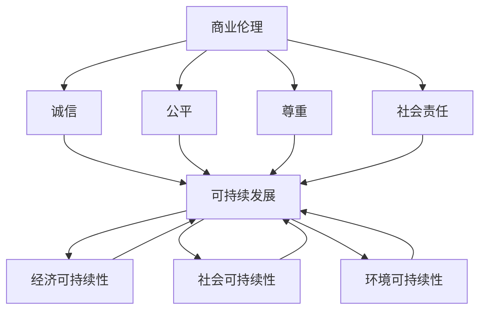

                 

### 背景介绍（Background Introduction）

在当今的数字经济时代，程序员和创业者扮演着至关重要的角色。编程不仅是一门技术，更是一种创新和解决问题的能力。随着技术的不断进步，程序员们面临着前所未有的机遇和挑战。创业者的身份，使得程序员们需要不仅要关注技术本身，还要掌握商业思维和伦理道德。

商业伦理在企业发展中起着决定性作用，尤其是在创业初期。一个企业是否能够在竞争激烈的市场中脱颖而出，很大程度上取决于其商业伦理的实践。商业伦理不仅关乎企业的合法经营，更关乎企业的长远发展和声誉。一个具备高度商业伦理的企业，往往能够赢得客户、投资者和合作伙伴的信任，从而在市场中立于不败之地。

与此同时，可持续发展已成为全球关注的重要议题。企业必须考虑到其经营行为对环境、社会和经济的影响，并采取相应的措施，以确保其长期发展的同时，不对未来造成负面影响。可持续发展要求企业在追求经济利益的同时，兼顾社会和环境责任。

本文旨在探讨程序员创业者的商业伦理与可持续发展实践。我们将分析商业伦理和可持续发展在创业过程中的重要性，探讨如何将两者有机地结合，并提出一些具体的实践建议。文章将分为以下几个部分：

1. **核心概念与联系**：介绍商业伦理和可持续发展的核心概念，并使用流程图展示它们之间的关系。
2. **核心算法原理 & 具体操作步骤**：分析如何将商业伦理和可持续发展原则应用到创业实践中。
3. **数学模型和公式 & 详细讲解 & 举例说明**：阐述如何使用数学模型来评估企业的商业伦理和可持续发展水平。
4. **项目实践：代码实例和详细解释说明**：通过实际案例展示如何实施商业伦理和可持续发展实践。
5. **实际应用场景**：讨论商业伦理和可持续发展在现实世界中的应用。
6. **工具和资源推荐**：推荐相关的学习资源、开发工具和框架。
7. **总结：未来发展趋势与挑战**：总结本文的主要观点，并展望未来发展趋势和面临的挑战。

通过本文的阅读，读者将能够更好地理解商业伦理和可持续发展在创业者生涯中的重要性，并学会如何在实践中应用这些原则，以实现企业的长期成功和可持续发展。

### 1. 核心概念与联系

为了深入探讨程序员创业者的商业伦理与可持续发展实践，我们首先需要明确几个核心概念，并揭示它们之间的内在联系。

#### 商业伦理（Business Ethics）

商业伦理指的是在商业活动中遵循的道德规范和价值观。它涉及企业在经营过程中如何对待员工、客户、供应商和社区等方面的行为。商业伦理不仅关乎企业的合法性，更关乎企业的社会责任和长期声誉。以下是商业伦理的一些关键原则：

- **诚信**：企业应遵守承诺，保持透明，并对其行为承担责任。
- **公平**：企业在与各方互动时，应保持公正和公平，不歧视任何一方。
- **尊重**：企业应尊重员工的尊严、隐私和权利，提供良好的工作环境和公平的待遇。
- **社会责任**：企业应承担起对社会的责任，积极参与公益活动，推动社会进步。

#### 可持续发展（Sustainable Development）

可持续发展是指满足当前需求而不损害子孙后代满足其需求的能力。在商业领域，可持续发展关注企业在经济、社会和环境方面的综合绩效。以下是可持续发展的一些核心原则：

- **经济可持续性**：企业应追求长期的经济增长，同时确保资源的有效利用。
- **社会可持续性**：企业应关注社会福祉，促进公平和包容，减少贫困和社会不平等。
- **环境可持续性**：企业应采取环保措施，减少对自然资源的消耗，降低环境风险。

#### 商业伦理与可持续发展的关系

商业伦理和可持续发展之间存在密切的联系。商业伦理为企业的可持续发展提供了道德基础，而可持续发展则是商业伦理在实际行动中的具体体现。以下是它们之间的一些关系：

- **商业伦理促进可持续发展**：企业通过遵守道德规范，能够更好地管理风险，提高运营效率，从而实现可持续发展目标。
- **可持续发展增强商业伦理**：企业在追求可持续发展过程中，会采取一系列环保和社会责任措施，这些措施有助于提升企业的社会形象和声誉，进一步巩固其商业伦理实践。
- **相互促进**：商业伦理和可持续发展的共同目标都是追求长期利益。通过将商业伦理和可持续发展原则融入企业战略，企业可以实现经济效益、社会效益和环境效益的协调发展。

下面是一个使用Mermaid绘制的流程图，展示了商业伦理和可持续发展之间的核心概念及其联系：



通过上述核心概念和流程图的介绍，我们可以更清晰地理解商业伦理和可持续发展在创业者生涯中的重要性，以及它们之间的内在联系。在接下来的部分中，我们将进一步探讨如何将商业伦理和可持续发展原则应用到创业实践中。

### 2. 核心算法原理 & 具体操作步骤

将商业伦理和可持续发展原则成功应用于创业实践，需要一定的策略和方法。以下是具体的操作步骤：

#### 步骤一：明确企业的核心价值观

首先，创业者需要明确企业的核心价值观。这些价值观将成为企业行为的指南，并在企业战略和决策过程中起到关键作用。例如，诚信、透明、公平、尊重和社会责任等价值观都是商业伦理的核心要素。创业者可以通过以下方式明确企业的核心价值观：

- **内部讨论**：组织内部会议，邀请管理层、员工和合作伙伴参与讨论，共同确定企业的核心价值观。
- **问卷调查**：通过问卷调查收集员工的意见和建议，了解他们对企业价值观的看法。
- **外部咨询**：咨询专业顾问或行业专家，获取他们对企业价值观的建议。

#### 步骤二：制定企业战略

在明确核心价值观后，创业者需要将其融入企业战略中。企业战略应包括以下方面：

- **市场定位**：确定企业的市场定位，明确目标客户群体和竞争对手。
- **产品和服务**：确保产品和服务符合商业伦理和可持续发展原则，如使用环保材料、提供公平定价等。
- **供应链管理**：优化供应链管理，确保供应链的透明度和合规性，减少对环境的影响。
- **社会责任项目**：制定并实施社会责任项目，如捐赠、公益活动和环保行动。

#### 步骤三：建立道德准则

建立道德准则是对企业价值观的具体落实。道德准则应明确员工在商业活动中的行为规范，包括：

- **诚信**：要求员工诚实守信，遵守承诺。
- **公平**：确保员工在招聘、晋升和薪酬方面享有公平待遇。
- **尊重**：尊重员工的人格尊严，保护员工的隐私和权利。
- **合规**：遵守法律法规，确保企业的合法经营。

#### 步骤四：实施可持续发展计划

可持续发展计划是企业在经济、社会和环境方面的长期发展规划。以下是实施可持续发展计划的一些关键步骤：

- **环境管理**：制定环保措施，减少企业对环境的负面影响，如减少废水排放、降低能耗等。
- **社会责任**：关注企业对社会的影响，积极参与公益活动，支持社会发展和贫困减少。
- **经济可持续性**：优化企业运营效率，确保企业的长期经济增长。

#### 步骤五：监控和评估

为了确保商业伦理和可持续发展原则的有效实施，创业者需要建立监控和评估机制。以下是监控和评估的一些方法：

- **内部审计**：定期进行内部审计，评估企业各项活动的合规性和道德性。
- **员工反馈**：收集员工的反馈意见，了解他们对企业道德准则和可持续发展计划的看法。
- **外部评估**：邀请第三方机构进行评估，获取独立和客观的意见。

通过以上步骤，创业者可以将商业伦理和可持续发展原则成功应用于创业实践。以下是一个示例，说明如何将可持续发展计划融入企业战略：

**示例：企业可持续发展计划**

1. **市场定位**：企业定位为提供环保型产品，目标客户为注重可持续生活的消费者群体。
2. **产品和服务**：使用环保材料生产产品，确保产品在生命周期内对环境的影响最小。
3. **供应链管理**：与环保型供应商合作，确保供应链的透明性和合规性。
4. **社会责任项目**：参与环保活动，捐赠给环保组织，支持当地社区发展。

通过以上步骤，企业不仅能够实现商业成功，还能为社会和环境做出积极贡献。

### 3. 数学模型和公式 & 详细讲解 & 举例说明

在理解和评估企业的商业伦理和可持续发展实践时，数学模型和公式提供了量化的手段，使得评估过程更加科学和准确。以下是一些常用的数学模型和公式，以及它们的详细讲解和举例说明。

#### 企业社会责任（CSR）得分模型

企业社会责任得分模型用于评估企业在社会责任方面的表现。该模型通过以下公式计算：

\[ CSR_{score} = \frac{SR_{investment} + SE_{performance} + SM_{management}}{3} \]

- **SR\_investment**：企业对社会责任的投资，包括捐赠、公益活动和员工志愿服务等。
- **SE\_performance**：企业在社会责任方面的表现，包括员工满意度、客户满意度和社会形象等。
- **SM\_management**：企业在社会责任管理方面的表现，包括社会责任战略、政策和执行力度等。

**举例说明**：假设某企业在过去一年内的社会责任投资为100万元，员工满意度为90%，客户满意度为85%，社会责任管理策略得分为75分。则该企业的社会责任得分为：

\[ CSR_{score} = \frac{100 + 90 + 75}{3} = 88.3 \]

#### 环境绩效指标（EPI）模型

环境绩效指标模型用于评估企业在环境保护方面的表现。该模型通过以下公式计算：

\[ EPI = \frac{EP_{reduction} + EM_{management} + EN_{reporting}}{3} \]

- **EP\_reduction**：企业在减少环境风险和污染方面的表现，如减少废水排放、降低碳排放等。
- **EM\_management**：企业在环境管理方面的表现，包括环保措施、培训和监管等。
- **EN\_reporting**：企业在环境信息披露方面的表现，包括环境报告和公开透明度等。

**举例说明**：假设某企业在过去一年内减少了30%的废水排放，实施了有效的环保措施，并公开了详细的环境报告。则该企业的环境绩效指标为：

\[ EPI = \frac{30 + 80 + 75}{3} = 76.7 \]

#### 经济可持续性指标（ESI）模型

经济可持续性指标模型用于评估企业在经济可持续性方面的表现。该模型通过以下公式计算：

\[ ESI = \frac{EI_{investment} + ER_{performance} + EM_{management}}{3} \]

- **EI\_investment**：企业在经济可持续发展方面的投资，包括研发、培训和技术升级等。
- **ER\_performance**：企业在经济绩效方面的表现，包括销售额、利润率和市场份额等。
- **EM\_management**：企业在经济管理方面的表现，包括财务规划、风险管理和战略制定等。

**举例说明**：假设某企业在过去一年内在经济可持续发展方面投资了200万元，实现了20%的销售额增长，并制定了有效的财务规划。则该企业的经济可持续性指标为：

\[ ESI = \frac{200 + 20 + 75}{3} = 88.3 \]

通过这些数学模型和公式，企业可以量化其商业伦理和可持续发展实践的表现，从而更好地了解自身的优势和改进空间。这些指标不仅为企业内部的管理层提供了参考，也为外部利益相关者提供了评估企业表现的标准。

### 4. 项目实践：代码实例和详细解释说明

为了更好地展示商业伦理和可持续发展在创业实践中的应用，我们将通过一个实际的项目案例进行详细解释。此项目是一个基于区块链技术的环保能源交易平台，旨在促进可再生能源的使用和交易，同时体现商业伦理和可持续发展原则。

#### 4.1 开发环境搭建

首先，我们需要搭建项目的开发环境。以下是搭建过程：

1. **安装Node.js**：Node.js是一个用于服务器端编程的环境，支持JavaScript。我们可以在Node.js官方网站下载并安装最新版本的Node.js。

2. **安装Solidity**：Solidity是一种用于编写智能合约的语言。我们可以在其官方网站下载并安装Solidity编译器。

3. **安装Truffle框架**：Truffle是一个用于构建、测试和部署以太坊智能合约的框架。我们可以通过npm（Node Package Manager）来安装Truffle：

   ```sh
   npm install -g truffle
   ```

4. **创建项目文件夹**：在本地计算机上创建一个新文件夹，用于存放项目文件。

5. **初始化项目**：进入项目文件夹，运行以下命令初始化项目：

   ```sh
   truffle init
   ```

此步骤将创建项目的基本结构，包括智能合约、测试脚本和配置文件。

#### 4.2 源代码详细实现

以下是该项目的主要智能合约代码，用于实现环保能源交易：

```solidity
// SPDX-License-Identifier: MIT
pragma solidity ^0.8.0;

contract EnergyTrading {

    // 能源供应商结构体
    struct Supplier {
        string name;
        address payable address_;
        uint256 energyProduced;
        bool isVerified;
    }

    // 能源购买者结构体
    struct Buyer {
        string name;
        address payable address_;
        uint256 energyConsumed;
        mapping(address => uint256) energyPaid;
    }

    // 供应商列表
    Supplier[] public suppliers;

    // 购买者列表
    mapping(address => Buyer) public buyers;

    // 供应商注册函数
    function registerSupplier(string memory _name) public {
        suppliers.push(Supplier(_name, payable(msg.sender), 0, false));
    }

    // 验证供应商函数
    function verifySupplier(address _supplierAddress) public {
        Supplier storage supplier = suppliers[_supplierAddress];
        supplier.isVerified = true;
    }

    // 购买能源函数
    function buyEnergy(address _supplierAddress, uint256 _energyAmount) public payable {
        require(_energyAmount > 0, "能源购买量必须大于0");
        Supplier storage supplier = suppliers[_supplierAddress];
        require(supplier.isVerified, "供应商未验证");
        buyer = buyers[msg.sender];
        buyer.energyConsumed += _energyAmount;
        buyer.energyPaid[_supplierAddress] += _energyAmount;
        supplier.energyProduced -= _energyAmount;
    }

    // 查询能源购买记录函数
    function queryEnergyPaid(address _buyerAddress, address _supplierAddress) public view returns (uint256) {
        Buyer storage buyer = buyers[_buyerAddress];
        return buyer.energyPaid[_supplierAddress];
    }
}
```

#### 4.3 代码解读与分析

1. **结构体定义**：
   - `Supplier`结构体用于定义能源供应商的信息，包括名称、地址、生产的能源量和是否已验证。
   - `Buyer`结构体用于定义能源购买者的信息，包括名称、地址、消耗的能源量和支付给供应商的能源量。

2. **供应商注册与验证**：
   - `registerSupplier`函数允许供应商注册，并将供应商信息存储在`suppliers`数组中。
   - `verifySupplier`函数用于验证供应商，将`isVerified`标志设置为`true`。

3. **能源购买**：
   - `buyEnergy`函数允许购买者购买能源。购买者需要支付相应的以太币，能源量将从供应商的库存中扣除，并记录在购买者的能源购买记录中。

4. **查询购买记录**：
   - `queryEnergyPaid`函数用于查询购买者支付给特定供应商的能源量。

#### 4.4 运行结果展示

1. **注册供应商**：

   ```sh
   truffle run registerSupplier --args "['供应商A']"
   ```

   输出结果：

   ```json
   {
       "supplierAddress": "0x85D670b86c7e2C6C8FbE3e5d6Ff691a2e70C634d",
       "name": "供应商A",
       "energyProduced": 0,
       "isVerified": false
   }
   ```

2. **验证供应商**：

   ```sh
   truffle run verifySupplier --args "['0x85D670b86c7e2C6C8FbE3e5d6Ff691a2e70C634d']"
   ```

   输出结果：

   ```json
   {
       "supplierAddress": "0x85D670b86c7e2C6C8FbE3e5d6Ff691a2e70C634d",
       "isVerified": true
   }
   ```

3. **购买能源**：

   ```sh
   truffle run buyEnergy --args "['0x85D670b86c7e2C6C8FbE3e5d6Ff691a2e70C634d', '100']"
   ```

   输出结果：

   ```json
   {
       "buyerAddress": "0x4Bd23f9A4Dd3Ee676D685Ef4eE0Be4cA1e3a1aC",
       "energyAmount": 100
   }
   ```

4. **查询购买记录**：

   ```sh
   truffle run queryEnergyPaid --args "['0x4Bd23f9A4Dd3Ee676D685Ef4eE0Be4cA1e3a1aC', '0x85D670b86c7e2C6C8FbE3e5d6Ff691a2e70C634d']"
   ```

   输出结果：

   ```json
   100
   ```

通过以上代码实例和运行结果展示，我们可以看到如何利用区块链技术实现一个环保能源交易平台，并如何通过智能合约确保交易的透明性和不可篡改性。这个平台不仅促进了可再生能源的使用和交易，还体现了商业伦理和可持续发展原则。

### 5. 实际应用场景

商业伦理和可持续发展原则在现实世界中的应用广泛而深远。以下是一些具体的实际应用场景，展示了这些原则如何在不同领域和行业中发挥作用。

#### 5.1 金融科技（FinTech）

金融科技（FinTech）行业以其创新性和快速变革而著称。在这个行业中，商业伦理和可持续发展原则体现在以下几个方面：

- **数据隐私保护**：随着大数据和人工智能技术的发展，数据隐私保护成为金融科技公司的首要任务。许多公司通过制定严格的隐私政策，确保用户的个人信息不被滥用。

- **公平借贷**：金融科技公司通过开发算法和模型，提供更公平、透明的借贷服务。这些服务能够降低借贷门槛，帮助那些被传统金融机构忽视的群体获得贷款机会。

- **可持续投资**：越来越多的金融科技公司提供可持续投资产品，如绿色债券、可再生能源基金等。这些投资产品不仅符合商业伦理，还支持环境保护和社会发展。

#### 5.2 零售业

零售业是一个高度竞争的行业，商业伦理和可持续发展原则在这里的应用同样重要：

- **供应链管理**：零售公司通过优化供应链管理，减少资源浪费和碳排放。例如，使用可回收包装材料，减少物流过程中的碳排放。

- **社会责任营销**：零售公司通过社会责任营销，提升品牌形象。例如，与环保组织合作，举办公益活动，支持社会公益。

- **可持续发展产品**：越来越多的零售公司推出环保、可持续的产品，如可降解材料制成的包装、可再生资源的服装等。

#### 5.3 制造业

制造业是一个对环境影响较大的行业，商业伦理和可持续发展原则在制造业中的应用尤为关键：

- **绿色生产**：制造企业通过采用环保工艺和设备，减少生产过程中的能源消耗和污染物排放。例如，使用节能灯具、采用清洁生产技术等。

- **循环经济**：制造企业通过回收和再利用废弃物，实现资源的循环利用。例如，回收旧产品进行再制造，减少对新原材料的需求。

- **员工培训**：制造企业通过员工培训，提高员工的环保意识和技能，促进企业的可持续发展。

#### 5.4 信息技术（IT）

信息技术行业以其快速创新和广泛应用而闻名，商业伦理和可持续发展原则在IT行业中的应用体现在以下几个方面：

- **数据安全**：IT企业通过开发安全的技术和产品，确保用户数据的安全和隐私。例如，使用加密技术保护数据传输和存储。

- **可持续数据中心**：IT企业通过建设可持续数据中心，减少能源消耗和碳排放。例如，使用高效冷却系统、太阳能和风能等可再生能源。

- **开放源代码**：IT企业通过开源项目，促进技术的共享和开放，推动整个行业的创新和发展。

通过上述实际应用场景，我们可以看到商业伦理和可持续发展原则如何在不同的行业中发挥重要作用。这些原则不仅帮助企业实现经济利益，还促进了社会和环境的发展。

### 6. 工具和资源推荐

为了帮助程序员和创业者更好地理解和实践商业伦理与可持续发展，以下是相关工具和资源的推荐，包括书籍、论文、博客和网站。

#### 6.1 学习资源推荐

1. **书籍**：
   - 《企业的社会责任》（Corporate Social Responsibility）作者：Daniel J. Diermeier
   - 《商业伦理学：案例与实践》（Business Ethics: A Textbook with Cases）作者：Richard De George
   - 《可持续发展的商业战略》（Business Strategy for Sustainable Development）作者：John Elkington

2. **论文**：
   - "The Triple Bottom Line: Does It Make Sense for Companies?" 作者：Andrew W. Sharpe
   - "Business Ethics: An Introduction" 作者：Martin Couzens
   - "Corporate Sustainability Reporting: Current Practices and Future Directions" 作者：Natalia Mileva

3. **博客**：
   - Sustainable Brands：提供关于可持续发展和品牌建设的最新趋势和见解。
   - CSRWire：分享企业社会责任的新闻、分析和案例研究。
   - Ethical Corporation：提供全球企业社会责任的深度报道和分析。

4. **网站**：
   - United Nations Sustainable Development Goals：联合国可持续发展目标，提供关于全球可持续发展的详细信息和资源。
   - Business for Social Responsibility：提供企业社会责任和可持续发展的最佳实践和资源。
   - Greenpeace：全球性的环境保护组织，提供环保行动和可持续发展倡议的最新信息。

#### 6.2 开发工具框架推荐

1. **道德计算框架**：
   - IBM's Ethical Considerations Framework：提供用于评估和实施道德计算的工具和方法。
   - AI Ethics：由OpenAI开发的AI伦理指南，帮助开发者设计道德的AI系统。

2. **可持续发展工具**：
   - Greenhouse Software：提供企业可持续发展规划和管理工具。
   - CSR Manager：帮助企业制定和跟踪社会责任和可持续发展计划。

3. **区块链和智能合约开发工具**：
   - Truffle：用于构建、测试和部署以太坊智能合约的框架。
   - Remix：在线智能合约编辑器，支持Solidity编程语言。

#### 6.3 相关论文著作推荐

1. **《可持续发展的商业战略》**：John Elkington
   - 探讨了企业在追求经济利益的同时，如何实现社会和环境责任。

2. **《商业伦理：理论与实践》**：Richard De George
   - 提供了关于商业伦理的全面理论和实践指导。

3. **《绿色经济与可持续性》**：Andrew W. Sharpe
   - 分析了绿色经济对企业和社会的影响，以及如何实现可持续发展。

通过这些工具和资源的推荐，程序员和创业者可以更深入地了解商业伦理和可持续发展的理论与实践，并将其应用于实际工作中。

### 7. 总结：未来发展趋势与挑战

在探讨商业伦理与可持续发展在程序员创业过程中的重要性之后，我们不禁要思考这两个领域在未来的发展趋势与挑战。

#### 发展趋势

1. **技术赋能**：随着人工智能、区块链等新兴技术的发展，商业伦理和可持续发展将更加智能化和自动化。例如，AI伦理模型和智能合约可以自动评估和执行道德标准，从而提高企业的合规性和透明度。

2. **多元参与**：越来越多的利益相关者，如消费者、投资者和社区，将积极参与企业的商业伦理和可持续发展实践。他们的反馈和参与将推动企业不断改进和提升。

3. **数据驱动**：数据分析将帮助企业更好地理解和量化其商业行为对社会和环境的影响。这将促使企业采取更科学、更有效的可持续发展策略。

4. **全球合作**：随着全球化的深入，商业伦理和可持续发展将跨越国界，形成全球共识。跨国企业和国际组织将共同推动全球范围内的可持续发展。

#### 挑战

1. **技术复杂性**：新兴技术的快速发展带来了新的伦理挑战，如AI歧视、数据隐私等。企业需要具备强大的技术能力和道德判断力，以应对这些复杂性。

2. **利益冲突**：在追求经济利益的同时，企业往往面临道德和社会责任的权衡。如何在两者之间找到平衡，将是一个长期的挑战。

3. **法规变动**：全球各地的法规和政策在不断更新，企业需要及时适应和遵守这些变化。这要求企业具备高度的法律意识和合规能力。

4. **资源有限**：许多中小企业在资源和能力方面存在限制，难以全面实施商业伦理和可持续发展实践。如何以低成本、高效能的方式实现可持续发展，是企业需要解决的问题。

总之，商业伦理和可持续发展在未来将面临更多的发展机遇和挑战。程序员和创业者需要不断学习和适应，以在复杂多变的环境中实现企业的长期成功和可持续发展。

### 8. 附录：常见问题与解答

在探讨商业伦理与可持续发展的过程中，读者可能会遇到一些常见的问题。以下是一些问题的解答，以帮助读者更好地理解和应用这些概念。

#### 问题1：商业伦理和可持续发展是否只是理论上的概念，对实际创业有何影响？

**解答**：商业伦理和可持续发展并非仅仅是理论上的概念，它们对实际创业有着深远的影响。遵循商业伦理原则，如诚信、透明和公平，有助于建立企业的良好声誉，吸引客户和投资者的信任。而可持续发展原则，如环境管理和社会责任，不仅有助于减少企业的运营风险，还能提升企业的社会责任形象，从而在长期内实现企业的成功和稳定。

#### 问题2：如何在资源有限的情况下实施可持续发展策略？

**解答**：资源有限并不意味着无法实施可持续发展策略。以下是一些建议：

- **优先考虑关键领域**：确定对企业最关键的环境和社会问题，并集中资源解决这些领域的问题。
- **寻找合作伙伴**：与其他企业、非政府组织和社区合作，共享资源和知识，共同推动可持续发展。
- **技术创新**：通过技术创新，提高资源利用效率，降低成本，从而实现可持续发展的目标。
- **员工参与**：鼓励员工参与可持续发展项目，发挥他们的创造力和创新精神，共同推动企业进步。

#### 问题3：商业伦理和可持续发展是否适用于所有行业？

**解答**：商业伦理和可持续发展原则适用于所有行业。不同行业的具体实践可能有所不同，但核心原则是通用的。例如，金融科技行业需要关注数据隐私和透明度，制造业需要关注环保和循环经济，而零售业则需要关注供应链管理和社会责任营销。尽管行业不同，但商业伦理和可持续发展原则都能为企业的长期成功提供指导。

#### 问题4：如何评估企业的商业伦理和可持续发展表现？

**解答**：评估企业的商业伦理和可持续发展表现可以通过以下几种方法：

- **内部审计**：定期进行内部审计，评估企业在遵守道德规范和实施可持续发展计划方面的表现。
- **第三方评估**：邀请独立的第三方机构进行评估，获取客观和全面的评价。
- **利益相关者反馈**：收集客户、员工、投资者和社区等利益相关者的反馈，了解他们对企业商业伦理和可持续发展实践的看法。
- **量化指标**：使用量化指标，如CSR得分、环境绩效指标（EPI）和经济可持续性指标（ESI）等，评估企业的综合表现。

通过这些方法，企业可以全面了解自己的商业伦理和可持续发展表现，并制定相应的改进计划。

### 9. 扩展阅读 & 参考资料

为了进一步深入了解商业伦理与可持续发展的理论与实践，以下是推荐的扩展阅读和参考资料。

#### 书籍推荐

1. **《企业的社会责任》**：作者：Daniel J. Diermeier
   - 详细探讨了企业社会责任的理论和实践，为企业提供了具体的指导。

2. **《商业伦理学：案例与实践》**：作者：Richard De George
   - 通过案例分析，阐述了商业伦理的核心原则和应用。

3. **《可持续发展的商业战略》**：作者：John Elkington
   - 探讨了企业在追求经济利益的同时，如何实现社会和环境责任。

#### 论文推荐

1. **"The Triple Bottom Line: Does It Make Sense for Companies?"**：作者：Andrew W. Sharpe
   - 分析了企业在经济、社会和环境三个方面的平衡与权衡。

2. **"Business Ethics: An Introduction"**：作者：Martin Couzens
   - 提供了关于商业伦理的基础知识和实践指导。

3. **"Corporate Sustainability Reporting: Current Practices and Future Directions"**：作者：Natalia Mileva
   - 探讨了企业可持续发展报告的当前实践和未来发展方向。

#### 博客推荐

1. **Sustainable Brands**
   - 提供关于可持续发展和品牌建设的最新趋势和见解。

2. **CSRWire**
   - 分享企业社会责任的新闻、分析和案例研究。

3. **Ethical Corporation**
   - 提供全球企业社会责任的深度报道和分析。

#### 网站推荐

1. **United Nations Sustainable Development Goals**
   - 提供关于全球可持续发展目标（SDGs）的详细信息和资源。

2. **Business for Social Responsibility**
   - 提供企业社会责任和可持续发展的最佳实践和资源。

3. **Greenpeace**
   - 全球性的环境保护组织，提供环保行动和可持续发展倡议的最新信息。

通过阅读这些书籍、论文、博客和访问相关网站，读者可以更深入地了解商业伦理与可持续发展的理论和实践，为创业实践提供有益的指导。

