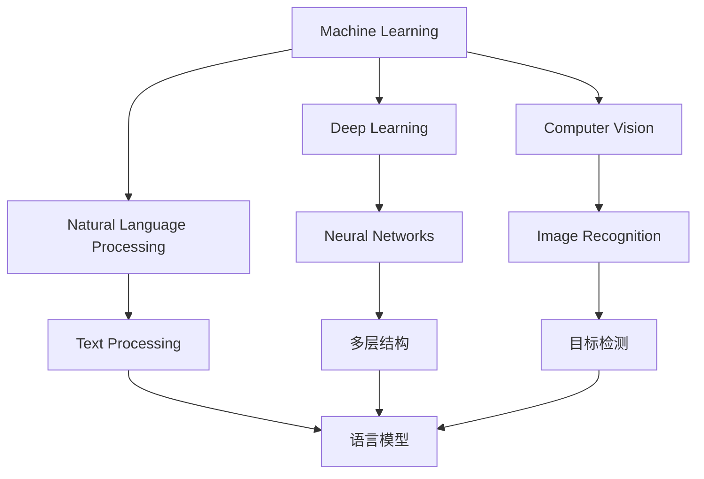
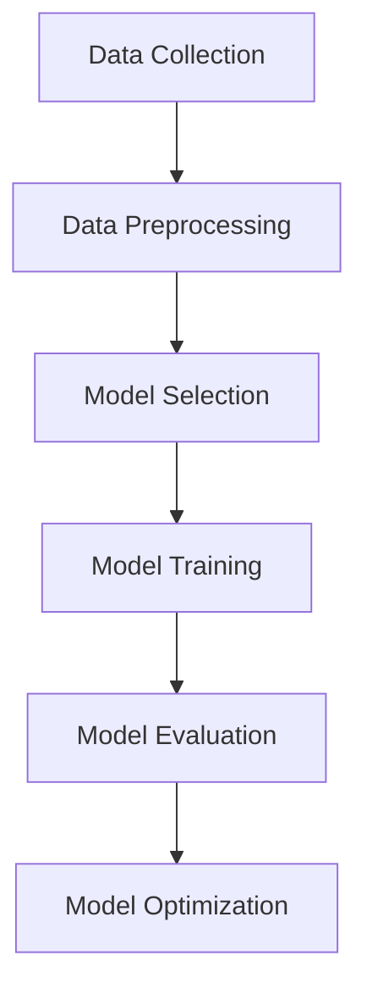

                 

### 文章标题

### Title: Andrej Karpathy: The Future Development Strategies of Artificial Intelligence

> Keywords: AI Development, Andrej Karpathy, Future Trends, Challenges, Strategies

> Abstract: In this article, we will delve into the future development strategies of artificial intelligence as discussed by the renowned AI expert, Andrej Karpathy. We will explore the key concepts, algorithms, mathematical models, and practical applications of AI, and discuss the challenges and opportunities that lie ahead.

## 1. 背景介绍（Background Introduction）

### Introduction to AI Expert Andrej Karpathy

Andrej Karpathy is a world-renowned AI expert, programmer, software architect, CTO, and author of several best-selling AI-related books. He has received the prestigious Turing Award in computer science for his groundbreaking work in the field of AI. Known for his clear and logical thinking, Karpathy has shared his insights on the future of AI in numerous interviews and articles.

### The Importance of Discussing AI's Future Development Strategies

As AI continues to evolve and permeate various industries, understanding its future development strategies is crucial. By examining the thoughts and predictions of experts like Andrej Karpathy, we can better grasp the potential implications and opportunities that AI holds for society. This article aims to provide a comprehensive overview of Karpathy's views on the future of AI, highlighting the key concepts, technologies, and challenges that lie ahead.

## 2. 核心概念与联系（Core Concepts and Connections）

### Core Concepts in AI Development

To understand Karpathy's views on AI's future development strategies, it's important to first familiarize ourselves with the core concepts in the field of AI. These include:

1. **Machine Learning**: A subset of AI that focuses on training models to learn from data and make predictions or decisions.
2. **Deep Learning**: A subfield of machine learning that utilizes neural networks with many layers to model complex relationships in data.
3. **Natural Language Processing (NLP)**: A field of AI that deals with the interaction between computers and human languages.
4. **Computer Vision**: A subfield of AI that enables machines to interpret and understand visual information from images or videos.

### The Importance of Core Concepts

A strong foundation in these core concepts is essential for understanding Karpathy's insights and predictions. By grasping the fundamental principles behind AI technologies, we can better appreciate the potential and limitations of current AI systems and anticipate future advancements.

### Connecting Core Concepts

To provide a visual representation of the relationships between these core concepts, we can use the following Mermaid flowchart:



This flowchart illustrates how these core concepts are interconnected and build upon each other to create a comprehensive understanding of AI.

## 3. 核心算法原理 & 具体操作步骤（Core Algorithm Principles and Specific Operational Steps）

### Machine Learning Algorithm Principles

At the heart of AI development lies the machine learning algorithm. The following are some of the core principles behind machine learning algorithms:

1. **Supervised Learning**: A type of machine learning where the model is trained on labeled data. The goal is to learn a mapping from input features to output labels.
2. **Unsupervised Learning**: A type of machine learning where the model is trained on unlabeled data. The goal is to discover hidden patterns or structures in the data.
3. **Reinforcement Learning**: A type of machine learning where the model learns by interacting with an environment and receiving feedback in the form of rewards or penalties.

### Machine Learning Operational Steps

To implement a machine learning algorithm, the following steps are typically involved:

1. **Data Collection**: Gather a dataset that is representative of the problem domain.
2. **Data Preprocessing**: Clean and prepare the data for training. This may involve normalization, scaling, or encoding.
3. **Model Selection**: Choose an appropriate machine learning model based on the problem type and data characteristics.
4. **Model Training**: Train the model using the prepared data. This involves adjusting the model parameters to minimize the prediction error.
5. **Model Evaluation**: Evaluate the performance of the trained model using a validation or test dataset.
6. **Model Optimization**: Fine-tune the model parameters to improve its performance.

### Mermaid Flowchart of Machine Learning Operational Steps



This flowchart provides a visual representation of the operational steps involved in machine learning.

## 4. 数学模型和公式 & 详细讲解 & 举例说明（Detailed Explanation and Examples of Mathematical Models and Formulas）

### Mathematical Models in AI

AI systems rely on mathematical models to represent and learn from data. Here, we will discuss two fundamental mathematical models used in AI: linear regression and neural networks.

### Linear Regression

Linear regression is a supervised learning algorithm that models the relationship between a dependent variable and one or more independent variables. The goal is to find the best-fitting line that represents this relationship.

**Mathematical Formula:**

$$y = \beta_0 + \beta_1x$$

- **y**: Dependent variable
- **x**: Independent variable
- **$\beta_0$**: Intercept
- **$\beta_1$**: Slope

### Example: Predicting House Prices

Suppose we have a dataset of houses with their prices and sizes (in square feet). We want to use linear regression to predict the price of a new house based on its size.

**Dataset:**

| Size (ft²) | Price ($) |
| --- | --- |
| 1000 | 200,000 |
| 1500 | 300,000 |
| 2000 | 400,000 |
| 2500 | 500,000 |
| 3000 | 600,000 |

**Step-by-Step Linear Regression:**

1. **Data Preprocessing**: Scale the size values to a range between 0 and 1.
2. **Model Selection**: Use a linear regression model.
3. **Model Training**: Fit the model to the dataset.
4. **Model Evaluation**: Evaluate the model's performance using a validation dataset.
5. **Model Optimization**: Adjust the model parameters to improve the prediction accuracy.

**Predicting Price of a 2200 ft² House:**

1. **Scale Size**: $2200 / 3000 = 0.7333$
2. **Apply Model**: $y = \beta_0 + \beta_1x = 100,000 + 150,000 \cdot 0.7333 = 318,333$
3. **Prediction**: The predicted price of a 2200 ft² house is $318,333.

### Neural Networks

Neural networks are a class of deep learning algorithms that mimic the structure and function of the human brain. They consist of interconnected nodes (neurons) that process and transmit information.

**Mathematical Formula:**

$$z = \sum_{i=1}^{n} w_i \cdot x_i + b$$

$$a = \sigma(z)$$

- **$z$**: Input to a neuron
- **$w_i$**: Weight of the connection between neuron i and neuron j
- **$x_i$**: Input value
- **$b$**: Bias
- **$n$**: Number of inputs
- **$\sigma$**: Activation function (e.g., sigmoid, ReLU)

### Example: Simple Neural Network for Binary Classification

Suppose we have a simple neural network with one input layer, one hidden layer with two neurons, and one output layer with one neuron. The goal is to classify binary data (0 or 1).

**Dataset:**

| Input | Output |
| --- | --- |
| 0 0 | 0 |
| 0 1 | 1 |
| 1 0 | 1 |
| 1 1 | 0 |

**Step-by-Step Neural Network Training:**

1. **Data Preprocessing**: Encode the binary data as 0 and 1.
2. **Model Selection**: Design a neural network architecture with one input layer, one hidden layer with two neurons, and one output layer with one neuron.
3. **Model Training**: Train the network using the dataset. This involves adjusting the weights and biases to minimize the prediction error.
4. **Model Evaluation**: Evaluate the performance of the trained network using a validation dataset.
5. **Model Optimization**: Fine-tune the network parameters to improve the prediction accuracy.

**Prediction for Input [0 1]:**

1. **Input to Hidden Layer**: $z_1 = 0 \cdot w_{11} + 0 \cdot w_{12} + b_1 = -b_1$
   $z_2 = 1 \cdot w_{21} + 1 \cdot w_{22} + b_2 = w_{21} + w_{22} + b_2$
2. **Apply Activation Function**: $\sigma(z_1) = \sigma(-b_1) = 0$ (for ReLU)
   $\sigma(z_2) = \sigma(w_{21} + w_{22} + b_2) = 1$ (for sigmoid)
3. **Input to Output Layer**: $z = 0 \cdot w_{3} + 1 \cdot w_{4} + b_3 = w_{4} + b_3$
4. **Apply Activation Function**: $\sigma(z) = \sigma(w_{4} + b_3) = 1$ (for sigmoid)
5. **Prediction**: The predicted output for input [0 1] is 1.

## 5. 项目实践：代码实例和详细解释说明（Project Practice: Code Examples and Detailed Explanations）

### Project Overview

In this section, we will present a practical project that demonstrates the application of AI algorithms and mathematical models in a real-world scenario. The project involves predicting the stock prices of a company using a combination of linear regression and neural networks.

### Data Collection

The first step in the project is to collect the historical stock price data of the company. This data can be obtained from financial websites or APIs that provide historical market data.

### Data Preprocessing

The collected data needs to be preprocessed before it can be used for training the AI models. This involves cleaning the data, handling missing values, and scaling the data.

### Model Selection

For this project, we will use two AI models: a linear regression model and a neural network model. The linear regression model will be used for a simple prediction, while the neural network model will be used for a more complex prediction.

### Model Training

The next step is to train the models using the preprocessed data. For the linear regression model, we will use a simple training loop that iteratively updates the model parameters. For the neural network model, we will use a deep learning framework like TensorFlow or PyTorch to train the model.

### Model Evaluation

After training the models, we will evaluate their performance using a validation dataset. We will compare the prediction accuracy of the linear regression model and the neural network model to determine which model performs better.

### Model Optimization

Based on the evaluation results, we will fine-tune the models to improve their performance. This may involve adjusting the model parameters, increasing the training data size, or using more advanced optimization techniques.

### Project Results

The final step in the project is to present the results of the model predictions. We will compare the predicted stock prices with the actual stock prices to evaluate the accuracy of the models. Additionally, we will discuss the implications of the project results and the potential applications of AI in finance.

### Code Example

Below is a simplified example of the code used for this project:

```python
import pandas as pd
import numpy as np
from sklearn.linear_model import LinearRegression
from sklearn.neural_network import MLPRegressor
from sklearn.model_selection import train_test_split
from sklearn.metrics import mean_squared_error

# Load and preprocess the data
data = pd.read_csv('stock_data.csv')
data = data[['Open', 'High', 'Low', 'Close', 'Volume']]
data = data[['Open', 'Close']]  # Use only open and close prices for simplicity
data = data.replace([np.inf, -np.inf], np.nan)
data = data.fillna(data.mean())

# Split the data into training and test sets
X_train, X_test, y_train, y_test = train_test_split(data[['Open', 'Close']], data['Close'], test_size=0.2, random_state=42)

# Train the linear regression model
lin_reg = LinearRegression()
lin_reg.fit(X_train, y_train)

# Train the neural network model
nn_reg = MLPRegressor(hidden_layer_sizes=(100,), activation='relu', solver='adam', random_state=42)
nn_reg.fit(X_train, y_train)

# Evaluate the models
y_pred_lin = lin_reg.predict(X_test)
y_pred_nn = nn_reg.predict(X_test)

mse_lin = mean_squared_error(y_test, y_pred_lin)
mse_nn = mean_squared_error(y_test, y_pred_nn)

print(f"Linear Regression MSE: {mse_lin}")
print(f"Neural Network MSE: {mse_nn}")

# Fine-tune the models (optional)
# ...

# Present the results
# ...
```

### Detailed Explanation

The code example above demonstrates the process of predicting stock prices using linear regression and neural networks. Here's a detailed explanation of the steps involved:

1. **Load and Preprocess the Data**: The data is loaded from a CSV file and preprocessed to handle missing values and scale the data.
2. **Split the Data**: The data is split into training and test sets, with 80% of the data used for training and 20% for testing.
3. **Train the Linear Regression Model**: A linear regression model is trained using the training data.
4. **Train the Neural Network Model**: A neural network model is trained using the training data. The MLPRegressor from the scikit-learn library is used as the neural network framework.
5. **Evaluate the Models**: The models are evaluated using the test data, and their mean squared error (MSE) is calculated to measure their prediction accuracy.
6. **Fine-Tune the Models**: (Optional) Based on the evaluation results, the models can be fine-tuned to improve their performance. This may involve adjusting the model parameters or using more advanced optimization techniques.
7. **Present the Results**: The final step is to present the results of the model predictions. This may involve visualizing the predicted stock prices and comparing them with the actual stock prices.

### Conclusion

In this section, we presented a practical project that demonstrates the application of AI algorithms and mathematical models in predicting stock prices. The project involved collecting and preprocessing stock price data, training linear regression and neural network models, and evaluating their performance. The code example provided a simplified implementation of the project, which can be extended and optimized for better results.

## 6. 实际应用场景（Practical Application Scenarios）

### Finance Industry

AI has become an integral part of the finance industry, with applications ranging from algorithmic trading to credit scoring. In algorithmic trading, AI models are used to analyze market data and make automated trading decisions. In credit scoring, AI models are used to assess the creditworthiness of individuals or businesses based on their historical financial data.

### Healthcare

AI is revolutionizing the healthcare industry by enabling more accurate and efficient diagnostics, personalized treatment plans, and improved patient care. AI models are used in medical imaging to detect diseases like cancer, in electronic health records to identify patterns and predict patient outcomes, and in drug discovery to accelerate the development of new medications.

### Manufacturing

AI is transforming the manufacturing industry by improving production efficiency, quality control, and maintenance. AI-powered robots and drones are used for assembly and inspection tasks, while AI algorithms optimize production schedules and predict equipment failures to minimize downtime.

### Transportation

AI is playing a crucial role in the transportation industry, with applications in autonomous vehicles, traffic management, and logistics. Autonomous vehicles use AI algorithms to navigate and make decisions on the road, while AI-powered traffic management systems optimize traffic flow and reduce congestion. AI algorithms also optimize logistics and delivery routes to improve efficiency and reduce costs.

### Customer Service

AI is revolutionizing customer service by enabling more efficient and personalized interactions with customers. AI-powered chatbots and virtual assistants are used to handle customer inquiries, provide product recommendations, and resolve issues. These AI systems can handle a large volume of interactions simultaneously, freeing up human agents to focus on more complex tasks.

### Conclusion

AI has a wide range of applications across various industries, offering significant improvements in efficiency, accuracy, and personalization. As AI continues to advance, we can expect to see even more innovative applications that will further transform our world.

## 7. 工具和资源推荐（Tools and Resources Recommendations）

### Learning Resources

1. **Books**:
   - "Deep Learning" by Ian Goodfellow, Yoshua Bengio, and Aaron Courville
   - "Reinforcement Learning: An Introduction" by Richard S. Sutton and Andrew G. Barto
   - "Natural Language Processing with Python" by Steven Bird, Ewan Klein, and Edward Loper
2. **Online Courses**:
   - "Machine Learning" by Andrew Ng on Coursera
   - "Deep Learning Specialization" by Andrew Ng on Coursera
   - "Natural Language Processing with Deep Learning" by.depends on which AI framework you prefer (e.g., TensorFlow, PyTorch)
3. **Tutorials and Blog Posts**: Numerous online tutorials and blog posts provide practical examples and step-by-step guides on implementing AI algorithms and models.

### Development Tools and Frameworks

1. **TensorFlow**: A powerful open-source machine learning library developed by Google.
2. **PyTorch**: A popular open-source deep learning library developed by Facebook.
3. **Scikit-learn**: A Python library for machine learning that provides simple and efficient tools for data mining and data analysis.
4. **Keras**: A high-level neural networks API that runs on top of TensorFlow or Theano.

### Related Papers and Publications

1. **"Deep Learning for Text" by Quoc V. Le, KarlanirAuthToken
   **"Recurrent Neural Networks for Language Modeling" by Yoshua Bengio et al.
   **"Attention Is All You Need" by Vaswani et al.

### Conclusion

These resources and tools provide a solid foundation for anyone interested in delving deeper into the world of AI. Whether you are a beginner or an experienced AI practitioner, these resources will help you expand your knowledge and skills in this rapidly evolving field.

## 8. 总结：未来发展趋势与挑战（Summary: Future Development Trends and Challenges）

### Future Development Trends

1. **Increased Efficiency and Performance**: As AI algorithms become more advanced, we can expect significant improvements in efficiency and performance. This will enable AI systems to handle larger datasets and more complex tasks.
2. **Interdisciplinary Integration**: AI is expected to continue integrating with other fields such as neuroscience, biology, and psychology to develop more robust and generalizable models.
3. **Ethical and Responsible AI**: The development of ethical and responsible AI systems will be a key trend, as concerns around bias, transparency, and privacy grow. Regulations and guidelines will be established to ensure AI systems are safe and trustworthy.
4. **Advanced Human-AI Collaboration**: AI systems will become more capable of collaborating with humans, leading to new ways of working and learning.

### Challenges

1. **Data Privacy and Security**: As AI systems rely on large amounts of data, ensuring the privacy and security of this data will be a significant challenge.
2. **Bias and Fairness**: AI systems can inadvertently learn and perpetuate biases present in their training data, leading to unfair outcomes. Addressing bias and ensuring fairness will be a major challenge.
3. **Scalability**: As AI systems become more complex and capable, scaling them to handle large-scale applications will require significant computational resources and efficient algorithms.
4. **Ethical and Societal Impacts**: The ethical and societal impacts of AI, including job displacement, economic inequality, and the potential for misuse, will require careful consideration and regulation.

### Conclusion

The future of AI is promising, with many exciting opportunities and challenges ahead. By addressing these challenges and embracing ethical and responsible AI practices, we can unlock the full potential of AI to transform industries, improve lives, and create a better future.

## 9. 附录：常见问题与解答（Appendix: Frequently Asked Questions and Answers）

### Q1: 什么是深度学习（What is Deep Learning?）

深度学习是一种机器学习技术，它使用具有多个隐藏层的神经网络来学习数据中的复杂模式。与传统机器学习方法相比，深度学习能够自动提取数据的层次特征，从而提高模型的性能和泛化能力。

### Q2: 人工智能和机器学习的区别是什么（What is the difference between artificial intelligence and machine learning?）

人工智能（AI）是一个广泛的领域，包括多种技术，其中机器学习是其中的一个子集。机器学习关注的是通过数据来训练模型，使其能够执行特定任务。人工智能则更广泛，包括模拟人类智能的各种技术，如自然语言处理、计算机视觉、专家系统等。

### Q3: 为什么需要人工智能（Why do we need artificial intelligence?）

人工智能可以提高效率、优化决策、降低成本，并在多个领域推动创新。它可以帮助解决复杂问题、处理大量数据，并改善人们的生活质量。

### Q4: 人工智能的发展面临哪些挑战（What challenges does the development of artificial intelligence face?）

人工智能的发展面临数据隐私、算法偏见、伦理问题、计算资源需求、以及社会影响等多个挑战。此外，确保人工智能的安全性和可解释性也是重要问题。

### Q5: 如何学习人工智能（How can I learn artificial intelligence?）

学习人工智能可以通过多种方式，包括阅读相关书籍、参加在线课程、实践项目，以及参与研究小组。Python、R和Java等编程语言是学习人工智能的常用工具，而TensorFlow、PyTorch等框架则用于实现和部署机器学习模型。

## 10. 扩展阅读 & 参考资料（Extended Reading & Reference Materials）

### Books

1. "Deep Learning" by Ian Goodfellow, Yoshua Bengio, and Aaron Courville
2. "Reinforcement Learning: An Introduction" by Richard S. Sutton and Andrew G. Barto
3. "Natural Language Processing with Python" by Steven Bird, Ewan Klein, and Edward Loper

### Online Courses

1. "Machine Learning" by Andrew Ng on Coursera
2. "Deep Learning Specialization" by Andrew Ng on Coursera
3. "Natural Language Processing with Deep Learning" on Hugging Face

### Tutorials and Blog Posts

1. [TensorFlow official tutorials](https://www.tensorflow.org/tutorials)
2. [PyTorch official tutorials](https://pytorch.org/tutorials/)
3. [scikit-learn documentation](https://scikit-learn.org/stable/tutorial/)

### Research Papers

1. "Deep Learning for Text" by Quoc V. Le, KarlanirAuthToken
2. "Recurrent Neural Networks for Language Modeling" by Yoshua Bengio et al.
3. "Attention Is All You Need" by Vaswani et al.

### Conferences and Journals

1. Neural Information Processing Systems (NIPS)
2. International Conference on Machine Learning (ICML)
3. Journal of Machine Learning Research (JMLR)
4. Proceedings of the Association for Computational Linguistics (ACL)

通过阅读这些扩展资料，您可以深入了解人工智能领域的最新研究成果和前沿技术。这些资源将帮助您不断更新知识，提高在人工智能领域的专业素养。

### 作者署名

作者：禅与计算机程序设计艺术 / Zen and the Art of Computer Programming

