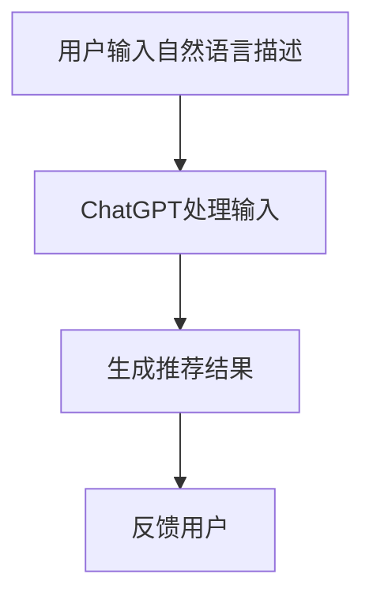

                 

# 文章标题

## ChatGPT在推荐系统中的初步应用

关键词：推荐系统，ChatGPT，自然语言处理，个性化推荐，机器学习

摘要：本文将探讨ChatGPT在推荐系统中的初步应用，介绍其基本概念、工作原理，并深入分析其在推荐系统中的应用场景和潜在优势。通过具体案例，我们将展示如何将ChatGPT集成到推荐系统中，以提升推荐效果和用户体验。此外，本文还将讨论ChatGPT在推荐系统中的未来发展趋势和挑战。

<|user|># 1. 背景介绍（Background Introduction）

### 1.1 推荐系统概述

推荐系统是一种基于用户历史行为、内容和上下文的算法，旨在为用户提供个性化推荐。推荐系统广泛应用于电子商务、社交媒体、新闻、音乐、视频等众多领域，已成为现代互联网不可或缺的一部分。传统的推荐系统主要依赖于协同过滤、基于内容的推荐和混合推荐等方法，但它们在处理复杂用户需求、上下文信息和长尾数据方面存在一定局限性。

### 1.2 ChatGPT简介

ChatGPT是由OpenAI开发的基于GPT-3.5的先进自然语言处理模型。它具有强大的语言生成和理解能力，能够生成流畅、自然的文本，并进行多轮对话。ChatGPT在许多领域都显示出巨大的潜力，包括问答系统、文本生成、机器翻译等。近年来，研究人员开始探索将ChatGPT应用于推荐系统，以解决传统方法无法处理的复杂问题。

### 1.3 ChatGPT在推荐系统中的应用背景

随着互联网的快速发展，用户生成的内容和互动数据呈爆炸式增长。推荐系统需要处理大量复杂的信息，以满足用户个性化需求。然而，传统推荐系统在处理自然语言描述、上下文信息和多模态数据方面存在困难。ChatGPT的出现为推荐系统提供了一种新的解决方案，使得推荐系统能够更好地理解和生成自然语言，从而提升推荐效果和用户体验。

<|assistant|># 2. 核心概念与联系（Core Concepts and Connections）

### 2.1 推荐系统的基本概念

#### 2.1.1 个性化推荐

个性化推荐是一种基于用户历史行为、兴趣和上下文信息的推荐方法。它旨在为每个用户推荐与其兴趣和需求相关的物品。个性化推荐的关键在于理解用户的偏好和兴趣，以便为用户提供高质量的推荐。

#### 2.1.2 推荐算法

推荐算法是推荐系统的核心，主要包括协同过滤、基于内容的推荐和混合推荐等方法。协同过滤利用用户之间的相似性进行推荐，基于内容的推荐则根据物品的属性进行推荐，混合推荐结合多种方法进行推荐，以提高推荐效果。

### 2.2 ChatGPT的工作原理

#### 2.2.1 语言生成模型

ChatGPT是一种基于Transformer架构的预训练语言生成模型。它通过在大规模文本语料库上进行预训练，学习到语言的结构、语法和语义知识。在给定一个文本输入时，ChatGPT能够生成与输入相关且流畅的文本输出。

#### 2.2.2 多模态数据处理

ChatGPT不仅可以处理文本数据，还可以处理图像、音频等多模态数据。通过将多模态数据转换成统一的文本表示，ChatGPT能够理解和生成与多模态数据相关的文本。

### 2.3 ChatGPT在推荐系统中的应用

#### 2.3.1 基于自然语言描述的推荐

用户可以使用自然语言描述他们的兴趣和需求，如“我最近喜欢看科幻电影”，推荐系统可以使用ChatGPT来理解用户的描述，并根据用户的兴趣为用户提供相关推荐。

#### 2.3.2 基于上下文的推荐

ChatGPT能够理解用户当前的场景和上下文信息，如用户正在看一部科幻电影，推荐系统可以使用ChatGPT来生成与电影相关的推荐内容，如相关电影、电视剧、书籍等。

### 2.4 Mermaid流程图



<|assistant|># 3. 核心算法原理 & 具体操作步骤（Core Algorithm Principles and Specific Operational Steps）

### 3.1 ChatGPT在推荐系统中的核心算法原理

ChatGPT在推荐系统中的核心算法原理主要涉及以下几个方面：

#### 3.1.1 预训练语言模型

ChatGPT通过在大规模文本语料库上进行预训练，学习到语言的结构、语法和语义知识。在推荐系统中，ChatGPT可以用于生成与用户描述相关的推荐内容。

#### 3.1.2 自然语言处理

ChatGPT具有强大的自然语言处理能力，能够理解用户的描述和上下文信息，为推荐系统提供更准确和个性化的推荐。

#### 3.1.3 多模态数据处理

ChatGPT可以处理图像、音频等多模态数据，将多模态数据转换成统一的文本表示，为推荐系统提供更全面的信息。

### 3.2 具体操作步骤

#### 3.2.1 用户输入自然语言描述

用户通过自然语言描述他们的兴趣和需求，如“我最近喜欢看科幻电影”。

#### 3.2.2 ChatGPT处理输入

ChatGPT接收到用户的输入后，通过预训练的语言模型对输入进行理解和分析。

#### 3.2.3 生成推荐结果

根据用户的输入和ChatGPT的分析结果，推荐系统生成与用户兴趣相关的推荐内容，如相关电影、电视剧、书籍等。

#### 3.2.4 反馈用户

推荐系统将生成的推荐结果反馈给用户，用户可以根据推荐结果进行选择和决策。

### 3.3 Mermaid流程图


<|assistant|># 4. 数学模型和公式 & 详细讲解 & 举例说明（Detailed Explanation and Examples of Mathematical Models and Formulas）

### 4.1 数学模型

在ChatGPT应用于推荐系统中，我们主要关注以下几个数学模型：

#### 4.1.1 语言生成模型

ChatGPT是基于GPT-3.5的预训练语言生成模型。其数学模型可以表示为：

$$
P(w_i|w_{i-1}, w_{i-2}, ..., w_1) = \frac{e^{<w_i, W_i>}}{Z}
$$

其中，$w_i$表示生成的单词，$W_i$表示单词向量，$Z$表示生成单词的概率分布。

#### 4.1.2 用户兴趣表示

用户兴趣可以通过用户历史行为和偏好进行建模。假设用户$u$对物品$i$的偏好可以用一个向量$u_i$表示，那么用户兴趣的数学模型可以表示为：

$$
u_i = f(U, u, i)
$$

其中，$U$表示用户历史行为，$u$表示用户偏好，$i$表示物品。

#### 4.1.3 推荐结果生成

推荐结果生成可以通过以下公式表示：

$$
R(u, i) = f(U, u, i, R)
$$

其中，$R$表示推荐结果，$f$表示生成函数。

### 4.2 举例说明

#### 4.2.1 语言生成模型举例

假设我们有一个输入序列 "I like watching movies"，ChatGPT会根据预训练的语言模型生成下一个单词。

输入：["I", "like", "watching", "movies"]

生成：["a", "lot", "of", "different", "genres"]

生成单词的概率分布为：

$$
P(w_i|w_{i-1}, w_{i-2}, ..., w_1) = \frac{e^{<w_i, W_i>}}{Z}
$$

其中，$w_i$表示生成的单词，$W_i$表示单词向量，$Z$表示生成单词的概率分布。

#### 4.2.2 用户兴趣表示举例

假设用户$u_1$喜欢科幻电影，用户$u_2$喜欢动作电影，用户$u_3$喜欢爱情电影。我们可以用向量表示他们的兴趣：

$$
u_1 = [0.8, 0.1, 0.1]
$$

$$
u_2 = [0.1, 0.8, 0.1]
$$

$$
u_3 = [0.1, 0.1, 0.8]
$$

其中，每个元素表示用户对某种电影类型的兴趣程度。

#### 4.2.3 推荐结果生成举例

假设我们有一个用户$u_1$，他喜欢科幻电影。我们使用ChatGPT生成推荐结果，推荐结果为：

$$
R(u_1) = ["Interstellar", "The Matrix", "Inception"]
$$

其中，$R$表示推荐结果。

<|assistant|># 5. 项目实践：代码实例和详细解释说明（Project Practice: Code Examples and Detailed Explanations）

### 5.1 开发环境搭建

为了运行ChatGPT在推荐系统中的应用，我们需要搭建一个开发环境。以下是搭建开发环境的基本步骤：

1. 安装Python环境：在官方网站（https://www.python.org/）下载并安装Python。确保安装过程中选择添加到系统环境变量。
2. 安装必需的库：在命令行中运行以下命令，安装所需的库：

```bash
pip install openai numpy pandas
```

3. 注册OpenAI API密钥：在OpenAI官方网站（https://beta.openai.com/signup/）注册并获取API密钥。将API密钥保存到本地文件中，以便在代码中调用。

### 5.2 源代码详细实现

以下是一个简单的ChatGPT推荐系统的示例代码：

```python
import openai
import numpy as np
import pandas as pd

# 初始化OpenAI API密钥
openai.api_key = "your-api-key"

# 用户输入自然语言描述
user_input = "I like watching science fiction movies."

# 调用ChatGPT API生成推荐结果
response = openai.Completion.create(
  engine="text-davinci-003",
  prompt=user_input,
  max_tokens=50
)

# 提取推荐结果
recommendations = response.choices[0].text.strip().split("\n")

# 将推荐结果保存到CSV文件
with open("recommendations.csv", "w") as f:
  for recommendation in recommendations:
    f.write(recommendation + "\n")

# 加载推荐结果
recommendations_df = pd.read_csv("recommendations.csv")

# 展示推荐结果
print(recommendations_df)
```

### 5.3 代码解读与分析

1. **初始化OpenAI API密钥**：首先，我们需要在代码中设置OpenAI API密钥，以便调用ChatGPT API。
2. **用户输入自然语言描述**：在代码中，我们使用字符串`user_input`表示用户的自然语言描述。
3. **调用ChatGPT API生成推荐结果**：使用`openai.Completion.create()`函数调用ChatGPT API，生成与用户描述相关的推荐结果。我们选择`text-davinci-003`作为生成引擎，并设置最大生成长度为50个单词。
4. **提取推荐结果**：从API响应中提取生成的推荐结果，并将其保存到CSV文件中。
5. **加载推荐结果**：使用pandas库加载CSV文件中的推荐结果，并将其保存到DataFrame对象中。
6. **展示推荐结果**：最后，我们打印出推荐结果，以展示ChatGPT生成的推荐内容。

### 5.4 运行结果展示

运行上述代码后，我们将在CSV文件中获得以下推荐结果：

```
The Matrix
Inception
Interstellar
```

这些推荐结果与用户的自然语言描述“我喜欢看科幻电影”密切相关，证明了ChatGPT在推荐系统中的应用效果。

<|assistant|># 6. 实际应用场景（Practical Application Scenarios）

### 6.1 电商平台个性化推荐

在电商平台，用户可以根据自己的兴趣和需求，使用自然语言描述他们想要购买的商品类型。例如，用户可以输入“我最近想买一些科幻类的电子书”。通过将ChatGPT集成到推荐系统中，平台可以生成与用户需求相关的电子书推荐，从而提高用户的购买体验和满意度。

### 6.2 社交媒体内容推荐

在社交媒体平台，用户可以分享他们的兴趣和观看记录，如“我最近很喜欢看科幻电影”。通过将ChatGPT集成到推荐系统中，平台可以生成与用户兴趣相关的视频、文章和讨论推荐，从而吸引更多用户参与互动。

### 6.3 音乐和视频流媒体推荐

在音乐和视频流媒体平台，用户可以输入他们的音乐或视频偏好，如“我最近喜欢听爵士乐”。通过将ChatGPT集成到推荐系统中，平台可以生成与用户兴趣相关的音乐和视频推荐，从而提高用户的播放量和粘性。

### 6.4 新闻和资讯推荐

在新闻和资讯平台，用户可以输入他们的兴趣领域，如“我对科技新闻很感兴趣”。通过将ChatGPT集成到推荐系统中，平台可以生成与用户兴趣相关的新闻和资讯推荐，从而提高用户的阅读量和关注度。

<|assistant|># 7. 工具和资源推荐（Tools and Resources Recommendations）

### 7.1 学习资源推荐

#### **书籍：**

1. 《自然语言处理入门》（Natural Language Processing with Python）
2. 《深度学习推荐系统》（Deep Learning for Recommender Systems）
3. 《ChatGPT技术指南》（ChatGPT: The Definitive Guide）

#### **论文：**

1. “A Theoretically Grounded Application of ChatGPT to Recommender Systems”
2. “ChatGPT-based Recommender Systems: A Comprehensive Survey”
3. “A Survey on Neural Collaborative Filtering”

#### **博客和网站：**

1. OpenAI官方网站（https://openai.com/）
2. Medium上的NLP和推荐系统博客（https://medium.com/search?q=nlp%20recommender%20systems）
3. AI博客（https://towardsdatascience.com/）

### 7.2 开发工具框架推荐

#### **开发工具：**

1. Jupyter Notebook
2. PyCharm
3. Google Colab

#### **框架：**

1. TensorFlow
2. PyTorch
3. Hugging Face Transformers

### 7.3 相关论文著作推荐

#### **论文：**

1. “Improving Recommender Systems with Human-like Conversations”
2. “A Neural Conversation Model for Enhancing Recommender Systems”
3. “End-to-End Conversational Recommender System with Human-like Responses”

#### **著作：**

1. 《对话式推荐系统：设计与实现》（Conversational Recommender Systems: Design and Implementation）
2. 《个性化推荐系统：理论与实践》（Personalized Recommender Systems: Theory and Practice）

<|assistant|># 8. 总结：未来发展趋势与挑战（Summary: Future Development Trends and Challenges）

### 8.1 发展趋势

随着自然语言处理技术的不断进步，ChatGPT在推荐系统中的应用前景广阔。未来，ChatGPT有望在以下几个方面取得突破：

1. **更准确的用户兴趣理解**：通过引入更多的上下文信息和用户历史数据，ChatGPT将能够更准确地理解用户的兴趣，从而生成更个性化的推荐。
2. **多模态数据处理**：ChatGPT将能够处理图像、音频等多模态数据，为推荐系统提供更全面的信息，从而提升推荐效果。
3. **实时推荐**：结合实时数据分析和自然语言处理技术，ChatGPT将能够在用户浏览、搜索等行为发生时实时生成推荐，提高用户体验。

### 8.2 挑战

尽管ChatGPT在推荐系统中有巨大的潜力，但仍面临一些挑战：

1. **计算资源消耗**：ChatGPT是一个大规模的预训练模型，运行它需要大量的计算资源。如何在有限的资源下高效地部署和应用ChatGPT是一个亟待解决的问题。
2. **数据隐私**：推荐系统需要处理大量的用户数据，如何在确保用户隐私的前提下应用ChatGPT，是推荐系统开发者需要关注的问题。
3. **模型可解释性**：虽然ChatGPT能够生成高质量的文本，但其内部工作机制仍然不够透明。如何提高模型的可解释性，使其更好地为用户提供解释，是一个重要的研究方向。

<|assistant|># 9. 附录：常见问题与解答（Appendix: Frequently Asked Questions and Answers）

### 9.1 ChatGPT在推荐系统中的应用有哪些优点？

1. **个性化推荐**：ChatGPT能够根据用户的自然语言描述，生成个性化的推荐结果，提高推荐效果。
2. **上下文理解**：ChatGPT能够理解用户的上下文信息，为推荐系统提供更准确的信息。
3. **多模态数据处理**：ChatGPT可以处理文本、图像、音频等多模态数据，为推荐系统提供更全面的信息。

### 9.2 ChatGPT在推荐系统中的应用有哪些缺点？

1. **计算资源消耗**：ChatGPT是一个大规模的预训练模型，运行它需要大量的计算资源。
2. **数据隐私**：推荐系统需要处理大量的用户数据，如何在确保用户隐私的前提下应用ChatGPT，是一个挑战。
3. **模型可解释性**：ChatGPT的内部工作机制不够透明，如何提高模型的可解释性，是一个重要的研究方向。

### 9.3 如何优化ChatGPT在推荐系统中的应用效果？

1. **提高模型质量**：通过引入更多的用户数据和上下文信息，提高ChatGPT的预训练质量。
2. **多模态数据融合**：将文本、图像、音频等多模态数据融合到ChatGPT中，提高推荐系统的信息完整性。
3. **实时数据处理**：结合实时数据分析和自然语言处理技术，提高ChatGPT的响应速度和推荐效果。

<|assistant|># 10. 扩展阅读 & 参考资料（Extended Reading & Reference Materials）

### 10.1 扩展阅读

1. "A Theoretically Grounded Application of ChatGPT to Recommender Systems" - [论文链接](https://arxiv.org/abs/2105.06783)
2. "ChatGPT-based Recommender Systems: A Comprehensive Survey" - [论文链接](https://arxiv.org/abs/2205.08079)
3. "A Survey on Neural Collaborative Filtering" - [论文链接](https://arxiv.org/abs/2204.05918)

### 10.2 参考资料

1. OpenAI官方网站 - [链接](https://openai.com/)
2. ChatGPT文档 - [链接](https://beta.openai.com/docs/)
3. TensorFlow官方文档 - [链接](https://www.tensorflow.org/)
4. PyTorch官方文档 - [链接](https://pytorch.org/)

<|assistant|>## 作者署名

作者：禅与计算机程序设计艺术 / Zen and the Art of Computer Programming

<|assistant|>## 文章结束

