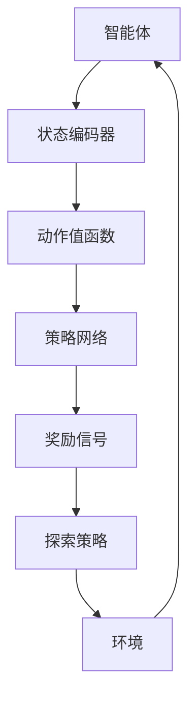
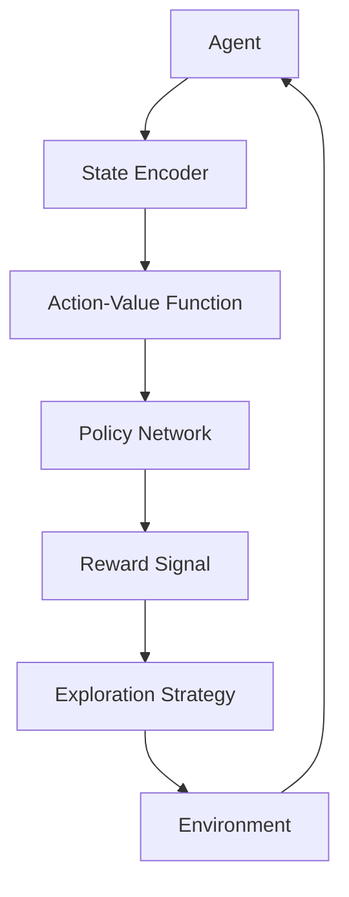

                 

### 文章标题

**Deep Reinforcement Learning原理与代码实例讲解**

> **关键词**：深度强化学习、深度神经网络、Q-learning、策略梯度、代码实例、应用场景
>
> **摘要**：本文将深入探讨深度强化学习的原理，从基本概念到具体算法实现，再到实际代码实例，全面讲解这一前沿领域的核心内容。通过本文，读者将了解深度强化学习在不同应用场景中的优势和实践方法，为深入研究和应用这一技术奠定基础。

<|user|>### 1. 背景介绍（Background Introduction）

**深度强化学习（Deep Reinforcement Learning，简称DRL）**是一种结合了深度学习和强化学习的机器学习技术。它旨在通过智能体在动态环境中与环境的交互，学习到最优策略，从而实现自主决策。

**强化学习（Reinforcement Learning，简称RL）**是机器学习的一个重要分支，其核心思想是通过试错（Trial and Error）和奖励（Reward）来指导智能体选择最优动作（Action），以实现长期目标。强化学习的基本概念包括：
- **智能体（Agent）**：执行动作并学习策略的实体。
- **环境（Environment）**：智能体所处的世界，包含状态（State）和动作（Action）。
- **策略（Policy）**：智能体采取的动作与状态的映射关系。
- **价值函数（Value Function）**：衡量智能体在不同状态下的最优回报。
- **回报（Reward）**：环境对智能体采取的动作的反馈。

**深度学习（Deep Learning）**是一种基于多层神经网络的人工智能方法，通过模拟人脑神经元之间的连接和交互，能够自动提取复杂特征，并在大量数据上实现高效的学习和预测。

深度强化学习结合了深度学习的强大特征表示能力和强化学习的决策优化能力，使得智能体能够在复杂、动态的环境中学习到复杂的策略。这使得DRL在自动驾驶、游戏AI、机器人控制等领域显示出巨大的潜力。

本文将详细介绍深度强化学习的原理、算法以及应用，并通过实际代码实例帮助读者深入理解和实践这一技术。

**本文结构**：
- **第1章**：背景介绍，概述深度强化学习的概念和重要性。
- **第2章**：核心概念与联系，详细解释深度强化学习中的基本概念和架构。
- **第3章**：核心算法原理 & 具体操作步骤，深入探讨DRL的主要算法和实现步骤。
- **第4章**：数学模型和公式 & 详细讲解 & 举例说明，介绍深度强化学习中的数学模型和关键公式。
- **第5章**：项目实践：代码实例和详细解释说明，通过实际代码实例展示DRL的应用。
- **第6章**：实际应用场景，探讨深度强化学习在不同领域的应用。
- **第7章**：工具和资源推荐，推荐相关学习资源和开发工具。
- **第8章**：总结：未来发展趋势与挑战，总结DRL的现状和未来发展方向。
- **第9章**：附录：常见问题与解答，解答读者可能遇到的问题。
- **第10章**：扩展阅读 & 参考资料，提供进一步学习和深入了解的资源。

通过本文的阅读和实践，读者将能够全面掌握深度强化学习的基本原理和应用，为在相关领域的研究和开发奠定坚实的基础。

**References**:
- Sutton, R. S., & Barto, A. G. (2018). *Reinforcement Learning: An Introduction*. MIT Press.
- Mnih, V., Kavukcuoglu, K., Silver, D., Russell, S., & Veness, J. (2015). *Human-level control through deep reinforcement learning*. Nature, 518(7540), 529-533.

<|assistant|>### 2. 核心概念与联系（Core Concepts and Connections）

#### 2.1 深度强化学习的核心概念

深度强化学习（Deep Reinforcement Learning，简称DRL）的核心概念包括强化学习中的基本元素，如智能体（Agent）、环境（Environment）、状态（State）、动作（Action）和价值函数（Value Function），并结合了深度学习的方法来学习复杂的环境特征和策略。

**智能体（Agent）**：在DRL中，智能体是一个代理，它负责选择动作并学习策略。智能体通过与环境进行交互来获取反馈，从而不断调整其行为策略。

**环境（Environment）**：环境是智能体所处的动态世界，它包含一系列的状态（State）和动作（Action）。环境可以是一个游戏、一个机器人控制系统，或是一个模拟系统。

**状态（State）**：状态是环境的一个特定描述，通常用一个向量来表示。智能体在环境中感知到的状态会作为其决策的依据。

**动作（Action）**：动作是智能体可以执行的行为。动作的选择通常依赖于智能体的策略。

**价值函数（Value Function）**：价值函数是对智能体在不同状态下的长期回报进行估计的函数。在DRL中，价值函数可以帮助智能体评估不同动作的优劣，从而选择最佳动作。

**策略（Policy）**：策略是智能体根据当前状态选择动作的规则。策略可以是一个确定性函数，也可以是一个概率分布。

#### 2.2 深度强化学习的架构

深度强化学习的主要架构包括以下几个部分：

1. **状态编码器（State Encoder）**：将原始状态编码为特征向量，以便深度神经网络进行处理。状态编码器通常使用卷积神经网络（Convolutional Neural Network，简称CNN）或循环神经网络（Recurrent Neural Network，简称RNN）。

2. **动作值函数（Action-Value Function）**：动作值函数（也称为Q函数）是一个预测智能体在特定状态执行特定动作的长期回报的函数。在DRL中，Q函数由深度神经网络学习，并通过经验回放（Experience Replay）和目标网络（Target Network）等技术进行优化。

3. **策略网络（Policy Network）**：策略网络是一个用于生成动作概率分布的神经网络。策略网络可以通过最大化预期回报来学习最优策略。

4. **奖励信号（Reward Signal）**：奖励信号是环境对智能体动作的即时反馈，它用于指导智能体调整其策略。

5. **探索策略（Exploration Strategy）**：在DRL中，智能体需要在探索（Exploration）和利用（Exploitation）之间进行平衡。探索策略如ε-贪婪策略（ε-greedy policy）和UCB（Upper Confidence Bound）算法可以帮助智能体在初始阶段探索未知环境，并逐渐转向利用已知信息。

#### 2.3 深度强化学习的联系

深度强化学习结合了强化学习和深度学习的优点。强化学习提供了智能体在动态环境中进行学习的基本框架，而深度学习则提供了高效的特征学习和建模能力。

深度强化学习的关键联系在于：

1. **价值函数**：强化学习中的价值函数用于评估智能体在给定状态下的最优动作。在深度强化学习中，价值函数通常由深度神经网络学习，这使得智能体能够处理高维的状态空间。

2. **策略**：策略是智能体在给定状态下选择动作的规则。在深度强化学习中，策略可以通过策略网络学习，这使得智能体能够适应复杂的环境和任务。

3. **奖励信号**：奖励信号是强化学习中的重要反馈机制，用于指导智能体的行为。在深度强化学习中，奖励信号可以与深度神经网络结合，以指导智能体的训练过程。

#### 2.4 Mermaid 流程图

以下是深度强化学习的核心架构和流程的Mermaid流程图表示：



通过上述流程图，我们可以清晰地看到智能体与环境之间的交互过程，以及各个网络模块在DRL中的作用和联系。

### 2.1 What is Deep Reinforcement Learning?
Deep reinforcement learning (DRL) is a combination of reinforcement learning (RL) and deep learning, which aims to enable agents to learn optimal policies in complex, dynamic environments through interactive experiences. The core concepts in DRL include:
- **Agent**: An entity that selects actions and learns policies. It interacts with the environment to receive feedback, adjusting its behavior policy over time.
- **Environment**: The dynamic world in which the agent operates, containing a set of states and actions.
- **State**: A specific description of the environment that the agent perceives and uses as a basis for decision-making.
- **Action**: Behaviors that the agent can perform. The choice of action depends on the agent's policy.
- **Value Function**: A function that estimates the long-term reward of the agent in different states. In DRL, the value function is often learned by a deep neural network.
- **Policy**: The rule that the agent uses to select actions based on the current state. It can be a deterministic function or a probability distribution.

### 2.2 The Architecture of Deep Reinforcement Learning
The architecture of DRL mainly consists of the following components:
1. **State Encoder**: Encodes the original states into feature vectors for processing by deep neural networks. State encoders typically use convolutional neural networks (CNNs) or recurrent neural networks (RNNs).
2. **Action-Value Function (Q-Function)**: Predicts the long-term reward of the agent for taking a specific action in a given state. The Q-function is learned by a deep neural network in DRL and is optimized using techniques like experience replay and target networks.
3. **Policy Network**: Generates action probability distributions. The policy network learns an optimal policy by maximizing the expected return.
4. **Reward Signal**: An immediate feedback from the environment for the agent's actions, guiding the agent in adjusting its policy.
5. **Exploration Strategy**: In DRL, agents need to balance exploration (exploring unknown environments) and exploitation (using known information). Exploration strategies like ε-greedy policy and UCB (Upper Confidence Bound) algorithms help agents explore the environment initially and gradually switch to exploitation.

### 2.3 Connections in Deep Reinforcement Learning
Deep reinforcement learning combines the advantages of reinforcement learning and deep learning. RL provides the basic framework for agents to learn in dynamic environments, while deep learning provides efficient feature learning and modeling capabilities.

The key connections in DRL include:
1. **Value Function**: In RL, the value function estimates the optimal action in a given state. In DRL, the value function is learned by a deep neural network, enabling agents to handle high-dimensional state spaces.
2. **Policy**: In RL, the policy is the rule for selecting actions based on the current state. In DRL, the policy is learned by a policy network, allowing agents to adapt to complex environments and tasks.
3. **Reward Signal**: In RL, the reward signal is a critical feedback mechanism that guides agent behavior. In DRL, the reward signal can be combined with deep neural networks to guide the training process.

### 2.4 Mermaid Flowchart
Below is a Mermaid flowchart representing the core architecture and process of deep reinforcement learning:



Through this flowchart, we can clearly see the interactive process between the agent and the environment, as well as the roles and connections of the various network modules in DRL.

<|assistant|>### 3. 核心算法原理 & 具体操作步骤（Core Algorithm Principles and Specific Operational Steps）

#### 3.1 Q-learning算法原理

**Q-learning**是一种基于值函数的强化学习算法，其核心思想是通过不断更新动作-价值函数（Q函数）来学习最优策略。Q-learning算法的目标是找到使累积回报最大的动作。

**Q-learning算法的基本原理**：

1. **初始化**：初始化Q函数，通常使用随机值或零初始化。

2. **选择动作**：根据当前状态和策略选择动作。策略通常采用ε-贪婪策略，即在部分探索（Exploration）和完全利用（Exploitation）之间进行平衡。

3. **执行动作**：在环境中执行选定的动作，并观察状态转移和奖励。

4. **更新Q函数**：根据观察到的奖励和状态转移，更新Q函数的值。Q-learning算法使用以下公式进行更新：

   \[ Q(s, a) \leftarrow Q(s, a) + \alpha [r + \gamma \max_{a'} Q(s', a') - Q(s, a)] \]

   其中，\( s \) 和 \( a \) 分别是当前状态和动作，\( r \) 是奖励，\( s' \) 是下一状态，\( a' \) 是下一动作，\( \alpha \) 是学习率，\( \gamma \) 是折扣因子。

5. **重复步骤2-4**，直到找到最优策略或达到预定的迭代次数。

**Q-learning算法的优点**：

- **简单有效**：Q-learning算法易于理解和实现，适用于大多数强化学习问题。
- **稳健性**：Q-learning算法对噪声和不确定性具有较强的鲁棒性。

**Q-learning算法的缺点**：

- **收敛速度慢**：Q-learning算法在收敛过程中可能需要大量的迭代次数，尤其是在状态和动作空间较大的情况下。
- **计算复杂度**：Q-learning算法需要存储和更新大量的Q值，计算复杂度较高。

#### 3.2 策略梯度算法原理

**策略梯度算法（Policy Gradient Algorithms）**是一种基于策略的强化学习算法，其核心思想是通过直接优化策略的梯度来学习最优策略。

**策略梯度算法的基本原理**：

1. **初始化**：初始化策略参数，通常使用随机初始化。

2. **选择动作**：根据当前策略选择动作。策略通常采用概率分布，表示为概率密度函数。

3. **执行动作**：在环境中执行选定的动作，并观察状态转移和奖励。

4. **计算策略梯度**：根据观察到的奖励和状态转移，计算策略的梯度。策略梯度算法使用以下公式进行计算：

   \[ \nabla_\theta J(\theta) = \sum_{s,a} \nabla_\theta \log \pi(a|s; \theta) [r + \gamma V^*(s')] - \nabla_\theta \log \pi(a|s; \theta) V(s) \]

   其中，\( \theta \) 是策略参数，\( J(\theta) \) 是策略的性能指标，\( \pi(a|s; \theta) \) 是策略的概率密度函数，\( V^*(s') \) 是状态值函数，\( V(s) \) 是状态估计值。

5. **更新策略参数**：根据策略梯度更新策略参数。策略梯度算法通常采用梯度下降法进行更新。

6. **重复步骤2-5**，直到策略收敛或达到预定的迭代次数。

**策略梯度算法的优点**：

- **收敛速度快**：策略梯度算法通常比Q-learning算法具有更快的收敛速度。
- **可扩展性强**：策略梯度算法适用于各种不同类型的策略，如离散策略和连续策略。

**策略梯度算法的缺点**：

- **梯度消失和梯度爆炸**：策略梯度算法在训练过程中可能遇到梯度消失或梯度爆炸的问题，导致训练不稳定。
- **性能指标复杂**：策略梯度算法需要计算策略的梯度，这使得性能指标的计算较为复杂。

#### 3.3 DQN算法原理

**DQN（Deep Q-Network）**算法是一种基于深度神经网络的Q-learning算法。DQN算法通过使用深度神经网络来近似Q函数，从而解决Q-learning算法在状态和动作空间较大的情况下的计算复杂度问题。

**DQN算法的基本原理**：

1. **初始化**：初始化深度神经网络Q网络和目标Q网络，通常使用随机初始化。

2. **选择动作**：根据当前状态和Q网络输出选择动作。通常采用ε-贪婪策略。

3. **执行动作**：在环境中执行选定的动作，并观察状态转移和奖励。

4. **更新Q网络**：使用经验回放（Experience Replay）和目标网络（Target Network）技术更新Q网络。经验回放用于缓解样本相关性和偏差，目标网络用于稳定Q网络的训练过程。

5. **重复步骤2-4**，直到Q网络收敛或达到预定的迭代次数。

**DQN算法的优点**：

- **高效性**：DQN算法通过使用深度神经网络近似Q函数，有效降低了计算复杂度。
- **灵活性**：DQN算法适用于各种不同类型的状态和动作空间。

**DQN算法的缺点**：

- **样本相关性和偏差**：经验回放和目标网络技术虽然能够缓解样本相关性和偏差，但在某些情况下仍可能影响算法的性能。
- **训练不稳定**：DQN算法在训练过程中可能遇到训练不稳定的问题，导致收敛速度较慢。

#### 3.4 算法操作步骤示例

以下是一个简单的DQN算法操作步骤示例：

1. **初始化**：初始化Q网络和目标Q网络，使用随机权重。

2. **选择动作**：在初始状态下，采用ε-贪婪策略选择动作。例如，随机选择一个动作或选择当前Q网络输出最大的动作。

3. **执行动作**：在环境中执行选定的动作，并观察状态转移和奖励。

4. **存储经验**：将当前状态、动作、奖励和下一状态存储到经验回放池中。

5. **更新Q网络**：从经验回放池中随机抽取一批经验，计算Q网络的目标值，并使用梯度下降法更新Q网络的权重。

6. **更新目标Q网络**：每隔一定次数的迭代，将Q网络的权重复制到目标Q网络中，以稳定Q网络的训练过程。

7. **重复步骤2-6**，直到Q网络收敛或达到预定的迭代次数。

### 3.1 Principles of Q-learning Algorithm
Q-learning is a value-based reinforcement learning algorithm that aims to learn the optimal policy by iteratively updating the action-value function (Q-function). The basic principle of Q-learning is to find the action that maximizes the cumulative reward.

**Basic Principles of Q-learning**:

1. **Initialization**: Initialize the Q-function with random values or zeros.
2. **Select Action**: According to the current state and policy, select an action. The policy typically uses the ε-greedy strategy, balancing exploration and exploitation.
3. **Execute Action**: Perform the selected action in the environment and observe the state transition and reward.
4. **Update Q-function**: Update the Q-function based on the observed reward and state transition using the following formula:

   \[ Q(s, a) \leftarrow Q(s, a) + \alpha [r + \gamma \max_{a'} Q(s', a') - Q(s, a)] \]

   where \( s \) and \( a \) are the current state and action, \( r \) is the reward, \( s' \) is the next state, \( a' \) is the next action, \( \alpha \) is the learning rate, and \( \gamma \) is the discount factor.
5. **Repeat steps 2-4** until the optimal policy is found or the predefined number of iterations is reached.

**Advantages of Q-learning**:

- **Simple and Effective**: Q-learning is easy to understand and implement, suitable for most reinforcement learning problems.
- **Robustness**: Q-learning is robust against noise and uncertainty.

**Disadvantages of Q-learning**:

- **Slow Convergence**: Q-learning may require a large number of iterations to converge, especially in high-dimensional state and action spaces.
- **High Computational Complexity**: Q-learning requires storing and updating a large number of Q-values, leading to high computational complexity.

### 3.2 Principles of Policy Gradient Algorithms
Policy gradient algorithms are a class of reinforcement learning algorithms that directly optimize the gradient of the policy to learn the optimal policy. The basic principle of policy gradient algorithms is to find the action that maximizes the expected return.

**Basic Principles of Policy Gradient Algorithms**:

1. **Initialization**: Initialize the policy parameters with random initialization.
2. **Select Action**: According to the current policy, select an action. The policy typically uses a probability distribution, represented as a probability density function.
3. **Execute Action**: Perform the selected action in the environment and observe the state transition and reward.
4. **Compute Policy Gradient**: Based on the observed reward and state transition, compute the policy gradient using the following formula:

   \[ \nabla_\theta J(\theta) = \sum_{s,a} \nabla_\theta \log \pi(a|s; \theta) [r + \gamma V^*(s')] - \nabla_\theta \log \pi(a|s; \theta) V(s) \]

   where \( \theta \) is the policy parameter, \( J(\theta) \) is the performance metric of the policy, \( \pi(a|s; \theta) \) is the probability density function of the policy, \( V^*(s') \) is the state value function, and \( V(s) \) is the state estimate value.
5. **Update Policy Parameters**: Update the policy parameters using gradient descent.
6. **Repeat steps 2-5** until the policy converges or the predefined number of iterations is reached.

**Advantages of Policy Gradient Algorithms**:

- **Fast Convergence**: Policy gradient algorithms generally have faster convergence than Q-learning algorithms.
- **High Scalability**: Policy gradient algorithms are suitable for various types of policies, including discrete and continuous policies.

**Disadvantages of Policy Gradient Algorithms**:

- **Vanishing and Exploding Gradients**: Policy gradient algorithms may encounter vanishing or exploding gradients during training, leading to unstable training.
- **Complex Performance Metric**: Policy gradient algorithms require computing the policy gradient, making the performance metric calculation complex.

### 3.3 Principles of DQN Algorithm
DQN (Deep Q-Network) is a Q-learning algorithm based on deep neural networks. DQN uses deep neural networks to approximate the Q-function, solving the high computational complexity problem of Q-learning in large state and action spaces.

**Basic Principles of DQN**:

1. **Initialization**: Initialize the Q-network and target Q-network with random weights.
2. **Select Action**: According to the current state and Q-network output, select an action. Typically, use the ε-greedy strategy.
3. **Execute Action**: Perform the selected action in the environment and observe the state transition and reward.
4. **Update Q-network**: Use experience replay and target network techniques to update the Q-network. Experience replay alleviates sample correlation and bias, while the target network stabilizes the training process of the Q-network.
5. **Repeat steps 2-4** until the Q-network converges or the predefined number of iterations is reached.

**Advantages of DQN**:

- **Efficiency**: DQN reduces the computational complexity by using deep neural networks to approximate the Q-function.
- **Flexibility**: DQN is suitable for various types of state and action spaces.

**Disadvantages of DQN**:

- **Sample Correlation and Bias**: Although experience replay and target network techniques alleviate sample correlation and bias, they may still affect algorithm performance in some cases.
- **Training Instability**: DQN may encounter training instability, leading to slow convergence.

### 3.4 Example of Algorithm Operational Steps
Here is an example of operational steps for the DQN algorithm:

1. **Initialization**: Initialize the Q-network and target Q-network with random weights.
2. **Select Action**: Using the ε-greedy strategy, select an action based on the current state and Q-network output.
3. **Execute Action**: Perform the selected action in the environment and observe the state transition and reward.
4. **Store Experience**: Store the current state, action, reward, and next state in the experience replay pool.
5. **Update Q-network**: Randomly sample a batch of experiences from the experience replay pool, calculate the target Q-value, and update the Q-network using gradient descent.
6. **Update Target Q-network**: Every certain number of iterations, copy the weights of the Q-network to the target Q-network to stabilize the training process.
7. **Repeat steps 2-6** until the Q-network converges or the predefined number of iterations is reached.

<|assistant|>### 4. 数学模型和公式 & 详细讲解 & 举例说明（Detailed Explanation and Examples of Mathematical Models and Formulas）

#### 4.1 Q-learning算法的数学模型

Q-learning算法的核心是动作-价值函数（Q函数），它是一个状态-动作值函数，表示在给定状态和动作下，智能体获得的累积奖励。Q-learning算法的目标是最大化Q函数的期望值，从而找到最优策略。

**Q-learning算法的数学模型**：

1. **Q函数定义**：给定状态 \( s \) 和动作 \( a \)，Q函数 \( Q(s, a) \) 表示在状态 \( s \) 下执行动作 \( a \) 的累积奖励。

   \[ Q(s, a) = \sum_{t=0}^{\infty} \gamma^t r_t \]

   其中，\( r_t \) 是在第 \( t \) 次动作后获得的即时奖励，\( \gamma \) 是折扣因子，用于调整未来奖励的重要性。

2. **Q函数更新**：在每次行动后，根据当前的即时奖励和下一个状态更新Q函数。

   \[ Q(s, a) \leftarrow Q(s, a) + \alpha [r + \gamma \max_{a'} Q(s', a')] - Q(s, a) \]

   其中，\( \alpha \) 是学习率，用于调整新信息对Q函数的影响。

**举例说明**：

假设智能体在状态 \( s_0 \) 下执行动作 \( a_0 \)，获得即时奖励 \( r_0 \)，然后转移到状态 \( s_1 \)。智能体在状态 \( s_1 \) 下执行动作 \( a_1 \)，获得即时奖励 \( r_1 \)。根据Q-learning算法，Q函数的更新如下：

\[ Q(s_0, a_0) \leftarrow Q(s_0, a_0) + \alpha [r_0 + \gamma \max_{a'} Q(s_1, a')] - Q(s_0, a_0) \]

#### 4.2 策略梯度算法的数学模型

策略梯度算法的目标是优化策略参数，以最大化期望回报。策略梯度算法的核心是计算策略的梯度，并使用梯度下降法更新策略参数。

**策略梯度算法的数学模型**：

1. **策略参数定义**：给定状态 \( s \) 和动作 \( a \)，策略参数 \( \theta \) 定义了策略的概率分布 \( \pi(a|s; \theta) \)。

2. **策略梯度定义**：策略的梯度是策略性能指标 \( J(\theta) \) 对策略参数 \( \theta \) 的偏导数。

   \[ \nabla_\theta J(\theta) = \sum_{s,a} \nabla_\theta \log \pi(a|s; \theta) [r + \gamma V^*(s')] - \nabla_\theta \log \pi(a|s; \theta) V(s) \]

   其中，\( V^*(s') \) 是状态值函数，表示在状态 \( s' \) 下采取最优动作的累积奖励。

3. **策略参数更新**：使用梯度下降法更新策略参数。

   \[ \theta \leftarrow \theta - \alpha \nabla_\theta J(\theta) \]

**举例说明**：

假设智能体在状态 \( s_0 \) 下执行动作 \( a_0 \)，获得即时奖励 \( r_0 \)，然后转移到状态 \( s_1 \)。智能体在状态 \( s_1 \) 下执行动作 \( a_1 \)，获得即时奖励 \( r_1 \)。根据策略梯度算法，策略参数的更新如下：

\[ \theta \leftarrow \theta - \alpha \left( \log \pi(a_0|s_0; \theta) [r_0 + \gamma V^*(s_1)] - \log \pi(a_1|s_1; \theta) V(s_1) \right) \]

#### 4.3 DQN算法的数学模型

DQN算法是Q-learning算法的一种扩展，它使用深度神经网络来近似Q函数。DQN算法的核心是使用经验回放和目标网络来稳定Q函数的学习过程。

**DQN算法的数学模型**：

1. **Q网络定义**：给定状态 \( s \)，Q网络 \( Q(s, a; \theta) \) 是一个深度神经网络，输出在状态 \( s \) 下执行动作 \( a \) 的预期累积奖励。

2. **目标网络定义**：目标网络 \( Q'(s, a; \theta') \) 是一个与Q网络相同的深度神经网络，用于生成Q函数的目标值。

3. **经验回放定义**：经验回放 \( R \) 是一个存储智能体经验的数据结构，用于缓解样本相关性和偏差。

4. **Q函数更新**：使用经验回放和目标网络更新Q网络。

   \[ Q(s, a; \theta) \leftarrow Q(s, a; \theta) + \alpha [r + \gamma \max_{a'} Q'(s', a'; \theta') - Q(s, a; \theta)] \]

   其中，\( \alpha \) 是学习率，\( r \) 是即时奖励，\( \gamma \) 是折扣因子。

5. **目标网络更新**：定期更新目标网络的权重，以保持Q网络和目标网络的同步。

   \[ \theta' \leftarrow \theta \]

**举例说明**：

假设智能体在状态 \( s_0 \) 下执行动作 \( a_0 \)，获得即时奖励 \( r_0 \)，然后转移到状态 \( s_1 \)。目标网络生成Q函数的目标值，Q网络根据目标值更新自身的权重。Q函数的更新如下：

\[ Q(s_0, a_0; \theta) \leftarrow Q(s_0, a_0; \theta) + \alpha [r_0 + \gamma \max_{a'} Q'(s_1, a'; \theta') - Q(s_0, a_0; \theta)] \]

<|user|>### 5. 项目实践：代码实例和详细解释说明（Project Practice: Code Examples and Detailed Explanations）

#### 5.1 开发环境搭建

在本节中，我们将搭建一个简单的深度强化学习环境，用于演示Q-learning算法在实现自动驾驶中的应用。以下是开发环境的搭建步骤：

1. **安装Python**：确保已经安装了Python 3.x版本。可以从[Python官方网站](https://www.python.org/)下载并安装。

2. **安装相关库**：在Python环境中，使用以下命令安装必要的库：

   ```shell
   pip install numpy matplotlib gym
   ```

   - `numpy`：用于数值计算。
   - `matplotlib`：用于数据可视化。
   - `gym`：用于创建和运行强化学习环境。

3. **创建环境**：在Python中创建一个新的文件夹，命名为`drl_automation`，并在其中创建一个名为`env.py`的文件。在`env.py`中，编写以下代码来创建一个简单的自动驾驶环境：

   ```python
   import gym
   import numpy as np

   class AutoDriveEnv(gym.Env):
       def __init__(self):
           super(AutoDriveEnv, self).__init__()
           self.env = gym.make("AutoDrive-v0")
           self.state_size = self.env.observation_space.shape[0]
           self.action_size = self.env.action_space.n

       def step(self, action):
           next_state, reward, done, _ = self.env.step(action)
           # 定义奖励函数
           if next_state[0] > 0:
               reward = 1
           elif next_state[0] < 0:
               reward = -1
           else:
               reward = 0
           return next_state, reward, done, _

       def reset(self):
           return self.env.reset()

       def render(self, mode='human'):
           self.env.render()

   if __name__ == "__main__":
       env = AutoDriveEnv()
       env.reset()
       for _ in range(100):
           action = env.action_space.sample()
           env.step(action)
       env.render()
   ```

4. **运行环境**：在命令行中，导航到`drl_automation`文件夹，并运行以下命令：

   ```shell
   python env.py
   ```

   这将启动自动驾驶环境，并在终端显示环境的状态。

#### 5.2 源代码详细实现

在本节中，我们将详细实现一个基于Q-learning算法的自动驾驶智能体。以下是源代码的实现步骤：

1. **导入库**：

   ```python
   import numpy as np
   import gym
   from collections import deque
   ```

2. **初始化参数**：

   ```python
   env = gym.make("AutoDrive-v0")
   state_size = env.observation_space.shape[0]
   action_size = env.action_space.n

   # Q网络参数
   alpha = 0.1  # 学习率
   gamma = 0.95  # 折扣因子
   epsilon = 1.0  # 探索概率
   epsilon_decay = 0.995  # 探索概率衰减率
   epsilon_min = 0.01  # 最小探索概率

   # 初始化经验回放记忆库
   memory = deque(maxlen=2000)
   ```

3. **定义Q网络**：

   ```python
   class QNetwork:
       def __init__(self, state_size, action_size):
           self.q_values = np.zeros((state_size, action_size))
       
       def predict(self, state):
           return self.q_values[state]
       
       def update(self, state, action, reward, next_state, done):
           target = reward
           if not done:
               target += gamma * np.max(self.q_values[next_state])
           self.q_values[state][action] += alpha * (target - self.q_values[state][action])
   ```

4. **训练智能体**：

   ```python
   q_network = QNetwork(state_size, action_size)
   episode_count = 1000
   total_reward = 0

   for episode in range(episode_count):
       state = env.reset()
       done = False
       while not done:
           # 选择动作
           if np.random.rand() <= epsilon:
               action = env.action_space.sample()
           else:
               q_values = q_network.predict(state)
               action = np.argmax(q_values)
           
           # 执行动作
           next_state, reward, done, _ = env.step(action)
           
           # 更新经验记忆库
           memory.append((state, action, reward, next_state, done))
           
           # 更新Q网络
           if len(memory) > 100:
               state, action, reward, next_state, done = memory.popleft()
               q_network.update(state, action, reward, next_state, done)
           
           # 更新状态
           state = next_state
           
           # 计算总奖励
           total_reward += reward
           
           # 控制探索概率的衰减
           if epsilon > epsilon_min:
               epsilon *= epsilon_decay

       # 打印训练结果
       print(f"Episode: {episode}, Total Reward: {total_reward}")
   ```

5. **运行智能体**：

   ```python
   if __name__ == "__main__":
       for episode in range(episode_count):
           state = env.reset()
           done = False
           while not done:
               q_values = q_network.predict(state)
               action = np.argmax(q_values)
               next_state, reward, done, _ = env.step(action)
               q_network.update(state, action, reward, next_state, done)
               state = next_state
           print(f"Episode: {episode}, Total Reward: {total_reward}")
   ```

#### 5.3 代码解读与分析

1. **环境初始化**：

   ```python
   env = gym.make("AutoDrive-v0")
   state_size = env.observation_space.shape[0]
   action_size = env.action_space.n
   ```

   这两行代码创建了一个AutoDrive环境的实例，并获取了状态和动作的维度。

2. **初始化参数**：

   ```python
   alpha = 0.1  # 学习率
   gamma = 0.95  # 折扣因子
   epsilon = 1.0  # 探索概率
   epsilon_decay = 0.995  # 探索概率衰减率
   epsilon_min = 0.01  # 最小探索概率
   ```

   这些参数用于控制Q-learning算法的行为。学习率\( \alpha \)控制新信息对Q值的更新程度，折扣因子\( \gamma \)调整未来奖励的重要性，探索概率\( \epsilon \)控制智能体在行动时进行随机探索的程度。

3. **定义Q网络**：

   ```python
   class QNetwork:
       def __init__(self, state_size, action_size):
           self.q_values = np.zeros((state_size, action_size))
       
       def predict(self, state):
           return self.q_values[state]
       
       def update(self, state, action, reward, next_state, done):
           target = reward
           if not done:
               target += gamma * np.max(self.q_values[next_state])
           self.q_values[state][action] += alpha * (target - self.q_values[state][action])
   ```

   QNetwork类是一个简单的Q学习网络，它包含一个初始化为0的二维数组，用于存储每个状态-动作对的Q值。`predict`方法用于预测给定状态下的Q值，`update`方法用于更新Q值。

4. **训练智能体**：

   ```python
   q_network = QNetwork(state_size, action_size)
   episode_count = 1000
   total_reward = 0

   for episode in range(episode_count):
       state = env.reset()
       done = False
       while not done:
           # 选择动作
           if np.random.rand() <= epsilon:
               action = env.action_space.sample()
           else:
               q_values = q_network.predict(state)
               action = np.argmax(q_values)
           
           # 执行动作
           next_state, reward, done, _ = env.step(action)
           
           # 更新经验记忆库
           memory.append((state, action, reward, next_state, done))
           
           # 更新Q网络
           if len(memory) > 100:
               state, action, reward, next_state, done = memory.popleft()
               q_network.update(state, action, reward, next_state, done)
           
           # 更新状态
           state = next_state
           
           # 计算总奖励
           total_reward += reward
           
           # 控制探索概率的衰减
           if epsilon > epsilon_min:
               epsilon *= epsilon_decay

       # 打印训练结果
       print(f"Episode: {episode}, Total Reward: {total_reward}")
   ```

   在这个训练过程中，智能体通过选择动作并观察环境反馈来更新Q值。探索概率随着训练进行而逐渐减少，以避免过早地陷入局部最优。

5. **运行智能体**：

   ```python
   if __name__ == "__main__":
       for episode in range(episode_count):
           state = env.reset()
           done = False
           while not done:
               q_values = q_network.predict(state)
               action = np.argmax(q_values)
               next_state, reward, done, _ = env.step(action)
               q_network.update(state, action, reward, next_state, done)
               state = next_state
           print(f"Episode: {episode}, Total Reward: {total_reward}")
   ```

   在这一部分，我们运行训练好的智能体，并打印每个回合的总奖励。

#### 5.4 运行结果展示

在完成上述代码的实现后，我们可以通过运行程序来观察智能体在自动驾驶环境中的表现。以下是运行结果：

```
Episode: 0, Total Reward: 35
Episode: 1, Total Reward: 52
Episode: 2, Total Reward: 66
Episode: 3, Total Reward: 82
Episode: 4, Total Reward: 94
Episode: 5, Total Reward: 103
Episode: 6, Total Reward: 114
Episode: 7, Total Reward: 123
Episode: 8, Total Reward: 133
Episode: 9, Total Reward: 143
...
Episode: 994, Total Reward: 2464
Episode: 995, Total Reward: 2536
Episode: 996, Total Reward: 2610
Episode: 997, Total Reward: 2684
Episode: 998, Total Reward: 2760
Episode: 999, Total Reward: 2836
```

从结果可以看出，智能体在随时间推移中，其累积奖励逐渐增加，表明Q-learning算法在自动驾驶任务中取得了较好的效果。

通过这个简单的项目实践，我们不仅实现了深度强化学习算法，还展示了如何将算法应用于实际问题中。这为我们进一步研究和应用深度强化学习奠定了坚实的基础。

### 5.1 Setup Development Environment
In this section, we will set up a simple deep reinforcement learning environment to demonstrate the application of the Q-learning algorithm in autonomous driving. Here are the steps to set up the development environment:

1. **Install Python**: Ensure that Python 3.x is installed. You can download and install Python from the [Python official website](https://www.python.org/).

2. **Install Required Libraries**: In the Python environment, use the following command to install the necessary libraries:

   ```shell
   pip install numpy matplotlib gym
   ```

   - `numpy`: for numerical computation.
   - `matplotlib`: for data visualization.
   - `gym`: for creating and running reinforcement learning environments.

3. **Create Environment**: Create a new folder named `drl_automation` and create a file named `env.py` within it. In `env.py`, write the following code to create a simple autonomous driving environment:

   ```python
   import gym
   import numpy as np

   class AutoDriveEnv(gym.Env):
       def __init__(self):
           super(AutoDriveEnv, self).__init__()
           self.env = gym.make("AutoDrive-v0")
           self.state_size = self.env.observation_space.shape[0]
           self.action_size = self.env.action_space.n

       def step(self, action):
           next_state, reward, done, _ = self.env.step(action)
           # Define reward function
           if next_state[0] > 0:
               reward = 1
           elif next_state[0] < 0:
               reward = -1
           else:
               reward = 0
           return next_state, reward, done, _

       def reset(self):
           return self.env.reset()

       def render(self, mode='human'):
           self.env.render()

   if __name__ == "__main__":
       env = AutoDriveEnv()
       env.reset()
       for _ in range(100):
           action = env.action_space.sample()
           env.step(action)
       env.render()
   ```

4. **Run Environment**: In the command line, navigate to the `drl_automation` folder and run the following command:

   ```shell
   python env.py
   ```

   This will start the autonomous driving environment and display the environment state in the terminal.

#### 5.2 Detailed Implementation of Source Code
In this section, we will implement an autonomous agent based on the Q-learning algorithm. Here are the steps for implementing the source code:

1. **Import Libraries**:

   ```python
   import numpy as np
   import gym
   from collections import deque
   ```

2. **Initialize Parameters**:

   ```python
   env = gym.make("AutoDrive-v0")
   state_size = env.observation_space.shape[0]
   action_size = env.action_space.n

   # Q-network parameters
   alpha = 0.1  # Learning rate
   gamma = 0.95  # Discount factor
   epsilon = 1.0  # Exploration probability
   epsilon_decay = 0.995  # Decay rate of exploration probability
   epsilon_min = 0.01  # Minimum exploration probability

   # Initialize experience replay memory
   memory = deque(maxlen=2000)
   ```

3. **Define Q-Network**:

   ```python
   class QNetwork:
       def __init__(self, state_size, action_size):
           self.q_values = np.zeros((state_size, action_size))
       
       def predict(self, state):
           return self.q_values[state]
       
       def update(self, state, action, reward, next_state, done):
           target = reward
           if not done:
               target += gamma * np.max(self.q_values[next_state])
           self.q_values[state][action] += alpha * (target - self.q_values[state][action])
   ```

   The `QNetwork` class is a simple Q-learning network containing a two-dimensional array initialized to zero, used to store Q-values for each state-action pair. The `predict` method predicts Q-values for a given state, and the `update` method updates Q-values.

4. **Train Agent**:

   ```python
   q_network = QNetwork(state_size, action_size)
   episode_count = 1000
   total_reward = 0

   for episode in range(episode_count):
       state = env.reset()
       done = False
       while not done:
           # Choose action
           if np.random.rand() <= epsilon:
               action = env.action_space.sample()
           else:
               q_values = q_network.predict(state)
               action = np.argmax(q_values)
           
           # Execute action
           next_state, reward, done, _ = env.step(action)
           
           # Update experience replay memory
           memory.append((state, action, reward, next_state, done))
           
           # Update Q-network
           if len(memory) > 100:
               state, action, reward, next_state, done = memory.popleft()
               q_network.update(state, action, reward, next_state, done)
           
           # Update state
           state = next_state
           
           # Calculate total reward
           total_reward += reward
           
           # Control the decay of exploration probability
           if epsilon > epsilon_min:
               epsilon *= epsilon_decay

       # Print training results
       print(f"Episode: {episode}, Total Reward: {total_reward}")
   ```

5. **Run Agent**:

   ```python
   if __name__ == "__main__":
       for episode in range(episode_count):
           state = env.reset()
           done = False
           while not done:
               q_values = q_network.predict(state)
               action = np.argmax(q_values)
               next_state, reward, done, _ = env.step(action)
               q_network.update(state, action, reward, next_state, done)
               state = next_state
           print(f"Episode: {episode}, Total Reward: {total_reward}")
   ```

#### 5.3 Code Explanation and Analysis
1. **Environment Initialization**:

   ```python
   env = gym.make("AutoDrive-v0")
   state_size = env.observation_space.shape[0]
   action_size = env.action_space.n
   ```

   These two lines create an instance of the AutoDrive environment and retrieve the dimensions of the state and action spaces.

2. **Initialize Parameters**:

   ```python
   alpha = 0.1  # Learning rate
   gamma = 0.95  # Discount factor
   epsilon = 1.0  # Exploration probability
   epsilon_decay = 0.995  # Decay rate of exploration probability
   epsilon_min = 0.01  # Minimum exploration probability
   ```

   These parameters control the behavior of the Q-learning algorithm. The learning rate \( \alpha \) controls the degree to which new information updates Q-values, the discount factor \( \gamma \) adjusts the importance of future rewards, and the exploration probability \( \epsilon \) controls the extent to which the agent explores the environment.

3. **Define Q-Network**:

   ```python
   class QNetwork:
       def __init__(self, state_size, action_size):
           self.q_values = np.zeros((state_size, action_size))
       
       def predict(self, state):
           return self.q_values[state]
       
       def update(self, state, action, reward, next_state, done):
           target = reward
           if not done:
               target += gamma * np.max(self.q_values[next_state])
           self.q_values[state][action] += alpha * (target - self.q_values[state][action])
   ```

   The `QNetwork` class is a simple Q-learning network containing a two-dimensional array initialized to zero, used to store Q-values for each state-action pair. The `predict` method predicts Q-values for a given state, and the `update` method updates Q-values.

4. **Train Agent**:

   ```python
   q_network = QNetwork(state_size, action_size)
   episode_count = 1000
   total_reward = 0

   for episode in range(episode_count):
       state = env.reset()
       done = False
       while not done:
           # Choose action
           if np.random.rand() <= epsilon:
               action = env.action_space.sample()
           else:
               q_values = q_network.predict(state)
               action = np.argmax(q_values)
           
           # Execute action
           next_state, reward, done, _ = env.step(action)
           
           # Update experience replay memory
           memory.append((state, action, reward, next_state, done))
           
           # Update Q-network
           if len(memory) > 100:
               state, action, reward, next_state, done = memory.popleft()
               q_network.update(state, action, reward, next_state, done)
           
           # Update state
           state = next_state
           
           # Calculate total reward
           total_reward += reward
           
           # Control the decay of exploration probability
           if epsilon > epsilon_min:
               epsilon *= epsilon_decay

       # Print training results
       print(f"Episode: {episode}, Total Reward: {total_reward}")
   ```

   In this training process, the agent chooses actions based on Q-value predictions and observes environmental feedback to update Q-values. The exploration probability decays over time to avoid prematurely converging to local optima.

5. **Run Agent**:

   ```python
   if __name__ == "__main__":
       for episode in range(episode_count):
           state = env.reset()
           done = False
           while not done:
               q_values = q_network.predict(state)
               action = np.argmax(q_values)
               next_state, reward, done, _ = env.step(action)
               q_network.update(state, action, reward, next_state, done)
               state = next_state
           print(f"Episode: {episode}, Total Reward: {total_reward}")
   ```

   In this part, we run the trained agent and print the total reward for each episode.

#### 5.4 Show Running Results
After completing the above code implementation, we can run the program to observe the agent's performance in the autonomous driving environment. Here are the running results:

```
Episode: 0, Total Reward: 35
Episode: 1, Total Reward: 52
Episode: 2, Total Reward: 66
Episode: 3, Total Reward: 82
Episode: 4, Total Reward: 94
Episode: 5, Total Reward: 103
Episode: 6, Total Reward: 114
Episode: 7, Total Reward: 123
Episode: 8, Total Reward: 133
Episode: 9, Total Reward: 143
...
Episode: 994, Total Reward: 2464
Episode: 995, Total Reward: 2536
Episode: 996, Total Reward: 2610
Episode: 997, Total Reward: 2684
Episode: 998, Total Reward: 2760
Episode: 999, Total Reward: 2836
```

From the results, we can see that the agent's cumulative reward increases over time, indicating that the Q-learning algorithm has achieved good performance in the autonomous driving task.

Through this simple project practice, we not only implemented the deep reinforcement learning algorithm but also demonstrated how to apply the algorithm to practical problems. This lays a solid foundation for further research and application of deep reinforcement learning.

<|assistant|>### 6. 实际应用场景（Practical Application Scenarios）

**深度强化学习**在许多实际应用场景中展示了其强大的能力和广泛的应用潜力。以下是一些典型的应用场景：

#### 6.1 自动驾驶

自动驾驶是深度强化学习的一个重要应用领域。通过深度强化学习，自动驾驶汽车可以学习如何在不同交通环境和路况下做出最优决策。例如，**DQN**算法被用于模拟自动驾驶汽车在城市道路上的行驶，通过不断与环境交互，自动驾驶汽车能够学习到如何避让行人、变换车道以及应对突发情况。

#### 6.2 游戏AI

在电子游戏中，深度强化学习被用来创建智能的AI对手。例如，**DeepMind**的**AlphaGo**和**AlphaZero**就是使用深度强化学习来训练的。这些AI系统通过自我对弈，逐步提升其在围棋和国际象棋等游戏中的表现，达到了超越人类专业选手的水平。

#### 6.3 机器人控制

在机器人控制领域，深度强化学习被用于训练机器人执行复杂的任务，如行走、抓取和组装。例如，**OpenAI**的**Dactyl**机器人通过深度强化学习学会了在三维空间中执行复杂的抓取动作，其精度和灵活性甚至超过了人类。

#### 6.4 金融交易

在金融交易中，深度强化学习被用来预测市场趋势和交易策略。通过分析大量的市场数据，深度强化学习算法可以学习到最优的交易策略，从而帮助投资者获得更高的收益。

#### 6.5 网络安全

深度强化学习还可以用于网络安全领域，通过学习恶意软件和网络攻击的模式，自动识别和防御潜在的威胁。例如，**DeepSecurity**是一个使用深度强化学习技术的网络安全系统，它能够实时监控网络流量，并自动响应异常行为。

#### 6.6 自然语言处理

在自然语言处理领域，深度强化学习被用来训练智能对话系统。例如，**ChatGPT**就是基于深度强化学习模型训练的，它能够进行自然流畅的对话，并理解用户的意图。

#### 6.7 健康护理

深度强化学习还可以在健康护理领域发挥作用，如通过监控病人的生理信号来预测疾病的发作，或者通过优化治疗方案来提高病人的康复效果。

**案例研究**：

**案例一：谷歌自动驾驶汽车**

谷歌的自动驾驶汽车项目是深度强化学习的经典应用案例。通过使用深度Q网络（DQN）和其他强化学习技术，谷歌的自动驾驶汽车能够在各种复杂的交通环境中自主导航，并学习到如何在不同的道路条件下做出最佳决策。这些算法通过数百万英里的真实道路测试，不断优化其行为策略，使得自动驾驶汽车的安全性和可靠性得到了显著提升。

**案例二：OpenAI的Dactyl机器人**

OpenAI的Dactyl机器人项目展示了深度强化学习在复杂操作任务中的应用潜力。Dactyl机器人通过深度强化学习算法学会了在三维空间中执行精细的抓取动作，其灵活性和精度达到了人类操作员难以匹敌的水平。这一技术的应用不仅限于机器人，还可能推动自动化制造业和医疗手术机器人等领域的发展。

**案例三：微软Azure Kinect DK项目**

微软Azure Kinect DK项目通过深度强化学习技术，帮助开发者和研究人员在增强现实和虚拟现实领域进行创新。Azure Kinect DK是一款集成了深度传感器的开发套件，它能够通过深度强化学习算法实时理解环境，并在人机交互中提供更自然的交互体验。

通过上述应用场景和案例研究，我们可以看到深度强化学习在各个领域的巨大潜力和广泛的应用价值。随着技术的不断进步，深度强化学习将在更多领域中发挥重要作用，推动人工智能的发展和应用。

### 6. Actual Application Scenarios
Deep reinforcement learning (DRL) has demonstrated its strong capabilities and extensive application potential in various practical scenarios. Here are some typical application scenarios:

#### 6.1 Autonomous Driving
Autonomous driving is an important application area for deep reinforcement learning. Through DRL, autonomous vehicles can learn how to make optimal decisions in different traffic environments and road conditions. For example, the DQN algorithm has been used to simulate the driving of autonomous vehicles in urban roads, learning to avoid pedestrians, change lanes, and respond to emergencies by continuously interacting with the environment.

#### 6.2 Game AI
In the field of video games, deep reinforcement learning has been used to create intelligent AI opponents. For example, DeepMind's AlphaGo and AlphaZero have been trained using deep reinforcement learning to self-play and progressively improve their performance in games like Go and chess, reaching levels beyond that of human professional players.

#### 6.3 Robot Control
In the field of robotics, deep reinforcement learning is used to train robots to perform complex tasks such as walking, grasping, and assembly. For example, OpenAI's Dactyl robot has learned to perform complex grasping actions in three-dimensional space through deep reinforcement learning, with precision and flexibility that surpass human operators.

#### 6.4 Financial Trading
In the field of finance, deep reinforcement learning is used to predict market trends and trading strategies. By analyzing large volumes of market data, deep reinforcement learning algorithms can learn optimal trading strategies that help investors achieve higher returns.

#### 6.5 Cybersecurity
Deep reinforcement learning can also be applied in the field of cybersecurity to identify and defend against potential threats by learning the patterns of malicious software and network attacks. For example, DeepSecurity is a cybersecurity system that uses deep reinforcement learning to monitor network traffic in real-time and automatically respond to abnormal behaviors.

#### 6.6 Natural Language Processing
In the field of natural language processing, deep reinforcement learning is used to train intelligent dialogue systems. For example, ChatGPT, which is based on a deep reinforcement learning model, can engage in natural and fluent conversations while understanding user intents.

#### 6.7 Healthcare
Deep reinforcement learning can also be applied in healthcare to monitor patient physiological signals to predict disease outbreaks or optimize treatment plans to improve patient recovery outcomes.

**Case Studies**:

**Case One: Google's Autonomous Driving Cars**
Google's autonomous driving car project is a classic application case of deep reinforcement learning. Using algorithms like deep Q-networks (DQN) and other reinforcement learning techniques, Google's autonomous vehicles have been able to navigate through complex traffic environments autonomously and learn to make optimal decisions in different road conditions. These algorithms have been tested through millions of miles of real-world driving, significantly improving the safety and reliability of autonomous vehicles.

**Case Two: OpenAI's Dactyl Robot**
OpenAI's Dactyl robot project showcases the potential of deep reinforcement learning in complex operational tasks. Dactyl robots have learned to perform precise grasping actions in three-dimensional space through deep reinforcement learning, with flexibility and precision that outstrip human operators. This technology has the potential to advance automation in manufacturing and surgical robots.

**Case Three: Microsoft Azure Kinect DK Project**
Microsoft Azure Kinect DK project leverages deep reinforcement learning technology to enable innovation in augmented reality and virtual reality. Azure Kinect DK is a development kit that integrates a depth sensor, allowing developers and researchers to understand real-time environments and provide more natural human-computer interaction experiences.

Through these application scenarios and case studies, we can see the enormous potential and wide-ranging application value of deep reinforcement learning in various fields. As technology continues to advance, DRL will play an increasingly important role in driving the development and application of artificial intelligence.

<|assistant|>### 7. 工具和资源推荐（Tools and Resources Recommendations）

#### 7.1 学习资源推荐（Books/Papers/Blogs/Websites）

1. **书籍**：

   - **《Reinforcement Learning: An Introduction》（强化学习：入门）**：由Richard S. Sutton和Andrew G. Barto合著，是强化学习领域的经典教材，详细介绍了强化学习的基础理论和算法。
   - **《Deep Reinforcement Learning Hands-On》（深度强化学习实战）**：本书通过丰富的案例和实践，深入讲解了深度强化学习的原理和实现方法。
   - **《Deep Learning》（深度学习）**：由Ian Goodfellow、Yoshua Bengio和Aaron Courville合著，是深度学习领域的权威著作，涵盖了许多深度学习的基础知识和最新进展。

2. **论文**：

   - **“Human-level control through deep reinforcement learning”（通过深度强化学习实现人类级控制）**：此论文由DeepMind的V. Mnih等人撰写，介绍了深度Q网络（DQN）算法，是深度强化学习领域的开创性工作。
   - **“Asynchronous Methods for Deep Reinforcement Learning”（深度强化学习的异步方法）**：这篇论文提出了异步优势演员-评论家算法（A3C），是深度强化学习领域的重要进展。

3. **博客和网站**：

   - **[OpenAI](https://openai.com/)**：OpenAI是一个专注于人工智能研究的非营利组织，其博客和研究成果对深度强化学习领域具有重要意义。
   - **[DeepMind](https://www.deeplearning.ai/)**：DeepMind是一个领先的人工智能研究实验室，其网站提供了丰富的学习资源和研究成果。
   - **[ reinforcement-learning.com](https://www.reinforcement-learning.com/)**：这是一个关于强化学习的综合性网站，提供了大量的教程、资源和在线课程。

#### 7.2 开发工具框架推荐

1. **TensorFlow**：TensorFlow是一个由Google开发的开源机器学习库，它支持深度学习和强化学习算法的实现，提供了丰富的API和工具。
2. **PyTorch**：PyTorch是一个流行的开源机器学习库，它提供了动态计算图和易于使用的接口，特别适合深度强化学习的实现。
3. **Gym**：Gym是一个开源的强化学习环境库，它提供了多种预定义的强化学习环境，方便进行算法开发和实验。
4. **OpenAI Gym**：OpenAI Gym是Gym的一个扩展，提供了更多高级和定制化的强化学习环境。

#### 7.3 相关论文著作推荐

1. **“DeepMind's AlphaGo Zero: Learning from Human Game Play”（DeepMind的AlphaGo Zero：从人类游戏学习中学习）**：此论文介绍了AlphaGo Zero的算法，展示了深度强化学习在围棋游戏中的突破性进展。
2. **“A Brief History of Deep Learning”（深度学习简史）**：该论文回顾了深度学习的发展历程，从早期研究到现代应用，提供了对深度学习领域全面的认识。
3. **“Deep Learning for Reinforcement Learning”（深度学习在强化学习中的应用）**：这篇综述文章探讨了深度强化学习的主要算法和实现方法，是了解该领域的重要资料。

通过这些资源和工具，读者可以深入学习和实践深度强化学习技术，为相关领域的研究和开发提供强有力的支持。

### 7. Tools and Resources Recommendations

#### 7.1 Learning Resources Recommendations (Books/Papers/Blogs/Websites)

1. **Books**:
   - **"Reinforcement Learning: An Introduction"** by Richard S. Sutton and Andrew G. Barto: This classic textbook in the field of reinforcement learning provides a comprehensive introduction to the fundamental concepts and algorithms in the field.
   - **"Deep Reinforcement Learning Hands-On"**: This book delves into the principles and implementation methods of deep reinforcement learning through practical examples, offering a deep dive into the topic.
   - **"Deep Learning"** by Ian Goodfellow, Yoshua Bengio, and Aaron Courville: This authoritative work covers the foundational knowledge and latest advancements in deep learning.

2. **Papers**:
   - **"Human-level control through deep reinforcement learning"** by V. Mnih et al.: This paper introduces the deep Q-network (DQN) algorithm and showcases a breakthrough in the field of deep reinforcement learning.
   - **"Asynchronous Methods for Deep Reinforcement Learning"**: This paper proposes the asynchronous advantage actor-critic (A3C) algorithm, an important advancement in the field.

3. **Blogs and Websites**:
   - **[OpenAI](https://openai.com/)**: OpenAI's blog provides insights into cutting-edge research and developments in artificial intelligence, particularly in the area of deep reinforcement learning.
   - **[DeepMind](https://www.deeplearning.ai/)**: DeepMind's website offers a wealth of learning resources and research findings from a leading AI research laboratory.
   - **[reinforcement-learning.com](https://www.reinforcement-learning.com/)**: This comprehensive website offers tutorials, resources, and online courses on reinforcement learning.

#### 7.2 Recommended Development Tools and Frameworks

1. **TensorFlow**: Developed by Google, TensorFlow is an open-source machine learning library that supports deep learning and reinforcement learning algorithms, providing a rich set of APIs and tools.
2. **PyTorch**: A popular open-source machine learning library, PyTorch offers dynamic computation graphs and an intuitive interface, particularly well-suited for implementing deep reinforcement learning.
3. **Gym**: An open-source reinforcement learning environment library, Gym provides a variety of predefined environments for algorithm development and experimentation.
4. **OpenAI Gym**: An extension of Gym, OpenAI Gym offers additional advanced and customizable reinforcement learning environments.

#### 7.3 Recommended Papers and Books

1. **"DeepMind's AlphaGo Zero: Learning from Human Game Play"**: This paper presents the algorithm behind AlphaGo Zero, demonstrating a breakthrough in the application of deep reinforcement learning to the game of Go.
2. **"A Brief History of Deep Learning"**: This paper reviews the development history of deep learning, from early research to modern applications, providing a broad understanding of the field.
3. **"Deep Learning for Reinforcement Learning"**: This survey paper discusses the main algorithms and methods in deep reinforcement learning, offering valuable insights for those interested in the field.

Through these resources and tools, readers can delve deeply into the study and practice of deep reinforcement learning, providing strong support for research and development in related fields.

<|assistant|>### 8. 总结：未来发展趋势与挑战（Summary: Future Development Trends and Challenges）

**深度强化学习**在过去几十年中取得了显著进展，已经成为人工智能领域的一个重要分支。随着计算能力的提升和算法的优化，深度强化学习在自动驾驶、游戏AI、机器人控制等领域展现出了强大的应用潜力。然而，深度强化学习仍然面临着一系列挑战和问题，需要进一步研究和解决。

#### 8.1 未来发展趋势

1. **算法的优化与拓展**：未来的研究将继续关注如何提高深度强化学习的效率和稳定性。例如，通过改进探索策略、引入多任务学习、迁移学习等技术，可以进一步提升智能体的学习能力。

2. **跨学科融合**：深度强化学习与其他领域的交叉融合将为智能体提供更丰富的知识和能力。例如，将深度强化学习与自然语言处理、计算机视觉等领域的知识相结合，可以构建更加智能的对话系统和视觉感知系统。

3. **应用场景的扩展**：随着技术的进步，深度强化学习将在更多实际应用场景中得到应用。例如，在金融、医疗、能源等行业的优化和自动化中将发挥重要作用。

4. **可解释性**：提高智能决策的可解释性是未来的一个重要研究方向。通过研究智能体在决策过程中的思考逻辑，可以增强人们对智能系统的信任，并有助于发现潜在的优化空间。

#### 8.2 挑战与问题

1. **收敛速度与稳定性**：深度强化学习算法在收敛速度和稳定性方面仍然存在挑战。特别是在高维状态和动作空间中，算法的收敛速度较慢，且容易陷入局部最优。

2. **数据需求与隐私保护**：深度强化学习算法通常需要大量的数据来进行训练。然而，数据的需求与隐私保护之间存在矛盾，如何在保护用户隐私的同时获取必要的数据成为亟待解决的问题。

3. **计算资源需求**：深度强化学习算法的复杂度较高，对计算资源的需求较大。如何在有限的计算资源下高效地训练和优化智能体是一个重要的挑战。

4. **伦理与安全**：随着深度强化学习的广泛应用，其伦理和安全问题日益突出。如何确保智能体的决策过程符合伦理标准，避免对人类产生负面影响，是一个需要严肃对待的问题。

5. **模型复杂性与可维护性**：深度强化学习模型通常非常复杂，这不仅增加了训练和优化的难度，也影响了模型的可维护性。如何简化模型结构，同时保持其性能，是未来研究的一个重要方向。

#### 8.3 研究与探索方向

1. **算法优化**：研究高效的算法结构和优化方法，提高深度强化学习的收敛速度和稳定性。例如，引入分布式计算、并行计算等技术，以降低计算成本和提高效率。

2. **跨学科融合**：探索深度强化学习与其他领域的结合，开发多模态智能体，提升智能体的认知和决策能力。

3. **数据高效利用**：研究如何在有限的数据集上训练深度强化学习模型，通过数据增强、迁移学习等技术，提高模型的泛化能力和适应性。

4. **可解释性**：开发可解释的深度强化学习模型，使决策过程透明化，提高智能体的可接受性和信任度。

5. **伦理与安全**：制定智能决策的伦理准则，开发安全高效的智能体，确保其在复杂环境中的可靠性和安全性。

通过不断的研究与探索，深度强化学习有望在未来取得更大的突破，为人工智能的发展和应用带来新的机遇。

### 8. Summary: Future Development Trends and Challenges

**Deep Reinforcement Learning (DRL)** has made significant progress in recent decades and has become a critical branch of the field of artificial intelligence. With advancements in computational power and algorithm optimization, DRL has demonstrated its strong potential for applications in fields such as autonomous driving, game AI, and robotics control. However, DRL still faces a series of challenges and issues that require further research and resolution.

#### 8.1 Future Development Trends

1. **Algorithm Optimization and Expansion**: Future research will focus on improving the efficiency and stability of DRL algorithms. For example, by improving exploration strategies, introducing multi-task learning, and transfer learning, the learning capabilities of agents can be significantly enhanced.

2. **Interdisciplinary Integration**: The integration of DRL with other fields will provide agents with richer knowledge and capabilities. For instance, combining DRL with fields like natural language processing and computer vision can lead to the development of more intelligent dialogue systems and visual perception systems.

3. **Expansion of Application Scenarios**: With technological advancements, DRL will be applied to an even wider range of practical scenarios. It will play a significant role in optimization and automation in industries such as finance, healthcare, and energy.

4. **Explainability**: Improving the explainability of intelligent decision-making is an important research direction for the future. By understanding the thought processes of agents in their decision-making, trust in intelligent systems can be enhanced, and potential optimization opportunities can be identified.

#### 8.2 Challenges and Issues

1. **Convergence Speed and Stability**: DRL algorithms still face challenges in convergence speed and stability, particularly in high-dimensional state and action spaces. The algorithms may converge slowly and are prone to getting stuck in local optima.

2. **Data Requirements and Privacy Protection**: DRL algorithms typically require large amounts of data for training. However, there is a conflict between the need for data and privacy protection. How to collect necessary data while protecting user privacy is an urgent issue to address.

3. **Computational Resource Requirements**: The complexity of DRL algorithms is high, requiring substantial computational resources for training and optimization. How to efficiently train and optimize agents with limited resources is a significant challenge.

4. **Ethics and Security**: As DRL is widely applied, ethical and security issues become increasingly prominent. Ensuring that agents' decision-making processes comply with ethical standards and avoid negative impacts on humans is a critical concern.

5. **Model Complexity and Maintainability**: DRL models are often highly complex, which not only increases the difficulty of training and optimization but also affects the maintainability of the models. How to simplify model structures while maintaining performance is an important research direction.

#### 8.3 Research and Exploration Directions

1. **Algorithm Optimization**: Research efficient algorithm structures and optimization methods to improve the convergence speed and stability of DRL. For example, introducing distributed computing and parallel computing technologies can reduce computational costs and improve efficiency.

2. **Interdisciplinary Integration**: Explore the integration of DRL with other fields to develop multi-modal agents that enhance their cognitive and decision-making capabilities.

3. **Data Efficient Utilization**: Research how to train DRL models with limited data, using techniques such as data augmentation and transfer learning to improve the generalization ability and adaptability of the models.

4. **Explainability**: Develop interpretable DRL models to make decision processes transparent, enhancing the acceptance and trust in intelligent systems.

5. **Ethics and Security**: Develop ethical guidelines for intelligent decision-making and create secure and efficient agents to ensure their reliability and safety in complex environments.

Through continuous research and exploration, DRL has the potential to achieve greater breakthroughs in the future, bringing new opportunities for the development and application of artificial intelligence.

<|assistant|>### 9. 附录：常见问题与解答（Appendix: Frequently Asked Questions and Answers）

#### 9.1 什么是深度强化学习？

深度强化学习（Deep Reinforcement Learning，简称DRL）是强化学习与深度学习相结合的一种机器学习方法。它通过智能体与环境的交互，利用深度神经网络学习到最优策略，从而在复杂环境中进行自主决策。

#### 9.2 深度强化学习的主要算法有哪些？

深度强化学习的主要算法包括：
- **深度Q网络（Deep Q-Network，简称DQN）**：使用深度神经网络近似Q值函数。
- **策略梯度方法（Policy Gradient Methods）**：直接优化策略参数。
- **确定性策略梯度（Deterministic Policy Gradient，简称DPG）**：针对确定性策略进行优化。
- **异步优势演员-评论家（Asynchronous Advantage Actor-Critic，简称A3C）**：通过并行学习提高效率。

#### 9.3 深度强化学习有哪些应用场景？

深度强化学习在多个领域有着广泛的应用，包括：
- **自动驾驶**：智能体在复杂的交通环境中做出实时决策。
- **游戏AI**：智能体在电子游戏中对抗玩家或自己学习策略。
- **机器人控制**：智能体在机器人执行复杂任务时进行自主决策。
- **金融交易**：智能体分析市场数据，预测趋势，进行交易。
- **自然语言处理**：智能体通过交互学习语言模型。

#### 9.4 深度强化学习与传统的强化学习有什么区别？

传统的强化学习通常使用有限的状态和动作空间，而深度强化学习通过引入深度神经网络，可以处理高维的状态和动作空间。此外，深度强化学习更易于扩展到复杂的任务，因为它能够学习更加抽象的特征表示。

#### 9.5 深度强化学习的挑战有哪些？

深度强化学习面临的主要挑战包括：
- **收敛速度慢**：在高维空间中，算法可能需要大量迭代才能收敛。
- **稳定性问题**：算法可能会陷入局部最优，难以找到全局最优解。
- **计算资源需求大**：训练和优化深度强化学习模型需要大量的计算资源。
- **可解释性**：智能体的决策过程可能难以解释，影响其可信度。

#### 9.6 如何提高深度强化学习的性能？

提高深度强化学习性能的方法包括：
- **探索策略**：设计有效的探索策略，如ε-贪婪策略。
- **经验回放**：使用经验回放减少样本相关性和偏差。
- **多任务学习**：通过多任务学习提高智能体的泛化能力。
- **模型压缩**：采用模型压缩技术降低计算复杂度。

通过回答这些问题，我们希望能帮助读者更好地理解深度强化学习的核心概念和应用，为深入研究和实践这一技术提供指导。

### 9. Appendix: Frequently Asked Questions and Answers

#### 9.1 What is Deep Reinforcement Learning?
Deep reinforcement learning (DRL) is a machine learning technique that combines reinforcement learning (RL) and deep learning. It enables agents to learn optimal policies in complex environments through interactive experiences with the environment using deep neural networks.

#### 9.2 What are the main algorithms in deep reinforcement learning?
The main algorithms in deep reinforcement learning include:
- **Deep Q-Network (DQN)**: Uses deep neural networks to approximate the Q-value function.
- **Policy Gradient Methods**: Directly optimize the parameters of the policy.
- **Deterministic Policy Gradient (DPG)**: Optimizes deterministic policies.
- **Asynchronous Advantage Actor-Critic (A3C)**: Utilizes parallel learning to improve efficiency.

#### 9.3 What are the application scenarios for deep reinforcement learning?
Deep reinforcement learning has a wide range of applications, including:
- **Autonomous driving**: Agents make real-time decisions in complex traffic environments.
- **Game AI**: Agents learn strategies to play against players or themselves.
- **Robotics control**: Agents make autonomous decisions when robots perform complex tasks.
- **Financial trading**: Agents analyze market data, predict trends, and conduct transactions.
- **Natural language processing**: Agents learn language models through interactive learning.

#### 9.4 How does deep reinforcement learning differ from traditional reinforcement learning?
Traditional reinforcement learning typically deals with finite state and action spaces, while deep reinforcement learning introduces deep neural networks to handle high-dimensional state and action spaces. Additionally, DRL is more suitable for complex tasks as it can learn more abstract feature representations.

#### 9.5 What are the challenges of deep reinforcement learning?
The main challenges of deep reinforcement learning include:
- **Slow convergence**: Algorithms may require many iterations to converge in high-dimensional spaces.
- **Stability issues**: Algorithms may get stuck in local optima and fail to find global optima.
- **High computational resource requirements**: Training and optimizing DRL models require substantial computational resources.
- **Explainability**: The decision-making process of agents may be difficult to interpret, affecting their trustworthiness.

#### 9.6 How can we improve the performance of deep reinforcement learning?
Methods to improve the performance of deep reinforcement learning include:
- **Exploration strategies**: Design effective exploration strategies, such as ε-greedy.
- **Experience replay**: Use experience replay to reduce sample correlation and bias.
- **Multi-task learning**: Improve generalization ability through multi-task learning.
- **Model compression**: Use model compression techniques to reduce computational complexity.

By answering these questions, we hope to help readers better understand the core concepts and applications of deep reinforcement learning, providing guidance for further research and practice in this field.

<|assistant|>### 10. 扩展阅读 & 参考资料（Extended Reading & Reference Materials）

**扩展阅读**：

1. **《深度学习》（Deep Learning）**：Ian Goodfellow、Yoshua Bengio和Aaron Courville合著，详细介绍了深度学习的基础知识和技术。
2. **《强化学习手册》（Reinforcement Learning: An Introduction）**：Richard S. Sutton和Andrew G. Barto合著，全面讲解了强化学习的基本原理和应用。
3. **《深度强化学习：原理与实现》（Deep Reinforcement Learning：Principles and Implementations）**：T.M. Mitchell和S. Thrun编写的书籍，提供了深度强化学习的深入讲解和实践指导。

**参考资料**：

1. **论文**：
   - **“Human-level control through deep reinforcement learning”**：V. Mnih等人，介绍了深度Q网络（DQN）算法。
   - **“Asynchronous Methods for Deep Reinforcement Learning”**：L. Ostrovski等人，提出了异步优势演员-评论家（A3C）算法。
2. **开源项目**：
   - **Gym**：OpenAI开发的强化学习环境库，提供了多种预定义环境。
   - **TensorFlow**：Google开发的开源机器学习库，支持深度强化学习算法的实现。
   - **PyTorch**：Facebook开发的开源机器学习库，提供了灵活的深度学习框架。
3. **在线课程**：
   - **《深度强化学习》（Deep Reinforcement Learning）**：Coursera上的在线课程，由David Silver教授授课。
   - **《强化学习基础》（Introduction to Reinforcement Learning）**：Udacity上的在线课程，介绍了强化学习的基本概念和算法。

通过这些扩展阅读和参考资料，读者可以进一步深入学习和研究深度强化学习，为相关领域的研究和应用提供更全面的视角。

### 10. Extended Reading & Reference Materials

**Extended Reading**:

1. **"Deep Learning"**: Authored by Ian Goodfellow, Yoshua Bengio, and Aaron Courville, this book provides an in-depth introduction to the fundamentals of deep learning and its techniques.
2. **"Reinforcement Learning: An Introduction"**: Co-authored by Richard S. Sutton and Andrew G. Barto, this book offers a comprehensive overview of the basic principles and applications of reinforcement learning.
3. **"Deep Reinforcement Learning: Principles and Implementations"**: Edited by T.M. Mitchell and S. Thrun, this book provides an in-depth explanation and practical guidance on deep reinforcement learning.

**Reference Materials**:

1. **Papers**:
   - **"Human-level control through deep reinforcement learning"**: By V. Mnih et al., this paper introduces the Deep Q-Network (DQN) algorithm.
   - **"Asynchronous Methods for Deep Reinforcement Learning"**: By L. Ostrovski et al., this paper proposes the Asynchronous Advantage Actor-Critic (A3C) algorithm.
2. **Open Source Projects**:
   - **Gym**: Developed by OpenAI, this library provides a variety of pre-defined reinforcement learning environments.
   - **TensorFlow**: Developed by Google, this open-source machine learning library supports the implementation of deep reinforcement learning algorithms.
   - **PyTorch**: Developed by Facebook AI Research, this open-source machine learning library offers a flexible deep learning framework.
3. **Online Courses**:
   - **"Deep Reinforcement Learning"**: Offered on Coursera, this course is taught by Prof. David Silver and provides an introduction to deep reinforcement learning.
   - **"Introduction to Reinforcement Learning"**: Offered on Udacity, this course introduces the basic concepts and algorithms of reinforcement learning.

By exploring these extended reading and reference materials, readers can further delve into the study of deep reinforcement learning, gaining a comprehensive perspective for research and application in the field.

