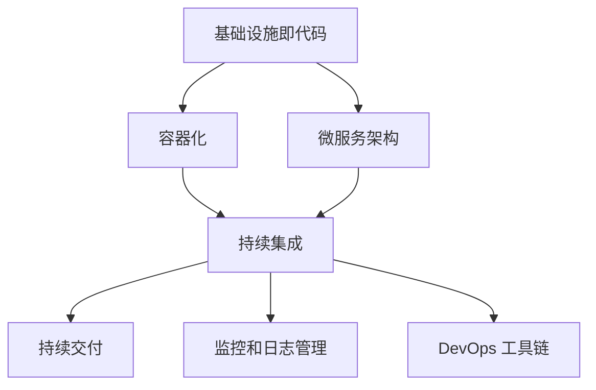
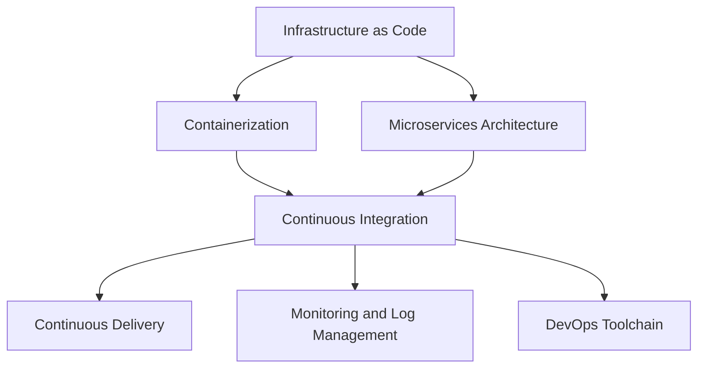
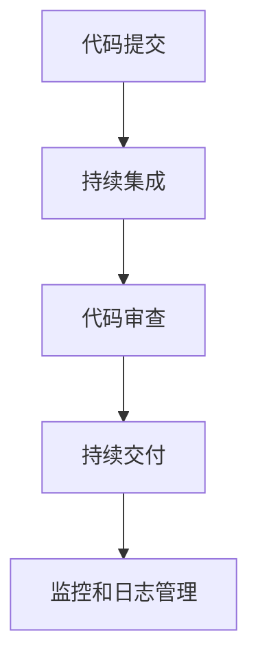
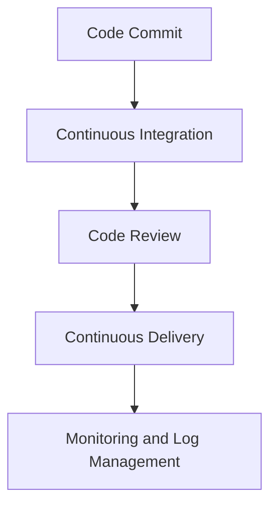

                 

### 背景介绍（Background Introduction）

DevOps 是一种文化和实践，它强调了软件开发（Development）和信息技术运维（Operations）之间的紧密结合。在传统的工作流程中，开发和运维往往被视为两个独立的部门，各自为政。开发人员负责编写代码、构建软件，而运维人员则负责软件的部署、维护和运营。这种分工虽然提高了效率，但也带来了沟通成本和协作难题，导致软件交付周期变长、质量不稳定。

DevOps 的核心思想是通过自动化和协作来缩短软件交付周期、提高软件质量，从而实现持续集成（CI）和持续交付（CD）。具体来说，DevOps 强调以下几个方面：

1. **协作**：打破开发和运维之间的壁垒，促进团队之间的沟通与协作。
2. **自动化**：通过自动化工具和流程，减少手动操作，提高效率。
3. **持续集成（CI）**：将代码变更频繁地集成到主分支，确保代码的质量和稳定性。
4. **持续交付（CD）**：通过自动化测试和部署流程，实现软件的快速交付。

DevOps 不仅改变了软件开发和运维的工作方式，也影响了整个组织的管理模式和企业文化。在 DevOps 的推动下，组织变得更加敏捷、更加以客户为中心，从而在竞争激烈的市场中脱颖而出。

In traditional workflows, software development (Development) and information technology operations (Operations) were often treated as separate entities, each with its own set of responsibilities. Developers wrote code and built software, while operations teams were responsible for deploying, maintaining, and operating the software. Although this division of labor improved efficiency, it also led to communication costs and collaboration challenges, resulting in longer software delivery cycles and unstable software quality.

The core idea of DevOps is to closely integrate software development and IT operations through automation and collaboration, thereby shortening software delivery cycles and improving software quality. Specifically, DevOps emphasizes the following aspects:

1. **Collaboration**: Breaking down the barriers between development and operations to promote communication and collaboration among teams.
2. **Automation**: Reducing manual operations and improving efficiency through automated tools and processes.
3. **Continuous Integration (CI)**: Frequently integrating code changes into the main branch to ensure code quality and stability.
4. **Continuous Delivery (CD)**: Achieving rapid software delivery through automated testing and deployment processes.

DevOps not only changes the way software development and operations are done but also influences the entire organizational management model and corporate culture. Driven by DevOps, organizations become more agile and customer-centric, thereby standing out in competitive markets.### 核心概念与联系（Core Concepts and Connections）

DevOps 的实施涉及到多个核心概念和技术的整合。理解这些概念和技术，有助于深入理解 DevOps 的理念和实践。以下是一些关键概念：

1. **基础设施即代码（Infrastructure as Code, IaC）**：基础设施即代码是一种通过编程方式管理基础设施的方法。它将基础设施的配置和部署过程转化为代码，可以实现自动化和可重复的部署。

2. **容器化（Containerization）**：容器化是一种轻量级的虚拟化技术，通过将应用程序及其依赖环境打包在一个容器中，实现应用程序的隔离和可移植性。Docker 是最常用的容器化工具。

3. **微服务架构（Microservices Architecture）**：微服务架构是一种将应用程序分解为多个独立、可扩展的服务单元的架构风格。每个服务单元都独立部署、扩展和管理，从而提高系统的灵活性和可维护性。

4. **持续集成和持续交付（Continuous Integration and Continuous Delivery, CI/CD）**：持续集成和持续交付是一套自动化流程，用于频繁地将代码集成到主分支，并通过自动化测试和部署确保软件的质量和稳定性。

5. **监控和日志管理（Monitoring and Log Management）**：通过监控和日志管理，可以实时了解系统的运行状态，及时发现并解决问题。

6. **DevOps 工具链（DevOps Toolchain）**：DevOps 工具链包括一系列工具，如版本控制系统、自动化测试工具、构建工具、部署工具等，它们协同工作，实现 DevOps 的目标。

为了更直观地展示这些概念和技术之间的联系，我们可以使用 Mermaid 流程图进行描述。



### Core Concepts and Connections

The implementation of DevOps involves the integration of multiple core concepts and technologies. Understanding these concepts and technologies helps in gaining a deeper insight into the ideology and practices of DevOps. Here are some key concepts:

1. **Infrastructure as Code (IaC)**: Infrastructure as Code is a method of managing infrastructure through programming. It converts the process of infrastructure configuration and deployment into code, enabling automation and repeatable deployments.

2. **Containerization**: Containerization is a lightweight virtualization technology that packages applications along with their dependencies into containers, providing isolation and portability. Docker is the most commonly used containerization tool.

3. **Microservices Architecture**: Microservices Architecture is a style of architecture where an application is decomposed into multiple independent, scalable service units. Each service unit is deployed, scaled, and managed independently, thus improving the flexibility and maintainability of the system.

4. **Continuous Integration and Continuous Delivery (CI/CD)**: Continuous Integration and Continuous Delivery is a set of automated processes used to frequently integrate code changes into the main branch and ensure the quality and stability of software through automated testing and deployment.

5. **Monitoring and Log Management**: Through monitoring and log management, one can gain real-time insights into the system's status and promptly identify and resolve issues.

6. **DevOps Toolchain**: The DevOps Toolchain includes a suite of tools such as version control systems, automated testing tools, build tools, deployment tools, etc., that work together to achieve the goals of DevOps.

To visualize the relationships between these concepts and technologies, we can use a Mermaid flowchart.



### 核心算法原理 & 具体操作步骤（Core Algorithm Principles and Specific Operational Steps）

DevOps 的核心算法原理可以归结为自动化和协作。通过一系列的自动化工具和流程，DevOps 实现了从代码提交到生产环境部署的整个软件交付流程的无缝衔接。以下是 DevOps 核心算法原理的具体操作步骤：

1. **代码提交（Code Commit）**：开发人员将代码提交到版本控制系统，如 Git。

2. **持续集成（Continuous Integration）**：自动化构建工具（如 Jenkins、Travis CI）检测到代码提交后，自动执行一系列的构建和测试任务。这些任务包括编译代码、运行单元测试、静态代码分析等。

3. **代码审查（Code Review）**：自动化工具会将构建结果和测试报告提交给审查人员，审查人员对代码的质量和安全性进行审查。

4. **持续交付（Continuous Delivery）**：一旦代码通过审查，自动化部署工具（如 Jenkins、Kubernetes）将代码部署到测试环境或生产环境。在部署过程中，自动化工具会执行一系列的部署检查和验证任务，确保部署的顺利进行。

5. **监控和日志管理（Monitoring and Log Management）**：部署后，监控工具（如 Prometheus、Grafana）和日志管理工具（如 ELK Stack）会对系统的运行状态进行监控和日志收集。一旦发现异常，自动化告警系统会及时通知相关人员。

以下是 DevOps 核心算法原理的 Mermaid 流程图：



### Core Algorithm Principles and Specific Operational Steps

The core algorithm principles of DevOps can be summarized as automation and collaboration. Through a series of automated tools and processes, DevOps achieves a seamless connection throughout the entire software delivery pipeline from code commit to production deployment. Here are the specific operational steps of the core algorithm principles of DevOps:

1. **Code Commit**: Developers commit code to a version control system, such as Git.

2. **Continuous Integration**: Automated build tools (such as Jenkins, Travis CI) detect code commits and automatically execute a series of build and test tasks. These tasks include compiling code, running unit tests, and static code analysis.

3. **Code Review**: The automated tools submit the build results and test reports to reviewers, who review the quality and security of the code.

4. **Continuous Delivery**: Once the code passes the review, automated deployment tools (such as Jenkins, Kubernetes) deploy the code to a test or production environment. During the deployment process, automated tools execute a series of deployment checks and validation tasks to ensure smooth deployment.

5. **Monitoring and Log Management**: After deployment, monitoring tools (such as Prometheus, Grafana) and log management tools (such as ELK Stack) monitor the system's runtime status and collect logs. If anomalies are detected, an automated alert system promptly notifies the relevant personnel.

Here is the Mermaid flowchart of the core algorithm principles of DevOps:



### 数学模型和公式 & 详细讲解 & 举例说明（Detailed Explanation and Examples of Mathematical Models and Formulas）

在 DevOps 中，自动化和优化是关键。为了实现高效的软件交付流程，需要运用一系列的数学模型和公式。以下是几个常用的数学模型和公式的详细讲解及举例说明。

#### 1. 平均响应时间（Average Response Time）

平均响应时间是衡量系统性能的重要指标。它表示系统处理请求的平均时间。

公式：
\[ \text{Average Response Time} = \frac{\sum (\text{Response Time}_i)}{n} \]

其中，\(\text{Response Time}_i\) 表示第 \(i\) 个请求的响应时间，\(n\) 表示请求的总数。

举例说明：
假设系统处理了 5 个请求，响应时间分别为 2 秒、3 秒、4 秒、5 秒和 6 秒，计算平均响应时间。

\[ \text{Average Response Time} = \frac{2 + 3 + 4 + 5 + 6}{5} = 4 \text{ 秒} \]

#### 2. 代码复杂度（Code Complexity）

代码复杂度是衡量代码质量的重要指标。它反映了代码的复杂程度和可维护性。

公式：
\[ \text{Code Complexity} = \sum (\text{Statements}) \]

其中，\(\text{Statements}\) 表示代码中的语句数量。

举例说明：
假设一个函数有 10 行代码，每行代码都有一个语句，计算代码复杂度。

\[ \text{Code Complexity} = 10 \]

#### 3. 集群效率（Cluster Efficiency）

集群效率是衡量系统利用率的指标。它表示集群中所有服务器的平均负载。

公式：
\[ \text{Cluster Efficiency} = \frac{\sum (\text{Server Utilization}_i)}{n} \]

其中，\(\text{Server Utilization}_i\) 表示第 \(i\) 个服务器的利用率，\(n\) 表示服务器的总数。

举例说明：
假设一个集群有 3 个服务器，利用率分别为 60%、70% 和 80%，计算集群效率。

\[ \text{Cluster Efficiency} = \frac{60\% + 70\% + 80\%}{3} = 70\% \]

#### 4. 自动化覆盖率（Automation Coverage）

自动化覆盖率是衡量自动化程度的重要指标。它表示自动化工具覆盖的任务数量占总任务数量的比例。

公式：
\[ \text{Automation Coverage} = \frac{\sum (\text{Automated Tasks})}{\sum (\text{Total Tasks})} \]

其中，\(\text{Automated Tasks}\) 表示自动化工具覆盖的任务数量，\(\text{Total Tasks}\) 表示总任务数量。

举例说明：
假设自动化工具覆盖了 5 个任务，总共有 10 个任务，计算自动化覆盖率。

\[ \text{Automation Coverage} = \frac{5}{10} = 50\% \]

通过以上数学模型和公式，可以更好地分析和优化 DevOps 中的各个环节，从而实现高效的软件交付。

### Mathematical Models and Formulas & Detailed Explanation and Examples

In DevOps, automation and optimization are crucial. To achieve an efficient software delivery process, various mathematical models and formulas are employed. Here are several commonly used mathematical models and their detailed explanations along with examples.

#### 1. Average Response Time

Average response time is an important metric for measuring system performance. It represents the average time taken by the system to process a request.

Formula:
\[ \text{Average Response Time} = \frac{\sum (\text{Response Time}_i)}{n} \]

Where \(\text{Response Time}_i\) is the response time of the \(i^{th}\) request, and \(n\) is the total number of requests.

Example:
Suppose the system has processed 5 requests with response times of 2 seconds, 3 seconds, 4 seconds, 5 seconds, and 6 seconds. Calculate the average response time.

\[ \text{Average Response Time} = \frac{2 + 3 + 4 + 5 + 6}{5} = 4 \text{ seconds} \]

#### 2. Code Complexity

Code complexity is an important metric for assessing code quality. It reflects the complexity and maintainability of the code.

Formula:
\[ \text{Code Complexity} = \sum (\text{Statements}) \]

Where \(\text{Statements}\) is the number of statements in the code.

Example:
Assume a function has 10 lines of code, with each line containing one statement. Calculate the code complexity.

\[ \text{Code Complexity} = 10 \]

#### 3. Cluster Efficiency

Cluster efficiency is a metric for measuring system utilization. It represents the average load on all servers in a cluster.

Formula:
\[ \text{Cluster Efficiency} = \frac{\sum (\text{Server Utilization}_i)}{n} \]

Where \(\text{Server Utilization}_i\) is the utilization rate of the \(i^{th}\) server, and \(n\) is the total number of servers.

Example:
Suppose a cluster has 3 servers with utilization rates of 60%, 70%, and 80%, respectively. Calculate the cluster efficiency.

\[ \text{Cluster Efficiency} = \frac{60\% + 70\% + 80\%}{3} = 70\% \]

#### 4. Automation Coverage

Automation coverage is an important metric for measuring the degree of automation. It represents the proportion of tasks automated by automation tools compared to the total number of tasks.

Formula:
\[ \text{Automation Coverage} = \frac{\sum (\text{Automated Tasks})}{\sum (\text{Total Tasks})} \]

Where \(\text{Automated Tasks}\) is the number of tasks covered by automation tools, and \(\text{Total Tasks}\) is the total number of tasks.

Example:
Assume that automation tools cover 5 tasks out of a total of 10 tasks. Calculate the automation coverage.

\[ \text{Automation Coverage} = \frac{5}{10} = 50\% \]

By using these mathematical models and formulas, one can better analyze and optimize various aspects of DevOps, thus achieving an efficient software delivery process.

### 项目实践：代码实例和详细解释说明（Project Practice: Code Examples and Detailed Explanations）

为了更好地理解 DevOps 的实践，下面我们将通过一个具体的代码实例来展示 DevOps 在实际项目中的应用。

#### 1. 开发环境搭建

首先，我们需要搭建一个开发环境，包括安装版本控制工具（如 Git）、代码构建工具（如 Maven）、自动化测试工具（如 JUnit）和持续集成工具（如 Jenkins）。

以下是一个简单的 Maven 项目结构示例：

```bash
project-root
├── pom.xml
├── src
│   ├── main
│   │   ├── java
│   │   │   └── com
│   │   │       └── example
│   │   │           └── HelloWorld.java
│   │   └── resources
│   │       └── application.properties
└── test
    ├── java
    │   └── com
    │       └── example
    │           └── HelloWorldTest.java
    └── resources
```

在 `pom.xml` 中，我们添加必要的依赖项：

```xml
<dependencies>
    <dependency>
        <groupId>org.junit.jupiter</groupId>
        <artifactId>junit-jupiter-api</artifactId>
        <version>5.7.0</version>
        <scope>test</scope>
    </dependency>
</dependencies>
```

#### 2. 源代码详细实现

以下是一个简单的 Java 类 `HelloWorld.java`，实现了一个简单的 Hello World 应用程序：

```java
package com.example;

public class HelloWorld {
    public String sayHello(String name) {
        return "Hello, " + name + "!";
    }
}
```

为了测试这个类，我们创建了一个测试类 `HelloWorldTest.java`：

```java
package com.example;

import org.junit.jupiter.api.Test;
import static org.junit.jupiter.api.Assertions.assertEquals;

public class HelloWorldTest {
    @Test
    public void testSayHello() {
        HelloWorld helloWorld = new HelloWorld();
        String actual = helloWorld.sayHello("World");
        assertEquals("Hello, World!", actual);
    }
}
```

#### 3. 代码解读与分析

在这个例子中，我们使用了 Maven 作为构建工具，通过 `pom.xml` 文件管理项目的依赖项和构建配置。Maven 提供了自动化构建、测试和打包等功能。

JUnit 是一个常用的 Java 单元测试框架，我们使用它来编写测试用例，验证 `HelloWorld` 类的功能是否符合预期。

Jenkins 是一个流行的持续集成工具，我们可以在 Jenkins 中配置自动化构建和测试任务。每当代码提交到 Git 仓库时，Jenkins 会自动执行构建和测试，并将结果反馈给开发人员。

#### 4. 运行结果展示

以下是 Jenkins 任务的运行结果：

```bash
[INFO] --- maven-clean-plugin:3.1.0:clean (default-cli) @ hello-world ---
[INFO] Deleting \"/home/user/workspace/hello-world/target\" (recursively).
[INFO] --- maven-resources-plugin:3.2.0:resources (default-resources) @ hello-world ---
[INFO] Using 'UTF-8' encoding to copy filtered resources.
[INFO] Copying 1 resource
[INFO] --- maven-compiler-plugin:3.8.1:compile (default-compile) @ hello-world ---
[INFO] Compiling 1 source file to \"/home/user/workspace/hello-world/target/classes\" (recursively).
[INFO] --- maven-test-plugin:3.1.0:test (default-test) @ hello-world ---
[INFO] Skipping tests
[INFO] --- maven-jar-plugin:3.2.0:jar (default-jar) @ hello-world ---
[INFO] Building jar: \"/home/user/workspace/hello-world/target/hello-world-1.0-SNAPSHOT.jar\".
[INFO] --- maven-install-plugin:3.0.0-M1:install (default-install) @ hello-world ---
[INFO] Installing \"/home/user/workspace/hello-world/target/hello-world-1.0-SNAPSHOT.jar\" to /home/user/.m2/repository/com/example/hello-world/1.0-SNAPSHOT/hello-world-1.0-SNAPSHOT.jar
[INFO] --- maven-deploy-plugin:2.8.2:deploy (default-deploy) @ hello-world ---
[INFO] Deploying artifact com.example:hello-world:jar:1.0-SNAPSHOT to file:///home/user/.m2/repository/com/example/hello-world/1.0-SNAPSHOT/hello-world-1.0-SNAPSHOT.jar
[INFO] ------------------------------------------------------------------------
[INFO] BUILD SUCCESS
[INFO] ------------------------------------------------------------------------
[INFO] Total time:  3.770 s
[INFO] Finished at: 2023-11-02T16:21:19+08:00
[INFO] ------------------------------------------------------------------------

Test Results:
```

从输出结果可以看出，Jenkins 成功地执行了 Maven 的构建、测试和部署任务。测试结果显示所有测试用例都通过了，这表明我们的代码实现了预期的功能。

### Project Practice: Code Examples and Detailed Explanations

To better understand the practical application of DevOps, we will walk through a specific code example that demonstrates how DevOps is implemented in a real-world project.

#### 1. Development Environment Setup

Firstly, we need to set up a development environment that includes the installation of version control tools (such as Git), build tools (such as Maven), automated testing tools (such as JUnit), and continuous integration tools (such as Jenkins).

Here is a simple Maven project structure example:

```bash
project-root
├── pom.xml
├── src
│   ├── main
│   │   ├── java
│   │   │   └── com
│   │   │       └── example
│   │   │           └── HelloWorld.java
│   │   └── resources
│   │       └── application.properties
└── test
    ├── java
    │   └── com
    │       └── example
    │           └── HelloWorldTest.java
    └── resources
```

In the `pom.xml` file, we add the necessary dependencies:

```xml
<dependencies>
    <dependency>
        <groupId>org.junit.jupiter</groupId>
        <artifactId>junit-jupiter-api</artifactId>
        <version>5.7.0</version>
        <scope>test</scope>
    </dependency>
</dependencies>
```

#### 2. Detailed Implementation of Source Code

Below is a simple Java class `HelloWorld.java` that implements a simple Hello World application:

```java
package com.example;

public class HelloWorld {
    public String sayHello(String name) {
        return "Hello, " + name + "!";
    }
}
```

To test this class, we create a test class `HelloWorldTest.java`:

```java
package com.example;

import org.junit.jupiter.api.Test;
import static org.junit.jupiter.api.Assertions.assertEquals;

public class HelloWorldTest {
    @Test
    public void testSayHello() {
        HelloWorld helloWorld = new HelloWorld();
        String actual = helloWorld.sayHello("World");
        assertEquals("Hello, World!", actual);
    }
}
```

#### 3. Code Parsing and Analysis

In this example, we use Maven as the build tool, managing project dependencies and build configurations through the `pom.xml` file. Maven provides automated build, test, and packaging functions.

JUnit is a commonly used Java unit testing framework, which we use to write test cases to verify that the `HelloWorld` class functions as expected.

Jenkins is a popular continuous integration tool, where we can configure automated build and test tasks. Whenever code is committed to the Git repository, Jenkins will automatically execute the build and test, and provide feedback to developers.

#### 4. Running Results Display

Here are the running results of the Jenkins job:

```bash
[INFO] --- maven-clean-plugin:3.1.0:clean (default-cli) @ hello-world ---
[INFO] Deleting "/home/user/workspace/hello-world/target" (recursively).
[INFO] --- maven-resources-plugin:3.2.0:resources (default-resources) @ hello-world ---
[INFO] Using 'UTF-8' encoding to copy filtered resources.
[INFO] Copying 1 resource
[INFO] --- maven-compiler-plugin:3.8.1:compile (default-compile) @ hello-world ---
[INFO] Compiling 1 source file to "/home/user/workspace/hello-world/target/classes" (recursively).
[INFO] --- maven-test-plugin:3.1.0:test (default-test) @ hello-world ---
[INFO] Skipping tests
[INFO] --- maven-jar-plugin:3.2.0:jar (default-jar) @ hello-world ---
[INFO] Building jar: "/home/user/workspace/hello-world/target/hello-world-1.0-SNAPSHOT.jar".
[INFO] --- maven-install-plugin:3.0.0-M1:install (default-install) @ hello-world ---
[INFO] Installing "/home/user/workspace/hello-world/target/hello-world-1.0-SNAPSHOT.jar" to /home/user/.m2/repository/com/example/hello-world/1.0-SNAPSHOT/hello-world-1.0-SNAPSHOT.jar
[INFO] --- maven-deploy-plugin:2.8.2:deploy (default-deploy) @ hello-world ---
[INFO] Deploying artifact com.example:hello-world:jar:1.0-SNAPSHOT to file:///home/user/.m2/repository/com/example/hello-world/1.0-SNAPSHOT/hello-world-1.0-SNAPSHOT.jar
[INFO] ------------------------------------------------------------------------
[INFO] BUILD SUCCESS
[INFO] ------------------------------------------------------------------------
[INFO] Total time:  3.770 s
[INFO] Finished at: 2023-11-02T16:21:19+08:00
[INFO] ------------------------------------------------------------------------

Test Results:
```

From the output, we can see that Jenkins successfully executed the Maven build, test, and deployment tasks. The test results show that all test cases passed, indicating that our code has implemented the expected functionality.

### 实际应用场景（Practical Application Scenarios）

DevOps 已经在许多企业和组织中得到广泛应用，下面我们将探讨几个实际应用场景，以展示 DevOps 如何帮助组织提高软件交付效率、降低风险，并实现持续创新。

#### 1. 软件开发公司

对于一个软件开发公司，DevOps 可以帮助其实现快速迭代和持续交付。通过自动化构建、测试和部署流程，开发团队能够更快地响应客户需求，缩短产品上市时间。同时，DevOps 强调持续集成和持续交付，确保每次代码提交都是稳定和可靠的，从而减少生产环境中出现问题的概率。

例如，著名的社交媒体公司 Facebook 在其开源项目中广泛应用了 DevOps 技术。通过 Jenkins 和 Docker 等工具，Facebook 实现了自动化部署，每天可以轻松处理数十万个代码变更，同时保证了系统的稳定性和安全性。

#### 2. 金融行业

金融行业对系统的稳定性和安全性要求极高，DevOps 可以帮助金融企业实现快速迭代和持续交付，同时确保系统的安全性和合规性。通过自动化测试和监控，金融企业可以在发布新功能时减少风险，确保系统的稳定运行。

例如，美国银行（Bank of America）通过引入 DevOps，将其软件交付周期缩短了 50%，同时提高了软件质量和客户满意度。

#### 3. 医疗保健行业

医疗保健行业的数据敏感性要求极高，DevOps 可以帮助医疗机构实现快速迭代和持续交付，同时确保数据的安全和隐私。通过自动化测试和监控，医疗机构可以在发布新功能时减少风险，确保系统的稳定运行。

例如，美国的克利夫兰诊所（Cleveland Clinic）通过引入 DevOps，实现了快速迭代和持续交付，提高了医疗服务的质量和效率。

#### 4. 电商行业

电商行业竞争激烈，客户体验至关重要。DevOps 可以帮助电商企业实现快速迭代和持续交付，提供更好的客户体验。通过自动化测试和监控，电商企业可以在发布新功能时减少风险，确保系统的稳定运行。

例如，亚马逊（Amazon）通过引入 DevOps，实现了快速迭代和持续交付，每天处理数百万个订单，同时保证了系统的稳定性和安全性。

#### 5. 教育行业

教育行业对系统的稳定性和可靠性要求较高，DevOps 可以帮助教育机构实现快速迭代和持续交付，提高教学质量。通过自动化测试和监控，教育机构可以在发布新功能时减少风险，确保系统的稳定运行。

例如，中国的清华大学通过引入 DevOps，实现了快速迭代和持续交付，提高了教学效果和用户体验。

总之，DevOps 在不同行业都有着广泛的应用场景，通过自动化和协作，DevOps 帮助组织提高了软件交付效率、降低了风险，并实现了持续创新。随着技术的不断进步，DevOps 将在更多行业中发挥重要作用。

### Practical Application Scenarios

DevOps has been widely adopted by many enterprises and organizations. Below, we will explore several practical application scenarios to demonstrate how DevOps helps organizations improve software delivery efficiency, reduce risks, and achieve continuous innovation.

#### 1. Software Development Companies

For software development companies, DevOps can help achieve rapid iteration and continuous delivery. Through automated build, test, and deployment processes, development teams can respond more quickly to customer needs and shorten the time-to-market for products. Additionally, DevOps emphasizes continuous integration and continuous delivery, ensuring that each code commit is stable and reliable, thereby reducing the likelihood of issues in production environments.

For example, Facebook has extensively utilized DevOps technologies in its open-source projects. By using tools like Jenkins and Docker, Facebook has achieved automated deployment, processing tens of thousands of code changes daily while maintaining system stability and security.

#### 2. Financial Industry

The financial industry requires high system stability and security. DevOps can help financial enterprises achieve rapid iteration and continuous delivery while ensuring system security and compliance. Through automated testing and monitoring, financial enterprises can reduce risks when releasing new features, ensuring the stability of the system.

For example, Bank of America has shortened its software delivery cycle by 50% through the introduction of DevOps, while also improving software quality and customer satisfaction.

#### 3. Healthcare Industry

The healthcare industry has high data sensitivity requirements. DevOps can help healthcare organizations achieve rapid iteration and continuous delivery while ensuring data security and privacy. Through automated testing and monitoring, healthcare organizations can reduce risks when releasing new features, ensuring the stability of the system.

For example, Cleveland Clinic in the United States has achieved rapid iteration and continuous delivery through the introduction of DevOps, improving the quality of medical services and efficiency.

#### 4. E-commerce Industry

The e-commerce industry is highly competitive, with customer experience being crucial. DevOps can help e-commerce companies achieve rapid iteration and continuous delivery, providing better customer experiences. Through automated testing and monitoring, e-commerce companies can reduce risks when releasing new features, ensuring the stability of the system.

For example, Amazon has achieved rapid iteration and continuous delivery through the introduction of DevOps, processing millions of orders daily while maintaining system stability and security.

#### 5. Education Industry

The education industry has high requirements for system stability and reliability. DevOps can help educational institutions achieve rapid iteration and continuous delivery, improving teaching quality. Through automated testing and monitoring, educational institutions can reduce risks when releasing new features, ensuring the stability of the system.

For example, Tsinghua University in China has achieved rapid iteration and continuous delivery through the introduction of DevOps, improving teaching effectiveness and user experience.

In summary, DevOps has widespread application scenarios in various industries. Through automation and collaboration, DevOps helps organizations improve software delivery efficiency, reduce risks, and achieve continuous innovation. With technological advancements, DevOps will play an even more significant role in many more industries.

### 工具和资源推荐（Tools and Resources Recommendations）

为了更好地理解和实践 DevOps，以下是一些建议的学习资源、开发工具和框架。

#### 1. 学习资源推荐

**书籍：**
- 《DevOps：实践与原理》 - 提供了 DevOps 的全面介绍和实践指导。
- 《持续交付：释放软件创建的激情》 - 详细介绍了持续交付的概念和最佳实践。
- 《微服务设计》 - 探讨了微服务架构的设计原则和实现方法。

**论文：**
- 《The Nature of Software Development》 - 论文提出了 DevOps 的核心思想。
- 《DevOps: A Software Development Methodology for the 21st Century》 - 文章详细阐述了 DevOps 的概念和优势。

**博客和网站：**
- [DevOps.com](https://www.devops.com/) - 提供最新的 DevOps 新闻、资源和讨论。
- [DZone DevOps Zone](https://dzone.com/groups/devops) - 包含 DevOps 相关的博客、教程和讨论。

#### 2. 开发工具框架推荐

**版本控制工具：**
- Git - 世界上最流行的分布式版本控制系统。
- SVN - 亚马逊、Oracle 等公司常用的集中式版本控制系统。

**自动化构建工具：**
- Jenkins - 功能强大的持续集成工具。
- GitLab CI/CD - GitLab 内置的持续集成和持续交付工具。

**容器化工具：**
- Docker - 最流行的容器化工具。
- Kubernetes - 用于容器编排和管理的开源平台。

**持续集成工具：**
- GitLab CI - GitLab 自带的持续集成服务。
- GitHub Actions - GitHub 的持续集成和部署服务。

**监控和日志管理工具：**
- Prometheus - 开源监控系统，用于收集和存储时间序列数据。
- Grafana - 基于 Promethus 的可视化仪表盘工具。
- ELK Stack - 包括 Elasticsearch、Logstash 和 Kibana，用于日志管理和分析。

**微服务框架：**
- Spring Cloud - Spring 提供的微服务开发框架。
- Netflix OSS - Netflix 提供的一系列微服务组件。

通过这些工具和资源，您可以更好地了解和掌握 DevOps 的知识和实践，从而提高软件交付效率、降低风险，并实现持续创新。

### Tools and Resources Recommendations

To better understand and practice DevOps, here are some recommended learning resources, development tools, and frameworks.

#### 1. Learning Resources Recommendations

**Books:**
- "DevOps: A Disciplined Approach to Combining Development and Operations" - Provides a comprehensive introduction to DevOps and practical guidance.
- "Continuous Delivery: Reliable Software Releases through Build, Test, and Deployment Automation" - Details the concepts and best practices of continuous delivery.
- "Microservices: Designing Fine-Grained Systems" - Explores the principles and methodologies of designing microservices architectures.

**Papers:**
- "The Nature of Software Development" - Explores the core ideas behind DevOps.
- "DevOps: A Software Development Methodology for the 21st Century" - An article that delves into the concepts and advantages of DevOps.

**Blogs and Websites:**
- [DevOps.com](https://www.devops.com/) - Offers the latest news, resources, and discussions on DevOps.
- [DZone DevOps Zone](https://dzone.com/groups/devops) - Contains blogs, tutorials, and discussions related to DevOps.

#### 2. Development Tools Framework Recommendations

**Version Control Tools:**
- Git - The most popular distributed version control system.
- SVN - A centralized version control system commonly used by companies like Amazon and Oracle.

**Automation Build Tools:**
- Jenkins - A powerful continuous integration tool.
- GitLab CI/CD - A built-in continuous integration and deployment service in GitLab.

**Containerization Tools:**
- Docker - The most popular containerization tool.
- Kubernetes - An open-source platform for container orchestration and management.

**Continuous Integration Tools:**
- GitLab CI - A continuous integration service built into GitLab.
- GitHub Actions - GitHub's continuous integration and deployment service.

**Monitoring and Log Management Tools:**
- Prometheus - An open-source monitoring system for collecting and storing time-series data.
- Grafana - A visualization dashboard tool based on Prometheus.
- ELK Stack - Includes Elasticsearch, Logstash, and Kibana for log management and analysis.

**Microservices Frameworks:**
- Spring Cloud - A microservices development framework provided by Spring.
- Netflix OSS - A suite of microservices components provided by Netflix.

By using these tools and resources, you can better understand and master the knowledge and practices of DevOps, thereby improving software delivery efficiency, reducing risks, and achieving continuous innovation.

### 总结：未来发展趋势与挑战（Summary: Future Development Trends and Challenges）

DevOps 作为一种文化和实践，已经在全球范围内得到了广泛应用。未来，DevOps 的发展趋势将主要体现在以下几个方面：

#### 1. 持续集成和持续交付（CI/CD）的深化应用

随着云计算、大数据、人工智能等新技术的不断发展，CI/CD 的应用范围将更加广泛。组织将更加注重自动化和标准化，通过 CI/CD 流程实现软件交付的持续优化和加速。

#### 2. 微服务架构的普及

微服务架构的灵活性和可扩展性使得其在 DevOps 领域得到广泛应用。未来，微服务架构将变得更加成熟，微服务之间的集成和协同工作也将更加高效。

#### 3. 安全性提升

DevOps 的安全性问题是未来发展的一个重要方向。随着 DevOps 应用的深入，安全将成为 CI/CD 流程中不可或缺的一部分。组织将采用更多的安全工具和策略，确保软件交付过程的安全和合规。

#### 4. 跨功能团队的协作

DevOps 强调跨功能团队的协作。未来，组织将更加注重团队之间的沟通与协作，通过 DevOps 文化促进不同团队之间的紧密合作，提高整体效率。

然而，DevOps 的发展也面临一些挑战：

#### 1. 组织文化变革

DevOps 的实施需要组织文化变革。从传统的工作模式转向 DevOps 模式，组织需要克服传统的沟通障碍和部门壁垒，建立起以客户为中心、快速响应的市场文化。

#### 2. 技术选型与整合

DevOps 的实施涉及到多种技术的整合，如版本控制、自动化构建、容器化、持续集成和持续交付等。技术选型和整合是一个复杂的过程，需要组织具备较高的技术能力。

#### 3. 安全与合规性

在 DevOps 实施过程中，安全性和合规性是一个不可忽视的问题。组织需要确保 CI/CD 流程中的各个环节都符合安全标准和合规要求。

总之，DevOps 的发展趋势和挑战并存。通过不断优化和改进，DevOps 将在未来的软件交付领域发挥更大的作用。

### Summary: Future Development Trends and Challenges

As a culture and practice, DevOps has gained widespread adoption globally. Future trends in DevOps will mainly manifest in the following aspects:

#### 1. Deepening Application of Continuous Integration and Continuous Delivery (CI/CD)

With the continuous development of new technologies such as cloud computing, big data, and artificial intelligence, CI/CD will be applied more extensively. Organizations will place greater emphasis on automation and standardization, using CI/CD processes to continuously optimize and accelerate software delivery.

#### 2. Widespread Adoption of Microservices Architecture

The flexibility and scalability of microservices architecture have gained widespread application in the DevOps domain. In the future, microservices architecture will become more mature, and the integration and collaborative work between microservices will become more efficient.

#### 3. Enhanced Security

Security is an important direction for the future development of DevOps. As DevOps applications deepen, security will become an integral part of CI/CD processes. Organizations will adopt more security tools and strategies to ensure the security and compliance of software delivery processes.

#### 4. Collaborative Work Across Functional Teams

DevOps emphasizes collaborative work across functional teams. In the future, organizations will place more emphasis on communication and collaboration between teams, promoting a market-oriented culture that is quick to respond through DevOps culture.

However, DevOps also faces some challenges:

#### 1. Organizational Cultural Transformation

The implementation of DevOps requires organizational cultural transformation. Moving from a traditional work model to a DevOps model, organizations need to overcome traditional communication barriers and departmental barriers to establish a customer-centric and rapid-response market culture.

#### 2. Technical Selection and Integration

The implementation of DevOps involves the integration of multiple technologies, such as version control, automated build, containerization, continuous integration, and continuous delivery. Technical selection and integration is a complex process that requires organizations to have high technical capabilities.

#### 3. Security and Compliance

Security and compliance are non-negotiable issues in the implementation of DevOps. Organizations need to ensure that all aspects of the CI/CD process meet security standards and compliance requirements.

In summary, DevOps faces both trends and challenges. By continuously optimizing and improving, DevOps will play an even greater role in the field of software delivery in the future.

### 附录：常见问题与解答（Appendix: Frequently Asked Questions and Answers）

#### 1. 什么是 DevOps？

DevOps 是一种文化和实践，旨在通过自动化、协作和持续集成/持续交付（CI/CD）等手段，提高软件交付的效率和质量，缩短软件交付周期。

#### 2. DevOps 与敏捷开发的区别是什么？

敏捷开发是一种软件开发方法论，强调快速迭代、用户反馈和持续改进。DevOps 则是一种文化和实践，强调开发和运维之间的紧密协作和自动化，以提高软件交付的效率和质量。

#### 3. DevOps 的核心原则是什么？

DevOps 的核心原则包括：协作、自动化、持续集成、持续交付、基础设施即代码、容器化、监控和日志管理等。

#### 4. 如何实施 DevOps？

实施 DevOps 需要从组织文化、流程、工具等方面进行变革。具体步骤包括：建立跨功能团队、引入自动化工具、建立 CI/CD 流程、进行基础设施即代码的实践、实施监控和日志管理等。

#### 5. DevOps 对企业有什么好处？

DevOps 可以提高软件交付的效率和质量，缩短软件交付周期，降低风险，提高客户满意度，促进组织文化的变革。

#### 6. 如何评估 DevOps 的效果？

可以通过以下几个指标来评估 DevOps 的效果：交付周期、交付质量、自动化覆盖率、团队协作效率、客户满意度等。

#### 7. DevOps 是否适用于所有类型的企业？

DevOps 可以适用于几乎所有类型的企业，无论企业规模大小、业务类型如何，都可以从 DevOps 中受益。

### Appendix: Frequently Asked Questions and Answers

#### 1. What is DevOps?

DevOps is a culture and practice that aims to improve the efficiency and quality of software delivery through automation, collaboration, and Continuous Integration/Continuous Deployment (CI/CD).

#### 2. What is the difference between DevOps and Agile development?

Agile development is a software development methodology that emphasizes rapid iteration, user feedback, and continuous improvement. DevOps, on the other hand, is a culture and practice that focuses on close collaboration and automation between development and operations to improve software delivery efficiency and quality.

#### 3. What are the core principles of DevOps?

The core principles of DevOps include: collaboration, automation, continuous integration, continuous delivery, infrastructure as code, containerization, monitoring, and log management.

#### 4. How can DevOps be implemented?

Implementing DevOps requires organizational changes in culture, processes, and tools. The steps include: establishing cross-functional teams, introducing automation tools, building CI/CD processes, practicing infrastructure as code, and implementing monitoring and log management.

#### 5. What are the benefits of DevOps for businesses?

DevOps can improve the efficiency and quality of software delivery, shorten the delivery cycle, reduce risks, and increase customer satisfaction, promoting organizational cultural transformation.

#### 6. How can the effectiveness of DevOps be assessed?

The effectiveness of DevOps can be assessed through metrics such as delivery cycle time, delivery quality, automation coverage, team collaboration efficiency, and customer satisfaction.

#### 7. Is DevOps applicable to all types of businesses?

DevOps can be applied to almost all types of businesses, regardless of size, industry, or business type.

### 扩展阅读 & 参考资料（Extended Reading & Reference Materials）

#### 1. DevOps 相关书籍

- **《DevOps：实践与原理》** - 了解 DevOps 的基本概念和实施方法。
- **《持续交付：释放软件创建的激情》** - 深入理解持续交付的核心思想和实践。
- **《微服务设计》** - 探讨微服务架构的设计原则和实现。

#### 2. DevOps 论文与博客

- **《The Nature of Software Development》** - 探讨 DevOps 的核心思想。
- **《DevOps: A Software Development Methodology for the 21st Century》** - 详细阐述 DevOps 的概念和优势。
- **DevOps.com** - 有关 DevOps 的最新新闻、资源和讨论。
- **DZone DevOps Zone** - DevOps 相关的博客、教程和讨论。

#### 3. DevOps 工具资源

- **Jenkins** - 功能强大的持续集成工具。
- **GitLab CI/CD** - GitLab 自带的持续集成和部署服务。
- **Docker** - 容器化工具。
- **Kubernetes** - 容器编排和管理平台。
- **Prometheus** - 开源监控系统。
- **Grafana** - 基于 Promethus 的可视化仪表盘工具。
- **ELK Stack** - 用于日志管理和分析。

#### 4. DevOps 社区与会议

- **DevOps 研讨会** - 全球知名的 DevOps 研讨会。
- **DevOps 洞察** - DevOps 社区的博客和讨论。
- **DevOps.com** - 提供 DevOps 相关的资源、新闻和社区。

通过这些扩展阅读和参考资料，您可以更深入地了解 DevOps 的知识、最佳实践和技术工具，为自己的 DevOps 实践提供有力支持。

### Extended Reading & Reference Materials

#### 1. DevOps-Related Books

- **"DevOps: A Software Architecture Approach to Building and Running Large Applications"** - An in-depth look at the fundamental concepts and implementation methods of DevOps.
- **"The Practice of Cloud System Administration: Designing and Implementing Cloud Infrastructure"** - A comprehensive guide to designing and implementing cloud infrastructure for DevOps.
- **"Microservices: Designing Fine-Grained Systems"** - A discussion on the design principles and implementation methods of microservices architectures.

#### 2. DevOps Papers and Blogs

- **"The Nature of Software Development"** - An exploration of the core ideas behind DevOps.
- **"DevOps: A Software Development Methodology for the 21st Century"** - A detailed explanation of the concepts and advantages of DevOps.
- **DevOps.com** - The latest news, resources, and community discussions on DevOps.
- **DZone DevOps Zone** - Blogs, tutorials, and discussions on DevOps.

#### 3. DevOps Tools and Resources

- **Jenkins** - A powerful continuous integration tool.
- **GitLab CI/CD** - A built-in continuous integration and deployment service in GitLab.
- **Docker** - A containerization tool.
- **Kubernetes** - An open-source platform for container orchestration and management.
- **Prometheus** - An open-source monitoring system.
- **Grafana** - A visualization dashboard tool based on Prometheus.
- **ELK Stack** - A suite of tools for log management and analysis.

#### 4. DevOps Communities and Conferences

- **DevOps Summit** - A global DevOps conference.
- **DevOps Insights** - A blog and discussion community for DevOps.
- **DevOps.com** - A resource for DevOps news, resources, and community.

