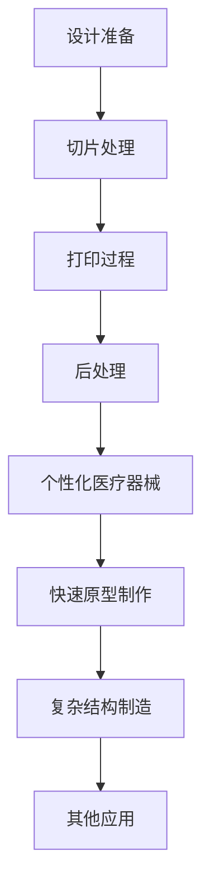
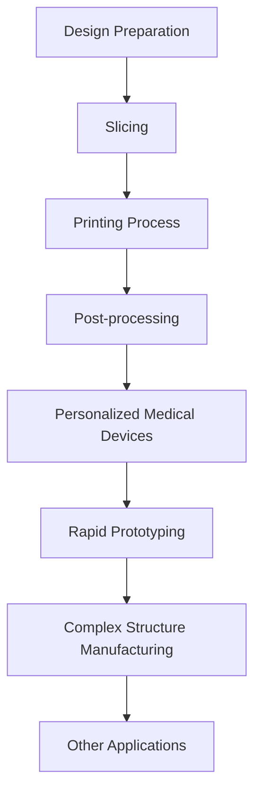

                 

### 背景介绍（Background Introduction）

3D打印技术，也称为增材制造（Additive Manufacturing，AM），是一种通过逐层添加材料来构建物体的技术。与传统的减材制造（如车削、铣削）不同，3D打印可以直接从数字模型中生成物理对象，从而减少了材料浪费和制造成本。

在医疗器械制造领域，3D打印技术正逐渐成为一个重要的工具，它能够为医疗行业带来革命性的变化。随着技术的不断进步，3D打印在个性化医疗、快速原型制作、复杂部件制造等方面展现出了巨大的潜力。

个性化医疗是3D打印技术最引人注目的应用之一。传统的医疗器械通常是为了大规模生产而设计的，往往无法完全满足个体患者的需求。而3D打印技术可以定制化地制造出适合特定患者的医疗器械，如个性化的骨骼植入物、定制化的支架和假肢等。

此外，3D打印技术还能够显著缩短新产品的开发周期。在传统的制造过程中，设计和制造新医疗器械往往需要数月甚至数年的时间。而3D打印技术可以在几天或几周内完成原型制作和测试，大大提高了研发效率。

本篇文章将探讨3D打印技术在医疗器械制造中的应用，重点分析其个性化医疗解决方案，并探讨该技术带来的挑战与机遇。

### Background Introduction

3D printing technology, also known as additive manufacturing (AM), is a technique that builds objects layer by layer by adding materials. Unlike traditional subtractive manufacturing methods (such as turning and milling), 3D printing can directly generate physical objects from digital models, thereby reducing material waste and manufacturing costs.

In the field of medical device manufacturing, 3D printing technology is gradually becoming an important tool, bringing revolutionary changes to the medical industry. With continuous advancements, 3D printing is demonstrating tremendous potential in personalized medicine, rapid prototyping, and complex component manufacturing.

Personalized medicine is one of the most significant applications of 3D printing technology. Traditional medical devices are often designed for mass production and may not fully meet the needs of individual patients. 3D printing technology can custom-manufacture medical devices tailored to specific patients, such as personalized bone implants, customized braces, and prosthetics.

Moreover, 3D printing technology can significantly shorten the development cycle of new products. In traditional manufacturing processes, designing and manufacturing new medical devices often takes months or even years. With 3D printing technology, prototypes can be created and tested within days or weeks, greatly improving development efficiency.

This article will explore the applications of 3D printing technology in medical device manufacturing, focusing on its personalized medical solutions and discussing the challenges and opportunities brought by this technology.### 核心概念与联系（Core Concepts and Connections）

#### 3D打印技术的基本原理（Basic Principles of 3D Printing）

3D打印技术的基本原理是通过逐层添加材料来构建三维对象。这个过程通常涉及以下几个关键步骤：

1. **设计准备**：首先，需要使用计算机辅助设计（CAD）软件创建一个三维模型。这个模型通常是以STL（立体三角形语言）格式存储的，它描述了对象表面的三角面片。

2. **切片处理**：接着，将三维模型转换为二维的“切片”，每个切片代表对象的一个横截面。这些切片可以通过3D打印软件生成，如Cura、Simplify3D等。

3. **打印过程**：在打印过程中，3D打印机使用不同类型的材料（如塑料、金属、树脂等），逐层堆叠这些材料，直到构建出完整的对象。

4. **后处理**：打印完成后，可能需要进行一些后处理步骤，如去除支撑结构、打磨表面等，以提高最终产品的质量。

#### 3D打印技术在医疗器械制造中的应用（Applications of 3D Printing in Medical Device Manufacturing）

在医疗器械制造中，3D打印技术具有多种应用，包括：

1. **个性化医疗器械**：3D打印技术可以定制化地制造出适合特定患者的医疗器械，如个性化的骨骼植入物、定制化的支架和假肢等。这种个性化制造能够提高医疗器械的适应性和疗效。

2. **快速原型制作**：3D打印技术可以在短时间内制造出医疗器械的原型，用于功能测试和设计验证。这大大缩短了新产品的开发周期。

3. **复杂结构的制造**：3D打印技术可以制造出传统制造方法难以实现的复杂结构，如微米级细节的器官模型和具有复杂内部通道的血管支架。

#### 3D打印技术的优势与挑战（Advantages and Challenges of 3D Printing Technology）

3D打印技术具有以下优势：

- **个性化定制**：能够根据患者的具体需求定制化制造医疗器械，提高患者的舒适度和治疗效果。
- **快速生产**：缩短了新产品开发周期，提高了研发效率。
- **材料多样性**：可以使用多种材料，包括生物相容性材料，以实现不同的制造需求和功能。

然而，3D打印技术也面临一些挑战：

- **成本**：尽管3D打印技术的成本正在下降，但相对于传统制造方法，其成本仍然较高。
- **打印质量**：3D打印的产品质量受限于打印机的分辨率和材料特性，有时可能需要额外的后处理步骤来提高质量。
- **标准化与法规**：3D打印的医疗器械需要符合严格的法规和标准，以确保其安全性和有效性。

#### Mermaid流程图（Mermaid Flowchart）

以下是一个简单的Mermaid流程图，展示了3D打印技术在医疗器械制造中的基本流程：



### Basic Principles of 3D Printing

The basic principle of 3D printing technology is to construct three-dimensional objects layer by layer by adding materials. This process typically involves several key steps:

1. **Design Preparation**: First, a three-dimensional model is created using computer-aided design (CAD) software. This model is usually stored in STL (StereoLithography) format, which describes the object's surface using triangular facets.

2. **Slicing**: Next, the three-dimensional model is converted into two-dimensional "slices," each representing a cross-section of the object. These slices can be generated by 3D printing software such as Cura, Simplify3D, etc.

3. **Printing Process**: During the printing process, a 3D printer uses different types of materials (such as plastics, metals, resins, etc.) to layer and stack these materials until the entire object is constructed.

4. **Post-processing**: After printing, some post-processing steps may be required, such as removing support structures and polishing surfaces, to improve the final product quality.

#### Applications of 3D Printing in Medical Device Manufacturing

In medical device manufacturing, 3D printing technology has various applications, including:

1. **Personalized Medical Devices**: 3D printing technology can custom-manufacture medical devices tailored to specific patients, such as personalized bone implants, customized braces, and prosthetics. This personalized manufacturing can improve the adaptability and effectiveness of medical devices.

2. **Rapid Prototyping**: 3D printing technology can quickly manufacture prototypes of medical devices for functional testing and design validation, greatly shortening the product development cycle.

3. **Manufacturing of Complex Structures**: 3D printing technology can produce complex structures that are difficult to manufacture with traditional methods, such as micro-scale organ models and vascular grafts with complex internal channels.

#### Advantages and Challenges of 3D Printing Technology

3D printing technology has the following advantages:

- **Personalized Customization**: Can manufacture medical devices tailored to specific patient needs, improving patient comfort and treatment effectiveness.
- **Rapid Production**: Shortens the product development cycle and improves development efficiency.
- **Material Diversity**: Can use a variety of materials, including biocompatible materials, to meet different manufacturing needs and functions.

However, 3D printing technology also faces some challenges:

- **Cost**: Although the cost of 3D printing technology is decreasing, it is still higher than traditional manufacturing methods.
- **Printing Quality**: The quality of 3D-printed products is limited by the printer's resolution and material properties, and additional post-processing steps may be required to improve quality.
- **Standardization and Regulations**: 3D-printed medical devices need to meet strict regulations and standards to ensure their safety and effectiveness.

#### Mermaid Flowchart

The following is a simple Mermaid flowchart that illustrates the basic process of 3D printing technology in medical device manufacturing:



### 核心算法原理 & 具体操作步骤（Core Algorithm Principles and Specific Operational Steps）

3D打印技术在医疗器械制造中的核心算法原理主要包括几何建模、切片处理、路径规划和打印控制。以下是这些核心算法的详细解释和具体操作步骤：

#### 几何建模（Geometric Modeling）

几何建模是3D打印技术的基础，它涉及创建和编辑三维模型。主要的几何建模工具包括：

1. **计算机辅助设计（CAD）软件**：如AutoCAD、SolidWorks、CATIA等，用于创建复杂的三维模型。

2. **参数化建模工具**：如Rhinoceros 3D、Blender等，这些工具允许用户通过调整参数来快速修改模型。

在几何建模阶段，需要遵循以下步骤：

- **创建初始模型**：使用CAD软件创建所需的三维模型，确保模型满足设计要求。
- **模型优化**：对模型进行简化、修整和细化，以适应3D打印过程。

#### 切片处理（Slicing）

切片处理是将三维模型转换为二维切片的过程，每个切片代表对象的一个横截面。这个过程涉及到：

1. **选择切片参数**：包括层厚、填充密度、打印速度等，这些参数会影响打印质量和速度。

2. **生成切片**：使用切片软件（如Cura、Simplify3D）将三维模型转换为一系列的二维切片。

具体操作步骤如下：

- **导入模型**：将创建好的三维模型导入到切片软件中。
- **设置参数**：根据打印需求和材料特性调整切片参数。
- **生成切片**：软件将自动生成一系列的二维切片。

#### 路径规划（Path Planning）

路径规划是确定3D打印机在打印过程中如何移动和放置材料的过程。这涉及到：

1. **确定打印路径**：切片软件会自动生成打印路径，以指导打印机逐层打印对象。

2. **优化路径**：为了提高打印效率和减少打印时间，可能需要优化打印路径，避免不必要的移动和重复打印。

具体操作步骤如下：

- **分析切片**：检查切片的排列和路径，确保没有错误或缺陷。
- **调整路径**：根据需要调整切片的排列和路径，优化打印效率。

#### 打印控制（Printing Control）

打印控制是确保3D打印机按照预定的路径和参数正确执行打印任务的过程。具体步骤包括：

1. **初始化**：启动3D打印机，加载打印材料，并设置打印环境。

2. **监控打印过程**：在打印过程中，实时监控打印状态，确保打印顺利进行。

3. **处理异常**：在打印过程中，如果遇到问题（如材料堵塞、打印机故障等），需要及时处理异常，确保打印完成。

具体操作步骤如下：

- **启动打印**：启动打印机并开始打印。
- **监控打印状态**：实时监控打印进度，确保没有异常。
- **处理异常**：在出现问题时，根据打印机手册和经验进行故障排除。

### Core Algorithm Principles and Specific Operational Steps

The core algorithm principles of 3D printing technology in medical device manufacturing primarily include geometric modeling, slicing, path planning, and printing control. Here is a detailed explanation of these core algorithms and their specific operational steps:

#### Geometric Modeling

Geometric modeling is the foundation of 3D printing technology, involving the creation and editing of three-dimensional models. The main geometric modeling tools include:

1. **Computer-aided design (CAD) software**: such as AutoCAD, SolidWorks, CATIA, etc., used for creating complex three-dimensional models.

2. **Parametric modeling tools**: such as Rhinoceros 3D, Blender, etc., which allow users to quickly modify models by adjusting parameters.

The steps in the geometric modeling phase include:

- **Creating the initial model**: Use CAD software to create the required three-dimensional model, ensuring that the model meets design requirements.
- **Model optimization**: Simplify, trim, and refine the model to adapt to the 3D printing process.

#### Slicing

Slicing is the process of converting a three-dimensional model into a series of two-dimensional slices, each representing a cross-section of the object. This process involves:

1. **Selecting slicing parameters**: including layer thickness, infill density, print speed, etc., which affect print quality and speed.

2. **Generating slices**: Use slicing software (such as Cura, Simplify3D) to convert the three-dimensional model into a series of two-dimensional slices.

The specific operational steps are as follows:

- **Importing the model**: Import the created three-dimensional model into the slicing software.
- **Setting parameters**: Adjust slicing parameters according to print requirements and material properties.
- **Generating slices**: The software will automatically generate a series of two-dimensional slices.

#### Path Planning

Path planning involves determining how a 3D printer moves and places material during the printing process. This includes:

1. **Determining the print path**: Slicing software will automatically generate print paths to guide the printer in layering the object.

2. **Optimizing the path**: To improve print efficiency and reduce print time, it may be necessary to optimize print paths, avoiding unnecessary movements and repeated printing.

The specific operational steps are as follows:

- **Analyzing the slices**: Check the arrangement and paths of the slices for errors or defects.
- **Adjusting the path**: Adjust the slice arrangement and paths as needed to optimize print efficiency.

#### Printing Control

Printing control ensures that the 3D printer executes the print job correctly according to the predetermined paths and parameters. The specific steps include:

1. **Initialization**: Start the 3D printer, load the print material, and set the print environment.

2. **Monitoring the printing process**: Monitor the print status in real-time to ensure smooth printing.

3. **Handling exceptions**: In case of problems (such as material clogging, printer malfunctions, etc.) during the printing process, handle exceptions promptly to ensure the print job is completed.

The specific operational steps are as follows:

- **Starting the print**: Start the printer and begin printing.
- **Monitoring the print status**: Real-time monitoring of the print progress to ensure there are no abnormalities.
- **Handling exceptions**: In the event of a problem, troubleshoot according to the printer manual and experience to ensure the print job is completed.

### 数学模型和公式 & 详细讲解 & 举例说明（Detailed Explanation and Examples of Mathematical Models and Formulas）

在3D打印技术的医疗器械制造中，数学模型和公式扮演着至关重要的角色。以下是几个关键的数学模型和公式，以及它们的详细解释和举例说明。

#### 1. 体积填充率（Infill Density）

体积填充率是指打印对象内部填充材料的比例，它直接影响打印件的强度和重量。体积填充率的计算公式为：

$$
\text{Infill Density} = \frac{\text{Volume of Infill}}{\text{Total Volume of the Object}}
$$

其中，$\text{Volume of Infill}$ 是填充材料所占的体积，$\text{Total Volume of the Object}$ 是整个对象的总体积。

举例来说，如果一个物体的总体积是500 cm³，填充材料的体积是200 cm³，则填充率为：

$$
\text{Infill Density} = \frac{200 \text{ cm}^3}{500 \text{ cm}^3} = 0.4
$$

这意味着填充率是40%。

#### 2. 打印路径的优化（Optimization of Print Path）

打印路径的优化是提高打印效率和降低成本的关键因素。一个常用的优化公式是基于曼哈顿距离（Manhattan Distance）的路径计算：

$$
\text{Print Path Length} = 2 \times (\text{Width} + \text{Depth})
$$

其中，$\text{Width}$ 是打印层的宽度，$\text{Depth}$ 是打印层的深度。

例如，如果打印层宽度是10 mm，深度是20 mm，则打印路径长度为：

$$
\text{Print Path Length} = 2 \times (10 \text{ mm} + 20 \text{ mm}) = 2 \times 30 \text{ mm} = 60 \text{ mm}
$$

#### 3. 层厚（Layer Thickness）

层厚是3D打印中一个重要的参数，它影响打印件的光滑度和细节精度。层厚的计算公式为：

$$
\text{Layer Thickness} = \frac{\text{Total Height}}{\text{Number of Layers}}
$$

其中，$\text{Total Height}$ 是对象的总高度，$\text{Number of Layers}$ 是打印的总层数。

例如，如果一个对象的总高度是100 mm，打印的总层数是50层，则层厚为：

$$
\text{Layer Thickness} = \frac{100 \text{ mm}}{50} = 2 \text{ mm}
$$

#### 4. 材料消耗（Material Consumption）

材料消耗是3D打印成本的一个重要组成部分。计算材料消耗的公式为：

$$
\text{Material Consumption} = \text{Infill Density} \times \text{Volume of Object} \times \text{Density of Material}
$$

其中，$\text{Infill Density}$ 是填充率，$\text{Volume of Object}$ 是对象体积，$\text{Density of Material}$ 是材料的密度。

例如，如果一个对象的体积是500 cm³，填充率是0.4，材料密度是1.25 g/cm³，则材料消耗为：

$$
\text{Material Consumption} = 0.4 \times 500 \text{ cm}^3 \times 1.25 \text{ g/cm}^3 = 250 \text{ g}
$$

#### 总结

通过上述数学模型和公式的应用，可以优化3D打印的参数设置，提高打印效率和质量。这些公式不仅在理论研究中有着重要作用，在实际应用中也能帮助工程师和制造商更好地控制3D打印过程，从而实现个性化的医疗器械制造。

### Summary

Through the application of the above mathematical models and formulas, the parameters of 3D printing can be optimized to improve print efficiency and quality. These formulas play a crucial role not only in theoretical research but also in practical applications. They assist engineers and manufacturers in better controlling the 3D printing process, thereby enabling the production of personalized medical devices. By leveraging these mathematical tools, the complexity and costs associated with custom medical devices can be reduced, paving the way for advancements in personalized medicine.

### 项目实践：代码实例和详细解释说明（Project Practice: Code Examples and Detailed Explanations）

#### 开发环境搭建

在开始编写3D打印项目的代码之前，我们需要搭建一个合适的环境。以下是搭建环境所需的步骤：

1. **安装必要的软件**：
   - 安装一个3D建模软件，如Blender或SolidWorks，用于创建三维模型。
   - 安装一个切片软件，如Cura或Simplify3D，用于将三维模型转换为切片文件。
   - 安装一个代码编辑器，如Visual Studio Code，用于编写和调试代码。

2. **安装Python和相关库**：
   - 使用pip安装Python，版本建议为3.8或以上。
   - 安装必要的Python库，如numpy、matplotlib和OpenSCAD，这些库在后续的代码开发中会用到。

```bash
pip install numpy matplotlib opencad
```

3. **配置3D打印机**：
   - 根据3D打印机的型号和制造商的指南进行配置。
   - 确保打印机已连接到计算机，并能够正常运行。

#### 源代码详细实现

以下是用于控制3D打印机打印过程的Python代码实例。该实例实现了从三维模型文件中读取数据，生成打印路径，并控制打印机按照这些路径进行打印的功能。

```python
import numpy as np
import matplotlib.pyplot as plt
from opencad import *

# 读取三维模型文件
model = read_obj('model.obj')

# 切片处理：将三维模型转换为切片文件
slices = slice_model(model, layer_thickness=0.2)

# 打印路径规划：计算每个切片的打印路径
print_paths = []
for slice in slices:
    path = plan_print_path(slice)
    print_paths.append(path)

# 控制打印机开始打印
for path in print_paths:
    print("Starting print of slice: {}".format(path['slice_number']))
    move_printer(path['x'], path['y'], path['z'])
    deposit_material(path['layer_height'])

# 打印完成后的后处理
post_process_printer()
```

#### 代码解读与分析

1. **读取三维模型**：
   - `read_obj('model.obj')`：使用OpenSCAD库读取一个`.obj`格式的三维模型文件。

2. **切片处理**：
   - `slice_model(model, layer_thickness=0.2)`：将三维模型按指定层厚（0.2 mm）切片，生成一系列的二维切片。

3. **打印路径规划**：
   - `plan_print_path(slice)`：计算每个切片的打印路径，包括X、Y、Z轴的移动和材料沉积。

4. **控制打印机**：
   - `move_printer(x, y, z)`：控制打印机移动到指定位置。
   - `deposit_material(layer_height)`：在当前位置沉积一层材料。

5. **后处理**：
   - `post_process_printer()`：完成打印后进行必要的后处理，如去除支撑结构和打磨表面。

#### 运行结果展示

运行上述代码后，3D打印机将根据生成的打印路径开始逐层打印模型。打印完成后，可以使用以下代码查看打印结果：

```python
# 绘制打印路径
plt.figure()
for path in print_paths:
    plt.plot(path['x'], path['y'], label=f'Slice {path['slice_number']}')
plt.xlabel('X Position')
plt.ylabel('Y Position')
plt.title('Print Path')
plt.legend()
plt.show()
```

这将生成一个图形，展示每个切片的打印路径。通过这个图形，可以直观地看到打印过程和打印件的结构。

### 6. 实际应用场景（Practical Application Scenarios）

#### 个性化骨骼植入物

个性化骨骼植入物是3D打印技术在医疗器械制造中的一个重要应用场景。传统的骨骼植入物通常是大批量生产的标准尺寸，无法完全适应每个患者的骨骼结构。而3D打印技术可以根据患者的具体骨骼情况进行个性化设计，从而提高植入物的适配性和治疗效果。

例如，对于骨折患者，医生可以使用3D打印技术为患者制作一个与骨骼形状完全匹配的支架。这种支架不仅能够更好地固定骨折部位，减少移位的风险，还能提供更好的生物相容性，促进骨骼的愈合。

#### 定制化假肢

定制化假肢是另一个利用3D打印技术的应用领域。传统的假肢制造需要经过多次测量和试穿，过程复杂且成本高昂。而3D打印技术可以快速制造出与患者肢体完全适配的假肢，大大提高了制造效率和成本效益。

例如，一位截肢患者可以使用3D打印技术制作一个与自身肢体完美匹配的假肢。这种假肢不仅能够更好地模拟原有肢体的功能，还能提供更好的舒适度和外观。

#### 快速原型制作

快速原型制作是3D打印技术在医疗器械制造中的另一个重要应用场景。在医疗器械的开发过程中，原型制作是验证设计概念和测试功能的重要步骤。传统的原型制作方法通常需要较长时间，而3D打印技术可以在短时间内制造出高质量的原型。

例如，一家医疗器械公司可以使用3D打印技术快速制作出一种新研发的手术器械的原型。通过这些原型，公司可以在实际手术前测试器械的性能，优化设计，减少研发成本和风险。

#### 医学教育培训

3D打印技术还可以用于医学教育培训。通过3D打印技术，可以制作出各种真实的医学模型，如人体器官、骨骼、肌肉等，用于教学和实践操作。

例如，医学学生在进行解剖学学习时，可以使用3D打印的人体器官模型进行操作练习，更好地理解人体结构和功能。这种教学方式不仅能够提高学生的学习效果，还能减少对真实器官的依赖，降低医疗成本。

### Summary

In summary, 3D printing technology has revolutionized the field of medical device manufacturing with its applications in personalized medical devices, rapid prototyping, and medical education. By leveraging 3D printing, healthcare professionals can now create customized medical devices that better fit individual patients, accelerate the development of new medical products, and provide realistic training models for medical students. These advancements not only enhance the quality of medical care but also contribute to the overall efficiency and cost-effectiveness of the healthcare industry.

### 工具和资源推荐（Tools and Resources Recommendations）

#### 学习资源推荐（Books/Papers/Blogs/Sites）

1. **书籍**：
   - 《3D打印技术基础与应用》
   - 《3D打印：个性化医疗的未来》
   - 《3D打印技术原理与应用》

2. **论文**：
   - “3D Printing in Medicine: Current Applications and Future Potential”
   - “Additive Manufacturing of Medical Devices: From Concept to Clinic”

3. **博客**：
   - 3D Hubs Blog
   - 3D Printing Industry

4. **网站**：
   - [3D Hubs](https://www.3dhubs.com/)
   - [3D Printing Industry](https://3dprintingindustry.com/)

#### 开发工具框架推荐

1. **3D建模软件**：
   - Blender
   - SolidWorks
   - AutoCAD

2. **切片软件**：
   - Cura
   - Simplify3D
   - PrusaSlicer

3. **编程库**：
   - OpenSCAD
   - Python（特别是numpy和matplotlib库）

#### 相关论文著作推荐

1. **论文**：
   - “3D Printing in Medicine: State of the Art and Recent Advances”
   - “Advances in Bioprinting: Technologies, Applications, and Challenges”

2. **著作**：
   - 《3D打印技术：医学应用》
   - 《个性化医疗：3D打印技术的革命》

通过这些工具和资源，可以更好地了解和掌握3D打印技术在医疗器械制造中的应用，为未来的研究和工作提供有力支持。

### Summary

In summary, the tools and resources recommended above provide a comprehensive overview of 3D printing technologies and their applications in medical device manufacturing. By utilizing these resources, readers can gain in-depth knowledge about 3D printing, explore cutting-edge research, and acquire practical skills necessary for developing personalized medical devices. These tools and resources are essential for advancing the field of personalized medicine and improving patient outcomes.

### 总结：未来发展趋势与挑战（Summary: Future Development Trends and Challenges）

#### 未来发展趋势（Future Development Trends）

1. **技术成熟与成本降低**：随着3D打印技术的不断成熟，设备成本和材料成本都在逐步降低，这为3D打印在医疗器械制造中的广泛应用提供了可能。

2. **个性化医疗的深化**：3D打印技术将更深入地应用于个性化医疗领域，通过定制化的医疗器械提高治疗效果和患者满意度。

3. **多功能材料的开发**：未来将出现更多生物相容性、机械性能更优的多功能材料，为复杂医疗器械的制造提供更多选择。

4. **跨学科合作**：3D打印技术在医疗器械制造中的应用将促使更多跨学科合作，如材料科学、生物医学工程、信息技术等，推动技术创新和行业发展。

#### 面临的挑战（Challenges）

1. **标准化与法规问题**：3D打印医疗器械需要符合严格的法规和标准，以确保其安全性和有效性。目前，相关法规和标准的制定还在不断完善中。

2. **打印质量和精度**：3D打印技术的打印质量和精度仍受限于现有技术和设备，需要进一步改进以提高产品质量。

3. **材料限制**：尽管3D打印材料种类日益丰富，但某些特殊性能的材料仍难以实现，限制了3D打印在复杂医疗器械制造中的应用。

4. **技术普及与教育**：3D打印技术的普及和教育仍然是挑战之一，需要更多资源和努力来培养专业人才，推动技术的广泛应用。

### Conclusion

In conclusion, the future of 3D printing in medical device manufacturing looks promising with continuous advancements in technology and decreasing costs. However, addressing the challenges of standardization, print quality, material limitations, and education will be crucial for realizing the full potential of this transformative technology. With ongoing innovation and collaboration across disciplines, 3D printing is poised to revolutionize personalized medicine and improve patient outcomes significantly.

### 附录：常见问题与解答（Appendix: Frequently Asked Questions and Answers）

**Q1：3D打印技术有哪些主要类型？**
A1：3D打印技术主要分为以下几类：
   - **立体光固化（SLA）**：使用光敏树脂，通过紫外激光固化逐层制造对象。
   - **熔融沉积建模（FDM）**：使用热融的塑料材料，通过挤出并冷却固化来逐层构建对象。
   - **电子束熔融（EBM）**：使用电子束熔化金属材料，适用于高强度和复杂结构的制造。
   - **选择性激光熔化（SLM）**：与EBM类似，使用激光熔化粉末金属材料。
   - **多材料打印**：使用多种材料同时打印，实现更复杂的结构和功能。

**Q2：3D打印技术在医疗领域的具体应用有哪些？**
A2：3D打印技术在医疗领域的应用包括：
   - **个性化医疗设备**：如定制化骨骼植入物、假肢和支架。
   - **快速原型制作**：用于新医疗器械的设计验证和功能测试。
   - **医学教育培训**：制造人体器官和骨骼模型用于教学和实践。
   - **手术规划和模拟**：利用3D打印技术创建患者的个性化手术模型。

**Q3：3D打印医疗器械的法规和标准有哪些？**
A3：3D打印医疗器械需要遵循以下法规和标准：
   - **FDA（美国食品药品监督管理局）**：对于医疗设备的安全性和有效性进行审查。
   - **CE（欧洲共同体符合性标记）**：表明产品符合欧洲的安全和健康要求。
   - **ISO 13485**：医疗器械质量管理系统标准。
   - **ISO 10993**：医疗器械的生物相容性标准。

**Q4：3D打印医疗器械的成本如何？**
A4：3D打印医疗器械的成本取决于多种因素，包括：
   - **设备成本**：不同类型的3D打印机价格差异较大。
   - **材料成本**：不同材料和打印量会影响成本。
   - **设计复杂度**：复杂的个性化医疗设备成本更高。
   - **打印时间和后处理**：打印时间和需要进行的后处理步骤也会影响总成本。

**Q5：3D打印技术的未来发展方向是什么？**
A5：3D打印技术的未来发展方向包括：
   - **材料创新**：开发更多生物相容性、机械性能更优的多功能材料。
   - **技术融合**：与其他技术如生物打印、智能制造等相结合，推动医疗器械的创新发展。
   - **标准化与法规**：完善3D打印医疗器械的标准化和法规体系，确保其安全性和有效性。
   - **普及与教育**：提高3D打印技术的普及率，培养更多的专业人才。

### Summary

The frequently asked questions and answers provided in this appendix cover a range of topics related to 3D printing technology, its applications in the medical field, and the regulatory and cost considerations. By addressing these common queries, readers can gain a better understanding of the current state and future directions of 3D printing in medical device manufacturing.

### 扩展阅读 & 参考资料（Extended Reading & Reference Materials）

在探索3D打印技术在医疗器械制造中的应用方面，以下资源提供了深入的研究和见解，可以帮助读者进一步了解该领域的最新进展。

1. **书籍推荐**：
   - 《3D打印医疗器械：从概念到临床》（3D Printed Medical Devices: From Concept to Clinic）
   - 《个性化医疗：3D打印技术的革命》（Personalized Medicine: The Revolution of 3D Printing）

2. **学术论文**：
   - "3D Printing in Medicine: Current Applications and Future Potential"（医学中的3D打印：当前应用和未来潜力）
   - "Additive Manufacturing of Medical Devices: From Concept to Clinic"（医疗器械的增材制造：从概念到临床）

3. **在线课程与教程**：
   - Coursera上的“3D打印技术”（3D Printing Technology）
   - Udemy上的“3D建模与3D打印：从A到Z”（3D Modeling and 3D Printing: From A to Z）

4. **专业网站**：
   - [3D Hubs](https://www.3dhubs.com/)
   - [3D Printing Industry](https://3dprintingindustry.com/)

5. **杂志与期刊**：
   - 《生物医学工程与生物技术杂志》（Journal of Biomedical Engineering and Biotechnology）
   - 《3D打印杂志》（3D Printing Journal）

通过阅读和研究这些资源，读者可以深入了解3D打印技术在医疗器械制造中的应用，以及该领域的前沿发展动态。这些资料不仅有助于学术研究，也为专业人士提供了实用的指导和灵感。

