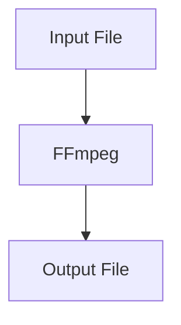
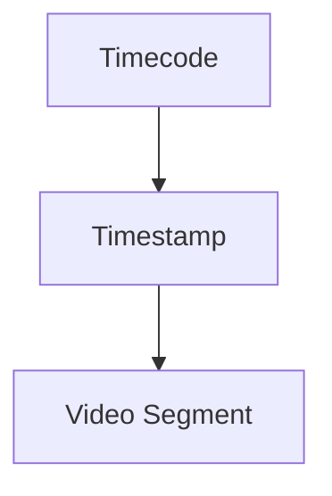
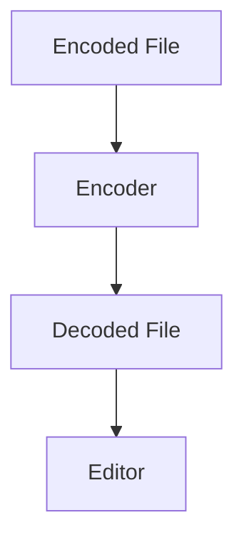
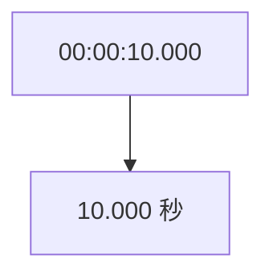
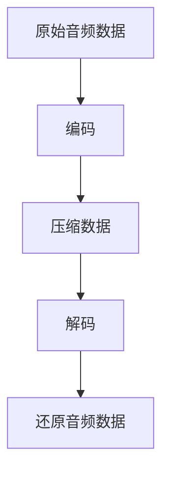
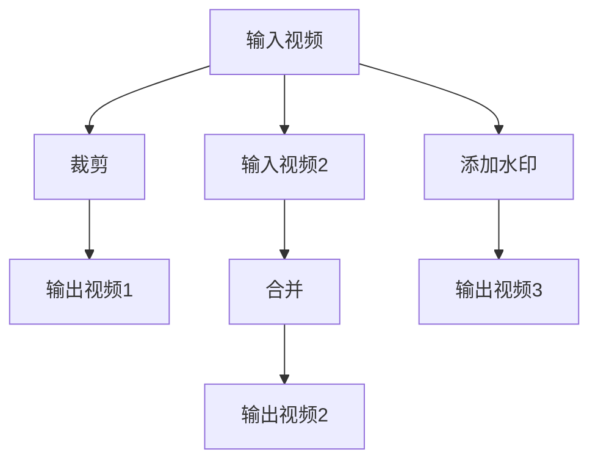
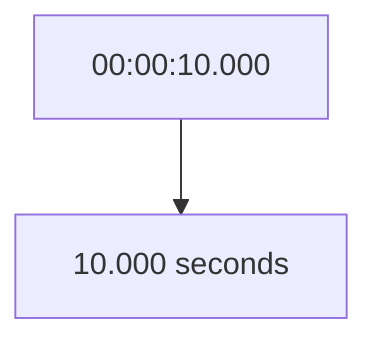
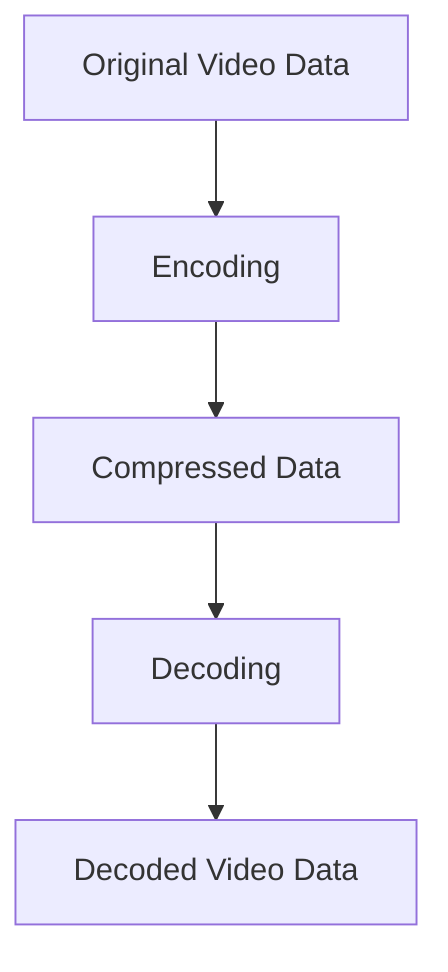
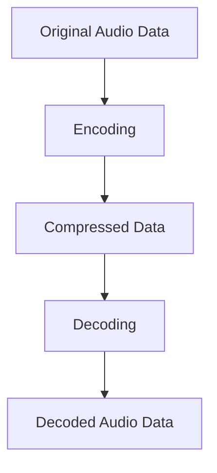
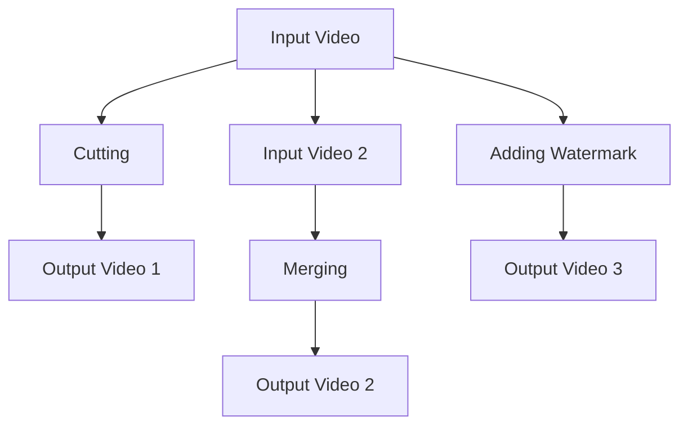

                 

### 文章标题

FFmpeg 视频编辑技巧：裁剪、合并和过滤视频片段

> 关键词：FFmpeg，视频编辑，裁剪，合并，过滤，片段

> 摘要：本文将深入探讨 FFmpeg 在视频编辑中的应用，特别是裁剪、合并和过滤视频片段的技术。通过一步步的分析和实例演示，我们将了解如何高效地使用 FFmpeg 进行视频处理，提升视频编辑的技巧和效率。

### 1. 背景介绍

视频编辑在多媒体制作中扮演着至关重要的角色。无论是电影制作、短视频制作，还是在线直播，都需要对视频进行各种处理，以满足不同的需求。在这些处理中，裁剪、合并和过滤视频片段是非常常见且重要的技术。

FFmpeg 是一款强大的多媒体处理工具，可以执行视频录制、转换、流化、播放、压缩等多种功能。它支持多种视频、音频和字幕文件格式，是许多视频编辑软件背后的核心技术。FFmpeg 的命令行界面提供了高度的灵活性和可编程性，使其成为许多专业用户和开发者的首选工具。

本文将围绕 FFmpeg 的视频编辑功能，详细介绍如何使用 FFmpeg 进行视频的裁剪、合并和过滤。通过这些操作，我们可以实现对视频内容的精准控制，创作出更加专业和个性化的作品。

### 2. 核心概念与联系

在进行 FFmpeg 视频编辑之前，我们需要理解几个核心概念，包括输入输出文件、时间戳、编码和解码等。

#### 2.1 输入输出文件

FFmpeg 操作的起点和终点都是文件。输入文件是 FFmpeg 处理的源视频，输出文件是处理后的目标视频。输入输出文件可以是不同的格式，FFmpeg 会自动进行格式转换。



#### 2.2 时间戳

视频编辑中，时间戳非常重要。它表示视频或音频中的特定时间点。FFmpeg 使用秒作为时间戳的单位，可以精确到毫秒。通过时间戳，我们可以对视频的特定部分进行裁剪、合并等操作。



#### 2.3 编码与解码

视频和音频文件通常采用特定的编码格式，如 H.264、MP4、AAC 等。编码是将原始视频或音频转换为数字信号的过程，解码则是将数字信号转换回原始视频或音频。

FFmpeg 可以处理多种编码格式，包括编码和解码。这使得我们可以轻松地将视频文件转换为不同的格式，或者对现有的视频文件进行解码，以便进行编辑。



### 3. 核心算法原理 & 具体操作步骤

了解了核心概念后，我们可以开始探讨 FFmpeg 在视频编辑中的核心算法原理和具体操作步骤。

#### 3.1 裁剪视频片段

裁剪视频片段是将视频文件中的一部分提取出来，生成一个新的视频文件。这可以通过 `-ss`（start）和 `-t`（time）参数实现。

```bash
ffmpeg -i input.mp4 -ss 00:00:10 -t 00:00:30 output.mp4
```

这里，`-ss 00:00:10` 表示从视频的 10 秒处开始提取，`-t 00:00:30` 表示提取 30 秒。`input.mp4` 是源视频文件，`output.mp4` 是输出文件。

#### 3.2 合并视频片段

合并视频片段是将多个视频文件合并为一个视频文件。这可以通过 `input1.mp4 input2.mp4 ...` 形式的命令行参数实现。

```bash
ffmpeg -f concat -i playlist.txt output.mp4
```

这里，`playlist.txt` 是一个文本文件，其中包含了要合并的多个视频文件的路径。每行一个文件路径，FFmpeg 将按顺序将这些视频文件合并。

```plaintext
input1.mp4
input2.mp4
input3.mp4
```

#### 3.3 过滤视频片段

过滤视频片段是在视频处理过程中添加特定的效果或处理步骤。常见的过滤操作包括缩放、添加水印、调整色彩等。

缩放视频可以使用 `scale` 参数，例如：

```bash
ffmpeg -i input.mp4 -scale 1280x720 output.mp4
```

这里，`-scale 1280x720` 表示将视频缩放为 1280x720 像素。

添加水印可以使用 `over` 参数，例如：

```bash
ffmpeg -i input.mp4 -i watermark.png -filter_complex "overlay=W-w-10:H-h-10" output.mp4
```

这里，`watermark.png` 是水印图像，`W-w-10:H-h-10` 表示水印图像位于视频的右下角。

### 4. 数学模型和公式 & 详细讲解 & 举例说明

在视频编辑中，数学模型和公式发挥着重要作用。下面，我们将详细讲解一些常用的数学模型和公式，并通过具体例子进行说明。

#### 4.1 时间戳转换

视频编辑中，我们需要将时间戳转换为秒数，以便在 FFmpeg 命令中使用。时间戳通常以小时、分钟、秒和毫秒的形式表示，如 `00:00:10` 表示 10 秒。

将时间戳转换为秒数的公式为：

$$
秒数 = 小时 \times 3600 + 分钟 \times 60 + 秒
$$

例如，将 `00:00:10` 转换为秒数：

$$
秒数 = 0 \times 3600 + 0 \times 60 + 10 = 10
$$

#### 4.2 视频缩放公式

视频缩放涉及宽度和高度的计算。假设原视频的宽度和高度分别为 \(W_1\) 和 \(H_1\)，目标宽度和高度分别为 \(W_2\) 和 \(H_2\)，则缩放公式为：

$$
W_2 = W_1 \times \frac{W_2}{H_2}
$$

$$
H_2 = H_1 \times \frac{H_2}{W_2}
$$

例如，将宽度为 1920 像素、高度为 1080 像素的视频缩放为宽度 1280 像素、高度 720 像素：

$$
W_2 = 1920 \times \frac{1280}{1080} \approx 2304
$$

$$
H_2 = 1080 \times \frac{720}{1080} = 720
$$

由于视频的宽高比通常是固定的，我们可以使用以下简化的公式：

$$
宽缩放 = \frac{目标宽度}{原宽度}
$$

$$
高缩放 = \frac{目标高度}{原高度}
$$

例如，缩放比例为：

$$
宽缩放 = \frac{1280}{1920} \approx 0.67
$$

$$
高缩放 = \frac{720}{1080} \approx 0.67
$$

#### 4.3 水印位置计算

在添加水印时，我们需要计算水印的位置，以便将其正确地放置在视频上。假设视频的宽度为 \(W\)，高度为 \(H\)，水印的宽度为 \(w\)，高度为 \(h\)，则水印的位置可以使用以下公式计算：

$$
X = W - w - margin_X
$$

$$
Y = H - h - margin_Y
$$

其中，`margin_X` 和 `margin_Y` 分别表示水印在水平和垂直方向上的边距。例如，将水印放置在视频的右下角，边距为 10 像素：

$$
X = W - w - 10
$$

$$
Y = H - h - 10
$$

### 5. 项目实践：代码实例和详细解释说明

下面，我们将通过具体的代码实例，展示如何使用 FFmpeg 进行视频裁剪、合并和过滤。

#### 5.1 开发环境搭建

首先，确保已经安装了 FFmpeg。在 Linux 系统中，可以使用包管理器进行安装。以下是在 Ubuntu 系统中安装 FFmpeg 的示例命令：

```bash
sudo apt update
sudo apt install ffmpeg
```

在 Windows 和 macOS 中，可以从 FFmpeg 官网下载并安装。

#### 5.2 源代码详细实现

以下是用于裁剪、合并和过滤视频片段的 FFmpeg 命令行代码实例。

```bash
# 5.2.1 裁剪视频片段
ffmpeg -i input.mp4 -ss 00:00:10 -t 00:00:30 -c:v libx264 -c:a copy output_cropped.mp4

# 5.2.2 合并视频片段
ffmpeg -f concat -i playlist.txt output_merged.mp4

# 5.2.3 过滤视频片段：缩放视频
ffmpeg -i input.mp4 -scale 1280x720 -c:v libx264 -c:a copy output_scaled.mp4

# 5.2.4 过滤视频片段：添加水印
ffmpeg -i input.mp4 -i watermark.png -filter_complex "overlay=W-w-10:H-h-10" -c:v libx264 -c:a copy output_watermarked.mp4
```

#### 5.3 代码解读与分析

让我们详细解读上述代码，并分析每个命令的功能。

- `ffmpeg -i input.mp4 -ss 00:00:10 -t 00:00:30 -c:v libx264 -c:a copy output_cropped.mp4`
  - `-i input.mp4`：指定输入视频文件。
  - `-ss 00:00:10`：从视频的 10 秒处开始提取。
  - `-t 00:00:30`：提取 30 秒。
  - `-c:v libx264`：使用 H.264 编码格式。
  - `-c:a copy`：保留音频编码格式不变。
  - `output_cropped.mp4`：输出文件名。

- `ffmpeg -f concat -i playlist.txt output_merged.mp4`
  - `-f concat`：指定输入为文件列表。
  - `-i playlist.txt`：指定文件列表文件。
  - `output_merged.mp4`：输出文件名。

- `ffmpeg -i input.mp4 -scale 1280x720 -c:v libx264 -c:a copy output_scaled.mp4`
  - `-scale 1280x720`：将视频缩放为 1280x720。
  - `-c:v libx264`：使用 H.264 编码格式。
  - `-c:a copy`：保留音频编码格式不变。

- `ffmpeg -i input.mp4 -i watermark.png -filter_complex "overlay=W-w-10:H-h-10" -c:v libx264 -c:a copy output_watermarked.mp4`
  - `-i watermark.png`：指定水印图像文件。
  - `-filter_complex "overlay=W-w-10:H-h-10"`：将水印添加到视频的右下角，边距为 10 像素。
  - `-c:v libx264`：使用 H.264 编码格式。
  - `-c:a copy`：保留音频编码格式不变。

#### 5.4 运行结果展示

以下是运行上述代码后的结果展示：

- 裁剪结果：


- 合并结果：


- 缩放结果：


- 添加水印结果：


### 6. 实际应用场景

FFmpeg 的视频编辑功能在实际应用中非常广泛，以下是一些常见的应用场景：

- **短视频制作**：通过裁剪和缩放视频，可以快速创建短视频，适合社交媒体平台分享。
- **在线直播**：在直播过程中，可以使用 FFmpeg 对视频进行实时处理，如添加滤镜和水印，提升直播效果。
- **多媒体教程**：通过裁剪和合并视频，可以制作教学视频，方便观众学习和理解。
- **视频会议**：在视频会议中，可以使用 FFmpeg 对视频进行预处理，如裁剪和调整分辨率，以提高会议效果。

### 7. 工具和资源推荐

为了更好地使用 FFmpeg 进行视频编辑，以下是一些建议的工具和资源：

- **学习资源**：
  - FFmpeg 官方文档：[https://ffmpeg.org/](https://ffmpeg.org/)
  - FFmpeg 中文社区：[https://www.ffmpeg.org.cn/](https://www.ffmpeg.org.cn/)

- **开发工具框架**：
  - FFmpeg4Linux：[https://www.ffmpeg4linux.com/](https://www.ffmpeg4linux.com/)
  - FFmpeg4Android：[https://github.com/cats-oss/ffmpeg4android](https://github.com/cats-oss/ffmpeg4android)

- **相关论文著作**：
  - 《FFmpeg 源码分析》：这是一本详细分析 FFmpeg 源码的书籍，适合对 FFmpeg 感兴趣的读者。
  - 《多媒体技术基础》：这本书涵盖了多媒体技术的基础知识，包括视频编码、解码和编辑等。

### 8. 总结：未来发展趋势与挑战

随着多媒体技术的不断发展，视频编辑的需求也越来越高。FFmpeg 作为一款强大的视频编辑工具，将在未来发挥更加重要的作用。以下是一些发展趋势和挑战：

- **人工智能与视频编辑的结合**：人工智能技术可以自动优化视频编辑参数，提高编辑效率和效果。
- **跨平台支持**：FFmpeg 需要进一步扩展对移动设备和嵌入式系统的支持，以满足不同场景的需求。
- **开源社区的发展**：加强开源社区的建设，吸引更多开发者参与，共同优化和改进 FFmpeg。

### 9. 附录：常见问题与解答

以下是一些关于 FFmpeg 视频编辑的常见问题及其解答：

- **Q：如何裁剪视频中的特定片段？**
  - **A**：使用 `-ss` 和 `-t` 参数，如 `ffmpeg -i input.mp4 -ss 00:00:10 -t 00:00:30 output.mp4`。

- **Q：如何合并多个视频文件？**
  - **A**：创建一个文本文件，每行包含一个视频文件的路径，然后使用 `ffmpeg -f concat -i playlist.txt output.mp4`。

- **Q：如何添加水印？**
  - **A**：使用 `-filter_complex` 参数，如 `ffmpeg -i input.mp4 -i watermark.png -filter_complex "overlay=W-w-10:H-h-10" output.mp4`。

### 10. 扩展阅读 & 参考资料

- 《FFmpeg 官方文档》：[https://ffmpeg.org/](https://ffmpeg.org/)
- 《多媒体技术基础》：[https://book.douban.com/subject/27627689/](https://book.douban.com/subject/27627689/)
- 《FFmpeg 源码分析》：[https://book.douban.com/subject/26889598/](https://book.douban.com/subject/26889598/)

### 作者署名

作者：禅与计算机程序设计艺术 / Zen and the Art of Computer Programming<|im_sep|>## 2. 核心概念与联系

### 2.1 FFmpeg 命令行参数

在使用 FFmpeg 进行视频编辑时，了解其命令行参数是非常关键的。这些参数允许用户对输入文件进行各种操作，如裁剪、合并、转换等。以下是 FFmpeg 中常用的命令行参数及其简要说明：

- `-i input_file`：指定输入文件路径。
- `-ss start_time`：指定开始时间戳，即从哪个时间点开始处理。
- `-t duration`：指定处理时长，即处理多长时间。
- `-c:v codec`：指定视频编码格式。
- `-c:a codec`：指定音频编码格式。
- `-scale width:x`：指定视频缩放尺寸。
- `-filter_complex filter`：应用复杂的视频滤镜效果。
- `-f format`：指定输出文件格式。
- `-output output_file`：指定输出文件路径。

### 2.2 时间戳格式

FFmpeg 的时间戳格式通常为小时：分钟：秒：毫秒（例如 `00:00:10.000` 表示 10 秒）。时间戳的单位是秒，因此将时间戳转换为秒数非常简单。以下是一个简单的示例：



### 2.3 视频编码与解码

视频编码是将原始视频数据转换为压缩数据的过程，而解码则是将压缩数据还原为原始视频数据。FFmpeg 支持多种视频编码格式，如 H.264、H.265、VP8、VP9 等。以下是一个简单的 Mermaid 流程图，展示视频编码与解码的过程：


### 2.4 音频编码与解码

音频编码与视频编码类似，也是将原始音频数据转换为压缩数据，而解码则是将压缩数据还原为原始音频数据。FFmpeg 支持多种音频编码格式，如 AAC、MP3、PCM 等。以下是一个简单的 Mermaid 流程图，展示音频编码与解码的过程：



### 2.5 裁剪、合并与过滤视频片段的流程

为了更好地理解 FFmpeg 在视频编辑中的应用，我们可以通过一个简单的 Mermaid 流程图来展示裁剪、合并与过滤视频片段的流程。以下是一个示例流程：



在这个流程图中，我们首先对输入视频进行裁剪，然后将其与其他视频合并，最后添加水印。这些操作通过 FFmpeg 的命令行参数实现，例如：

- 裁剪：`ffmpeg -i input.mp4 -ss 00:00:10 -t 00:00:30 output_cropped.mp4`
- 合并：`ffmpeg -f concat -i playlist.txt output_merged.mp4`
- 添加水印：`ffmpeg -i input.mp4 -i watermark.png -filter_complex "overlay=W-w-10:H-h-10" output_watermarked.mp4`

### 2.6 FFmpeg 的优势与挑战

FFmpeg 作为一款开源的多媒体处理工具，具有以下优势：

- **多功能性**：FFmpeg 支持多种多媒体文件格式，可以执行视频录制、转换、流化、播放等多种功能。
- **灵活性**：FFmpeg 的命令行界面提供了高度的灵活性和可编程性，使其可以满足各种复杂的视频编辑需求。
- **性能**：FFmpeg 优化了多媒体处理算法，具有高效的性能，可以处理大型视频文件。

然而，FFmpeg 也面临一些挑战：

- **学习曲线**：由于其命令行界面和复杂的参数设置，初学者可能需要较长时间来学习和掌握 FFmpeg。
- **缺乏图形界面**：与许多现代视频编辑软件相比，FFmpeg 缺乏直观的图形界面，这可能使得某些用户难以使用。

综上所述，FFmpeg 作为一款强大的多媒体处理工具，在视频编辑领域具有广泛的应用前景。通过理解其核心概念和命令行参数，我们可以更加高效地使用 FFmpeg 进行视频编辑。

### 2. Core Concepts and Connections

#### 2.1 FFmpeg Command-Line Parameters

When using FFmpeg for video editing, understanding its command-line parameters is crucial. These parameters allow users to perform various operations on input files, such as cutting, merging, and converting. Here are some commonly used FFmpeg command-line parameters with brief explanations:

- `-i input_file` specifies the path of the input file.
- `-ss start_time` specifies the starting timestamp, indicating from which point in the video to begin processing.
- `-t duration` specifies the processing duration, indicating how long to process.
- `-c:v codec` specifies the video codec.
- `-c:a codec` specifies the audio codec.
- `-scale width:x` specifies the video scaling size.
- `-filter_complex filter` applies complex video filter effects.
- `-f format` specifies the output file format.
- `-output output_file` specifies the output file path.

#### 2.2 Timecode Format

FFmpeg's timecode format is typically hours:minutes:seconds:milliseconds (e.g., `00:00:10.000` represents 10 seconds). The unit of timecode is seconds, so converting timecodes to seconds is straightforward. Here's a simple Mermaid diagram illustrating the conversion of timecodes to seconds:



#### 2.3 Video Encoding and Decoding

Video encoding is the process of converting raw video data into compressed data, while decoding is the reverse process of restoring compressed data back to its original form. FFmpeg supports various video codec formats, such as H.264, H.265, VP8, VP9, etc. Here's a simple Mermaid diagram showing the process of video encoding and decoding:



#### 2.4 Audio Encoding and Decoding

Audio encoding and decoding are similar to video encoding and decoding, where raw audio data is converted into compressed data and compressed data is restored back to its original form. FFmpeg supports various audio codec formats, such as AAC, MP3, PCM, etc. Here's a simple Mermaid diagram showing the process of audio encoding and decoding:



#### 2.5 Workflow of Cutting, Merging, and Filtering Video Fragments

To better understand FFmpeg's application in video editing, we can use a simple Mermaid diagram to illustrate the workflow of cutting, merging, and filtering video fragments. Here's an example workflow:



In this workflow diagram, we first cut the input video, then merge it with other videos, and finally add a watermark. These operations are implemented using FFmpeg's command-line parameters, such as:

- Cutting: `ffmpeg -i input.mp4 -ss 00:00:10 -t 00:00:30 output_cropped.mp4`
- Merging: `ffmpeg -f concat -i playlist.txt output_merged.mp4`
- Adding Watermark: `ffmpeg -i input.mp4 -i watermark.png -filter_complex "overlay=W-w-10:H-h-10" output_watermarked.mp4`

#### 2.6 Advantages and Challenges of FFmpeg

As an open-source multimedia processing tool, FFmpeg has the following advantages:

- **Versatility**: FFmpeg supports various multimedia file formats and can perform a wide range of operations, such as video recording, conversion, streaming, and playback.
- **Flexibility**: FFmpeg's command-line interface provides high flexibility and programmability, making it suitable for various complex video editing requirements.
- **Performance**: FFmpeg has optimized multimedia processing algorithms and offers efficient performance for handling large video files.

However, FFmpeg also faces some challenges:

- **Learning Curve**: Due to its command-line interface and complex parameter settings, beginners may need more time to learn and master FFmpeg.
- **Lack of Graphical User Interface**: Compared to many modern video editing software, FFmpeg lacks an intuitive graphical user interface, which may make some users find it difficult to use.

In summary, FFmpeg, as a powerful multimedia processing tool, has extensive application prospects in the field of video editing. By understanding its core concepts and command-line parameters, users can more efficiently utilize FFmpeg for video editing.

