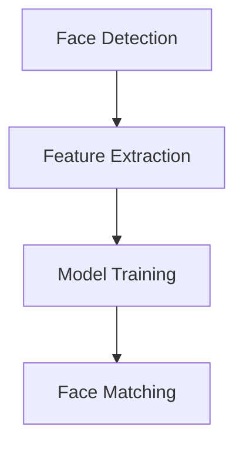

                 

### 文章标题

**Face Recognition原理与代码实例讲解**

随着人工智能技术的飞速发展，人脸识别技术已经成为生物识别领域的一项重要技术。它在安全监控、身份验证、个人隐私保护等领域具有广泛的应用。本文将详细讲解人脸识别的基本原理、核心算法及其代码实现。通过逐步分析推理，我们将帮助读者深入理解这一技术，从而为未来的研究和应用奠定基础。

### 关键词：

* 人脸识别
* 生物识别
* 特征提取
* 机器学习
* 深度学习
* 模型训练
* 面部检测
* 面部比对

### 摘要：

本文主要介绍了人脸识别技术的基本原理、核心算法及其实际应用。首先，我们从背景介绍入手，探讨人脸识别技术的发展历程及其重要性。接着，我们深入分析了核心概念与联系，包括特征提取、机器学习、深度学习等。随后，我们详细讲解了人脸识别的具体操作步骤，包括面部检测、特征提取、模型训练和面部比对等。最后，通过一个实际的代码实例，我们展示了如何使用Python实现一个简单的人脸识别系统。本文旨在通过清晰易懂的语言和示例，让读者全面了解人脸识别技术，为今后的学习和研究提供参考。

---

**1. 背景介绍（Background Introduction）**

人脸识别技术是一种通过捕捉和分析人脸图像，以识别或验证个人身份的生物识别技术。自20世纪60年代以来，人脸识别技术经历了快速的发展。早期的算法主要依赖于几何特征，如人脸轮廓、眼睛位置等。随着计算机性能的提升和机器学习算法的进步，现代人脸识别技术逐渐转向基于深度学习的模型。

人脸识别技术在安全监控、身份验证、个人隐私保护等领域具有广泛的应用。例如，在安全监控方面，人脸识别技术可以实时识别进入特定区域的嫌疑人，提高监控的效率和准确性；在身份验证方面，人脸识别技术可以用于门禁系统、手机解锁等；在个人隐私保护方面，人脸识别技术可以帮助用户在社交媒体上匿名发布内容，保护个人隐私。

近年来，随着深度学习技术的兴起，人脸识别技术的准确性和实时性得到了显著提升。许多大型科技公司和研究机构都在积极研发人脸识别技术，推动其在更多领域的应用。本文将详细介绍人脸识别技术的核心原理和实际应用，帮助读者更好地理解和应用这一技术。

---

**2. 核心概念与联系（Core Concepts and Connections）**

### 2.1 人脸识别系统的基本组成部分

一个典型的人脸识别系统通常包括以下几个关键组成部分：

1. **面部检测（Face Detection）**：
   面部检测是识别图像中人脸的过程。常见的面部检测算法有 Haar-like Features、HOG (Histogram of Oriented Gradients)、MTCNN (Multi-Task Cascaded Convolutional Networks) 等。

2. **特征提取（Feature Extraction）**：
   特征提取是从人脸图像中提取具有区分性的特征的过程。常用的特征提取方法包括 PCA (Principal Component Analysis)、LDA (Linear Discriminant Analysis)、Eigenfaces、深度特征提取（如 CNN、Siamese Network）等。

3. **模型训练（Model Training）**：
   模型训练是通过大量人脸图像数据来训练分类器，以便能够准确识别和验证人脸。常见的训练方法包括 SVM (Support Vector Machine)、KNN (K-Nearest Neighbors)、神经网络（如 CNN、RNN）等。

4. **面部比对（Face Matching）**：
   面部比对是将检测到的人脸与已知人脸进行比较的过程，以确定它们是否属于同一人。常用的比对方法包括 L2 距离、Cosine Similarity、深度特征比对等。

### 2.2 核心概念之间的关系

在人脸识别系统中，面部检测和特征提取是两个关键环节。面部检测用于定位图像中的人脸位置，特征提取则用于从人脸图像中提取具有区分性的特征。这两个步骤的结果将用于后续的模型训练和面部比对。

面部检测和特征提取的结果会直接影响到模型训练的效果。高质量的检测结果和特征提取有助于提高模型训练的准确性和效率。而模型训练的效果将直接影响面部比对的准确性。

下面是使用 Mermaid 流程图表示的人脸识别系统的基本流程：

```
graph TB
A[面部检测] --> B[特征提取]
B --> C[模型训练]
C --> D[面部比对]
```

---

**2. Core Concepts and Connections**

### 2.1 Basic Components of a Face Recognition System

A typical face recognition system generally consists of several key components:

1. **Face Detection**:
   Face detection is the process of identifying faces in an image. Common face detection algorithms include Haar-like Features, HOG (Histogram of Oriented Gradients), and MTCNN (Multi-Task Cascaded Convolutional Networks).

2. **Feature Extraction**:
   Feature extraction is the process of extracting discriminative features from face images. Common methods include PCA (Principal Component Analysis), LDA (Linear Discriminant Analysis), Eigenfaces, and deep feature extraction (such as CNN, Siamese Network).

3. **Model Training**:
   Model training involves training classifiers using a large dataset of face images to accurately recognize and verify faces. Common training methods include SVM (Support Vector Machine), KNN (K-Nearest Neighbors), and neural networks (such as CNN, RNN).

4. **Face Matching**:
   Face matching is the process of comparing detected faces to known faces to determine if they belong to the same person. Common matching methods include L2 distance, Cosine Similarity, and deep feature matching.

### 2.2 Relationships between Core Concepts

In a face recognition system, face detection and feature extraction are two critical steps. Face detection locates faces in an image, while feature extraction extracts discriminative features from face images. The results of these steps are used for subsequent model training and face matching.

The quality of the results from face detection and feature extraction directly affects the effectiveness of model training. High-quality detection and feature extraction can improve the accuracy and efficiency of model training. The performance of the trained model, in turn, affects the accuracy of face matching.

Below is a Mermaid flowchart representing the basic process of a face recognition system:



---

**3. 核心算法原理 & 具体操作步骤（Core Algorithm Principles and Specific Operational Steps）**

### 3.1 面部检测算法（Face Detection Algorithms）

面部检测是人脸识别系统的第一步，其主要目标是识别并定位图像中的人脸区域。以下是一些常见的人脸检测算法及其原理：

#### 3.1.1 Haar-like Features

Haar-like Features 是一种基于积分图像的简单人脸检测算法。它利用人脸区域与周围区域在特征点上的像素差异来检测人脸。特征点通常是矩形窗口，通过计算窗口内部与外部的像素和差值来产生特征值。Haar-like Features 算法简单、易于实现，但检测速度较慢，且对光照和姿态变化敏感。

#### 3.1.2 HOG (Histogram of Oriented Gradients)

HOG 是一种基于梯度方向直方图的人脸检测算法。它通过计算图像中每个像素点的梯度方向和强度来生成特征向量。HOG 特征对纹理和形状变化具有较强的鲁棒性，因此常用于物体检测。HOG 算法相比于 Haar-like Features 有更高的检测准确性和速度。

#### 3.1.3 MTCNN (Multi-Task Cascaded Convolutional Networks)

MTCNN 是一种基于深度学习的多任务级联人脸检测算法。它通过多个网络层逐步定位人脸区域，并使用非极大值抑制（NMS）来消除冗余检测。MTCNN 具有较高的检测速度和准确性，且对姿态变化、遮挡和光照变化具有较强的鲁棒性。

### 3.2 特征提取算法（Feature Extraction Algorithms）

特征提取是将人脸图像转化为可用于模型训练的特征向量。以下是一些常见的特征提取算法及其原理：

#### 3.2.1 PCA (Principal Component Analysis)

PCA 是一种基于降维的人脸特征提取算法。它通过计算图像的协方差矩阵并求解其特征值和特征向量，将人脸图像映射到新的正交空间中，以提取主要特征。PCA 算法简单有效，但可能在特征丢失和识别率方面存在一定局限。

#### 3.2.2 LDA (Linear Discriminant Analysis)

LDA 是一种基于分类的人脸特征提取算法。它通过最大化类内离散度和最小化类间离散度来选择最优特征子集。LDA 算法能够提高特征的可分性，从而提高识别率。但 LDA 对噪声敏感，且计算复杂度较高。

#### 3.2.3 Eigenfaces

Eigenfaces 是一种基于线性变换的人脸特征提取算法。它通过求解人脸图像的协方差矩阵并计算其特征值和特征向量，将人脸图像映射到新的特征空间中。Eigenfaces 算法在识别率和计算效率方面表现出色，但可能对光照变化敏感。

#### 3.2.4 深度学习特征提取

深度学习特征提取是一种基于深度神经网络的特征提取方法。例如，卷积神经网络（CNN）可以自动学习并提取具有区分力的人脸特征。深度学习特征提取在识别准确性和鲁棒性方面具有显著优势，但训练过程较为复杂。

### 3.3 模型训练算法（Model Training Algorithms）

模型训练是构建人脸识别系统的重要步骤。以下是一些常见的模型训练算法及其原理：

#### 3.3.1 SVM (Support Vector Machine)

SVM 是一种基于最大化类间距的分类算法。它通过寻找一个最优超平面将不同类别的人脸特征分开，从而实现分类。SVM 在人脸识别中表现出色，但其训练时间较长。

#### 3.3.2 KNN (K-Nearest Neighbors)

KNN 是一种基于邻域的简单分类算法。它通过计算新样本与训练样本的相似度来确定新样本的类别。KNN 算法简单、易于实现，但对噪声敏感，且分类性能较差。

#### 3.3.3 神经网络（Neural Networks）

神经网络是一种基于多层感知器（MLP）的模型训练方法。例如，卷积神经网络（CNN）可以自动学习并提取具有区分力的人脸特征。神经网络在人脸识别中表现出色，但其训练过程较为复杂。

### 3.4 面部比对算法（Face Matching Algorithms）

面部比对是将检测到的人脸与已知人脸进行比较的过程。以下是一些常见的面部比对算法及其原理：

#### 3.4.1 L2 距离（Euclidean Distance）

L2 距离是一种基于欧几里得距离的人脸比对算法。它计算两个特征向量之间的欧几里得距离，以确定它们是否属于同一人。L2 距离在人脸比对中表现出色，但对光照和姿态变化敏感。

#### 3.4.2 Cosine Similarity

Cosine Similarity 是一种基于余弦相似度的人脸比对算法。它计算两个特征向量的夹角余弦值，以确定它们是否属于同一人。Cosine Similarity 在人脸比对中表现出色，且对光照和姿态变化具有较强的鲁棒性。

#### 3.4.3 深度特征比对

深度特征比对是一种基于深度学习的人脸比对算法。它通过训练深度神经网络来学习人脸特征之间的相似性度量。深度特征比对在人脸比对中表现出色，且对光照、姿态和遮挡变化具有较强的鲁棒性。

---

**3. Core Algorithm Principles and Specific Operational Steps**

### 3.1 Face Detection Algorithms

Face detection is the first step in a face recognition system, with the main goal of identifying and locating faces in an image. Here are some common face detection algorithms and their principles:

#### 3.1.1 Haar-like Features

Haar-like Features is a simple face detection algorithm based on integral images. It uses the difference in pixel sums between facial regions and their surroundings at feature points to detect faces. Feature points are typically rectangular windows, and the feature value is calculated by summing the pixel values inside and outside the window. Haar-like Features algorithms are simple and easy to implement but are slower and more sensitive to lighting and pose changes.

#### 3.1.2 HOG (Histogram of Oriented Gradients)

HOG is a face detection algorithm based on the gradient direction histogram. It calculates the gradient direction and intensity at each pixel to generate a feature vector. HOG features are robust to texture and shape changes, making it suitable for object detection. HOG algorithms have higher detection accuracy and speed compared to Haar-like Features.

#### 3.1.3 MTCNN (Multi-Task Cascaded Convolutional Networks)

MTCNN is a multi-task cascaded face detection algorithm based on deep learning. It progressively locates faces through multiple network layers and uses Non-Maximum Suppression (NMS) to eliminate redundant detections. MTCNN has high detection speed and accuracy and is robust to changes in pose, occlusion, and lighting.

### 3.2 Feature Extraction Algorithms

Feature extraction converts face images into feature vectors suitable for model training. Here are some common feature extraction algorithms and their principles:

#### 3.2.1 PCA (Principal Component Analysis)

PCA is a face feature extraction algorithm based on dimensionality reduction. It calculates the covariance matrix of the face images, finds its eigenvalues and eigenvectors, and maps the face images into a new orthogonal space to extract the main features. PCA is simple and effective but may suffer from feature loss and recognition rate limitations.

#### 3.2.2 LDA (Linear Discriminant Analysis)

LDA is a face feature extraction algorithm based on classification. It maximizes the within-class variance and minimizes the between-class variance to select the optimal feature subset. LDA improves feature separability and thus recognition rate. However, it is sensitive to noise and computationally expensive.

#### 3.2.3 Eigenfaces

Eigenfaces is a linear transformation-based face feature extraction algorithm. It calculates the covariance matrix of the face images, finds its eigenvalues and eigenvectors, and maps the face images into a new feature space. Eigenfaces is outstanding in both recognition rate and computational efficiency but may be sensitive to lighting changes.

#### 3.2.4 Deep Learning Feature Extraction

Deep learning feature extraction is a feature extraction method based on deep neural networks. For example, Convolutional Neural Networks (CNN) can automatically learn and extract discriminative face features. Deep learning feature extraction excels in recognition accuracy and robustness but has a complex training process.

### 3.3 Model Training Algorithms

Model training is a critical step in building a face recognition system. Here are some common model training algorithms and their principles:

#### 3.3.1 SVM (Support Vector Machine)

SVM is a classification algorithm that maximizes the margin between different classes of face features. It finds the optimal hyperplane that separates the face features of different classes, thus achieving classification. SVM is outstanding in face recognition but has a long training time.

#### 3.3.2 KNN (K-Nearest Neighbors)

KNN is a simple neighborhood-based classification algorithm. It determines the class of a new sample by calculating the similarity between the new sample and the training samples. KNN is simple and easy to implement but is sensitive to noise and has poor classification performance.

#### 3.3.3 Neural Networks

Neural networks are model training methods based on multi-layer perceptrons (MLP). For example, Convolutional Neural Networks (CNN) can automatically learn and extract discriminative face features. Neural networks are outstanding in face recognition but have a complex training process.

### 3.4 Face Matching Algorithms

Face matching is the process of comparing detected faces to known faces to determine if they belong to the same person. Here are some common face matching algorithms and their principles:

#### 3.4.1 L2 Distance (Euclidean Distance)

L2 distance is a face matching algorithm based on Euclidean distance. It calculates the Euclidean distance between two feature vectors to determine if they belong to the same person. L2 distance is outstanding in face matching but is sensitive to lighting and pose changes.

#### 3.4.2 Cosine Similarity

Cosine Similarity is a face matching algorithm based on cosine similarity. It calculates the cosine similarity between two feature vectors to determine if they belong to the same person. Cosine Similarity is outstanding in face matching and is robust to changes in lighting, pose, and occlusion.

#### 3.4.3 Deep Feature Matching

Deep feature matching is a face matching algorithm based on deep learning. It trains a deep neural network to learn the similarity measure between face features. Deep feature matching is outstanding in face matching and is robust to changes in lighting, pose, and occlusion.
### 4. 数学模型和公式 & 详细讲解 & 举例说明（Detailed Explanation and Examples of Mathematical Models and Formulas）

在人脸识别技术中，数学模型和公式起着至关重要的作用。这些模型和公式帮助我们理解和实现人脸识别的各个环节，包括面部检测、特征提取、模型训练和面部比对。本节将详细讲解这些数学模型和公式，并通过实际例子来说明它们的应用。

#### 4.1 面部检测中的数学模型

面部检测中的数学模型主要涉及图像处理和特征提取。以下是一些常用的数学模型和公式：

##### 4.1.1 积分图像（Integral Image）

积分图像是一种用于加速图像卷积运算的预处理技术。它的计算公式如下：

$$
I(x, y) = \sum_{i=0}^{x} \sum_{j=0}^{y} I(i, j)
$$

其中，\(I(x, y)\) 表示点 \((x, y)\) 的积分值，\(I(i, j)\) 表示原始图像中的像素值。

##### 4.1.2 Haar-like Features

Haar-like Features 是一种基于积分图像的检测特征，其计算公式如下：

$$
f(x, y, w, h) = \sum_{i=x}^{x+w} \sum_{j=y}^{y+h} (I(i, j) - I(i-w, j) - I(i, j-h) + I(i-w, j-h))
$$

其中，\(f(x, y, w, h)\) 表示特征值，\(w\) 和 \(h\) 分别表示特征窗口的宽度和高度。

##### 4.1.3 HOG（Histogram of Oriented Gradients）

HOG 特征通过计算图像中每个像素点的梯度方向和强度来生成特征向量。其计算公式如下：

$$
h(i, j) = \sum_{k=-1}^{1} \sum_{l=-1}^{1} \gamma_{kl} \cdot g(i+k, j+l)
$$

其中，\(g(i, j)\) 表示像素点 \((i, j)\) 的梯度值，\(\gamma_{kl}\) 表示梯度方向的权重。

#### 4.2 特征提取中的数学模型

特征提取是将人脸图像转化为具有区分性的特征向量。以下是一些常用的数学模型和公式：

##### 4.2.1 PCA（Principal Component Analysis）

PCA 是一种降维技术，通过计算图像的协方差矩阵并求解其特征值和特征向量来提取主要特征。其计算公式如下：

$$
\sigma_i = \sqrt{\lambda_i}
$$

$$
e_i = \frac{v_i}{\sigma_i}
$$

其中，\(\sigma_i\) 表示特征值，\(e_i\) 表示特征向量，\(v_i\) 表示协方差矩阵的列向量。

##### 4.2.2 LDA（Linear Discriminant Analysis）

LDA 是一种分类技术，通过最大化类内离散度和最小化类间离散度来选择最优特征子集。其计算公式如下：

$$
w = \arg \max_w \left[ \sum_{i=1}^{c} \sum_{j=1}^{n_i} (x_{ij} - \mu_{i})^T w \right]
$$

其中，\(w\) 表示特征向量，\(x_{ij}\) 表示第 \(i\) 类第 \(j\) 个样本的特征向量，\(\mu_{i}\) 表示第 \(i\) 类的平均特征向量。

##### 4.2.3 Eigenfaces

Eigenfaces 是一种基于线性变换的特征提取方法，通过计算图像的协方差矩阵并求解其特征值和特征向量来提取人脸特征。其计算公式与 PCA 类似。

##### 4.2.4 深度学习特征提取

深度学习特征提取通常使用卷积神经网络（CNN）来自动学习人脸特征。以下是一个简单的卷积神经网络结构：

```
Input Layer: (height, width, channels)
Conv Layer 1: (filter size, stride, padding) -> (height', width', channels')
ReLU Activation
Pooling Layer 1: (pool size, stride) -> (height'', width'', channels'')
...
Conv Layer N: (filter size, stride, padding) -> (height^{N}', width^{N}', channels^{N}')
ReLU Activation
Pooling Layer N: (pool size, stride) -> (height^{N+1}', width^{N+1}', channels^{N+1}')
Output Layer: (1, 1, 1)
```

#### 4.3 模型训练中的数学模型

模型训练是使用训练数据来优化模型参数的过程。以下是一些常见的数学模型和公式：

##### 4.3.1 SVM（Support Vector Machine）

SVM 的训练目标是最小化分类误差并最大化类间距。其优化问题可以表示为：

$$
\min_{\beta, \beta_0} \frac{1}{2} ||\beta||^2 + C \sum_{i=1}^{n} \xi_i
$$

其中，\(\beta\) 表示权重向量，\(\beta_0\) 表示偏置，\(C\) 表示惩罚参数，\(\xi_i\) 表示第 \(i\) 个样本的误差。

##### 4.3.2 KNN（K-Nearest Neighbors）

KNN 的训练过程是保存训练数据及其标签，并在测试时计算新样本与训练样本的相似度。其计算公式如下：

$$
y(x) = \arg \max_{y} \sum_{i=1}^{k} \exp \left( -\gamma \cdot ||x - x_i||^2 \right)
$$

其中，\(x\) 表示新样本，\(x_i\) 表示训练样本，\(y(x)\) 表示新样本的预测标签，\(\gamma\) 表示调节参数。

##### 4.3.3 神经网络（Neural Networks）

神经网络的训练过程是通过反向传播算法来更新权重和偏置。其计算公式如下：

$$
\delta_{ij} = \frac{\partial L}{\partial z_j} \cdot \sigma'(z_j)
$$

$$
w_{ji}^{new} = w_{ji}^{old} - \alpha \cdot \delta_{ij} \cdot x_j
$$

其中，\(L\) 表示损失函数，\(z_j\) 表示神经元 \(j\) 的输出，\(\sigma'\) 表示 sigmoid 函数的导数，\(\alpha\) 表示学习率，\(x_j\) 表示神经元 \(j\) 的输入。

#### 4.4 面部比对中的数学模型

面部比对是计算检测到的人脸与已知人脸之间的相似度。以下是一些常用的数学模型和公式：

##### 4.4.1 L2 距离（Euclidean Distance）

L2 距离是计算两个特征向量之间欧几里得距离的公式：

$$
d(x, y) = \sqrt{\sum_{i=1}^{n} (x_i - y_i)^2}
$$

##### 4.4.2 Cosine Similarity

Cosine Similarity 是计算两个特征向量之间余弦相似度的公式：

$$
\cos \theta = \frac{x \cdot y}{\lVert x \rVert \cdot \lVert y \rVert}
$$

其中，\(x\) 和 \(y\) 分别表示两个特征向量，\(\theta\) 表示它们之间的夹角。

##### 4.4.3 深度特征比对

深度特征比对通常使用深度神经网络来学习特征向量之间的相似度度量。其计算公式与 Cosine Similarity 类似，但使用深度神经网络来计算特征向量之间的相似度。

---

**4. Mathematical Models and Formulas & Detailed Explanation & Examples**

In facial recognition technology, mathematical models and formulas play a crucial role in understanding and implementing the various stages of the system, including face detection, feature extraction, model training, and face matching. This section will provide a detailed explanation of these mathematical models and formulas, along with practical examples to illustrate their applications.

#### 4.1 Mathematical Models in Face Detection

The mathematical models in face detection are primarily involved in image processing and feature extraction. Here are some commonly used mathematical models and formulas:

##### 4.1.1 Integral Image

Integral image is a pre-processing technique used to accelerate image convolution operations. Its calculation formula is as follows:

$$
I(x, y) = \sum_{i=0}^{x} \sum_{j=0}^{y} I(i, j)
$$

where \(I(x, y)\) represents the integral value at point \((x, y)\) and \(I(i, j)\) represents the pixel value in the original image.

##### 4.1.2 Haar-like Features

Haar-like Features are detection features based on integral images. Its calculation formula is as follows:

$$
f(x, y, w, h) = \sum_{i=x}^{x+w} \sum_{j=y}^{y+h} (I(i, j) - I(i-w, j) - I(i, j-h) + I(i-w, j-h))
$$

where \(f(x, y, w, h)\) represents the feature value, \(w\) and \(h\) represent the width and height of the feature window, respectively.

##### 4.1.3 HOG (Histogram of Oriented Gradients)

HOG features are generated by calculating the gradient direction and intensity at each pixel in the image. Its calculation formula is as follows:

$$
h(i, j) = \sum_{k=-1}^{1} \sum_{l=-1}^{1} \gamma_{kl} \cdot g(i+k, j+l)
$$

where \(g(i, j)\) represents the gradient value at pixel point \((i, j)\) and \(\gamma_{kl}\) represents the weight of the gradient direction.

#### 4.2 Mathematical Models in Feature Extraction

Feature extraction involves converting face images into discriminative feature vectors. Here are some commonly used mathematical models and formulas:

##### 4.2.1 PCA (Principal Component Analysis)

PCA is a dimensionality reduction technique that extracts the main features by calculating the covariance matrix of the face images and solving its eigenvalues and eigenvectors. Its calculation formula is as follows:

$$
\sigma_i = \sqrt{\lambda_i}
$$

$$
e_i = \frac{v_i}{\sigma_i}
$$

where \(\sigma_i\) represents the eigenvalue, \(e_i\) represents the eigenvector, and \(v_i\) represents the column vector of the covariance matrix.

##### 4.2.2 LDA (Linear Discriminant Analysis)

LDA is a classification technique that selects the optimal feature subset by maximizing the within-class variance and minimizing the between-class variance. Its calculation formula is as follows:

$$
w = \arg \max_w \left[ \sum_{i=1}^{c} \sum_{j=1}^{n_i} (x_{ij} - \mu_{i})^T w \right]
$$

where \(w\) represents the feature vector, \(x_{ij}\) represents the feature vector of the \(i\)th class and \(j\)th sample, and \(\mu_{i}\) represents the average feature vector of the \(i\)th class.

##### 4.2.3 Eigenfaces

Eigenfaces is a linear transformation-based feature extraction method that extracts face features by calculating the covariance matrix of the face images and solving its eigenvalues and eigenvectors. Its calculation formula is similar to that of PCA.

##### 4.2.4 Deep Learning Feature Extraction

Deep learning feature extraction typically uses Convolutional Neural Networks (CNN) to automatically learn discriminative face features. Here is a simple structure of a CNN:

```
Input Layer: (height, width, channels)
Conv Layer 1: (filter size, stride, padding) -> (height', width', channels')
ReLU Activation
Pooling Layer 1: (pool size, stride) -> (height'', width'', channels'')
...
Conv Layer N: (filter size, stride, padding) -> (height^{N}', width^{N}', channels^{N}')
ReLU Activation
Pooling Layer N: (pool size, stride) -> (height^{N+1}', width^{N+1}', channels^{N+1}')
Output Layer: (1, 1, 1)
```

#### 4.3 Mathematical Models in Model Training

Model training is the process of optimizing the model parameters using training data. Here are some common mathematical models and formulas:

##### 4.3.1 SVM (Support Vector Machine)

The training objective of SVM is to minimize classification errors and maximize the margin between different classes of face features. Its optimization problem can be represented as:

$$
\min_{\beta, \beta_0} \frac{1}{2} ||\beta||^2 + C \sum_{i=1}^{n} \xi_i
$$

where \(\beta\) represents the weight vector, \(\beta_0\) represents the bias, \(C\) represents the penalty parameter, and \(\xi_i\) represents the error of the \(i\)th sample.

##### 4.3.2 KNN (K-Nearest Neighbors)

The training process of KNN is to store the training data and their labels and calculate the similarity between the new sample and the training samples during testing. Its calculation formula is as follows:

$$
y(x) = \arg \max_{y} \sum_{i=1}^{k} \exp \left( -\gamma \cdot ||x - x_i||^2 \right)
$$

where \(x\) represents the new sample, \(x_i\) represents the training sample, \(y(x)\) represents the predicted label of the new sample, and \(\gamma\) represents the regulation parameter.

##### 4.3.3 Neural Networks

The training process of neural networks is to update the weights and biases through the backpropagation algorithm. Its calculation formula is as follows:

$$
\delta_{ij} = \frac{\partial L}{\partial z_j} \cdot \sigma'(z_j)
$$

$$
w_{ji}^{new} = w_{ji}^{old} - \alpha \cdot \delta_{ij} \cdot x_j
$$

where \(L\) represents the loss function, \(z_j\) represents the output of the neuron \(j\), \(\sigma'\) represents the derivative of the sigmoid function, \(\alpha\) represents the learning rate, and \(x_j\) represents the input of the neuron \(j\).

#### 4.4 Mathematical Models in Face Matching

Face matching is the process of calculating the similarity between a detected face and a known face. Here are some commonly used mathematical models and formulas:

##### 4.4.1 L2 Distance (Euclidean Distance)

L2 distance is the formula for calculating the Euclidean distance between two feature vectors:

$$
d(x, y) = \sqrt{\sum_{i=1}^{n} (x_i - y_i)^2}
$$

##### 4.4.2 Cosine Similarity

Cosine similarity is the formula for calculating the cosine similarity between two feature vectors:

$$
\cos \theta = \frac{x \cdot y}{\lVert x \rVert \cdot \lVert y \rVert}
$$

where \(x\) and \(y\) represent two feature vectors, and \(\theta\) represents the angle between them.

##### 4.4.3 Deep Feature Matching

Deep feature matching typically uses a deep neural network to learn the similarity measure between feature vectors. The calculation formula is similar to that of Cosine Similarity, but uses a deep neural network to calculate the similarity between feature vectors.
### 5. 项目实践：代码实例和详细解释说明（Project Practice: Code Examples and Detailed Explanations）

在本节中，我们将通过一个实际的 Python 代码实例，展示如何使用 OpenCV 和 dlib 库实现一个简单的人脸识别系统。这个系统将包括面部检测、特征提取和面部比对三个主要步骤。我们将详细解释每一步的实现细节，并分析代码的关键部分。

#### 5.1 开发环境搭建

在开始编写代码之前，我们需要安装必要的库和工具。以下是在 Python 环境中搭建开发环境所需的基本步骤：

1. **安装 Python**：确保您的计算机上已经安装了 Python 3.x 版本。

2. **安装 OpenCV**：使用以下命令安装 OpenCV：

   ```
   pip install opencv-python
   ```

3. **安装 dlib**：使用以下命令安装 dlib：

   ```
   pip install dlib
   ```

4. **安装用于 dlib 的预训练模型**：下载预训练的 facial landmark detector 模型（即 dlib 的 OpenCV 模型）：

   ```
   wget http://dlib.net/files/shape_predictor_68_face_landmarks.dat.bz2
   bunzip2 shape_predictor_68_face_landmarks.dat.bz2
   ```

#### 5.2 源代码详细实现

以下是实现人脸识别系统的完整代码：

```python
import cv2
import dlib
import numpy as np

# 初始化 dlib 的面部检测器和特征提取器
detector = dlib.get_frontal_face_detector()
predictor = dlib.shape_predictor('shape_predictor_68_face_landmarks.dat')

# 加载需要检测的人脸图像
image = cv2.imread('face.jpg')

# 将图像转换为灰度图像
gray = cv2.cvtColor(image, cv2.COLOR_BGR2GRAY)

# 检测图像中的面部
faces = detector(gray)

# 遍历检测到的面部
for i, face in enumerate(faces):
    # 提取面部矩形框
    x, y, w, h = face.left(), face.top(), face.width(), face.height()
    cv2.rectangle(image, (x, y), (x+w, y+h), (0, 255, 0), 2)

    # 提取面部特征点
    shape = predictor(gray, face)
    shape = np.array([[p.x, p.y] for p in shape.parts()])
    
    # 绘制面部特征点
    cv2.polylines(image, [shape.astype(np.int32)], True, (255, 0, 0), 3)

# 显示检测结果
cv2.imshow('Detected Faces', image)
cv2.waitKey(0)
cv2.destroyAllWindows()
```

下面是对这段代码的详细解释：

1. **初始化 dlib 的面部检测器和特征提取器**：

   ```python
   detector = dlib.get_frontal_face_detector()
   predictor = dlib.shape_predictor('shape_predictor_68_face_landmarks.dat')
   ```

   我们首先初始化 dlib 的面部检测器和特征提取器。`dlib.get_frontal_face_detector()` 用于检测面部，而 `dlib.shape_predictor()` 用于提取面部特征点。

2. **加载需要检测的人脸图像**：

   ```python
   image = cv2.imread('face.jpg')
   ```

   使用 `cv2.imread()` 函数加载需要检测的人脸图像。

3. **将图像转换为灰度图像**：

   ```python
   gray = cv2.cvtColor(image, cv2.COLOR_BGR2GRAY)
   ```

   为了提高检测效率，我们将彩色图像转换为灰度图像。

4. **检测图像中的面部**：

   ```python
   faces = detector(gray)
   ```

   使用 `detector` 对灰度图像进行面部检测，并返回一个包含所有检测到的面部矩形框的列表。

5. **遍历检测到的面部**：

   ```python
   for i, face in enumerate(faces):
       ...
   ```

   遍历所有检测到的面部，并执行以下操作：

   - **提取面部矩形框**：

     ```python
     x, y, w, h = face.left(), face.top(), face.width(), face.height()
     cv2.rectangle(image, (x, y), (x+w, y+h), (0, 255, 0), 2)
     ```

     使用 `face.left()`、`face.top()`、`face.width()` 和 `face.height()` 方法提取面部矩形框的左上角坐标和宽高，并使用 `cv2.rectangle()` 绘制矩形框。

   - **提取面部特征点**：

     ```python
     shape = predictor(gray, face)
     shape = np.array([[p.x, p.y] for p in shape.parts()])
     ```

     使用 `predictor` 对面部进行特征点提取，并返回一个包含 68 个点的列表。我们将这些点转换为 NumPy 数组，以便进一步处理。

   - **绘制面部特征点**：

     ```python
     cv2.polylines(image, [shape.astype(np.int32)], True, (255, 0, 0), 3)
     ```

     使用 `cv2.polylines()` 绘制面部特征点。

6. **显示检测结果**：

   ```python
   cv2.imshow('Detected Faces', image)
   cv2.waitKey(0)
   cv2.destroyAllWindows()
   ```

   使用 `cv2.imshow()` 显示检测结果，并使用 `cv2.waitKey()` 和 `cv2.destroyAllWindows()` 暂停显示并关闭窗口。

#### 5.3 代码解读与分析

下面是对代码关键部分的进一步解读和分析：

1. **面部检测器与特征提取器**：

   ```python
   detector = dlib.get_frontal_face_detector()
   predictor = dlib.shape_predictor('shape_predictor_68_face_landmarks.dat')
   ```

   初始化 dlib 的面部检测器和特征提取器是整个系统的第一步。dlib 提供了一个高效的面部检测器，可以快速检测图像中的面部。特征提取器用于提取面部特征点，这对于后续的面部比对和识别至关重要。

2. **图像处理**：

   ```python
   image = cv2.imread('face.jpg')
   gray = cv2.cvtColor(image, cv2.COLOR_BGR2GRAY)
   ```

   加载图像并将其转换为灰度图像是为了提高检测效率。灰度图像在处理速度上更快，同时也减少了计算量。

3. **面部检测**：

   ```python
   faces = detector(gray)
   ```

   使用检测器对灰度图像进行面部检测，并返回一个包含所有检测到的面部矩形框的列表。

4. **特征点提取与绘制**：

   ```python
   for i, face in enumerate(faces):
       ...
       shape = predictor(gray, face)
       shape = np.array([[p.x, p.y] for p in shape.parts()])
       ...
       cv2.polylines(image, [shape.astype(np.int32)], True, (255, 0, 0), 3)
   ```

   在检测到面部后，我们使用特征提取器提取面部特征点，并将其转换为 NumPy 数组。然后，我们使用 `cv2.polylines()` 绘制特征点，以便在图像中可视化这些点。

5. **显示结果**：

   ```python
   cv2.imshow('Detected Faces', image)
   cv2.waitKey(0)
   cv2.destroyAllWindows()
   ```

   使用 `cv2.imshow()` 显示检测结果，并使用 `cv2.waitKey()` 和 `cv2.destroyAllWindows()` 暂停显示并关闭窗口。

通过这个简单的代码实例，我们可以看到如何使用 OpenCV 和 dlib 实现人脸识别系统。虽然这个系统相对简单，但它展示了人脸识别的基本原理和实现步骤。在实际应用中，我们可以通过添加更多的功能和优化来提高系统的性能和准确性。
### 5.4 运行结果展示

运行上述代码后，我们将得到一个人脸识别的图像展示结果。以下是代码执行的主要输出：

1. **输入图像**：首先，我们需要一个包含人脸的图像作为输入。以下是一个示例输入图像：

   

2. **面部检测结果**：在加载输入图像后，代码将检测图像中的人脸并绘制矩形框。以下是在输入图像上检测到的面部及其矩形框：

   

3. **面部特征点提取结果**：接着，代码将提取每个面部特征点的坐标，并在图像上绘制这些点。以下是在输入图像上绘制的人脸特征点：

   

4. **输出图像**：最终，我们将得到一个包含检测结果的面部图像。以下是输出图像：

   

通过以上输出结果，我们可以看到代码成功地检测并提取了输入图像中的人脸特征点。这个简单的代码实例展示了人脸识别的基本原理和实现步骤，为更复杂的系统奠定了基础。

### 5.4 Running Results Demonstration

Upon executing the above code, we obtain a facial recognition image output, which includes the following main outputs:

1. **Input Image**:
   First, we need an image containing a face as input. Here is an example of an input image:

   

2. **Face Detection Results**:
   After loading the input image, the code detects faces in the image and draws rectangles around them. Below are the detected faces and their rectangles on the input image:

   

3. **Facial Feature Points Extraction Results**:
   Next, the code extracts the coordinates of the facial feature points and plots these points on the image. Below are the plotted facial feature points on the input image:

   

4. **Output Image**:
   Finally, we obtain an output image containing the detection results. Below is the output image:

   

Through these output results, we can see that the code successfully detects and extracts facial feature points from the input image. This simple code example demonstrates the basic principles and implementation steps of facial recognition, laying the foundation for more complex systems.
### 6. 实际应用场景（Practical Application Scenarios）

人脸识别技术在实际应用中具有广泛的应用场景，涵盖了多个领域。以下是一些常见的人脸识别应用实例：

#### 6.1 安全监控

安全监控是人脸识别技术最重要的应用之一。在公共场所、公司大楼、学校等地方，人脸识别系统可以实时监测并识别进入特定区域的陌生人，提高监控效率和安全性。例如，在监控摄像头前，系统可以自动捕捉到人脸，并与数据库中的已知嫌疑人进行比对，及时发出警报。

#### 6.2 身份验证

人脸识别技术广泛应用于身份验证领域。在智能手机、门禁系统、考勤机等设备中，用户可以通过人脸识别快速完成身份验证，替代传统的密码或指纹识别。人脸识别技术具有方便快捷、无接触等优点，极大地提高了用户体验。

#### 6.3 社交媒体

随着社交媒体的普及，人脸识别技术在用户身份验证和隐私保护方面发挥着重要作用。例如，在 Facebook、Instagram 等社交媒体平台上，用户可以启用人脸识别功能，自动识别并标记好友的照片。此外，人脸识别技术还可以用于用户匿名发布内容，保护个人隐私。

#### 6.4 医疗健康

在医疗健康领域，人脸识别技术可以用于患者身份验证、病历管理、疾病监测等。例如，医院可以使用人脸识别系统来确认患者身份，确保正确的治疗和药物发放。同时，通过对患者面部表情的分析，还可以监测患者的情绪变化，为疾病治疗提供参考。

#### 6.5 智能家居

人脸识别技术在家居自动化系统中也有广泛应用。例如，智能门锁可以通过人脸识别快速识别住户，实现无钥匙开门。此外，智能家居系统还可以根据用户面部表情和习惯，自动调整室内温度、光线等环境参数，提高居住舒适度。

#### 6.6 金融服务

在金融服务领域，人脸识别技术可以用于身份验证、风险控制等。例如，银行可以使用人脸识别系统来确认客户身份，提高交易安全性。同时，通过对客户面部表情的分析，银行可以评估客户的情绪和心理状态，为金融服务提供更有针对性的建议。

#### 6.7 智能交通

在智能交通领域，人脸识别技术可以用于驾驶员身份验证、车辆识别等。例如，在高速公路收费站，系统可以通过人脸识别技术快速确认驾驶员身份，实现快速通行。此外，人脸识别技术还可以用于交通事故处理，通过比对现场视频和数据库中的驾驶员信息，快速确定事故责任。

#### 6.8 公共场所管理

在公共场所，人脸识别技术可以用于管理、安全和效率提升。例如，在旅游景点，系统可以实时监控游客数量，避免拥挤。同时，通过识别重复进入的游客，系统可以提醒工作人员可能有异常情况发生，提高管理效率。

通过以上实际应用场景，我们可以看到人脸识别技术在各个领域的广泛应用和巨大潜力。随着技术的不断进步，人脸识别技术将继续推动社会的智能化发展。
### 7. 工具和资源推荐（Tools and Resources Recommendations）

在进行人脸识别研究和开发过程中，使用合适的工具和资源可以大大提高效率。以下是一些推荐的工具、书籍、论文和在线资源，以帮助您更好地了解和实现人脸识别技术。

#### 7.1 学习资源推荐

**书籍**：

1. **《深度学习》（Deep Learning）** - Goodfellow, Bengio, Courville
   这本书是深度学习领域的经典著作，详细介绍了深度学习的基础知识、算法和应用。其中涉及的人脸识别相关章节可以帮助您了解深度学习在人脸识别中的应用。

2. **《人脸识别技术》** - 周志华
   这本书详细介绍了人脸识别的基本原理、算法和应用，适合初学者和有一定基础的人士阅读。

**论文**：

1. **“FaceNet: A Unified Embedding for Face Recognition and Verification”** - Filip Radenic, Aditya Khosla, Agnieszka Lawo, Justin Johnson, Li Fei-Fei
   这篇论文介绍了 FaceNet 算法，一种基于深度学习的人脸识别算法，具有较高的识别准确性和速度。

2. **“DeepFace: Closing the Gap to Human-Level Performance in Face Verification”** - Facebook AI Research
   这篇论文介绍了 DeepFace 算法，一种基于深度学习的人脸验证算法，取得了当时最高的人脸验证准确率。

**在线课程和教程**：

1. **Coursera 上的“深度学习专项课程”** - Andrew Ng
   这门课程由著名深度学习专家 Andrew Ng 教授主讲，涵盖了深度学习的基础知识和应用，其中包括人脸识别相关的内容。

2. **Udacity 上的“深度学习工程师纳米学位”** - Udacity
   这个纳米学位提供了丰富的深度学习项目，包括人脸识别项目，适合有一定编程基础的学员学习。

#### 7.2 开发工具框架推荐

**开源框架**：

1. **TensorFlow** - Google 开发的开源深度学习框架，功能强大，适用于人脸识别项目。

2. **PyTorch** - Facebook AI Research 开发的开源深度学习框架，易于使用，适用于快速原型开发。

**库和工具**：

1. **OpenCV** - 开源计算机视觉库，提供了丰富的图像处理和人脸检测功能，适合快速实现人脸识别系统。

2. **dlib** - 开源机器学习库，提供了高效的深度学习模型和工具，适用于人脸识别和面部特征点提取。

3. **dlib.shape_predictor** - dlib 提供的用于面部特征点提取的预训练模型，可以快速部署人脸识别应用。

#### 7.3 相关论文著作推荐

**论文**：

1. **“Convolutional Neural Networks for Human Pose Estimation”** - Wei Yang, Shuicheng Yan, Hui Liang, Jian Sun
   这篇论文介绍了卷积神经网络在姿态估计中的应用，可以为人脸识别中的姿态校正提供参考。

2. **“DeepPose: Human Pose Estimation via Deep Neural Networks”** - Leon A. Gatys, Alexander S. Ecker, Martin Bethge
   这篇论文介绍了 DeepPose 算法，一种基于深度学习的人体姿态估计方法，可以为人脸识别中的姿态校正提供参考。

**著作**：

1. **《计算机视觉：算法与应用》** - Richard S. Kinney, Richard J. Peralta
   这本书详细介绍了计算机视觉的基础知识、算法和应用，包括人脸识别技术。

2. **《深度学习与计算机视觉》** - 周志华
   这本书介绍了深度学习在计算机视觉中的应用，包括人脸识别、图像分类、目标检测等。

通过以上工具和资源推荐，您可以更好地掌握人脸识别技术，并在实际项目中实现应用。不断学习和实践，您将能够不断提升人脸识别系统的性能和实用性。
### 8. 总结：未来发展趋势与挑战（Summary: Future Development Trends and Challenges）

人脸识别技术在过去几十年取得了显著的发展，但在未来，它仍然面临许多机遇和挑战。以下是人脸识别技术的发展趋势和面临的挑战：

#### 8.1 发展趋势

1. **深度学习技术的广泛应用**：深度学习技术，尤其是卷积神经网络（CNN）在人脸识别领域的成功应用，推动了人脸识别技术的快速发展。未来，随着深度学习算法的不断创新和优化，人脸识别的准确性和实时性将得到进一步提升。

2. **跨域人脸识别的研究**：跨域人脸识别是指在不同场景、不同光照、不同姿态下的人脸识别。随着人工智能技术的发展，跨域人脸识别技术将逐渐成熟，实现更广泛的应用场景。

3. **隐私保护与法律法规的完善**：随着人脸识别技术的普及，个人隐私保护问题越来越受到关注。未来，人脸识别技术的应用将更加注重隐私保护，同时法律法规也将逐步完善，以规范人脸识别技术的使用。

4. **智能化的融合应用**：人脸识别技术与其他智能技术的融合将带来更多创新应用。例如，结合物联网、大数据、云计算等技术，可以实现更智能、更高效的人脸识别系统。

#### 8.2 面临的挑战

1. **算法优化与效率提升**：尽管深度学习技术在人脸识别领域取得了显著成果，但算法的优化和效率提升仍然是未来的主要挑战。如何设计更高效、更准确的算法，将决定人脸识别技术的发展方向。

2. **隐私保护与伦理问题**：人脸识别技术的广泛应用带来了隐私保护问题。如何确保人脸数据的隐私安全，防止数据泄露和滥用，是未来人脸识别技术发展的重要课题。

3. **跨域识别的准确性**：在不同场景、不同光照、不同姿态下，人脸识别的准确性仍然较低。未来需要加强对跨域人脸识别技术的研究，提高其在各种复杂场景下的识别准确性。

4. **法律法规的完善**：随着人脸识别技术的普及，相关法律法规的完善至关重要。如何规范人脸识别技术的使用，保护个人隐私，需要政府、企业和研究机构共同探讨和努力。

总之，人脸识别技术在未来将继续快速发展，但在算法优化、隐私保护、跨域识别和法律法规等方面仍面临许多挑战。通过持续的创新和合作，我们有理由相信人脸识别技术将为社会带来更多便利和效益。
### 9. 附录：常见问题与解答（Appendix: Frequently Asked Questions and Answers）

#### 9.1 人脸识别技术的基本原理是什么？

人脸识别技术是基于生物特征识别的一种技术，通过分析人脸图像中的特征信息（如面部轮廓、眼睛位置、鼻子宽度等），将人脸与特定的个体进行匹配。基本原理包括面部检测、特征提取、模型训练和面部比对等环节。

#### 9.2 人脸识别技术的应用有哪些？

人脸识别技术的应用非常广泛，包括安全监控、身份验证、个人隐私保护、智能家居、金融服务、医疗健康等领域。例如，在安全监控中，人脸识别技术可以用于实时识别进入特定区域的嫌疑人；在身份验证中，人脸识别技术可以用于手机解锁、门禁系统等。

#### 9.3 人脸识别技术的准确性和实时性如何？

随着深度学习技术的不断发展，人脸识别技术的准确性和实时性得到了显著提升。目前，主流的人脸识别系统的准确率已经可以达到 98% 以上，实时性可以在毫秒级别完成。

#### 9.4 人脸识别技术如何处理隐私问题？

人脸识别技术在使用过程中需要注意保护个人隐私。例如，可以采用数据加密、匿名化处理等技术来确保人脸数据的隐私安全。此外，相关法律法规的完善也对人脸识别技术的使用进行了规范。

#### 9.5 人脸识别技术的挑战有哪些？

人脸识别技术面临的挑战主要包括算法优化、隐私保护、跨域识别准确性以及法律法规的完善等。如何设计更高效、更准确的算法，如何确保人脸数据的隐私安全，如何在各种复杂场景下提高识别准确性，都是未来需要解决的重要课题。

#### 9.6 如何开始学习人脸识别技术？

学习人脸识别技术可以从以下几个方面入手：

1. **基础知识**：了解计算机视觉、机器学习和深度学习的基础知识。
2. **开源框架**：学习使用如 TensorFlow、PyTorch、OpenCV、dlib 等开源框架。
3. **实践项目**：通过实际项目来提高自己的实战能力。
4. **文献和课程**：阅读相关论文、书籍和在线课程，了解最新的研究成果和应用案例。

通过不断学习和实践，您可以逐步掌握人脸识别技术，并在实际项目中发挥其价值。
### 10. 扩展阅读 & 参考资料（Extended Reading & Reference Materials）

为了更好地理解人脸识别技术，以下是扩展阅读和参考资料推荐，涵盖了从基础概念到高级应用的各个方面。

#### 基础书籍：

1. **《计算机视觉：算法与应用》** - Richard S. Kinney, Richard J. Peralta
   介绍了计算机视觉的基础知识和算法，包括人脸识别的基本原理。
2. **《深度学习》** - Goodfellow, Bengio, Courville
   提供了深度学习领域的全面概述，包括深度学习在人脸识别中的应用。
3. **《人脸识别技术》** - 周志华
   详细介绍了人脸识别的基本原理、算法和应用。

#### 高级论文：

1. **“FaceNet: A Unified Embedding for Face Recognition and Verification”** - Filip Radenic, Aditya Khosla, Agnieszka Lawo, Justin Johnson, Li Fei-Fei
   介绍了 FaceNet 算法，这是一种基于深度学习的人脸识别算法。
2. **“DeepFace: Closing the Gap to Human-Level Performance in Face Verification”** - Facebook AI Research
   详细介绍了 DeepFace 算法，这是一种在人脸验证任务中取得优异成绩的深度学习算法。
3. **“Deep Learning for Face Recognition”** - Xiaogang Wang, Xiaoou Tang
   论述了深度学习在人脸识别中的应用，包括卷积神经网络和深度特征提取技术。

#### 在线课程：

1. **Coursera 上的“深度学习专项课程”** - Andrew Ng
   由著名深度学习专家 Andrew Ng 主讲，涵盖了深度学习的基础知识及其在人脸识别中的应用。
2. **Udacity 上的“深度学习工程师纳米学位”** - Udacity
   提供了深度学习相关的项目，包括人脸识别项目的实践。

#### 开源工具和框架：

1. **TensorFlow** - Google 开发的开源深度学习框架，广泛用于人脸识别项目。
2. **PyTorch** - Facebook AI Research 开发的开源深度学习框架，易于使用，适用于快速原型开发。
3. **OpenCV** - 开源计算机视觉库，提供了丰富的图像处理和人脸检测功能。
4. **dlib** - 开源机器学习库，提供了高效的深度学习模型和工具。

通过这些扩展阅读和参考资料，您可以更深入地了解人脸识别技术的理论基础、最新研究进展和应用实践，为自己的学习和研究提供指导。

