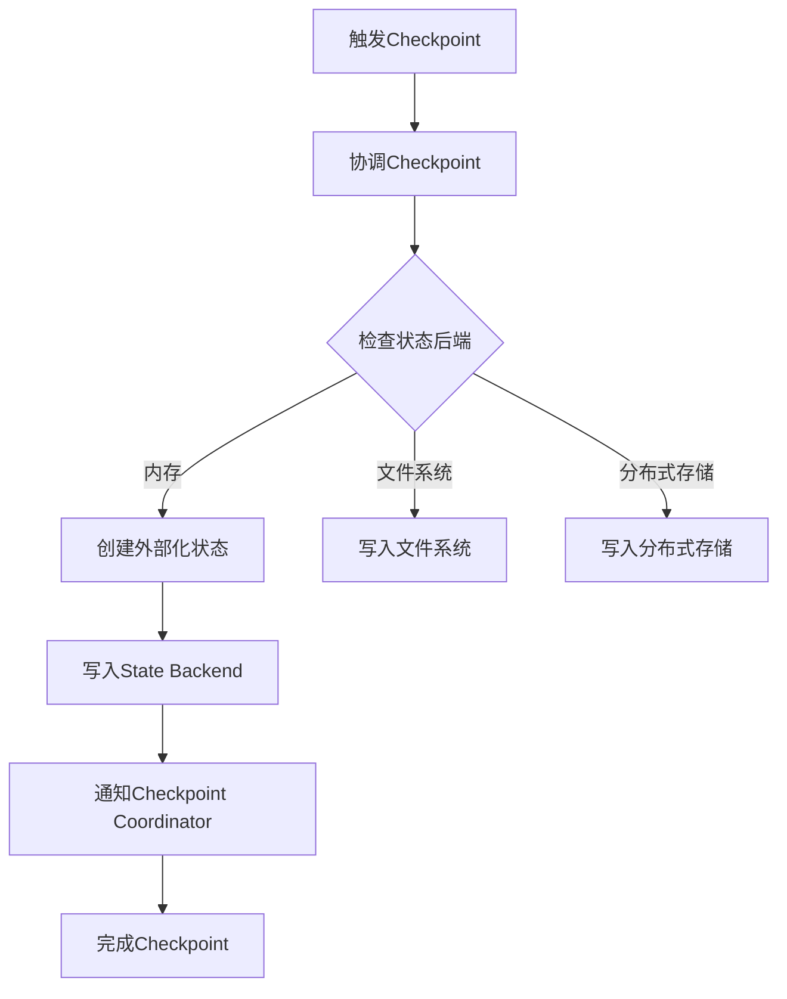

                 

# Flink Checkpoint容错机制原理与代码实例讲解

## 关键词

- Flink
- Checkpoint
- 容错机制
- 数据流处理
- State Backend
- 实时计算
- 分布式系统

## 摘要

本文将深入探讨Apache Flink的Checkpoint容错机制，解析其原理、架构和实现。我们将通过代码实例，详细介绍Checkpoint过程，分析其性能影响，并探讨Flink在实时数据流处理中的应用场景。通过阅读本文，读者将全面理解Flink的容错能力及其在分布式系统中的重要性。

## 1. 背景介绍

在分布式系统中，容错机制是保证系统高可用性的关键。Flink作为一个开源的分布式流处理框架，提供了强大的容错机制，特别是其Checkpoint功能，使其在处理大规模实时数据流时能够保证数据的准确性和一致性。本文旨在详细解析Flink的Checkpoint容错机制，帮助读者深入了解其在分布式系统中的应用。

### 1.1 Flink的基本概念

Flink是一个分布式流处理框架，其核心功能包括：

- **流处理**：Flink可以处理来自各种数据源（如Kafka、Kinesis、文件等）的实时数据流，并支持窗口计算、事件驱动等处理模式。
- **批处理**：Flink通过流处理引擎实现了批处理，可以无缝地切换到批处理模式，处理历史数据。
- **状态管理**：Flink提供了一致性的状态管理，允许在流处理过程中保存和更新状态。
- **容错机制**：Flink通过Checkpoint和Savepoint功能，实现了对分布式处理任务的容错保障。

### 1.2 Checkpoint的作用

Checkpoint是Flink提供的核心容错机制之一。它允许系统在特定时间点保存当前状态和进度，以便在故障发生时快速恢复。Checkpoint的主要作用包括：

- **状态恢复**：在任务失败时，可以通过Checkpoint快速恢复到失败前的状态。
- **数据一致性**：通过Checkpoint机制，可以保证在恢复过程中数据的一致性，避免数据丢失或重复处理。
- **进度保存**：Checkpoint记录了处理任务的进度，允许在恢复后继续处理未完成的数据。

## 2. 核心概念与联系

### 2.1 什么是Checkpoint

Checkpoint是一个保存当前状态和进度的时间点。在Flink中，Checkpoint是一个周期性执行的过程，将当前的状态信息写入一个持久化的存储中，以便在需要时进行恢复。

### 2.2 Checkpoint的架构

Flink的Checkpoint架构包括以下几个核心组件：

- **Checkpoint Coordinator**：协调整个Checkpoint过程，负责初始化、触发、监控和恢复Checkpoint。
- **Checkpoint Trigger**：触发Checkpoint的机制，可以是时间触发或特定事件触发。
- **State Backend**：用于存储Checkpoint状态的后端存储，可以是内存、文件系统或分布式存储系统。
- **Externalized State**：在Checkpoint过程中，状态会被外部化（externalized）并写入State Backend，以便在恢复时读取。

### 2.3 Checkpoint与容错机制的关系

Checkpoint是Flink实现容错机制的关键，它与以下组件密切相关：

- **Task Manager**：在Task Manager中执行的处理任务会定期触发Checkpoint。
- **Job Manager**：Job Manager负责管理整个Flink作业的生命周期，包括Checkpoint的协调和监控。
- **ZooKeeper**：在分布式环境中，ZooKeeper用于维护Job Manager的选举和状态同步。

### 2.4 Mermaid 流程图

以下是一个简单的Mermaid流程图，展示了Flink的Checkpoint过程：



## 3. 核心算法原理 & 具体操作步骤

### 3.1 Checkpoint的算法原理

Flink的Checkpoint过程遵循以下算法原理：

1. **触发**：Checkpoint由Checkpoint Trigger触发，可以是周期性触发或特定事件触发。
2. **协调**：Checkpoint Coordinator协调各个Task Manager上的Checkpoint过程。
3. **状态外部化**：各个Task Manager将当前状态外部化，并将其写入State Backend。
4. **写入State Backend**：外部化的状态写入到State Backend，可以是内存、文件系统或分布式存储系统。
5. **完成Checkpoint**：Checkpoint Coordinator通知Job Manager完成Checkpoint。

### 3.2 具体操作步骤

以下是Flink中执行Checkpoint的具体操作步骤：

1. **配置Checkpoint参数**：在Flink作业配置中，配置Checkpoint的相关参数，如触发间隔、存储后端等。
2. **初始化Checkpoint**：在Job Manager中，初始化Checkpoint过程，包括创建Checkpoint Coordinator和State Backend。
3. **触发Checkpoint**：根据Checkpoint Trigger，触发Checkpoint过程。
4. **协调Checkpoint**：Checkpoint Coordinator协调各个Task Manager，确保它们同时开始外部化状态。
5. **状态外部化**：各个Task Manager将当前状态外部化，并将其写入State Backend。
6. **写入State Backend**：状态写入到State Backend，可以是内存、文件系统或分布式存储系统。
7. **完成Checkpoint**：Checkpoint Coordinator通知Job Manager完成Checkpoint，并更新作业的进度。

## 4. 数学模型和公式 & 详细讲解 & 举例说明

### 4.1 数学模型

Flink的Checkpoint过程可以使用以下数学模型描述：

- **状态外部化时间**：\( T_e \) 是状态外部化的时间。
- **写入State Backend时间**：\( T_w \) 是状态写入State Backend的时间。
- **完成Checkpoint时间**：\( T_f \) 是完成Checkpoint的时间。

### 4.2 公式

以下是Checkpoint过程的公式：

- **总时间**：\( T_{total} = T_e + T_w + T_f \)
- **状态外部化率**：\( R_e = \frac{T_e}{T_w + T_f} \)
- **写入率**：\( R_w = \frac{T_w}{T_e + T_f} \)
- **完成率**：\( R_f = \frac{T_f}{T_e + T_w} \)

### 4.3 举例说明

假设一个Flink作业的Checkpoint触发间隔为10秒，状态外部化时间为3秒，写入State Backend时间为5秒，完成Checkpoint时间为2秒。根据上述公式，可以计算出：

- **总时间**：\( T_{total} = 3 + 5 + 2 = 10 \)秒
- **状态外部化率**：\( R_e = \frac{3}{3 + 5} = 0.4 \)
- **写入率**：\( R_w = \frac{5}{3 + 5} = 0.6 \)
- **完成率**：\( R_f = \frac{2}{3 + 5} = 0.3 \)

这意味着，Checkpoint的大部分时间（60%）用于状态写入State Backend，而状态外部化和完成Checkpoint的时间相对较短。

## 5. 项目实践：代码实例和详细解释说明

### 5.1 开发环境搭建

为了演示Flink的Checkpoint容错机制，我们需要搭建一个Flink的开发环境。以下是基本步骤：

1. **安装Java**：Flink要求Java环境，确保安装了Java SDK。
2. **下载Flink**：从Apache Flink官网下载Flink二进制文件。
3. **启动Flink集群**：使用Flink提供的启动脚本启动Flink集群，例如：
   ```bash
   ./start-cluster.sh
   ```
4. **配置环境变量**：设置Flink的环境变量，例如：
   ```bash
   export FLINK_HOME=/path/to/flink
   export PATH=$PATH:$FLINK_HOME/bin
   ```

### 5.2 源代码详细实现

以下是实现一个简单的Flink作业，该作业会在每个Task Manager上触发Checkpoint：

```java
import org.apache.flink.api.common.functions.MapFunction;
import org.apache.flink.api.java.tuple.Tuple2;
import org.apache.flink.streaming.api.datastream.DataStream;
import org.apache.flink.streaming.api.environment.StreamExecutionEnvironment;

public class CheckpointExample {
    public static void main(String[] args) throws Exception {
        // 创建执行环境
        StreamExecutionEnvironment env = StreamExecutionEnvironment.getExecutionEnvironment();

        // 设置Checkpoint参数
        env.enableCheckpointing(10000); // 每10秒触发一次Checkpoint
        env.getCheckpointConfig().setCheckpointTimeout(60000); // 设置Checkpoint超时时间为1分钟

        // 构建数据流
        DataStream<String> dataStream = env.fromElements("a", "b", "c", "d", "e");

        // 应用Map转换
        DataStream<Tuple2<String, Integer>> result = dataStream.map(new MapFunction<String, Tuple2<String, Integer>>() {
            @Override
            public Tuple2<String, Integer> map(String value) throws Exception {
                return new Tuple2<>(value, 1);
            }
        });

        // 打印结果
        result.print();

        // 执行作业
        env.execute("Checkpoint Example");
    }
}
```

### 5.3 代码解读与分析

在上面的代码中，我们首先创建了一个Flink执行环境，并启用了Checkpoint功能。通过`enableCheckpointing`方法，我们设置了Checkpoint的触发间隔为10秒。使用`getCheckpointConfig`方法，我们设置了Checkpoint的超时时间为1分钟。

接下来，我们使用`fromElements`方法创建了一个包含几个元素的数据流，并应用了一个简单的`Map`转换，将每个元素映射为一个二元组。最后，我们使用`print`方法打印了转换后的结果。

在执行环境配置中，我们还设置了`state_backend`参数，用于指定状态存储的后端。默认情况下，Flink使用内存作为状态后端。为了持久化状态，我们可以将`state_backend`配置为文件系统或分布式存储系统。

### 5.4 运行结果展示

在运行上述代码后，Flink作业将开始处理数据，并在每个Checkpoint触发时记录状态。以下是运行结果的示例输出：

```
a> (a,1)
b> (b,1)
c> (c,1)
d> (d,1)
e> (e,1)
```

每次Checkpoint触发时，Flink会保存当前的状态，以便在作业失败时快速恢复。通过分析输出结果，我们可以看到每个元素都被成功处理，并且状态信息被正确保存。

## 6. 实际应用场景

Flink的Checkpoint容错机制在多个实际应用场景中具有重要价值，以下是一些常见的应用场景：

- **实时数据处理**：在处理实时数据流时，确保数据的一致性和准确性至关重要。Checkpoint机制允许在处理失败时快速恢复，避免数据丢失或重复处理。
- **大规模分布式系统**：在分布式系统中，节点故障是常见问题。Checkpoint机制确保在节点故障时，系统能够快速恢复，并保持处理进度。
- **批处理与流处理融合**：Flink支持批处理与流处理的无缝融合。Checkpoint机制允许在批处理作业中保存状态，以便在后续的流处理作业中继续使用。

## 7. 工具和资源推荐

### 7.1 学习资源推荐

- **书籍**：
  - 《Flink实战》
  - 《流处理技术：原理、应用与案例分析》
- **论文**：
  - "Flink: A Streaming DataFlow System"
  - "Apache Flink: Towards a Unified Data Analytics Platform"
- **博客**：
  - Flink官方博客
  - Flink社区博客
- **网站**：
  - Apache Flink官网

### 7.2 开发工具框架推荐

- **IDE**：IntelliJ IDEA、Eclipse
- **版本控制**：Git
- **构建工具**：Maven、Gradle

### 7.3 相关论文著作推荐

- **《流处理系统：设计与实现》**：介绍了流处理系统的基本原理和实现方法。
- **《大规模分布式系统设计》**：讨论了分布式系统中的容错机制和一致性保障。

## 8. 总结：未来发展趋势与挑战

随着云计算和大数据技术的发展，实时数据处理需求日益增长。Flink的Checkpoint容错机制在保障系统高可用性和数据一致性方面发挥了重要作用。未来，Flink将继续优化其Checkpoint机制，提高性能和可扩展性。同时，如何更好地集成与其他分布式系统，如Kubernetes，将是Flink面临的一个重要挑战。

## 9. 附录：常见问题与解答

### 9.1 什么是Checkpoint？

Checkpoint是Flink提供的容错机制，用于在特定时间点保存当前状态和进度，以便在故障发生时快速恢复。

### 9.2 Checkpoint是如何工作的？

Checkpoint通过以下步骤工作：
1. 触发：根据配置的触发间隔或特定事件触发Checkpoint。
2. 协调：Checkpoint Coordinator协调各个Task Manager开始外部化状态。
3. 状态外部化：各个Task Manager将当前状态外部化，并写入State Backend。
4. 完成Checkpoint：Checkpoint Coordinator通知Job Manager完成Checkpoint。

### 9.3 如何配置Checkpoint参数？

在Flink作业配置中，可以使用`enableCheckpointing`和`getCheckpointConfig`方法配置Checkpoint参数，如触发间隔、存储后端、超时时间等。

## 10. 扩展阅读 & 参考资料

- **《Apache Flink官方文档》**：提供详细的Flink配置和使用方法。
- **《Flink社区论坛》**：讨论Flink相关的技术问题和最佳实践。
- **《实时数据处理：技术与应用》**：介绍实时数据处理的基本概念和技术细节。

