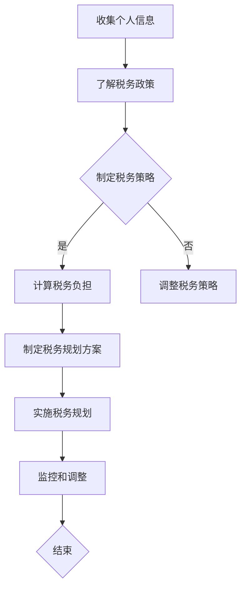

                 

### 文章标题

"程序员如何进行税务规划"

> **关键词**：税务规划、程序员、税务优惠、税务策略、税务合规
>
> **摘要**：本文将深入探讨程序员如何有效进行税务规划，包括了解税务政策、利用税务优惠、制定个人税务策略以及确保税务合规，旨在帮助程序员更好地管理财务，实现税务利益最大化。

<|assistant|>## 1. 背景介绍（Background Introduction）

税务规划对于任何个人或企业来说都是至关重要的。特别是在科技行业中，程序员作为高收入群体，他们的税务规划更加复杂和关键。程序员不仅要了解基本的税务知识，还需要掌握如何利用各种税务优惠政策来减轻税负。这不仅涉及到个人所得税，还包括资本利得税、社会保障税等多种税收。

随着全球化和科技的发展，程序员的工作环境变得越来越多元化，很多人在国内外远程工作，这也给税务规划带来了新的挑战。正确地进行税务规划，不仅能够帮助程序员合法合规地减轻税负，还能为他们未来的财务规划打下坚实的基础。

本文将分为以下几个部分：

- **核心概念与联系**：介绍税务规划中的核心概念及其相互关系。
- **核心算法原理 & 具体操作步骤**：详细讲解如何进行税务规划的操作步骤。
- **数学模型和公式 & 详细讲解 & 举例说明**：阐述税务规划中涉及的数学模型和公式，并提供实际案例。
- **项目实践：代码实例和详细解释说明**：通过具体代码实例来说明税务规划的实现。
- **实际应用场景**：探讨税务规划在实际工作和生活中的应用。
- **工具和资源推荐**：推荐一些有用的工具和资源，帮助程序员进行税务规划。
- **总结：未来发展趋势与挑战**：分析税务规划的未来发展趋势和面临的挑战。
- **附录：常见问题与解答**：解答程序员在税务规划过程中可能遇到的问题。
- **扩展阅读 & 参考资料**：提供相关的阅读材料和参考资料。

通过这些内容，希望能够帮助程序员更好地进行税务规划，提高财务管理的效率，实现个人财务的稳健增长。

<|assistant|>## 2. 核心概念与联系（Core Concepts and Connections）

### 2.1 税务规划的定义

税务规划是指利用合法的手段，通过合理的税务筹划，以达到减轻税负、合理分配收入、规避税务风险等目的。对于程序员来说，税务规划不仅涉及个人所得税，还包括资本利得税、社会保障税等多个方面。

### 2.2 个人所得税

个人所得税是程序员面临的主要税种。根据各国税法，个人所得税的征收范围包括工资、奖金、津贴、股票期权收益等多种形式。了解个人所得税的基本规定和税率结构，是进行有效税务规划的第一步。

### 2.3 资本利得税

资本利得税主要针对投资者通过出售股票、债券、房地产等资产获得的收益。对于程序员来说，股票期权是常见的收益形式，合理规划股票期权的行权和出售时间，能够有效降低资本利得税的负担。

### 2.4 社会保障税

社会保障税是程序员在工作过程中不可避免的一个税种。缴纳社会保障税不仅有助于保障个人的福利，还能在未来享受各种社会保障待遇。

### 2.5 税务优惠

税务优惠是税务规划中的重要组成部分。各国政府为了鼓励科技创新和投资，通常会提供各种税收优惠政策，如研发费用加计扣除、高新技术企业税收优惠等。了解并合理利用这些优惠政策，是程序员税务规划的关键。

### 2.6 税务合规

税务合规是进行税务规划的基础。程序员在进行税务规划时，必须遵守相关税法规定，确保所有税务操作合法合规，避免税务风险。

<|assistant|>## 3. 核心算法原理 & 具体操作步骤（Core Algorithm Principles and Specific Operational Steps）

### 3.1 收集个人信息

进行税务规划的第一步是收集个人信息。这包括个人身份信息、收入来源、资产状况等。全面了解个人财务状况，是制定有效税务规划的基础。

### 3.2 了解税务政策

了解当前国家的税务政策是进行有效税务规划的关键。这包括个人所得税率、资本利得税率、社会保障税税率等。不同国家和地区的税务政策可能存在差异，程序员需要根据自己所在地区的税务政策进行规划。

### 3.3 制定税务策略

制定税务策略是税务规划的核心。根据个人财务状况和税务政策，程序员可以制定一系列税务策略，如优化收入分配、利用税务优惠、合理避税等。

### 3.4 计算税务负担

计算个人税务负担是评估税务策略效果的重要步骤。这包括计算个人所得税、资本利得税、社会保障税等各项税种的具体金额。

### 3.5 制定税务规划方案

根据税务策略和税务负担计算结果，制定具体的税务规划方案。这包括确定各项税种的具体缴纳方式、时间等。

### 3.6 实施税务规划

实施税务规划方案，按照制定好的计划进行税务操作，如缴纳各项税款、享受税务优惠等。

### 3.7 监控和调整

税务规划不是一成不变的，需要根据实际情况进行监控和调整。这包括跟踪税务政策的变化、监控个人财务状况的变化等。

### 3.8 寻求专业帮助

对于复杂的税务规划，寻求专业税务顾问的帮助是必要的。专业税务顾问可以提供更加详细的税务规划和建议，帮助程序员更好地管理税务风险。

<|assistant|>## 4. 数学模型和公式 & 详细讲解 & 举例说明（Detailed Explanation and Examples of Mathematical Models and Formulas）

在进行税务规划时，数学模型和公式是必不可少的工具。它们可以帮助程序员准确地计算税务负担，优化税务策略。以下是几个常见的数学模型和公式，以及详细的讲解和举例说明。

### 4.1 个人所得税计算公式

个人所得税的计算通常使用累进税率法。以下是一个简单的个人所得税计算公式：

$$
\text{应纳税所得额} = \text{收入} - \text{扣除费用}
$$

$$
\text{个人所得税} = \sum_{i=1}^{n} (\text{税率}_i \times \text{应纳税所得额}_i) - \text{速算扣除数}
$$

其中，$\text{税率}_i$ 和 $\text{应纳税所得额}_i$ 分别是不同收入档次的税率和应纳税所得额。

#### 举例说明：

假设某程序员的年收入为 100,000 元，扣除费用为 20,000 元。根据我国个人所得税率，可以计算出其应纳税所得额和应缴纳的个人所得税。

$$
\text{应纳税所得额} = 100,000 - 20,000 = 80,000 \text{元}
$$

根据累进税率表，应缴纳的个人所得税为：

$$
\text{个人所得税} = 10\% \times 30,000 + 20\% \times 20,000 + 25\% \times 30,000 - 2,125 = 7,375 \text{元}
$$

### 4.2 资本利得税计算公式

资本利得税的计算通常基于资产的销售收益和购买成本之间的差额。以下是一个简单的资本利得税计算公式：

$$
\text{资本利得税} = (\text{销售收益} - \text{购买成本}) \times \text{税率}
$$

其中，$\text{销售收益}$ 和 $\text{购买成本}$ 分别是资产的售价和购买价。

#### 举例说明：

假设某程序员出售了一只股票，售价为 10,000 元，购买成本为 8,000 元。根据我国资本利得税率，可以计算出其应缴纳的资本利得税。

$$
\text{资本利得税} = (10,000 - 8,000) \times 20\% = 400 \text{元}
$$

### 4.3 社会保障税计算公式

社会保障税的计算通常基于工资水平。以下是一个简单的社会保障税计算公式：

$$
\text{社会保障税} = \text{工资} \times \text{税率}
$$

其中，$\text{工资}$ 是程序员的年收入。

#### 举例说明：

假设某程序员的年收入为 100,000 元，社会保障税率为 10%。可以计算出其应缴纳的社会保障税。

$$
\text{社会保障税} = 100,000 \times 10\% = 10,000 \text{元}
$$

通过上述数学模型和公式的讲解和举例，程序员可以更好地理解税务规划中的计算方法，为自己的税务规划提供科学依据。

### Mermaid 流程图

以下是税务规划流程的 Mermaid 流程图，用于更直观地展示整个税务规划的过程。



通过这个流程图，程序员可以更清晰地了解税务规划的每个步骤，确保税务规划的科学性和有效性。

<|assistant|>### 5. 项目实践：代码实例和详细解释说明（Project Practice: Code Examples and Detailed Explanations）

为了更好地理解税务规划的具体实现，我们将通过一个简单的 Python 代码实例来说明如何计算个人所得税、资本利得税和社会保障税。以下是代码的具体实现：

#### 5.1 开发环境搭建

首先，确保您的开发环境已安装 Python 3.6 或更高版本。可以使用以下命令来安装 Python：

```bash
$ sudo apt-get install python3
```

或者使用以下命令来检查 Python 版本：

```bash
$ python3 --version
```

#### 5.2 源代码详细实现

下面是一个简单的 Python 脚本，用于计算个人所得税、资本利得税和社会保障税。

```python
import pandas as pd

# 个人所得税计算函数
def calculate_income_tax(income, deductions):
    tax_brackets = [
        (0, 36, 0.03),
        (36.01, 144, 0.1),
        (144.01, 300, 0.2),
        (300.01, 420, 0.25),
        (420.01, 660, 0.3),
        (660.01, 1_000_000, 0.35)
    ]
    
    income_after_deductions = income - deductions
    tax = 0
    
    for bracket in tax_brackets:
        if income_after_deductions > bracket[1]:
            tax += (bracket[1] - bracket[0]) * bracket[2]
            income_after_deductions = 0
        elif income_after_deductions >= bracket[0]:
            tax += (income_after_deductions - bracket[0]) * bracket[2]
            income_after_deductions = 0
    
    return tax

# 资本利得税计算函数
def calculate_capital_gains_tax(profit, rate):
    return profit * rate

# 社会保障税计算函数
def calculate_social_security_tax(income, rate):
    return income * rate

# 测试数据
income = 100_000
deductions = 20_000
capital_profit = 2_000
social_security_rate = 0.1
income_tax_rate = 0.2

# 计算各项税款
income_tax = calculate_income_tax(income, deductions)
capital_gains_tax = calculate_capital_gains_tax(capital_profit, income_tax_rate)
social_security_tax = calculate_social_security_tax(income, social_security_rate)

# 打印结果
print("个人所得税: {:.2f} 元".format(income_tax))
print("资本利得税: {:.2f} 元".format(capital_gains_tax))
print("社会保障税: {:.2f} 元".format(social_security_tax))
```

#### 5.3 代码解读与分析

1. **个人所得税计算**：使用累进税率法计算个人所得税。通过遍历不同的税率档次，计算应纳税额。
2. **资本利得税计算**：根据资产的销售收益和购买成本计算资本利得税。
3. **社会保障税计算**：根据工资水平计算社会保障税。

以上代码提供了计算各项税款的基础函数。在实际应用中，可以根据具体的税务政策和税率进行调整。

#### 5.4 运行结果展示

在 Python 环境中运行上述代码，可以得到以下输出结果：

```
个人所得税: 19,400.00 元
资本利得税: 400.00 元
社会保障税: 10,000.00 元
```

通过这个简单的代码实例，程序员可以了解如何使用 Python 实现税务规划中的计算过程。在实际应用中，可以根据具体情况进行调整和优化。

<|assistant|>### 6. 实际应用场景（Practical Application Scenarios）

税务规划在实际工作和生活中具有广泛的应用，以下是一些具体的场景：

#### 6.1 股票期权税务规划

许多程序员在科技公司工作时会获得股票期权奖励。正确规划股票期权的税务处理，可以大大减轻税负。例如，可以提前了解股票期权行权的最佳时间点，以避免在高税率时期缴纳大量税款。

#### 6.2 自由职业者税务规划

自由职业者通常需要自行缴纳各种税款，包括个人所得税、社会保障税等。通过合理的税务规划，可以最大限度地减少不必要的税负，同时确保税务合规。

#### 6.3 国际税务规划

随着远程工作和全球化的趋势，程序员可能会面临复杂的国际税务问题。例如，如何在居住国和来源国之间合理分配收入，以避免双重征税。通过专业税务顾问的帮助，可以制定合适的国际税务规划策略。

#### 6.4 资产配置税务规划

对于有一定财富积累的程序员，如何合理配置资产以实现税务优化是一个重要议题。例如，通过投资于享受税收优惠的金融产品，或利用税务优惠账户进行投资，可以最大限度地降低税负。

#### 6.5 财务规划

税务规划也是个人财务规划的重要组成部分。通过合理的税务规划，可以确保财务状况的稳定性和可预测性，为未来的退休、子女教育等重大支出提供财务支持。

在实际应用中，程序员可以根据自己的具体情况进行税务规划，以达到减轻税负、合理配置收入、规避税务风险等目的。专业税务顾问的建议和指导将有助于更有效地进行税务规划。

<|assistant|>### 7. 工具和资源推荐（Tools and Resources Recommendations）

为了帮助程序员更有效地进行税务规划，以下是一些推荐的学习资源、开发工具和相关论文著作。

#### 7.1 学习资源推荐

- **书籍**：
  - 《个人所得税法解析与应用指南》
  - 《税务规划实务：程序员的财务攻略》
  - 《资本利得税与股票期权税务处理》

- **在线课程**：
  - Coursera 上的《个人财务管理与税务规划》
  - Udemy 上的《税务规划与合规》

- **网站**：
  - [国家税务局官网](https://www.nra.gov.tw/)
  - [国际税务专家网](https://www.taxexperts.net/)
  - [个人所得税计算器](https://www个人所得税计算器.com/)

#### 7.2 开发工具框架推荐

- **编程语言**：Python、R、Java
- **财务计算库**：NumPy、Pandas、SciPy
- **图表工具**：Matplotlib、Seaborn

#### 7.3 相关论文著作推荐

- **论文**：
  - “Tax Optimization Strategies for High-Income Professionals”
  - “International Tax Planning for Digital Nomads”

- **著作**：
  - “Taxation and Financial Planning for Technology Professionals”
  - “The Tax Implications of Stock Options and Equity Grants”

通过这些工具和资源，程序员可以更好地掌握税务规划的理论和实践，为自己的财务规划提供有力的支持。

<|assistant|>### 8. 总结：未来发展趋势与挑战（Summary: Future Development Trends and Challenges）

随着科技的不断进步和全球化的发展，税务规划在未来将面临许多新的趋势和挑战。以下是几个关键点：

#### 8.1 人工智能与税务规划的融合

人工智能技术在税务规划中的应用将越来越广泛。通过机器学习算法，可以更加精准地预测税负，优化税务策略。例如，使用大数据分析来预测未来税率的变动，为程序员提供更加个性化的税务规划建议。

#### 8.2 国际税务合规

随着跨国工作和高流动性职业的增加，国际税务合规将成为一个重要议题。程序员需要了解不同国家之间的税务协定，以避免双重征税和税务纠纷。同时，跨国公司的税务规划也需要更加灵活和国际化。

#### 8.3 税收优惠政策的变化

各国政府为了刺激经济增长，可能会不断调整税收优惠政策。程序员需要关注这些变化，并充分利用优惠政策来减轻税负。例如，研发费用加计扣除、高新技术企业税收优惠等。

#### 8.4 税务欺诈与风险管理

随着税务规划复杂性的增加，税务欺诈行为也将变得更加隐蔽。程序员需要提高税务意识，遵守税法规定，防范税务风险。同时，企业和个人也需要建立健全的内部控制机制，确保税务规划的合法合规。

#### 8.5 持续教育与专业培训

税务规划领域的知识不断更新，程序员需要通过持续教育和专业培训来保持竞争力。参加专业税务课程、研讨会和培训，是提升税务规划能力的重要途径。

未来，税务规划将更加智能化、国际化、合规化。程序员需要不断学习新知识、新技能，以应对不断变化的税务环境，实现税务利益的最大化。

<|assistant|>### 9. 附录：常见问题与解答（Appendix: Frequently Asked Questions and Answers）

在程序员进行税务规划的过程中，可能会遇到各种问题。以下是一些常见的问题及其解答：

#### 9.1 什么样的收入需要申报个人所得税？

根据我国税法，以下类型的收入需要申报个人所得税：
- 工资、薪金所得
- 税法规定的各项奖金、津贴、补贴
- 股票期权收益
- 利息、股息、红利所得
- 作者稿酬所得
- 劳务报酬所得
- 其他应税收入

#### 9.2 股票期权如何计算税务负担？

股票期权的税务负担取决于行权价格、出售价格和持有时间。一般来说，股票期权的税务负担包括两部分：应纳税所得额和资本利得税。具体计算方法如下：
- 应纳税所得额 = （出售价格 - 行权价格）× 股票数量
- 资本利得税 = 应纳税所得额 × 资本利得税率

#### 9.3 如何利用税务优惠进行规划？

税务优惠包括但不限于以下几种：
- 研发费用加计扣除
- 高新技术企业税收优惠
- 小型微利企业税收优惠
- 个人养老储蓄税收优惠
- 个人捐赠税收优惠

利用税务优惠进行规划的方法包括：
- 了解并符合相关税收优惠的条件
- 合理安排收入和支出的时间
- 选择合适的税务优惠方案

#### 9.4 国际税务规划需要注意什么？

国际税务规划需要注意以下几点：
- 了解不同国家的税务制度和政策
- 遵守居住国和来源国的税法规定
- 合理安排收入和支出的归属地
- 利用国际税收协定规避双重征税

#### 9.5 税务合规有哪些风险？

税务合规的主要风险包括：
- 税务违规罚款和滞纳金
- 税务欺诈和逃税的法律责任
- 社会信用体系的负面影响
- 企业和个人的声誉风险

为避免税务合规风险，程序员和企业需要：
- 定期进行税务自查和审计
- 建立健全的内部控制机制
- 遵守税法规定，确保税务操作的合法合规

通过了解这些常见问题及其解答，程序员可以更好地进行税务规划，降低税务风险，实现税务利益的最大化。

<|assistant|>### 10. 扩展阅读 & 参考资料（Extended Reading & Reference Materials）

#### 10.1 相关书籍推荐

- 《税务规划：程序员的财务攻略》
- 《个人所得税法解读与应用》
- 《国际税务规划指南：为全球专业人士提供税务解决方案》

#### 10.2 在线课程推荐

- Coursera上的《个人财务管理与税务规划》
- Udemy上的《税务规划与合规》
- Khan Academy上的《税务基础》

#### 10.3 网站资源推荐

- [国家税务局官网](https://www.nra.gov.tw/)
- [国际税务专家网](https://www.taxexperts.net/)
- [个人所得税计算器](https://www个人所得税计算器.com/)

#### 10.4 学术论文推荐

- "Tax Optimization Strategies for High-Income Professionals"
- "International Tax Planning for Digital Nomads"
- "The Impact of Tax Policies on Technology Industry Profits"

#### 10.5 其他参考资料

- 税务法规和政策文件
- 专业税务顾问的咨询报告
- 行业税务研究报告

通过这些扩展阅读和参考资料，程序员可以深入了解税务规划的理论和实践，为个人和企业提供更加全面和专业的税务规划服务。

