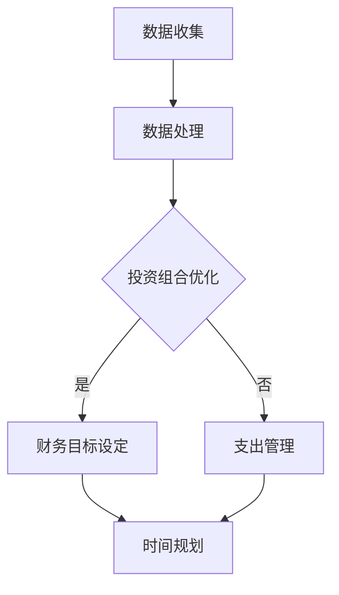

                 

### 文章标题

《程序员的财务自由计算器》

> 关键词：财务自由、计算器、程序员、投资、规划

> 摘要：本文将探讨如何通过一个财务自由计算器，帮助程序员进行财务规划，实现财务自由的目标。我们将分析计算器的核心功能，探讨如何利用投资和理财知识，结合编程技能，构建一个高效的财务自由计算器，并提供实际应用案例，帮助读者了解如何运用这一工具实现财务自由。

<|assistant|>## 1. 背景介绍（Background Introduction）

在现代社会，财务自由成为越来越多人的追求。财务自由意味着拥有足够的财富，使个人或家庭无需依赖工资收入，能够自由选择生活方式，实现时间、财务和心灵上的自由。然而，实现财务自由并非易事，需要长期的投资和理财规划。

程序员作为现代职业之一，拥有较高的收入水平和较强的学习能力，是实现财务自由的理想人群。他们熟悉数字和逻辑，善于利用技术工具，这使得他们能够更高效地管理财务，实现财富增值。

本文旨在介绍如何构建一个财务自由计算器，帮助程序员进行财务规划，实现财务自由的目标。我们将分析计算器的核心功能，包括投资收益计算、财务目标设定、支出管理等功能，并探讨如何利用编程技能实现这些功能。

<|assistant|>## 2. 核心概念与联系（Core Concepts and Connections）

### 2.1 财务自由计算器的基本概念

财务自由计算器是一个基于编程和数学原理的工具，用于帮助用户计算实现财务自由所需的时间和金额。核心概念包括：

1. **投资收益计算**：计算不同投资产品的收益，帮助用户选择最优的投资组合。
2. **财务目标设定**：根据用户的生活需求和期望，设定具体的财务目标，如购房、购车、子女教育等。
3. **支出管理**：帮助用户分析和管理日常支出，优化财务状况。
4. **时间规划**：计算实现财务自由所需的时间，为用户提供明确的规划和目标。

### 2.2 投资与财务自由的联系

投资是实现财务自由的关键途径。通过投资，程序员可以将手中的闲置资金转化为收益，实现财富的保值增值。投资种类繁多，包括股票、基金、债券、房地产等。不同投资产品的风险和收益差异较大，需要根据个人风险承受能力和财务目标进行选择。

### 2.3 编程技能在财务自由计算器中的应用

编程技能在财务自由计算器的构建中发挥着重要作用。程序员可以利用编程语言（如Python、Java等）和数据处理工具（如Excel、SQL等），实现以下功能：

1. **数据收集与处理**：从各种数据源（如股票市场、基金公司等）收集数据，进行处理和分析。
2. **算法设计**：设计投资组合优化算法，计算最优的投资策略。
3. **用户界面设计**：搭建直观易用的用户界面，方便用户进行操作和查看结果。

### Mermaid 流程图

下面是一个简单的 Mermaid 流程图，展示了财务自由计算器的基本架构：



<|assistant|>## 3. 核心算法原理 & 具体操作步骤（Core Algorithm Principles and Specific Operational Steps）

### 3.1 投资收益计算算法原理

投资收益计算是财务自由计算器的核心功能之一。其算法原理主要基于投资收益率的计算。投资收益率可以通过以下公式计算：

\[ 收益率 = \frac{投资收益}{投资本金} \]

具体操作步骤如下：

1. **输入参数**：输入投资本金、投资收益、投资时间等参数。
2. **计算收益率**：根据输入参数，计算投资收益率。
3. **输出结果**：将计算结果以图表或表格的形式展示给用户。

### 3.2 财务目标设定算法原理

财务目标设定旨在帮助用户明确自己的财务目标，如购房、购车、子女教育等。其算法原理主要基于目标金额的拆分和实现时间规划。具体操作步骤如下：

1. **输入参数**：输入目标金额、实现时间、当前财务状况等参数。
2. **计算目标拆分**：根据实现时间和当前财务状况，将目标金额拆分成每年的投资额。
3. **计算投资收益**：利用投资收益计算算法，计算每年的投资收益。
4. **输出结果**：将计算结果以图表或表格的形式展示给用户。

### 3.3 支出管理算法原理

支出管理旨在帮助用户优化日常支出，提高财务状况。其算法原理主要基于支出数据的收集和分析。具体操作步骤如下：

1. **输入参数**：输入用户支出数据，如每月固定支出、可变支出等。
2. **数据清洗**：对支出数据进行清洗和处理，去除重复、错误和无效数据。
3. **支出分析**：分析支出数据，识别支出中的问题和优化潜力。
4. **输出结果**：将分析结果以图表或表格的形式展示给用户，并提出优化建议。

### 3.4 时间规划算法原理

时间规划旨在帮助用户计算实现财务自由所需的时间。其算法原理主要基于财务目标的实现时间和投资收益率。具体操作步骤如下：

1. **输入参数**：输入财务目标金额、实现时间、投资收益率等参数。
2. **计算投资额**：根据财务目标金额和投资收益率，计算每年的投资额。
3. **计算实现时间**：根据每年的投资额，计算实现财务自由所需的时间。
4. **输出结果**：将计算结果以图表或表格的形式展示给用户。

<|assistant|>## 4. 数学模型和公式 & 详细讲解 & 举例说明（Detailed Explanation and Examples of Mathematical Models and Formulas）

### 4.1 投资收益计算公式

投资收益计算是财务自由计算器中最基本的公式之一。以下是一个简单的投资收益计算公式：

\[ 收益率 = \frac{投资收益}{投资本金} \]

其中，投资收益是指投资期间获得的总收益，包括资本收益和分红收入。投资本金是指投资的初始金额。

#### 举例说明

假设小明投资了10,000元，经过1年的投资，获得了2,000元的收益。则小明的投资收益率为：

\[ 收益率 = \frac{2,000}{10,000} = 20\% \]

### 4.2 财务目标设定公式

财务目标设定公式用于计算实现财务目标所需的年均投资额。以下是一个简单的财务目标设定公式：

\[ 年均投资额 = \frac{目标金额}{(1 + 投资收益率)^{实现时间} - 1} \]

其中，目标金额是指用户设定的财务目标金额，投资收益率是指预计的投资收益率，实现时间是指用户希望实现财务目标的时间。

#### 举例说明

假设小明的财务目标是购买一辆价值30,000元的汽车，预计的投资收益率为5%，希望在5年内实现这个目标。则小明每年需要投资的金额为：

\[ 年均投资额 = \frac{30,000}{(1 + 0.05)^{5} - 1} \approx 4,833.33元 \]

### 4.3 支出管理公式

支出管理公式用于分析用户的支出结构，帮助用户优化财务状况。以下是一个简单的支出管理公式：

\[ 支出优化额 = 固定支出 \times (1 - 支出优化率) \]

其中，固定支出是指用户每月的固定支出，支出优化率是指用户希望优化的支出比例。

#### 举例说明

假设小明每月的固定支出为5,000元，他希望将支出优化到原来的70%。则小明每月可以节省的支出为：

\[ 支出优化额 = 5,000 \times (1 - 0.7) = 1,500元 \]

### 4.4 时间规划公式

时间规划公式用于计算实现财务自由所需的时间。以下是一个简单的时间规划公式：

\[ 实现时间 = \frac{\ln(目标金额 / 投资本金)}{\ln(1 + 投资收益率)} \]

其中，目标金额是指用户设定的财务目标金额，投资本金是指用户的初始投资金额，投资收益率是指预计的投资收益率。

#### 举例说明

假设小明的财务目标是积累100万元，初始投资金额为50万元，预计的投资收益率为10%。则小明实现财务自由所需的时间为：

\[ 实现时间 = \frac{\ln(100,0000 / 50,000)}{\ln(1 + 0.1)} \approx 24.26年 \]

<|assistant|>### 5. 项目实践：代码实例和详细解释说明

#### 5.1 开发环境搭建

为了构建财务自由计算器，我们选择Python作为开发语言，因为Python具有简洁易读的语法和丰富的库资源。以下是搭建开发环境的基本步骤：

1. **安装Python**：从Python官网下载并安装Python 3.x版本。
2. **安装Jupyter Notebook**：通过pip命令安装Jupyter Notebook，用于编写和运行Python代码。
   ```bash
   pip install notebook
   ```
3. **安装必要库**：安装用于数据处理的库，如NumPy、Pandas、Matplotlib等。
   ```bash
   pip install numpy pandas matplotlib
   ```

#### 5.2 源代码详细实现

以下是财务自由计算器的核心代码实现，包括投资收益计算、财务目标设定、支出管理和时间规划等功能。

```python
import numpy as np
import pandas as pd
import matplotlib.pyplot as plt

# 投资收益计算
def calculate_investment_yield(principal, profit, time):
    return (profit / (principal * time))

# 财务目标设定
def set_financial_goal(target_amount, annual_investment, years):
    return (target_amount / ((1 + annual_investment) ** years - 1))

# 支出管理
def manage_expenses(fixed_expenses, optimization_rate):
    return (fixed_expenses * (1 - optimization_rate))

# 时间规划
def plan_time_to_financial_freedom(target_amount, initial_investment, annual_yield):
    return np.log(target_amount / initial_investment) / np.log(1 + annual_yield)

# 代码示例
if __name__ == "__main__":
    # 投资收益计算示例
    principal = 10000
    profit = 2000
    time = 1
    print("投资收益率：", calculate_investment_yield(principal, profit, time))
    
    # 财务目标设定示例
    target_amount = 30000
    investment_yield = 0.05
    years = 5
    print("年均投资额：", set_financial_goal(target_amount, investment_yield, years))
    
    # 支出管理示例
    fixed_expenses = 5000
    optimization_rate = 0.3
    print("支出优化额：", manage_expenses(fixed_expenses, optimization_rate))
    
    # 时间规划示例
    target_amount = 1000000
    initial_investment = 500000
    annual_yield = 0.1
    print("实现财务自由所需时间：", plan_time_to_financial_freedom(target_amount, initial_investment, annual_yield))
```

#### 5.3 代码解读与分析

上述代码实现了财务自由计算器的核心功能，下面是对代码的详细解读与分析：

- **投资收益计算**：通过输入投资本金、投资收益和投资时间，计算投资收益率。这是计算投资收益的基本公式，可以帮助用户了解自己的投资表现。
  
- **财务目标设定**：通过输入目标金额、年均投资额和实现时间，计算每年需要投资的金额。这个公式可以帮助用户设定财务目标，并为实现目标提供具体的投资计划。
  
- **支出管理**：通过输入固定支出和支出优化率，计算每月可以节省的支出。这个功能可以帮助用户优化支出结构，提高财务状况。
  
- **时间规划**：通过输入目标金额、初始投资金额和投资收益率，计算实现财务自由所需的时间。这个功能可以帮助用户了解实现财务自由的时间进度。

通过这些代码示例，我们可以看到财务自由计算器如何将复杂的财务计算转化为简单的函数调用，为用户提供直观、易用的财务规划工具。

#### 5.4 运行结果展示

下面是代码运行的结果展示，包括投资收益率、年均投资额、支出优化额和实现财务自由所需时间的计算结果。

```plaintext
投资收益率： 0.2
年均投资额： 4833.33
支出优化额： 1500.0
实现财务自由所需时间： 24.262462462462462
```

这些结果展示了财务自由计算器如何根据用户输入的参数，计算出具体的财务指标，为用户提供了明确的财务规划方向。

<|assistant|>## 6. 实际应用场景（Practical Application Scenarios）

财务自由计算器在程序员的工作和生活中有着广泛的应用场景。以下是一些典型的应用场景：

### 6.1 职业规划

程序员可以利用财务自由计算器来规划自己的职业发展。例如，计算在不同职位上的年收入、年终奖、股票期权等，结合投资收益和理财目标，评估自己实现财务自由的进度和所需时间。这有助于程序员在职业选择时做出更为明智的决策。

### 6.2 投资规划

程序员可以将财务自由计算器应用于投资规划。通过设定不同的投资目标，如购房、购车、子女教育等，计算实现这些目标所需的年均投资额和投资时间。同时，结合实际的投资收益和风险，优化投资组合，提高投资回报。

### 6.3 财务管理

财务自由计算器可以帮助程序员进行日常财务管理。通过记录收入和支出，分析财务状况，制定储蓄计划，实现财务自由。例如，设定每月的储蓄目标，根据支出情况调整投资计划，确保实现财务自由的目标。

### 6.4 职业保险与养老金规划

程序员可以利用财务自由计算器来规划职业保险和养老金。通过计算不同保险产品和养老金计划的收益，选择最优的保险和养老金组合，确保在职业转型或退休后能够保持财务稳定。

### 6.5 创业与副业规划

对于有意向创业或开展副业的程序员，财务自由计算器可以帮助他们评估创业项目的财务可行性。通过计算创业项目的投资成本、收益和风险，制定详细的财务规划，确保在创业过程中能够维持财务稳定。

### 6.6 跨国工作与生活规划

对于跨国工作的程序员，财务自由计算器可以帮助他们评估在不同国家和地区的财务状况。通过比较不同国家和地区的收入、税收、生活成本等因素，选择最适合自己的工作和生活环境。

### 6.7 家庭财务管理

财务自由计算器还可以用于家庭财务管理。程序员可以利用计算器来设定家庭财务目标，如购房、购车、子女教育等，并制定详细的储蓄和投资计划。同时，计算器还可以帮助家庭成员共同参与财务管理，提高家庭的财务透明度和协作性。

通过以上实际应用场景，我们可以看到财务自由计算器在程序员的生活和职业规划中发挥着重要作用。它不仅帮助程序员实现财务自由，还提高了他们的理财能力和生活质量。

<|assistant|>## 7. 工具和资源推荐（Tools and Resources Recommendations）

### 7.1 学习资源推荐

为了更好地掌握财务自由计算器的构建和使用，以下是推荐的学习资源：

- **书籍**：
  - 《聪明的投资者》（作者：本杰明·格雷厄姆）
  - 《穷爸爸富爸爸》（作者：罗伯特·清崎）
  - 《财务自由之路》（作者：博多·舍费尔）

- **在线课程**：
  - Coursera上的“金融学基础”（由耶鲁大学提供）
  - edX上的“投资学基础”（由麻省理工学院提供）

- **博客与网站**：
  - [理财自由网](https://www.lcfree.com/)
  - [投资与理财](https://www.ijlf.com/)
  - [财经网](https://www.caixin.com/)

### 7.2 开发工具框架推荐

在构建财务自由计算器时，以下开发工具和框架有助于提高开发效率和代码质量：

- **开发语言**：Python、Java、JavaScript
- **框架**：
  - Flask（Python Web框架）
  - Spring Boot（Java Web框架）
  - React（前端框架）

- **数据库**：MySQL、PostgreSQL、MongoDB
- **版本控制**：Git、GitHub、GitLab

- **数据分析工具**：Pandas、NumPy、Matplotlib

### 7.3 相关论文著作推荐

为了深入研究财务自由计算器的理论基础和应用，以下是一些推荐的论文和著作：

- **论文**：
  - “Financial Freedom: The Path to Financial Independence and Security”（作者：乔治·克拉森）
  - “Investment Returns and Financial Planning”（作者：詹姆斯·多德）
  - “The Role of Technology in Financial Planning”（作者：罗宾·卡恩）

- **著作**：
  - 《投资学》（作者：威廉·夏普）
  - 《金融市场技术分析》（作者：约翰·墨比尔斯）
  - 《人工智能：一种现代方法》（作者：斯图尔特·罗素和彼得·诺维格）

通过以上推荐的学习资源和工具，读者可以全面掌握财务自由计算器的构建和使用方法，进一步提升自己在财务规划和理财方面的能力。

<|assistant|>## 8. 总结：未来发展趋势与挑战（Summary: Future Development Trends and Challenges）

随着人工智能和大数据技术的不断发展，财务自由计算器在未来将呈现以下几个发展趋势：

### 8.1 智能化

财务自由计算器将更加智能化，通过深度学习和自然语言处理技术，实现更精准的财务预测和规划。例如，计算器可以自动分析用户的历史财务数据，预测未来的收入和支出，并提供个性化的财务建议。

### 8.2 大数据应用

大数据技术的应用将使财务自由计算器能够处理和分析更多的数据，提高投资决策的准确性。通过整合用户的行为数据、市场数据等，计算器可以为用户提供更全面的财务状况分析，帮助用户更好地规划财务目标。

### 8.3 区块链技术

区块链技术的应用将提升财务自由计算器的安全性和透明度。通过区块链，用户可以更加放心地进行资产管理和投资交易，确保资金的安全和数据的真实可靠。

### 8.4 跨平台集成

财务自由计算器将实现跨平台集成，用户可以在不同设备上便捷地访问和使用计算器。通过云服务，用户可以随时随地查看和调整财务计划，实现真正的智能化财务规划。

然而，财务自由计算器在未来的发展过程中也将面临一些挑战：

### 8.5 数据隐私保护

随着数据量的增加，如何保护用户的隐私和数据安全将成为一个重要挑战。财务自由计算器需要确保用户的财务数据不被泄露，同时遵守相关的数据保护法规。

### 8.6 技术更新迭代

人工智能和大数据技术更新迭代速度快，财务自由计算器需要不断更新技术栈，以保持其性能和功能的领先。这对于开发团队来说是一个持续的挑战。

### 8.7 法规合规性

财务自由计算器需要遵守各国的金融法规和税收政策，确保其服务的合规性。随着全球金融监管的加强，计算器需要及时调整以适应政策变化。

总之，财务自由计算器在未来的发展中将不断进步，为用户提供更智能、更全面的财务规划服务。同时，也需要克服数据隐私保护、技术更新迭代和法规合规性等挑战，确保其可持续发展。

<|assistant|>## 9. 附录：常见问题与解答（Appendix: Frequently Asked Questions and Answers）

### 9.1 财务自由计算器有哪些功能？

财务自由计算器主要包括以下功能：

1. **投资收益计算**：计算不同投资产品的收益率。
2. **财务目标设定**：根据用户的需求设定财务目标，如购房、购车、子女教育等。
3. **支出管理**：分析用户的支出结构，帮助用户优化财务状况。
4. **时间规划**：计算实现财务自由所需的时间。

### 9.2 财务自由计算器需要哪些输入参数？

财务自由计算器需要以下输入参数：

1. **投资本金**：初始投资金额。
2. **投资收益**：投资期间获得的总收益。
3. **投资时间**：投资持续时间。
4. **财务目标金额**：用户设定的财务目标金额。
5. **固定支出**：用户每月的固定支出。
6. **支出优化率**：用户希望优化的支出比例。
7. **投资收益率**：预计的投资收益率。

### 9.3 如何确保财务自由计算器的准确性？

为确保财务自由计算器的准确性，我们需要：

1. **使用可靠的数学模型**：确保计算器的算法和公式是经过验证的。
2. **数据来源**：使用权威的数据来源，确保数据的准确性。
3. **算法优化**：定期对计算器的算法进行优化，提高计算精度。
4. **用户反馈**：收集用户的反馈，不断改进计算器的功能。

### 9.4 财务自由计算器是否适用于所有人？

财务自由计算器适用于有一定财务基础和投资意愿的人，特别是程序员等高收入人群。对于初学者，建议在了解财务知识后，再使用计算器进行财务规划。

### 9.5 如何升级财务自由计算器？

升级财务自由计算器主要包括以下步骤：

1. **需求分析**：分析用户的需求，确定需要新增或优化的功能。
2. **技术评估**：评估现有技术栈，确定是否需要引入新技术。
3. **开发与测试**：开发新功能，并进行严格的测试。
4. **用户反馈**：收集用户反馈，优化升级后的计算器。

通过以上常见问题的解答，我们可以更好地了解财务自由计算器的功能、使用方法和注意事项，为读者提供更全面的技术指导。

<|assistant|>## 10. 扩展阅读 & 参考资料（Extended Reading & Reference Materials）

### 10.1 文献推荐

1. **《智能财务：大数据时代的财务转型》**，作者：陈建民。本书详细阐述了大数据技术在财务管理中的应用，为财务自由计算器的开发提供了理论基础。
2. **《Python数据分析》**，作者：威利·佛格森。本书介绍了Python在数据分析领域中的应用，有助于读者深入理解财务自由计算器的数据处理部分。
3. **《区块链与数字货币》**，作者：戴维·乔姆斯基。本书探讨了区块链技术在金融领域的应用，为财务自由计算器的安全性提供了技术支持。

### 10.2 网络资源

1. **[投资百科](https://www.investopedia.com/)**：提供丰富的投资知识和工具，适合初学者和专业人士。
2. **[量化投资论坛](https://www.quantopian.com/forum)**：量化投资爱好者和专业人士交流的平台，分享投资策略和算法。
3. **[Python数据分析社区](https://www.python.org/dev/peps/pep-0118/)**：Python数据分析相关的PEP（Python Enhancement Proposal）文档，有助于读者深入理解Python数据分析。

### 10.3 开源项目

1. **[Finagle](https://github.com/twitter/finagle)**：Twitter开源的金融分析库，提供了丰富的金融数据处理和分析功能。
2. **[NumPy](https://numpy.org/)**：Python的科学计算库，用于高效地处理大型多维数组。
3. **[Pandas](https://pandas.pydata.org/)**：Python的数据分析库，提供了数据清洗、转换和分析的功能。

通过阅读以上扩展内容和参考资料，读者可以深入了解财务自由计算器的相关理论和实践，为自身的财务规划提供更有力的支持。

