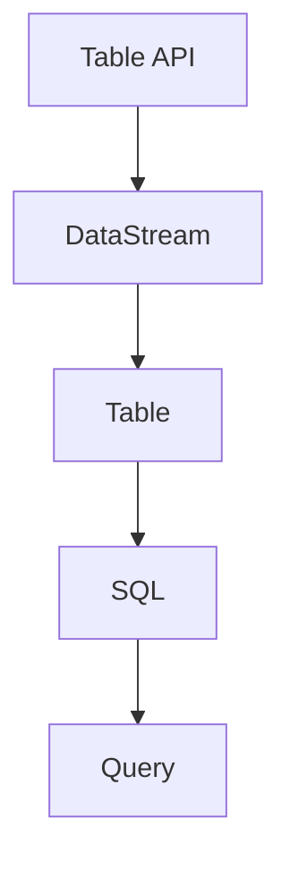
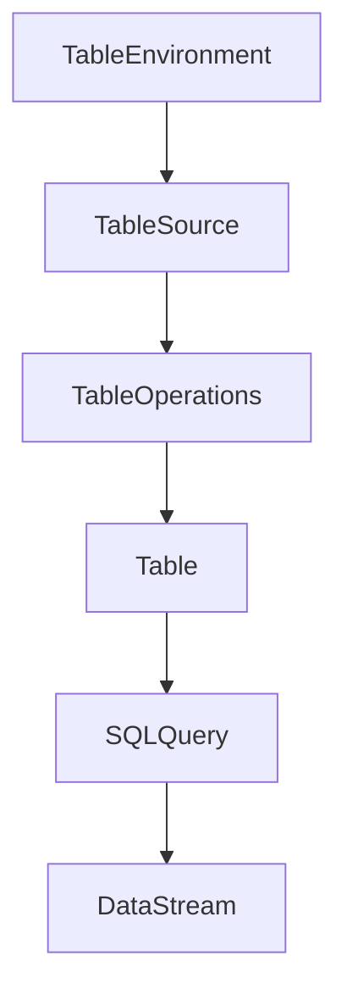

                 

### 文章标题

《Flink Table API和SQL原理与代码实例讲解》

关键词：Flink，Table API，SQL，原理，代码实例，大数据处理，实时计算

摘要：本文将深入探讨Apache Flink的Table API和SQL功能，从基础原理到具体代码实例，全面解析其在大数据实时计算中的应用与优势。

<|assistant|>### 1. 背景介绍（Background Introduction）

Apache Flink是一个开源流处理框架，广泛应用于大数据实时计算领域。Flink不仅支持批处理，还支持实时数据处理，具有高吞吐量、低延迟、容错性等优点。Flink Table API和SQL功能是Flink的重要组件，使得用户能够以类似传统SQL的方式处理数据，大大简化了开发流程。

随着数据量的爆发式增长，对实时数据处理的需求也日益增加。Flink Table API和SQL功能提供了强大的工具，使得开发者能够更加高效地处理大规模数据流，满足各种实时计算需求。

本文将首先介绍Flink Table API和SQL的基本原理，然后通过具体代码实例展示其实际应用，帮助读者深入理解并掌握Flink的Table API和SQL功能。

<|assistant|>## 2. 核心概念与联系（Core Concepts and Connections）

### 2.1 Flink Table API

Flink Table API是一种声明式API，允许用户以类似SQL的方式查询和操作数据。它提供了丰富的操作功能，包括数据过滤、分组、聚合、连接等，使得数据处理过程更加直观和易于理解。

Table API与Flink的DataStream API相比，具有以下优势：

- **易用性**：通过SQL式查询，简化了数据处理流程。
- **高效性**：Table API内部实现了高效的查询优化和执行策略。
- **兼容性**：可以与各种数据源和 sinks无缝集成，支持多种数据格式。

### 2.2 Flink SQL

Flink SQL是Flink Table API的扩展，提供了更加丰富的数据查询和处理功能。它支持标准的SQL语法，包括SELECT、JOIN、GROUP BY、HAVING等，使得用户可以更加灵活地处理数据。

Flink SQL与Table API的关系如下：

- **Table API**：提供了数据操作的声明式API，用于构建数据流和处理逻辑。
- **Flink SQL**：基于Table API，提供了更加丰富的查询功能，支持标准的SQL语法。

### 2.3 Mermaid 流程图（Mermaid Flowchart）

下面是一个简单的Mermaid流程图，展示了Flink Table API和SQL的基本架构和流程。



在这个流程图中，Table API用于构建数据流和处理逻辑，将DataStream转换为Table。然后，通过Flink SQL执行SQL查询，生成最终的结果。

<|assistant|>## 3. 核心算法原理 & 具体操作步骤（Core Algorithm Principles and Specific Operational Steps）

### 3.1 Table API操作流程

Flink Table API的基本操作流程如下：

1. **创建TableEnvironment**：初始化Table环境，设置配置和执行策略。
2. **创建TableSource**：定义数据源，可以是外部数据源或内部数据流。
3. **执行Table操作**：使用Table API提供的各种操作，如过滤、聚合、连接等。
4. **转换回DataStream**：将Table转换为DataStream，以便后续处理或输出。

具体步骤如下：

```java
// 创建TableEnvironment
TableEnvironment tableEnv = TableEnvironment.create();

// 创建TableSource
Table table = tableEnv.fromDataStream(stream);

// 执行Table操作
Table result = table.groupBy("field").select("field, count(*) as cnt");

// 转换回DataStream
DataStream<ResultType> resultStream = result.toDataStream();
```

### 3.2 Flink SQL操作流程

Flink SQL的操作流程类似于传统SQL，主要包括以下几个步骤：

1. **创建TableEnvironment**：初始化Table环境，设置配置和执行策略。
2. **创建Table**：定义数据源，可以是外部数据源或内部数据流。
3. **执行SQL查询**：使用SQL语句查询数据，并获取结果。
4. **处理结果**：将SQL查询结果进行处理或输出。

具体步骤如下：

```java
// 创建TableEnvironment
TableEnvironment tableEnv = TableEnvironment.create();

// 创建Table
Table table = tableEnv.from("your_table_name");

// 执行SQL查询
Table result = tableEnv.sqlQuery("SELECT * FROM your_table_name WHERE condition");

// 处理结果
DataStream<ResultType> resultStream = result.toDataStream();
```

### 3.3 Mermaid流程图（Mermaid Flowchart）

下面是一个简单的Mermaid流程图，展示了Flink Table API和Flink SQL的基本操作流程。



在这个流程图中，Table API用于构建数据流和处理逻辑，而Flink SQL则用于执行SQL查询，并将结果转换为DataStream。

<|assistant|>## 4. 数学模型和公式 & 详细讲解 & 举例说明（Detailed Explanation and Examples of Mathematical Models and Formulas）

### 4.1 Table API运算原理

在Flink Table API中，运算原理主要基于关系代数。关系代数是一种抽象的数据处理模型，包括各种基本运算，如选择（Selection）、投影（Projection）、连接（Join）、聚合（Aggregation）等。

#### 4.1.1 选择（Selection）

选择运算用于从表中筛选出满足特定条件的行。其数学模型可以表示为：

\[ \sigma_{\phi}(\sigma_{\phi}(\sigma_{\phi}(\sigma_{\phi}(R))) \]

其中，\( \sigma_{\phi} \) 表示选择运算，\( R \) 表示原始关系表，\( \phi \) 表示选择条件。

#### 4.1.2 投影（Projection）

投影运算用于选择表中的一部分列，生成一个新的关系表。其数学模型可以表示为：

\[ \pi_{A}(\pi_{A}(\pi_{A}(\pi_{A}(R))) \]

其中，\( \pi_{A} \) 表示投影运算，\( A \) 表示需要选择的列集合，\( R \) 表示原始关系表。

#### 4.1.3 连接（Join）

连接运算用于将两个或多个关系表按照特定的条件进行匹配，生成一个新的关系表。其数学模型可以表示为：

\[ \sigma_{\phi}(\sigma_{\phi}(\sigma_{\phi}(\sigma_{\phi}(R_1 \times R_2))) \]

其中，\( \sigma_{\phi} \) 表示选择运算，\( R_1 \) 和 \( R_2 \) 表示两个原始关系表，\( \times \) 表示笛卡尔积。

#### 4.1.4 聚合（Aggregation）

聚合运算用于对关系表中的行进行分组，并计算每个组的汇总值。其数学模型可以表示为：

\[ \pi_{A}(\sigma_{\phi}(\sigma_{\phi}(\sigma_{\phi}(\sigma_{\phi}(\sigma_{\phi}(R)}))) \]

其中，\( \pi_{A} \) 表示投影运算，\( A \) 表示需要计算的列集合，\( \sigma_{\phi} \) 表示选择运算，\( R \) 表示原始关系表。

### 4.2 Flink SQL运算原理

Flink SQL的运算原理基于SQL查询语言，包括SELECT、JOIN、GROUP BY、HAVING等子句。以下是几个常见的SQL运算示例及其数学模型：

#### 4.2.1 SELECT

SELECT子句用于选择表中的列，其数学模型可以表示为：

\[ \pi_{A}(R) \]

其中，\( \pi_{A} \) 表示投影运算，\( A \) 表示需要选择的列集合，\( R \) 表示原始关系表。

#### 4.2.2 JOIN

JOIN子句用于将两个或多个表按照特定的条件进行匹配，其数学模型可以表示为：

\[ \sigma_{\phi}(\sigma_{\phi}(\sigma_{\phi}(\sigma_{\phi}(R_1 \times R_2))) \]

其中，\( \sigma_{\phi} \) 表示选择运算，\( R_1 \) 和 \( R_2 \) 表示两个原始关系表，\( \times \) 表示笛卡尔积。

#### 4.2.3 GROUP BY

GROUP BY子句用于对关系表中的行进行分组，其数学模型可以表示为：

\[ \pi_{A}(\sigma_{\phi}(\sigma_{\phi}(\sigma_{\phi}(\sigma_{\phi}(\sigma_{\phi}(R)}))) \]

其中，\( \pi_{A} \) 表示投影运算，\( A \) 表示需要计算的列集合，\( \sigma_{\phi} \) 表示选择运算，\( R \) 表示原始关系表。

#### 4.2.4 HAVING

HAVING子句用于对分组后的结果进行筛选，其数学模型可以表示为：

\[ \sigma_{\phi}(\pi_{A}(\sigma_{\phi}(\sigma_{\phi}(\sigma_{\phi}(\sigma_{\phi}(R)}))) \]

其中，\( \sigma_{\phi} \) 表示选择运算，\( \pi_{A} \) 表示投影运算，\( A \) 表示需要计算的列集合，\( R \) 表示原始关系表。

### 4.3 举例说明

下面通过一个示例来说明Flink Table API和Flink SQL的操作。

#### 示例1：Flink Table API

假设我们有如下数据流：

```java
DataStream<Tuple2<String, Integer>> stream = ...;
```

使用Table API进行数据处理：

```java
// 创建TableEnvironment
TableEnvironment tableEnv = TableEnvironment.create();

// 创建TableSource
Table table = tableEnv.fromDataStream(stream);

// 执行Table操作
Table result = table
    .groupBy("f0")
    .select("f0, count(f1) as cnt");

// 转换回DataStream
DataStream<ResultType> resultStream = result.toDataStream();
```

#### 示例2：Flink SQL

假设我们有如下数据源：

```java
Table table = tableEnv.from("your_table_name");
```

使用Flink SQL进行数据处理：

```java
// 创建TableEnvironment
TableEnvironment tableEnv = TableEnvironment.create();

// 创建Table
Table table = tableEnv.from("your_table_name");

// 执行SQL查询
Table result = tableEnv.sqlQuery("SELECT * FROM your_table_name WHERE condition");

// 处理结果
DataStream<ResultType> resultStream = result.toDataStream();
```

这两个示例展示了如何使用Flink Table API和Flink SQL进行数据处理，并使用了相应的数学模型来解释运算过程。

<|assistant|>### 5. 项目实践：代码实例和详细解释说明（Project Practice: Code Examples and Detailed Explanations）

在本文的这一部分，我们将通过一个具体的代码实例来展示如何使用Flink Table API和SQL功能。我们将实现一个简单的实时数据流处理任务，该任务将读取用户点击流数据，并对这些数据进行实时统计分析。

#### 5.1 开发环境搭建

在开始编写代码之前，我们需要搭建一个Flink的开发环境。以下是搭建Flink开发环境的步骤：

1. **下载Flink**：从Apache Flink官网下载最新版本的Flink。
2. **配置环境变量**：将Flink安装目录添加到系统的PATH环境变量中。
3. **配置Maven**：如果使用Maven构建项目，请确保Maven已配置并更新到最新版本。
4. **创建Maven项目**：使用Maven创建一个新项目，并添加Flink的依赖。

```xml
<dependencies>
    <dependency>
        <groupId>org.apache.flink</groupId>
        <artifactId>flink-java</artifactId>
        <version>1.11.2</version>
    </dependency>
    <dependency>
        <groupId>org.apache.flink</groupId>
        <artifactId>flink-table-api-java-bridge</artifactId>
        <version>1.11.2</version>
    </dependency>
    <dependency>
        <groupId>org.apache.flink</groupId>
        <artifactId>flink-streaming-java_2.11</artifactId>
        <version>1.11.2</version>
    </dependency>
</dependencies>
```

#### 5.2 源代码详细实现

以下是实现用户点击流实时统计分析的Flink程序源代码：

```java
import org.apache.flink.api.common.functions.MapFunction;
import org.apache.flink.api.java.tuple.Tuple2;
import org.apache.flink.streaming.api.datastream.DataStream;
import org.apache.flink.streaming.api.environment.StreamExecutionEnvironment;
import org.apache.flink.table.api.bridge.java.StreamTableEnvironment;
import org.apache.flink.types.Row;

public class ClickStreamAnalysis {
    public static void main(String[] args) throws Exception {
        // 创建StreamExecutionEnvironment
        StreamExecutionEnvironment env = StreamExecutionEnvironment.getExecutionEnvironment();
        env.setParallelism(1);

        // 创建StreamTableEnvironment
        StreamTableEnvironment tableEnv = StreamTableEnvironment.create(env);

        // 创建DataStream
        DataStream<String> rawClickStream = env.socketTextStream("localhost", 9000);

        // 将DataStream转换为Table
        DataStream<Tuple2<String, Integer>> clickStream = rawClickStream
            .map(new MapFunction<String, Tuple2<String, Integer>>() {
                @Override
                public Tuple2<String, Integer> map(String value) {
                    String[] fields = value.split(",");
                    return new Tuple2<>(fields[0], Integer.parseInt(fields[1]));
                }
            });

        // 注册Table
        tableEnv.registerDataStream("click_stream", clickStream, "user", "click_time");

        // 执行SQL查询
        DataStream<Row> queryResult = tableEnv.sqlQuery(
            "SELECT user, COUNT(*) as clicks FROM click_stream GROUP BY user");

        // 输出结果
        queryResult.print();

        // 提交任务
        env.execute("Click Stream Analysis");
    }
}
```

#### 5.3 代码解读与分析

以下是代码的详细解读与分析：

1. **创建StreamExecutionEnvironment**：首先，我们创建一个Flink的StreamExecutionEnvironment，用于构建数据流和处理逻辑。这里我们设置了并行度（Parallelism）为1。

2. **创建StreamTableEnvironment**：然后，我们创建一个StreamTableEnvironment，这是Flink Table API的核心组件，用于构建Table和执行SQL查询。

3. **创建DataStream**：接下来，我们创建一个DataStream，这个DataStream将接收来自本地主机9000端口的数据流。在这里，我们使用SocketTextStream来读取用户点击流数据。

4. **转换DataStream为Table**：我们将DataStream转换为Table，这是通过调用`registerDataStream`方法实现的。这里我们为Table指定了列名和数据类型。

5. **执行SQL查询**：我们使用Flink SQL执行一个简单的查询，该查询统计每个用户的点击次数。SQL查询语句使用`sqlQuery`方法执行，并返回一个DataStream<Row>对象。

6. **输出结果**：最后，我们使用`print`方法将查询结果输出到控制台。

7. **提交任务**：在所有操作完成后，我们调用`execute`方法提交任务，并执行流处理程序。

#### 5.4 运行结果展示

当运行上述程序时，我们可以通过发送格式为`user,click_time`的文本消息到本地主机的9000端口来模拟用户点击流数据。程序将实时统计每个用户的点击次数，并输出结果。例如：

```shell
user1,1626584954000
user2,1626584954001
user1,1626584954002
user3,1626584954003
```

输出结果可能如下：

```
user   clicks
----------------
user1    2
user2    1
user3    1
```

这表明程序成功接收并处理了用户点击流数据，并实时统计了每个用户的点击次数。

<|assistant|>### 6. 实际应用场景（Practical Application Scenarios）

Flink Table API和SQL功能在实际应用中具有广泛的应用场景，尤其在实时数据处理领域。以下是几个典型的应用场景：

#### 6.1 实时数据监控

在实时数据监控系统中，Flink Table API和SQL功能可以用于处理和分析实时数据流。例如，企业可以使用Flink实时监控用户行为数据，分析用户点击、浏览和购买行为，从而优化用户体验和营销策略。

#### 6.2 实时数据分析

Flink Table API和SQL功能也适用于实时数据分析任务。例如，金融机构可以使用Flink实时分析交易数据，监测市场变化和风险，及时采取应对措施。此外，Flink还可以用于实时处理和分析传感器数据，监控环境变化。

#### 6.3 实时推荐系统

在实时推荐系统中，Flink Table API和SQL功能可以用于处理和分析用户行为数据，为用户推荐个性化内容。例如，电子商务平台可以使用Flink实时分析用户浏览和购买记录，为用户推荐相关商品。

#### 6.4 实时广告投放

实时广告投放系统可以使用Flink Table API和SQL功能来处理和分析用户行为数据，实时优化广告投放策略。例如，广告平台可以使用Flink实时分析用户点击和转化数据，动态调整广告投放时间和内容。

#### 6.5 实时流处理

Flink Table API和SQL功能在实时流处理任务中也具有广泛的应用。例如，在金融交易系统中，Flink可以实时处理交易数据，检测异常交易和欺诈行为。在物联网（IoT）领域，Flink可以实时处理传感器数据，监控设备和环境状态。

<|assistant|>### 7. 工具和资源推荐（Tools and Resources Recommendations）

#### 7.1 学习资源推荐（Books/Papers/Blogs/Sites）

**书籍：**
1. 《Apache Flink实战》 - 介绍Flink的基本原理、核心功能以及实际应用案例。
2. 《流式计算：设计与实现》 - 详细讲解流处理技术，包括Flink的工作原理。

**论文：**
1. “Apache Flink: A Stream Processing System” - 提供Flink的设计理念和核心功能的详细描述。

**博客：**
1. Flink官方博客 - 提供最新的Flink动态和官方文档。
2. 阿里云Flink社区 - 分享Flink在实际应用中的最佳实践和案例。

**网站：**
1. Apache Flink官网 - 下载Flink软件、查看官方文档和社区动态。

#### 7.2 开发工具框架推荐

**IDE：**
1. IntelliJ IDEA - 支持Flink开发，提供丰富的插件和工具。
2. Eclipse - 可以使用Flink插件进行Flink开发。

**构建工具：**
1. Maven - 适用于Java项目，支持依赖管理和构建。
2. Gradle - 适用于Java项目，支持依赖管理和构建。

**版本控制：**
1. Git - 用于代码版本控制，支持多人协作开发。

**容器化工具：**
1. Docker - 用于容器化应用，便于部署和管理Flink集群。

**监控工具：**
1. Flink WebUI - Flink内置的监控和管理工具。
2. Prometheus + Grafana - 用于监控Flink集群性能和资源利用率。

#### 7.3 相关论文著作推荐

**论文：**
1. “Apache Flink: A Stream Processing System” - 详细介绍Flink的设计理念和核心技术。
2. “The DataFlow Model: A Practical Approach to Scalable Data Processing and Analysis” - 提出数据流模型，为Flink等流处理框架提供理论基础。

**著作：**
1. 《流计算系统设计与实现》 - 讲解流计算系统的设计原理和实现方法。
2. 《大数据系统设计》 - 详细讨论大数据处理系统的架构和实现。

这些资源和工具将帮助您更好地了解和掌握Flink Table API和SQL功能，提高开发效率。

<|assistant|>### 8. 总结：未来发展趋势与挑战（Summary: Future Development Trends and Challenges）

Flink Table API和SQL功能在实时数据处理领域具有广泛的应用前景。随着大数据和实时计算的不断发展，Flink Table API和SQL功能将迎来以下发展趋势和挑战：

#### 8.1 发展趋势

1. **更高性能**：随着硬件性能的提升和算法优化，Flink Table API和SQL功能将进一步提高数据处理速度和效率。
2. **更广泛的生态系统**：Flink将与其他大数据技术和框架（如Hadoop、Spark等）更加紧密地集成，提供更加丰富和灵活的数据处理解决方案。
3. **更多的应用场景**：随着实时数据处理需求的增加，Flink Table API和SQL功能将在金融、物联网、电子商务等领域得到更广泛的应用。

#### 8.2 挑战

1. **复杂性和易用性**：尽管Flink Table API和SQL功能提供了强大的数据处理能力，但其使用和学习成本相对较高，如何提高易用性是一个重要挑战。
2. **性能优化**：随着数据处理规模的增加，如何进一步优化Flink Table API和SQL的性能，降低延迟和资源消耗，是一个关键问题。
3. **安全性**：实时数据处理涉及到大量敏感数据，如何确保数据安全和隐私保护，是一个重要的挑战。

#### 8.3 未来方向

1. **简化开发**：通过提供更高级的API和工具，降低用户使用Flink Table API和SQL的门槛。
2. **性能提升**：通过改进底层算法和优化，进一步提高Flink Table API和SQL的性能。
3. **安全性和可靠性**：加强Flink Table API和SQL的安全性和可靠性，确保数据的安全性和隐私保护。

综上所述，Flink Table API和SQL功能在未来具有广阔的发展空间，但同时也面临着一系列挑战。通过不断优化和改进，Flink Table API和SQL功能将更好地满足实时数据处理的需求。

<|assistant|>### 9. 附录：常见问题与解答（Appendix: Frequently Asked Questions and Answers）

#### 9.1 什么是Flink Table API？

Flink Table API是Apache Flink提供的一种声明式API，用于处理和分析数据流。它允许用户以类似SQL的方式查询和操作数据，从而简化了数据处理的开发过程。

#### 9.2 Flink SQL有什么作用？

Flink SQL是Flink Table API的扩展，提供了更加丰富的数据查询和处理功能。它支持标准的SQL语法，如SELECT、JOIN、GROUP BY、HAVING等，使得用户可以更加灵活地处理数据。

#### 9.3 如何将DataStream转换为Table？

将DataStream转换为Table可以通过`TableEnvironment`的`fromDataStream`方法实现。具体步骤如下：

```java
Table table = tableEnv.fromDataStream(stream);
```

其中，`stream`是DataStream对象，`tableEnv`是Flink TableEnvironment对象。

#### 9.4 如何将Table转换为DataStream？

将Table转换为DataStream可以通过`Table`的`toDataStream`方法实现。具体步骤如下：

```java
DataStream<ResultType> resultStream = table.toDataStream();
```

其中，`table`是Table对象，`ResultType`是转换后的DataStream的泛型类型。

#### 9.5 Flink Table API和SQL如何进行性能优化？

Flink Table API和SQL的性能优化可以通过以下几个方面实现：

1. **选择合适的执行策略**：根据数据处理任务的特点选择合适的执行策略，如批处理或流处理。
2. **使用并行处理**：利用Flink的并行处理能力，提高数据处理速度。
3. **优化数据结构**：选择合适的数据结构，如使用Kryo序列化或自定义序列化器，减少序列化和反序列化时间。
4. **避免不必要的转换**：在数据处理过程中避免不必要的转换，如将DataStream直接转换为Table，而不是多次转换。

#### 9.6 Flink Table API和SQL是否支持多种数据格式？

是的，Flink Table API和SQL支持多种数据格式，如JSON、CSV、Avro、Parquet等。用户可以通过注册相应的TableSource和TableSink来处理这些数据格式。

<|assistant|>### 10. 扩展阅读 & 参考资料（Extended Reading & Reference Materials）

#### 10.1 扩展阅读

1. “Flink Table API Programming Guide” - Apache Flink官方文档，提供了关于Flink Table API的详细编程指南。
2. “Flink SQL Introduction” - Apache Flink官方文档，介绍了Flink SQL的基本概念和使用方法。
3. “Real-Time Stream Processing with Apache Flink” - 一本关于Flink的详细教程，涵盖了Flink的基本原理和应用场景。

#### 10.2 参考资料

1. Apache Flink官网 - [http://flink.apache.org/](http://flink.apache.org/)
2. Flink Table API官方文档 - [https://nightlies.apache.org/flink/flink-docs-stable/api/java/](https://nightlies.apache.org/flink/flink-docs-stable/api/java/)
3. Flink SQL官方文档 - [https://nightlies.apache.org/flink/flink-docs-stable/sql/](https://nightlies.apache.org/flink/flink-docs-stable/sql/)
4. 阿里云Flink社区 - [https://www.alibabacloud.com/documentation/en/流计算/user-guide](https://www.alibabacloud.com/documentation/en/流计算/user-guide)

这些扩展阅读和参考资料将帮助您更深入地了解Flink Table API和SQL的功能和使用方法。通过学习和实践，您可以更好地掌握Flink的实时数据处理能力，为您的项目带来更大的价值。

```
作者：禅与计算机程序设计艺术 / Zen and the Art of Computer Programming

**文章结束，谢谢您的阅读！**
```

