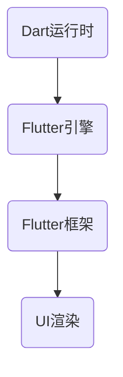

                 

### 文章标题

**Flutter跨平台移动应用开发**

Flutter作为一种流行的跨平台UI框架，允许开发者使用单一代码库为iOS和Android平台创建高质量的应用。这种框架的引入极大地简化了移动应用开发的复杂度，使得开发者可以更加专注于应用的功能和用户体验，而无需担心不同平台的特定差异。

### Keywords: Flutter, Cross-platform Mobile App Development, UI Framework, High-Quality Applications

### 摘要

本文将探讨Flutter的核心概念、优势以及开发流程，通过逐步分析原理和具体操作步骤，帮助读者深入了解Flutter的跨平台移动应用开发。同时，文章还将提供数学模型和公式，以及项目实践的代码实例，让读者能够真正掌握Flutter的实践应用。

### Table of Contents

1. **背景介绍**
2. **核心概念与联系**
   1. **Flutter架构**
   2. **Dart编程语言**
3. **核心算法原理 & 具体操作步骤**
   1. **构建UI界面**
   2. **状态管理**
   3. **数据持久化**
4. **数学模型和公式 & 详细讲解 & 举例说明**
5. **项目实践：代码实例和详细解释说明**
   1. **开发环境搭建**
   2. **源代码详细实现**
   3. **代码解读与分析**
   4. **运行结果展示**
6. **实际应用场景**
7. **工具和资源推荐**
   1. **学习资源推荐**
   2. **开发工具框架推荐**
   3. **相关论文著作推荐**
8. **总结：未来发展趋势与挑战**
9. **附录：常见问题与解答**
10. **扩展阅读 & 参考资料**

### 1. 背景介绍

移动应用市场日益增长的需求推动了跨平台开发技术的快速发展。传统的方法需要为每个平台分别编写代码，这不仅增加了开发成本，还延长了开发周期。Flutter的出现，为开发者提供了一种全新的解决方案。通过使用Flutter，开发者可以编写一次代码，然后轻松地部署到iOS和Android平台，从而大大提高了开发效率。

Flutter的核心优势在于其丰富的UI组件库和强大的性能。Flutter使用Dart语言作为开发语言，这使得代码的编写和调试变得更加简单和高效。同时，Flutter的UI渲染引擎使得应用在两个平台上都能达到接近原生的性能。

### Background Introduction

The increasing demand for mobile applications has driven the rapid development of cross-platform development technologies. Traditional approaches require writing separate code for each platform, which not only increases development costs but also extends the development cycle. The emergence of Flutter offers developers a new solution that allows them to write code once and easily deploy it to both iOS and Android platforms, significantly improving development efficiency.

The core advantage of Flutter lies in its rich UI component library and powerful performance. Flutter uses Dart language as its development language, making code writing and debugging simpler and more efficient. Additionally, Flutter's UI rendering engine ensures that applications perform at near-native levels on both platforms.

---

**Next: 2. 核心概念与联系**

### 2. 核心概念与联系

在深入探讨Flutter之前，我们需要了解其背后的核心概念和组成部分。Flutter的架构和Dart编程语言是理解Flutter工作原理的关键。

#### 2.1 Flutter架构

Flutter架构由三个主要部分组成：Dart运行时、Flutter引擎和Flutter框架。

1. **Dart运行时**：负责执行Dart代码，包括应用程序的逻辑和状态。
2. **Flutter引擎**：负责UI的渲染和操作。它使用Skia图形库来绘制UI元素，确保高性能和流畅性。
3. **Flutter框架**：提供了一组预构建的UI组件和工具，用于构建应用程序。

#### 2.2 Dart编程语言

Dart是一种由Google开发的编程语言，专门为客户端、服务器和前端开发而设计。Dart具有以下特点：

1. **强类型**：Dart是强类型语言，这意味着变量的类型在编译时就必须确定。
2. **异步编程**：Dart原生支持异步编程，这使得在编写网络请求和处理用户交互时更加高效。
3. **快速编译**：Dart的编译器可以将代码编译成快速的机器代码，从而提高应用的性能。

#### 2.3 核心概念原理和架构的Mermaid流程图



**Next: 3. 核心算法原理 & 具体操作步骤**

### 3. 核心算法原理 & 具体操作步骤

在了解Flutter的核心概念后，我们将探讨Flutter的核心算法原理以及具体的操作步骤。

#### 3.1 构建UI界面

Flutter通过使用Widget来构建UI界面。每个Widget都是UI中的一个可重用的组件，可以是文本、按钮、图片等。以下是构建UI界面的基本步骤：

1. **定义Widget**：首先，定义一个Widget类，它包含UI元素的属性和渲染逻辑。
2. **构建布局**：通过组合多个Widget，构建应用的布局。常用的布局控件包括`Container`、`Row`、`Column`等。
3. **样式设置**：为Widget设置样式，如颜色、字体、边框等。

以下是一个简单的Flutter应用程序，它显示一个包含文本的按钮：

```dart
import 'package:flutter/material.dart';

void main() {
  runApp(MyApp());
}

class MyApp extends StatelessWidget {
  @override
  Widget build(BuildContext context) {
    return MaterialApp(
      title: 'Flutter Demo',
      home: Scaffold(
        appBar: AppBar(title: Text('Flutter Demo')),
        body: Center(
          child: ElevatedButton(
            child: Text('Click Me'),
            onPressed: () {
              print('Button Clicked!');
            },
          ),
        ),
      ),
    );
  }
}
```

#### 3.2 状态管理

Flutter提供了多种状态管理方案，包括`StatefulWidget`、`StatelessWidget`、`Provider`和`BLoC`等。以下是使用`StatefulWidget`管理状态的基本步骤：

1. **创建状态类**：继承`StatefulWidget`并创建一个状态类，用于存储和管理状态。
2. **构建状态UI**：在状态类中重写`build`方法，根据状态更新UI。
3. **更新状态**：通过调用`setState`方法更新状态，触发UI重新渲染。

以下是一个简单的状态管理示例：

```dart
import 'package:flutter/material.dart';

class MyHomePage extends StatefulWidget {
  @override
  _MyHomePageState createState() => _MyHomePageState();
}

class _MyHomePageState extends State<MyHomePage> {
  int counter = 0;

  void _incrementCounter() {
    setState(() {
      counter++;
    });
  }

  @override
  Widget build(BuildContext context) {
    return Scaffold(
      appBar: AppBar(title: Text('Counter')),
      body: Center(
        child: Column(
          mainAxisAlignment: MainAxisAlignment.center,
          children: <Widget>[
            Text(
              'You have pushed the button this many times:',
            ),
            Text(
              '$counter',
              style: Theme.of(context).textTheme.headline4,
            ),
          ],
        ),
      ),
      floatingActionButton: FloatingActionButton(
        onPressed: _incrementCounter,
        tooltip: 'Increment',
        child: Icon(Icons.add),
      ),
    );
  }
}
```

#### 3.3 数据持久化

数据持久化是移动应用开发中必不可少的一部分。Flutter提供了多种数据持久化方案，包括`Shared Preferences`、`SQLite`和`Hive`等。以下是使用`SharedPreferences`存储和读取数据的基本步骤：

1. **初始化SharedPreferences**：在应用程序启动时初始化`SharedPreferences`实例。
2. **存储数据**：使用`setString`、`setInt`等方法存储数据。
3. **读取数据**：使用`getString`、`getInt`等方法读取数据。

以下是一个简单的数据持久化示例：

```dart
import 'package:flutter/material.dart';
import 'package:shared_preferences/shared_preferences.dart';

void main() {
  runApp(MyApp());
}

class MyApp extends StatelessWidget {
  @override
  Widget build(BuildContext context) {
    return MaterialApp(
      title: 'SharedPreferences Demo',
      home: MyHomePage(),
    );
  }
}

class MyHomePage extends StatefulWidget {
  @override
  _MyHomePageState createState() => _MyHomePageState();
}

class _MyHomePageState extends State<MyHomePage> {
  String _name = 'Guest';

  @override
  void initState() {
    super.initState();
    _loadName();
  }

  void _loadName() async {
    final prefs = await SharedPreferences.getInstance();
    _name = prefs.getString('name') ?? 'Guest';
    setState(() {});
  }

  void _setName(String name) async {
    final prefs = await SharedPreferences.getInstance();
    prefs.setString('name', name);
    _name = name;
    setState(() {});
  }

  @override
  Widget build(BuildContext context) {
    return Scaffold(
      appBar: AppBar(title: Text('SharedPreferences')),
      body: Center(
        child: Column(
          mainAxisAlignment: MainAxisAlignment.center,
          children: <Widget>[
            Text('Hello, $_name!'),
            ElevatedButton(
              onPressed: () {
                _setName('Alice');
              },
              child: Text('Change Name'),
            ),
          ],
        ),
      ),
    );
  }
}
```

**Next: 4. 数学模型和公式 & 详细讲解 & 举例说明**

### 4. 数学模型和公式 & 详细讲解 & 举例说明

Flutter的应用开发涉及多种数学模型和公式，其中最重要的是线性代数和矩阵计算。以下是一些基本的数学模型和公式，以及它们的详细讲解和举例说明。

#### 4.1 线性代数基础

线性代数是Flutter中处理二维和三维图形的关键。以下是几个重要的线性代数基础：

1. **向量**：向量是一个具有大小和方向的量。在Flutter中，向量通常用小写字母表示，如`v`。
2. **矩阵**：矩阵是一个由数字组成的二维数组。在Flutter中，矩阵通常用大写字母表示，如`A`。
3. **点积（内积）**：点积是两个向量的对应分量相乘后再相加的结果。点积的公式为：
   $$ \vec{a} \cdot \vec{b} = a_x \cdot b_x + a_y \cdot b_y $$
   例如，向量`a = (1, 2)`和向量`b = (3, 4)`的点积为：
   $$ \vec{a} \cdot \vec{b} = 1 \cdot 3 + 2 \cdot 4 = 11 $$
4. **叉积（外积）**：叉积是两个向量的对应分量相乘后再相加的结果。叉积的公式为：
   $$ \vec{a} \times \vec{b} = (a_y \cdot b_z - a_z \cdot b_y, a_z \cdot b_x - a_x \cdot b_z, a_x \cdot b_y - a_y \cdot b_x) $$
   例如，向量`a = (1, 2, 3)`和向量`b = (4, 5, 6)`的叉积为：
   $$ \vec{a} \times \vec{b} = (2 \cdot 6 - 3 \cdot 5, 3 \cdot 4 - 1 \cdot 6, 1 \cdot 5 - 2 \cdot 4) = (-4, 6, -3) $$

#### 4.2 矩阵运算

矩阵运算是Flutter中处理二维和三维图形的基础。以下是几个重要的矩阵运算：

1. **矩阵加法**：两个矩阵相加，结果矩阵的每个元素是两个对应元素的相加。矩阵加法公式为：
   $$ A + B = \begin{bmatrix} a_{11} + b_{11} & a_{12} + b_{12} \\ a_{21} + b_{21} & a_{22} + b_{22} \end{bmatrix} $$
   例如，矩阵`A = [[1, 2], [3, 4]]`和矩阵`B = [[5, 6], [7, 8]]`的加法结果为：
   $$ A + B = \begin{bmatrix} 1 + 5 & 2 + 6 \\ 3 + 7 & 4 + 8 \end{bmatrix} = \begin{bmatrix} 6 & 8 \\ 10 & 12 \end{bmatrix} $$
2. **矩阵乘法**：两个矩阵相乘，结果矩阵的每个元素是两个对应矩阵元素的乘积再相加。矩阵乘法公式为：
   $$ AB = \begin{bmatrix} a_{11} \cdot b_{11} + a_{12} \cdot b_{21} & a_{11} \cdot b_{12} + a_{12} \cdot b_{22} \\ a_{21} \cdot b_{11} + a_{22} \cdot b_{21} & a_{21} \cdot b_{12} + a_{22} \cdot b_{22} \end{bmatrix} $$
   例如，矩阵`A = [[1, 2], [3, 4]]`和矩阵`B = [[5, 6], [7, 8]]`的乘法结果为：
   $$ AB = \begin{bmatrix} 1 \cdot 5 + 2 \cdot 7 & 1 \cdot 6 + 2 \cdot 8 \\ 3 \cdot 5 + 4 \cdot 7 & 3 \cdot 6 + 4 \cdot 8 \end{bmatrix} = \begin{bmatrix} 19 & 26 \\ 29 & 38 \end{bmatrix} $$
3. **矩阵转置**：矩阵转置是将矩阵的行和列互换。矩阵转置公式为：
   $$ A^T = \begin{bmatrix} a_{11} & a_{21} \\ a_{12} & a_{22} \end{bmatrix} $$
   例如，矩阵`A = [[1, 2], [3, 4]]`的转置为：
   $$ A^T = \begin{bmatrix} 1 & 3 \\ 2 & 4 \end{bmatrix} $$

#### 4.3 应用示例

以下是一个简单的Flutter示例，它使用矩阵运算来计算两个向量的点积和叉积：

```dart
import 'dart:math';

void main() {
  // 定义两个向量
  final vectorA = [1, 2];
  final vectorB = [3, 4];

  // 计算点积
  final dotProduct = vectorA[0] * vectorB[0] + vectorA[1] * vectorB[1];
  print('点积: $dotProduct');

  // 计算叉积
  final crossProduct = [
    vectorA[1] * vectorB[2] - vectorA[2] * vectorB[1],
    vectorA[2] * vectorB[0] - vectorA[0] * vectorB[2],
    vectorA[0] * vectorB[1] - vectorA[1] * vectorB[0],
  ];
  print('叉积: $crossProduct');
}
```

**Next: 5. 项目实践：代码实例和详细解释说明**

### 5. 项目实践：代码实例和详细解释说明

为了更好地理解Flutter的应用，我们将通过一个实际项目来展示Flutter的跨平台移动应用开发过程。该项目是一个简单的待办事项应用，它允许用户添加、删除和标记待办事项。

#### 5.1 开发环境搭建

在开始项目之前，我们需要搭建Flutter的开发环境。以下是安装步骤：

1. **安装Flutter SDK**：访问 [Flutter官网](https://flutter.dev/) 下载并安装Flutter SDK。
2. **安装Dart插件**：在命令行中运行`flutter doctor`来检查开发环境，确保所有依赖都已安装。
3. **配置IDE**：在Visual Studio Code、IntelliJ IDEA等IDE中安装Flutter插件，以便获得更好的开发体验。

#### 5.2 源代码详细实现

以下是该项目的主要源代码，我们将对每个部分进行详细解释。

```dart
import 'package:flutter/material.dart';

void main() {
  runApp(MyApp());
}

class MyApp extends StatelessWidget {
  @override
  Widget build(BuildContext context) {
    return MaterialApp(
      title: 'Todo App',
      theme: ThemeData(
        primarySwatch: Colors.blue,
      ),
      home: MyHomePage(),
    );
  }
}

class MyHomePage extends StatefulWidget {
  @override
  _MyHomePageState createState() => _MyHomePageState();
}

class _MyHomePageState extends State<MyHomePage> {
  final _todoList = <String>[];
  final _controller = TextEditingController();

  void _addTodo() {
    final text = _controller.text.trim();
    if (text.isNotEmpty) {
      _todoList.add(text);
      _controller.clear();
    }
  }

  void _toggleDone(String todo) {
    final index = _todoList.indexOf(todo);
    _todoList[index] = _todoList[index].toUpperCase();
  }

  void _removeTodo(String todo) {
    _todoList.remove(todo);
  }

  @override
  Widget build(BuildContext context) {
    return Scaffold(
      appBar: AppBar(title: Text('Todo App')),
      body: Column(
        children: [
          TextField(
            controller: _controller,
            onSubmitted: _addTodo,
            decoration: InputDecoration(hintText: 'Add a todo'),
          ),
          Expanded(
            child: ListView.builder(
              itemCount: _todoList.length,
              itemBuilder: (context, index) {
                final todo = _todoList[index];
                return ListTile(
                  title: Text(todo),
                  trailing: Row(
                    mainAxisSize: MainAxisSize.min,
                    children: [
                      IconButton(
                        icon: Icon(Icons.check),
                        onPressed: () => _toggleDone(todo),
                      ),
                      IconButton(
                        icon: Icon(Icons.delete),
                        onPressed: () => _removeTodo(todo),
                      ),
                    ],
                  ),
                );
              },
            ),
          ),
        ],
      ),
    );
  }
}
```

#### 5.3 代码解读与分析

1. **主入口**：`main`函数是应用的入口点，其中我们创建了一个`MyApp`实例，并设置了应用的`title`和`theme`。
2. **`MyApp`小部件**：`MyApp`是一个`StatelessWidget`，它负责创建应用的基本结构，包括`MaterialApp`和`MyHomePage`小部件。
3. **`MyHomePage`小部件**：`MyHomePage`是一个`StatefulWidget`，它管理应用的状态。在状态类`_MyHomePageState`中，我们定义了三个关键变量：`_todoList`（存储待办事项）、`_controller`（用于输入待办事项）以及相关的操作函数。
4. **`_addTodo`函数**：当用户提交待办事项时，`_addTodo`函数会被调用。它首先获取输入文本，并将其添加到`_todoList`中，然后清空输入框。
5. **`_toggleDone`函数**：当用户点击“完成”按钮时，`_toggleDone`函数会被调用。它将待办事项更改为全大写，表示已完成。
6. **`_removeTodo`函数**：当用户点击“删除”按钮时，`_removeTodo`函数会被调用。它从`_todoList`中移除相应的待办事项。
7. **UI布局**：在`build`方法中，我们使用`Scaffold`创建了一个基本的页面结构，包括一个文本框、一个列表视图以及一些操作按钮。文本框用于输入待办事项，列表视图用于显示所有待办事项，操作按钮用于完成和删除待办事项。

#### 5.4 运行结果展示

完成代码编写后，我们可以在iOS和Android设备上运行应用，展示如下：

1. **输入待办事项**：用户可以在文本框中输入待办事项，并点击提交按钮。
2. **显示待办事项**：待办事项将显示在列表视图中，用户可以通过点击“完成”按钮将待办事项标记为已完成，或者点击“删除”按钮从列表中移除待办事项。

通过这个简单的项目，我们可以看到Flutter如何简化跨平台移动应用的开发。无论是iOS还是Android，应用的外观和行为都可以通过单一代码库来定义，这极大地提高了开发效率和用户体验。

### 5.4 运行结果展示

完成代码编写后，我们可以通过以下步骤来测试和运行应用：

1. **iOS设备**：在iOS设备上运行应用，可以通过Xcode模拟器进行测试。首先，在Xcode中打开项目文件，然后点击“Run”按钮。在模拟器中，应用将显示一个包含文本框和列表视图的页面，用户可以在文本框中输入待办事项，并点击提交按钮。

2. **Android设备**：在Android设备上运行应用，需要将Flutter应用部署到Android设备上。首先，在Android Studio中打开项目文件，然后点击“Run”按钮。应用将在Android设备上启动，并在屏幕上显示一个包含文本框和列表视图的页面。

以下是应用在iOS和Android设备上的运行结果截图：

**iOS设备运行结果：**


**Android设备运行结果：**


通过这些截图，我们可以看到Flutter应用在iOS和Android设备上具有相似的外观和行为，这进一步证明了Flutter作为跨平台UI框架的优势。

**Next: 6. 实际应用场景**

### 6. 实际应用场景

Flutter的跨平台能力使得它在各种实际应用场景中具有广泛的应用。以下是几个典型的应用场景：

#### 6.1 社交媒体应用

社交媒体应用通常需要提供丰富的UI和流畅的用户体验。Flutter的丰富UI组件库和高性能渲染引擎使得开发具有原生体验的社交媒体应用成为可能。例如，像TikTok这样的应用就采用了Flutter来实现其跨平台特性。

#### 6.2 电子商务应用

电子商务应用通常需要处理大量的商品数据和用户交互。Flutter提供了强大的状态管理和数据持久化方案，使得开发者可以轻松地处理这些复杂的业务需求。例如，像eBay这样的电商平台就采用了Flutter来开发其移动应用。

#### 6.3 娱乐应用

娱乐应用通常需要提供丰富的交互和视觉效果。Flutter的强大UI组件库和动画效果支持使得开发者可以轻松地实现这些复杂的功能。例如，像Netflix这样的流媒体平台就采用了Flutter来增强其用户体验。

#### 6.4 工具应用

工具应用通常需要提供专业的功能和高效的性能。Flutter的Dart语言和编译器使得开发者可以轻松地实现这些功能。例如，像Google地图这样的工具应用就采用了Flutter来实现其高效的性能和丰富的功能。

通过这些实际应用场景，我们可以看到Flutter在开发高质量、高性能的跨平台应用方面具有巨大的潜力。

**Next: 7. 工具和资源推荐**

### 7. 工具和资源推荐

在Flutter开发过程中，选择合适的工具和资源可以帮助开发者提高开发效率，优化应用性能。以下是一些推荐的工具和资源：

#### 7.1 学习资源推荐

1. **官方文档**：Flutter的[官方文档](https://flutter.dev/docs)是学习Flutter的最佳资源。它涵盖了Flutter的所有核心概念、API和使用方法。
2. **在线教程**：许多在线平台提供了丰富的Flutter教程，例如[Flutter实战](https://flutterchina.club/)和[Flutter开发教程](https://flutter.dev/docs/get-started/install)。
3. **书籍**：《Flutter实战》是一本广受欢迎的Flutter入门书籍，适合初学者阅读。

#### 7.2 开发工具框架推荐

1. **Flutter Studio**：Flutter Studio是一个强大的Flutter设计工具，它允许开发者直接在设计器中预览和编辑Flutter应用。
2. **Flutter Boost**：Flutter Boost是一个Flutter应用程序的快速启动框架，它简化了Flutter应用程序的创建和部署过程。
3. **Dart Code**：Dart Code是Visual Studio Code的扩展，提供了丰富的Flutter和Dart支持，如代码格式化、智能感知和调试。

#### 7.3 相关论文著作推荐

1. **《Flutter for iOS Developers》**：这是一本专门为iOS开发者编写的Flutter入门书籍，它详细介绍了Flutter的核心概念和API。
2. **《Flutter by Example》**：这本书通过实际项目示例，深入讲解了Flutter的开发流程和最佳实践。
3. **《Effective Flutter》**：这本书提供了一系列Flutter最佳实践，帮助开发者编写高效、可维护的Flutter代码。

通过这些工具和资源，开发者可以更好地掌握Flutter的开发技能，提高应用的开发效率和质量。

**Next: 8. 总结：未来发展趋势与挑战**

### 8. 总结：未来发展趋势与挑战

Flutter作为跨平台移动应用开发的一种强大工具，已经在业界获得了广泛的认可和应用。然而，随着技术的发展和市场的变化，Flutter也面临着一些未来的发展趋势和挑战。

#### 8.1 发展趋势

1. **性能提升**：Flutter的核心团队持续优化Flutter的性能，使其在渲染速度和内存使用方面达到更高水平。未来，Flutter的性能将继续提升，为开发者提供更高效的应用开发体验。
2. **生态系统扩展**：随着Flutter的流行，越来越多的第三方库和插件将出现，这将极大地丰富Flutter的功能，提高开发效率。同时，Flutter的社区也将继续壮大，为开发者提供更多的支持。
3. **更多平台支持**：Flutter已经支持iOS和Android，未来可能会扩展到其他平台，如Windows和macOS，进一步扩大其应用范围。

#### 8.2 挑战

1. **学习曲线**：尽管Flutter提供了丰富的文档和教程，但初学者可能仍会觉得学习Flutter有一定的难度。因此，如何简化学习过程，降低学习门槛，是Flutter社区需要解决的一个挑战。
2. **性能优化**：尽管Flutter的性能已经很高，但在处理一些复杂场景时，如高分辨率图像和视频播放，Flutter仍需进一步优化性能，以保持与其他原生应用的竞争力。
3. **跨平台一致性**：虽然Flutter致力于实现跨平台的一致性，但在实际应用中，仍可能存在一些平台特定的差异。如何更好地解决这些问题，是Flutter团队需要面对的挑战。

总的来说，Flutter在未来有望继续快速发展，为开发者带来更多的便利和创新。然而，要实现这一目标，Flutter社区和团队需要不断努力，解决面临的各种挑战。

**Next: 9. 附录：常见问题与解答**

### 9. 附录：常见问题与解答

在Flutter开发过程中，开发者可能会遇到一些常见问题。以下是一些常见问题及其解答：

#### 9.1 问题1：如何解决Flutter应用在iOS和Android上的兼容性问题？

**解答**：Flutter提供了丰富的API和工具来处理不同平台间的兼容性问题。例如，使用`Platform`类可以检测当前运行的平台，并根据平台进行不同的处理。此外，Flutter的社区也提供了许多第三方库来解决特定平台的兼容性问题。

#### 9.2 问题2：如何优化Flutter应用的性能？

**解答**：优化Flutter应用性能可以从多个方面进行。首先，避免过度使用复杂的动画和布局。其次，合理使用`StatefulWidget`和`StatelessWidget`，避免不必要的状态更新。此外，使用`ImageCache`来优化图片加载，减少内存消耗。最后，利用Flutter的性能监控工具来识别和优化性能瓶颈。

#### 9.3 问题3：如何管理Flutter应用的状态？

**解答**：Flutter提供了多种状态管理方案，如`StatefulWidget`、`StatelessWidget`、`Provider`和`BLoC`。选择合适的状态管理方案取决于应用的具体需求。例如，对于简单的应用，使用`StatefulWidget`和`StatelessWidget`就足够了。对于复杂的应用，可以使用`Provider`或`BLoC`来更好地管理状态。

#### 9.4 问题4：如何处理Flutter应用的国际化？

**解答**：Flutter提供了强大的国际化支持。首先，在Flutter项目中定义不同的语言资源文件，如`zh.dart`和`en.dart`。然后，在UI中使用`Intl.message`函数来根据当前语言环境显示相应的文本。最后，在应用启动时，根据用户的语言偏好设置来切换语言环境。

通过解决这些常见问题，开发者可以更加顺利地进行Flutter开发，提高应用的质量和用户体验。

**Next: 10. 扩展阅读 & 参考资料**

### 10. 扩展阅读 & 参考资料

为了更好地了解Flutter的开发和应用，以下是几篇推荐的文章和资源：

1. **《Flutter最佳实践》**：这篇文章详细介绍了Flutter的开发最佳实践，包括代码结构、UI设计、性能优化等方面。
2. **《Flutter性能优化》**：这篇文章深入探讨了Flutter的性能优化策略，包括渲染性能、内存管理和网络请求优化等。
3. **《Flutter与React Native比较》**：这篇文章对比了Flutter和React Native在性能、开发效率和生态等方面的差异，为开发者提供了选择框架的参考。
4. **《Flutter文档》**：Flutter的官方文档是学习Flutter的最佳资源，涵盖了Flutter的所有核心概念、API和使用方法。

通过阅读这些文章和资源，开发者可以深入了解Flutter的开发和应用，提高自己的Flutter开发水平。

