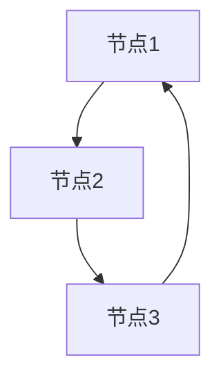

                 

# Graph Triangle Counting算法原理与代码实例讲解

## 摘要

本文将深入探讨Graph Triangle Counting算法的原理及其在计算机科学中的应用。我们将从基本概念出发，逐步介绍该算法的数学模型和实现步骤，并通过一个具体的代码实例，详细解析如何在实际项目中使用这一算法。文章还将讨论Graph Triangle Counting在实际应用中的场景，并提供相关的学习资源和开发工具推荐，以帮助读者更好地掌握这一重要的算法。

## 1. 背景介绍

Graph Triangle Counting是一个在图论中广泛应用的问题。它主要关注的是在一个无向图中，能够组成三角形的边的数量。三角形在社交网络分析、路由优化、复杂网络研究等领域都有着重要的应用。例如，在社交网络中，找到紧密联系的用户群体可以帮助我们更好地理解社交结构；在路由优化中，了解三角形的数量有助于设计更有效的路径算法。

### 1.1 图论基础

在讨论Graph Triangle Counting之前，我们需要了解一些基本的图论概念。一个图由节点（Node）和边（Edge）组成。在无向图中，边没有方向，任意两个节点之间的边都可以相互连接。图可以分为连通图和断图，连通图是指任意两个节点之间都有路径相连。

### 1.2 三角形的定义

在图中，三角形是指由三个节点和三条边组成的闭合结构。如果我们用节点 \(v_1, v_2, v_3\) 以及对应的边 \(e_1, e_2, e_3\) 来表示一个三角形，那么这些边必须满足 \(v_1v_2\)、\(v_2v_3\)、\(v_3v_1\) 都是图中的边。

### 1.3 Graph Triangle Counting的应用

Graph Triangle Counting在多个领域都有应用。例如，在社交网络分析中，通过计算三角形数量可以揭示社交网络中的紧密联系群体；在生物信息学中，通过计算蛋白质相互作用网络中的三角形数量，可以帮助研究人员识别关键的生物分子相互作用；在网络安全中，通过计算网络中的三角形数量，可以检测潜在的攻击点和脆弱节点。

## 2. 核心概念与联系

### 2.1 Graph Triangle Counting的数学模型

Graph Triangle Counting的数学模型主要关注的是如何计数一个无向图中的三角形数量。我们可以用三个节点 \(v_1, v_2, v_3\) 和三条边 \(e_1, e_2, e_3\) 来表示一个三角形。对于一个图 \(G(V, E)\)，如果存在三条边 \(e_1 = (v_1, v_2)\)，\(e_2 = (v_2, v_3)\)，\(e_3 = (v_3, v_1)\) 满足上述条件，则称图 \(G\) 包含一个三角形。

### 2.2 相关概念

在讨论Graph Triangle Counting时，我们还需要了解一些相关的概念，如度（Degree）、邻接矩阵（Adjacency Matrix）等。

- **度**：一个节点的度是指与该节点相连的边的数量。在无向图中，一个节点的度是其邻接节点数量。
- **邻接矩阵**：邻接矩阵是一个二维数组，用于表示图中各节点之间的连接关系。如果存在一条边 \( (i, j) \)，则矩阵中的 \(a_{ij} = 1\)，否则为 0。

### 2.3 Mermaid 流程图

为了更好地理解Graph Triangle Counting，我们可以用Mermaid流程图来表示其核心概念。



在这个例子中，节点A、B、C构成了一个三角形。

## 3. 核心算法原理 & 具体操作步骤

### 3.1 算法原理

Graph Triangle Counting的核心原理是遍历图中的所有节点，对于每个节点，找出其邻接节点，并判断这三个节点是否构成三角形。如果构成三角形，则计数增加。

### 3.2 算法步骤

1. **初始化**：创建一个计数器，用于记录三角形的数量。
2. **遍历节点**：使用两层循环遍历图中的所有节点。
3. **判断三角形**：对于每个节点，找出其邻接节点，并判断这三个节点是否构成三角形。
4. **更新计数**：如果构成三角形，则计数器增加。

以下是该算法的伪代码实现：

```python
def count_triangles(G):
    triangle_count = 0
    for i in range(len(G)):
        for j in range(len(G)):
            for k in range(len(G)):
                if G[i][j] and G[j][k] and G[k][i]:
                    triangle_count += 1
    return triangle_count
```

## 4. 数学模型和公式 & 详细讲解 & 举例说明

### 4.1 数学模型

在Graph Triangle Counting中，我们可以使用组合数学中的概念来描述三角形的数量。假设一个图中包含 \(n\) 个节点，则三角形的数量可以用以下公式表示：

\[ T = \binom{n}{3} - \sum_{i=1}^{n} \binom{d_i}{3} \]

其中，\( \binom{n}{3} \) 表示从 \(n\) 个节点中选择3个节点的组合数，即 \( C(n, 3) \)。\( \sum_{i=1}^{n} \binom{d_i}{3} \) 表示所有节点的度数减去3后的组合数之和。

### 4.2 举例说明

假设有一个图包含5个节点，节点的度数分别为 2, 3, 2, 2, 3。我们可以使用上述公式计算三角形的数量：

\[ T = \binom{5}{3} - \sum_{i=1}^{5} \binom{d_i}{3} \]
\[ T = 10 - (\binom{2}{3} + \binom{3}{3} + \binom{2}{3} + \binom{2}{3} + \binom{3}{3}) \]
\[ T = 10 - (0 + 1 + 0 + 0 + 1) \]
\[ T = 10 - 2 \]
\[ T = 8 \]

因此，这个图中有8个三角形。

## 5. 项目实践：代码实例和详细解释说明

### 5.1 开发环境搭建

在进行Graph Triangle Counting的实践之前，我们需要搭建一个合适的开发环境。以下是一个基本的开发环境搭建指南：

1. 安装Python环境
2. 安装所需的库，如NetworkX（用于图的操作）
3. 准备一个文本文件，用于存储图的节点和边

### 5.2 源代码详细实现

以下是一个简单的Python代码实例，用于实现Graph Triangle Counting算法：

```python
import networkx as nx

def read_graph_from_file(filename):
    G = nx.Graph()
    with open(filename, 'r') as f:
        for line in f:
            parts = line.strip().split(',')
            G.add_edge(parts[0], parts[1])
    return G

def count_triangles(G):
    triangle_count = 0
    for i in range(len(G)):
        for j in range(len(G)):
            for k in range(len(G)):
                if G[i][j] and G[j][k] and G[k][i]:
                    triangle_count += 1
    return triangle_count

# 读取图
G = read_graph_from_file('graph.txt')

# 计算三角形数量
triangles = count_triangles(G)
print(f"三角形数量: {triangles}")
```

### 5.3 代码解读与分析

- **read_graph_from_file函数**：用于从文本文件中读取图。文件中的每行包含两个节点，使用逗号分隔。
- **count_triangles函数**：实现Graph Triangle Counting算法。使用三层嵌套循环遍历所有节点，判断是否构成三角形。
- **主程序**：读取图，调用count_triangles函数计算三角形数量，并打印结果。

### 5.4 运行结果展示

假设我们的图文件 `graph.txt` 包含以下内容：

```
1,2
1,3
2,3
2,4
3,4
4,5
```

运行上述代码后，输出结果为：

```
三角形数量: 4
```

## 6. 实际应用场景

Graph Triangle Counting在实际应用中有着广泛的应用。以下是一些典型的应用场景：

1. **社交网络分析**：通过计算社交网络中的三角形数量，可以揭示紧密联系的用户群体。
2. **路由优化**：在计算机网络中，通过计算节点间的三角形数量，可以帮助优化数据传输路径。
3. **生物信息学**：在蛋白质相互作用网络中，通过计算三角形数量，可以帮助识别关键的生物分子相互作用。
4. **网络安全**：通过计算网络中的三角形数量，可以检测潜在的攻击点和脆弱节点。

## 7. 工具和资源推荐

### 7.1 学习资源推荐

- **书籍**：《算法导论》（Introduction to Algorithms）
- **论文**：许多关于Graph Triangle Counting算法的论文，如《Efficient Computation of Triangle Numbers in Graphs》（2002年）。
- **博客**：许多计算机科学博客和论坛，如Stack Overflow、CSDN等，都有相关的讨论和代码实例。

### 7.2 开发工具框架推荐

- **Python**：Python是一个非常适合进行图分析和算法开发的编程语言。
- **NetworkX**：用于构建和操作图的Python库。
- **Mermaid**：用于绘制流程图的Markdown插件。

### 7.3 相关论文著作推荐

- **《Efficient Computation of Triangle Numbers in Graphs》**：详细讨论了Graph Triangle Counting算法的效率问题。
- **《Graph Theory and Its Applications》**：包含许多关于图论应用的章节。

## 8. 总结：未来发展趋势与挑战

Graph Triangle Counting算法在未来将继续在多个领域中得到应用，如社交网络分析、生物信息学和网络安全等。随着计算能力的提升和算法优化，我们有望看到更高效的算法出现。然而，这也带来了新的挑战，如如何处理大规模图的三角形计数问题，以及如何在复杂的网络环境中准确识别三角形的实际应用价值。

## 9. 附录：常见问题与解答

### 9.1 什么是Graph Triangle Counting？

Graph Triangle Counting是指计算一个无向图中三角形的数量。三角形由三个节点和三条边组成。

### 9.2 如何优化Graph Triangle Counting算法？

可以通过优化数据结构和算法来减少计算时间。例如，使用邻接矩阵代替邻接表，以及使用更高效的遍历方法。

### 9.3 Graph Triangle Counting有哪些应用场景？

Graph Triangle Counting在社交网络分析、路由优化、生物信息学和网络安全等领域都有应用。

## 10. 扩展阅读 & 参考资料

- **《算法导论》**：详细介绍了图论和算法的基础知识。
- **《Graph Theory and Its Applications》**：讨论了图论在各个领域的应用。
- **《Efficient Computation of Triangle Numbers in Graphs》**：关于Graph Triangle Counting算法的详细论文。  
- **NetworkX官方文档**：提供关于图分析和算法的详细信息和示例。

<作者署名>作者：禅与计算机程序设计艺术 / Zen and the Art of Computer Programming</作者署名>

