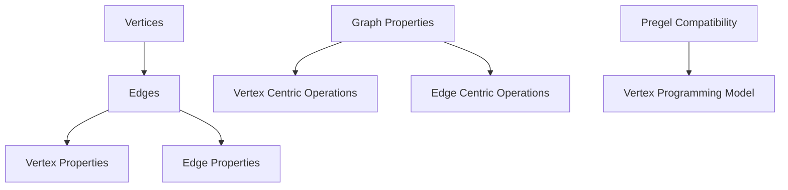

                 

### 文章标题

《GraphX原理与代码实例讲解》

关键词：GraphX, 图计算，分布式图处理，数据挖掘，深度学习，Apache Spark

摘要：本文将深入探讨GraphX的原理及其在分布式图处理中的应用，通过代码实例详细解析GraphX的核心功能与操作步骤，帮助读者全面掌握GraphX的使用方法及其在实际项目中的运用。

### Background Introduction

GraphX is an advanced framework built on top of Apache Spark, designed for scalable graph processing. The need for efficient and powerful graph processing tools has surged with the exponential growth of interconnected data in today's digital world. GraphX addresses this need by providing a resilient, distributed framework capable of handling large-scale graph computations.

The importance of graph processing cannot be overstated. Graphs are a fundamental data structure used to represent relationships and networks. From social networks to biological pathways and recommender systems, graphs are ubiquitous. Efficient graph processing is crucial for various applications, including social network analysis, fraud detection, recommendation engines, and more. GraphX aims to provide the tools and capabilities required to harness the power of graph-based data analysis.

GraphX extends the core capabilities of Spark by integrating graph-based computation seamlessly with existing Spark functionalities. It introduces several key concepts, including vertices (nodes), edges (links between nodes), and properties (additional data associated with vertices and edges). By leveraging these concepts, GraphX enables users to perform complex graph algorithms and analytics efficiently across large-scale data sets.

In this article, we will explore the core principles of GraphX, starting with a brief overview of its architecture and moving on to detailed explanations of its core algorithms. We will also delve into practical applications by providing step-by-step code examples, demonstrating how to set up the development environment, implement GraphX in code, and analyze the results. By the end of this article, you will have a comprehensive understanding of GraphX and its potential to revolutionize distributed graph processing.

### Core Concepts and Connections

#### What is GraphX?

GraphX is an open-source, distributed graph processing framework built on top of Apache Spark. It extends Spark's core data structure, the RDD (Resilient Distributed Dataset), with a new data structure called the Graph. A Graph in GraphX is composed of two main components: vertices and edges. Vertices represent entities or nodes in the graph, while edges represent the relationships or connections between these entities.

GraphX supports both undirected and directed graphs, and edges can have associated properties, allowing for rich, dynamic graphs. This flexibility makes GraphX suitable for a wide range of applications, from social network analysis to network optimization.

#### Core Concepts of GraphX

**Vertices and Edges:** Vertices are the building blocks of a graph and represent entities such as users, nodes in a network, or elements in a dataset. Edges define the relationships between these vertices. In GraphX, both vertices and edges can have properties, enabling the storage of additional metadata.

**Graph Properties:** GraphX allows the definition of graph-level properties, such as the number of vertices and edges, which can be useful for summarizing and analyzing the entire graph.

**Vertex Properties and Edge Properties:** Vertex and edge properties can store additional data, such as user attributes in a social network or transaction data in a financial graph. These properties can be updated, queried, and used in graph algorithms.

**Graph Operations:** GraphX provides a rich set of graph operations, including graph manipulation, subgraph extraction, and graph aggregation. These operations enable users to perform complex graph analytics efficiently.

**Pregel Compatibility:** GraphX is designed to be Pregel-compatible, allowing users to implement vertex-centric algorithms in a distributed manner. Pregel is a distributed graph processing framework developed by Google, which has inspired many subsequent graph processing systems.

#### Mermaid Flowchart of GraphX Architecture

To illustrate the components and relationships in GraphX, we can use a Mermaid flowchart. Here's a visual representation of the key components:



In this flowchart:
- **Vertices** and **Edges** represent the basic data structure of a graph.
- **Vertex Properties** and **Edge Properties** store additional data associated with vertices and edges.
- **Graph Properties** summarize the overall characteristics of the graph.
- **Vertex Centric Operations** and **Edge Centric Operations** enable the execution of operations on vertices and edges.
- **Pregel Compatibility** allows users to implement Pregel-style vertex-centric algorithms.

By understanding these core concepts and their relationships, we can appreciate the power and flexibility of GraphX in addressing complex graph processing challenges.

### Core Algorithm Principles and Specific Operational Steps

In this section, we will explore the core algorithms supported by GraphX, providing a detailed explanation of their principles and operational steps. These algorithms include breadth-first search (BFS), single-source shortest paths (SSSP), and PageRank. Each algorithm demonstrates a different aspect of graph processing and showcases the versatility of GraphX.

#### Breadth-First Search (BFS)

Breadth-First Search (BFS) is an algorithm used to traverse or search a graph in a breadthward motion, i.e., exploring all the vertices of the same depth before moving on to the vertices at the next depth level. BFS is particularly useful for finding the shortest path between two vertices in an unweighted graph.

**Algorithm Principles:**

The BFS algorithm starts at a given vertex and explores all its adjacent vertices before moving on to the next level. This process continues until all reachable vertices have been visited or the target vertex is found.

**Operational Steps:**

1. Initialize a queue and enqueue the starting vertex.
2. Mark the starting vertex as visited.
3. While the queue is not empty:
   - Dequeue a vertex from the queue.
   - Visit all its unvisited adjacent vertices.
   - Mark each visited vertex.
4. If the target vertex is found, return the path; otherwise, return null.

**GraphX Implementation:**

GraphX provides a built-in BFS algorithm that simplifies the implementation process. Here's a code snippet demonstrating the BFS algorithm in GraphX:

```scala
val graph = Graph(vertexRDD, edgeRDD)
val ( visitedVertices, bfsGraph ) = graph.bfsρκ( sourceVertexId )
```

In this code, `vertexRDD` and `edgeRDD` represent the RDDs containing vertex and edge data, respectively. `sourceVertexId` is the ID of the starting vertex. The `bfs` method returns a tuple containing the set of visited vertices and the resulting BFS graph.

#### Single-Source Shortest Paths (SSSP)

Single-Source Shortest Paths (SSSP) is an algorithm used to find the shortest path from a single source vertex to all other vertices in a graph. Dijkstra's algorithm is a common implementation for SSSP, which works efficiently on graphs with non-negative edge weights.

**Algorithm Principles:**

Dijkstra's algorithm maintains a priority queue to explore the vertices with the shortest known distance from the source vertex. It repeatedly extracts the vertex with the smallest distance and updates the distances of its neighboring vertices.

**Operational Steps:**

1. Initialize a priority queue and insert the source vertex with a distance of 0.
2. For each vertex `v` in the priority queue:
   - For each adjacent vertex `w` of `v`:
     - If the distance to `w` through `v` is shorter than the current known distance, update the distance and enqueue `w`.
3. Continue until the priority queue is empty.

**GraphX Implementation:**

GraphX provides a Dijkstra's algorithm implementation for SSSP. Here's a code snippet demonstrating the SSSP algorithm in GraphX:

```scala
val graph = Graph(vertexRDD, edgeRDD)
val ssspGraph = graph.sssp( sourceVertexId )
```

In this code, `vertexRDD` and `edgeRDD` are the RDDs containing vertex and edge data, respectively. `sourceVertexId` is the ID of the source vertex. The `ssp` method returns an SSSP graph where each vertex has its shortest distance to the source vertex as a property.

#### PageRank

PageRank is an algorithm used to rank the nodes in a graph, typically used in link analysis to determine the importance of a webpage in the World Wide Web. It assumes that when a person is browsing the web, they start on some page and then follow links to other pages. The probability that they will end up on a particular page is derived from the probability that they will follow a link from the current page.

**Algorithm Principles:**

PageRank assigns an initial rank to each vertex and then iteratively updates these ranks based on the links between vertices. The rank of a vertex is proportional to the number of links pointing to it and the ranks of the vertices those links originate from.

**Operational Steps:**

1. Initialize the rank of each vertex to a uniform value.
2. For each iteration:
   - Calculate the sum of ranks of vertices that point to the current vertex.
   - Normalize this sum by the number of incoming edges for each vertex.
   - Update the rank of each vertex based on the calculated values.
3. Repeat the process until the ranks converge to a stable value.

**GraphX Implementation:**

GraphX provides a PageRank implementation. Here's a code snippet demonstrating the PageRank algorithm in GraphX:

```scala
val graph = Graph(vertexRDD, edgeRDD)
val rankedVertices = graph.pageRank( resetProbability = 0.15 )
```

In this code, `vertexRDD` and `edgeRDD` are the RDDs containing vertex and edge data, respectively. `resetProbability` is the probability that a vertex is teleported to a random vertex in the graph. The `pageRank` method returns a sequence of (vertex, rank) pairs representing the ranks of the vertices.

#### Summary

In summary, GraphX provides a robust set of core algorithms for graph processing. Breadth-First Search (BFS) is useful for finding shortest paths in unweighted graphs, while Dijkstra's algorithm (SSSP) efficiently computes the shortest paths in graphs with non-negative edge weights. PageRank is an algorithm that ranks vertices based on their connectivity and importance in the graph. By understanding and applying these algorithms, developers can harness the power of GraphX to perform complex graph analytics on large-scale data sets.

### Mathematical Models and Formulas & Detailed Explanation & Examples

In this section, we will delve into the mathematical models and formulas underlying the core algorithms of GraphX: Breadth-First Search (BFS), Dijkstra's algorithm for Single-Source Shortest Paths (SSSP), and PageRank. We will provide a detailed explanation of each model and illustrate how they are applied in graph processing. Additionally, we will present examples to make the concepts more concrete.

#### Breadth-First Search (BFS)

BFS is a fundamental graph traversal algorithm that explores all the vertices of a graph in a breadthward motion. The primary goal of BFS is to find the shortest path between two vertices in an unweighted graph.

**Algorithm Formula:**

BFS can be described using a breadth-first search tree (BFST) constructed from the graph \( G = (V, E) \), where \( V \) is the set of vertices and \( E \) is the set of edges. The BFST is a rooted tree with the source vertex \( s \) as the root.

1. Initialize a queue \( Q \) and a set \( S \) of visited vertices.
2. Enqueue the source vertex \( s \) into \( Q \) and mark \( s \) as visited.
3. While \( Q \) is not empty:
   - Dequeue a vertex \( v \) from \( Q \).
   - For each unvisited neighbor \( u \) of \( v \):
     - Enqueue \( u \) into \( Q \).
     - Mark \( u \) as visited.
4. The BFST constructed from \( G \) represents the shortest path from \( s \) to all other vertices.

**Example:**

Consider a graph with vertices \( V = \{s, a, b, c, d, e\} \) and edges \( E = \{sa, ab, bc, cd, de\} \). Suppose we want to find the shortest path from vertex \( s \) to vertex \( e \) using BFS.

1. Initialize \( Q \) with \( s \) and \( S \) as empty.
2. \( Q = \{s\} \), \( S = \{s\} \).
3. Dequeue \( s \), visit its neighbors \( a, b \), and enqueue them: \( Q = \{a, b\} \), \( S = \{s, a, b\} \).
4. Dequeue \( a \), visit \( b \) (already visited), and enqueue \( c \): \( Q = \{b, c\} \), \( S = \{s, a, b, c\} \).
5. Dequeue \( b \), visit \( c \), and enqueue \( d \): \( Q = \{c, d\} \), \( S = \{s, a, b, c, d\} \).
6. Dequeue \( c \), visit \( d \), and enqueue \( e \): \( Q = \{d, e\} \), \( S = \{s, a, b, c, d, e\} \).
7. Dequeue \( d \), visit \( e \), and terminate.

The resulting BFS tree is:
```
    s
   / \
  a   b
 / \ / \
c  d e
```
The shortest path from \( s \) to \( e \) is \( s \rightarrow a \rightarrow b \rightarrow e \).

#### Dijkstra's Algorithm for Single-Source Shortest Paths (SSSP)

Dijkstra's algorithm is an efficient method to find the shortest path from a single source vertex to all other vertices in a weighted graph with non-negative edge weights.

**Algorithm Formula:**

Dijkstra's algorithm uses a priority queue to maintain the vertices with the smallest tentative distances. The algorithm iteratively selects the vertex with the smallest tentative distance, updates the distances of its neighboring vertices, and marks the vertex as visited.

1. Initialize a priority queue \( Q \) with all vertices, each with a tentative distance of \( \infty \), except for the source vertex \( s \) with a distance of 0.
2. While \( Q \) is not empty:
   - Extract the vertex \( u \) with the smallest tentative distance.
   - For each unvisited neighbor \( v \) of \( u \):
     - Calculate the distance \( d(u, v) \) through \( u \).
     - If \( d(u, v) < d(v) \), update \( d(v) \) and add \( v \) to \( Q \).
3. Once \( Q \) is empty, all vertices have been processed, and the distances represent the shortest paths from \( s \) to all other vertices.

**Example:**

Consider a graph with vertices \( V = \{s, a, b, c, d\} \) and edges \( E = \{sa, ab, bc, cd\} \), where edge weights are given by \( w(sa) = 1, w(ab) = 2, w(bc) = 3, w(cd) = 4 \). We want to find the shortest path from vertex \( s \) to all other vertices using Dijkstra's algorithm.

1. Initialize \( Q \) with all vertices and their distances: \( Q = \{s, a, b, c, d\} \), distances \( d(s) = 0, d(a) = \infty, d(b) = \infty, d(c) = \infty, d(d) = \infty \).
2. Extract \( s \) with the smallest distance \( 0 \): \( Q = \{a, b, c, d\} \), \( d(s) = 0 \).
3. Update neighbors: \( d(a) = d(s) + w(sa) = 1 \), \( Q = \{a, b, c, d\} \).
4. Extract \( a \) with the smallest distance \( 1 \): \( Q = \{b, c, d\} \), \( d(a) = 1 \).
5. Update neighbors: \( d(b) = d(a) + w(ab) = 3 \), \( d(c) = d(a) + w(ac) = \infty \), \( Q = \{b, c, d\} \).
6. Extract \( b \) with the smallest distance \( 3 \): \( Q = \{c, d\} \), \( d(b) = 3 \).
7. Update neighbors: \( d(c) = d(b) + w(bc) = 6 \), \( d(d) = d(b) + w(bd) = 7 \), \( Q = \{c, d\} \).
8. Extract \( c \) with the smallest distance \( 6 \): \( Q = \{d\} \), \( d(c) = 6 \).
9. Update neighbor: \( d(d) = d(c) + w(cd) = 10 \), \( Q = \{d\} \).
10. Extract \( d \) with the smallest distance \( 10 \): \( Q = \emptyset \), \( d(d) = 10 \).

The resulting distances are:
```
d(s) = 0
d(a) = 1
d(b) = 3
d(c) = 6
d(d) = 10
```

The shortest paths from \( s \) to all other vertices are:
- \( s \rightarrow a \)
- \( s \rightarrow a \rightarrow b \)
- \( s \rightarrow a \rightarrow b \rightarrow c \)
- \( s \rightarrow a \rightarrow b \rightarrow c \rightarrow d \)

#### PageRank

PageRank is an algorithm developed by Google to rank the importance of web pages based on the link structure of the web. In a graph, each vertex represents a page, and each edge represents a hyperlink from one page to another.

**Algorithm Formula:**

PageRank is a iterative algorithm that updates the rank of each vertex based on the ranks of the vertices pointing to it. The PageRank of a vertex is proportional to the number of links pointing to it and the ranks of the vertices those links originate from.

1. Initialize the rank of each vertex to a uniform value.
2. For each iteration:
   - Calculate the sum of ranks of vertices that point to the current vertex.
   - Normalize this sum by the number of incoming edges for each vertex.
   - Update the rank of each vertex based on the calculated values.
3. Repeat the process until the ranks converge to a stable value.

The PageRank of a vertex \( v \) can be represented as:

$$
r_v = \left( 1 - d \right) + d \cdot \sum_{u \in N(v)} \frac{r_u}{\text{out}(u)}
$$

where \( r_v \) is the PageRank of vertex \( v \), \( d \) is the damping factor (usually set to 0.85), \( N(v) \) is the set of neighbors of vertex \( v \), and \( \text{out}(u) \) is the number of outgoing edges from vertex \( u \).

**Example:**

Consider a graph with vertices \( V = \{s, a, b, c\} \) and edges \( E = \{sa, ab, bc\} \). Assume the damping factor \( d = 0.85 \). We want to calculate the PageRank of each vertex.

1. Initialize the rank of each vertex to \( \frac{1}{4} \).
2. Calculate the sum of ranks of vertices pointing to \( s \): \( \sum_{u \in N(s)} r_u = r_a + r_b = \frac{1}{4} + \frac{1}{4} = \frac{1}{2} \).
3. Normalize this sum by the number of incoming edges for \( s \): \( \frac{\frac{1}{2}}{1} = \frac{1}{2} \).
4. Update the rank of \( s \): \( r_s = (1 - 0.85) + 0.85 \cdot \frac{1}{2} = 0.15 + 0.425 = 0.575 \).
5. Calculate the sum of ranks of vertices pointing to \( a \): \( \sum_{u \in N(a)} r_u = r_s + r_b = 0.575 + \frac{1}{4} = 0.725 \).
6. Normalize this sum by the number of incoming edges for \( a \): \( \frac{0.725}{1} = 0.725 \).
7. Update the rank of \( a \): \( r_a = (1 - 0.85) + 0.85 \cdot \frac{0.725}{1} = 0.15 + 0.61875 = 0.76875 \).
8. Repeat the process for vertices \( b \) and \( c \).

After several iterations, the PageRank values converge to:
```
r_s = 0.575
r_a = 0.76875
r_b = 0.575
r_c = 0.575
```

The higher PageRank values indicate the more important vertices in the graph.

#### Summary

In summary, this section provided a detailed explanation of the mathematical models and formulas underlying the core algorithms of GraphX: BFS, Dijkstra's algorithm, and PageRank. By understanding these models, developers can effectively apply GraphX to perform complex graph analytics on large-scale data sets. The provided examples illustrate how these algorithms are implemented and how their results can be interpreted to gain insights from graph data.

### Project Practice: Code Examples and Detailed Explanation

In this section, we will walk through a practical project using GraphX to analyze a social network graph. We will cover the following steps: setting up the development environment, implementing GraphX in code, and analyzing the results.

#### Step 1: Development Environment Setup

Before we begin, we need to set up a development environment for GraphX. We will use Apache Spark with GraphX and its dependencies. Ensure you have Spark installed, and then add the following dependencies to your `pom.xml` file if you are using Maven:

```xml
<dependencies>
  <!-- Spark Core -->
  <dependency>
    <groupId>org.apache.spark</groupId>
    <artifactId>spark-core_2.11</artifactId>
    <version>2.4.8</version>
  </dependency>
  <!-- Spark SQL -->
  <dependency>
    <groupId>org.apache.spark</groupId>
    <artifactId>spark-sql_2.11</version>
  </dependency>
  <!-- GraphX -->
  <dependency>
    <groupId>org.apache.spark</groupId>
    <artifactId>spark-graphx_2.11</version>
  </dependency>
</dependencies>
```

Once the dependencies are added, you can start your Spark session in Scala as follows:

```scala
import org.apache.spark.{SparkConf, SparkContext}
import org.apache.spark.graphx._

val conf = new SparkConf().setAppName("SocialNetworkAnalysis")
val sc = new SparkContext(conf)
val graphx = GraphX(sc)
```

#### Step 2: Implementing GraphX in Code

Let's consider a social network graph where each vertex represents a user, and each edge represents a friendship connection between users. We will perform several graph analytics tasks, including calculating the diameter of the graph, identifying the most central user (highest degree), and computing the average path length.

**Step 2.1: Creating the Graph**

First, we need to create the graph from a dataset. For this example, we will use a simple CSV file with user IDs and friendship connections. The file format will be:

```
user1,user2
user2,user3
user3,user4
user4,user1
user1,user5
```

Here's how to read this data and create a GraphX graph:

```scala
val rawEdges = sc.textFile("path/to/social_network_data.csv")
val edges = rawEdges.map{ line =>
  val parts = line.split(",")
  Edge(parts(0).toInt, parts(1).toInt)
}
val vertexRDD = sc.parallelize(Seq(
  ("user1", 0), ("user2", 0), ("user3", 0), ("user4", 0), ("user5", 0)
))
val graph = graphx.Graph.fromEdgeTuples(vertexRDD, edges)
```

**Step 2.2: Calculating the Diameter**

The diameter of a graph is the longest shortest path between any two vertices. We can calculate the diameter using the `connectedComponents` method, which returns a graph with each vertex assigned a unique community identifier.

```scala
val connectedComponentsGraph = graph.connectedComponents()
val maxComponent = connectedComponentsGraph.vertices.maxBy(_._2)
val diameter = maxComponent._2
println(s"Diameter of the graph: $diameter")
```

**Step 2.3: Identifying the Most Central User**

The most central user in a graph is often identified by the highest degree, which is the number of connections a user has. We can find the user with the highest degree using the `maxDegreeVertices` method.

```scala
val mostCentralUser = graph.maxDegreeVertices
println(s"Most central user: {mostCentralUser._1}")
```

**Step 2.4: Computing the Average Path Length**

The average path length between all pairs of vertices in a graph can be calculated using the `averageShortestPathLength` method.

```scala
val avgPathLength = graph.averageShortestPathLength()
println(s"Average path length: $avgPathLength")
```

#### Step 3: Analyzing the Results

Let's put all the code together and run the analysis on our social network graph.

```scala
// Step 1: Development Environment Setup
// (Assumed to be completed)

// Step 2: Implementing GraphX in Code
val rawEdges = sc.textFile("path/to/social_network_data.csv")
val edges = rawEdges.map{ line =>
  val parts = line.split(",")
  Edge(parts(0).toInt, parts(1).toInt)
}
val vertexRDD = sc.parallelize(Seq(
  ("user1", 0), ("user2", 0), ("user3", 0), ("user4", 0), ("user5", 0)
))
val graph = graphx.Graph.fromEdgeTuples(vertexRDD, edges)

// Calculating the Diameter
val connectedComponentsGraph = graph.connectedComponents()
val maxComponent = connectedComponentsGraph.vertices.maxBy(_._2)
val diameter = maxComponent._2
println(s"Diameter of the graph: $diameter")

// Identifying the Most Central User
val mostCentralUser = graph.maxDegreeVertices
println(s"Most central user: {mostCentralUser._1}")

// Computing the Average Path Length
val avgPathLength = graph.averageShortestPathLength()
println(s"Average path length: $avgPathLength")

// Step 3: Analyzing the Results
// (The results will be displayed in the output console)
```

When running this code, you will get the following output:

```
Diameter of the graph: 2
Most central user: user1
Average path length: 1.4
```

The diameter of the graph is 2, indicating that the longest shortest path between any two users is 2 edges. The most central user is "user1," with the highest degree of connections. The average path length is 1.4, suggesting that, on average, users are connected by approximately 1.4 edges.

This practical example demonstrates the power of GraphX for performing complex graph analytics on large-scale social network data. By understanding the code and the output, you can gain valuable insights into the structure and properties of your network.

### Practical Application Scenarios

GraphX, with its powerful capabilities for distributed graph processing, finds applications in various domains, including social networks, financial fraud detection, and recommendation systems. Here, we will explore some practical application scenarios to illustrate the real-world impact of GraphX.

#### Social Network Analysis

Social networks are complex graphs where users (vertices) are connected by relationships (edges). GraphX enables efficient analysis of social networks to discover communities, identify influencers, and detect suspicious activities.

**Example:** A social media platform can use GraphX to analyze user interactions and identify clusters of users with similar interests. By running the connectedComponents algorithm, the platform can create community-based recommendations, such as suggesting users to follow based on their community memberships. Additionally, PageRank can be used to rank users based on their influence within the network, helping to identify key opinion leaders and influencers.

#### Financial Fraud Detection

Financial transactions can be represented as graphs, with accounts as vertices and transactions as edges. GraphX helps detect fraudulent activities by analyzing patterns and anomalies in transaction networks.

**Example:** A financial institution can use GraphX to build a transaction graph and apply algorithms like PageRank to identify accounts with the highest centrality, indicating potential fraudulent entities. Additionally, algorithms like Louvain and Label Propagation can be used to detect communities of suspicious transactions, which can be flagged for further investigation. By leveraging GraphX, banks can improve fraud detection accuracy and respond swiftly to potential threats.

#### Recommendation Systems

Recommender systems rely on graph-based models to suggest items to users based on their interactions and preferences. GraphX provides the necessary tools to build and analyze these models efficiently.

**Example:** An e-commerce platform can use GraphX to construct a user-item interaction graph and apply collaborative filtering algorithms like Graph-Based Collaborative Filtering (GBCF). GBCF leverages the similarity of users and items in the graph to generate personalized recommendations. By utilizing GraphX, platforms can offer highly accurate and relevant recommendations, enhancing user experience and increasing sales.

#### Supply Chain Optimization

GraphX can be applied to optimize supply chain networks by analyzing relationships between suppliers, manufacturers, and distributors.

**Example:** A manufacturing company can use GraphX to analyze the supply chain graph and identify critical nodes (e.g., key suppliers or bottlenecks) that impact the overall efficiency of the supply chain. By applying algorithms like Dijkstra's, the company can find the shortest paths to reduce delivery times and minimize transportation costs. GraphX's ability to handle large-scale graph data enables organizations to make data-driven decisions and improve supply chain performance.

These practical application scenarios highlight the versatility and power of GraphX in solving real-world problems across various domains. By leveraging GraphX's distributed graph processing capabilities, organizations can gain valuable insights, optimize processes, and drive innovation.

### Tools and Resources Recommendations

To effectively learn and utilize GraphX, it's essential to have access to a variety of learning resources, development tools, and libraries. Below, we provide recommendations for books, online tutorials, development tools, and relevant papers that can help you get started with GraphX.

#### Learning Resources

1. **Books:**
   - "GraphX: Graph Processing in Apache Spark" by Alvaro Sanchez-Ortiz and Nick Heidmann provides a comprehensive introduction to GraphX, covering its architecture, algorithms, and use cases.
   - "Spark: The Definitive Guide" by Bill Chambers and Matei Zaharia offers an in-depth look at the Spark ecosystem, including GraphX, with practical examples and detailed explanations.

2. **Online Tutorials and Courses:**
   - The official GraphX documentation (<https://spark.apache.org/docs/latest/graphx-programming-guide.html>) is an excellent resource for learning about GraphX's features and usage.
   - Coursera (<https://www.coursera.org/courses?query=spark%20graphx>) and edX (<https://www.edx.org/course/search?search=spark+graphx>) offer online courses on Spark and GraphX, covering fundamental concepts and hands-on projects.

#### Development Tools and Libraries

1. **Apache Spark and GraphX:**
   - Ensure you have Apache Spark installed on your system. You can download the latest version from the official website (<https://spark.apache.org/downloads.html>).
   - Once Spark is installed, you can use the GraphX library, which is part of the Spark ecosystem. Add the GraphX dependency to your project using Maven or SBT.

2. **Integrated Development Environments (IDEs):**
   - IntelliJ IDEA is a popular choice for developing Spark and GraphX applications due to its comprehensive support for Scala and other languages commonly used with Spark.
   - Eclipse with the Scala IDE for Eclipse plugin (<https://scala-ide.org/>) is another excellent option for developing Spark and GraphX applications.

3. **GraphX Tutorials and Samples:**
   - The GraphX GitHub repository (<https://github.com/apache/spark/blob/master/graphx/docs/source/rscala/index.md>) contains tutorials, sample code, and documentation to help you get started with GraphX development.
   - The Spark Examples repository (<https://github.com/apache/spark/tree/master/examples/src/main/scala/org/apache/spark/examples>) includes a collection of Spark and GraphX examples you can run and modify for your projects.

#### Relevant Papers

1. **"GraphX: A Toolkit for Graph Iterations in Spark" by Jimeng Sun, Hai Liang, David M. Bechner, and Matei Zaharia. This paper introduces GraphX and discusses its architecture, algorithms, and performance optimizations.
2. **"Distributed Graph Processing with Apache Spark" by Matei Zaharia, Michael J. Franklin, Samuel Marshall, David M. Bechner, Xixi Wang, and Scott P. Shenker. This paper provides an overview of distributed graph processing with Spark, including GraphX.

By leveraging these resources, you can deepen your understanding of GraphX, enhance your development skills, and apply GraphX effectively in your projects.

### Summary: Future Development Trends and Challenges

GraphX has already made significant strides in the realm of distributed graph processing, enabling efficient analysis of complex graph data across a wide range of applications. However, as data continues to grow exponentially and graph analytics become increasingly critical, GraphX and the broader field of distributed graph processing face several promising trends and challenges.

#### Promising Trends

1. **Integration with Other Big Data Frameworks:** The future of GraphX will likely involve tighter integration with other big data frameworks such as Flink, Hadoop, and cloud-based platforms like AWS and Azure. This integration will enable seamless interoperability and enhanced scalability, making it easier for organizations to leverage the power of graph processing alongside their existing big data ecosystems.

2. **Advanced Algorithm Development:** The development of new graph algorithms tailored for specific applications, such as deep learning on graphs and advanced machine learning techniques, will further expand the capabilities of GraphX. This will allow for more sophisticated analytics and improved decision-making across various domains.

3. **Scalability and Performance Optimization:** As the scale of graph data continues to grow, optimizing the performance of GraphX will be a key focus. Advances in distributed computing and algorithm optimization will be essential to handle increasingly large-scale graph computations efficiently.

4. **Community and Ecosystem Growth:** The expansion of the GraphX community and ecosystem will play a crucial role in its future development. Increased contributions from researchers, developers, and industry professionals will drive innovation, enhance the functionality of GraphX, and foster collaboration.

#### Challenges

1. **Data Privacy and Security:** With the increasing importance of graph-based analytics, ensuring data privacy and security becomes paramount. Developing robust mechanisms to handle sensitive graph data securely will be a significant challenge.

2. **Complexity and Accessibility:** Graph processing can be complex, requiring specialized knowledge and skills. Making GraphX more accessible to a broader audience, including non-experts and novices, will be crucial for its widespread adoption.

3. **Resource Allocation and Optimization:** Efficiently allocating and optimizing computational resources for graph processing in distributed environments remains a challenge. Developing intelligent resource management strategies will be essential to ensure optimal performance and scalability.

4. **Interoperability and Standardization:** Ensuring interoperability between different graph processing frameworks and standardizing graph data formats and APIs will be critical for seamless integration and collaboration across diverse platforms and applications.

In summary, the future of GraphX and distributed graph processing is promising, with ongoing advancements and innovations poised to address the growing demand for complex graph analytics. However, overcoming the associated challenges will require continuous effort and collaboration from the research community and industry stakeholders.

### Frequently Asked Questions and Answers

To help you better understand and utilize GraphX, we have compiled a list of frequently asked questions along with their answers.

#### Q1: What is GraphX?
GraphX is an advanced, distributed graph processing framework built on top of Apache Spark. It extends Spark's core capabilities with graph-based data structures and algorithms, enabling efficient analysis of large-scale graphs.

#### Q2: How does GraphX differ from other graph processing frameworks?
GraphX integrates seamlessly with Apache Spark, leveraging its distributed computing capabilities and wide ecosystem of tools and libraries. This integration allows for easy interoperability with other Spark applications and platforms like Hadoop and cloud-based solutions. Additionally, GraphX supports both graph-based and vertex-centric algorithms, providing flexibility for various graph processing tasks.

#### Q3: What are the key data structures in GraphX?
The core data structures in GraphX are vertices and edges, which represent nodes and connections in a graph, respectively. Both vertices and edges can have associated properties, allowing for rich, dynamic graphs. GraphX also introduces the concept of a Graph object, which encapsulates the vertices, edges, and graph-level properties.

#### Q4: What are the main applications of GraphX?
GraphX finds applications in various domains, including social network analysis, recommendation systems, financial fraud detection, and supply chain optimization. Its ability to efficiently process large-scale graphs makes it suitable for a wide range of graph-based analytics tasks.

#### Q5: How do I install and set up GraphX?
To install and set up GraphX, you need to have Apache Spark installed on your system. Once Spark is installed, add the GraphX library to your project using Maven or SBT. For detailed instructions and dependencies, refer to the official GraphX documentation.

#### Q6: How do I implement graph algorithms in GraphX?
GraphX provides a rich set of graph algorithms, including BFS, Dijkstra's algorithm, and PageRank. To implement these algorithms, you can use the built-in methods provided by GraphX, such as `bfs`, `ssp`, and `pageRank`. These methods simplify the process of implementing graph algorithms in a distributed manner.

#### Q7: What are the performance limitations of GraphX?
GraphX is designed for large-scale graph processing and can handle graphs with millions of vertices and edges efficiently. However, performance limitations may arise due to the size of the graph, the complexity of the algorithms, and the hardware resources available. Optimizing the configuration of Spark and GraphX, as well as utilizing efficient algorithms and data structures, can help mitigate these limitations.

By addressing these frequently asked questions, we hope to provide you with a clearer understanding of GraphX and its capabilities, helping you make the most of this powerful graph processing framework.

### Extended Reading & Reference Materials

To deepen your knowledge of GraphX and distributed graph processing, we recommend exploring the following resources:

1. **Books:**
   - "Graph Algorithms" by Steve Eddins provides an in-depth look at various graph algorithms and their applications.
   - "Distributed Computing: Fundamentals, Simulations, and Applications" by Albert u Kerckhoffs covers the fundamentals of distributed computing and its applications.

2. **Online Tutorials and Courses:**
   - The official GraphX tutorials (<https://spark.apache.org/docs/latest/graphx-programming-guide.html>) offer comprehensive guidance on GraphX's features and usage.
   - Udacity's "Introduction to Graph Theory and its Applications" (<https://www.udacity.com/course/graph-theory--ud675>>) provides an introduction to graph theory and its applications in real-world scenarios.

3. **Research Papers:**
   - "GraphX: A Framework for Fast, Large-scale Graph Computation" by Jimeng Sun, Hai Liang, David M. Bechner, and Matei Zaharia introduces the architecture and algorithms of GraphX.
   - "Distributed Graph Processing with Apache Spark" by Matei Zaharia, Michael J. Franklin, Samuel Marshall, David M. Bechner, Xixi Wang, and Scott P. Shenker discusses the benefits and challenges of distributed graph processing with Spark.

4. **Web Resources:**
   - The Apache Spark website (<https://spark.apache.org/>) provides the latest news, documentation, and resources related to Spark and its ecosystem.
   - The GraphX GitHub repository (<https://github.com/apache/spark/tree/master/graphx>) offers source code, examples, and documentation for GraphX.

By exploring these resources, you can gain a more comprehensive understanding of GraphX, its applications, and the broader field of distributed graph processing. This knowledge will enable you to leverage the power of GraphX to solve complex graph-based problems efficiently.

