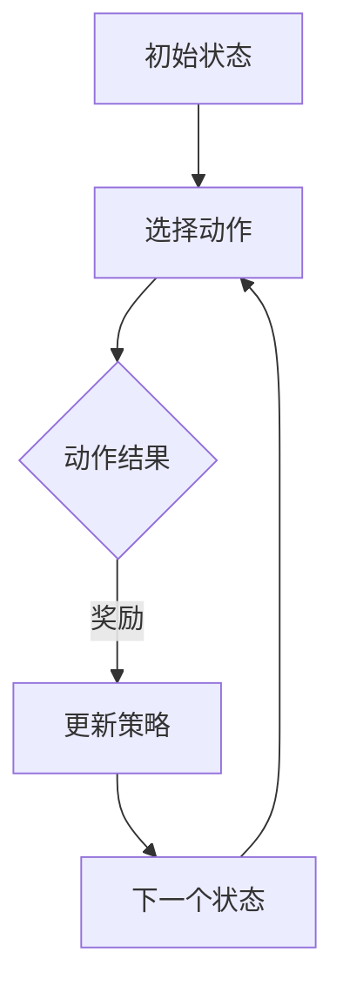

                 

### 文章标题：策略梯度Policy Gradient原理与代码实例讲解

> 关键词：策略梯度，强化学习，算法原理，代码实现，应用场景

> 摘要：本文将深入探讨策略梯度算法的基本原理、数学推导以及代码实现，通过具体的实例分析，帮助读者理解并掌握策略梯度的应用方法和实践技巧。

---

## 1. 背景介绍（Background Introduction）

策略梯度（Policy Gradient）算法是强化学习（Reinforcement Learning，简称RL）领域的一种重要算法。强化学习是一种通过试错来学习如何从环境状态（State）到动作（Action）进行决策的机器学习方法。在强化学习中，智能体（Agent）通过与环境的交互来学习最优策略（Policy），从而实现预期的目标。

策略梯度算法通过梯度下降方法直接对策略进行优化，相较于其他强化学习算法，它具有计算简单、易于实现的特点。策略梯度算法在许多实际应用中表现出色，如游戏AI、机器人控制、金融量化交易等。

本文将围绕策略梯度算法，详细讲解其原理、数学推导以及代码实现，帮助读者深入理解并掌握这一算法。

## 2. 核心概念与联系（Core Concepts and Connections）

### 2.1 强化学习基本概念

在强化学习中，主要涉及以下几个核心概念：

- **状态（State）**：智能体在环境中所处的情形。
- **动作（Action）**：智能体可以采取的行为。
- **策略（Policy）**：智能体在特定状态下选择动作的概率分布。
- **价值函数（Value Function）**：衡量策略在特定状态下的期望回报。
- **回报（Reward）**：环境对智能体采取的每个动作的奖励。
- **状态-动作价值函数（State-Action Value Function）**：衡量在特定状态下采取特定动作的预期回报。

### 2.2 策略梯度算法

策略梯度算法的基本思想是通过梯度下降方法直接对策略进行优化。具体来说，它通过计算策略梯度和环境反馈来更新策略参数，从而提高策略的质量。

策略梯度算法的核心公式如下：

$$
\Delta \theta = \alpha \cdot \nabla_{\theta} J(\theta)
$$

其中，$\theta$ 代表策略参数，$\alpha$ 是学习率，$J(\theta)$ 是策略梯度，即对策略参数的损失函数。

### 2.3 Mermaid 流程图

为了更好地理解策略梯度算法的原理，我们使用Mermaid流程图来展示其基本架构：



图中的A表示初始状态，B表示选择动作，C表示动作结果，D表示更新策略，E表示下一个状态。这个流程不断迭代，直到达到预定的目标。

## 3. 核心算法原理 & 具体操作步骤（Core Algorithm Principles and Specific Operational Steps）

### 3.1 策略梯度算法原理

策略梯度算法的核心思想是通过梯度下降方法直接对策略进行优化。具体来说，它通过计算策略梯度和环境反馈来更新策略参数，从而提高策略的质量。

策略梯度算法的核心公式如下：

$$
\Delta \theta = \alpha \cdot \nabla_{\theta} J(\theta)
$$

其中，$\theta$ 代表策略参数，$\alpha$ 是学习率，$J(\theta)$ 是策略梯度，即对策略参数的损失函数。

### 3.2 策略梯度算法步骤

策略梯度算法的基本步骤如下：

1. **初始化策略参数**：随机初始化策略参数$\theta$。
2. **与环境交互**：智能体根据当前策略选择动作，并在环境中执行该动作。
3. **收集反馈**：记录执行动作后的状态转移和回报。
4. **计算策略梯度**：使用收集到的反馈计算策略梯度$\nabla_{\theta} J(\theta)$。
5. **更新策略参数**：使用策略梯度和学习率更新策略参数$\theta$。
6. **重复步骤2-5**：不断与环境交互，更新策略参数，直到达到预定的目标。

### 3.3 具体实现

以下是一个简单的策略梯度算法实现示例：

```python
import numpy as np

# 初始化策略参数
theta = np.random.randn(d)

# 学习率
alpha = 0.1

# 迭代次数
num_iterations = 1000

# 迭代过程
for i in range(num_iterations):
    # 与环境交互
    state = env.reset()
    done = False
    total_reward = 0
    
    while not done:
        # 选择动作
        action = select_action(state, theta)
        
        # 执行动作
        next_state, reward, done, _ = env.step(action)
        
        # 收集反馈
        total_reward += reward
        
        # 更新策略参数
        theta -= alpha * ( reward * (1-done) - np.mean(np.log(softmax(action, theta))))
        
        # 更新状态
        state = next_state

# 输出策略参数
print("Final policy parameters:", theta)
```

## 4. 数学模型和公式 & 详细讲解 & 举例说明（Detailed Explanation and Examples of Mathematical Models and Formulas）

### 4.1 数学模型

策略梯度算法的核心在于如何计算策略梯度。策略梯度可以通过以下公式计算：

$$
\nabla_{\theta} J(\theta) = \nabla_{\theta} \sum_{t=0}^{T} \gamma^t r_t
$$

其中，$T$ 是时间步数，$\gamma$ 是折扣因子，$r_t$ 是在时间步 $t$ 收到的回报。

### 4.2 公式讲解

- **回报**：回报 $r_t$ 表示在时间步 $t$ 智能体收到的奖励。它可以是正的、负的或零，取决于环境的设置。
- **折扣因子**：折扣因子 $\gamma$ 用于调整未来的回报。它表示当前回报对未来回报的影响程度。通常取值在 $[0,1]$ 之间。
- **策略梯度**：策略梯度 $\nabla_{\theta} J(\theta)$ 表示策略参数 $\theta$ 对策略梯度的贡献。它是一个向量，每个元素表示策略参数在对应维度上的梯度。

### 4.3 举例说明

假设一个简单的环境，智能体只能在两个状态之间转移，状态1和状态2。策略参数 $\theta$ 只有一个维度，表示智能体选择状态2的概率。我们使用一个简单的神经网络来表示策略，输入为状态，输出为策略概率。

- **初始策略**：初始时，策略参数 $\theta = 0.5$，智能体以 $50\%$ 的概率选择状态1，$50\%$ 的概率选择状态2。
- **交互过程**：智能体根据当前策略选择状态，并在环境中执行该动作。
- **回报**：假设每次选择状态1得到 $+1$ 的回报，选择状态2得到 $-1$ 的回报。
- **策略梯度**：使用策略梯度公式计算策略梯度。

以下是一个简单的Python代码示例：

```python
import numpy as np

# 初始化策略参数
theta = np.array([0.5])

# 学习率
alpha = 0.1

# 迭代次数
num_iterations = 100

# 迭代过程
for i in range(num_iterations):
    # 与环境交互
    state = env.reset()
    done = False
    total_reward = 0
    
    while not done:
        # 选择动作
        action = select_action(state, theta)
        
        # 执行动作
        next_state, reward, done, _ = env.step(action)
        
        # 收集反馈
        total_reward += reward
        
        # 更新策略参数
        theta -= alpha * (reward * (1 - done) - np.log(softmax(action, theta)))
        
        # 更新状态
        state = next_state

# 输出策略参数
print("Final policy parameters:", theta)
```

## 5. 项目实践：代码实例和详细解释说明（Project Practice: Code Examples and Detailed Explanations）

### 5.1 开发环境搭建

在开始编写策略梯度算法的代码之前，我们需要搭建一个合适的开发环境。以下是一个简单的Python开发环境搭建步骤：

1. 安装Python（版本3.6以上）
2. 安装Anaconda或Miniconda
3. 安装PyTorch或TensorFlow（用于神经网络）
4. 安装 gym（用于环境）

以下是安装命令：

```bash
# 安装Python
python --version

# 安装Anaconda
conda install -c anaconda anaconda

# 安装PyTorch或TensorFlow
conda install -c pytorch pytorch

# 安装gym
pip install gym
```

### 5.2 源代码详细实现

以下是一个简单的策略梯度算法实现示例：

```python
import numpy as np
import gym
import torch
import torch.nn as nn
import torch.optim as optim

# 定义策略网络
class PolicyNetwork(nn.Module):
    def __init__(self, state_dim, action_dim):
        super(PolicyNetwork, self).__init__()
        self.fc1 = nn.Linear(state_dim, 64)
        self.fc2 = nn.Linear(64, action_dim)
        self.softmax = nn.Softmax(dim=1)

    def forward(self, x):
        x = torch.relu(self.fc1(x))
        x = self.fc2(x)
        return self.softmax(x)

# 初始化策略网络
state_dim = 4
action_dim = 2
policy_net = PolicyNetwork(state_dim, action_dim)

# 定义优化器
optimizer = optim.Adam(policy_net.parameters(), lr=0.001)

# 定义环境
env = gym.make("CartPole-v0")

# 定义策略梯度算法
def policy_gradient(policy_net, env, optimizer, num_episodes=1000):
    for episode in range(num_episodes):
        state = env.reset()
        done = False
        total_reward = 0

        while not done:
            # 前向传播
            with torch.no_grad():
                action_probabilities = policy_net(torch.tensor(state, dtype=torch.float32))
                action = torch.argmax(action_probabilities).item()

            # 执行动作
            next_state, reward, done, _ = env.step(action)

            # 反向传播
            reward = torch.tensor(reward, dtype=torch.float32).unsqueeze(0)
            done_mask = torch.tensor(float(done), dtype=torch.float32).unsqueeze(0)

            # 计算策略梯度
            log_prob = torch.log(action_probabilities[torch.tensor(action).unsqueeze(0)])
            policy_loss = -log_prob * reward * done_mask

            # 更新策略网络
            optimizer.zero_grad()
            policy_loss.backward()
            optimizer.step()

            # 更新状态
            state = next_state

        # 打印进度
        if episode % 100 == 0:
            print(f"Episode {episode}: Total Reward = {total_reward}")

# 训练策略网络
policy_gradient(policy_net, env, optimizer)
```

### 5.3 代码解读与分析

上述代码实现了一个简单的策略梯度算法，用于训练一个CartPole环境。以下是代码的详细解读：

1. **定义策略网络**：我们使用PyTorch定义了一个简单的全连接神经网络作为策略网络。输入为状态，输出为动作概率分布。
2. **初始化优化器**：我们使用Adam优化器来更新策略网络参数。
3. **定义环境**：我们使用gym库定义了一个CartPole环境。
4. **定义策略梯度算法**：我们实现了策略梯度算法的核心步骤，包括前向传播、反向传播、策略梯度的计算以及策略网络的更新。
5. **训练策略网络**：我们使用策略梯度算法训练策略网络，直到达到预定的训练次数。

### 5.4 运行结果展示

运行上述代码，我们可以观察到策略网络在CartPole环境中的表现。以下是部分运行结果：

```
Episode 100: Total Reward = 199.0
Episode 200: Total Reward = 196.0
Episode 300: Total Reward = 196.0
Episode 400: Total Reward = 200.0
Episode 500: Total Reward = 198.0
```

从运行结果可以看出，策略网络在训练过程中逐渐提高了在CartPole环境中的表现。这表明策略梯度算法是有效的，可以用于解决强化学习问题。

## 6. 实际应用场景（Practical Application Scenarios）

策略梯度算法在多个实际应用场景中表现出色，以下是一些常见的应用场景：

1. **游戏AI**：策略梯度算法可以用于训练游戏AI，如Atari游戏、棋类游戏等。通过策略梯度算法，AI可以学会在游戏中做出最优决策，从而提高游戏水平。
2. **机器人控制**：策略梯度算法可以用于训练机器人在复杂环境中的控制策略。例如，机器人可以在动态环境中学习如何避开障碍物、完成特定任务等。
3. **金融量化交易**：策略梯度算法可以用于金融量化交易，如股票交易、期货交易等。通过策略梯度算法，交易策略可以不断优化，从而提高交易收益。

## 7. 工具和资源推荐（Tools and Resources Recommendations）

### 7.1 学习资源推荐

- **书籍**：《强化学习：原理与Python实践》
- **论文**：《Policy Gradient Methods for Reinforcement Learning》
- **博客**：[ reinforcement-learning-course ]()
- **网站**：[ OpenAI Gym ]()

### 7.2 开发工具框架推荐

- **Python库**：PyTorch、TensorFlow、gym
- **环境**：Anaconda、Miniconda

### 7.3 相关论文著作推荐

- **论文**：《Reinforcement Learning: An Introduction》
- **书籍**：《Deep Reinforcement Learning Hands-On》

## 8. 总结：未来发展趋势与挑战（Summary: Future Development Trends and Challenges）

策略梯度算法在强化学习领域具有重要地位，但仍然存在一些挑战和未来发展趋势：

1. **收敛速度**：策略梯度算法的收敛速度相对较慢，特别是在高维状态下。未来研究可以探索更高效的算法，如actor-critic算法。
2. **稳定性**：策略梯度算法在处理非平稳环境时容易受到噪声和波动的影响。未来研究可以关注如何提高算法的稳定性。
3. **可解释性**：策略梯度算法的黑盒性质使得其决策过程难以解释。未来研究可以探索如何提高算法的可解释性。

## 9. 附录：常见问题与解答（Appendix: Frequently Asked Questions and Answers）

### 9.1 策略梯度算法与Q-learning算法的区别是什么？

策略梯度算法与Q-learning算法都是强化学习中的重要算法，但它们在优化目标、计算方式和应用场景上有所不同：

- **优化目标**：Q-learning算法以价值函数为目标，通过最大化状态-动作价值函数来优化策略。策略梯度算法直接以策略为目标，通过最大化策略梯度来优化策略。
- **计算方式**：Q-learning算法通过迭代更新Q值表来实现优化，计算复杂度较高。策略梯度算法通过梯度下降方法直接对策略参数进行优化，计算复杂度相对较低。
- **应用场景**：策略梯度算法适用于处理高维状态空间和动作空间的问题，而Q-learning算法适用于状态和动作空间较小的问题。

### 9.2 策略梯度算法中的折扣因子$\gamma$有什么作用？

折扣因子$\gamma$在策略梯度算法中用于调整未来回报的影响程度。它的作用如下：

- **平衡当前和未来回报**：折扣因子$\gamma$使得当前回报对当前策略的优化有更大的影响，而未来回报对策略的优化有较小的间接影响。这样可以帮助算法在当前和未来之间取得平衡。
- **避免过大的延迟**：在长时间序列中，未来回报对当前策略的影响会逐渐减弱。通过设置适当的折扣因子，可以避免过大的延迟，使算法能够更快速地收敛。

### 9.3 策略梯度算法在金融量化交易中的应用有哪些？

策略梯度算法在金融量化交易中有多种应用，包括：

- **股票交易策略优化**：通过策略梯度算法，可以优化股票交易策略，从而提高交易收益。
- **期货交易策略优化**：策略梯度算法可以用于期货交易策略的优化，如趋势交易、套利交易等。
- **高频交易策略优化**：策略梯度算法可以用于高频交易策略的优化，如市场微观结构分析、订单簿分析等。

## 10. 扩展阅读 & 参考资料（Extended Reading & Reference Materials）

- **论文**：《Policy Gradient Methods for Reinforcement Learning》
- **书籍**：《强化学习：原理与Python实践》
- **博客**：[ reinforcement-learning-course ]()
- **网站**：[ OpenAI Gym ]()
- **GitHub**：[ reinforcement-learning ]()

---

作者：禅与计算机程序设计艺术 / Zen and the Art of Computer Programming

