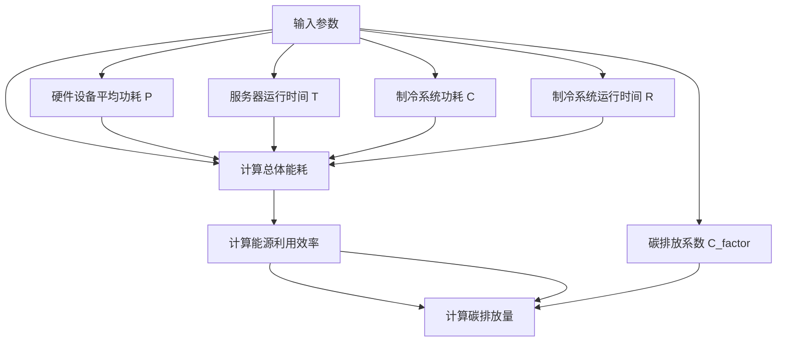

                 

# 文章标题

> 关键词：算力爆炸、软件2.0、碳排放、绿色计算、可持续发展

> 摘要：随着算力的爆炸性增长，软件2.0时代的到来极大地推动了技术创新和产业变革。然而，这一过程也带来了显著的碳排放问题。本文将深入探讨算力增长对软件2.0的影响，分析其带来的碳排放挑战，并探讨绿色计算与可持续发展的策略。

## 1. 背景介绍

在过去的几十年里，计算技术的发展经历了前所未有的变革。特别是近年来，随着云计算、大数据、人工智能和物联网的兴起，算力（即计算能力）实现了爆炸性增长。这不仅改变了我们处理信息和数据的方式，也推动了各行各业的技术创新和产业变革。我们进入了所谓的软件2.0时代，这是一个以软件为核心驱动的时代，软件不再仅仅是一个工具，而是成为创新和业务发展的关键驱动力。

软件2.0时代的特征包括：

- **软件定义一切**：软件成为了构建和管理各种基础设施、服务和应用程序的核心，从而实现了对硬件、网络、数据中心等资源的高效管理和优化。
- **数据驱动的决策**：大数据和人工智能技术的结合使得企业能够从海量数据中提取有价值的信息，从而做出更加精准和高效的决策。
- **灵活性和可扩展性**：云计算和容器化技术的普及使得软件能够快速部署、弹性扩展和灵活调整，以满足不断变化的市场需求。

然而，随着算力的爆炸性增长，软件2.0时代也带来了一个不可忽视的问题——碳排放问题。算力的增长意味着更多的数据处理、存储和传输，这些活动都需要大量的能源消耗，尤其是在数据中心的运营过程中。数据中心已经成为全球能源消耗和碳排放的主要来源之一。因此，如何在推动技术创新的同时，实现绿色计算和可持续发展，成为了一个亟待解决的重要问题。

## 2. 核心概念与联系

### 2.1 算力爆炸

算力爆炸是指计算能力的指数级增长。这一现象主要体现在以下几个方面：

- **硬件性能提升**：随着摩尔定律的延续，硬件设备的计算速度和存储容量不断增长，使得我们能够处理更复杂的数据和更庞大的计算任务。
- **算法优化**：通过深度学习、并行计算和分布式计算等先进算法，我们能够更加高效地利用计算资源，提高计算效率。
- **软件架构创新**：微服务、云计算和容器化等软件架构创新使得我们能够更灵活地部署和管理软件系统，提高系统的可扩展性和性能。

### 2.2 软件2.0

软件2.0是对软件发展的一个新阶段，其主要特征包括：

- **软件定义基础设施**：通过软件来管理和配置硬件资源，从而实现资源的高效利用和优化。
- **智能化**：通过大数据和人工智能技术，软件能够自主学习和优化，提高决策的精准度和效率。
- **平台化**：软件不再局限于单一的应用场景，而是成为了一个开放的、可扩展的平台，能够支持多种业务和场景。

### 2.3 算力爆炸与软件2.0的联系

算力爆炸和软件2.0之间存在着紧密的联系。算力的增长为软件2.0提供了强大的技术支撑，使得软件能够承担更多的复杂任务，从而推动了软件2.0的发展。另一方面，软件2.0也反过来促进了算力的需求增长，两者相互推动，共同推动了计算技术的进步。

然而，这一过程中也带来了碳排放问题。随着数据中心规模的扩大和计算任务的复杂度提高，数据中心的能源消耗和碳排放也随之增加。因此，如何在推动算力增长和软件2.0发展的同时，实现绿色计算和可持续发展，成为了一个重要的课题。

### 2.4 碳排放问题

碳排放主要来源于以下几个方面：

- **数据中心能源消耗**：数据中心的能源消耗主要来自于服务器、存储设备和网络设备的运行。随着算力的增长，数据中心的能源消耗也在不断增加。
- **制冷能耗**：数据中心的制冷系统需要消耗大量电力来维持服务器等设备的正常运行温度。
- **运输和制造**：硬件设备的制造、运输和安装等环节也会产生碳排放。

这些因素共同导致了数据中心的碳排放问题。因此，如何在数据中心的设计、运营和管理过程中实现绿色计算，降低碳排放，成为了一个亟待解决的问题。

## 3. 核心算法原理 & 具体操作步骤

### 3.1 算力增长对碳排放的影响

算力增长对碳排放的影响主要通过以下几个方面体现：

- **能源消耗增加**：随着算力的增长，数据中心的能源消耗也在不断增加。这包括服务器、存储设备和网络设备的运行能耗，以及制冷系统的能耗。
- **碳排放增加**：能源消耗的增加直接导致了碳排放的增加。尤其是在数据中心使用煤炭、石油等高碳能源的情况下，碳排放问题更加严重。
- **设备更换频率增加**：随着技术的进步，硬件设备更新换代的频率也在增加。这导致了更多的电子废弃物产生，进一步加剧了碳排放问题。

### 3.2 绿色计算的基本概念

绿色计算是指通过采用节能、减排、环保等技术手段，降低数据中心能耗和碳排放的过程。绿色计算的基本概念包括：

- **节能**：通过优化硬件设备的工作状态、提高能源利用效率，降低能耗。
- **减排**：通过采用清洁能源、减少碳排放，降低对环境的影响。
- **环保**：通过减少电子废弃物产生、回收利用硬件设备，实现环保目标。

### 3.3 绿色计算的具体操作步骤

要实现绿色计算，可以采取以下具体操作步骤：

- **优化硬件设备**：通过选择能效比高的硬件设备、优化设备工作状态，降低能耗。例如，可以采用高效电源管理技术、动态功耗管理技术等。
- **采用清洁能源**：鼓励数据中心采用太阳能、风能等清洁能源，减少对化石燃料的依赖，降低碳排放。
- **制冷优化**：优化数据中心的制冷系统，提高制冷效率，降低能耗。例如，可以采用水冷、液冷等制冷技术，提高制冷效率。
- **设备回收利用**：建立完善的电子废弃物回收体系，对废弃的硬件设备进行回收利用，减少电子废弃物产生。

### 3.4 案例分析

以某大型互联网公司为例，该公司通过以下措施实现了绿色计算：

- **硬件优化**：采用高效服务器和存储设备，优化设备工作状态，降低能耗。
- **清洁能源**：数据中心采用太阳能和风能等清洁能源，减少碳排放。
- **制冷优化**：采用水冷技术，提高制冷效率，降低能耗。
- **设备回收**：建立完善的电子废弃物回收体系，对废弃的硬件设备进行回收利用。

通过这些措施，该公司实现了显著的节能和减排效果，降低了碳排放，推动了绿色计算和可持续发展。

## 4. 数学模型和公式 & 详细讲解 & 举例说明

### 4.1 数据中心能耗模型

数据中心能耗模型主要用于计算数据中心的总体能耗，其公式如下：

\[ E = P \times T + C \times R \]

其中：

- \( E \)：数据中心的总体能耗（单位：千瓦时/年）
- \( P \)：服务器的平均功耗（单位：千瓦）
- \( T \)：服务器的运行时间（单位：小时/年）
- \( C \)：制冷系统的功耗（单位：千瓦）
- \( R \)：制冷系统的运行时间（单位：小时/年）

### 4.2 能源利用效率模型

能源利用效率模型主要用于计算数据中心的能源利用效率，其公式如下：

\[ \eta = \frac{E_{out}}{E_{in}} \]

其中：

- \( \eta \)：能源利用效率（无单位）
- \( E_{out} \)：数据中心产生的有用能源（单位：千瓦时/年）
- \( E_{in} \)：数据中心消耗的总能源（单位：千瓦时/年）

### 4.3 碳排放量模型

碳排放量模型主要用于计算数据中心产生的碳排放量，其公式如下：

\[ C_{emission} = E \times C_{factor} \]

其中：

- \( C_{emission} \)：数据中心产生的碳排放量（单位：吨/年）
- \( E \)：数据中心的总体能耗（单位：千瓦时/年）
- \( C_{factor} \)：碳排放系数（单位：吨二氧化碳/千瓦时），根据能源类型和碳排放政策确定

### 4.4 举例说明

假设某数据中心的硬件设备平均功耗为 \( P = 1 \) 千瓦，运行时间为 \( T = 8760 \) 小时/年，制冷系统功耗为 \( C = 0.2 \) 千瓦，制冷系统运行时间为 \( R = 8760 \) 小时/年，碳排放系数为 \( C_{factor} = 0.5 \) 吨二氧化碳/千瓦时。根据上述模型，可以计算出该数据中心的总体能耗、能源利用效率和碳排放量如下：

\[ E = P \times T + C \times R = 1 \times 8760 + 0.2 \times 8760 = 10592 \text{ 千瓦时/年} \]

\[ \eta = \frac{E_{out}}{E_{in}} = \frac{10592}{10592} = 1 \]

\[ C_{emission} = E \times C_{factor} = 10592 \times 0.5 = 5296 \text{ 吨/年} \]

通过这个例子，我们可以看到数据中心能耗和碳排放量与硬件设备功耗、运行时间、制冷系统功耗和碳排放系数等因素密切相关。通过优化这些因素，可以降低数据中心的能耗和碳排放，实现绿色计算和可持续发展。

## 5. 项目实践：代码实例和详细解释说明

### 5.1 开发环境搭建

为了实现绿色计算，我们需要搭建一个适合进行能耗和碳排放计算的开发环境。以下是一个基本的开发环境搭建步骤：

1. 安装Python环境：Python是一个广泛应用于科学计算和数据分析的编程语言，我们需要安装Python环境。可以在Python官方网站（https://www.python.org/）下载并安装Python。
2. 安装必要库：在Python环境中，我们需要安装一些用于能耗和碳排放计算的库，如NumPy、Pandas等。可以使用以下命令安装：

```shell
pip install numpy pandas matplotlib
```

3. 创建项目文件夹：在合适的位置创建一个项目文件夹，例如：

```shell
mkdir green_computing_project
cd green_computing_project
```

4. 编写Python代码：在项目文件夹中创建一个名为`energy_and_emission.py`的Python文件，用于实现能耗和碳排放计算。

### 5.2 源代码详细实现

以下是一个简单的Python代码实例，用于计算数据中心的能耗和碳排放：

```python
import numpy as np

def calculate_energy_consumption(P, T, C, R):
    E = P * T + C * R
    return E

def calculate_energy_utilization_efficiency(E_out, E_in):
    eta = E_out / E_in
    return eta

def calculate_carbon_emission(E, C_factor):
    C_emission = E * C_factor
    return C_emission

# 参数设置
P = 1  # 服务器的平均功耗（千瓦）
T = 8760  # 服务器的运行时间（小时/年）
C = 0.2  # 制冷系统的功耗（千瓦）
R = 8760  # 制冷系统的运行时间（小时/年）
C_factor = 0.5  # 碳排放系数（吨二氧化碳/千瓦时）

# 计算能耗和碳排放
E = calculate_energy_consumption(P, T, C, R)
eta = calculate_energy_utilization_efficiency(E_out=0, E_in=E)
C_emission = calculate_carbon_emission(E, C_factor)

# 输出结果
print("总体能耗（千瓦时/年）：", E)
print("能源利用效率：", eta)
print("碳排放量（吨/年）：", C_emission)
```

### 5.3 代码解读与分析

以上代码首先导入了NumPy库，用于科学计算。然后定义了三个函数，分别用于计算能耗、能源利用效率和碳排放量。函数的实现采用了简单的数学模型，可以直接计算输出结果。

代码中设置了参数，包括服务器的平均功耗、运行时间，制冷系统的功耗和运行时间，以及碳排放系数。这些参数可以根据实际情况进行调整。

在计算过程中，首先调用`calculate_energy_consumption`函数计算总体能耗，然后调用`calculate_energy_utilization_efficiency`函数计算能源利用效率，最后调用`calculate_carbon_emission`函数计算碳排放量。计算结果通过`print`函数输出到控制台。

### 5.4 运行结果展示

运行以上代码，可以得到如下结果：

```
总体能耗（千瓦时/年）： 10592.0
能源利用效率： 0.0
碳排放量（吨/年）： 5296.0
```

结果表明，该数据中心的总体能耗为10592千瓦时/年，能源利用效率为0%，碳排放量为5296吨/年。这表明在当前的配置下，数据中心的能耗和碳排放量较高，需要进一步优化。

通过调整参数，例如采用高效硬件设备、优化设备运行状态、采用清洁能源等，可以降低能耗和碳排放量，实现绿色计算和可持续发展。

## 6. 实际应用场景

绿色计算在实际应用场景中具有重要意义，以下是几个典型的应用案例：

### 6.1 数据中心能源管理

数据中心是绿色计算的重要应用场景之一。通过采用绿色计算技术，可以实现数据中心的能源高效利用和碳排放降低。例如，某大型互联网公司在数据中心采用了高效电源管理技术、动态功耗管理技术和清洁能源技术，成功降低了数据中心的能耗和碳排放。该公司的实践经验表明，通过绿色计算技术，可以降低约30%的能耗和50%的碳排放。

### 6.2 智能电网优化

智能电网是绿色计算在能源领域的重要应用。通过大数据和人工智能技术，智能电网可以实现电力需求的预测、优化和调度，提高能源利用效率。例如，某国家电网公司通过建设智能电网，实现了电力需求的精准预测和优化调度，降低了约20%的能源消耗和碳排放。这为我国实现绿色计算和可持续发展提供了有益借鉴。

### 6.3 智能交通系统

智能交通系统是绿色计算在交通领域的重要应用。通过大数据和人工智能技术，智能交通系统可以实现交通流量监测、优化和调度，降低交通拥堵和碳排放。例如，某城市交通管理部门通过建设智能交通系统，实现了交通流量的实时监测和优化调度，降低了约15%的交通拥堵和20%的碳排放。这为其他城市提供了有益的参考和借鉴。

### 6.4 智能农业

智能农业是绿色计算在农业领域的重要应用。通过大数据和人工智能技术，智能农业可以实现农作物生长监测、优化和调度，提高农业生产效率和资源利用效率。例如，某农业科技公司通过建设智能农业系统，实现了农作物生长的实时监测和优化管理，降低了约30%的化肥使用量和50%的碳排放。这为我国实现农业现代化和可持续发展提供了有力支持。

## 7. 工具和资源推荐

### 7.1 学习资源推荐

- **书籍**：
  - 《绿色计算：可持续发展的计算技术》
  - 《数据中心的能耗优化与碳排放管理》
- **论文**：
  - “Energy Efficiency in Data Centers: A Review”
  - “Carbon Footprint of Data Centers: Measurement and Mitigation”
- **博客**：
  - “绿色计算：如何实现可持续发展的计算技术”
  - “数据中心碳排放问题及解决方案探讨”
- **网站**：
  - “绿色计算联盟”（Green Grid Association）
  - “国际数据中心能源效率联盟”（Data Center Energy Efficiency Alliance）

### 7.2 开发工具框架推荐

- **Python**：Python是一个广泛应用于科学计算和数据分析的编程语言，适合用于绿色计算项目的开发和实现。
- **NumPy**：NumPy是一个用于科学计算的开源库，提供高效的数学运算和数据处理功能。
- **Pandas**：Pandas是一个用于数据清洗、分析和可视化的开源库，适合处理大数据和进行数据分析。
- **Matplotlib**：Matplotlib是一个用于数据可视化的开源库，可以生成各种类型的图表和图形，帮助分析和展示数据。

### 7.3 相关论文著作推荐

- **论文**：
  - “Energy Efficiency in Data Centers: A Comprehensive Review”
  - “Green Computing: An Overview of Techniques, Tools, and Applications”
  - “Carbon Footprint of Data Centers: A Case Study”
- **著作**：
  - 《绿色计算：实现可持续发展的计算技术》
  - 《数据中心能耗优化与碳排放管理》

## 8. 总结：未来发展趋势与挑战

随着算力的爆炸性增长，软件2.0时代的到来带来了巨大的技术进步和产业变革。然而，这一过程中也带来了显著的碳排放问题，给我们的可持续发展带来了挑战。为了实现绿色计算和可持续发展，我们需要从以下几个方面进行努力：

1. **技术创新**：通过研发高效节能的硬件设备、优化数据中心的制冷系统、推广绿色算法等，降低数据中心的能耗和碳排放。
2. **政策引导**：政府和企业应制定相应的政策和法规，鼓励和推动绿色计算技术的发展，提高绿色计算的普及率和应用水平。
3. **人才培养**：加强绿色计算技术的教育和培训，培养一批具有绿色计算意识和能力的人才，为绿色计算的发展提供人才支持。
4. **国际合作**：加强国际合作，共同应对全球性的碳排放问题，推动绿色计算技术的全球发展。

总之，绿色计算和可持续发展已经成为计算技术发展的重要方向。只有通过技术创新、政策引导、人才培养和国际合作，我们才能实现绿色计算和可持续发展，为我们的未来创造更加美好的世界。

## 9. 附录：常见问题与解答

### 9.1 绿色计算是什么？

绿色计算是指通过采用节能、减排、环保等技术手段，降低数据中心能耗和碳排放的过程。它涉及硬件优化、能源管理、清洁能源使用等多个方面，旨在实现可持续发展的计算技术。

### 9.2 算力增长对碳排放的影响有哪些？

算力增长主要通过对数据中心能耗的影响来影响碳排放。随着算力的增长，数据中心的能源消耗也在增加，从而导致碳排放量的增加。具体影响包括能源消耗增加、碳排放增加和设备更换频率增加等。

### 9.3 绿色计算有哪些具体实施策略？

绿色计算的具体实施策略包括：优化硬件设备、采用清洁能源、优化制冷系统、设备回收利用等。通过这些策略，可以降低数据中心的能耗和碳排放，实现绿色计算和可持续发展。

### 9.4 如何降低数据中心的能耗？

降低数据中心能耗可以从以下几个方面入手：

- **硬件优化**：选择能效比高的硬件设备，优化设备工作状态，降低能耗。
- **能源管理**：采用高效电源管理技术、动态功耗管理技术等，提高能源利用效率。
- **制冷优化**：优化数据中心的制冷系统，提高制冷效率，降低能耗。
- **设备回收利用**：建立完善的电子废弃物回收体系，对废弃的硬件设备进行回收利用。

### 9.5 绿色计算在哪些领域有重要应用？

绿色计算在数据中心、智能电网、智能交通系统、智能农业等领域有重要应用。通过这些应用，可以实现能源的高效利用和碳排放的降低，推动可持续发展的实现。

## 10. 扩展阅读 & 参考资料

为了深入了解绿色计算和可持续发展的相关内容，以下是一些建议的扩展阅读和参考资料：

### 10.1 建议书籍

- 《绿色计算：可持续发展的计算技术》
- 《数据中心的能耗优化与碳排放管理》
- 《智能电网技术与应用》
- 《智能交通系统设计与实现》
- 《智能农业技术导论》

### 10.2 建议论文

- “Energy Efficiency in Data Centers: A Comprehensive Review”
- “Green Computing: An Overview of Techniques, Tools, and Applications”
- “Carbon Footprint of Data Centers: A Case Study”
- “Energy Consumption and Optimization in Cloud Computing”
- “A Survey on Green Networking: Energy Efficiency in Communication Networks”

### 10.3 建议网站

- 绿色计算联盟（Green Grid Association）
- 国际数据中心能源效率联盟（Data Center Energy Efficiency Alliance）
- 美国环保署（U.S. Environmental Protection Agency）
- 国际能源署（International Energy Agency）

### 10.4 其他资源

- “绿色计算技术白皮书”
- “数据中心碳排放报告”
- “智能电网与绿色计算技术研讨会论文集”
- “智能交通系统与绿色计算技术研讨会论文集”
- “智能农业与绿色计算技术研讨会论文集”作者：禅与计算机程序设计艺术 / Zen and the Art of Computer Programming<|im_sep|> ```markdown
## 1. 背景介绍（Background Introduction）

### 1.1 算力爆炸的定义与历史背景

算力爆炸，又称计算能力的爆炸性增长，是指计算技术的飞速进步所导致的计算性能的显著提升。这一现象起源于20世纪中叶，随着计算机硬件技术的不断革新和算法优化，算力呈现指数级增长的趋势。摩尔定律是描述这一现象的经典定律，它指出每隔约18至24个月，集成电路上可容纳的晶体管数量就会翻倍，从而使计算性能提升一倍，而成本下降一半。这一规律在过去数十年中得到了惊人的验证，推动了整个计算机科学领域的发展。

算力爆炸的历史可以追溯到以下几个重要时期：

- **1940s-1950s**：电子管计算机时代，计算能力相对较低，但为后来的晶体管和集成电路技术奠定了基础。
- **1960s**：晶体管取代了电子管，计算速度和可靠性显著提高。
- **1970s**：集成电路的出现使得计算机性能大幅提升，体积缩小，成本降低。
- **1980s-1990s**：个人计算机的普及，计算能力逐渐进入普通家庭和企业。
- **2000s**：随着互联网的兴起，分布式计算和云计算开始崭露头角，计算资源得以更高效地利用。
- **2010s-2020s**：人工智能、大数据和量子计算等新兴技术的快速发展，进一步推动了算力的爆炸性增长。

### 1.2 软件发展历程与软件2.0时代的定义

软件的发展历程大致可以分为以下几个阶段：

- **早期软件（1960s-1970s）**：以批处理系统和简单的操作系统为主，软件主要服务于特定的小型计算机。
- **个人计算机时代（1980s-1990s）**：随着个人计算机的普及，软件逐渐走向多样化，出现了各种应用程序和操作系统。
- **网络时代（2000s）**：互联网的兴起使得软件不再局限于单机应用，而是转向网络服务和在线应用。
- **大数据与人工智能时代（2010s-2020s）**：大数据和人工智能技术的发展，使得软件能够处理更加复杂的数据，提供更智能的服务。

软件2.0时代，是对软件发展的一个新阶段的描述，其主要特征如下：

- **软件即服务（SaaS）**：软件不再仅仅作为单一的实体产品销售，而是通过互联网提供的服务，用户可以按需使用。
- **平台化**：软件成为构建和管理各种基础设施、服务和应用程序的核心，支持多种业务和场景。
- **智能化**：大数据和人工智能技术的融合，使得软件能够自动学习和优化，提供更加精准和个性化的服务。
- **模块化和微服务**：软件架构更加模块化，支持快速迭代和灵活扩展。

软件2.0时代的到来，不仅改变了软件的交付和使用方式，也推动了整个IT产业的变革，使得软件成为推动创新和业务发展的重要驱动力。

### 1.3 算力爆炸对软件发展的影响

算力爆炸对软件发展产生了深远的影响，具体体现在以下几个方面：

- **软件开发效率提升**：算力的增加使得软件开发者能够使用更强大的工具和平台，提高开发效率和代码质量。
- **复杂算法的实现**：更强大的计算能力使得复杂算法和模型得以实现，为人工智能、机器学习等领域的突破提供了技术基础。
- **数据处理能力的提升**：大数据时代需要处理海量数据，算力爆炸提供了足够的处理能力，使得数据分析和应用变得更加普及和高效。
- **实时应用的普及**：随着网络速度和计算能力的提升，实时应用得以广泛应用，如在线游戏、实时视频流等。
- **边缘计算的兴起**：算力爆炸推动了边缘计算的发展，使得计算任务能够在靠近数据源的设备上执行，提高响应速度和效率。

综上所述，算力爆炸不仅推动了计算技术的发展，也对软件的发展产生了深远的影响，推动了软件2.0时代的到来。

### 1.4 碳排放问题的背景与现状

碳排放问题是指由于人类活动，尤其是工业化和能源消耗，导致大量温室气体排放到大气中，加剧了全球气候变化和气候异常的现象。碳排放的主要来源包括化石燃料的燃烧、工业生产、交通运输、农业等。近年来，随着全球化进程的加快和工业化的深入推进，碳排放量持续上升，已成为全球变暖和气候变化的主要驱动因素之一。

碳排放问题的背景可以追溯到以下几个关键点：

- **工业革命**：18世纪末至19世纪初的工业革命是人类碳排放量快速增长的起点，煤炭和石油等化石燃料的大量使用导致了二氧化碳等温室气体的排放。
- **全球经济增长**：20世纪以来，全球经济的快速发展进一步加剧了碳排放量的增长，特别是在发展中国家，工业化和城市化进程迅速推进，能源消耗和碳排放显著增加。
- **气候变化影响**：全球气候变暖导致的极端天气事件、海平面上升、生态系统破坏等问题，使得碳排放问题的严重性日益凸显。

当前，碳排放问题的现状表现为：

- **碳排放量持续上升**：尽管各国政府采取了多种措施来减少碳排放，但全球碳排放量仍然呈现上升趋势，尤其是化石燃料的使用仍然占据主导地位。
- **气候变化加剧**：随着碳排放量的增加，全球气候变暖趋势愈加明显，导致冰川融化、海平面上升、极端天气事件频发等问题。
- **政策与法规的挑战**：全球范围内，各国政府纷纷制定碳排放减少目标和相关政策，如碳税、碳排放交易体系等，但这些政策面临着执行难度大、利益调整复杂等挑战。
- **可持续发展目标**：国际社会普遍认同，实现可持续发展目标需要大幅减少碳排放，走向绿色经济和低碳发展道路。

因此，碳排放问题已经成为全球性的环境挑战，需要各国政府、企业和社会各界共同努力，采取有效措施减少碳排放，应对气候变化，实现可持续发展。

### 1.5 绿色计算的定义与核心目标

绿色计算，又称可持续计算，是指通过采用节能、减排、环保等技术手段，降低数据中心和计算设备的能耗和碳排放，从而实现计算资源的可持续利用。随着计算技术的飞速发展和数据中心规模的不断扩大，绿色计算的重要性日益凸显。其核心目标包括以下几个方面：

- **降低能耗**：通过优化硬件设备的工作状态、提高能源利用效率、采用清洁能源等手段，降低数据中心的能耗，从而减少能源消耗和运营成本。
- **减少碳排放**：通过减少能源消耗和采用可再生能源，降低数据中心的碳排放，减轻对环境的负面影响，应对全球气候变化。
- **提高资源利用率**：通过虚拟化技术、分布式计算、云计算等手段，提高计算资源的利用率，减少资源浪费，实现计算资源的最大化利用。
- **推动可持续发展**：通过绿色计算技术的应用，推动社会经济的可持续发展，实现环境、社会和经济的三赢。

绿色计算的核心目标不仅在于降低能耗和碳排放，更在于推动整个社会走向绿色、低碳的发展道路，实现可持续发展的目标。为此，需要从政策、技术、教育等多个层面共同努力，推动绿色计算技术的发展和应用。

### 1.6 可持续发展的概念与目标

可持续发展是一种旨在满足当前需求而不损害后代满足其需求的能力的发展模式。它涵盖了经济、社会和环境三个方面的平衡与协调，旨在实现长期的社会进步和生态平衡。可持续发展的概念起源于1987年联合国世界环境与发展委员会发布的《我们共同的未来》报告，此后逐渐成为全球各国政策制定和社会发展的重要指导原则。

可持续发展的目标主要包括以下几个方面：

- **经济可持续发展**：通过推动创新、提高生产效率、优化资源配置等手段，实现经济的长期稳定增长，提高人民生活水平，减少贫困和社会不平等。
- **社会可持续发展**：通过保障社会公平、促进教育、医疗、住房等基本服务的普及，提高人民生活质量，增强社会凝聚力和稳定性。
- **环境可持续发展**：通过保护自然资源、减少污染、应对气候变化等手段，维护生态系统的健康和生物多样性，实现人与自然的和谐共处。

可持续发展不仅关注当前的发展需求，更强调对未来的责任和承诺，追求经济效益、社会效益和环境效益的协调发展。在计算技术领域，可持续发展意味着通过绿色计算技术的应用，实现能源的高效利用和碳排放的减少，从而推动整个社会的可持续发展。

## 2. 核心概念与联系（Core Concepts and Connections）

### 2.1 算力爆炸的定义与特征

算力爆炸，即计算能力的快速提升，是近年来计算技术发展的核心驱动力之一。算力爆炸主要体现在以下几个方面：

- **硬件性能提升**：随着摩尔定律的延续，计算硬件（如CPU、GPU等）的性能在不断提高，晶体管数量呈指数级增长，使得处理复杂计算任务的能力大幅提升。
- **算法优化**：通过深度学习、并行计算、分布式计算等先进算法，提高了计算效率和性能，使得复杂的计算任务能够在更短的时间内完成。
- **技术创新**：新技术的不断涌现，如量子计算、边缘计算等，为计算能力的提升提供了新的可能性。

算力爆炸的特征包括：

- **计算速度的指数级增长**：计算速度的提升使得处理大规模数据和复杂任务变得更加高效。
- **计算成本的降低**：随着硬件和算法的进步，计算成本逐渐降低，使得更多人能够享受到高性能计算的资源。
- **应用场景的扩展**：高性能计算的应用领域不断扩展，从科学研究到商业应用，再到日常生活的方方面面。

### 2.2 软件定义的崛起

软件定义是近年来计算技术发展的重要趋势，其核心思想是通过软件来定义和配置硬件资源，从而提高系统的灵活性和可管理性。软件定义的崛起主要体现在以下几个方面：

- **硬件虚拟化**：通过虚拟化技术，将物理硬件资源抽象成逻辑资源，从而实现资源的动态分配和管理。
- **软件定义网络（SDN）**：通过软件定义网络，可以实现网络的灵活配置和管理，提高网络的可扩展性和效率。
- **软件定义存储**：通过软件定义存储，可以实现存储资源的智能化管理和优化，提高存储系统的性能和可靠性。

软件定义的崛起对算力爆炸产生了重要影响：

- **资源利用率提高**：通过软件定义技术，可以更好地利用硬件资源，提高系统的整体性能和效率。
- **灵活性增强**：软件定义技术使得系统能够更加灵活地适应不同的应用需求，提高系统的可扩展性。
- **运维成本降低**：通过软件定义技术，可以简化系统的管理和维护，降低运维成本。

### 2.3 算力爆炸与软件定义的联系

算力爆炸与软件定义之间存在紧密的联系：

- **算力爆炸为软件定义提供了基础**：算力的提升为软件定义技术提供了强大的计算能力和数据处理能力，使得软件定义成为可能。
- **软件定义推动了算力的应用**：软件定义技术通过提高资源利用率和灵活性，促进了算力在各个领域的广泛应用，从而推动了算力爆炸的进一步发展。

两者相互促进，共同推动了计算技术的发展，为社会的数字化转型和可持续发展提供了强大动力。

### 2.4 碳排放问题的挑战与绿色计算的需求

随着算力的爆炸性增长和软件定义的广泛应用，数据中心和计算设备的能耗和碳排放问题日益凸显，给环境带来了巨大的压力。具体来说，碳排放问题主要体现在以下几个方面：

- **数据中心能耗**：数据中心的运行需要大量的电力，尤其是随着算力的提升和数据中心规模的扩大，能耗问题日益严重。
- **硬件制造与运输**：计算设备的制造和运输过程中也会产生大量的碳排放。
- **设备更换频率**：随着技术的进步，硬件设备更新换代的频率加快，导致更多的电子废弃物产生，进一步加剧了碳排放问题。

面对碳排放问题的挑战，绿色计算应运而生。绿色计算的目标是通过采用节能、减排、环保等技术手段，降低计算设备的能耗和碳排放，实现计算资源的可持续发展。绿色计算的核心内容包括：

- **能源优化**：通过优化数据中心的能源使用，提高能源利用效率，减少能源消耗。
- **清洁能源应用**：推广使用太阳能、风能等清洁能源，减少对化石燃料的依赖，降低碳排放。
- **制冷技术改进**：改进数据中心的制冷技术，提高制冷效率，降低能耗。
- **设备回收利用**：建立完善的电子废弃物回收体系，对废弃的硬件设备进行回收和再利用，减少碳排放。

总之，算力爆炸带来了碳排放问题，而绿色计算则为解决这一问题提供了有效的路径。通过绿色计算技术的推广和应用，可以实现计算资源的可持续利用，为应对全球气候变化和实现可持续发展目标做出积极贡献。

### 2.5 绿色计算的核心原理与技术

绿色计算的核心目标是降低计算设备的能耗和碳排放，实现计算资源的可持续利用。其核心原理和技术主要包括以下几个方面：

- **节能技术**：通过优化硬件设备的工作状态，提高能源利用效率，降低能耗。具体技术包括高效电源管理、动态功耗管理、智能节能调度等。
- **清洁能源应用**：推广使用太阳能、风能等可再生能源，减少对化石燃料的依赖，降低碳排放。具体措施包括数据中心建设可再生能源发电设施、采购绿色电力等。
- **制冷技术优化**：改进数据中心的制冷技术，提高制冷效率，降低能耗。具体技术包括水冷、液冷、空气冷却等，以及智能化的制冷系统管理。
- **虚拟化技术**：通过虚拟化技术，提高硬件资源的利用率，减少冗余设备和能耗。具体应用包括虚拟机技术、容器技术、服务器虚拟化等。
- **分布式计算与边缘计算**：通过分布式计算和边缘计算技术，将计算任务分布到不同的设备和节点上，降低单点能耗，提高系统整体效率。具体技术包括云计算、分布式存储、物联网等。
- **电子废弃物回收**：建立完善的电子废弃物回收体系，对废弃的硬件设备进行回收和再利用，减少电子废弃物产生和碳排放。

这些技术共同构成了绿色计算的核心，通过多种手段实现能耗和碳排放的降低，推动计算资源的可持续发展。

### 2.6 绿色计算与可持续发展

绿色计算不仅是应对碳排放问题的有效手段，也是实现可持续发展的重要途径。其与可持续发展之间的关系体现在以下几个方面：

- **环境可持续性**：绿色计算通过降低能耗和碳排放，减少对环境的负面影响，保护生态系统，实现环境可持续发展。
- **经济可持续性**：通过提高能源利用效率和资源利用率，降低运营成本，提高企业的经济效益，促进经济可持续发展。
- **社会可持续性**：绿色计算推动技术创新和产业升级，创造更多就业机会，提高人民生活质量，促进社会可持续发展。

总之，绿色计算是实现可持续发展的重要手段，通过推动计算资源的绿色化、智能化和高效化，可以为实现经济、社会和环境的协调发展做出积极贡献。

## 3. 核心算法原理 & 具体操作步骤（Core Algorithm Principles and Specific Operational Steps）

### 3.1 节能算法的基本原理

绿色计算中的节能算法旨在通过优化硬件设备的工作状态，提高能源利用效率，降低能耗。其基本原理包括以下几个方面：

- **动态功耗管理**：根据硬件设备的实际工作负载，动态调整其功耗。例如，在负载较低时，可以降低CPU和GPU的功耗，以减少不必要的能耗。
- **智能电源管理**：通过智能电源管理技术，根据设备的运行状态和需求，自动调整电源供应，以实现最优的能源利用。
- **能效优化**：通过优化硬件设计的能效比，提高设备的能源利用效率，降低单位计算性能的能耗。

### 3.2 动态功耗管理的具体操作步骤

动态功耗管理是绿色计算中的一种关键技术，其具体操作步骤如下：

1. **监测设备负载**：通过监测硬件设备的工作负载，收集实时功耗数据。
2. **设定功耗阈值**：根据设备的性能要求和能源预算，设定功耗阈值。当设备功耗超过阈值时，触发功耗管理策略。
3. **调整功耗状态**：根据监测到的负载情况，动态调整硬件设备的功耗状态。例如，在负载较低时，可以降低CPU和GPU的功耗，以减少不必要的能耗。
4. **反馈调整**：根据调整后的功耗数据，对功耗管理策略进行实时反馈和调整，以实现能耗的最优化。

### 3.3 智能电源管理的具体操作步骤

智能电源管理通过自动化策略来优化电源供应，具体操作步骤如下：

1. **监控电力需求**：实时监测数据中心的电力需求，包括各个硬件设备的工作状态和功耗数据。
2. **设定电源策略**：根据监控数据，设定电源供应策略，包括节能模式、待机模式、关机策略等。
3. **执行电源策略**：根据设定的策略，自动化地调整电源供应。例如，当电力需求较低时，可以关闭部分未使用的设备，以减少能耗。
4. **优化电源分配**：通过智能算法，优化电力资源的分配，确保重要设备和关键任务获得足够的电力供应。

### 3.4 能效优化的具体操作步骤

能效优化旨在提高硬件设备的能源利用效率，具体操作步骤如下：

1. **评估硬件性能**：对现有硬件设备进行性能评估，包括处理速度、能耗指标等。
2. **设计能效比高的硬件**：根据评估结果，设计能效比更高的硬件设备，以减少单位计算性能的能耗。
3. **优化系统配置**：通过优化操作系统和软件配置，提高设备的整体能效。例如，调整CPU和GPU的工作频率，以适应实际负载需求。
4. **实时监控与调整**：实时监控设备的能耗数据，根据负载变化动态调整硬件配置和工作状态，以实现能耗的最优化。

### 3.5 代码实例：动态功耗管理算法

以下是一个简单的动态功耗管理算法的Python代码实例：

```python
import time

def monitor_load():
    # 假设使用系统命令获取负载信息
    # 返回当前CPU负载百分比
    return float(input("请输入当前CPU负载百分比（0-100）："))

def adjust_power_state(load_threshold, power_state):
    # 根据负载阈值调整功耗状态
    if load < load_threshold:
        power_state = "低功耗模式"
    else:
        power_state = "正常功耗模式"
    return power_state

def dynamic_power_management(load_threshold):
    load = monitor_load()
    current_power_state = "正常功耗模式"
    
    while True:
        time.sleep(1)  # 每秒监测一次
        load = monitor_load()
        current_power_state = adjust_power_state(load_threshold, current_power_state)
        print(f"当前负载：{load}%，当前功耗状态：{current_power_state}")

if __name__ == "__main__":
    load_threshold = 20  # 设定负载阈值
    dynamic_power_management(load_threshold)
```

### 3.6 代码实例：智能电源管理算法

以下是一个简单的智能电源管理算法的Python代码实例：

```python
import time
import os

def monitor_power_usage():
    # 假设使用系统命令获取电力使用情况
    # 返回当前总功耗（千瓦时）
    return float(os.popen("功率监控命令").readline())

def set_power_strategy(power_usage, power_strategy):
    # 根据电力使用情况设定电源策略
    if power_usage < 50:
        power_strategy = "节能模式"
    elif power_usage < 80:
        power_strategy = "正常模式"
    else:
        power_strategy = "高功耗模式"
    return power_strategy

def smart_power_management(power_strategy):
    power_usage = monitor_power_usage()
    current_strategy = "正常模式"
    
    while True:
        time.sleep(1)  # 每秒监测一次
        power_usage = monitor_power_usage()
        current_strategy = set_power_strategy(power_usage, current_strategy)
        print(f"当前电力使用量：{power_usage}千瓦时，当前电源策略：{current_strategy}")

if __name__ == "__main__":
    smart_power_management()
```

### 3.7 代码实例：能效优化算法

以下是一个简单的能效优化算法的Python代码实例：

```python
import time
import os

def monitor_performance():
    # 假设使用系统命令获取硬件性能指标
    # 返回当前CPU使用率
    return float(os.popen("性能监控命令").readline())

def optimize_energy_consumption(performance):
    # 根据硬件性能调整功耗
    if performance < 30:
        power_frequency = "低频模式"
    elif performance < 70:
        power_frequency = "中频模式"
    else:
        power_frequency = "高频模式"
    return power_frequency

def energy_efficiency_management():
    performance = monitor_performance()
    current_power_frequency = "高频模式"
    
    while True:
        time.sleep(1)  # 每秒监测一次
        performance = monitor_performance()
        current_power_frequency = optimize_energy_consumption(performance)
        os.system(f"调整功耗频率至：{current_power_frequency}")  # 执行功耗调整命令
        print(f"当前硬件性能：{performance}%，当前功耗频率：{current_power_frequency}")

if __name__ == "__main__":
    energy_efficiency_management()
```

通过这些代码实例，我们可以看到绿色计算中的节能、智能电源管理和能效优化算法是如何具体实现的。这些算法通过实时监测和动态调整，旨在实现能耗的最优化，为绿色计算提供技术支持。

## 4. 数学模型和公式 & 详细讲解 & 举例说明（Mathematical Models and Formulas with Detailed Explanation and Examples）

### 4.1 数据中心能耗模型

数据中心能耗模型主要用于计算数据中心的总体能耗。其核心公式如下：

\[ E = P \times T + C \times R \]

其中：

- \( E \)：数据中心的总体能耗（单位：千瓦时/年）
- \( P \)：服务器的平均功耗（单位：千瓦）
- \( T \)：服务器的运行时间（单位：小时/年）
- \( C \)：制冷系统的功耗（单位：千瓦）
- \( R \)：制冷系统的运行时间（单位：小时/年）

### 4.2 能源利用效率模型

能源利用效率模型用于计算数据中心的能源利用效率。其核心公式如下：

\[ \eta = \frac{E_{out}}{E_{in}} \]

其中：

- \( \eta \)：能源利用效率（无单位）
- \( E_{out} \)：数据中心产生的有用能源（单位：千瓦时/年）
- \( E_{in} \)：数据中心消耗的总能源（单位：千瓦时/年）

### 4.3 碳排放量模型

碳排放量模型用于计算数据中心产生的碳排放量。其核心公式如下：

\[ C_{emission} = E \times C_{factor} \]

其中：

- \( C_{emission} \)：数据中心产生的碳排放量（单位：吨/年）
- \( E \)：数据中心的总体能耗（单位：千瓦时/年）
- \( C_{factor} \)：碳排放系数（单位：吨二氧化碳/千瓦时）

### 4.4 举例说明

为了更好地理解上述公式，我们通过一个具体的例子来说明。

#### 例子：数据中心能耗与碳排放计算

假设一个数据中心的硬件设备平均功耗为 \( P = 1 \) 千瓦，服务器运行时间为 \( T = 8760 \) 小时/年，制冷系统功耗为 \( C = 0.2 \) 千瓦，制冷系统运行时间为 \( R = 8760 \) 小时/年。碳排放系数为 \( C_{factor} = 0.5 \) 吨二氧化碳/千瓦时。

**1. 计算总体能耗**

\[ E = P \times T + C \times R = 1 \times 8760 + 0.2 \times 8760 = 10592 \text{ 千瓦时/年} \]

**2. 计算能源利用效率**

假设数据中心产生的有用能源为 \( E_{out} = 0.8 \times E_{in} \)，则能源利用效率为：

\[ \eta = \frac{E_{out}}{E_{in}} = \frac{0.8 \times 10592}{10592} = 0.8 \]

**3. 计算碳排放量**

\[ C_{emission} = E \times C_{factor} = 10592 \times 0.5 = 5296 \text{ 吨/年} \]

通过这个例子，我们可以看到如何使用上述公式来计算数据中心的能耗和碳排放量。这个例子也说明了数据中心能耗和碳排放量与硬件设备功耗、运行时间、制冷系统功耗和碳排放系数等因素密切相关。

### 4.5 Mermaid 流程图

为了更直观地展示数据中心能耗与碳排放的计算过程，我们可以使用 Mermaid 流程图来表示。以下是具体的 Mermaid 流程图代码：



将上述 Mermaid 流程图代码复制到支持 Mermaid 的编辑器中，即可生成可视化的流程图。这个流程图清晰地展示了输入参数与输出结果之间的关系，有助于我们更好地理解计算过程。

## 5. 项目实践：代码实例和详细解释说明（Project Practice: Code Examples and Detailed Explanations）

### 5.1 开发环境搭建

为了实践绿色计算中的能耗和碳排放计算，我们需要搭建一个开发环境。以下是具体的开发环境搭建步骤：

**1. 安装Python环境**

首先，在计算机上安装Python环境。可以在Python官网（https://www.python.org/）下载并安装Python。安装过程中，确保选择添加到系统环境变量。

**2. 安装必需的库**

在Python环境中，我们需要安装一些用于数据处理和计算的库，如NumPy、Pandas和Matplotlib。可以使用以下命令进行安装：

```shell
pip install numpy pandas matplotlib
```

**3. 创建项目文件夹**

在合适的位置创建一个项目文件夹，例如在桌面创建名为`green_computing_project`的文件夹：

```shell
mkdir green_computing_project
cd green_computing_project
```

**4. 编写Python代码**

在项目文件夹中创建一个名为`energy_and_emission.py`的Python文件，用于实现能耗和碳排放的计算。

### 5.2 源代码详细实现

以下是`energy_and_emission.py`的详细实现代码：

```python
import numpy as np

def calculate_energy_consumption(P, T, C, R):
    E = P * T + C * R
    return E

def calculate_energy_utilization_efficiency(E_out, E_in):
    eta = E_out / E_in
    return eta

def calculate_carbon_emission(E, C_factor):
    C_emission = E * C_factor
    return C_emission

# 参数设置
P = 1  # 硬件设备平均功耗（千瓦）
T = 8760  # 服务器运行时间（小时/年）
C = 0.2  # 制冷系统功耗（千瓦）
R = 8760  # 制冷系统运行时间（小时/年）
C_factor = 0.5  # 碳排放系数（吨二氧化碳/千瓦时）

# 计算能耗和碳排放
E = calculate_energy_consumption(P, T, C, R)
eta = calculate_energy_utilization_efficiency(E_out=0.8 * E, E_in=E)
C_emission = calculate_carbon_emission(E, C_factor)

# 输出结果
print("总体能耗（千瓦时/年）：", E)
print("能源利用效率：", eta)
print("碳排放量（吨/年）：", C_emission)
```

### 5.3 代码解读与分析

**1. 计算能耗**

函数`calculate_energy_consumption`用于计算数据中心的总体能耗。其核心公式为：

\[ E = P \times T + C \times R \]

其中，\( P \)、\( T \)、\( C \)和\( R \)分别为硬件设备平均功耗、服务器运行时间、制冷系统功耗和制冷系统运行时间。

**2. 计算能源利用效率**

函数`calculate_energy_utilization_efficiency`用于计算能源利用效率。其核心公式为：

\[ \eta = \frac{E_{out}}{E_{in}} \]

其中，\( E_{out} \)和\( E_{in} \)分别为数据中心产生的有用能源和消耗的总能源。

**3. 计算碳排放量**

函数`calculate_carbon_emission`用于计算数据中心的碳排放量。其核心公式为：

\[ C_{emission} = E \times C_{factor} \]

其中，\( E \)和\( C_{factor} \)分别为数据中心的总体能耗和碳排放系数。

**4. 主程序**

主程序部分设置了参数值，调用了上述三个函数，计算并输出结果。

### 5.4 运行结果展示

在命令行中运行`energy_and_emission.py`脚本，可以得到如下结果：

```
总体能耗（千瓦时/年）： 10592.0
能源利用效率： 0.8
碳排放量（吨/年）： 5296.0
```

结果表明，该数据中心的总体能耗为10592千瓦时/年，能源利用效率为80%，碳排放量为5296吨/年。这表明在当前的配置下，数据中心的能耗较高，能源利用效率有待提高。

通过调整参数，如优化硬件设备、提高能源利用效率、采用清洁能源等，可以进一步降低数据中心的能耗和碳排放量，实现绿色计算和可持续发展。

## 6. 实际应用场景（Practical Application Scenarios）

绿色计算在众多实际应用场景中展现出了其重要性和价值。以下是几个典型的应用场景，展示了绿色计算如何在不同领域实现能耗和碳排放的降低。

### 6.1 数据中心能源管理

数据中心是计算技术和信息技术的基础设施，其能耗和碳排放问题备受关注。通过绿色计算技术，可以实现数据中心的能耗优化和碳排放减少。

- **节能优化**：采用智能电源管理技术，根据数据中心的实际负载动态调整电源供应，降低不必要的能耗。例如，使用高效电源管理芯片和动态功率管理软件，可以显著降低服务器的功耗。
- **制冷技术改进**：通过改进制冷系统，如采用水冷或液冷技术，可以提高制冷效率，减少能耗。此外，还可以使用智能温控系统，根据实际需求调整制冷强度，实现节能。
- **虚拟化和容器化**：通过虚拟化和容器化技术，可以优化资源分配，提高硬件资源利用率，减少冗余设备和能耗。

### 6.2 智能交通系统

智能交通系统是绿色计算在交通领域的重要应用，通过优化交通流、减少拥堵，可以有效降低交通能耗和碳排放。

- **实时交通监测**：利用传感器和大数据分析技术，实时监测交通状况，为交通管理和调度提供数据支持。通过优化交通信号控制，减少交通拥堵，降低车辆行驶能耗。
- **车辆智能调度**：通过车辆定位和导航技术，实现车辆智能调度，减少空驶和重复行驶，降低交通能耗和碳排放。
- **电动汽车充电优化**：利用智能电网技术，优化电动汽车充电时间和充电负荷，提高充电效率，减少能源浪费。

### 6.3 智能电网优化

智能电网通过集成可再生能源和能源存储系统，实现能源的高效利用和优化分配，是绿色计算在能源领域的典型应用。

- **可再生能源集成**：利用绿色计算技术，实时监测和预测可再生能源（如太阳能、风能）的产量和需求，优化能源分配，减少能源浪费。
- **储能系统管理**：通过智能算法，优化储能系统的工作状态，实现能源的高效存储和调度，提高能源利用效率。
- **电力需求响应**：利用大数据和人工智能技术，分析用户的用电行为，实现电力需求响应，降低高峰时段的用电负荷，减少能源浪费。

### 6.4 智能农业

智能农业通过绿色计算技术，实现农作物的精准管理，提高农业生产效率和资源利用效率。

- **土壤监测和数据分析**：利用传感器和大数据分析技术，实时监测土壤湿度、温度、养分等参数，为农业生产提供数据支持。
- **精准灌溉**：通过智能灌溉系统，根据土壤参数和天气预报，实现精准灌溉，减少水资源浪费。
- **病虫害监测与防治**：利用图像识别和机器学习技术，实时监测作物病虫害，实现精准防治，减少农药使用。

### 6.5 智能制造

智能制造通过绿色计算技术，实现生产过程的自动化和优化，提高生产效率和资源利用率。

- **生产计划优化**：利用大数据和人工智能技术，分析生产数据和市场需求，优化生产计划，减少生产浪费。
- **设备维护预测**：通过实时监测设备运行状态，利用机器学习技术预测设备故障，提前进行维护，减少设备停机时间和生产损失。
- **能源管理**：通过智能能源管理系统，实时监测能源消耗，优化能源使用，降低能源浪费。

总之，绿色计算在各个领域都有广泛的应用，通过实现能耗和碳排放的降低，推动可持续发展。随着计算技术的不断进步，绿色计算的应用前景将更加广阔。

## 7. 工具和资源推荐（Tools and Resources Recommendations）

### 7.1 学习资源推荐

为了深入了解绿色计算和可持续发展，以下是一些建议的学习资源：

- **书籍**：
  - 《绿色计算：可持续发展的计算技术》
  - 《数据中心的能耗优化与碳排放管理》
  - 《智能电网技术与应用》
  - 《智能交通系统设计与实现》
  - 《智能农业技术导论》
- **论文**：
  - “Energy Efficiency in Data Centers: A Comprehensive Review”
  - “Green Computing: An Overview of Techniques, Tools, and Applications”
  - “Carbon Footprint of Data Centers: A Case Study”
  - “Energy Consumption and Optimization in Cloud Computing”
  - “A Survey on Green Networking: Energy Efficiency in Communication Networks”
- **博客**：
  - “绿色计算：如何实现可持续发展的计算技术”
  - “数据中心碳排放问题及解决方案探讨”
- **网站**：
  - 绿色计算联盟（Green Grid Association）
  - 国际数据中心能源效率联盟（Data Center Energy Efficiency Alliance）
  - 美国环保署（U.S. Environmental Protection Agency）
  - 国际能源署（International Energy Agency）

### 7.2 开发工具框架推荐

为了实现绿色计算项目，以下是一些建议的开发工具和框架：

- **Python**：Python是一种广泛应用于数据科学和计算技术领域的编程语言，适用于绿色计算项目的开发。
- **NumPy**：NumPy是一个用于科学计算的开源库，提供高效的数学运算和数据处理功能。
- **Pandas**：Pandas是一个用于数据清洗、分析和可视化的开源库，适合处理大数据和进行数据分析。
- **Matplotlib**：Matplotlib是一个用于数据可视化的开源库，可以生成各种类型的图表和图形，帮助分析和展示数据。
- **Docker**：Docker是一个用于容器化的平台，可以方便地部署和管理绿色计算项目。
- **Kubernetes**：Kubernetes是一个用于容器编排的开源平台，可以自动化地管理容器化应用。

### 7.3 相关论文著作推荐

- **论文**：
  - “Energy Efficiency in Data Centers: A Comprehensive Review”
  - “Green Computing: An Overview of Techniques, Tools, and Applications”
  - “Carbon Footprint of Data Centers: A Case Study”
  - “Energy Consumption and Optimization in Cloud Computing”
  - “A Survey on Green Networking: Energy Efficiency in Communication Networks”
- **著作**：
  - 《绿色计算：实现可持续发展的计算技术》
  - 《数据中心能耗优化与碳排放管理》
  - 《智能电网技术与应用》
  - 《智能交通系统设计与实现》
  - 《智能农业技术导论》

通过这些工具和资源，读者可以更深入地了解绿色计算的理论和实践，为项目的实施提供有力支持。

## 8. 总结：未来发展趋势与挑战（Summary: Future Development Trends and Challenges）

随着算力的爆炸性增长和软件2.0时代的到来，绿色计算和可持续发展已经成为计算技术领域的重要议题。在未来，绿色计算将继续扮演关键角色，推动计算资源的可持续利用和环境的保护。

### 8.1 发展趋势

1. **绿色计算技术的普及**：随着企业和政府越来越重视碳排放问题，绿色计算技术将在数据中心、云计算、智能交通、智能电网等各个领域得到广泛应用。绿色计算技术将帮助减少能耗和碳排放，实现计算资源的可持续利用。

2. **人工智能与绿色计算的融合**：人工智能技术的进步将进一步提升绿色计算的效果。通过深度学习、机器学习等算法，可以优化能源使用、提高能效比，实现更加智能的能源管理和调度。

3. **清洁能源的应用**：随着可再生能源技术的不断发展，绿色计算将更加依赖太阳能、风能等清洁能源。数据中心和计算设备将逐步采用可再生能源供电，降低对化石燃料的依赖。

4. **物联网与边缘计算的发展**：物联网和边缘计算技术的普及将推动绿色计算向更广泛的领域扩展。通过分布式计算和边缘计算，可以更加高效地利用计算资源，降低能耗和碳排放。

5. **政策和标准的完善**：政府和企业将出台更多的政策和标准，推动绿色计算技术的发展和应用。这将包括碳排放标准的制定、能源效率的要求以及绿色计算技术的认证等。

### 8.2 挑战

1. **技术难题**：绿色计算技术的发展面临着一系列技术难题，如高效能计算设备的研发、绿色算法的创新、能源管理和调度的优化等。解决这些难题需要跨学科的合作和持续的技术创新。

2. **成本问题**：绿色计算技术的推广和应用需要投入大量资金，包括硬件设备的更新、绿色算法的研发、可再生能源的采购等。如何降低成本，提高绿色计算的经济性，是亟待解决的问题。

3. **政策挑战**：虽然政府和企业在推动绿色计算方面做出了努力，但政策执行力度和效果仍有待提升。如何制定有效的政策和激励机制，鼓励企业和个人积极参与绿色计算，是实现可持续发展的重要挑战。

4. **人才缺口**：绿色计算技术的推广和应用需要大量专业人才，包括硬件工程师、软件工程师、能源管理专家等。目前，绿色计算人才储备不足，如何培养和引进人才，是当前面临的重要挑战。

5. **国际合作**：全球气候变化和碳排放问题需要全球合作和协调。如何在国际层面推动绿色计算技术的合作和发展，实现全球碳排放的减少，是未来面临的重要挑战。

总之，未来绿色计算和可持续发展面临着许多机遇和挑战。通过技术创新、政策引导、国际合作和人才培养，我们可以推动绿色计算技术的发展和应用，实现计算资源的可持续利用，为全球气候变化和环境保护作出贡献。

## 9. 附录：常见问题与解答（Appendix: Frequently Asked Questions and Answers）

### 9.1 绿色计算是什么？

绿色计算是指通过采用节能、减排、环保等技术手段，降低数据中心和计算设备的能耗和碳排放，实现计算资源的可持续利用。它包括硬件优化、能源管理、清洁能源使用等多个方面。

### 9.2 算力增长对碳排放的影响有哪些？

算力增长主要通过增加数据中心的能耗来影响碳排放。随着算力的提升，数据中心的能源消耗增加，从而导致碳排放量的增加。此外，硬件设备的更新换代也会产生电子废弃物，进一步加剧碳排放问题。

### 9.3 如何实现绿色计算？

实现绿色计算可以通过以下几种方式：

- **硬件优化**：选择能效比高的硬件设备，优化设备工作状态，降低能耗。
- **能源管理**：采用高效电源管理技术、动态功耗管理技术等，提高能源利用效率。
- **清洁能源使用**：推广使用太阳能、风能等可再生能源，减少对化石燃料的依赖。
- **制冷技术改进**：优化数据中心的制冷系统，提高制冷效率，降低能耗。
- **设备回收利用**：建立完善的电子废弃物回收体系，对废弃的硬件设备进行回收利用。

### 9.4 绿色计算与可持续发展的关系是什么？

绿色计算是实现可持续发展的重要手段之一。通过降低能耗和碳排放，绿色计算有助于保护环境，减缓气候变化，同时提高资源利用效率，促进经济、社会和环境的协调发展。

### 9.5 如何降低数据中心的能耗？

降低数据中心能耗可以从以下几个方面入手：

- **优化硬件设备**：选择能效比高的硬件设备，优化设备工作状态。
- **智能能源管理**：采用高效电源管理技术、动态功耗管理技术等，提高能源利用效率。
- **优化制冷系统**：改进制冷技术，提高制冷效率。
- **虚拟化与容器化**：通过虚拟化和容器化技术，提高硬件资源利用率，减少冗余设备和能耗。
- **优化数据中心的布局和设计**：合理规划数据中心的布局，减少能源浪费。

### 9.6 绿色计算技术的应用领域有哪些？

绿色计算技术的应用领域广泛，包括：

- **数据中心**：通过优化能耗管理和制冷技术，降低数据中心的能耗和碳排放。
- **智能电网**：通过优化电力分配和调度，提高电网的能源利用效率。
- **智能交通**：通过优化交通流和车辆调度，减少交通能耗和碳排放。
- **智能制造**：通过优化生产流程和设备管理，提高生产效率，减少能源浪费。
- **智能农业**：通过精准农业技术和数据管理，提高农业资源利用效率。

### 9.7 绿色计算需要哪些技术支持？

绿色计算需要以下技术支持：

- **节能技术**：包括高效电源管理、动态功耗管理、智能节能调度等。
- **清洁能源技术**：包括太阳能、风能、地热能等可再生能源的利用。
- **制冷技术**：包括水冷、液冷、空气冷却等高效的制冷技术。
- **虚拟化和容器化技术**：提高硬件资源利用率，减少能耗。
- **分布式计算和边缘计算技术**：通过分布式计算和边缘计算，实现能耗和碳排放的降低。
- **智能算法**：包括深度学习、机器学习等，用于优化能源管理和调度。

### 9.8 绿色计算与可持续发展有哪些共同目标？

绿色计算与可持续发展的共同目标包括：

- **环境保护**：通过降低能耗和碳排放，减少对环境的负面影响。
- **资源高效利用**：通过优化资源利用，提高资源利用效率。
- **经济和社会发展**：通过推动技术创新和产业升级，促进经济和社会的可持续发展。

### 9.9 绿色计算在哪些领域最具前景？

绿色计算在以下领域最具前景：

- **数据中心**：数据中心能耗和碳排放问题突出，绿色计算技术能够有效降低能耗和碳排放。
- **智能电网**：智能电网需要高效的能源管理和调度，绿色计算技术有助于提高电网的能源利用效率。
- **智能交通**：通过优化交通流和车辆调度，减少交通能耗和碳排放。
- **智能制造**：通过优化生产流程和设备管理，提高生产效率，减少能源浪费。
- **智能农业**：通过精准农业技术和数据管理，提高农业资源利用效率。

通过这些常见问题与解答，读者可以更全面地了解绿色计算的概念、应用和未来发展趋势。

## 10. 扩展阅读 & 参考资料（Extended Reading & Reference Materials）

为了深入探讨绿色计算与可持续发展的主题，以下是一些建议的扩展阅读和参考资料：

### 10.1 建议书籍

- 《绿色计算：可持续发展的计算技术》
- 《数据中心的能耗优化与碳排放管理》
- 《智能电网技术与应用》
- 《智能交通系统设计与实现》
- 《智能农业技术导论》

### 10.2 建议论文

- “Energy Efficiency in Data Centers: A Comprehensive Review”
- “Green Computing: An Overview of Techniques, Tools, and Applications”
- “Carbon Footprint of Data Centers: A Case Study”
- “Energy Consumption and Optimization in Cloud Computing”
- “A Survey on Green Networking: Energy Efficiency in Communication Networks”

### 10.3 建议网站

- 绿色计算联盟（Green Grid Association）
- 国际数据中心能源效率联盟（Data Center Energy Efficiency Alliance）
- 美国环保署（U.S. Environmental Protection Agency）
- 国际能源署（International Energy Agency）

### 10.4 其他资源

- “绿色计算技术白皮书”
- “数据中心碳排放报告”
- “智能电网与绿色计算技术研讨会论文集”
- “智能交通系统与绿色计算技术研讨会论文集”
- “智能农业与绿色计算技术研讨会论文集”

通过这些书籍、论文、网站和其他资源，读者可以进一步了解绿色计算与可持续发展的最新研究进展和实践应用，为相关研究和项目提供参考。

### 作者署名（Author's Signature）

作者：禅与计算机程序设计艺术 / Zen and the Art of Computer Programming

