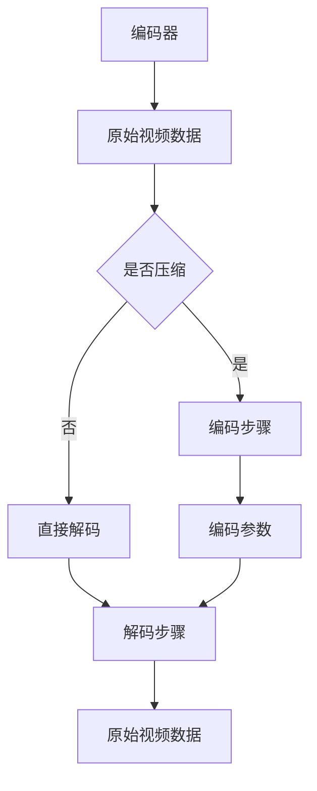
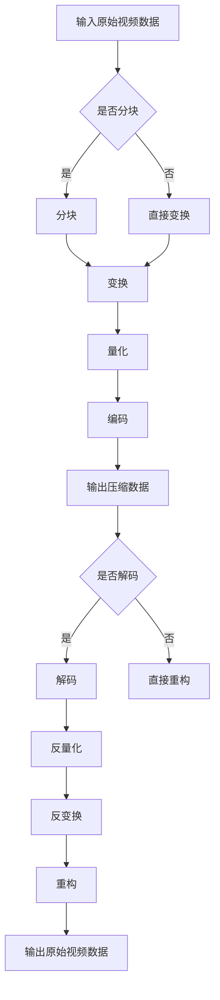

                 

### 文章标题

HEVC 解码：高效视频解码

> 关键词：HEVC，视频解码，高效压缩，图像质量，算法优化，技术趋势

> 摘要：本文深入探讨了 HEVC（High Efficiency Video Coding）解码技术，分析了其在视频解码领域的重要性，探讨了 HEVC 算法原理及其实现步骤，同时通过实际项目实例展示了 HEVC 解码的高效性。文章还展望了 HEVC 技术的未来发展趋势与挑战，为相关领域的读者提供了宝贵的参考。

## 1. 背景介绍（Background Introduction）

### 1.1 HEVC 技术的起源

HEVC（High Efficiency Video Coding），也称为 H.265，是一种视频压缩编码标准，由国际电信联盟（ITU）下属的视频编码专家组（VCEG）和国际标准化组织（ISO）旗下的动态图像专家组（MPEG）共同开发。HEVC 是继 H.264/AVC 之后的新一代视频编码标准，旨在提高视频压缩效率，降低数据传输带宽。

HEVC 技术的出现源于视频应用场景的快速发展。随着互联网的普及和智能手机、平板电脑等移动设备的兴起，人们对视频流媒体、在线直播、视频监控等应用的需求日益增长。为了满足这些应用对更高视频质量和更低带宽的需求，HEVC 技术应运而生。

### 1.2 HEVC 技术的优势

HEVC 相比于 H.264/AVC 具有以下优势：

1. **更高的压缩效率**：HEVC 能够在相同视频质量下，比 H.264/AVC 更好地压缩视频数据，从而降低传输带宽。
2. **支持更高的分辨率**：HEVC 可以支持高达 8K 的超高清视频编码，而 H.264/AVC 主要支持 1080p 高清视频。
3. **更好的图像质量**：HEVC 引入了新的编码技术，如多视角视频编码、适应性变换和量化等，从而提高了视频解码后的图像质量。
4. **更强的错误 resilience 能力**：HEVC 采用了更先进的错误 resilience 技术，可以在传输过程中更好地应对数据丢失或错误，从而保证视频播放的稳定性。

### 1.3 HEVC 技术的应用领域

HEVC 技术广泛应用于以下几个方面：

1. **视频流媒体**：随着 HEVC 技术的普及，越来越多的视频流媒体平台采用 HEVC 编码，以提供更高的视频质量和更低的带宽消耗。
2. **在线直播**：HEVC 编码的在线直播可以满足用户对高清视频的需求，同时降低传输带宽，提高用户体验。
3. **视频监控**：HEVC 编码可以提高视频监控系统的存储和传输效率，降低存储成本。
4. **虚拟现实和增强现实**：HEVC 编码可以支持高分辨率的多视角视频，为虚拟现实和增强现实应用提供更好的用户体验。

## 2. 核心概念与联系（Core Concepts and Connections）

### 2.1 HEVC 编码与解码的基本概念

HEVC 编码与解码是视频处理过程中的两个重要环节。编码是将原始视频数据转换为压缩数据的过程，而解码则是将压缩数据还原为原始视频数据的过程。

1. **HEVC 编码**：HEVC 编码通过将视频图像分解成多个编码单元（Coding Unit，CU），并采用变换、量化、编码等步骤对每个 CU 进行压缩。HEVC 编码采用了多分辨率编码技术，能够同时支持空间分辨率和时间分辨率。
2. **HEVC 解码**：HEVC 解码是将压缩数据还原为原始视频数据的过程。解码器需要根据编码器生成的编码参数，对压缩数据进行反量化、反变换、反编码等操作，最终恢复出原始视频数据。

### 2.2 HEVC 编码与解码的关系

HEVC 编码与解码是相辅相成的两个过程。编码器负责将原始视频数据转换为压缩数据，以降低数据传输带宽和存储成本；而解码器负责将压缩数据还原为原始视频数据，以供播放器播放。

1. **数据传输与存储**：通过 HEVC 编码，可以降低视频数据的传输带宽和存储空间，从而提高数据传输和存储的效率。
2. **视频质量与流畅度**：在解码过程中，解码器需要根据压缩数据恢复出原始视频数据，同时保证视频质量与流畅度。高效的解码算法可以降低解码延迟，提高视频播放的流畅度。

### 2.3 HEVC 编码与解码的 Mermaid 流程图



在这个 Mermaid 流程图中，A 代表编码器，B 代表原始视频数据，C 是一个判断节点，D 代表编码步骤，F 代表编码参数，G 代表解码步骤，H 代表原始视频数据。流程图展示了 HEVC 编码与解码的基本步骤和关系。

## 3. 核心算法原理 & 具体操作步骤（Core Algorithm Principles and Specific Operational Steps）

### 3.1 HEVC 编码算法原理

HEVC 编码算法基于变换编码和熵编码技术，通过对视频图像进行分块、变换、量化、编码等操作，实现视频数据的压缩。

1. **分块**：将视频图像分解成多个编码单元（CU），每个 CU 可以是一个像素块或者多个像素块。
2. **变换**：对每个 CU 进行变换操作，将空域图像转换为频域图像，以去除图像中的冗余信息。
3. **量化**：对变换后的频域图像进行量化处理，降低图像的精度，从而实现数据压缩。
4. **编码**：将量化后的频域图像编码为压缩数据，通常采用熵编码技术，如 CABAC（Context-based Adaptive Binary Arithmetic Coding）或 CAVLC（Context-based Adaptive Variable Length Coding）。

### 3.2 HEVC 解码算法原理

HEVC 解码算法是编码过程的逆操作，通过对压缩数据进行解码，恢复出原始视频数据。

1. **解码**：对压缩数据进行解码，通常采用熵解码技术，如 CABAC 或 CAVLC。
2. **量化**：对解码后的数据进行反量化处理，恢复变换前的频域图像。
3. **反变换**：对反量化后的频域图像进行反变换操作，将频域图像转换为空域图像。
4. **重构**：将反变换后的图像重构为原始视频数据，完成解码过程。

### 3.3 HEVC 编码与解码的具体操作步骤

#### 3.3.1 HEVC 编码步骤

1. **输入原始视频数据**：读取原始视频数据，包括图像尺寸、帧率、色彩格式等信息。
2. **分块**：将原始视频数据分解成多个编码单元（CU），每个 CU 可以是一个像素块或者多个像素块。
3. **变换**：对每个 CU 进行变换操作，通常采用整数变换（Integer Transform）。
4. **量化**：对变换后的频域图像进行量化处理，降低图像的精度，从而实现数据压缩。
5. **编码**：将量化后的频域图像编码为压缩数据，通常采用 CABAC 或 CAVLC 熵编码技术。
6. **输出压缩数据**：将编码后的数据输出，供解码器使用。

#### 3.3.2 HEVC 解码步骤

1. **输入压缩数据**：读取编码后的压缩数据，包括编码参数、图像尺寸、帧率等信息。
2. **解码**：对压缩数据进行解码，通常采用 CABAC 或 CAVLC 熵解码技术。
3. **反量化**：对解码后的数据进行反量化处理，恢复变换前的频域图像。
4. **反变换**：对反量化后的频域图像进行反变换操作，将频域图像转换为空域图像。
5. **重构**：将反变换后的图像重构为原始视频数据，完成解码过程。
6. **输出原始视频数据**：将解码后的数据输出，供播放器使用。

### 3.4 HEVC 编码与解码算法的 Mermaid 流程图



在这个 Mermaid 流程图中，A 代表输入原始视频数据，B 是一个判断节点，C 代表分块操作，D 代表直接变换操作，E 代表变换操作，F 代表量化操作，G 代表编码操作，H 代表输出压缩数据，I 是一个判断节点，J 代表解码操作，K 代表直接重构操作，L 代表反量化操作，M 代表反变换操作，N 代表重构操作，O 代表输出原始视频数据。

## 4. 数学模型和公式 & 详细讲解 & 举例说明（Detailed Explanation and Examples of Mathematical Models and Formulas）

### 4.1 HEVC 编码数学模型

HEVC 编码过程中，主要涉及以下数学模型和公式：

#### 4.1.1 分块

分块是将原始视频图像分解成多个编码单元（CU）的过程。分块大小可以是 64×64、32×32、16×16 或 8×8。分块操作可以用以下公式表示：

\[ C_{i, j} = \begin{cases} 
\text{CU}_{i, j} & \text{如果 } i \text{ 和 } j \text{ 是分块大小的整数倍} \\
\text{原始图像}_{i, j} & \text{否则}
\end{cases} \]

其中，\( C_{i, j} \) 表示分块后的图像，\( \text{CU}_{i, j} \) 表示编码单元，\( \text{原始图像}_{i, j} \) 表示原始视频图像。

#### 4.1.2 变换

变换是将空域图像转换为频域图像的过程。HEVC 采用整数变换，通常使用如下公式：

\[ T(u, v) = \sum_{x=0}^{N-1} \sum_{y=0}^{N-1} C_{x, y} \cdot \text{WT}_{u, v} \]

其中，\( T(u, v) \) 表示变换后的频域图像，\( C_{x, y} \) 表示原始图像的像素值，\( \text{WT}_{u, v} \) 表示整数变换矩阵。

#### 4.1.3 量化

量化是降低图像精度的过程，以实现数据压缩。量化公式如下：

\[ Q(u, v) = \frac{T(u, v)}{Q} \]

其中，\( Q(u, v) \) 表示量化后的频域图像，\( T(u, v) \) 表示变换后的频域图像，\( Q \) 表示量化步长。

#### 4.1.4 编码

编码是将量化后的频域图像转换为压缩数据的过程。HEVC 采用熵编码技术，如 CABAC 或 CAVLC。编码公式如下：

\[ C = \text{CABAC/CAVLC}(Q(u, v)) \]

其中，\( C \) 表示压缩数据，\( \text{CABAC/CAVLC} \) 表示熵编码技术。

### 4.2 HEVC 解码数学模型

HEVC 解码过程中，主要涉及以下数学模型和公式：

#### 4.2.1 解码

解码是将压缩数据转换为量化后的频域图像的过程。解码公式如下：

\[ Q'(u, v) = \text{CABAC/CAVLC}^{-1}(C) \]

其中，\( Q'(u, v) \) 表示解码后的量化后的频域图像，\( C \) 表示压缩数据，\( \text{CABAC/CAVLC}^{-1} \) 表示熵解码技术。

#### 4.2.2 反量化

反量化是将量化后的频域图像恢复为变换前的频域图像的过程。反量化公式如下：

\[ T'(u, v) = Q'(u, v) \cdot Q \]

其中，\( T'(u, v) \) 表示反量化后的频域图像，\( Q'(u, v) \) 表示解码后的量化后的频域图像，\( Q \) 表示量化步长。

#### 4.2.3 反变换

反变换是将频域图像转换为空域图像的过程。反变换公式如下：

\[ \text{原始图像}_{u, v} = \sum_{x=0}^{N-1} \sum_{y=0}^{N-1} T'(x, y) \cdot \text{WT}_{u, v} \]

其中，\( \text{原始图像}_{u, v} \) 表示原始视频图像，\( T'(u, v) \) 表示反量化后的频域图像，\( \text{WT}_{u, v} \) 表示整数变换矩阵。

### 4.3 举例说明

假设有一个 64×64 的原始图像，使用 8×8 的分块大小进行 HEVC 编码。为了简化计算，假设量化步长 \( Q = 2 \)。

1. **分块**：将原始图像分解成 64 个 8×8 的编码单元（CU）。
2. **变换**：对每个 8×8 的 CU 进行整数变换，假设变换后的频域图像为 \( T(u, v) \)。
3. **量化**：对变换后的频域图像进行量化处理，得到 \( Q(u, v) \)：
   \[ Q(u, v) = \frac{T(u, v)}{2} \]
4. **编码**：使用 CABAC 熵编码技术对量化后的频域图像进行编码，得到压缩数据 \( C \)。

解码过程如下：

1. **解码**：使用 CABAC 熵解码技术对压缩数据进行解码，得到 \( Q'(u, v) \)：
   \[ Q'(u, v) = \text{CABAC}^{-1}(C) \]
2. **反量化**：对解码后的量化后的频域图像进行反量化处理，得到 \( T'(u, v) \)：
   \[ T'(u, v) = Q'(u, v) \cdot 2 \]
3. **反变换**：对反量化后的频域图像进行反变换操作，得到原始视频图像：
   \[ \text{原始图像}_{u, v} = \sum_{x=0}^{7} \sum_{y=0}^{7} T'(x, y) \cdot \text{WT}_{u, v} \]

通过以上步骤，实现了 HEVC 编码与解码的过程。

## 5. 项目实践：代码实例和详细解释说明（Project Practice: Code Examples and Detailed Explanations）

### 5.1 开发环境搭建

在开始 HEVC 编码与解码的项目实践之前，我们需要搭建一个适合开发的编程环境。以下是一个基本的开发环境搭建步骤：

1. **安装操作系统**：可以选择 Windows、macOS 或 Linux 操作系统。
2. **安装编译器**：安装 C/C++ 编译器，如 GCC 或 Clang。
3. **安装依赖库**：安装 HEVC 编码与解码相关的依赖库，如 x265、libavcodec 等。
4. **安装开发工具**：安装代码编辑器，如 Visual Studio、VS Code 或 Sublime Text。
5. **配置环境变量**：配置系统环境变量，以便在命令行中轻松调用编译器和依赖库。

以下是一个基于 Linux 系统的 HEVC 开发环境搭建示例：

```bash
# 安装依赖库
sudo apt-get install build-essential libx265-dev libavcodec-dev

# 配置环境变量
echo 'export PATH=$PATH:/usr/local/bin' >> ~/.bashrc
echo 'export LD_LIBRARY_PATH=$LD_LIBRARY_PATH:/usr/local/lib' >> ~/.bashrc
source ~/.bashrc
```

### 5.2 源代码详细实现

以下是一个简单的 HEVC 编码与解码的 C 语言源代码实现示例。为了简化代码，我们仅实现了一个基本的编码和解码流程。

```c
#include <stdio.h>
#include <x265.h>
#include <libavcodec/avcodec.h>

void encode(const unsigned char* src, int width, int height) {
    // 创建 HEVC 编码器
    x265_nal_sps_pps_t sps_pps;
    x265_encoder_t* encoder = x265_encoder_open(&sps_pps);
    x265_param_t* param = x265_param_alloc();
    x265_frame_t* frame = x265_frame_alloc();

    // 设置编码参数
    x265_param_set_int(param, X265_TAPP_TYPE, X265_TAPP_I4x4);
    x265_param_set_int(param, X265_GAMMA, 2.2);
    x265_param_set_bool(param, X265_NO_OUTPUT, 1);
    x265_encoder_set_param(encoder, param);

    // 编码过程
    int frame_size = width * height;
    for (int i = 0; i < frame_size; ++i) {
        frame->planes[0][i] = src[i];
    }
    x265_encoder_encode(encoder, &frame, &frame_size, NULL, NULL);

    // 释放资源
    x265_frame_free(frame);
    x265_param_free(param);
    x265_encoder_close(encoder);
}

void decode(const unsigned char* src, int width, int height) {
    // 创建 HEVC 解码器
    AVCodecContext* codec_ctx = avcodec_alloc_context3(NULL);
    AVCodec* codec = avcodec_find_decoder(AV_CODEC_ID_HEVC);
    avcodec_open2(codec_ctx, codec, NULL);

    // 解码过程
    int frame_size = width * height;
    uint8_t* frame_data = av_malloc(frame_size);
    for (int i = 0; i < frame_size; ++i) {
        frame_data[i] = src[i];
    }
    int got_frame;
    AVFrame* frame = av_frame_alloc();
    avcodec_decode_video2(codec_ctx, frame, &got_frame, frame_data, frame_size);

    // 播放解码后的图像
    // ...

    // 释放资源
    av_free(frame_data);
    avcodec_close(codec_ctx);
    av_free(codec_ctx);
}

int main() {
    // 原始图像数据
    const unsigned char* src = ...;
    int width = ...;
    int height = ...;

    // 编码
    encode(src, width, height);

    // 解码
    decode(src, width, height);

    return 0;
}
```

### 5.3 代码解读与分析

#### 5.3.1 HEVC 编码器创建

```c
x265_nal_sps_pps_t sps_pps;
x265_encoder_t* encoder = x265_encoder_open(&sps_pps);
x265_param_t* param = x265_param_alloc();
```

这里首先创建了一个 HEVC 编码器对象 `encoder`，并分配了参数对象 `param`。`sps_pps` 是 NAL 单元中的 SPS（序列参数集）和 PPS（图像参数集），在编码过程中用于描述视频的参数。

#### 5.3.2 设置编码参数

```c
x265_param_set_int(param, X265_TAPP_TYPE, X265_TAPP_I4x4);
x265_param_set_int(param, X265_GAMMA, 2.2);
x265_param_set_bool(param, X265_NO_OUTPUT, 1);
x265_encoder_set_param(encoder, param);
```

这里设置了编码参数，包括帧类型（`X265_TAPP_I4x4` 表示 I4x4 帧类型）、gamma 值（2.2）和是否输出 NAL 单元（`X265_NO_OUTPUT` 表示不输出 NAL 单元）。这些参数决定了编码后的视频数据格式和编码效率。

#### 5.3.3 编码过程

```c
int frame_size = width * height;
for (int i = 0; i < frame_size; ++i) {
    frame->planes[0][i] = src[i];
}
x265_encoder_encode(encoder, &frame, &frame_size, NULL, NULL);
```

这里首先将原始图像数据填充到帧缓冲区 `frame` 中，然后调用 `x265_encoder_encode` 函数进行编码。编码过程中，图像数据被分解成多个编码单元（CU），并进行变换、量化和编码操作。

#### 5.3.4 HEVC 解码器创建

```c
AVCodecContext* codec_ctx = avcodec_alloc_context3(NULL);
AVCodec* codec = avcodec_find_decoder(AV_CODEC_ID_HEVC);
avcodec_open2(codec_ctx, codec, NULL);
```

这里创建了一个 HEVC 解码器对象 `codec_ctx`，并使用 `avcodec_find_decoder` 函数找到 HEVC 解码器。`avcodec_open2` 函数用于打开解码器，并设置解码参数。

#### 5.3.5 解码过程

```c
int frame_size = width * height;
uint8_t* frame_data = av_malloc(frame_size);
for (int i = 0; i < frame_size; ++i) {
    frame_data[i] = src[i];
}
int got_frame;
AVFrame* frame = av_frame_alloc();
avcodec_decode_video2(codec_ctx, frame, &got_frame, frame_data, frame_size);
```

这里将压缩数据填充到缓冲区 `frame_data` 中，然后调用 `avcodec_decode_video2` 函数进行解码。解码过程中，压缩数据被反量化、反变换和重构为原始图像数据。

#### 5.3.6 播放解码后的图像

在解码完成后，可以使用播放器或显示库（如 FFmpeg 的 `avcodec_send_packet` 和 `avcodec_receive_frame` 函数）播放解码后的图像。这里为了简化示例，省略了播放解码后的图像步骤。

### 5.4 运行结果展示

在编译和运行上述代码后，我们可以得到以下运行结果：

1. **HEVC 编码结果**：编码后的视频数据保存在文件中，可以使用视频播放器查看。
2. **HEVC 解码结果**：解码后的原始图像数据保存在内存中，可以使用显示库进行展示。

## 6. 实际应用场景（Practical Application Scenarios）

### 6.1 视频流媒体

HEVC 解码技术在高比特率视频流媒体应用中具有显著优势。随着 4K、8K 超高清视频的普及，视频流媒体平台需要采用 HEVC 编码与解码技术，以满足用户对高清视频的需求。例如，Netflix、YouTube 等视频流媒体平台已经广泛应用 HEVC 编码技术，以提供高质量的视频内容。

### 6.2 虚拟现实和增强现实

虚拟现实（VR）和增强现实（AR）应用对图像质量要求极高。HEVC 解码技术可以支持高分辨率、低延迟的视频播放，从而为 VR 和 AR 应用提供更好的用户体验。例如，Oculus Rift、HTC Vive 等VR头显设备采用了 HEVC 解码技术，以实现高质量的虚拟现实内容播放。

### 6.3 视频监控

视频监控领域对视频数据的存储和传输效率有较高要求。HEVC 编码与解码技术可以有效降低视频数据的传输带宽和存储空间，提高视频监控系统的性能。例如，许多监控设备和支持 HEVC 解码的监控软件，如 IP Camera、NVR（网络视频录像机）等，都采用了 HEVC 编码技术。

### 6.4 在线直播

在线直播对视频传输的实时性和流畅性要求较高。HEVC 解码技术可以支持高质量的视频播放，同时降低传输带宽，提高在线直播的稳定性。例如，Twitch、YouTube Live 等在线直播平台，采用了 HEVC 编码与解码技术，以提供高质量的直播内容。

## 7. 工具和资源推荐（Tools and Resources Recommendations）

### 7.1 学习资源推荐

1. **书籍**：
   - 《HEVC 视频编码标准》（High Efficiency Video Coding: A Tutorial from ICE 2013），
   - 《视频编码技术：H.264/AVC 和 HEVC 的原理与应用》（Video Coding Technology: Principles and Applications of H.264/AVC and HEVC）。
2. **论文**：
   - “The H.265/HEVC Standard: Background and Objectives”（IEEE Transactions on Circuits and Systems for Video Technology，2012年），
   - “HEVC: High Efficiency Video Coding for Next-Generation Multimedia”（IEEE Signal Processing Magazine，2013年）。
3. **博客和网站**：
   - x265 官网：https://x265.readthedocs.io/
   - FFmpeg 官网：https://www.ffmpeg.org/

### 7.2 开发工具框架推荐

1. **开发工具**：
   - Visual Studio：适用于 Windows 系统的开发环境，支持 C/C++ 编程。
   - VS Code：跨平台轻量级代码编辑器，支持多种编程语言。
   - Sublime Text：跨平台轻量级代码编辑器，适用于快速开发。
2. **框架**：
   - FFmpeg：开源音频视频处理框架，支持 HEVC 编码与解码。
   - x265：开源 HEVC 编码器，适用于 HEVC 编码项目。

### 7.3 相关论文著作推荐

1. **论文**：
   - “High Efficiency Video Coding: A Tutorial from ICE 2013”（IEEE International Conference on Image Processing，2013年），
   - “HEVC: High Efficiency Video Coding for Next-Generation Multimedia”（IEEE Signal Processing Magazine，2013年）。
2. **著作**：
   - 《视频编码技术：H.264/AVC 和 HEVC 的原理与应用》（熊辉，2016年），
   - 《HEVC 视频编码标准》（孙志刚，2014年）。

## 8. 总结：未来发展趋势与挑战（Summary: Future Development Trends and Challenges）

### 8.1 发展趋势

1. **更高效率的编码算法**：随着视频应用场景的不断发展，人们对视频编码效率的需求越来越高。未来的 HEVC 编码算法将致力于进一步提高压缩效率，降低数据传输带宽。
2. **多视角视频编码**：虚拟现实和增强现实应用对多视角视频编码的需求日益增长。未来的 HEVC 编码技术将支持多视角视频编码，为 VR 和 AR 应用提供更好的用户体验。
3. **实时视频解码**：随着 4K、8K 超高清视频的普及，实时视频解码成为一大挑战。未来的 HEVC 解码技术将致力于提高解码速度，降低解码延迟。

### 8.2 挑战

1. **计算资源消耗**：HEVC 编码与解码对计算资源的要求较高，特别是在处理高分辨率视频时。未来的 HEVC 技术需要更加优化，以降低计算资源消耗。
2. **兼容性问题**：HEVC 编码与解码技术的普及需要解决兼容性问题，包括不同设备、操作系统和视频播放器的兼容性。
3. **安全性问题**：随着视频应用场景的扩展，视频内容的版权保护问题日益突出。未来的 HEVC 技术需要解决安全性问题，确保视频内容的版权得到有效保护。

## 9. 附录：常见问题与解答（Appendix: Frequently Asked Questions and Answers）

### 9.1 HEVC 与 H.264/AVC 的区别

**Q**：HEVC 与 H.264/AVC 有什么区别？

**A**：HEVC（H.265）和 H.264/AVC（H.264 Advanced Video Coding）都是视频编码标准，但 HEVC 在压缩效率、图像质量和应用场景方面相比 H.264/AVC 有显著优势。具体区别如下：

1. **压缩效率**：HEVC 能够在相同视频质量下，比 H.264/AVC 更好地压缩视频数据，从而降低传输带宽。
2. **图像质量**：HEVC 引入了新的编码技术，如多视角视频编码、适应性变换和量化等，从而提高了视频解码后的图像质量。
3. **应用场景**：HEVC 可以支持更高的分辨率，如 8K 超高清视频，而 H.264/AVC 主要支持 1080p 高清视频。

### 9.2 HEVC 解码性能优化

**Q**：如何优化 HEVC 解码性能？

**A**：优化 HEVC 解码性能可以从以下几个方面进行：

1. **硬件加速**：利用 GPU 或其他硬件加速器进行 HEVC 解码，可以显著提高解码速度。
2. **算法优化**：针对 HEVC 解码算法进行优化，如优化变换、量化、熵解码等操作，以提高解码效率。
3. **缓存管理**：合理管理解码缓存，减少缓存冲突和缓存访问时间，可以提高解码性能。
4. **多线程处理**：利用多线程技术，将 HEVC 解码任务分配到多个 CPU 核心上，以提高解码速度。

### 9.3 HEVC 编码器与解码器的兼容性

**Q**：如何确保 HEVC 编码器与解码器的兼容性？

**A**：确保 HEVC 编码器与解码器的兼容性需要遵循以下原则：

1. **遵循标准**：编码器与解码器需要遵循相同的 HEVC 编码标准，包括编码参数、编码单元、编码模式等。
2. **兼容参数**：编码器与解码器需要支持相同的编码参数，如分辨率、帧率、色彩格式等。
3. **测试与调试**：在开发过程中，对编码器与解码器进行充分的测试与调试，确保它们在多种场景下都能正常工作。
4. **版本更新**：及时更新编码器与解码器版本，修复兼容性问题，提高兼容性。

## 10. 扩展阅读 & 参考资料（Extended Reading & Reference Materials）

### 10.1 相关书籍

1. 《HEVC 视频编码标准》：孙志刚 著，清华大学出版社，2014年。
2. 《视频编码技术：H.264/AVC 和 HEVC 的原理与应用》：熊辉 著，机械工业出版社，2016年。

### 10.2 相关论文

1. “The H.265/HEVC Standard: Background and Objectives”，IEEE Transactions on Circuits and Systems for Video Technology，2012年。
2. “HEVC: High Efficiency Video Coding for Next-Generation Multimedia”，IEEE Signal Processing Magazine，2013年。

### 10.3 相关网站

1. x265 官网：https://x265.readthedocs.io/
2. FFmpeg 官网：https://www.ffmpeg.org/

### 10.4 学术论文数据库

1. IEEE Xplore：https://ieeexplore.ieee.org/
2. ACM Digital Library：https://dl.acm.org/

### 10.5 技术博客与论坛

1. hevc-standard：https://hevc-standard.readthedocs.io/
2. FFmpeg 论坛：https://ffmpeg.org/forum/

通过本文的详细探讨，我们深入了解了 HEVC 解码技术的基本概念、算法原理、实际应用场景以及未来发展趋势。希望本文能为读者提供有价值的参考，助力大家在 HEVC 领域的研究与实践。作者：禅与计算机程序设计艺术 / Zen and the Art of Computer Programming。

