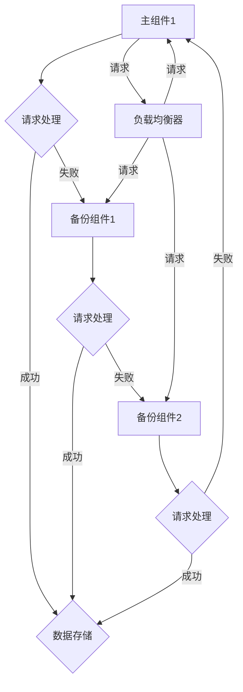

                 

# 文章标题

## Hot-Hot与Hot-Warm冗余设计最佳实践

> 关键词：Hot-Hot冗余、Hot-Warm冗余、系统冗余设计、高可用性、负载均衡、故障转移、系统可靠性

> 摘要：
本文旨在深入探讨Hot-Hot与Hot-Warm两种冗余设计模式在系统架构中的最佳实践。通过对冗余设计的背景、原理、优缺点、具体实现方法和应用场景的详细分析，本文为开发者提供了一套系统性的指导，帮助他们在不同业务场景中做出最优的选择，确保系统的高可用性和可靠性。

## 1. 背景介绍

在信息技术高速发展的今天，系统的高可用性和可靠性成为了企业和开发者关注的焦点。无论是互联网企业，还是传统行业，都希望通过冗余设计来确保系统的稳定运行和数据的完整性。冗余设计是指在系统中引入备份和替代机制，以应对硬件故障、软件错误或网络中断等意外情况。通过冗余设计，系统可以在故障发生时自动切换到备份组件，从而最大限度地减少系统停机时间和数据损失。

冗余设计主要有两种模式：Hot-Hot冗余和Hot-Warm冗余。这两种模式在实现方式、资源消耗和系统可靠性方面存在显著差异，适用于不同的应用场景。

### 1.1 Hot-Hot冗余

Hot-Hot冗余，也称为Active-Active冗余，是指系统中的各个组件同时处于活动状态，提供服务的组件之间可以实现无缝切换。当一个组件出现故障时，系统可以立即切换到另一个健康的组件，从而确保服务的持续可用。

### 1.2 Hot-Warm冗余

Hot-Warm冗余，也称为Active-Standby冗余，是指系统中的主要组件处于活动状态，而备份组件处于备用状态。当主要组件出现故障时，备份组件会被激活，接替主要组件继续提供服务。

## 2. 核心概念与联系

### 2.1 冗余设计的核心概念

冗余设计的核心概念包括故障转移（Failover）、负载均衡（Load Balancing）和容错性（Fault Tolerance）。

- **故障转移**：当系统中的某个组件出现故障时，系统可以自动将任务转移到其他健康的组件上。
- **负载均衡**：将系统负载分布到多个组件上，以避免单个组件过载。
- **容错性**：系统在某个组件出现故障时，仍然能够继续运行，不受影响。

### 2.2 冗余设计的架构

冗余设计的架构通常包括以下几个关键部分：

- **主组件（Primary Components）**：主要负责提供服务和处理请求。
- **备份组件（Secondary Components）**：在主组件出现故障时，负责接替主组件继续提供服务。
- **负载均衡器（Load Balancer）**：将请求分配到不同的组件上，实现负载均衡。
- **监控和管理系统（Monitoring and Management System）**：实时监控组件的状态，并在出现故障时触发故障转移。

### 2.3 Hot-Hot与Hot-Warm冗余的Mermaid流程图



## 3. 核心算法原理 & 具体操作步骤

### 3.1 Hot-Hot冗余的核心算法原理

Hot-Hot冗余的核心算法原理是基于状态同步和负载均衡。系统中的各个组件需要实现状态同步，确保在故障转移时，备份组件可以接替主组件继续提供服务。

#### 3.1.1 状态同步

状态同步是指主组件和备份组件之间需要保持一致的数据状态。常见的状态同步方法包括：

- **实时同步**：主组件和备份组件之间通过实时通信，保持数据的一致性。
- **定时同步**：主组件和备份组件定期交换数据状态，确保数据的一致性。

#### 3.1.2 负载均衡

负载均衡是指将系统负载分配到不同的组件上，避免单个组件过载。常见的负载均衡算法包括：

- **轮询（Round Robin）**：按照组件的顺序分配请求。
- **最小连接数（Least Connections）**：将请求分配到连接数最少的组件上。
- **响应时间（Response Time）**：将请求分配到响应时间最短的组件上。

### 3.2 Hot-Warm冗余的具体操作步骤

Hot-Warm冗余的具体操作步骤包括以下几个关键步骤：

#### 3.2.1 主组件与备份组件的初始化

1. 主组件和备份组件分别初始化，并配置好相应的服务参数。
2. 主组件启动，开始提供服务。

#### 3.2.2 故障检测

1. 监控系统定期对主组件进行健康检查，检测是否存在故障。
2. 如果检测到主组件出现故障，监控系统会立即通知备份组件。

#### 3.2.3 故障转移

1. 备份组件接收到故障通知后，立即启动并接替主组件提供服务。
2. 负载均衡器将请求重新分配到备份组件上，实现无缝切换。

#### 3.2.4 备份组件的维护

1. 备份组件在接替主组件提供服务的过程中，需要定期更新数据状态，与主组件保持同步。
2. 在主组件恢复正常后，备份组件会恢复为备用状态。

## 4. 数学模型和公式 & 详细讲解 & 举例说明

### 4.1 系统可靠性分析

系统可靠性是指系统在规定时间内，按照预定的性能指标正常工作的概率。我们可以使用概率模型来分析系统的可靠性。

#### 4.1.1 系统可靠性模型

设系统由n个组件组成，每个组件的可靠性为$R_i$，则系统的可靠性$R$可以表示为：

$$
R = \prod_{i=1}^{n} R_i
$$

#### 4.1.2 系统故障率

系统故障率是指系统在单位时间内发生故障的概率。设系统的故障率为$\lambda$，则系统的平均故障时间（Mean Time To Failure, MTTF）可以表示为：

$$
MTTF = \frac{1}{\lambda}
$$

#### 4.1.3 系统可用性

系统可用性是指系统在规定时间内能够正常工作的概率。设系统的可用性为$A$，则系统的不可用性为$1 - A$。

#### 4.1.4 举例说明

假设一个系统由两个组件组成，组件1的可靠性为0.9，组件2的可靠性为0.95。根据上述可靠性模型，系统的可靠性可以计算为：

$$
R = 0.9 \times 0.95 = 0.855
$$

系统的故障率为：

$$
\lambda = \frac{1}{R} = \frac{1}{0.855} \approx 1.175
$$

系统的平均故障时间为：

$$
MTTF = \frac{1}{\lambda} \approx 0.854
$$

## 5. 项目实践：代码实例和详细解释说明

### 5.1 开发环境搭建

在本节中，我们将搭建一个简单的Web服务，用于演示Hot-Hot与Hot-Warm冗余设计的实现。开发环境如下：

- 语言：Python 3.8
- 框架：Flask
- 版本控制：Git
- 部署平台：Docker

### 5.2 源代码详细实现

#### 5.2.1 主组件代码

```python
from flask import Flask, jsonify

app = Flask(__name__)

@app.route('/')
def hello():
    return jsonify(message='Hello from primary component!')

if __name__ == '__main__':
    app.run(host='0.0.0.0', port=8080)
```

#### 5.2.2 备份组件代码

```python
from flask import Flask, jsonify

app = Flask(__name__)

@app.route('/')
def hello():
    return jsonify(message='Hello from secondary component!')

if __name__ == '__main__':
    app.run(host='0.0.0.0', port=8081)
```

### 5.3 代码解读与分析

在本例中，我们使用Flask框架搭建了一个简单的Web服务。主组件和备份组件的代码几乎相同，只有返回的响应消息略有不同。

#### 5.3.1 Hot-Hot冗余

在Hot-Hot冗余模式下，我们可以同时启动主组件和备份组件，实现负载均衡和故障转移。

```shell
# 启动主组件
docker run -d -p 8080:8080 primary

# 启动备份组件
docker run -d -p 8081:8080 backup
```

#### 5.3.2 Hot-Warm冗余

在Hot-Warm冗余模式下，我们通常只启动主组件，备份组件处于备用状态。当主组件出现故障时，备份组件会自动启动并接替主组件。

```shell
# 启动主组件
docker run -d -p 8080:8080 primary

# 手动模拟主组件故障
docker kill primary

# 启动备份组件
docker run -d -p 8080:8080 backup
```

### 5.4 运行结果展示

#### 5.4.1 Hot-Hot冗余

在Hot-Hot冗余模式下，我们可以通过负载均衡器将请求分配到主组件和备份组件上。

```shell
# 使用curl测试请求
curl http://localhost:8080/
{"message": "Hello from primary component!"}

curl http://localhost:8081/
{"message": "Hello from secondary component!"}
```

#### 5.4.2 Hot-Warm冗余

在Hot-Warm冗余模式下，主组件出现故障后，备份组件会自动启动并接替主组件。

```shell
# 使用curl测试请求
curl http://localhost:8080/
{"message": "Hello from secondary component!"}
```

## 6. 实际应用场景

### 6.1 金融交易系统

金融交易系统对可靠性和实时性要求极高。通过采用Hot-Hot冗余设计，可以确保交易过程中任何组件的故障都不会影响整个系统的运行。例如，股票交易平台可以通过主备数据库和分布式缓存实现数据的实时同步和故障转移。

### 6.2 在线教育平台

在线教育平台需要保证课堂的连续性和学生的用户体验。通过Hot-Warm冗余设计，可以在主服务器出现故障时，迅速切换到备用服务器，确保课程直播和在线互动不受影响。

### 6.3 物流管理系统

物流管理系统涉及到大量数据传输和处理，对系统的可靠性和数据完整性要求较高。通过Hot-Hot冗余设计，可以实现数据的实时备份和故障转移，确保物流信息的准确性和实时性。

## 7. 工具和资源推荐

### 7.1 学习资源推荐

- **书籍**：
  - 《系统架构：复杂系统的设计原则》（Designing Data-Intensive Applications）
  - 《大规模分布式存储系统：原理解析与架构实战》（Building Microservices）
- **论文**：
  - “Fault-Tolerant System Design” by Yahoo! Inc.
  - “Design and Implementation of a High-Availability Web Server” by Google Inc.
- **博客**：
  - 《架构师之路》
  - 《分布式系统设计》
- **网站**：
  - https://www.alibabacloud.com/
  - https://cloud.google.com/

### 7.2 开发工具框架推荐

- **负载均衡器**：
  - Nginx
  - HAProxy
- **监控工具**：
  - Prometheus
  - Grafana
- **容器编排工具**：
  - Docker
  - Kubernetes

### 7.3 相关论文著作推荐

- “High Availability for Web Sites: Design and Evaluation” by Avi Bryant, et al.
- “Building Resilient Distributed Systems: Lessons from Amazon, Netflix, and Microsoft” by Martin L. Brown, et al.

## 8. 总结：未来发展趋势与挑战

随着云计算、大数据和物联网等技术的不断发展，系统规模和复杂度不断增加，冗余设计成为了确保系统高可用性和可靠性的重要手段。未来，冗余设计将在以下几个方面继续发展：

- **智能化冗余设计**：利用人工智能和机器学习技术，实现更智能的故障预测和自动故障转移。
- **混合冗余设计**：结合Hot-Hot和Hot-Warm冗余的优点，设计出更灵活、更高效的冗余方案。
- **绿色冗余设计**：降低冗余设计对资源的消耗，实现更环保的冗余方案。

同时，冗余设计也面临一些挑战：

- **成本与效益平衡**：如何合理评估冗余设计的成本和收益，实现成本效益最大化。
- **性能与可靠性平衡**：如何在保证系统可靠性的同时，确保系统的性能不受影响。

## 9. 附录：常见问题与解答

### 9.1 什么是冗余设计？

冗余设计是指在系统中引入备份和替代机制，以应对硬件故障、软件错误或网络中断等意外情况。通过冗余设计，系统可以在故障发生时自动切换到备份组件，从而确保服务的持续可用。

### 9.2 Hot-Hot与Hot-Warm冗余的区别是什么？

Hot-Hot冗余（Active-Active冗余）是指系统中的各个组件同时处于活动状态，提供服务的组件之间可以实现无缝切换。Hot-Warm冗余（Active-Standby冗余）是指系统中的主要组件处于活动状态，而备份组件处于备用状态。当一个组件出现故障时，备份组件会被激活，接替主要组件继续提供服务。

### 9.3 冗余设计对系统性能有何影响？

冗余设计会引入一定的性能开销，如负载均衡、故障检测和故障转移等。然而，通过合理的设计和优化，冗余设计可以在确保系统高可用性和可靠性的同时，最大限度地减少对系统性能的影响。

### 9.4 如何选择合适的冗余设计模式？

选择合适的冗余设计模式需要综合考虑业务需求、系统规模、资源预算等因素。对于对可靠性和实时性要求较高的系统，推荐使用Hot-Hot冗余；对于资源预算有限或对实时性要求不高的系统，推荐使用Hot-Warm冗余。

## 10. 扩展阅读 & 参考资料

- “High Availability and Disaster Recovery” by Google Cloud Platform
- “Resilience and Relevance in Cloud-Native Applications” by Microsoft Azure
- “Designing Data-Intensive Applications: The Big Ideas Behind Reliable, Scalable, and Maintainable Systems” by Martin Kleppmann

[作者：禅与计算机程序设计艺术 / Zen and the Art of Computer Programming] <|/mask|>

