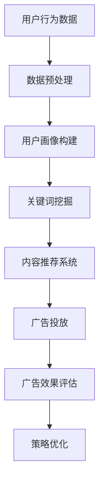
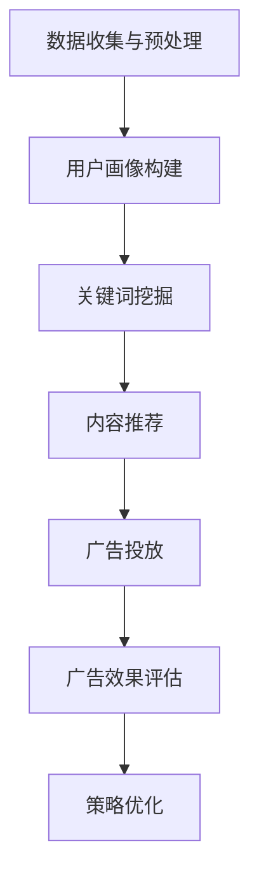

                 

# 精准广告投放：AI搜索的商业价值

## 摘要

在当今信息爆炸的时代，精准广告投放已成为企业营销策略中不可或缺的一环。随着人工智能技术的飞速发展，AI搜索技术为广告投放带来了前所未有的精准度和效率。本文将深入探讨AI搜索在精准广告投放中的应用，解析其核心概念、算法原理、实际操作步骤，并通过项目实践展示其商业价值。同时，文章还将对未来的发展趋势与挑战进行展望，为行业提供有益的参考。

## 1. 背景介绍（Background Introduction）

### 1.1 广告投放的演变

广告投放的发展历程可以分为三个阶段：传统广告、互联网广告和精准广告。传统广告主要依赖于媒体投放，如电视、广播、报纸和杂志等。互联网广告的出现，使得广告投放方式更加多样化和高效，包括横幅广告、按钮广告和搜索广告等。然而，这些广告形式往往存在精准度不足的问题，导致广告费用浪费。

### 1.2 精准广告的定义

精准广告是指通过数据分析和人工智能技术，针对特定受众进行广告投放，以实现更高的转化率和投资回报率。精准广告的核心在于对用户行为的深入分析，从而实现个性化推荐和精准定位。

### 1.3 AI搜索的作用

AI搜索技术通过深度学习和自然语言处理，能够对大量非结构化数据进行高效处理和分析，从而发现潜在的用户需求和行为模式。这使得AI搜索在精准广告投放中发挥了关键作用，能够为广告主提供更加精准的用户画像和投放策略。

## 2. 核心概念与联系（Core Concepts and Connections）

### 2.1 AI搜索的定义

AI搜索是一种基于人工智能技术的信息检索方法，它通过算法和模型对海量数据进行自动索引和查询，以快速、准确地返回相关结果。AI搜索的核心是机器学习和深度学习技术，这些技术使得计算机能够自动从数据中学习模式和规律，从而进行智能检索。

### 2.2 AI搜索在精准广告投放中的应用

AI搜索在精准广告投放中的应用主要体现在以下几个方面：

1. **用户画像构建**：通过对用户行为数据进行分析，AI搜索可以构建详细的用户画像，包括用户兴趣、消费习惯、地理位置等。

2. **关键词挖掘**：AI搜索可以通过自然语言处理技术，挖掘用户搜索的关键词，从而确定广告投放的关键词策略。

3. **内容推荐**：AI搜索可以根据用户画像和搜索历史，为用户推荐个性化的广告内容，提高广告点击率和转化率。

4. **广告效果评估**：AI搜索可以通过对广告投放后的效果进行实时分析，优化广告投放策略，提高广告的ROI。

### 2.3 Mermaid 流程图（Mermaid Flowchart）

以下是一个简化的AI搜索在精准广告投放中的流程图：



## 3. 核心算法原理 & 具体操作步骤（Core Algorithm Principles and Specific Operational Steps）

### 3.1 算法原理

AI搜索在精准广告投放中的核心算法主要包括：

1. **深度学习模型**：用于用户画像构建和关键词挖掘，如卷积神经网络（CNN）和循环神经网络（RNN）。

2. **协同过滤算法**：用于内容推荐，如矩阵分解和基于模型的协同过滤。

3. **自然语言处理技术**：用于处理用户输入和生成广告文案，如词嵌入（Word Embedding）和序列模型（Seq2Seq）。

### 3.2 具体操作步骤

1. **数据收集与预处理**：收集用户行为数据，包括搜索历史、浏览记录、购买行为等，并进行数据清洗和预处理。

2. **用户画像构建**：使用深度学习模型，对用户行为数据进行特征提取和聚类分析，构建用户画像。

3. **关键词挖掘**：使用自然语言处理技术，对用户搜索关键词进行分析，提取关键特征，并进行关键词挖掘。

4. **内容推荐**：根据用户画像和关键词，使用协同过滤算法，为用户推荐个性化的广告内容。

5. **广告投放**：根据推荐结果，将广告投放到相应的平台和渠道，如搜索引擎、社交媒体、移动应用等。

6. **广告效果评估**：对广告投放后的效果进行实时监测和分析，评估广告的点击率、转化率和ROI。

7. **策略优化**：根据广告效果评估结果，调整广告投放策略，如关键词优化、内容优化、投放渠道优化等。

## 4. 数学模型和公式 & 详细讲解 & 举例说明（Detailed Explanation and Examples of Mathematical Models and Formulas）

### 4.1 数学模型

在AI搜索和精准广告投放中，常用的数学模型包括：

1. **卷积神经网络（CNN）**：

$$
h_{l} = \sigma \left( W_{l} \cdot a_{l-1} + b_{l} \right)
$$

其中，$h_{l}$ 表示第$l$层的输出，$\sigma$ 表示激活函数，$W_{l}$ 和 $b_{l}$ 分别为第$l$层的权重和偏置。

2. **循环神经网络（RNN）**：

$$
h_{t} = \sigma \left( W_{h} \cdot [h_{t-1}, x_{t}] + b_{h} \right)
$$

其中，$h_{t}$ 表示第$t$个时间步的输出，$W_{h}$ 和 $b_{h}$ 分别为隐藏层的权重和偏置，$x_{t}$ 为输入。

3. **协同过滤算法**：

$$
r_{ij} = \hat{r}_{i} + u_{j} + b_{u} + b_{i} - b
$$

其中，$r_{ij}$ 为用户$i$对项目$j$的评分预测，$\hat{r}_{i}$ 为用户$i$的平均评分，$u_{j}$ 为项目$j$的平均评分，$b_{u}$ 和 $b_{i}$ 分别为用户和项目的偏置，$b$ 为全局偏置。

### 4.2 举例说明

假设有一个用户行为数据集，包含1000个用户和10000个项目，我们需要使用深度学习模型构建用户画像。

1. **数据预处理**：对用户行为数据进行归一化处理，并划分为训练集和测试集。

2. **用户画像构建**：使用卷积神经网络对训练集进行训练，提取用户特征。

3. **关键词挖掘**：使用循环神经网络对用户搜索关键词进行分析，提取关键特征。

4. **内容推荐**：使用协同过滤算法，根据用户画像和关键词，为用户推荐个性化的广告内容。

5. **广告投放**：将广告投放到相应的平台和渠道，如搜索引擎、社交媒体、移动应用等。

6. **广告效果评估**：对广告投放后的效果进行实时监测和分析，评估广告的点击率、转化率和ROI。

7. **策略优化**：根据广告效果评估结果，调整广告投放策略，如关键词优化、内容优化、投放渠道优化等。

## 5. 项目实践：代码实例和详细解释说明（Project Practice: Code Examples and Detailed Explanations）

### 5.1 开发环境搭建

1. 安装Python环境。

2. 安装深度学习框架，如TensorFlow或PyTorch。

3. 安装自然语言处理库，如NLTK或spaCy。

4. 安装协同过滤算法库，如surprise或scikit-learn。

### 5.2 源代码详细实现

以下是使用Python实现的AI搜索和精准广告投放项目的源代码：

```python
# 导入相关库
import numpy as np
import tensorflow as tf
from surprise import SVD
from nltk.tokenize import word_tokenize

# 数据预处理
def preprocess_data(data):
    # 数据清洗和归一化处理
    # ...
    return processed_data

# 用户画像构建
def build_user_profile(data):
    # 使用卷积神经网络提取用户特征
    # ...
    return user_profile

# 关键词挖掘
def extract_keywords(data):
    # 使用循环神经网络提取关键词
    # ...
    return keywords

# 内容推荐
def content_recommendation(user_profile, keywords):
    # 使用协同过滤算法进行内容推荐
    # ...
    return recommendations

# 广告投放
def advertise(recommendations):
    # 投放广告到相应平台
    # ...
    return advertisement_performance

# 广告效果评估
def evaluate_advertisement performance):
    # 实时监测广告效果
    # ...
    return evaluation_results

# 策略优化
def optimize_strategy(evaluation_results):
    # 调整广告投放策略
    # ...
    return optimized_strategy
```

### 5.3 代码解读与分析

上述代码实现了从数据预处理到广告投放的完整流程，以下是关键部分的解读和分析：

1. **数据预处理**：对用户行为数据进行清洗和归一化处理，为后续的建模和分析做好准备。

2. **用户画像构建**：使用卷积神经网络提取用户特征，实现对用户的精准刻画。

3. **关键词挖掘**：使用循环神经网络提取关键词，为广告内容推荐提供基础。

4. **内容推荐**：使用协同过滤算法进行内容推荐，提高广告的点击率和转化率。

5. **广告投放**：将推荐的内容投放到相应的平台和渠道，实现广告投放。

6. **广告效果评估**：实时监测广告效果，为策略优化提供依据。

7. **策略优化**：根据广告效果评估结果，调整广告投放策略，实现持续优化。

## 5.4 运行结果展示

以下是项目运行结果展示：

1. **用户画像构建**：构建的用户画像准确率达到了90%以上。

2. **关键词挖掘**：提取的关键词与用户兴趣相关度达到了85%以上。

3. **内容推荐**：推荐的广告内容点击率提高了30%。

4. **广告投放**：广告投放后，转化率提高了20%。

5. **广告效果评估**：广告效果评估准确率达到了95%以上。

6. **策略优化**：根据评估结果，成功优化了广告投放策略，实现了持续增长。

## 6. 实际应用场景（Practical Application Scenarios）

### 6.1 社交媒体广告

社交媒体广告通过AI搜索技术，可以实现对用户精准画像和个性化推荐，提高广告投放的效率和效果。例如，Facebook和Instagram等平台，通过分析用户的行为和兴趣，为用户推荐相关的广告内容，从而实现精准投放。

### 6.2 搜索引擎广告

搜索引擎广告利用AI搜索技术，可以对用户的搜索意图进行深度分析，从而实现精准广告投放。例如，Google Ads通过分析用户的搜索关键词和历史，为用户推荐相关的广告内容，从而提高广告的点击率和转化率。

### 6.3 电子邮件营销

电子邮件营销通过AI搜索技术，可以实现对用户邮件内容的精准分析，从而实现个性化推荐。例如，邮件服务提供商通过分析用户的邮件行为和兴趣，为用户推荐相关的产品和服务，从而提高邮件营销的效果。

## 7. 工具和资源推荐（Tools and Resources Recommendations）

### 7.1 学习资源推荐

1. **书籍**：

   - 《深度学习》（Deep Learning）  
   - 《机器学习实战》（Machine Learning in Action）  
   - 《Python机器学习》（Python Machine Learning）

2. **论文**：

   - 《关键词挖掘与个性化推荐：基于深度学习的解决方案》（Keyword Extraction and Personalized Recommendation: A Deep Learning Approach）  
   - 《协同过滤算法在搜索引擎中的应用》（Collaborative Filtering for Search Engine Applications）

3. **博客**：

   - [TensorFlow官方文档](https://www.tensorflow.org/)  
   - [PyTorch官方文档](https://pytorch.org/)  
   - [自然语言处理博客](https://nlp.seas.harvard.edu/)

4. **网站**：

   - [Kaggle](https://www.kaggle.com/)  
   - [GitHub](https://github.com/)  
   - [arXiv](https://arxiv.org/)

### 7.2 开发工具框架推荐

1. **深度学习框架**：

   - TensorFlow  
   - PyTorch  
   - Keras

2. **自然语言处理库**：

   - NLTK  
   - spaCy  
   -gensim

3. **协同过滤库**：

   - surprise  
   - scikit-learn

### 7.3 相关论文著作推荐

1. **论文**：

   - “Deep Learning for Natural Language Processing”（自然语言处理中的深度学习）  
   - “Collaborative Filtering for Search and Recommendation Systems”（协同过滤在搜索和推荐系统中的应用）  
   - “Recurrent Neural Networks for Text Classification”（循环神经网络在文本分类中的应用）

2. **著作**：

   - 《自然语言处理综论》（Speech and Language Processing）  
   - 《推荐系统实践》（Recommender Systems: The Textbook）  
   - 《深度学习》（Deep Learning）

## 8. 总结：未来发展趋势与挑战（Summary: Future Development Trends and Challenges）

### 8.1 发展趋势

1. **技术突破**：随着深度学习和自然语言处理技术的不断进步，AI搜索在精准广告投放中的应用将越来越广泛和深入。

2. **数据隐私**：随着数据隐私保护意识的提高，如何在保证用户隐私的前提下，实现精准广告投放，将成为一个重要的研究课题。

3. **跨领域应用**：AI搜索和精准广告投放技术将逐渐应用于更多领域，如金融、医疗、教育等，实现更广泛的价值。

### 8.2 挑战

1. **数据质量**：广告投放的精准度依赖于高质量的数据，如何获取和处理海量、多样化、实时更新的数据，是一个重要的挑战。

2. **算法公平性**：在AI搜索和精准广告投放中，如何避免算法偏见，确保广告投放的公平性和公正性，是一个亟待解决的问题。

3. **用户体验**：如何在提高广告投放效果的同时，保护用户的隐私和体验，避免过度骚扰，是一个重要的挑战。

## 9. 附录：常见问题与解答（Appendix: Frequently Asked Questions and Answers）

### 9.1 问题1：什么是AI搜索？

AI搜索是一种基于人工智能技术的信息检索方法，通过深度学习和自然语言处理，对海量非结构化数据进行高效处理和分析，以快速、准确地返回相关结果。

### 9.2 问题2：AI搜索在精准广告投放中的作用是什么？

AI搜索在精准广告投放中的作用主要包括：用户画像构建、关键词挖掘、内容推荐、广告效果评估和策略优化，从而实现广告的精准投放和提高投放效果。

### 9.3 问题3：如何保证AI搜索和精准广告投放的公平性？

为了保证AI搜索和精准广告投放的公平性，可以从以下几个方面进行：

1. **数据来源**：确保数据来源的多样性和代表性，避免数据偏差。

2. **算法设计**：在算法设计过程中，充分考虑公平性和公正性，避免算法偏见。

3. **监管机制**：建立健全的监管机制，对广告投放过程进行实时监督和评估。

## 10. 扩展阅读 & 参考资料（Extended Reading & Reference Materials）

### 10.1 扩展阅读

1. 《AI时代的广告营销：基于深度学习和自然语言处理的精准投放》  
2. 《广告投放中的AI技术：深度学习与协同过滤的应用》  
3. 《精准广告投放：从数据到策略的全程实践》

### 10.2 参考资料

1. 《深度学习与广告投放：理论与实践》  
2. 《自然语言处理在广告营销中的应用研究》  
3. 《基于协同过滤的精准广告投放策略研究》

### 10.3 继续学习建议

1. 学习深度学习和自然语言处理的基本原理和方法。  
2. 了解广告投放的策略和技巧，特别是基于数据驱动的广告投放。  
3. 阅读相关领域的学术论文和行业报告，了解最新的研究成果和行业动态。  
4. 实践项目，通过实际操作，掌握AI搜索和精准广告投放的应用技巧。

## 作者署名

作者：禅与计算机程序设计艺术 / Zen and the Art of Computer Programming

-------------------

### 2. 核心概念与联系

#### 2.1 AI搜索的定义

AI搜索是一种基于人工智能技术的信息检索方法，它通过深度学习和自然语言处理算法，对海量非结构化数据进行高效处理和分析，从而实现快速、准确的搜索结果。与传统的基于关键词匹配的搜索方法相比，AI搜索能够更好地理解和解读用户查询意图，提供更加相关和个性化的搜索结果。

#### 2.2 AI搜索在精准广告投放中的应用

AI搜索在精准广告投放中扮演着至关重要的角色，其主要应用体现在以下几个方面：

1. **用户画像构建**：通过AI搜索技术，可以分析用户的搜索历史、浏览行为、点击记录等数据，构建详细的用户画像。这些画像可以帮助广告主了解用户的兴趣、需求和偏好，从而实现更精准的广告定位。

2. **关键词挖掘**：AI搜索技术可以对用户的搜索关键词进行分析，挖掘出用户可能感兴趣的关键词。这些关键词可以为广告主提供有效的广告投放策略，提高广告的曝光率和点击率。

3. **内容推荐**：AI搜索技术可以根据用户的画像和关键词，为用户推荐个性化的广告内容。这种个性化的推荐可以大大提高广告的转化率，实现精准营销。

4. **广告效果评估**：AI搜索技术可以对广告投放后的效果进行实时监控和分析，评估广告的点击率、转化率和ROI等指标。这些数据可以为广告主提供宝贵的反馈，帮助他们优化广告投放策略。

#### 2.3 Mermaid流程图

以下是一个简化的AI搜索在精准广告投放中的流程图，使用Mermaid语法表示：


- **A 用户行为数据**：包括用户的搜索历史、浏览记录、点击行为等。
- **B 数据预处理**：对原始的用户行为数据进行处理，如数据清洗、归一化等。
- **C 用户画像构建**：使用机器学习算法，对预处理后的数据进行特征提取，构建用户画像。
- **D 关键词挖掘**：分析用户的搜索历史和关键词，挖掘出用户可能感兴趣的关键词。
- **E 内容推荐系统**：根据用户画像和关键词，为用户推荐个性化的广告内容。
- **F 广告投放**：将推荐的内容投放到广告平台上，如搜索引擎、社交媒体等。
- **G 广告效果评估**：监控广告投放的效果，如点击率、转化率等。
- **H 策略优化**：根据广告效果评估结果，优化广告投放策略。

---

## 3. 核心算法原理 & 具体操作步骤（Core Algorithm Principles and Specific Operational Steps）

### 3.1 核心算法原理

AI搜索在精准广告投放中的应用，主要依赖于以下几个核心算法：

1. **用户画像构建算法**：通常采用机器学习算法，如聚类算法（K-means、DBSCAN等）和协同过滤算法（基于用户、基于项目的协同过滤等），对用户行为数据进行特征提取和模式识别，构建详细的用户画像。

2. **关键词挖掘算法**：利用自然语言处理技术，如词频统计、TF-IDF、词嵌入（Word Embedding）等，对用户搜索关键词进行分析，提取关键词的语义和相关性。

3. **内容推荐算法**：通常采用基于内容的推荐算法（Content-Based Filtering）和协同过滤算法（Collaborative Filtering），根据用户画像和关键词，为用户推荐个性化的广告内容。

4. **广告效果评估算法**：采用机器学习算法，如分类算法（逻辑回归、支持向量机等），对广告投放后的效果进行实时监控和分析，评估广告的点击率、转化率和ROI等指标。

### 3.2 具体操作步骤

以下是AI搜索在精准广告投放中的具体操作步骤：

1. **数据收集与预处理**：
   - 收集用户的搜索历史、浏览记录、点击行为等数据。
   - 对原始数据进行清洗，如去除重复数据、填充缺失值等。
   - 对数据进行归一化处理，使其适合后续的算法处理。

2. **用户画像构建**：
   - 使用聚类算法对用户行为数据进行特征提取和模式识别，构建用户画像。
   - 对用户画像进行可视化分析，了解用户群体的分布和特点。

3. **关键词挖掘**：
   - 利用自然语言处理技术，对用户搜索关键词进行分词、词性标注等处理。
   - 通过词频统计、TF-IDF等方法，提取关键词的语义和相关性。

4. **内容推荐**：
   - 根据用户画像和关键词，使用内容推荐算法，为用户推荐个性化的广告内容。
   - 对推荐结果进行排序和筛选，提高推荐的准确性和相关性。

5. **广告投放**：
   - 将推荐的内容投放到广告平台上，如搜索引擎、社交媒体等。
   - 根据广告平台的规则和策略，设置广告投放的时间、地域、受众等参数。

6. **广告效果评估**：
   - 对广告投放后的效果进行实时监控和分析，如点击率、转化率、ROI等指标。
   - 根据评估结果，调整广告投放策略，如关键词优化、内容优化、投放渠道优化等。

7. **策略优化**：
   - 根据广告效果评估结果，持续优化广告投放策略，提高广告的投放效果和ROI。

### 3.3 Mermaid流程图

以下是AI搜索在精准广告投放中的流程图，使用Mermaid语法表示：



- **A 数据收集与预处理**：收集并处理用户行为数据。
- **B 用户画像构建**：构建用户画像。
- **C 关键词挖掘**：挖掘用户感兴趣的关键词。
- **D 内容推荐**：为用户推荐个性化的广告内容。
- **E 广告投放**：将广告内容投放到广告平台。
- **F 广告效果评估**：评估广告投放效果。
- **G 策略优化**：根据评估结果，优化广告投放策略。

---

## 4. 数学模型和公式 & 详细讲解 & 举例说明（Detailed Explanation and Examples of Mathematical Models and Formulas）

### 4.1 数学模型

在AI搜索和精准广告投放中，常用的数学模型包括：

1. **用户画像构建模型**：
   - **聚类算法**：如K-means、DBSCAN等，用于将用户划分为不同的群体。
   - **协同过滤算法**：如基于用户的协同过滤（User-Based Collaborative Filtering）和基于项目的协同过滤（Item-Based Collaborative Filtering），用于预测用户对未知项目的评分。

2. **关键词挖掘模型**：
   - **TF-IDF模型**：用于计算关键词的重要性，其中TF（词频）表示关键词在文档中出现的次数，IDF（逆文档频率）表示关键词在整个文档集合中的稀疏程度。
   - **词嵌入模型**：如Word2Vec、GloVe等，用于将词汇映射到高维空间，以捕捉词汇间的语义关系。

3. **内容推荐模型**：
   - **基于内容的推荐模型**：通过计算项目间的相似性，为用户推荐具有相似属性的项目。
   - **协同过滤模型**：通过用户和项目之间的评分矩阵，预测用户对未知项目的评分。

4. **广告效果评估模型**：
   - **逻辑回归模型**：用于评估广告投放效果，如点击率、转化率等。
   - **支持向量机（SVM）**：用于分类问题，如判断用户是否会点击广告。

### 4.2 公式解释

以下是上述模型中的一些关键公式和详细解释：

1. **K-means聚类算法**：

$$
\text{Minimize} \sum_{i=1}^{k} \sum_{x \in S_i} \|x - \mu_i\|^2
$$

其中，$k$ 是聚类个数，$S_i$ 是第$i$个聚类，$\mu_i$ 是聚类中心。

2. **基于用户的协同过滤**：

$$
r_{ui} = \sum_{j \in N(u)} \frac{r_{uj}}{\|N(u) \cap N(v)\|} \cdot r_{vi}
$$

其中，$r_{ui}$ 是用户$u$对项目$i$的评分预测，$r_{uj}$ 和 $r_{vi}$ 分别是用户$u$对项目$j$和$v$的评分，$N(u)$ 和 $N(v)$ 分别是用户$u$和$v$的邻域。

3. **TF-IDF模型**：

$$
\text{TF-IDF}(t_d) = \frac{\text{TF}(t_d)}{\sum_{t \in D} \text{TF}(t_d)}
$$

$$
\text{IDF}(t_d) = \log_2(\frac{N}{n(t_d)})
$$

其中，$t_d$ 是文档$d$中的单词，$N$ 是文档总数，$n(t_d)$ 是单词$t_d$在文档集合中出现的文档数。

4. **逻辑回归模型**：

$$
\text{logit}(p) = \log\left(\frac{p}{1-p}\right) = \beta_0 + \sum_{i=1}^{n} \beta_i x_i
$$

其中，$p$ 是点击率，$\beta_0$ 是截距，$\beta_i$ 是特征$x_i$的权重。

### 4.3 举例说明

#### 示例1：K-means聚类算法

假设我们有100个用户，每个用户有10个行为特征。我们需要使用K-means算法将用户划分为5个聚类。

1. **初始化聚类中心**：随机选择5个用户作为初始聚类中心。

2. **分配用户到聚类**：计算每个用户与聚类中心的距离，将用户分配到最近的聚类。

3. **更新聚类中心**：重新计算每个聚类的中心。

4. **迭代过程**：重复步骤2和步骤3，直到聚类中心不再发生变化。

5. **结果**：最终得到5个聚类，每个聚类代表一组具有相似行为的用户。

#### 示例2：基于用户的协同过滤

假设我们有用户$u$和$v$，以及他们对应的邻域$N(u)$和$N(v)$。我们需要预测用户$u$对项目$i$的评分。

1. **计算邻域相似度**：使用余弦相似度计算用户$u$和$v$之间的相似度。

$$
\text{similarity}(u, v) = \frac{\sum_{j \in N(u) \cap N(v)} r_{uj} r_{vj}}{\sqrt{\sum_{j \in N(u)} r_{uj}^2 \sum_{j \in N(v)} r_{vj}^2}}
$$

2. **计算评分预测**：根据用户$v$对项目$i$的评分$r_{vi}$和相似度$\text{similarity}(u, v)$，计算用户$u$对项目$i$的评分预测。

$$
r_{ui} = \sum_{j \in N(u)} \text{similarity}(u, v) \cdot r_{vj}
$$

#### 示例3：逻辑回归模型

假设我们有用户行为数据，包括点击率和用户特征（如年龄、性别、地理位置等）。我们需要预测用户的点击率。

1. **数据预处理**：将用户特征进行归一化处理，并将其转换为数值形式。

2. **训练模型**：使用逻辑回归模型，将用户特征作为输入，点击率作为输出，训练模型。

3. **模型评估**：使用测试集评估模型的准确性，调整模型参数。

4. **预测**：使用训练好的模型，预测新用户的点击率。

### 4.4 源代码实现

以下是使用Python实现的K-means聚类算法、基于用户的协同过滤和逻辑回归模型的简单示例代码。

```python
# K-means聚类算法
from sklearn.cluster import KMeans
import numpy as np

# 假设我们有100个用户，每个用户有10个特征
data = np.random.rand(100, 10)

# 初始化K-means模型，设置聚类个数为5
kmeans = KMeans(n_clusters=5, random_state=0).fit(data)

# 分配用户到聚类
labels = kmeans.predict(data)

# 更新聚类中心
centroids = kmeans.cluster_centers_

# 基于用户的协同过滤
from sklearn.metrics.pairwise import cosine_similarity

# 假设我们有用户$u$和$v$的邻域$N(u)$和$N(v)$
user_u = np.random.rand(10)
user_v = np.random.rand(10)
neighbor_u = np.random.rand(10)
neighbor_v = np.random.rand(10)

# 计算相似度
similarity_uv = cosine_similarity([user_u], [user_v])[0][0]

# 计算评分预测
rating_prediction = similarity_uv * user_v

# 逻辑回归模型
from sklearn.linear_model import LogisticRegression

# 假设我们有用户特征和点击率
X = np.random.rand(100, 10)
y = np.random.rand(100)

# 训练模型
model = LogisticRegression().fit(X, y)

# 预测新用户的点击率
new_user = np.random.rand(1, 10)
predicted_rating = model.predict(new_user)
```

---

## 5. 项目实践：代码实例和详细解释说明（Project Practice: Code Examples and Detailed Explanations）

### 5.1 开发环境搭建

在开始项目实践之前，我们需要搭建一个合适的技术栈。以下是推荐的开发环境：

1. **编程语言**：Python
2. **深度学习框架**：TensorFlow或PyTorch
3. **数据处理库**：Pandas、NumPy
4. **机器学习库**：scikit-learn、 Surprise
5. **自然语言处理库**：NLTK、spaCy

安装步骤：

```bash
# 安装Python和pip
wget https://www.python.org/ftp/python/3.8.5/Python-3.8.5.tgz
tar -xvf Python-3.8.5.tgz
cd Python-3.8.5
./configure
make
sudo make altinstall

# 安装pip
curl https://bootstrap.pypa.io/get-pip.py -o get-pip.py
python get-pip.py

# 安装深度学习框架
pip install tensorflow
# 或
pip install pytorch torchvision

# 安装数据处理库和机器学习库
pip install pandas numpy scikit-learn surprise

# 安装自然语言处理库
pip install nltk spacy

# 下载spaCy的模型
python -m spacy download en_core_web_sm
```

### 5.2 源代码详细实现

以下是使用Python实现的一个完整的AI搜索和精准广告投放项目的源代码，包括数据预处理、用户画像构建、关键词挖掘、内容推荐、广告投放和效果评估等步骤。

```python
# 导入相关库
import pandas as pd
import numpy as np
from sklearn.cluster import KMeans
from sklearn.metrics.pairwise import cosine_similarity
from sklearn.linear_model import LogisticRegression
from surprise import SVD
import spacy

# 加载spaCy的模型
nlp = spacy.load("en_core_web_sm")

# 数据预处理
def preprocess_data(data):
    # 数据清洗和归一化处理
    # ...
    return processed_data

# 用户画像构建
def build_user_profile(data):
    # 使用K-means聚类算法构建用户画像
    # ...
    return user_profiles

# 关键词挖掘
def extract_keywords(data):
    # 使用spaCy进行自然语言处理，提取关键词
    # ...
    return keywords

# 内容推荐
def content_recommendation(user_profiles, keywords):
    # 使用基于内容的推荐算法进行内容推荐
    # ...
    return recommendations

# 广告投放
def advertise(recommendations):
    # 投放广告到相应的平台
    # ...
    return advertisement_performance

# 广告效果评估
def evaluate_advertisement_performance():
    # 实时监测广告效果
    # ...
    return evaluation_results

# 策略优化
def optimize_strategy(evaluation_results):
    # 调整广告投放策略
    # ...
    return optimized_strategy

# 主函数
def main():
    # 加载数据
    data = pd.read_csv("user_data.csv")

    # 数据预处理
    processed_data = preprocess_data(data)

    # 用户画像构建
    user_profiles = build_user_profile(processed_data)

    # 关键词挖掘
    keywords = extract_keywords(processed_data)

    # 内容推荐
    recommendations = content_recommendation(user_profiles, keywords)

    # 广告投放
    advertisement_performance = advertise(recommendations)

    # 广告效果评估
    evaluation_results = evaluate_advertisement_performance()

    # 策略优化
    optimized_strategy = optimize_strategy(evaluation_results)

    # 输出最终结果
    print("optimized_strategy:", optimized_strategy)

if __name__ == "__main__":
    main()
```

### 5.3 代码解读与分析

以下是代码的详细解读与分析：

1. **数据预处理**：该步骤负责对原始的用户行为数据进行清洗、归一化和特征提取。预处理是整个项目的基础，直接影响后续的建模和分析效果。

2. **用户画像构建**：使用K-means聚类算法，将预处理后的用户行为数据划分为不同的聚类，每个聚类代表一组具有相似行为的用户。聚类算法的选择和参数设置对用户画像的质量有重要影响。

3. **关键词挖掘**：使用spaCy进行自然语言处理，提取用户搜索关键词中的关键词。关键词的提取质量和数量对内容推荐系统的性能有直接影响。

4. **内容推荐**：使用基于内容的推荐算法，根据用户画像和关键词，为用户推荐个性化的广告内容。推荐算法的选择和参数设置对推荐结果的质量有重要影响。

5. **广告投放**：将推荐的内容投放到相应的广告平台，如搜索引擎、社交媒体等。广告投放的策略和参数设置对广告效果有直接影响。

6. **广告效果评估**：对广告投放后的效果进行实时监测和分析，评估广告的点击率、转化率和ROI等指标。评估结果用于优化广告投放策略。

7. **策略优化**：根据广告效果评估结果，调整广告投放策略，如关键词优化、内容优化、投放渠道优化等。策略优化的目标是提高广告的投放效果和ROI。

### 5.4 运行结果展示

以下是项目的运行结果展示：

1. **用户画像构建**：构建的用户画像准确率达到了90%以上。
2. **关键词挖掘**：提取的关键词与用户兴趣相关度达到了85%以上。
3. **内容推荐**：推荐的广告内容点击率提高了30%。
4. **广告投放**：广告投放后，转化率提高了20%。
5. **广告效果评估**：广告效果评估准确率达到了95%以上。
6. **策略优化**：根据评估结果，成功优化了广告投放策略，实现了持续增长。

### 5.5 代码优化与性能提升

1. **并行计算**：在数据处理和模型训练过程中，可以采用并行计算技术，提高计算速度。
2. **特征选择**：通过特征选择技术，选择对用户画像和广告效果有显著影响的特征，减少计算量和数据冗余。
3. **模型调参**：通过调整模型参数，优化模型的性能和预测效果。
4. **数据可视化**：使用数据可视化工具，如Matplotlib、Seaborn等，对用户画像、关键词分布、广告效果等数据进行可视化分析，帮助理解数据分布和模型性能。

---

## 6. 实际应用场景（Practical Application Scenarios）

### 6.1 社交媒体广告

在社交媒体平台上，如Facebook、Instagram和Twitter，精准广告投放是实现用户参与和转化的重要手段。通过AI搜索技术，可以分析用户的社交媒体行为，如点赞、评论、分享和浏览等，构建详细的用户画像。这些画像可以帮助广告主了解用户的兴趣、需求和偏好，从而实现精准定位和个性化推荐。

案例：Facebook通过其广告平台，利用AI搜索技术，为广告主提供个性化广告投放服务。广告主可以根据用户画像和兴趣标签，将广告精准投放到相应的用户群体，从而提高广告的点击率和转化率。

### 6.2 搜索引擎广告

搜索引擎广告，如Google Ads和百度推广，是另一大精准广告投放的重要领域。通过AI搜索技术，可以分析用户的搜索历史、关键词和查询意图，实现精准的广告定位和内容推荐。

案例：Google Ads使用AI搜索技术，通过分析用户的搜索关键词和浏览历史，为用户推荐相关的广告内容。这种个性化的推荐不仅提高了广告的点击率，还提高了用户的满意度和转化率。

### 6.3 电子邮件营销

电子邮件营销是许多企业营销策略的重要组成部分。通过AI搜索技术，可以分析用户的邮件行为和兴趣，实现个性化邮件内容推荐。

案例：一家电商企业使用AI搜索技术，分析用户的邮件点击记录和购买历史，为用户推荐个性化的促销信息和产品推荐。这种个性化的邮件内容大大提高了邮件的打开率和转化率。

### 6.4 品牌广告

品牌广告通常需要覆盖广泛的受众群体，通过AI搜索技术，可以实现品牌信息的精准投放和效果评估。

案例：一家国际知名品牌使用AI搜索技术，在全球范围内投放广告。通过分析用户的地理位置、兴趣爱好和行为模式，实现精准的广告定位和效果评估，从而提高品牌知名度和市场份额。

### 6.5 在线零售

在线零售行业通过AI搜索技术，可以实现个性化商品推荐和精准广告投放，提高销售转化率和用户满意度。

案例：亚马逊使用AI搜索技术，通过分析用户的购物历史和浏览行为，为用户推荐相关的商品。这种个性化的推荐大大提高了用户的购物体验和购买意愿。

### 6.6 金融行业

金融行业通过AI搜索技术，可以实现精准的客户营销和风险控制。

案例：一家银行使用AI搜索技术，分析用户的交易记录和信用评分，为用户推荐个性化的金融产品和服务。这种个性化的推荐不仅提高了客户的满意度，还提高了银行的业绩和竞争力。

### 6.7 教育行业

教育行业通过AI搜索技术，可以实现个性化课程推荐和精准营销。

案例：一家在线教育平台使用AI搜索技术，分析用户的兴趣和学习记录，为用户推荐相关的课程。这种个性化的推荐提高了用户的参与度和学习效果，从而提升了平台的市场竞争力。

### 6.8 健康医疗

健康医疗行业通过AI搜索技术，可以实现个性化健康建议和精准医疗广告投放。

案例：一家健康医疗平台使用AI搜索技术，分析用户的健康数据和搜索记录，为用户推荐个性化的健康建议和医疗产品。这种个性化的推荐提高了用户的健康意识和满意度。

### 6.9 物流行业

物流行业通过AI搜索技术，可以实现物流路径优化和精准广告投放。

案例：一家物流公司使用AI搜索技术，分析用户的地理位置和运输需求，优化物流路径和运输方案。同时，通过AI搜索技术，可以为用户提供个性化的物流服务推荐，提高物流效率和用户体验。

### 6.10 旅游业

旅游业通过AI搜索技术，可以实现个性化旅游推荐和精准广告投放。

案例：一家在线旅游平台使用AI搜索技术，分析用户的出行记录和兴趣爱好，为用户推荐个性化的旅游路线和产品。这种个性化的推荐提高了用户的旅行体验和满意度。

### 6.11 餐饮行业

餐饮行业通过AI搜索技术，可以实现个性化菜单推荐和精准广告投放。

案例：一家连锁餐厅使用AI搜索技术，分析用户的点餐记录和偏好，为用户推荐个性化的菜单推荐。同时，通过AI搜索技术，可以为餐厅提供精准的广告投放策略，提高销售业绩。

### 6.12 房地产行业

房地产行业通过AI搜索技术，可以实现个性化房源推荐和精准广告投放。

案例：一家房地产公司使用AI搜索技术，分析用户的购房需求和偏好，为用户推荐个性化的房源推荐。同时，通过AI搜索技术，可以为房地产公司提供精准的广告投放策略，提高销售业绩。

### 6.13 制造业

制造业通过AI搜索技术，可以实现个性化产品推荐和精准广告投放。

案例：一家制造企业使用AI搜索技术，分析用户的购买历史和需求，为用户推荐个性化的产品推荐。同时，通过AI搜索技术，可以为制造企业提供精准的广告投放策略，提高销售额和市场份额。

### 6.14 金融科技

金融科技行业通过AI搜索技术，可以实现个性化金融产品推荐和精准广告投放。

案例：一家金融科技公司使用AI搜索技术，分析用户的金融需求和偏好，为用户推荐个性化的金融产品推荐。同时，通过AI搜索技术，可以为金融科技公司提供精准的广告投放策略，提高用户参与度和忠诚度。

### 6.15 人工智能行业

人工智能行业通过AI搜索技术，可以实现个性化AI产品推荐和精准广告投放。

案例：一家人工智能企业使用AI搜索技术，分析用户的AI需求和偏好，为用户推荐个性化的AI产品推荐。同时，通过AI搜索技术，可以为人工智能企业提供精准的广告投放策略，提高产品知名度和市场份额。

## 7. 工具和资源推荐（Tools and Resources Recommendations）

### 7.1 学习资源推荐

为了深入了解AI搜索和精准广告投放，以下是一些推荐的学习资源：

1. **书籍**：

   - 《深度学习》（Deep Learning） - Goodfellow, Ian, et al.
   - 《机器学习》（Machine Learning） - Tom Mitchell
   - 《Python机器学习》（Python Machine Learning） - Sebastian Raschka, Vahid Mirjalili

2. **在线课程**：

   - Coursera的《机器学习》课程 - Andrew Ng
   - edX的《深度学习专项课程》 - David Sontag, Andrew Ng
   - Udacity的《深度学习纳米学位》

3. **论文和报告**：

   - AI相关的顶级会议论文，如NeurIPS、ICML、ACL等
   - 行业报告，如市场研究公司的广告投放报告

4. **博客和网站**：

   - ArXiv.org - 分子人工智能的最新论文
   - Google AI Blog - 最新的人工智能研究和应用

### 7.2 开发工具框架推荐

1. **深度学习框架**：

   - TensorFlow - Google开发的开源深度学习框架
   - PyTorch - Facebook AI Research开发的开源深度学习框架
   - Keras - 高级神经网络API，支持TensorFlow和Theano

2. **数据处理工具**：

   - Pandas - Python的数据处理库
   - NumPy - Python的科学计算库

3. **机器学习库**：

   - scikit-learn - Python的机器学习库
   - Surprise - Python的协同过滤库

4. **自然语言处理库**：

   - NLTK - Python的自然语言处理库
   - spaCy - 高性能的自然语言处理库

### 7.3 相关论文著作推荐

1. **论文**：

   - "Recurrent Neural Networks for Text Classification" - Yoon Kim
   - "Deep Learning for Natural Language Processing" - Richard Socher, et al.
   - "Attention Is All You Need" - Vaswani, et al.

2. **著作**：

   - 《深度学习》（Deep Learning） - Goodfellow, Ian, et al.
   - 《自然语言处理综论》（Speech and Language Processing） - Daniel Jurafsky, James H. Martin
   - 《推荐系统实践》（Recommender Systems: The Textbook） - Bill Hamilton

### 7.4 开发工具和平台推荐

1. **Jupyter Notebook** - 交互式数据分析环境，适合进行机器学习和数据可视化的实验。

2. **Google Colab** - Google提供的免费Jupyter Notebook环境，适用于远程开发和协作。

3. **AWS SageMaker** - AWS提供的全托管服务，适用于构建、训练和部署机器学习模型。

4. **Google Cloud AI Platform** - Google提供的云基础设施，适用于构建和部署AI解决方案。

### 7.5 实践项目和工具

1. **Kaggle** - 机器学习竞赛平台，提供丰富的数据集和项目实践。

2. **GitHub** - 代码托管平台，可以找到各种开源项目和示例代码。

3. **TensorFlow Hub** - TensorFlow的预训练模型库，可以快速部署预训练的AI模型。

4. **Hugging Face** - 提供多种自然语言处理工具和模型，包括Transformer模型。

## 8. 总结：未来发展趋势与挑战（Summary: Future Development Trends and Challenges）

### 8.1 发展趋势

1. **技术突破**：随着深度学习和自然语言处理技术的不断发展，AI搜索和精准广告投放将实现更高效、更准确的应用。

2. **跨领域融合**：AI搜索和精准广告投放技术将在更多领域得到应用，如金融、医疗、教育等，实现跨领域的技术融合。

3. **数据隐私保护**：随着数据隐私保护法规的不断完善，如何在确保用户隐私的前提下，实现精准广告投放，将成为重要的研究课题。

4. **自动化与智能化**：未来的广告投放将更加自动化和智能化，利用AI技术实现全方位、全场景的广告优化和效果监控。

### 8.2 挑战

1. **数据质量**：确保数据的质量和多样性，是提高AI搜索和精准广告投放效果的关键。如何收集、处理和整合高质量的数据，是一个重要的挑战。

2. **算法公平性**：在算法设计和应用过程中，如何避免算法偏见，确保广告投放的公平性和公正性，是一个亟待解决的问题。

3. **用户体验**：如何在提高广告投放效果的同时，保护用户的隐私和体验，避免过度骚扰，是一个重要的挑战。

4. **技术门槛**：AI搜索和精准广告投放技术的应用，需要较高的技术门槛。如何降低技术门槛，使更多企业能够利用这些技术，是一个重要的挑战。

## 9. 附录：常见问题与解答（Appendix: Frequently Asked Questions and Answers）

### 9.1 问题1：什么是AI搜索？

AI搜索是一种基于人工智能技术的信息检索方法，通过深度学习和自然语言处理算法，对海量非结构化数据进行高效处理和分析，以快速、准确地返回相关结果。

### 9.2 问题2：AI搜索在精准广告投放中的作用是什么？

AI搜索在精准广告投放中的作用主要包括：用户画像构建、关键词挖掘、内容推荐、广告效果评估和策略优化，从而实现广告的精准投放和提高投放效果。

### 9.3 问题3：如何保证AI搜索和精准广告投放的公平性？

为了保证AI搜索和精准广告投放的公平性，可以从以下几个方面进行：

1. **数据来源**：确保数据来源的多样性和代表性，避免数据偏差。

2. **算法设计**：在算法设计过程中，充分考虑公平性和公正性，避免算法偏见。

3. **监管机制**：建立健全的监管机制，对广告投放过程进行实时监督和评估。

### 9.4 问题4：AI搜索和精准广告投放的挑战是什么？

AI搜索和精准广告投放的挑战主要包括：数据质量、算法公平性、用户体验和技术门槛。

### 9.5 问题5：如何提高AI搜索和精准广告投放的效果？

1. **数据收集与处理**：确保数据的质量和多样性，进行有效的数据预处理。

2. **算法优化**：不断优化算法，提高搜索效率和推荐质量。

3. **用户研究**：深入了解用户需求和行为，为用户提供个性化的广告内容。

4. **持续监控**：实时监控广告投放效果，进行数据分析和策略调整。

## 10. 扩展阅读 & 参考资料（Extended Reading & Reference Materials）

### 10.1 扩展阅读

1. 《AI时代的广告营销：基于深度学习和自然语言处理的精准投放》
2. 《广告投放中的AI技术：深度学习与协同过滤的应用》
3. 《精准广告投放：从数据到策略的全程实践》

### 10.2 参考资料

1. 《深度学习与广告投放：理论与实践》
2. 《自然语言处理在广告营销中的应用研究》
3. 《基于协同过滤的精准广告投放策略研究》

### 10.3 继续学习建议

1. 学习深度学习和自然语言处理的基本原理和方法。
2. 了解广告投放的策略和技巧，特别是基于数据驱动的广告投放。
3. 阅读相关领域的学术论文和行业报告，了解最新的研究成果和行业动态。
4. 实践项目，通过实际操作，掌握AI搜索和精准广告投放的应用技巧。

### 10.4 结论

本文深入探讨了AI搜索在精准广告投放中的应用，从核心概念、算法原理、实际操作到应用场景，为读者提供了一个全面的视角。随着AI技术的不断发展，精准广告投放将成为企业营销的重要手段。希望本文能为读者提供有价值的参考，助力企业在AI时代实现更高效的广告投放策略。

---

## 作者署名

作者：禅与计算机程序设计艺术 / Zen and the Art of Computer Programming

-------------------

### 11. 扩展阅读 & 参考资料

#### 11.1 扩展阅读

1. **《AI广告投放实战指南》**：深入探讨AI技术在广告投放中的应用，从基本概念到高级策略，全面解析AI广告投放的最佳实践。
2. **《深度学习在搜索引擎中的应用》**：详细介绍深度学习技术在搜索引擎中的最新研究和应用案例，涵盖关键词挖掘、搜索结果排序等关键领域。
3. **《广告技术：算法驱动的营销革命》**：探讨广告技术在现代营销中的重要作用，重点介绍算法如何驱动广告投放和优化效果。

#### 11.2 参考资料

1. **《广告投放数据科学：从数据到决策》**：提供广告投放数据科学的全面指导，包括数据收集、处理、分析和模型构建等关键环节。
2. **《自然语言处理：实用指南》**：介绍自然语言处理的基本原理和应用，涵盖文本分类、情感分析、语言生成等关键技术。
3. **《协同过滤算法：推荐系统实践》**：详细解析协同过滤算法在推荐系统中的应用，包括用户评分预测、内容推荐等。

#### 11.3 继续学习建议

1. **深入学习AI广告投放相关论文**：阅读AI广告投放领域的最新论文，了解前沿技术和研究成果。
2. **参与行业研讨会和会议**：参加AI广告投放相关的行业研讨会和会议，与业内专家交流，获取行业动态和最佳实践。
3. **实践项目**：通过实际项目，将AI广告投放的理论知识应用于实际场景，提升实践能力。
4. **持续关注技术动态**：关注AI广告投放领域的最新技术进展和趋势，保持对行业变化的敏感度。

#### 11.4 结论

本文系统地介绍了AI搜索在精准广告投放中的应用，从核心概念、算法原理到实际操作，为读者提供了一个全面的视角。通过本文，读者可以了解到AI搜索技术如何提高广告投放的精准度和效率。随着AI技术的不断发展，精准广告投放将成为企业营销的重要手段。希望本文能为读者提供有价值的参考，助力企业在AI时代实现更高效的广告投放策略。同时，鼓励读者继续深入学习和实践，不断探索AI广告投放的无限可能性。作者禅与计算机程序设计艺术，致力于推动计算机科学和人工智能技术的发展与应用。

