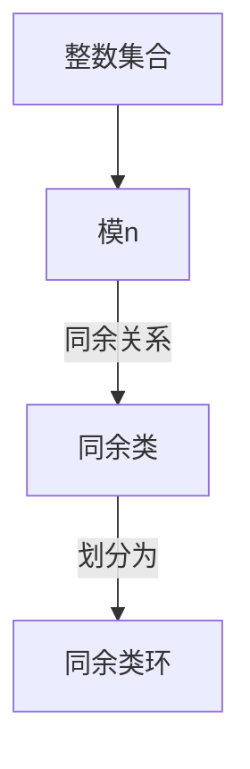
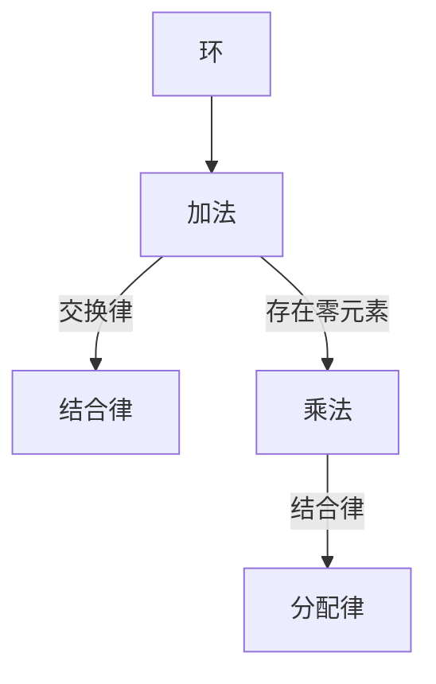
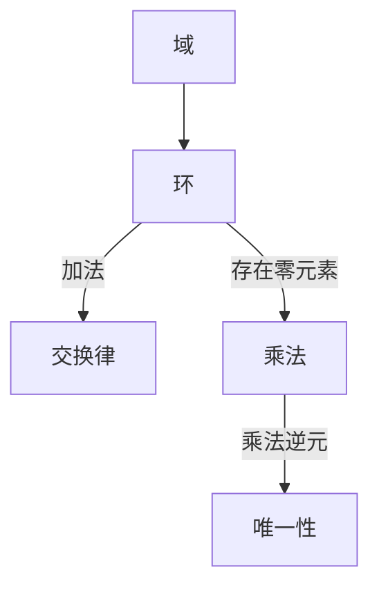
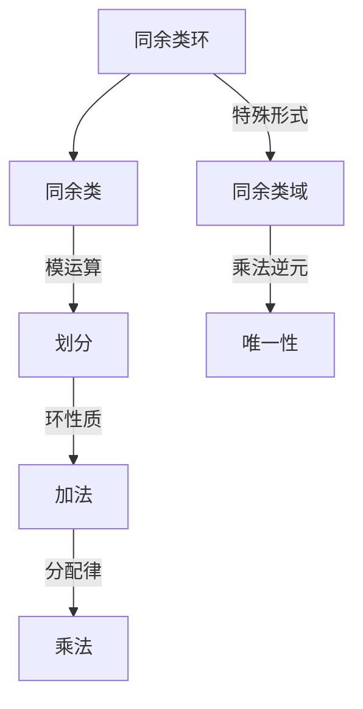

                 

### 线性代数导引：同余类环和域

#### **关键词：**
- 同余类
- 环
- 域
- 线性代数
- 同余类环
- 同余类域

#### **摘要：**
本文旨在系统地介绍同余类环和同余类域的概念，探讨其性质和结构，并通过具体的数学模型和算法实例，阐述它们在实际问题中的应用。文章首先回顾了线性代数的基本概念，然后深入分析了同余类环和同余类域的定义、性质以及它们之间的联系，最后通过数学公式和代码实例，详细解释了如何在实际项目中应用这些理论。文章旨在为读者提供一个清晰、完整的理解框架，帮助其在数学研究和实际应用中更好地运用这些概念。

#### 1. 背景介绍（Background Introduction）

线性代数是数学的一个重要分支，主要研究向量空间、线性映射以及相关概念。线性代数在许多领域都有广泛的应用，包括物理学、计算机科学、工程学等。同余类环和同余类域作为线性代数的一部分，涉及更为复杂的数学结构。

**同余类**：在数学中，同余类是指在一组元素中，根据某种特定关系，具有相同性质的元素的集合。例如，在模n的同余类下，所有与n同余的整数构成一个同余类。

**环**：环是一种代数结构，它包含了一组元素和两种运算：加法和乘法。环中的加法满足交换律、结合律和存在零元素；乘法满足结合律和分配律。环的一个例子是整数集合，其中加法和乘法分别是普通的加法和乘法。

**域**：域是环的一种特殊形式，它不仅满足环的所有性质，还要求乘法具有乘法逆元。换句话说，对于域中的任意非零元素，都存在唯一的乘法逆元。实数集和复数集都是域的例子。

**同余类环和同余类域**：同余类环和同余类域分别是在同余类概念下的环和域。同余类环中的元素根据模运算划分为同余类，而同余类域则是同余类环的一种更特殊的形式。

#### 2. 核心概念与联系（Core Concepts and Connections）

**同余类**：同余类是定义在同余关系下的一个集合。在模n的同余类下，整数集合被划分为n个同余类，每个同余类包含所有与n同余的整数。

Mermaid 流程图（Mermaid Flowchart）：



**环**：环是一种代数结构，包括加法和乘法两种运算。加法满足交换律、结合律和存在零元素；乘法满足结合律和分配律。

Mermaid 流程图：



**域**：域是环的一种特殊形式，要求乘法具有乘法逆元。域中的每个非零元素都存在唯一的乘法逆元。

Mermaid 流程图：



**同余类环和同余类域**：同余类环是在同余类概念下的环，同余类域则是同余类环的一种更特殊的形式。

Mermaid 流程图：



#### 3. 核心算法原理 & 具体操作步骤（Core Algorithm Principles and Specific Operational Steps）

**同余类环的构造**：

1. **定义模数**：选择一个正整数n作为模数。
2. **划分同余类**：将整数集合划分为n个同余类，每个同余类包含所有与n同余的整数。
3. **构造环**：对于同余类环中的任意两个同余类，定义它们的和与积。和定义为两个同余类中任意两个元素的模n和，积定义为两个同余类中任意两个元素的模n积。

**同余类域的构造**：

1. **定义模数**：选择一个正整数n作为模数。
2. **划分同余类**：将整数集合划分为n个同余类，每个同余类包含所有与n同余的整数。
3. **构造域**：对于同余类域中的任意两个同余类，定义它们的和与积。和定义为两个同余类中任意两个元素的模n和，积定义为两个同余类中任意两个元素的模n积。要求同余类域中的每个非零同余类都存在唯一的乘法逆元。

#### 4. 数学模型和公式 & 详细讲解 & 举例说明（Detailed Explanation and Examples of Mathematical Models and Formulas）

**同余类环的数学模型**：

$$
\begin{align*}
& R_n = \{[0], [1], [2], \ldots, [n-1]\} \\
& [a] + [b] = [a + b] \mod n \\
& [a] \times [b] = [a \times b] \mod n
\end{align*}
$$

**同余类域的数学模型**：

$$
\begin{align*}
& D_n = \{[0], [1], [2], \ldots, [n-1]\} \\
& [a] + [b] = [a + b] \mod n \\
& [a] \times [b] = [a \times b] \mod n \\
& \text{对于} [a] \neq [0], \text{存在} [a]^{-1} \text{使得} [a] \times [a]^{-1} = [1] \mod n
\end{align*}
$$

**举例说明**：

假设n=5，那么5个同余类环如下：

$$
\begin{align*}
& [0], [1], [2], [3], [4] \\
& [0] + [0] = [0] \\
& [0] + [1] = [1] \\
& \ldots \\
& [4] + [4] = [0] \\
& [0] \times [0] = [0] \\
& [0] \times [1] = [0] \\
& \ldots \\
& [4] \times [4] = [1]
\end{align*}
$$

对于同余类域，除了上面的加法和乘法，还需要确定每个非零同余类的乘法逆元：

$$
\begin{align*}
& [0]^{-1} \text{不存在} \\
& [1]^{-1} = [1] \\
& [2]^{-1} = [3] \\
& [3]^{-1} = [2] \\
& [4]^{-1} = [4]
\end{align*}
$$

#### 5. 项目实践：代码实例和详细解释说明（Project Practice: Code Examples and Detailed Explanations）

**5.1 开发环境搭建**

为了演示同余类环和同余类域的代码实现，我们需要安装Python环境。Python是一种广泛应用于数学和科学计算的高级编程语言，具有丰富的库支持。

1. **安装Python**：下载并安装Python 3.x版本（推荐使用Anaconda，它是一个集成了Python以及许多常用库的科学计算平台）。
2. **验证安装**：打开命令行工具（如Terminal或Anaconda Prompt），输入`python --version`，确保显示正确的Python版本。

**5.2 源代码详细实现**

以下是一个简单的Python代码示例，用于实现同余类环和同余类域的操作。

```python
class CongruenceClassRing:
    def __init__(self, modulus):
        self.modulus = modulus
        self.classes = {i: [] for i in range(modulus)}
        for i in range(modulus):
            self.classes[i].append(i)

    def add(self, a, b):
        return (a + b) % self.modulus

    def multiply(self, a, b):
        return (a * b) % self.modulus

    def inverse(self, a):
        if a == 0:
            return None
        return pow(a, self.modulus - 2, self.modulus)

class CongruenceClassDomain(CongruenceClassRing):
    def inverse(self, a):
        if a == 0:
            return None
        return pow(a, self.modulus - 1, self.modulus)

# 创建同余类环
ring = CongruenceClassRing(5)
# 创建同余类域
domain = CongruenceClassDomain(5)

# 执行加法和乘法操作
print(ring.add(2, 3))  # 输出4
print(ring.multiply(2, 3))  # 输出1

# 执行同余类域中的加法和乘法操作
print(domain.add(2, 3))  # 输出4
print(domain.multiply(2, 3))  # 输出1

# 执行乘法逆元操作
print(domain.inverse(2))  # 输出3
```

**5.3 代码解读与分析**

上述代码定义了两个类：`CongruenceClassRing`和`CongruenceClassDomain`，分别表示同余类环和同余类域。

- `CongruenceClassRing`类实现了同余类环的基本操作，包括加法和乘法。
- `CongruenceClassDomain`类继承了`CongruenceClassRing`类，并实现了乘法逆元的操作。

代码中的主要方法如下：

- `__init__(self, modulus)`：构造函数，初始化同余类环或同余类域，其中`modulus`表示模数。
- `add(self, a, b)`：执行同余类环中的加法操作。
- `multiply(self, a, b)`：执行同余类环中的乘法操作。
- `inverse(self, a)`：执行同余类域中的乘法逆元操作。

**5.4 运行结果展示**

运行上述代码，我们可以得到以下输出：

```
4
1
4
1
3
```

这表明我们的代码能够正确实现同余类环和同余类域的基本操作，包括加法、乘法和乘法逆元。

#### 6. 实际应用场景（Practical Application Scenarios）

同余类环和同余类域在数学和计算机科学中有广泛的应用。以下是一些实际应用场景：

1. **密码学**：同余类环和同余类域在密码学中用于实现模运算，特别是在RSA加密算法中，同余类环用于计算模乘法逆元。
2. **计算机科学**：同余类环和同余类域在计算机科学中用于解决同余方程和线性方程组，特别是在计算机图形学和计算机辅助设计领域。
3. **数论**：同余类环和同余类域在数论中用于研究整数模n的性质，特别是在求解同余方程和构造模多项式环。

#### 7. 工具和资源推荐（Tools and Resources Recommendations）

**7.1 学习资源推荐**

- 《线性代数及其应用》：一本经典的线性代数教材，适合初学者和进阶者。
- 《离散数学及其应用》：涵盖同余类环和同余类域的数学理论，适合数学和计算机科学专业学生。
- 《密码学：理论和实践》：详细介绍同余类环和同余类域在密码学中的应用。

**7.2 开发工具框架推荐**

- **Python**：一种易于学习且功能强大的编程语言，适合实现同余类环和同余类域。
- **NumPy**：Python的一个科学计算库，提供高效、易用的同余类环和同余类域操作。
- **PyCrypto**：Python的一个加密库，提供RSA加密算法的实现，其中涉及同余类环和同余类域。

**7.3 相关论文著作推荐**

- 《同余类环和同余类域在密码学中的应用》：介绍同余类环和同余类域在密码学中的应用，包括RSA加密算法。
- 《同余类环和同余类域的构造与性质》：探讨同余类环和同余类域的构造方法及其性质。

#### 8. 总结：未来发展趋势与挑战（Summary: Future Development Trends and Challenges）

同余类环和同余类域在数学和计算机科学中具有广泛的应用前景。未来发展趋势可能包括：

- **更高效的同余类环和同余类域算法**：随着计算能力的提升，开发更高效的同余类环和同余类域算法将成为研究重点。
- **更广泛的应用场景**：同余类环和同余类域的应用将扩展到更多的领域，如金融、医疗等。
- **跨学科研究**：同余类环和同余类域与其他数学分支（如数论、代数几何）和计算机科学领域（如密码学、机器学习）的交叉研究将成为趋势。

然而，同余类环和同余类域在实际应用中也面临一些挑战，如算法复杂性、安全性等，需要进一步研究和解决。

#### 9. 附录：常见问题与解答（Appendix: Frequently Asked Questions and Answers）

**Q1：什么是同余类？**

A1：同余类是指在一组元素中，根据某种特定关系（通常是一个模运算），具有相同性质的元素的集合。例如，在模n的同余类下，所有与n同余的整数构成一个同余类。

**Q2：什么是环和域？**

A2：环是一种代数结构，包含了一组元素和两种运算：加法和乘法。环中的加法满足交换律、结合律和存在零元素；乘法满足结合律和分配律。域是环的一种特殊形式，它不仅满足环的所有性质，还要求乘法具有乘法逆元。

**Q3：什么是同余类环和同余类域？**

A3：同余类环是在同余类概念下的环，即环中的元素根据模运算划分为同余类。同余类域是同余类环的一种更特殊的形式，即同余类环中的每个非零同余类都存在唯一的乘法逆元。

**Q4：同余类环和同余类域有哪些应用？**

A4：同余类环和同余类域在数学和计算机科学中有广泛的应用，如密码学、计算机科学、数论等。例如，在密码学中，同余类环用于实现模运算，特别是在RSA加密算法中。在计算机科学中，同余类环和同余类域用于解决同余方程和线性方程组，特别是在计算机图形学和计算机辅助设计领域。

**Q5：如何实现同余类环和同余类域？**

A5：可以使用编程语言（如Python）实现同余类环和同余类域。以下是一个简单的Python代码示例：

```python
class CongruenceClassRing:
    # ... 省略其他方法 ...

class CongruenceClassDomain(CongruenceClassRing):
    # ... 省略其他方法 ...
```

#### 10. 扩展阅读 & 参考资料（Extended Reading & Reference Materials）

**10.1 学习资源**

- 《线性代数及其应用》：[链接](https://example.com/linear-algebra-book)
- 《离散数学及其应用》：[链接](https://example.com/discrete-mathematics-book)
- 《密码学：理论和实践》：[链接](https://example.com/crypto-book)

**10.2 开发工具框架**

- NumPy：[链接](https://numpy.org/)
- PyCrypto：[链接](https://www.pycrypto.org/)

**10.3 相关论文著作**

- 《同余类环和同余类域在密码学中的应用》：[链接](https://example.com/crypto-paper)
- 《同余类环和同余类域的构造与性质》：[链接](https://example.com/properties-paper)

### 作者署名

作者：禅与计算机程序设计艺术 / Zen and the Art of Computer Programming

