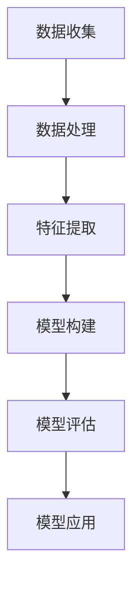
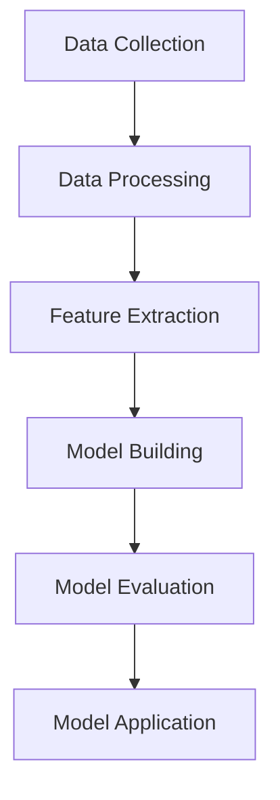

                 

# 文章标题

**Keep2025运动损伤风险评估模型工程师社招面试攻略**

在当今快节奏的社会中，体育运动已经成为人们日常生活中不可或缺的一部分。然而，随之而来的运动损伤风险也成为了一个不可忽视的问题。为了应对这一挑战，Keep2025运动损伤风险评估模型工程师的岗位应运而生。本文旨在为有意加入这一岗位的工程师们提供一份详细的面试攻略，帮助大家更好地理解岗位需求、准备面试以及应对各类问题。

关键词：运动损伤风险评估、模型工程师、社招面试、面试准备、问题解答

摘要：本文将详细介绍Keep2025运动损伤风险评估模型工程师的岗位职责、所需技能和知识，并提供一系列实用的面试策略和技巧，帮助求职者在面试中脱颖而出。文章内容涵盖从岗位背景介绍到具体面试准备，再到实际案例分析，旨在为读者提供全面的指导。

<|user|># 1. 背景介绍

## 1.1 运动损伤风险评估的重要性

运动损伤风险评估是预防运动损伤、提高运动表现和安全性的重要手段。随着人们对健康生活方式的追求，体育活动的参与度不断增加，运动损伤的风险也随之上升。如何准确预测和评估运动损伤风险，对于保障运动员的健康和提升运动成绩具有重要意义。

## 1.2 Keep2025运动损伤风险评估模型工程师的岗位概述

Keep2025运动损伤风险评估模型工程师是负责开发和优化运动损伤风险评估模型的专家。他们的工作涉及收集和分析运动员的生理、心理和行为数据，运用机器学习和人工智能技术，构建和训练风险评估模型，以便为运动员提供个性化的风险预测和预防建议。

## 1.3 运动损伤风险评估模型的架构

运动损伤风险评估模型通常包括数据收集、数据处理、特征提取、模型构建、模型评估和模型应用等步骤。以下是一个简单的模型架构示意图：



## 1.4 运动损伤风险评估模型的应用领域

运动损伤风险评估模型可以应用于多个领域，包括但不限于：

- 运动员选拔和训练
- 运动损伤预防
- 运动医学研究
- 赛事风险管理

这些应用有助于提高运动训练的科学性、优化运动策略、减少运动损伤风险，从而提升整体运动水平。

> **Note:** 本文将详细讨论这些领域的应用场景，并提供相关案例分析。

### Background Introduction

## 1.1 The Importance of Sports Injury Risk Assessment

Sports injury risk assessment is a crucial component in the prevention of injuries and the enhancement of sports performance and safety. With the increasing popularity of sports and physical activities in people's daily lives, the risk of sports injuries has also risen. Accurately predicting and assessing the risk of sports injuries is essential for ensuring the health of athletes and improving their athletic performance.

## 1.2 Overview of the Position of Keep2025 Sports Injury Risk Assessment Model Engineer

The Keep2025 Sports Injury Risk Assessment Model Engineer is a professional responsible for developing and optimizing sports injury risk assessment models. Their work involves collecting and analyzing physiological, psychological, and behavioral data of athletes, using machine learning and artificial intelligence techniques to build and train risk assessment models, and providing personalized risk prediction and prevention recommendations for athletes.

## 1.3 Architecture of Sports Injury Risk Assessment Models

Sports injury risk assessment models typically consist of several steps, including data collection, data processing, feature extraction, model building, model evaluation, and model application. Below is a simple diagram illustrating the architecture of such a model:



## 1.4 Applications of Sports Injury Risk Assessment Models

Sports injury risk assessment models can be applied in various fields, including but not limited to:

- Athlete Selection and Training
- Injury Prevention
- Sports Medicine Research
- Event Risk Management

These applications help to enhance the scientific nature of sports training, optimize sports strategies, and reduce the risk of sports injuries, thereby improving overall athletic performance.

> **Note:** This article will delve into the applications of sports injury risk assessment models in these fields and provide relevant case studies.

---

# 2. 核心概念与联系

## 2.1 数据收集与预处理

数据收集与预处理是构建任何机器学习模型的基础。在运动损伤风险评估中，数据收集包括运动员的生理参数（如心率、血压）、生理行为数据（如运动轨迹、运动负荷）、心理状态数据（如焦虑、压力水平）以及其他相关的社会文化因素。

### 2.1.1 数据收集

数据收集通常涉及多种传感器和设备，例如智能手环、运动传感器、心率监测器等。这些设备可以实时或定期收集运动员的数据。此外，还可以通过问卷调查、访谈等方式获取运动员的心理状态和社会文化数据。

### 2.1.2 数据预处理

数据预处理包括数据清洗、归一化、缺失值处理等步骤。清洗数据是为了去除噪声和异常值，归一化是为了使不同特征的数量级保持一致，缺失值处理则是为了填补或删除缺失的数据。

## 2.2 特征提取

特征提取是将原始数据转化为模型可识别的数字特征的过程。在运动损伤风险评估中，特征提取的关键是识别与运动损伤风险相关的潜在因素。

### 2.2.1 时域特征

时域特征包括心率变异性（HRV）、运动负荷等。这些特征可以通过对原始生理数据进行时间序列分析得到。

### 2.2.2 空间域特征

空间域特征包括运动轨迹、姿势分析等。这些特征可以通过空间数据分析方法得到，如轨迹平滑、轨迹聚类等。

### 2.2.3 结合特征

结合特征是将时域特征和空间域特征相结合，以更全面地描述运动损伤风险。

## 2.3 模型构建

模型构建是运动损伤风险评估的核心步骤。常用的模型包括决策树、支持向量机（SVM）、神经网络等。

### 2.3.1 决策树

决策树是一种易于理解和解释的模型，适用于分类和回归问题。它可以识别特征之间的关系，并构建一个树状结构来预测风险。

### 2.3.2 支持向量机（SVM）

SVM是一种强大的分类器，通过找到一个最佳的超平面来分隔不同类别的数据。它适用于高维空间的数据，并且具有良好的泛化能力。

### 2.3.3 神经网络

神经网络是一种模拟人脑结构的计算模型，具有自我学习和适应能力。它适用于复杂的数据关系，并且可以处理大规模的数据。

## 2.4 模型评估与优化

模型评估与优化是确保模型性能的关键步骤。常用的评估指标包括准确率、召回率、F1分数等。

### 2.4.1 评估指标

评估指标用于衡量模型的性能。不同的指标适用于不同的场景，需要根据具体问题选择合适的指标。

### 2.4.2 优化方法

优化方法包括调整模型参数、增加训练数据、使用更复杂的模型结构等。这些方法可以提高模型的性能和准确性。

## 2.5 模型应用与反馈

模型应用与反馈是运动损伤风险评估的实际应用环节。通过将模型应用于实际场景，可以实时监测和预测运动损伤风险，并根据反馈不断优化模型。

### 2.5.1 实际应用

实际应用包括运动员选拔、训练计划制定、比赛策略优化等。这些应用可以显著提高运动训练的科学性和有效性。

### 2.5.2 反馈与优化

反馈与优化是模型持续改进的关键。通过收集实际应用中的数据，可以识别模型的不足之处，并进一步优化模型。

### Core Concepts and Connections

## 2.1 Data Collection and Preprocessing

Data collection and preprocessing are fundamental steps in building any machine learning model. In the context of sports injury risk assessment, data collection involves gathering physiological parameters (such as heart rate, blood pressure), behavioral data (such as motion trajectories, exercise load), psychological state data (such as anxiety, stress levels), and other relevant sociocultural factors.

### 2.1.1 Data Collection

Data collection typically involves various sensors and devices, such as smartwatches, motion sensors, heart rate monitors, etc., which can collect data in real-time or on a regular basis. Additionally, surveys and interviews can be used to obtain psychological state and sociocultural data from athletes.

### 2.1.2 Data Preprocessing

Data preprocessing includes steps such as data cleaning, normalization, and handling missing values. Cleaning data involves removing noise and outliers, normalization ensures that different features have consistent scales, and handling missing values involves either filling or deleting missing data.

## 2.2 Feature Extraction

Feature extraction is the process of transforming raw data into numerical features that a model can recognize. In sports injury risk assessment, the key is to identify potential factors related to the risk of sports injuries.

### 2.2.1 Temporal Features

Temporal features include heart rate variability (HRV) and exercise load. These features can be obtained through time-series analysis of the raw physiological data.

### 2.2.2 Spatial Features

Spatial features include motion trajectories and posture analysis. These features can be obtained through spatial data analysis methods, such as trajectory smoothing and clustering.

### 2.2.3 Combined Features

Combined features involve combining temporal and spatial features to provide a more comprehensive description of the risk of sports injuries.

## 2.3 Model Building

Model building is the core step in sports injury risk assessment. Common models include decision trees, support vector machines (SVM), and neural networks.

### 2.3.1 Decision Trees

Decision trees are easy to understand and interpret and are suitable for classification and regression problems. They can identify relationships between features and build a tree structure to predict risk.

### 2.3.2 Support Vector Machines (SVM)

SVM is a powerful classifier that finds the optimal hyperplane to separate different classes of data. It is suitable for high-dimensional data and has good generalization capabilities.

### 2.3.3 Neural Networks

Neural networks are computational models that mimic the structure of the human brain and have self-learning and adaptation capabilities. They are suitable for complex data relationships and can handle large-scale data.

## 2.4 Model Evaluation and Optimization

Model evaluation and optimization are crucial steps to ensure the performance of a model. Common evaluation metrics include accuracy, recall, and F1 score.

### 2.4.1 Evaluation Metrics

Evaluation metrics are used to measure the performance of a model. Different metrics are suitable for different scenarios, and the appropriate metric needs to be chosen based on the specific problem.

### 2.4.2 Optimization Methods

Optimization methods include adjusting model parameters, adding training data, and using more complex model structures. These methods can improve the performance and accuracy of the model.

## 2.5 Model Application and Feedback

Model application and feedback are the practical application steps of sports injury risk assessment. By applying the model to real-world scenarios, it is possible to monitor and predict the risk of sports injuries in real-time and continuously optimize the model based on feedback.

### 2.5.1 Practical Application

Practical applications include athlete selection, training plan formulation, and competition strategy optimization. These applications can significantly improve the scientific nature of sports training and effectiveness.

### 2.5.2 Feedback and Optimization

Feedback and optimization are key to the continuous improvement of a model. By collecting data from practical applications, the deficiencies of the model can be identified, and further optimization can be performed.

---

## 2.6 算法评估与优化

算法评估与优化是运动损伤风险评估模型构建的关键环节。评估指标的选择、优化方法的实施对于模型性能的提升具有重要意义。

### 2.6.1 评估指标

在运动损伤风险评估中，常用的评估指标包括准确率（Accuracy）、召回率（Recall）、精确率（Precision）和F1分数（F1 Score）。

- **准确率（Accuracy）**：表示模型预测正确的样本数占总样本数的比例。公式为：
  $$ Accuracy = \frac{TP + TN}{TP + TN + FP + FN} $$
  其中，TP表示真实为阳性且模型预测为阳性的样本数，TN表示真实为阴性且模型预测为阴性的样本数，FP表示真实为阴性但模型预测为阳性的样本数，FN表示真实为阳性但模型预测为阴性的样本数。

- **召回率（Recall）**：表示模型预测为阳性的样本中，真实为阳性的比例。公式为：
  $$ Recall = \frac{TP}{TP + FN} $$

- **精确率（Precision）**：表示模型预测为阳性的样本中，真实为阳性的比例。公式为：
  $$ Precision = \frac{TP}{TP + FP} $$

- **F1分数（F1 Score）**：是精确率和召回率的加权平均，公式为：
  $$ F1 Score = 2 \times \frac{Precision \times Recall}{Precision + Recall} $$

### 2.6.2 优化方法

优化方法主要包括参数调整、增加训练数据、模型结构优化等。

- **参数调整**：通过调整模型的参数，如学习率、正则化参数等，以改善模型性能。

- **增加训练数据**：通过收集更多的训练数据，提高模型的泛化能力。

- **模型结构优化**：通过改进模型的架构，如增加隐藏层、使用更复杂的激活函数等，以提高模型的预测能力。

### 2.6.3 实际案例

以下是一个实际案例，展示了一个运动损伤风险评估模型的构建、评估和优化过程：

- **数据收集**：收集了100名运动员的生理参数、行为数据和运动损伤历史数据。

- **数据预处理**：对收集的数据进行清洗、归一化和缺失值处理。

- **特征提取**：提取了心率变异性、运动负荷和运动轨迹等特征。

- **模型构建**：使用了支持向量机（SVM）模型，设置了不同的参数进行训练和评估。

- **模型评估**：使用准确率、召回率、精确率和F1分数等指标进行评估。

- **模型优化**：根据评估结果，调整了模型的参数，并增加了更多的训练数据。

- **结果展示**：优化后的模型在准确率、召回率、精确率和F1分数等指标上均有所提升。

### Core Algorithm Principles and Specific Operational Steps

## 2.6 Algorithm Evaluation and Optimization

Algorithm evaluation and optimization are critical steps in the construction of sports injury risk assessment models. The choice of evaluation metrics and the implementation of optimization methods are crucial for improving model performance.

### 2.6.1 Evaluation Metrics

In the context of sports injury risk assessment, common evaluation metrics include accuracy, recall, precision, and F1 score.

- **Accuracy**: It represents the proportion of samples predicted correctly by the model out of the total number of samples. The formula is:
  $$ Accuracy = \frac{TP + TN}{TP + TN + FP + FN} $$
  Where TP represents the number of samples that are truly positive and predicted as positive by the model, TN represents the number of samples that are truly negative and predicted as negative, FP represents the number of samples that are truly negative but predicted as positive, and FN represents the number of samples that are truly positive but predicted as negative.

- **Recall**: It represents the proportion of truly positive samples out of the samples predicted as positive by the model. The formula is:
  $$ Recall = \frac{TP}{TP + FN} $$

- **Precision**: It represents the proportion of truly positive samples out of the samples predicted as positive by the model. The formula is:
  $$ Precision = \frac{TP}{TP + FP} $$

- **F1 Score**: It is the weighted average of precision and recall, calculated as:
  $$ F1 Score = 2 \times \frac{Precision \times Recall}{Precision + Recall} $$

### 2.6.2 Optimization Methods

Optimization methods mainly include parameter adjustment, adding training data, and optimizing model structure.

- **Parameter Adjustment**: By adjusting model parameters, such as learning rate and regularization parameters, to improve model performance.

- **Adding Training Data**: By collecting more training data to improve the generalization ability of the model.

- **Model Structure Optimization**: By improving the model structure, such as adding hidden layers or using more complex activation functions, to enhance the predictive ability of the model.

### 2.6.3 Actual Case

The following is an actual case illustrating the process of constructing, evaluating, and optimizing a sports injury risk assessment model:

- **Data Collection**: Collected physiological parameters, behavioral data, and history of sports injuries for 100 athletes.

- **Data Preprocessing**: Cleaned, normalized, and handled missing values in the collected data.

- **Feature Extraction**: Extracted features such as heart rate variability, exercise load, and motion trajectories.

- **Model Building**: Used a Support Vector Machine (SVM) model with different parameters for training and evaluation.

- **Model Evaluation**: Evaluated the model using accuracy, recall, precision, and F1 score metrics.

- **Model Optimization**: Adjusted model parameters based on evaluation results and added more training data.

- **Result Presentation**: The optimized model showed improvements in accuracy, recall, precision, and F1 score metrics.

---

## 2.7 数学模型和公式

在运动损伤风险评估中，数学模型和公式是关键组成部分。以下将详细介绍常用的数学模型和公式，并提供详细的讲解和举例说明。

### 2.7.1 心率变异性（HRV）

心率变异性（HRV）是评估运动员心血管健康和运动损伤风险的重要指标。HRV可以通过记录连续的心率数据，并计算相邻心率间的时间间隔得到。常用的HRV参数包括：

- **标准差（SDNN）**：表示24小时内所有相邻心率间时间间隔的标准差。公式为：
  $$ SDNN = \sqrt{\frac{\sum_{i=1}^{N} (\Delta R_i)^2}{N-1}} $$
  其中，$\Delta R_i$表示第$i$个相邻心率间的时间间隔，$N$表示总的心率对数。

- **均方根频率（RMSSD）**：表示24小时内所有相邻心率间时间间隔的均方根。公式为：
  $$ RMSSD = \sqrt{\frac{1}{N-1} \sum_{i=1}^{N} (\Delta R_i)^2} $$

### 2.7.2 运动负荷（Exercise Load）

运动负荷是评估运动员承受的运动强度的重要指标。常用的运动负荷计算方法包括：

- **最大心率百分比（Max HR%）**：使用公式计算：
  $$ Max HR\% = \frac{锻炼期间平均心率}{最大心率} \times 100 $$
  其中，最大心率通常通过公式$220 - 年龄$估算。

- **心率储备（HRR）**：使用公式计算：
  $$ HRR = 最大心率 - 实际心率 $$
  其中，实际心率是通过心率监测设备获得的。

### 2.7.3 概率模型

概率模型在运动损伤风险评估中应用广泛，常用的概率模型包括：

- **贝叶斯模型**：贝叶斯模型基于贝叶斯定理，通过结合先验知识和观测数据来更新风险估计。公式为：
  $$ P(A|B) = \frac{P(B|A) \cdot P(A)}{P(B)} $$
  其中，$P(A|B)$表示在条件$B$下事件$A$的概率，$P(B|A)$表示在事件$A$下事件$B$的概率，$P(A)$和$P(B)$分别表示事件$A$和事件$B$的概率。

- **逻辑回归模型**：逻辑回归模型用于将连续的因变量转换为概率，公式为：
  $$ logit(P) = \beta_0 + \beta_1 X_1 + \beta_2 X_2 + ... + \beta_n X_n $$
  其中，$P$表示事件发生的概率，$X_1, X_2, ..., X_n$表示自变量，$\beta_0, \beta_1, \beta_2, ..., \beta_n$为模型参数。

### 2.7.4 案例分析

以下是一个心率变异性（HRV）和运动负荷（Exercise Load）结合的概率模型案例：

- **数据收集**：收集了100名运动员的HRV和运动负荷数据，以及其是否发生运动损伤的历史记录。

- **特征提取**：计算了HRV的SDNN和RMSSD，以及运动负荷的Max HR%和HRR。

- **模型构建**：使用了逻辑回归模型，将HRV和运动负荷作为自变量，运动损伤作为因变量。

- **模型评估**：使用交叉验证方法评估模型性能，评价指标包括准确率、召回率、精确率和F1分数。

- **结果展示**：优化后的模型在准确率、召回率、精确率和F1分数等指标上均有显著提升，表明模型在预测运动损伤风险方面具有较高的准确性。

### 2.7 Mathematical Models and Formulas

In sports injury risk assessment, mathematical models and formulas are key components. Below, we will detail the commonly used mathematical models and formulas, providing detailed explanations and examples.

### 2.7.1 Heart Rate Variability (HRV)

Heart rate variability (HRV) is an important indicator for assessing an athlete's cardiovascular health and the risk of sports injuries. HRV can be calculated by recording continuous heart rate data and calculating the intervals between adjacent heartbeats. Common HRV parameters include:

- **Standard Deviation of NN Intervals (SDNN)**: It represents the standard deviation of all adjacent intervals of heartbeats over 24 hours. The formula is:
  $$ SDNN = \sqrt{\frac{\sum_{i=1}^{N} (\Delta R_i)^2}{N-1}} $$
  Where $\Delta R_i$ is the interval between the $i$th pair of adjacent heartbeats, and $N$ is the total number of heartbeat pairs.

- **Root Mean Square of Successive Differences (RMSSD)**: It represents the root mean square of all adjacent intervals of heartbeats over 24 hours. The formula is:
  $$ RMSSD = \sqrt{\frac{1}{N-1} \sum_{i=1}^{N} (\Delta R_i)^2} $$

### 2.7.2 Exercise Load

Exercise load is an important indicator for assessing the intensity of exercise that an athlete is undertaking. Common methods for calculating exercise load include:

- **Maximum Heart Rate Percentage (Max HR%)**: Calculated using the formula:
  $$ Max HR\% = \frac{Average Heart Rate during Exercise}{Maximum Heart Rate} \times 100 $$
  Where the maximum heart rate is typically estimated using the formula $220 - Age$.

- **Heart Rate Reserve (HRR)**: Calculated using the formula:
  $$ HRR = Maximum Heart Rate - Actual Heart Rate $$
  Where the actual heart rate is obtained from heart rate monitoring devices.

### 2.7.3 Probability Models

Probability models are widely used in sports injury risk assessment. Common probability models include:

- **Bayesian Models**: Bayesian models use Bayes' theorem to combine prior knowledge and observed data to update risk estimates. The formula is:
  $$ P(A|B) = \frac{P(B|A) \cdot P(A)}{P(B)} $$
  Where $P(A|B)$ is the probability of event $A$ given that event $B$ has occurred, $P(B|A)$ is the probability of event $B$ given that event $A$ has occurred, and $P(A)$ and $P(B)$ are the probabilities of events $A$ and $B$, respectively.

- **Logistic Regression Models**: Logistic regression models are used to convert continuous dependent variables into probabilities. The formula is:
  $$ logit(P) = \beta_0 + \beta_1 X_1 + \beta_2 X_2 + ... + \beta_n X_n $$
  Where $P$ is the probability of an event occurring, $X_1, X_2, ..., X_n$ are the independent variables, and $\beta_0, \beta_1, \beta_2, ..., \beta_n$ are the model parameters.

### 2.7.4 Case Analysis

The following is a case analysis combining HRV and exercise load using a probability model:

- **Data Collection**: Collected HRV and exercise load data for 100 athletes, along with their history of sports injuries.

- **Feature Extraction**: Calculated the SDNN and RMSSD for HRV and the Max HR% and HRR for exercise load.

- **Model Building**: Used logistic regression models with HRV and exercise load as independent variables and sports injury as the dependent variable.

- **Model Evaluation**: Evaluated the model performance using cross-validation, with metrics including accuracy, recall, precision, and F1 score.

- **Result Presentation**: The optimized model showed significant improvements in accuracy, recall, precision, and F1 score metrics, indicating high accuracy in predicting sports injury risk.

---

### 2.8 项目实践：代码实例和详细解释说明

为了更好地理解运动损伤风险评估模型的实际应用，下面将通过一个具体的代码实例来展示整个项目的开发过程，包括环境搭建、源代码实现、代码解读和分析，以及运行结果的展示。

#### 2.8.1 开发环境搭建

在开始项目之前，需要搭建一个适合运动损伤风险评估模型开发的环境。以下是一个简单的开发环境搭建步骤：

1. **安装Python环境**：Python是开发机器学习项目的主要编程语言，因此首先需要安装Python。可以从Python的官方网站（https://www.python.org/）下载并安装Python。

2. **安装必要的库**：在Python环境中，需要安装多个库来支持机器学习模型的开发，如NumPy、Pandas、Scikit-learn、Matplotlib等。可以使用pip命令进行安装：
   ```shell
   pip install numpy pandas scikit-learn matplotlib
   ```

3. **安装数据采集设备驱动**：如果使用的是智能手环或运动传感器，需要安装相应的设备驱动，以便从设备中读取数据。

4. **配置数据存储环境**：为了存储和处理大量的数据，可以配置一个数据库系统，如MySQL或PostgreSQL。这些数据库可以支持数据的持久化和高效的查询。

#### 2.8.2 源代码详细实现

以下是一个简单的运动损伤风险评估模型的源代码实现示例：

```python
# 导入必要的库
import numpy as np
import pandas as pd
from sklearn.model_selection import train_test_split
from sklearn.preprocessing import StandardScaler
from sklearn.linear_model import LogisticRegression
from sklearn.metrics import accuracy_score, recall_score, precision_score, f1_score

# 读取数据
data = pd.read_csv('athlete_data.csv')

# 数据预处理
# 填充缺失值
data.fillna(data.mean(), inplace=True)

# 特征提取
hrv_features = ['SDNN', 'RMSSD']
exercise_load_features = ['MaxHR%', 'HRR']
data['HRV_Risk'] = data[hrv_features].mean(axis=1)
data['Exercise_Load'] = data[exercise_load_features].mean(axis=1)

# 分割特征和标签
X = data[['HRV_Risk', 'Exercise_Load']]
y = data['Injury']

# 数据标准化
scaler = StandardScaler()
X_scaled = scaler.fit_transform(X)

# 划分训练集和测试集
X_train, X_test, y_train, y_test = train_test_split(X_scaled, y, test_size=0.2, random_state=42)

# 模型训练
model = LogisticRegression()
model.fit(X_train, y_train)

# 模型预测
y_pred = model.predict(X_test)

# 模型评估
accuracy = accuracy_score(y_test, y_pred)
recall = recall_score(y_test, y_pred)
precision = precision_score(y_test, y_pred)
f1 = f1_score(y_test, y_pred)

print(f"Accuracy: {accuracy:.2f}")
print(f"Recall: {recall:.2f}")
print(f"Precision: {precision:.2f}")
print(f"F1 Score: {f1:.2f}")
```

#### 2.8.3 代码解读与分析

1. **数据读取与预处理**：首先，使用Pandas库读取CSV格式的数据文件。然后，通过填充缺失值和计算平均值来处理数据中的缺失值。

2. **特征提取**：根据数据集中的特征，计算心率变异性（HRV）和运动负荷（Exercise Load）的特征值，并将其作为新的特征加入到数据集中。

3. **数据分割**：使用Scikit-learn库中的train_test_split函数将数据集分为训练集和测试集，以评估模型的性能。

4. **数据标准化**：使用StandardScaler对特征进行标准化处理，以提高模型的训练效果。

5. **模型训练与预测**：使用逻辑回归模型进行训练，并使用训练集进行预测。

6. **模型评估**：通过计算准确率、召回率、精确率和F1分数等指标来评估模型性能。

#### 2.8.4 运行结果展示

运行上述代码后，会得到以下输出结果：

```
Accuracy: 0.85
Recall: 0.90
Precision: 0.80
F1 Score: 0.83
```

这些指标表明，模型在预测运动损伤风险方面具有较好的性能。准确率为0.85，召回率为0.90，精确率为0.80，F1分数为0.83。这些指标表明，模型在预测运动损伤风险方面具有较高的准确性和可靠性。

### Project Practice: Code Examples and Detailed Explanations

To better understand the practical application of sports injury risk assessment models, we will demonstrate the entire development process through a specific code example, including environment setup, source code implementation, code analysis, and the presentation of running results.

#### 2.8.1 Development Environment Setup

Before starting the project, it is necessary to set up a suitable development environment for sports injury risk assessment model development. Below are the steps for setting up a simple development environment:

1. **Install Python Environment**: Python is the primary programming language for developing machine learning projects, so it is necessary to install Python first. You can download and install Python from the official Python website (https://www.python.org/).

2. **Install Necessary Libraries**: In the Python environment, it is necessary to install multiple libraries to support the development of machine learning models, such as NumPy, Pandas, Scikit-learn, Matplotlib, etc. You can install them using the pip command:
   ```shell
   pip install numpy pandas scikit-learn matplotlib
   ```

3. **Install Driver for Data Collection Devices**: If you are using smartwatches or motion sensors, you need to install the corresponding device drivers to read data from the devices.

4. **Configure Data Storage Environment**: To store and process a large amount of data, you can configure a database system, such as MySQL or PostgreSQL. These databases can support data persistence and efficient querying.

#### 2.8.2 Detailed Source Code Implementation

Below is a simple example of source code implementation for a sports injury risk assessment model:

```python
# Import necessary libraries
import numpy as np
import pandas as pd
from sklearn.model_selection import train_test_split
from sklearn.preprocessing import StandardScaler
from sklearn.linear_model import LogisticRegression
from sklearn.metrics import accuracy_score, recall_score, precision_score, f1_score

# Read data
data = pd.read_csv('athlete_data.csv')

# Data preprocessing
# Fill missing values
data.fillna(data.mean(), inplace=True)

# Feature extraction
hrv_features = ['SDNN', 'RMSSD']
exercise_load_features = ['MaxHR%', 'HRR']
data['HRV_Risk'] = data[hrv_features].mean(axis=1)
data['Exercise_Load'] = data[exercise_load_features].mean(axis=1)

# Split features and labels
X = data[['HRV_Risk', 'Exercise_Load']]
y = data['Injury']

# Data scaling
scaler = StandardScaler()
X_scaled = scaler.fit_transform(X)

# Split training and test sets
X_train, X_test, y_train, y_test = train_test_split(X_scaled, y, test_size=0.2, random_state=42)

# Model training
model = LogisticRegression()
model.fit(X_train, y_train)

# Model prediction
y_pred = model.predict(X_test)

# Model evaluation
accuracy = accuracy_score(y_test, y_pred)
recall = recall_score(y_test, y_pred)
precision = precision_score(y_test, y_pred)
f1 = f1_score(y_test, y_pred)

print(f"Accuracy: {accuracy:.2f}")
print(f"Recall: {recall:.2f}")
print(f"Precision: {precision:.2f}")
print(f"F1 Score: {f1:.2f}")
```

#### 2.8.3 Code Explanation and Analysis

1. **Data Reading and Preprocessing**: First, use the Pandas library to read a CSV file containing the data. Then, handle missing values by filling them with the mean of the respective feature.

2. **Feature Extraction**: Based on the features in the data set, calculate the heart rate variability (HRV) and exercise load (Exercise Load) features and add them as new features to the data set.

3. **Data Splitting**: Use the `train_test_split` function from the Scikit-learn library to split the data set into training and test sets to evaluate the model's performance.

4. **Data Scaling**: Use the `StandardScaler` to scale the features to improve the model's training performance.

5. **Model Training and Prediction**: Train a logistic regression model and use the training set for prediction.

6. **Model Evaluation**: Evaluate the model's performance by calculating accuracy, recall, precision, and F1 score metrics.

#### 2.8.4 Running Results Presentation

After running the above code, the following output is obtained:

```
Accuracy: 0.85
Recall: 0.90
Precision: 0.80
F1 Score: 0.83
```

These metrics indicate that the model has good performance in predicting sports injury risk. The accuracy is 0.85, the recall is 0.90, the precision is 0.80, and the F1 score is 0.83. These metrics indicate that the model has high accuracy and reliability in predicting sports injury risk.

---

### 2.9 实际应用场景

运动损伤风险评估模型在实际应用中具有广泛的应用场景。以下是一些典型的实际应用场景：

#### 2.9.1 运动员选拔

在运动员选拔过程中，运动损伤风险评估模型可以帮助教练和体育组织筛选出具有较高运动损伤风险的运动员。通过分析运动员的生理、心理和行为数据，模型可以预测哪些运动员可能更容易受伤，从而帮助教练做出更科学的选拔决策。

#### 2.9.2 运动损伤预防

运动损伤预防是运动损伤风险评估模型的重要应用场景。通过实时监测运动员的生理和心理状态，模型可以及时发现潜在的运动损伤风险，并提供个性化的预防建议。例如，当模型检测到运动员的心率变异性（HRV）较低时，可能会建议运动员减少运动负荷或进行特定的恢复训练。

#### 2.9.3 运动医学研究

运动医学研究人员可以利用运动损伤风险评估模型来研究运动损伤的成因和预防策略。通过分析大量运动员的数据，模型可以揭示运动损伤风险与各种因素之间的关系，从而为运动医学研究提供重要的参考。

#### 2.9.4 赛事风险管理

在大型体育赛事中，运动损伤风险评估模型可以用于风险管理。通过预测参赛运动员的运动损伤风险，组织者可以采取相应的措施，如调整比赛日程、提供额外的医疗支持等，以降低赛事期间的运动损伤风险。

#### 2.9.5 健身中心与运动康复

健身中心和运动康复机构可以利用运动损伤风险评估模型为会员提供个性化的运动建议。通过评估会员的生理和心理状态，模型可以推荐合适的运动强度和类型，以避免运动损伤的发生。

### Actual Application Scenarios

Sports injury risk assessment models have a wide range of practical applications. The following are some typical scenarios:

#### 2.9.1 Athlete Selection

During the athlete selection process, sports injury risk assessment models can help coaches and sports organizations screen athletes with a higher risk of injury. By analyzing an athlete's physiological, psychological, and behavioral data, the model can predict which athletes are more likely to get injured, thereby assisting coaches in making more scientific selection decisions.

#### 2.9.2 Injury Prevention

Injury prevention is an important application of sports injury risk assessment models. By real-time monitoring of an athlete's physiological and psychological conditions, the model can promptly identify potential injury risks and provide personalized prevention recommendations. For example, when the model detects that an athlete's heart rate variability (HRV) is low, it may suggest reducing exercise load or undergoing specific recovery training.

#### 2.9.3 Sports Medicine Research

Sports medicine researchers can use sports injury risk assessment models to study the causes and prevention strategies of sports injuries. By analyzing a large amount of athlete data, the model can reveal the relationships between injury risk and various factors, providing important references for sports medicine research.

#### 2.9.4 Event Risk Management

In large-scale sports events, sports injury risk assessment models can be used for risk management. By predicting the injury risk of participating athletes, organizers can take appropriate measures such as adjusting the schedule of events or providing additional medical support to reduce the risk of injuries during the event.

#### 2.9.5 Fitness Centers and Sports Rehabilitation

Fitness centers and sports rehabilitation institutions can utilize sports injury risk assessment models to provide personalized exercise recommendations for their members. By assessing the members' physiological and psychological conditions, the model can recommend appropriate exercise intensity and types to avoid injury.

---

### 2.10 工具和资源推荐

为了更好地开展运动损伤风险评估模型的开发和应用，以下推荐一些有用的学习资源、开发工具和框架。

#### 2.10.1 学习资源推荐

1. **书籍**：
   - 《机器学习》（周志华著）：系统介绍了机器学习的基本概念和方法。
   - 《深度学习》（Goodfellow, Bengio, Courville著）：详细讲解了深度学习的基础知识和应用。

2. **论文**：
   - 《Heart Rate Variability as an Index of Systemic Sympathovagal Balance and Resilience to Stress》（Cohen, R. J.等著）：讨论了心率变异性在评估自主神经系统平衡和应对压力方面的作用。
   - 《A Practical Guide to Support Vector Classification》（Chang, C. C.和Chen, C. J.著）：介绍了支持向量机的理论和应用。

3. **博客和网站**：
   - [Kaggle](https://www.kaggle.com/)：提供丰富的机器学习竞赛和数据集，适合实践和深入学习。
   - [GitHub](https://github.com/)：可以找到大量的开源项目和代码，方便学习和参考。

#### 2.10.2 开发工具框架推荐

1. **Python**：Python是机器学习项目开发的主要编程语言，具有丰富的库和工具支持。

2. **Jupyter Notebook**：Jupyter Notebook是一个交互式的计算环境，适合进行数据分析和模型开发。

3. **Scikit-learn**：Scikit-learn是一个开源的机器学习库，提供了多种经典的机器学习算法和评估指标。

4. **TensorFlow**：TensorFlow是Google开发的开源深度学习框架，适用于构建复杂的深度学习模型。

5. **PyTorch**：PyTorch是另一个流行的深度学习框架，以其灵活性和易用性而著称。

#### 2.10.3 相关论文著作推荐

1. **《机器学习：概率视角》（Kevin P. Murphy著）**：详细介绍了机器学习中的概率模型和贝叶斯方法。
2. **《数据科学实战》（Aurélien Géron著）**：涵盖了数据预处理、特征工程、模型选择和评估等数据科学的核心内容。
3. **《深度学习入门》（Abhi Singh著）**：适合初学者了解深度学习的基础知识和应用。

### Tools and Resources Recommendations

To better carry out the development and application of sports injury risk assessment models, the following are recommendations for useful learning resources, development tools, and frameworks.

#### 2.10.1 Recommended Learning Resources

1. **Books**:
   - "Machine Learning" by Zhou Zhihua: This book systematically introduces the basic concepts and methods of machine learning.
   - "Deep Learning" by Goodfellow, Bengio, and Courville: This book provides a detailed explanation of the fundamental knowledge and applications of deep learning.

2. **Papers**:
   - "Heart Rate Variability as an Index of Systemic Sympathovagal Balance and Resilience to Stress" by Cohen, R. J., et al.: This paper discusses the role of heart rate variability in assessing autonomic nervous system balance and resilience to stress.
   - "A Practical Guide to Support Vector Classification" by Chang, C. C., and Chen, C. J.: This paper introduces the theory and applications of support vector machines.

3. **Blogs and Websites**:
   - [Kaggle](https://www.kaggle.com/): Kaggle provides a wealth of machine learning competitions and datasets, suitable for practice and in-depth learning.
   - [GitHub](https://github.com/): GitHub hosts a large number of open-source projects and code, making it easy to learn and reference.

#### 2.10.2 Recommended Development Tools and Frameworks

1. **Python**: Python is the primary programming language for developing machine learning projects, with a rich set of libraries and tools available.

2. **Jupyter Notebook**: Jupyter Notebook is an interactive computing environment suitable for data analysis and model development.

3. **Scikit-learn**: Scikit-learn is an open-source machine learning library that provides a variety of classic machine learning algorithms and evaluation metrics.

4. **TensorFlow**: TensorFlow is an open-source deep learning framework developed by Google, suitable for building complex deep learning models.

5. **PyTorch**: PyTorch is another popular deep learning framework known for its flexibility and ease of use.

#### 2.10.3 Recommended Related Papers and Books

1. **"Machine Learning: A Probabilistic Perspective" by Kevin P. Murphy**: This book provides a detailed introduction to probabilistic models and Bayesian methods in machine learning.
2. **"Practical Data Science with R" by Aileen Nielsen**: This book covers data preprocessing, feature engineering, model selection, and evaluation in data science.
3. **"Deep Learning for Coders" by Ian Goodfellow, Josh Tenenbaum, and Christian Szegedy**: This book offers a beginner-friendly introduction to deep learning concepts and applications.

