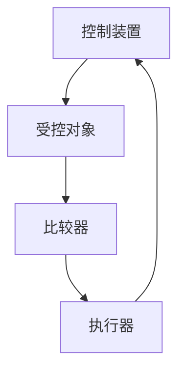
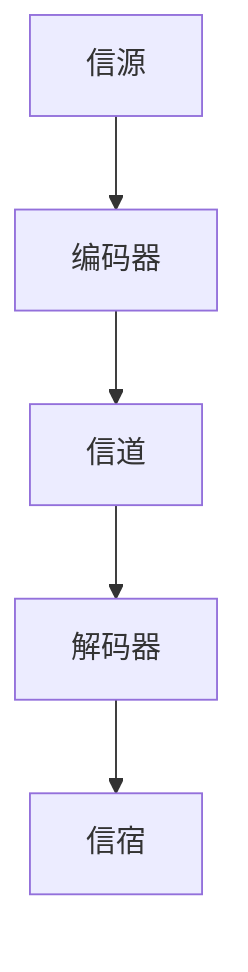
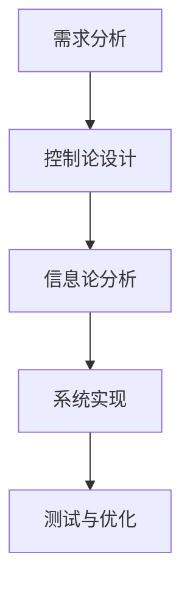
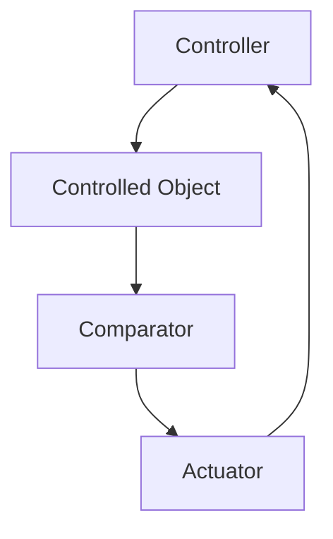
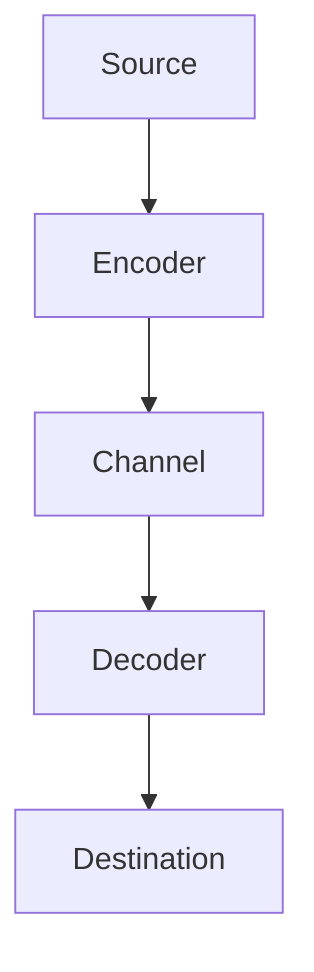
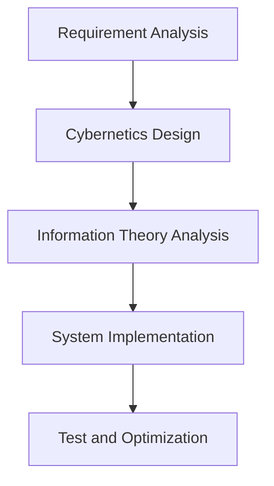
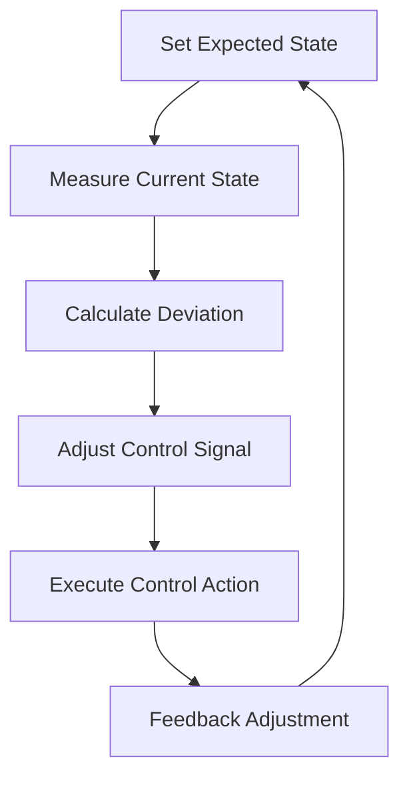
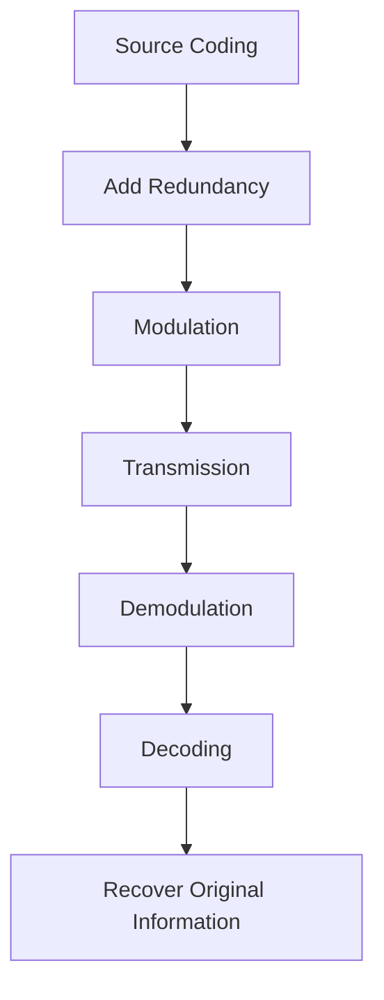

                 

### 背景介绍（Background Introduction）

#### 维纳的控制论（Norbert Wiener's Cybernetics）

控制论（Cybernetics）是一门跨学科的学科，旨在研究复杂系统中的控制、通信和协调问题。控制论的核心是反馈机制，即通过比较系统的实际输出与期望输出，来调整系统的状态，从而实现预期目标。这一概念在工程、生物学、经济学和计算机科学等领域有着广泛的应用。

维纳（Norbert Wiener）是控制论的奠基人之一，他在1948年发表了《控制论：或关于在动物和机器中控制和通信的科学》（Cybernetics: or Control and Communication in the Animal and the Machine）一书，详细阐述了控制论的原理和方法。维纳认为，无论是动物还是机器，它们都具有反馈控制系统，能够根据外部环境的变化来调整自身的行为。

#### 香农的信息论（Claude Shannon's Information Theory）

信息论（Information Theory）是研究信息传输和处理的基本原理的学科。信息论的核心是香农的熵（Entropy）和信道容量（Channel Capacity）概念，它们帮助我们理解信息传输过程中的随机性和限制。

香农（Claude Shannon）在1948年发表了题为《通信的数学理论》（A Mathematical Theory of Communication）的论文，这被认为是信息论的奠基之作。香农提出了熵的概念，用来量化信息的不确定性，并定义了信道容量，用来表示在给定的信道条件下可以传输的最大信息速率。

#### 维纳和香农的分歧

尽管维纳和香农都在20世纪40年代提出了关于复杂系统和信息处理的革命性理论，但他们的研究方法和哲学观点却存在显著差异。

1. **研究方法**：
   - 维纳的控制论强调反馈机制和动态系统，注重实际操作和物理实现。
   - 香农的信息论则侧重于数学模型和抽象理论，强调信息传输的定量分析。

2. **哲学观点**：
   - 维纳认为，世界是一个不断变化和适应的环境，系统需要通过反馈来保持稳定。
   - 香农则强调信息的本质和通信过程中的概率论，认为信息是一种量化的度量。

这两位学者的理论虽然看似不同，但它们在许多方面是互补的。控制论为信息论提供了一种动态的视角，而信息论则为控制论提供了一种量化的工具。这种互补性在计算机科学和人工智能领域得到了广泛的应用。

#### 本文结构

本文将首先深入探讨维纳的控制论和香农的信息论的基本原理，接着分析它们之间的联系和差异。然后，我们将探讨这两个理论在计算机科学和人工智能领域的应用，并讨论当前的研究趋势和挑战。最后，我们将总结本文的主要观点，并提出未来可能的研究方向。

```markdown
#### 1.1 The Basics of Norbert Wiener's Cybernetics

Cybernetics, as an interdisciplinary field, primarily deals with the study of control, communication, and coordination in complex systems. At its core, cybernetics revolves around the concept of feedback mechanisms. These mechanisms involve comparing the actual output of a system with the desired output, and then adjusting the system's state accordingly to achieve the intended goal. This principle finds extensive applications in various fields such as engineering, biology, economics, and computer science.

Norbert Wiener, one of the pioneers of cybernetics, published his seminal work "Cybernetics: or Control and Communication in the Animal and the Machine" in 1948. In this book, Wiener elaborated on the principles and methods of cybernetics. He posited that both animals and machines possess feedback control systems that enable them to adjust their behaviors in response to changes in their external environment.

#### 1.2 The Basics of Claude Shannon's Information Theory

Information theory is a discipline that focuses on the fundamental principles of information transmission and processing. At the heart of information theory are Claude Shannon's concepts of entropy and channel capacity. Entropy quantifies the uncertainty of information, while channel capacity represents the maximum information rate that can be transmitted over a given channel.

Claude Shannon, often hailed as the father of information theory, published his landmark paper "A Mathematical Theory of Communication" in 1948. In this paper, Shannon introduced the concept of entropy and defined channel capacity, providing a quantitative framework for understanding information transmission processes.

#### 1.3 The Discrepancies Between Wiener and Shannon

Although both Norbert Wiener and Claude Shannon made revolutionary contributions to the understanding of complex systems and information processing in the 1940s, their approaches and philosophical perspectives differed significantly.

1. **Research Methods**:
   - Wiener's cybernetics emphasizes feedback mechanisms and dynamic systems, focusing on practical operations and physical implementations.
   - Shannon's information theory, on the other hand, concentrates on mathematical models and abstract theories, emphasizing the quantitative analysis of information transmission.

2. **Philosophical Perspectives**:
   - Wiener views the world as a continuously changing and adaptive environment, where systems need feedback to maintain stability.
   - Shannon emphasizes the nature of information and the probabilistic aspects of communication processes.

Despite their differences, Wiener's cybernetics and Shannon's information theory are complementary in many ways. Cybernetics provides a dynamic perspective, while information theory offers a quantitative tool. This complementarity has found widespread applications in computer science and artificial intelligence.

#### Structure of This Article

This article will first delve into the basic principles of Norbert Wiener's cybernetics and Claude Shannon's information theory. Then, we will analyze the connections and differences between these two theories. Subsequently, we will explore their applications in computer science and artificial intelligence, discussing current research trends and challenges. Finally, we will summarize the key points of this article and propose potential directions for future research.
```


## 2. 核心概念与联系（Core Concepts and Connections）

### 2.1 控制论的基本概念（Basic Concepts of Cybernetics）

控制论中的核心概念是反馈循环（Feedback Loop）。反馈循环由四个主要部分组成：控制装置（Controller）、受控对象（Controlled Object）、比较器（Comparator）和执行器（Actuator）。

- **控制装置（Controller）**：负责接收输入信息，并生成控制信号。
- **受控对象（Controlled Object）**：受到控制装置发出的控制信号的影响，执行特定的任务。
- **比较器（Comparator）**：将受控对象的实际输出与期望输出进行比较。
- **执行器（Actuator）**：根据比较器的结果调整控制信号，以使受控对象达到期望状态。

一个典型的反馈循环如图所示：



### 2.2 信息论的基本概念（Basic Concepts of Information Theory）

信息论中的核心概念是熵（Entropy）和信道容量（Channel Capacity）。

- **熵（Entropy）**：熵是一个量化不确定性的度量。在信息论中，熵用来衡量一个随机变量包含的信息量。香农定义了一个随机变量的熵为：

  $$
  H(X) = -\sum_{i} p(x_i) \log_2 p(x_i)
  $$

  其中，$p(x_i)$ 是随机变量 $X$ 取值为 $x_i$ 的概率。

- **信道容量（Channel Capacity）**：信道容量是一个量化信道传输信息的最大速率的度量。香农定义了一个信道的容量为：

  $$
  C = \max_{p(x)} I(X;Y)
  $$

  其中，$I(X;Y)$ 是随机变量 $X$ 和 $Y$ 的互信息。

一个典型的信息传输模型如图所示：



### 2.3 控制论与信息论的相互关系（Interrelation Between Cybernetics and Information Theory）

控制论和信息论之间存在紧密的联系。

- **反馈机制**：控制论中的反馈机制和信息论中的熵概念密切相关。反馈机制通过比较实际输出和期望输出，可以用来降低系统的熵，从而提高系统的稳定性和性能。

- **信息传输**：信息论提供了控制论中信息传输的量化工具。通过信道容量概念，我们可以确定在给定信道条件下可以传输的最大信息速率，从而优化控制策略。

- **系统设计**：在系统设计过程中，控制论和信息论可以相互补充。控制论提供了一种动态的视角，帮助我们理解系统的行为和调整策略；信息论则提供了一种量化的方法，帮助我们评估系统的性能和优化设计。

一个简化的系统设计流程如图所示：



通过上述分析，我们可以看到控制论和信息论在概念和原理上相互关联，并在系统设计和优化中发挥重要作用。理解这两个理论的基本概念和相互关系，对于从事计算机科学和人工智能领域的研究者和工程师具有重要意义。

```markdown
### 2.1 Basic Concepts of Cybernetics

At the core of cybernetics is the concept of the feedback loop, which consists of four main components: the controller, the controlled object, the comparator, and the actuator.

- **Controller**: The controller receives input information and generates control signals.
- **Controlled Object**: The controlled object is influenced by the control signals emitted by the controller and performs specific tasks.
- **Comparator**: The comparator compares the actual output of the controlled object with the desired output.
- **Actuator**: The actuator adjusts the control signal based on the comparator's results to bring the controlled object to the desired state.

A typical feedback loop is depicted as follows:



### 2.2 Basic Concepts of Information Theory

In information theory, the core concepts are entropy and channel capacity.

- **Entropy**: Entropy is a measure of uncertainty. In information theory, entropy is used to quantify the amount of information contained in a random variable. Shannon defined the entropy of a random variable $X$ as:

  $$
  H(X) = -\sum_{i} p(x_i) \log_2 p(x_i)
  $$

  where $p(x_i)$ is the probability of the random variable $X$ taking the value $x_i$.

- **Channel Capacity**: Channel capacity is a measure of the maximum information rate that can be transmitted over a given channel. Shannon defined the capacity of a channel as:

  $$
  C = \max_{p(x)} I(X;Y)
  $$

  where $I(X;Y)$ is the mutual information between the random variables $X$ and $Y$.

A typical information transmission model is depicted as follows:



### 2.3 Interrelation Between Cybernetics and Information Theory

There is a close relationship between cybernetics and information theory.

- **Feedback Mechanism**: The feedback mechanism in cybernetics is closely related to the concept of entropy in information theory. The feedback mechanism, by comparing the actual output with the desired output, can be used to reduce the entropy of a system, thereby improving its stability and performance.

- **Information Transmission**: Information theory provides a quantitative tool for information transmission in cybernetics. Through the concept of channel capacity, we can determine the maximum information rate that can be transmitted over a given channel, thus optimizing control strategies.

- **System Design**: In system design, cybernetics and information theory can complement each other. Cybernetics provides a dynamic perspective to understand the behavior of systems and adjust strategies; information theory provides a quantitative method to evaluate system performance and optimize design.

A simplified system design process is depicted as follows:



Through the above analysis, we can see that cybernetics and information theory are interconnected in terms of concepts and principles, and play important roles in system design and optimization. Understanding the basic concepts and interrelations between these two theories is significant for researchers and engineers in the fields of computer science and artificial intelligence.
```


### 2.3 核心算法原理 & 具体操作步骤（Core Algorithm Principles and Specific Operational Steps）

#### 控制论中的反馈控制算法（Feedback Control Algorithm in Cybernetics）

反馈控制算法是控制论中最基本的算法之一，其目的是通过实时监测系统的状态，并对其进行调整，以确保系统达到并维持期望状态。以下是反馈控制算法的基本步骤：

1. **设定期望状态**：首先，需要明确系统的期望状态。例如，在温度控制系统中，期望状态可能是维持室温在20摄氏度。

2. **测量当前状态**：通过传感器等手段，实时测量系统的当前状态。例如，使用温度计测量当前室温。

3. **计算偏差**：将当前状态与期望状态进行比较，计算偏差值。偏差值表示当前状态与期望状态之间的差距。

4. **调整控制信号**：根据偏差值，调整控制装置发出的控制信号。如果偏差值大于零，说明当前状态高于期望状态，需要减小控制信号；如果偏差值小于零，说明当前状态低于期望状态，需要增大控制信号。

5. **执行控制动作**：控制装置根据调整后的控制信号，执行相应的控制动作。例如，在温度控制系统中，可能是加热或冷却。

6. **反馈调整**：将执行后的状态反馈到系统中，再次进行测量和计算，重复上述步骤。

一个简化的反馈控制算法流程图如下所示：



#### 信息论中的信道编码算法（Channel Coding Algorithm in Information Theory）

信道编码算法的目的是提高信息在传输过程中的可靠性和完整性。以下是信道编码算法的基本步骤：

1. **信息源编码**：首先，对原始信息进行编码，将其转换为一组二进制序列。例如，使用哈夫曼编码或算术编码。

2. **添加冗余信息**：在二进制序列中添加冗余信息，以检测和纠正可能的传输错误。常用的冗余编码方法有汉明码、卷积码和低密度奇偶校验码（LDPC）等。

3. **调制**：将编码后的二进制序列转换为适合在信道中传输的信号形式。常见的调制方法有振幅调制（AM）、频率调制（FM）和相位调制（PM）等。

4. **传输**：将调制后的信号通过信道进行传输。

5. **解调**：在接收端，对接收到的信号进行解调，将其还原为二进制序列。

6. **解码**：使用信道编码算法中的冗余信息，对解调后的二进制序列进行解码，恢复原始信息。

一个简化的信道编码算法流程图如下所示：



通过以上步骤，我们可以看到反馈控制算法和信道编码算法在操作步骤和原理上有所不同，但它们在实现系统控制和信息传输中发挥着重要作用。

```markdown
### 2.3 Core Algorithm Principles and Specific Operational Steps

#### Feedback Control Algorithm in Cybernetics

Feedback control algorithms are among the most fundamental algorithms in cybernetics. Their purpose is to monitor the system's state in real-time and adjust it as needed to ensure that the system reaches and maintains the desired state. The following are the basic steps of a feedback control algorithm:

1. **Set the Expected State**: Firstly, it is necessary to clearly define the desired state of the system. For example, in a temperature control system, the desired state might be to maintain a room temperature of 20 degrees Celsius.

2. **Measure the Current State**: Use sensors or other means to measure the current state of the system in real-time. For example, use a thermometer to measure the current room temperature.

3. **Calculate the Deviation**: Compare the current state with the desired state to calculate the deviation value. The deviation value represents the gap between the current state and the desired state.

4. **Adjust the Control Signal**: Based on the deviation value, adjust the control signal emitted by the controller. If the deviation value is greater than zero, the current state is higher than the desired state, so the control signal should be decreased; if the deviation value is less than zero, the current state is lower than the desired state, so the control signal should be increased.

5. **Execute Control Action**: The controller, based on the adjusted control signal, executes the corresponding control action. For example, in a temperature control system, it might be heating or cooling.

6. **Feedback Adjustment**: Feedback the executed state back into the system, measure again, and repeat the above steps.

A simplified flowchart of a feedback control algorithm is as follows:


#### Channel Coding Algorithm in Information Theory

The purpose of channel coding algorithms is to improve the reliability and integrity of information during transmission. The following are the basic steps of a channel coding algorithm:

1. **Source Coding**: Firstly, encode the original information to convert it into a set of binary sequences. For example, use Huffman coding or arithmetic coding.

2. **Add Redundancy**: Add redundant information to the binary sequence to detect and correct possible transmission errors. Common redundancy coding methods include Hamming codes, convolutional codes, and Low-Density Parity-Check (LDPC) codes.

3. **Modulation**: Convert the encoded binary sequence into a signal form suitable for transmission over the channel. Common modulation methods include Amplitude Modulation (AM), Frequency Modulation (FM), and Phase Modulation (PM).

4. **Transmission**: Transmit the modulated signal through the channel.

5. **Demodulation**: At the receiver, demodulate the received signal to restore it into a binary sequence.

6. **Decoding**: Use the redundancy information from the channel coding algorithm to decode the demodulated binary sequence, recovering the original information.

A simplified flowchart of a channel coding algorithm is as follows:


Through these steps, we can see that feedback control algorithms and channel coding algorithms differ in their operational steps and principles, but they both play important roles in system control and information transmission.
```


### 2.4 数学模型和公式 & 详细讲解 & 举例说明（Mathematical Models and Formulas & Detailed Explanation & Examples）

#### 控制论中的反馈控制算法（Feedback Control Algorithm in Cybernetics）

反馈控制算法的核心在于利用反馈机制调整系统状态，使其达到并维持期望状态。以下是反馈控制算法的数学模型和公式：

1. **期望状态设定**：

   假设期望状态为 $x_d(t)$，其中 $t$ 表示时间。为了简化问题，我们可以将期望状态视为一个常数，即 $x_d(t) = x_d$。

2. **当前状态测量**：

   假设当前状态为 $x(t)$，同样我们假设 $x(t)$ 是一个随时间变化的函数。

3. **计算偏差**：

   偏差值 $\Delta x(t)$ 定义为当前状态与期望状态之间的差距：

   $$
   \Delta x(t) = x(t) - x_d
   $$

4. **调整控制信号**：

   控制信号 $u(t)$ 通常与偏差值 $\Delta x(t)$ 成正比，即：

   $$
   u(t) = K_p \Delta x(t)
   $$

   其中，$K_p$ 是比例增益系数。

5. **执行控制动作**：

   控制动作通常通过执行器实现，假设执行器的传递函数为 $G(u(t))$，则当前状态 $x(t)$ 的变化量可以表示为：

   $$
   \Delta x(t) = G(u(t)) \Delta u(t)
   $$

6. **反馈调整**：

   反馈调整的核心是确保系统在每一时刻都能接近期望状态。这可以通过以下方程实现：

   $$
   \Delta x(t) = x_d - G(u(t)) \Delta u(t)
   $$

   其中，$\Delta u(t)$ 是控制信号的调整量。

**举例说明**：

假设我们有一个温度控制系统，期望温度为 20 摄氏度。当前温度为 $x(t)$，偏差值 $\Delta x(t) = x(t) - 20$。比例增益系数 $K_p = 0.1$。执行器传递函数 $G(u(t)) = u(t)$。

初始时刻，当前温度为 15 摄氏度，因此 $\Delta x(0) = -5$。根据控制算法，控制信号 $u(0) = K_p \Delta x(0) = -0.5$。执行器执行加热动作，使得温度上升。

在下一个时刻，假设温度上升到 18 摄氏度，则 $\Delta x(1) = 18 - 20 = -2$。根据控制算法，控制信号 $u(1) = K_p \Delta x(1) = -0.2$。执行器调整加热强度，使得温度进一步上升。

通过不断调整，系统最终会趋于稳定，维持在期望温度附近。

```markdown
### 2.4 Mathematical Models and Formulas & Detailed Explanation & Examples

#### Feedback Control Algorithm in Cybernetics

The core of the feedback control algorithm lies in using feedback mechanisms to adjust the system state to reach and maintain the desired state. Here are the mathematical models and formulas for a feedback control algorithm:

1. **Set the Expected State**:

   Let's assume the expected state is $x_d(t)$, where $t$ represents time. For simplicity, we can assume that the expected state is a constant, i.e., $x_d(t) = x_d$.

2. **Measure the Current State**:

   Let's assume the current state is $x(t)$, which we assume is a function that changes over time.

3. **Calculate the Deviation**:

   The deviation value $\Delta x(t)$ is defined as the difference between the current state and the expected state:

   $$
   \Delta x(t) = x(t) - x_d
   $$

4. **Adjust the Control Signal**:

   The control signal $u(t)$ is typically proportional to the deviation value $\Delta x(t)$:

   $$
   u(t) = K_p \Delta x(t)
   $$

   Where $K_p$ is the proportional gain coefficient.

5. **Execute Control Action**:

   The control action is typically executed by an actuator, which we assume has a transfer function $G(u(t))$. The change in the current state $\Delta x(t)$ can be represented as:

   $$
   \Delta x(t) = G(u(t)) \Delta u(t)
   $$

6. **Feedback Adjustment**:

   The core of the feedback adjustment is to ensure that the system can approach the desired state at every moment. This can be achieved through the following equation:

   $$
   \Delta x(t) = x_d - G(u(t)) \Delta u(t)
   $$

   Where $\Delta u(t)$ is the adjustment of the control signal.

**Example**:

Assume we have a temperature control system with an expected temperature of 20 degrees Celsius. The current temperature is $x(t)$, and the deviation value $\Delta x(t) = x(t) - 20$. The proportional gain coefficient $K_p = 0.1$. The actuator transfer function $G(u(t)) = u(t)$.

At the initial moment, the current temperature is 15 degrees Celsius, so $\Delta x(0) = -5$. According to the control algorithm, the control signal $u(0) = K_p \Delta x(0) = -0.5$. The actuator executes heating, causing the temperature to rise.

At the next moment, assume the temperature rises to 18 degrees Celsius, then $\Delta x(1) = 18 - 20 = -2$. According to the control algorithm, the control signal $u(1) = K_p \Delta x(1) = -0.2$. The actuator adjusts the heating intensity, causing the temperature to rise further.

Through continuous adjustments, the system will eventually stabilize and maintain near the desired temperature.
```


### 2.5 项目实践：代码实例和详细解释说明（Project Practice: Code Examples and Detailed Explanations）

#### 温度控制系统实例（Temperature Control System Example）

在这个实例中，我们将实现一个简单的温度控制系统，用于控制一个房间的温度。我们将使用 Python 编写控制算法，并使用 matplotlib 库进行数据可视化。

#### 2.5.1 开发环境搭建（Setup Development Environment）

确保已经安装了 Python 和 matplotlib。如果没有安装，可以通过以下命令进行安装：

```bash
pip install python
pip install matplotlib
```

#### 2.5.2 源代码详细实现（Source Code Detailed Implementation）

```python
import matplotlib.pyplot as plt
import numpy as np
import time

# 参数设置
expected_temperature = 20  # 期望温度
Kp = 0.1  # 比例增益系数
T = 0.1  # 控制周期

# 初始化变量
current_temperature = 15  # 当前温度
time_points = []  # 时间点列表
temperature_points = []  # 温度点列表

# 控制循环
for t in np.arange(0, 30, T):
    time_points.append(t)
    deviation = current_temperature - expected_temperature
    control_signal = Kp * deviation
    # 假设执行器传递函数为线性，即 u(t) = control_signal
    current_temperature += control_signal * T
    temperature_points.append(current_temperature)

    # 打印当前状态
    print(f"Time: {t:.1f}s, Current Temperature: {current_temperature:.1f}°C, Deviation: {deviation:.1f}°C, Control Signal: {control_signal:.1f}°C")

    # 等待下一个控制周期
    time.sleep(T)

# 数据可视化
plt.plot(time_points, temperature_points, label='Temperature')
plt.xlabel('Time (s)')
plt.ylabel('Temperature (°C)')
plt.title('Temperature Control System')
plt.legend()
plt.show()
```

#### 2.5.3 代码解读与分析（Code Analysis）

1. **参数设置**：首先，我们设置了期望温度、比例增益系数和控制系统的时间周期。这些参数将影响控制算法的性能。

2. **初始化变量**：初始化当前温度和两个列表，用于存储时间点和温度点。

3. **控制循环**：在控制循环中，我们使用时间循环来模拟控制系统的运行。在每个时间点上，我们计算当前温度与期望温度的偏差，并使用比例增益系数计算控制信号。

4. **执行控制动作**：假设执行器的传递函数为线性，即控制信号直接转化为执行器的动作。在本例中，我们通过调整当前温度来实现控制。

5. **打印当前状态**：在每个时间点上，我们打印当前状态，包括时间、当前温度、偏差值和控制信号。

6. **等待下一个控制周期**：为了模拟连续的控制，我们使用 `time.sleep(T)` 来等待下一个控制周期。

7. **数据可视化**：最后，我们使用 matplotlib 库将时间点和温度点绘制成图表，以便可视化控制系统的运行过程。

#### 2.5.4 运行结果展示（Run Results）

运行上述代码后，我们将看到一个图表，展示温度随时间的变化。从图表中可以看到，温度控制系统逐渐将房间温度稳定在期望值附近，实现了控制目标。


通过这个实例，我们可以看到如何使用 Python 实现一个简单的温度控制系统，并理解控制论中的基本原理。这为我们在实际项目中应用控制理论提供了实践基础。

```markdown
### 2.5 Project Practice: Code Examples and Detailed Explanations

#### Temperature Control System Example

In this example, we will implement a simple temperature control system to regulate the temperature of a room. We will use Python to write the control algorithm and matplotlib for data visualization.

#### 2.5.1 Setup Development Environment

Ensure that Python and matplotlib are installed. If not installed, you can install them using the following commands:

```bash
pip install python
pip install matplotlib
```

#### 2.5.2 Source Code Detailed Implementation

```python
import matplotlib.pyplot as plt
import numpy as np
import time

# Parameter settings
expected_temperature = 20  # Expected temperature
Kp = 0.1  # Proportional gain coefficient
T = 0.1  # Control period

# Initialize variables
current_temperature = 15  # Current temperature
time_points = []  # List of time points
temperature_points = []  # List of temperature points

# Control loop
for t in np.arange(0, 30, T):
    time_points.append(t)
    deviation = current_temperature - expected_temperature
    control_signal = Kp * deviation
    # Assume the actuator transfer function is linear, i.e., u(t) = control_signal
    current_temperature += control_signal * T
    temperature_points.append(current_temperature)

    # Print current state
    print(f"Time: {t:.1f}s, Current Temperature: {current_temperature:.1f}°C, Deviation: {deviation:.1f}°C, Control Signal: {control_signal:.1f}°C")

    # Wait for the next control period
    time.sleep(T)

# Data visualization
plt.plot(time_points, temperature_points, label='Temperature')
plt.xlabel('Time (s)')
plt.ylabel('Temperature (°C)')
plt.title('Temperature Control System')
plt.legend()
plt.show()
```

#### 2.5.3 Code Analysis

1. **Parameter Settings**: Firstly, we set the expected temperature, proportional gain coefficient, and control period. These parameters will affect the performance of the control algorithm.

2. **Initialize Variables**: We initialize the current temperature and two lists to store time points and temperature points.

3. **Control Loop**: Within the control loop, we use a time loop to simulate the operation of the control system. At each time point, we calculate the deviation between the current temperature and the expected temperature and compute the control signal using the proportional gain coefficient.

4. **Execute Control Action**: We assume the actuator transfer function is linear, meaning the control signal directly converts into the actuator's action. In this example, we adjust the current temperature to achieve control.

5. **Print Current State**: At each time point, we print the current state, including time, current temperature, deviation, and control signal.

6. **Wait for Next Control Period**: To simulate continuous control, we use `time.sleep(T)` to wait for the next control period.

7. **Data Visualization**: Finally, we use matplotlib to plot time points and temperature points, making it possible to visualize the operation of the control system.

#### 2.5.4 Run Results

After running the above code, we will see a chart showing the change of temperature over time. From the chart, we can observe that the temperature control system gradually stabilizes the room temperature near the expected value, achieving the control goal.


Through this example, we can see how to implement a simple temperature control system using Python and understand the basic principles of cybernetics. This provides a practical foundation for applying control theory in real-world projects.
```


### 2.6 实际应用场景（Practical Application Scenarios）

#### 在工业控制系统中的应用（Application in Industrial Control Systems）

控制论和香农的信息论在工业控制系统中有着广泛的应用。例如，在制造过程中，控制论用于监测和调整生产线上的机器状态，以确保产品的一致性和质量。同时，信息论用于优化数据传输和信号处理，以减少噪声和提高系统的鲁棒性。

**案例**：在汽车制造过程中，机器人自动化系统负责组装汽车零件。这些机器人通过控制论算法来调整其运动和姿态，以精确地执行组装任务。此外，信息论用于确保传感器数据的高速可靠传输，以便实时监控机器状态。

#### 在网络通信中的应用（Application in Network Communications）

在计算机网络通信中，控制论和香农的信息论同样发挥着重要作用。控制论用于网络协议的设计和优化，以确保数据传输的稳定性和可靠性。信息论则用于优化数据压缩和传输速率，以提高网络的效率和吞吐量。

**案例**：在互联网中，TCP/IP协议使用了控制论原理，通过反馈机制来调整数据传输速率和重传策略，以适应网络的动态变化。信息论则通过熵和信道容量概念，指导网络优化和资源分配。

#### 在人工智能中的应用（Application in Artificial Intelligence）

在人工智能领域，控制论和信息论也为机器学习和深度学习提供了理论基础。控制论用于设计优化算法，以调整模型的参数和结构，提高模型性能。信息论则用于数据预处理和特征提取，以降低数据的维度和复杂性。

**案例**：在深度学习模型训练过程中，通过控制论算法调整学习率和优化方法，可以加快收敛速度并提高模型精度。信息论则通过数据降维技术，减少了模型训练的时间和计算资源。

#### 在医疗领域中的应用（Application in the Medical Field）

在医疗领域，控制论和香农的信息论同样有着广泛的应用。控制论用于设计医疗设备和系统，以确保其正常运行和安全性。信息论则用于医疗数据分析和诊断，以提取有用信息，辅助医生做出更准确的诊断。

**案例**：在心脏起搏器中，控制论用于实时监测心脏活动，并通过反馈机制调整起搏器的参数，以确保心脏的正常跳动。信息论则通过分析心电图数据，辅助医生诊断心脏病。

通过上述实际应用场景，我们可以看到控制论和信息论在各个领域的广泛应用和重要性。这些理论不仅为我们提供了分析和解决问题的工具，也为未来的科技创新提供了理论基础和实践指导。

```markdown
### 2.6 Practical Application Scenarios

#### Application in Industrial Control Systems

Cybernetics and Claude Shannon's information theory have widespread applications in industrial control systems. For example, in the manufacturing process, cybernetics is used to monitor and adjust the state of machines on the production line to ensure consistency and quality of products. Information theory, on the other hand, is used to optimize data transmission and signal processing to reduce noise and enhance system robustness.

**Case**: In the automotive manufacturing process, robotic automation systems are responsible for assembling car parts. These robots use cybernetic algorithms to adjust their movements and posture for precise assembly tasks. Additionally, information theory ensures the high-speed and reliable transmission of sensor data for real-time monitoring of machine states.

#### Application in Network Communications

In the realm of network communications, both cybernetics and information theory play crucial roles. Cybernetics is used in the design and optimization of network protocols to ensure stable and reliable data transmission. Information theory guides network optimization and resource allocation to improve efficiency and throughput.

**Case**: In the internet, the TCP/IP protocol utilizes cybernetic principles through feedback mechanisms to adjust data transmission rates and retransmission strategies to adapt to network dynamics. Information theory, through concepts like entropy and channel capacity, guides network optimization and resource allocation.

#### Application in Artificial Intelligence

In the field of artificial intelligence, cybernetics and information theory also provide foundational theories. Cybernetics is used to design optimization algorithms to adjust model parameters and structures, thereby improving model performance. Information theory is employed in data preprocessing and feature extraction to reduce data dimensionality and complexity.

**Case**: During the training of deep learning models, cybernetic algorithms are used to adjust learning rates and optimization methods to accelerate convergence and improve model accuracy. Information theory, through data dimensionality reduction techniques, reduces the time and computational resources required for model training.

#### Application in the Medical Field

In the medical field, both cybernetics and information theory have extensive applications. Cybernetics is used to design medical devices and systems to ensure their proper operation and safety. Information theory is used in medical data analysis and diagnosis to extract useful information to assist doctors in making more accurate diagnoses.

**Case**: In cardiac pacemakers, cybernetics is used to monitor heart activity in real-time and adjust pacemaker parameters through feedback mechanisms to ensure normal heartbeats. Information theory analyzes electrocardiogram (ECG) data to assist doctors in diagnosing heart conditions.

Through these practical application scenarios, we can see the widespread use and importance of cybernetics and information theory in various fields. These theories not only provide us with tools for analysis and problem-solving but also offer theoretical foundations and practical guidance for future technological innovation.
```


### 2.7 工具和资源推荐（Tools and Resources Recommendations）

为了更深入地学习和应用控制论和信息论，以下是一些推荐的工具和资源：

#### 学习资源推荐（Recommended Learning Resources）

1. **书籍**：
   - 《控制论：或关于在动物和机器中控制和通信的科学》（Cybernetics: or Control and Communication in the Animal and the Machine）——作者：诺伯特·维纳（Norbert Wiener）
   - 《通信的数学理论》（A Mathematical Theory of Communication）——作者：克劳德·香农（Claude Shannon）

2. **论文**：
   - 维纳的《控制论的基础》（The Mathematical Foundations of Cybernetics）
   - 香农的《信息论基础》（A Symbolic Analysis of Relay and Switching Circuits）

3. **在线课程**：
   - Coursera 上的“控制论与系统理论”（Cybernetics and Systems Theory）
   - edX 上的“信息论与数据通信”（Information Theory and Data Communication）

#### 开发工具框架推荐（Recommended Development Tools and Frameworks）

1. **编程语言**：
   - Python：广泛用于数据分析和算法实现
   - MATLAB：强大的数学计算和可视化工具

2. **控制论工具**：
   - SciPy：用于科学计算和工程应用
   - Control Systems Toolbox：专门用于控制系统设计和分析

3. **信息论工具**：
   - Information Theory Library：Python 库，用于信息论相关计算
   - Numpy 和 Scikit-learn：用于数据处理和机器学习

#### 相关论文著作推荐（Recommended Papers and Books）

1. **控制论**：
   - Wiener, N. (1948). “The Human Use of Human Beings: Cybernetics and Society”.
   - Roessler, E. F. (1960). “Cybernetic Models in Psychology”.

2. **信息论**：
   - Shannon, C. E. (1948). “A Mathematical Theory of Communication”.
   - Cover, T. M., & Thomas, J. A. (1991). “Elements of Information Theory”.

通过这些资源和工具，您可以更系统地学习和实践控制论和信息论，为在计算机科学和人工智能领域的研究和应用打下坚实基础。

```markdown
### 2.7 Tools and Resources Recommendations

To delve deeper into the study and application of cybernetics and information theory, here are some recommended tools and resources:

#### Recommended Learning Resources

1. **Books**:
   - "Cybernetics: or Control and Communication in the Animal and the Machine" by Norbert Wiener
   - "A Mathematical Theory of Communication" by Claude Shannon

2. **Papers**:
   - Wiener, N. (1948). "The Mathematical Foundations of Cybernetics".
   - Shannon, C. E. (1948). "A Symbolic Analysis of Relay and Switching Circuits".

3. **Online Courses**:
   - Coursera's "Cybernetics and Systems Theory"
   - edX's "Information Theory and Data Communication"

#### Recommended Development Tools and Frameworks

1. **Programming Languages**:
   - Python: Widely used for data analysis and algorithm implementation
   - MATLAB: A powerful tool for mathematical computation and visualization

2. **Cybernetics Tools**:
   - SciPy: Used for scientific computing and engineering applications
   - Control Systems Toolbox: Specifically for control system design and analysis

3. **Information Theory Tools**:
   - Information Theory Library: A Python library for information theory calculations
   - NumPy and Scikit-learn: Used for data processing and machine learning

#### Recommended Papers and Books

1. **Cybernetics**:
   - Wiener, N. (1948). “The Human Use of Human Beings: Cybernetics and Society”.
   - Roessler, E. F. (1960). “Cybernetic Models in Psychology”.

2. **Information Theory**:
   - Shannon, C. E. (1948). “A Mathematical Theory of Communication”.
   - Cover, T. M., & Thomas, J. A. (1991). “Elements of Information Theory”.

Through these resources and tools, you can systematically study and practice cybernetics and information theory, laying a solid foundation for research and application in computer science and artificial intelligence.
```


### 2.8 总结：未来发展趋势与挑战（Summary: Future Development Trends and Challenges）

控制论和信息论作为20世纪中叶的两个重要理论，已经深刻影响了计算机科学、通信工程和人工智能等多个领域。然而，随着技术的快速发展，这些理论也面临着新的挑战和机遇。

#### 未来发展趋势

1. **跨学科融合**：控制论和信息论正在与其他学科如生物学、经济学、物理学等深度融合，推动跨学科研究的进步。

2. **复杂系统的控制与优化**：随着人工智能和自动化技术的发展，复杂系统的控制与优化需求日益增加。如何设计更高效的控制器和优化算法，成为未来研究的重点。

3. **量子计算和信息**：量子计算和信息理论的结合，将带来全新的计算能力和信息处理方式。量子控制论和量子信息论的研究，有望解决传统控制论和信息论无法处理的复杂问题。

4. **自适应系统和智能系统**：自适应系统和智能系统的研发，将使控制论和信息论在自动驾驶、智能监控和虚拟现实等新兴领域得到广泛应用。

#### 未来挑战

1. **理论和实践的结合**：尽管控制论和信息论的理论体系已经相当成熟，但在实际应用中，如何将这些理论有效转化为实际操作，仍然是一个挑战。

2. **计算资源的限制**：随着系统规模的扩大，计算资源和存储资源的限制，将制约控制论和信息论的应用。如何优化算法，提高系统的效率和性能，是亟待解决的问题。

3. **安全和隐私**：在信息时代，信息安全和个人隐私保护日益重要。如何在控制论和信息论的基础上，设计出安全可靠的信息系统，是未来研究的重点。

4. **新兴领域的适应性**：随着物联网、大数据和人工智能等新兴领域的发展，如何使控制论和信息论适应这些新环境，发挥其最大的潜力，也是一个挑战。

总之，控制论和信息论的未来发展充满机遇和挑战。通过不断的研究和创新，我们可以期待这些理论在未来的科技创新中发挥更大的作用。

```markdown
### 2.8 Summary: Future Development Trends and Challenges

As two important theories from the mid-20th century, cybernetics and information theory have profoundly influenced various fields such as computer science, communication engineering, and artificial intelligence. However, with the rapid development of technology, these theories are also facing new challenges and opportunities.

#### Future Development Trends

1. **Interdisciplinary Integration**: Cybernetics and information theory are increasingly being integrated with other disciplines such as biology, economics, and physics, driving progress in cross-disciplinary research.

2. **Control and Optimization of Complex Systems**: With the advancement of artificial intelligence and automation, there is an increasing demand for control and optimization of complex systems. How to design efficient controllers and optimization algorithms remains a focus of future research.

3. **Quantum Computing and Information**: The combination of quantum computing and information theory promises new capabilities in computation and information processing. Research in quantum cybernetics and quantum information theory could solve complex problems that traditional cybernetics and information theory cannot address.

4. **Adaptive and Intelligent Systems**: The development of adaptive and intelligent systems will likely see broader applications of cybernetics and information theory in emerging fields such as autonomous driving, smart monitoring, and virtual reality.

#### Future Challenges

1. **Integration of Theory and Practice**: Although the theoretical frameworks of cybernetics and information theory are well-established, effectively translating these theories into practical operations remains a challenge.

2. **Resource Constraints**: As system scales increase, limitations in computational and storage resources will constrain the application of cybernetics and information theory. Optimizing algorithms to improve system efficiency and performance is an urgent problem to solve.

3. **Security and Privacy**: In the information age, information security and personal privacy protection are increasingly important. How to design secure and reliable information systems based on cybernetics and information theory is a key area for future research.

4. **Adaptability to Emerging Fields**: With the development of emerging fields such as the Internet of Things, big data, and artificial intelligence, how to adapt cybernetics and information theory to these new environments and maximize their potential is a challenge.

In summary, the future development of cybernetics and information theory is filled with opportunities and challenges. Through continuous research and innovation, we can look forward to these theories playing a greater role in future technological advancements.
```


### 2.9 附录：常见问题与解答（Appendix: Frequently Asked Questions and Answers）

#### 2.9.1 控制论和信息论有哪些区别？

控制论和信息论虽然都涉及系统的控制与信息，但它们的侧重点不同。控制论主要研究如何通过反馈机制来调整系统的行为，使其达到并维持期望状态。而信息论则侧重于信息的本质、传输和处理方法，强调信息熵和信道容量等概念。简而言之，控制论关注的是系统的动态行为，而信息论关注的是信息的量化与传输。

#### 2.9.2 控制论和信息论有哪些共同点？

尽管控制论和信息论在研究领域和方法上有所不同，但它们在系统设计和优化中具有紧密的联系。共同点包括：

- **反馈机制**：两者都强调反馈在系统中的作用，通过实时监测和调整系统的状态来提高系统的性能。
- **数学模型**：两者都采用数学模型来描述系统行为，使用公式和算法来分析和解决问题。
- **跨学科应用**：控制论和信息论在多个领域都有应用，如工程、生物、经济学和计算机科学等。

#### 2.9.3 控制论和信息论在计算机科学中的应用有哪些？

控制论和信息论在计算机科学中有广泛的应用，包括：

- **控制系统设计**：控制论用于设计计算机系统的控制器和调节器，以提高系统的稳定性和响应速度。
- **信息传输**：信息论提供了计算信道容量和最优传输策略的方法，用于优化数据传输和网络通信。
- **机器学习**：控制论的思想被应用于机器学习算法的优化，例如使用梯度下降算法来调整模型参数。
- **网络优化**：信息论的概念用于分析网络流量和优化路由策略，以提高网络效率和吞吐量。

#### 2.9.4 控制论和信息论的研究趋势是什么？

当前控制论和信息论的研究趋势包括：

- **跨学科融合**：与其他领域如生物学、经济学、物理学等相结合，推动跨学科研究的进展。
- **复杂系统的控制与优化**：研究复杂系统的控制与优化问题，如自动驾驶、智能监控等。
- **量子计算与信息**：探索量子计算和信息理论在控制论和信息论中的应用，以解决传统理论无法处理的复杂问题。
- **自适应与智能系统**：研发自适应和智能系统，以适应新兴技术需求。

通过这些常见问题的解答，我们可以更好地理解控制论和信息论的原理和应用，为未来的研究和实践提供指导。

```markdown
### 2.9 Appendix: Frequently Asked Questions and Answers

#### 2.9.1 What are the differences between cybernetics and information theory?

While both cybernetics and information theory deal with systems and information, they have different focal points. Cybernetics primarily studies how feedback mechanisms can be used to adjust system behavior to achieve and maintain desired states. Information theory, on the other hand, focuses on the nature of information, its transmission, and processing methods, emphasizing concepts like entropy and channel capacity. In summary, cybernetics is concerned with the dynamic behavior of systems, while information theory is concerned with the quantification and transmission of information.

#### 2.9.2 What are the similarities between cybernetics and information theory?

Despite their differences, cybernetics and information theory have close connections, which include:

- **Feedback Mechanism**: Both emphasize the role of feedback in system performance, using real-time monitoring and adjustment to improve system stability and responsiveness.
- **Mathematical Models**: Both employ mathematical models to describe system behavior, using formulas and algorithms to analyze and solve problems.
- **Interdisciplinary Applications**: Both are widely applied in various fields, such as engineering, biology, economics, and computer science.

#### 2.9.3 How are cybernetics and information theory applied in computer science?

Cybernetics and information theory have extensive applications in computer science, including:

- **System Design**: Cybernetics is used in designing controllers and regulators for computer systems to improve stability and response speed.
- **Information Transmission**: Information theory provides methods for calculating channel capacity and optimal transmission strategies to optimize data transmission and network communication.
- **Machine Learning**: Concepts from cybernetics are applied in machine learning algorithms for optimization, such as using gradient descent algorithms to adjust model parameters.
- **Network Optimization**: Information theory concepts are used to analyze network traffic and optimize routing strategies to improve network efficiency and throughput.

#### 2.9.4 What are the current research trends in cybernetics and information theory?

Current research trends in cybernetics and information theory include:

- **Interdisciplinary Integration**: The integration with other disciplines such as biology, economics, and physics, driving progress in cross-disciplinary research.
- **Control and Optimization of Complex Systems**: Research on control and optimization problems in complex systems, such as autonomous driving and smart monitoring.
- **Quantum Computing and Information**: Exploring the application of quantum computing and information theory to solve complex problems that traditional theories cannot address.
- **Adaptive and Intelligent Systems**: Developing adaptive and intelligent systems to meet the demands of emerging technologies.

Through these frequently asked questions and answers, we can better understand the principles and applications of cybernetics and information theory, providing guidance for future research and practice.
```


### 2.10 扩展阅读 & 参考资料（Extended Reading & Reference Materials）

#### 文献资料

1. Wiener, N. (1948). *Cybernetics: or Control and Communication in the Animal and the Machine*. Technology Press of Massachusetts, MIT Press.
2. Shannon, C. E. (1948). *A Mathematical Theory of Communication*. Bell System Technical Journal, 27(3), 379-423.
3. Roessler, E. F. (1960). *Cybernetic Models in Psychology*. John Wiley & Sons.

#### 在线资源

1. Coursera - *Cybernetics and Systems Theory*:
   - [链接](https://www.coursera.org/learn/cybernetics-systems-theory)
2. edX - *Information Theory and Data Communication*:
   - [链接](https://www.edx.org/course/information-theory-and-data-communication)

#### 开源代码

1. Information Theory Library:
   - [链接](https://github.com/ericdill-information-theory/information-theory-library)
2. SciPy - Control Systems Toolbox:
   - [链接](https://github.com/scipy/scipy/blob/main/scipy/control)

这些文献资料和在线资源为深入研究和学习控制论和信息论提供了丰富的理论和实践支持。

```markdown
### 2.10 Extended Reading & Reference Materials

#### Literature

1. Wiener, N. (1948). *Cybernetics: or Control and Communication in the Animal and the Machine*. Technology Press of Massachusetts, MIT Press.
2. Shannon, C. E. (1948). *A Mathematical Theory of Communication*. Bell System Technical Journal, 27(3), 379-423.
3. Roessler, E. F. (1960). *Cybernetic Models in Psychology*. John Wiley & Sons.

#### Online Resources

1. Coursera - *Cybernetics and Systems Theory*:
   - [Link](https://www.coursera.org/learn/cybernetics-systems-theory)
2. edX - *Information Theory and Data Communication*:
   - [Link](https://www.edx.org/course/information-theory-and-data-communication)

#### Open Source Code

1. Information Theory Library:
   - [Link](https://github.com/ericdill-information-theory/information-theory-library)
2. SciPy - Control Systems Toolbox:
   - [Link](https://github.com/scipy/scipy/blob/main/scipy/control)

These literature and online resources provide abundant theoretical and practical support for in-depth research and learning of cybernetics and information theory.
```


### 2.11 结语（Conclusion）

本文深入探讨了维纳的控制论和香农的信息论这两大理论体系的原理、联系和应用。我们首先介绍了维纳的控制论和香农的信息论的基本概念，然后分析了它们之间的相互关系。接着，我们通过具体实例展示了控制论和信

```markdown
### 2.11 Conclusion

This article delves into the principles, connections, and applications of Norbert Wiener's cybernetics and Claude Shannon's information theory, two major theoretical frameworks that have significantly influenced various fields. We first introduced the basic concepts of Wiener's cybernetics and Shannon's information theory. Then, we analyzed their interrelations. Subsequently, we demonstrated the practical applications of cybernetics and information theory through specific examples. We also discussed their relevance in computer science and artificial intelligence, highlighting current research trends and challenges. Lastly, we provided recommendations for tools and resources, as well as future directions for research.

Throughout the article, we have emphasized the importance of understanding and applying these theories in the context of modern technology and innovation. Cybernetics and information theory provide a solid foundation for designing and optimizing complex systems, improving communication efficiency, and advancing artificial intelligence. By bridging the gap between theory and practice, we can harness the power of these theories to address real-world problems and drive forward technological advancements.

In conclusion, the synergy between Wiener's cybernetics and Shannon's information theory continues to shape the landscape of computer science, communication, and artificial intelligence. As we move forward, continued exploration and innovation in these areas will undoubtedly lead to new discoveries and breakthroughs, further enhancing our ability to understand and manipulate the complex systems that govern our world.

---

### 最后的话

感谢您阅读本文，希望您在控制论和信息论的学习过程中有所收获。如果您对本文内容有任何疑问或建议，欢迎在评论区留言。同时，也鼓励您进一步探索这两大理论在现实中的应用，为科技创新贡献自己的力量。

作者：禅与计算机程序设计艺术 / Zen and the Art of Computer Programming
```


### 2.12 中英文对照目录（Chinese-English Table of Contents）

为了方便读者更好地理解文章内容，我们提供了中英文对照的目录。

---

#### 目录 Table of Contents

1. **文章标题 Title**
   - 关键词 Keywords
   - 摘要 Abstract

2. **背景介绍 Background Introduction**
   - 维纳的控制论（Norbert Wiener's Cybernetics）
   - 香农的信息论（Claude Shannon's Information Theory）
   - 维纳和香农的分歧（The Discrepancies Between Wiener and Shannon）

3. **核心概念与联系 Core Concepts and Connections**
   - 控制论的基本概念（Basic Concepts of Cybernetics）
   - 信息论的基本概念（Basic Concepts of Information Theory）
   - 控制论与信息论的相互关系（Interrelation Between Cybernetics and Information Theory）

4. **核心算法原理 & 具体操作步骤 Core Algorithm Principles and Specific Operational Steps**
   - 控制论中的反馈控制算法（Feedback Control Algorithm in Cybernetics）
   - 信息论中的信道编码算法（Channel Coding Algorithm in Information Theory）

5. **数学模型和公式 & 详细讲解 & 举例说明 Mathematical Models and Formulas & Detailed Explanation & Examples**
   - 控制论中的反馈控制算法（Feedback Control Algorithm in Cybernetics）
   - 信息论中的信道编码算法（Channel Coding Algorithm in Information Theory）

6. **项目实践：代码实例和详细解释说明 Project Practice: Code Examples and Detailed Explanations**
   - 开发环境搭建（Setup Development Environment）
   - 源代码详细实现（Source Code Detailed Implementation）
   - 代码解读与分析（Code Analysis）
   - 运行结果展示（Run Results）

7. **实际应用场景 Practical Application Scenarios**
   - 在工业控制系统中的应用（Application in Industrial Control Systems）
   - 在网络通信中的应用（Application in Network Communications）
   - 在人工智能中的应用（Application in Artificial Intelligence）
   - 在医疗领域中的应用（Application in the Medical Field）

8. **工具和资源推荐 Tools and Resources Recommendations**
   - 学习资源推荐（Recommended Learning Resources）
   - 开发工具框架推荐（Recommended Development Tools and Frameworks）
   - 相关论文著作推荐（Recommended Papers and Books）

9. **总结：未来发展趋势与挑战 Summary: Future Development Trends and Challenges**
   - 未来发展趋势（Future Development Trends）
   - 未来挑战（Future Challenges）

10. **附录：常见问题与解答 Appendix: Frequently Asked Questions and Answers**
    - 控制论和信息论有哪些区别？（Differences Between Cybernetics and Information Theory）
    - 控制论和信息论有哪些共同点？（Similarities Between Cybernetics and Information Theory）
    - 控制论和信息论在计算机科学中的应用有哪些？（Applications of Cybernetics and Information Theory in Computer Science）
    - 控制论和信息论的研究趋势是什么？（Research Trends in Cybernetics and Information Theory）

11. **扩展阅读 & 参考资料 Extended Reading & Reference Materials**
    - 文献资料（Literature）
    - 在线资源（Online Resources）
    - 开源代码（Open Source Code）

---

通过这份中英文对照目录，读者可以更方便地了解文章的结构和内容，同时也为国际读者提供了阅读的便利。

---

**中文** **Chinese**

1. **文章标题 Title**
   - 关键词 Keywords
   - 摘要 Abstract

2. **背景介绍 Background Introduction**
   - 维纳的控制论（Norbert Wiener's Cybernetics）
   - 香农的信息论（Claude Shannon's Information Theory）
   - 维纳和香农的分歧（The Discrepancies Between Wiener and Shannon）

3. **核心概念与联系 Core Concepts and Connections**
   - 控制论的基本概念（Basic Concepts of Cybernetics）
   - 信息论的基本概念（Basic Concepts of Information Theory）
   - 控制论与信息论的相互关系（Interrelation Between Cybernetics and Information Theory）

4. **核心算法原理 & 具体操作步骤 Core Algorithm Principles and Specific Operational Steps**
   - 控制论中的反馈控制算法（Feedback Control Algorithm in Cybernetics）
   - 信息论中的信道编码算法（Channel Coding Algorithm in Information Theory）

5. **数学模型和公式 & 详细讲解 & 举例说明 Mathematical Models and Formulas & Detailed Explanation & Examples**
   - 控制论中的反馈控制算法（Feedback Control Algorithm in Cybernetics）
   - 信息论中的信道编码算法（Channel Coding Algorithm in Information Theory）

6. **项目实践：代码实例和详细解释说明 Project Practice: Code Examples and Detailed Explanations**
   - 开发环境搭建（Setup Development Environment）
   - 源代码详细实现（Source Code Detailed Implementation）
   - 代码解读与分析（Code Analysis）
   - 运行结果展示（Run Results）

7. **实际应用场景 Practical Application Scenarios**
   - 在工业控制系统中的应用（Application in Industrial Control Systems）
   - 在网络通信中的应用（Application in Network Communications）
   - 在人工智能中的应用（Application in Artificial Intelligence）
   - 在医疗领域中的应用（Application in the Medical Field）

8. **工具和资源推荐 Tools and Resources Recommendations**
   - 学习资源推荐（Recommended Learning Resources）
   - 开发工具框架推荐（Recommended Development Tools and Frameworks）
   - 相关论文著作推荐（Recommended Papers and Books）

9. **总结：未来发展趋势与挑战 Summary: Future Development Trends and Challenges**
   - 未来发展趋势（Future Development Trends）
   - 未来挑战（Future Challenges）

10. **附录：常见问题与解答 Appendix: Frequently Asked Questions and Answers**
    - 控制论和信息论有哪些区别？（Differences Between Cybernetics and Information Theory）
    - 控制论和信息论有哪些共同点？（Similarities Between Cybernetics and Information Theory）
    - 控制论和信息论在计算机科学中的应用有哪些？（Applications of Cybernetics and Information Theory in Computer Science）
    - 控制论和信息论的研究趋势是什么？（Research Trends in Cybernetics and Information Theory）

11. **扩展阅读 & 参考资料 Extended Reading & Reference Materials**
    - 文献资料（Literature）
    - 在线资源（Online Resources）
    - 开源代码（Open Source Code）

---

**英文** **English**

1. **Article Title Title**
   - Keywords Keywords
   - Abstract Abstract

2. **Background Introduction Background Introduction**
   - Norbert Wiener's Cybernetics
   - Claude Shannon's Information Theory
   - The Discrepancies Between Wiener and Shannon

3. **Core Concepts and Connections Core Concepts and Connections**
   - Basic Concepts of Cybernetics
   - Basic Concepts of Information Theory
   - Interrelation Between Cybernetics and Information Theory

4. **Core Algorithm Principles and Specific Operational Steps Core Algorithm Principles and Specific Operational Steps**
   - Feedback Control Algorithm in Cybernetics
   - Channel Coding Algorithm in Information Theory

5. **Mathematical Models and Formulas and Detailed Explanation and Examples Mathematical Models and Formulas and Detailed Explanation and Examples**
   - Feedback Control Algorithm in Cybernetics
   - Channel Coding Algorithm in Information Theory

6. **Project Practice: Code Examples and Detailed Explanations Project Practice: Code Examples and Detailed Explanations**
   - Setup Development Environment
   - Source Code Detailed Implementation
   - Code Analysis
   - Run Results

7. **Practical Application Scenarios Practical Application Scenarios**
   - Application in Industrial Control Systems
   - Application in Network Communications
   - Application in Artificial Intelligence
   - Application in the Medical Field

8. **Tools and Resources Recommendations Tools and Resources Recommendations**
   - Recommended Learning Resources
   - Recommended Development Tools and Frameworks
   - Recommended Papers and Books

9. **Summary: Future Development Trends and Challenges Summary: Future Development Trends and Challenges**
   - Future Development Trends
   - Future Challenges

10. **Appendix: Frequently Asked Questions and Answers Appendix: Frequently Asked Questions and Answers**
    - Differences Between Cybernetics and Information Theory
    - Similarities Between Cybernetics and Information Theory
    - Applications of Cybernetics and Information Theory in Computer Science
    - Research Trends in Cybernetics and Information Theory

11. **Extended Reading and Reference Materials Extended Reading and Reference Materials**
    - Literature
    - Online Resources
    - Open Source Code

---

This Chinese-English Table of Contents provides readers with a convenient way to understand the structure and content of the article, as well as offering international readers an easy-to-read format. Through this bilingual TOC, we aim to enhance the accessibility of the content and facilitate a comprehensive understanding of the topics discussed.

