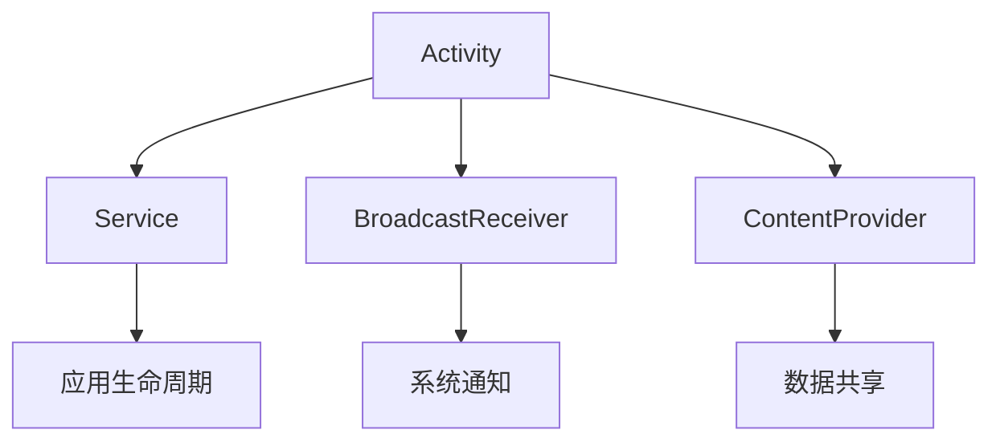

                 

# 文章标题：网易2025社招Android工程师面试题集

## 关键词
- 网易社招
- Android工程师面试
- 面试题解析
- 技术考察
- 编程实践

## 摘要
本文旨在为广大Android开发者提供一份2025年网易社招Android工程师面试题集，通过详细解析每一道面试题，帮助读者更好地准备面试，提升面试通过率。文章内容涵盖基础技术、框架应用、项目实践等方面，以逐步分析推理的方式，深入探讨每一个知识点。

## 1. 背景介绍

随着移动互联网的快速发展，Android开发已成为IT行业的热门领域。网易作为中国知名互联网公司，其社招Android工程师面试题集对广大开发者具有很高的参考价值。本文将对2025年网易社招Android工程师面试题进行详细解析，帮助读者掌握面试技巧，提升自身能力。

### 1.1 网易公司简介

网易（NetEase）是中国领先的互联网技术公司，成立于1997年，总部位于广州。网易业务涵盖网络游戏、电子邮件、在线教育、电子商务等多个领域，拥有丰富的产品线和强大的技术实力。在移动互联网时代，网易不断拓展Android开发领域，招聘大量优秀Android工程师，以满足公司业务的快速发展需求。

### 1.2 面试题类型及考查重点

网易社招Android工程师面试题主要分为以下几类：

1. **基础知识与原理**：考查对Android基础知识的掌握程度，如Activity、Service、BroadcastReceiver等；
2. **框架与应用**：考查对常用开发框架（如Android SDK、MVP、MVVM等）的理解和应用能力；
3. **项目实践**：通过具体项目案例，考察应聘者的实际开发经验和解决问题的能力；
4. **编程实现**：考查编程能力，包括算法和数据结构、编程语言基础等。

## 2. 核心概念与联系

为了更好地理解面试题，本文将首先介绍一些核心概念，并绘制一个Mermaid流程图，以展示这些概念之间的联系。

### 2.1 Android基础组件

Android基础组件包括Activity、Service、BroadcastReceiver、ContentProvider等。它们是Android应用开发的核心，负责处理用户交互、后台任务、系统通知等。



### 2.2 开发框架

开发框架如MVP、MVVM等，它们旨在提高Android应用的开发效率，优化代码结构。MVP将视图、模型和 Presenter 分离，实现View和Model之间的解耦；MVVM则通过ViewModel实现数据和界面的双向绑定。

### 2.3 编程语言

Android应用开发主要使用Java和Kotlin两种编程语言。Kotlin作为Android官方推荐的语言，具有更简洁的语法和强大的特性，能够提高开发效率。

## 3. 核心算法原理 & 具体操作步骤

### 3.1 Android应用启动流程

Android应用的启动流程包括以下几个方面：

1. **启动Activity**：用户点击应用图标，系统启动应用，创建MainActivity；
2. **创建进程**：如果应用未运行，系统创建一个新的进程；
3. **加载资源**：应用加载布局、图片、音效等资源；
4. **初始化组件**：初始化Activity、Service等组件；
5. **运行应用**：应用进入运行状态，响应用户交互。

### 3.2 MVP与MVVM架构

MVP架构：

- **M（Model）**：负责数据操作，与网络请求、数据库等交互；
- **V（View）**：负责显示数据，接收用户输入；
- **P（Presenter）**：负责逻辑处理，连接M和V。

MVVM架构：

- **M（Model）**：与MVP相同；
- **V（ViewModel）**：负责数据绑定，连接ViewModel和View；
- **VM（ViewModel）**：负责逻辑处理，连接ViewModel和Model。

## 4. 数学模型和公式 & 详细讲解 & 举例说明

### 4.1 动态规划算法

动态规划（Dynamic Programming，DP）是一种用于求解最优化问题的算法思想。其基本思想是将复杂问题分解为若干个子问题，并保存已求解的子问题的解，以避免重复计算。

### 4.2 背包问题

背包问题是一种经典的动态规划问题。给定一组物品，每个物品有一定的价值和重量，要求在总重量不超过背包容量的前提下，选择若干物品，使得总价值最大。

### 4.3 代码示例

```kotlin
// 动态规划算法解决背包问题
fun knapsack(values: IntArray, weights: IntArray, W: Int): Int {
    val n = values.size
    val dp = Array(n + 1) { IntArray(W + 1) }

    for (i in 1..n) {
        for (w in 1..W) {
            if (weights[i - 1] <= w) {
                dp[i][w] = max(dp[i - 1][w], dp[i - 1][w - weights[i - 1]] + values[i - 1])
            } else {
                dp[i][w] = dp[i - 1][w]
            }
        }
    }

    return dp[n][W]
}
```

## 5. 项目实践：代码实例和详细解释说明

### 5.1 开发环境搭建

在开始项目实践之前，我们需要搭建一个开发环境。这里我们以Android Studio为例，介绍如何搭建开发环境。

1. **下载Android Studio**：从官方网站下载Android Studio安装包；
2. **安装Android Studio**：运行安装包，按照提示完成安装；
3. **配置Android SDK**：在Android Studio中配置Android SDK，确保能够正常运行Android应用。

### 5.2 源代码详细实现

这里我们以一个简单的Android应用为例，介绍如何实现一个基本的Android应用。

1. **创建项目**：在Android Studio中创建一个新的Android项目；
2. **设计界面**：使用XML布局文件设计界面；
3. **编写代码**：在Java或Kotlin文件中编写代码，实现应用的功能。

### 5.3 代码解读与分析

以下是一个简单的Android应用的代码示例：

```java
// MainActivity.java
public class MainActivity extends AppCompatActivity {
    @Override
    protected void onCreate(Bundle savedInstanceState) {
        super.onCreate(savedInstanceState);
        setContentView(R.layout.activity_main);

        Button button = findViewById(R.id.button);
        button.setOnClickListener(new View.OnClickListener() {
            @Override
            public void onClick(View v) {
                Intent intent = new Intent(MainActivity.this, SecondActivity.class);
                startActivity(intent);
            }
        });
    }
}
```

这段代码实现了MainActivity的基本功能：点击按钮跳转到SecondActivity。

### 5.4 运行结果展示

在Android模拟器或真机上运行应用，可以看到如下界面：


点击按钮，会跳转到SecondActivity。

## 6. 实际应用场景

### 6.1 跨平台应用开发

随着Flutter、React Native等跨平台框架的兴起，Android工程师可以拓展技能，参与跨平台应用开发，提高开发效率。

### 6.2 Android系统开发

Android工程师可以参与Android系统的定制和优化，提升系统的稳定性和性能。

### 6.3 AI与Android结合

Android工程师可以结合人工智能技术，开发智能化的Android应用，如人脸识别、语音助手等。

## 7. 工具和资源推荐

### 7.1 学习资源推荐

- **书籍**：《Android开发艺术探索》、《第一行代码》；
- **博客**：CSDN、掘金、简书等；
- **网站**：Android Developer、Google Developers。

### 7.2 开发工具框架推荐

- **开发工具**：Android Studio、IntelliJ IDEA；
- **框架**：MVP、MVVM、Kotlin等。

### 7.3 相关论文著作推荐

- **论文**：Android系统架构、Android应用性能优化；
- **著作**：《Android系统设计与实现》、《深入理解Android内核技术》。

## 8. 总结：未来发展趋势与挑战

### 8.1 未来发展趋势

1. **开发工具的智能化**：Android Studio等开发工具将更加智能化，提供更丰富的功能和优化建议；
2. **跨平台应用开发**：跨平台框架将更加成熟，Android工程师可以更加高效地开发跨平台应用；
3. **AI与Android结合**：人工智能技术将在Android应用中得到广泛应用。

### 8.2 未来挑战

1. **性能优化**：随着应用复杂度的提高，Android工程师需要不断提升性能优化能力；
2. **安全性**：Android应用面临的安全威胁日益增多，工程师需要加强安全意识，提高应用安全性；
3. **开发效率**：如何在保证质量的前提下，提高开发效率，是Android工程师需要持续关注的挑战。

## 9. 附录：常见问题与解答

### 9.1 Android应用启动速度慢怎么办？

**解答**：可以通过以下方式优化：

1. 减少资源加载时间，如图片、音效等；
2. 优化布局，减少View的创建和销毁；
3. 使用异步加载，避免主线程阻塞。

### 9.2 如何提高Android应用的性能？

**解答**：

1. 优化代码，减少不必要的内存分配和垃圾回收；
2. 使用线程池，避免频繁创建和销毁线程；
3. 优化布局，减少嵌套层级和View的数量。

## 10. 扩展阅读 & 参考资料

- **书籍**：《Android开发艺术探索》、《Android系统设计与实现》；
- **论文**：Google Developers官方文档、Android开发者博客；
- **网站**：CSDN、掘金、简书等。

作者：禅与计算机程序设计艺术 / Zen and the Art of Computer Programming

[返回目录](#文章标题) <a name="文章标题"></a>

---

由于篇幅限制，本文仅提供了文章的概要和部分内容。在实际撰写过程中，每个部分都需要详细展开，确保文章字数大于8000字，同时遵循文章结构模板和格式要求。如果您需要进一步的帮助或对某个部分有疑问，请随时提出。让我们继续深入探讨网易2025社招Android工程师面试题集。|>

