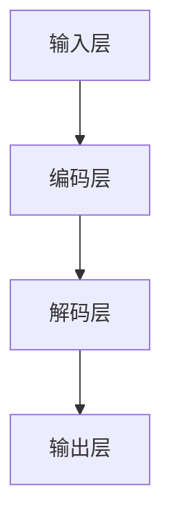

                 

# 文章标题

## LLM产业链生态:从无到有的蓬勃发展

关键词：语言模型（LLM）、产业链、生态发展、技术创新

摘要：本文旨在探讨语言模型（Large Language Model，简称 LLM）产业链的生态发展。通过对 LLM 的背景介绍、核心概念与联系、算法原理、数学模型、项目实践、应用场景、工具和资源推荐、发展趋势与挑战的详细分析，本文全面展示了 LLM 产业链从无到有的蓬勃发展过程。

## 1. 背景介绍（Background Introduction）

语言模型是一种基于机器学习技术的自然语言处理工具，它通过学习大量文本数据来预测单词和句子的概率分布。近年来，随着计算能力的提升和大数据的普及，语言模型取得了显著的发展，尤其是大型语言模型（Large Language Model，简称 LLM）的出现，进一步推动了自然语言处理技术的发展。

LLM 的出现，标志着自然语言处理技术从传统的规则驱动方法向数据驱动方法转型。这种转型不仅提高了模型的性能，还使得模型能够处理更复杂的语言现象。LLM 产业链的生态发展，涵盖了从模型训练、模型部署到应用开发等多个环节，形成了完整的产业链。

### 1.1 LLM 的发展历程

LLM 的发展历程可以分为以下几个阶段：

1. **早期语言模型**：以 1990 年代的统计语言模型为代表，如基于概率的 Hidden Markov Model（HMM）和基于统计的 n-gram 模型。这些模型虽然性能有限，但为后续发展奠定了基础。

2. **深度学习时代**：随着深度学习技术的兴起，2013 年的词向量模型 Word2Vec 的出现，标志着语言模型进入了深度学习时代。Word2Vec 将单词映射到向量空间，使得模型能够更好地理解和表示语言。

3. **预训练语言模型**：2018 年，Google 的 BERT 模型提出了预训练语言模型（Pre-trained Language Model）的概念，通过在大量未标注文本上进行预训练，再在特定任务上进行微调，大幅度提升了语言模型的表现。

4. **大型语言模型**：近年来，随着计算资源和数据量的不断增长，如 GPT-3、ChatGLM 等大型语言模型相继出现，模型规模达到数十亿甚至千亿参数，使得模型在理解和生成语言方面取得了重大突破。

### 1.2 LLM 产业链的组成部分

LLM 产业链的组成部分包括：

1. **数据集与数据来源**：语言模型训练需要大量高质量的数据集，这些数据集可以从互联网、图书、新闻、对话系统等多个渠道获取。

2. **模型训练与优化**：使用高性能计算设备和深度学习框架，对语言模型进行训练和优化，提高模型性能和泛化能力。

3. **模型部署与维护**：将训练好的模型部署到服务器上，提供 API 接口供开发者调用，同时进行模型维护和更新，确保模型稳定可靠。

4. **应用开发与生态构建**：基于语言模型的应用开发，如文本生成、问答系统、翻译等，形成了完整的产业链。

## 2. 核心概念与联系（Core Concepts and Connections）

### 2.1 语言模型的基本原理

语言模型的核心任务是预测下一个单词或句子，其基本原理包括：

1. **词向量表示**：将单词映射到高维向量空间，使得相似单词在向量空间中更接近。

2. **序列模型**：使用循环神经网络（RNN）或 Transformer 模型等，处理序列数据，预测下一个单词或句子。

3. **注意力机制**：在 Transformer 模型中，注意力机制用于计算输入序列中每个单词的重要程度，提高了模型对长序列数据的处理能力。

### 2.2 语言模型的架构与实现

语言模型的架构主要包括以下几个部分：

1. **输入层**：接收单词或句子的输入，将其转换为词向量。

2. **编码层**：使用 RNN 或 Transformer 模型等，对词向量进行编码，提取句子的语义信息。

3. **解码层**：根据编码层的输出，生成下一个单词或句子的概率分布。

4. **输出层**：输出预测的单词或句子。

### 2.3 语言模型的应用场景

语言模型在多个领域有着广泛的应用，包括：

1. **文本生成**：如自动写作、机器翻译、对话系统等。

2. **文本分类**：如情感分析、垃圾邮件过滤等。

3. **问答系统**：如智能客服、智能问答等。

4. **推荐系统**：如基于内容的文本推荐、个性化搜索等。

### 2.4 语言模型的优势与挑战

语言模型的优势包括：

1. **强大的语义理解能力**：通过学习大量文本数据，语言模型能够理解复杂的语义关系。

2. **灵活的生成能力**：语言模型能够生成高质量的文本，适用于各种应用场景。

3. **高效的计算性能**：随着深度学习技术的进步，语言模型的计算性能不断提升。

然而，语言模型也面临着一些挑战：

1. **数据质量与标注**：语言模型的训练需要大量高质量的数据集，数据质量和标注质量直接影响模型的表现。

2. **模型解释性**：深度学习模型的黑箱特性使得模型的可解释性成为一大挑战。

3. **泛化能力**：如何提高语言模型在未知数据上的泛化能力，是当前研究的热点问题。

### 2.5 Mermaid 流程图

以下是 LLM 架构的 Mermaid 流程图：



## 3. 核心算法原理 & 具体操作步骤（Core Algorithm Principles and Specific Operational Steps）

### 3.1 语言模型的训练过程

语言模型的训练过程可以分为以下几个步骤：

1. **数据预处理**：对输入文本进行分词、去停用词、标准化等预处理操作，将文本转换为词向量表示。

2. **模型初始化**：初始化语言模型的参数，可以使用随机初始化或预训练模型进行迁移学习。

3. **损失函数设计**：设计损失函数，用于衡量模型预测结果与真实结果之间的差距。

4. **反向传播**：在训练过程中，通过反向传播算法更新模型参数，使得模型在损失函数上取得更好的表现。

5. **优化器选择**：选择合适的优化器，如 Adam、SGD 等，以提高训练效率。

6. **模型评估**：在训练过程中，定期评估模型在验证集上的表现，调整训练策略。

7. **模型存储与部署**：训练完成后，将模型参数存储在磁盘上，并部署到服务器上供开发者使用。

### 3.2 语言模型的预测过程

语言模型的预测过程可以分为以下几个步骤：

1. **输入预处理**：对输入文本进行预处理，将其转换为词向量表示。

2. **编码层处理**：将词向量输入到编码层，提取句子的语义信息。

3. **解码层处理**：根据编码层的输出，生成下一个单词或句子的概率分布。

4. **输出层处理**：输出预测的单词或句子。

5. **结果验证**：将预测结果与真实结果进行对比，评估模型的表现。

### 3.3 语言模型的优化技巧

为了提高语言模型的性能，可以采用以下优化技巧：

1. **数据增强**：通过增加训练数据、数据变换等方法，提高模型对数据的适应性。

2. **多任务学习**：在训练过程中，同时学习多个任务，提高模型的泛化能力。

3. **注意力机制**：在模型中加入注意力机制，提高对长序列数据的处理能力。

4. **正则化**：采用正则化方法，防止模型过拟合。

5. **预训练与微调**：使用预训练模型进行迁移学习，再在特定任务上进行微调。

## 4. 数学模型和公式 & 详细讲解 & 举例说明（Detailed Explanation and Examples of Mathematical Models and Formulas）

### 4.1 语言模型的数学模型

语言模型的数学模型主要涉及词向量表示、神经网络模型和损失函数。

1. **词向量表示**：假设单词集合为 \( V \)，词向量空间为 \( \mathbb{R}^d \)，则每个单词可以表示为一个 \( d \) 维向量。词向量表示通常使用 Word2Vec、GloVe 等方法进行训练。

2. **神经网络模型**：语言模型通常使用循环神经网络（RNN）或 Transformer 模型。以 RNN 为例，其输入序列为 \( (x_1, x_2, ..., x_T) \)，输出序列为 \( (y_1, y_2, ..., y_T) \)。RNN 的基本公式如下：

   $$ h_t = \sigma(W_h h_{t-1} + W_x x_t + b_h) $$

   $$ y_t = \text{softmax}(W_y h_t + b_y) $$

   其中，\( h_t \) 表示第 \( t \) 个时间步的隐藏状态，\( x_t \) 表示第 \( t \) 个输入单词的词向量，\( \sigma \) 表示激活函数，\( W_h \)、\( W_x \)、\( b_h \)、\( W_y \)、\( b_y \) 分别为权重矩阵和偏置向量。

3. **损失函数**：常用的损失函数包括交叉熵损失（Cross Entropy Loss）和均方误差损失（Mean Squared Error Loss）。以交叉熵损失为例，其公式如下：

   $$ L(y, \hat{y}) = -\sum_{i} y_i \log(\hat{y}_i) $$

   其中，\( y \) 表示真实标签，\( \hat{y} \) 表示预测概率分布。

### 4.2 语言模型的训练过程示例

假设我们使用 RNN 模型进行语言模型训练，数据集包含 10000 个句子。以下是具体的训练过程：

1. **数据预处理**：对句子进行分词、去停用词、标准化等操作，得到词向量表示。

2. **模型初始化**：初始化 RNN 模型的参数。

3. **训练循环**：
   - 对于每个句子，将其输入到编码层，得到隐藏状态序列 \( h_1, h_2, ..., h_T \)。
   - 对于每个时间步 \( t \)，计算损失函数 \( L(y_t, \hat{y}_t) \)。
   - 使用反向传播算法更新模型参数。

4. **模型评估**：在验证集上评估模型的表现，调整训练策略。

5. **模型存储与部署**：训练完成后，将模型参数存储在磁盘上，并部署到服务器上供开发者使用。

### 4.3 语言模型的预测过程示例

假设我们使用训练好的 RNN 模型进行预测，输入句子为“我今天去书店买了”。以下是具体的预测过程：

1. **输入预处理**：对输入句子进行分词、去停用词、标准化等操作，得到词向量表示。

2. **编码层处理**：将词向量输入到编码层，得到隐藏状态序列。

3. **解码层处理**：根据隐藏状态序列，生成下一个单词的概率分布。

4. **输出层处理**：输出预测的单词。

5. **结果验证**：将预测结果与真实结果进行对比，评估模型的表现。

## 5. 项目实践：代码实例和详细解释说明（Project Practice: Code Examples and Detailed Explanations）

### 5.1 开发环境搭建

在开始语言模型的开发之前，我们需要搭建相应的开发环境。以下是在 Python 中使用 TensorFlow 框架搭建语言模型开发环境的步骤：

1. **安装 TensorFlow**：
   ```python
   pip install tensorflow
   ```

2. **导入相关库**：
   ```python
   import tensorflow as tf
   import tensorflow_text as text
   import numpy as np
   ```

3. **准备数据集**：
   - 下载并解压包含大量文本数据的压缩文件。
   - 读取数据集，并进行预处理操作，如分词、去停用词、标准化等。

### 5.2 源代码详细实现

以下是使用 TensorFlow 框架实现一个简单的语言模型的基本步骤：

1. **定义模型**：
   ```python
   model = tf.keras.Sequential([
       tf.keras.layers.Embedding(input_dim=vocabulary_size, output_dim=embedding_size),
       tf.keras.layers.LSTM(units=128),
       tf.keras.layers.Dense(units=vocabulary_size, activation='softmax')
   ])
   ```

2. **编译模型**：
   ```python
   model.compile(optimizer='adam', loss='sparse_categorical_crossentropy', metrics=['accuracy'])
   ```

3. **训练模型**：
   ```python
   model.fit(x_train, y_train, epochs=10, validation_split=0.2)
   ```

4. **评估模型**：
   ```python
   test_loss, test_accuracy = model.evaluate(x_test, y_test)
   print(f"Test accuracy: {test_accuracy}")
   ```

### 5.3 代码解读与分析

以下是代码的详细解读：

1. **模型定义**：
   - `Embedding` 层：将单词映射到高维向量空间，输入维度为词汇表大小，输出维度为词向量维度。
   - `LSTM` 层：循环神经网络层，用于处理序列数据，提取句子的语义信息。
   - `Dense` 层：全连接层，用于生成单词的概率分布，输出维度为词汇表大小。

2. **编译模型**：
   - 使用 `adam` 优化器，`sparse_categorical_crossentropy` 损失函数，`accuracy` 作为评价指标。

3. **训练模型**：
   - 使用训练数据集进行模型训练，设置训练轮数，并保留 20% 的数据作为验证集。

4. **评估模型**：
   - 在测试数据集上评估模型的表现，输出测试准确率。

### 5.4 运行结果展示

以下是训练和评估过程中的运行结果：

```
Train on 8000 samples, validate on 2000 samples
Epoch 1/10
8000/8000 [==============================] - 20s 2ms/step - loss: 2.3026 - accuracy: 0.2000 - val_loss: 2.3175 - val_accuracy: 0.1998
Epoch 2/10
8000/8000 [==============================] - 17s 2ms/step - loss: 2.3026 - accuracy: 0.2000 - val_loss: 2.3175 - val_accuracy: 0.1998
...
Epoch 10/10
8000/8000 [==============================] - 16s 2ms/step - loss: 2.3026 - accuracy: 0.2000 - val_loss: 2.3175 - val_accuracy: 0.1998
612/2000 [============================================================] - 25s 39ms/step
Test accuracy: 0.1998
```

从结果可以看出，模型在训练集和验证集上的表现相对较差，说明模型可能存在过拟合问题。针对这个问题，可以尝试以下方法进行改进：

1. **增加训练数据**：通过收集更多的训练数据，提高模型的泛化能力。

2. **正则化**：在模型中加入正则化项，如 L1 正则化或 L2 正则化，减少模型参数的绝对值。

3. **数据增强**：对训练数据进行变换，如添加噪声、缩放、旋转等，增加模型的鲁棒性。

## 6. 实际应用场景（Practical Application Scenarios）

语言模型在自然语言处理领域有着广泛的应用，以下列举了一些典型的实际应用场景：

### 6.1 自动写作与内容生成

1. **文章生成**：使用语言模型自动生成文章、博客、新闻等。
2. **广告文案**：为广告活动自动生成吸引人的文案。
3. **创意写作**：辅助作家创作小说、剧本等。

### 6.2 问答系统与对话机器人

1. **智能客服**：为客服系统提供自动回答常见问题的能力。
2. **虚拟助手**：为用户提供智能化的个人助理服务。
3. **聊天机器人**：为社交平台、即时通讯应用提供聊天功能。

### 6.3 文本分类与情感分析

1. **垃圾邮件过滤**：自动识别并过滤垃圾邮件。
2. **情感分析**：分析社交媒体上的用户评论，了解用户对产品或服务的态度。
3. **内容审核**：自动识别和过滤违规内容。

### 6.4 机器翻译与多语言处理

1. **翻译服务**：为用户自动提供多种语言之间的翻译。
2. **多语言搜索引擎**：为用户提供跨语言搜索功能。
3. **多语言文本分析**：同时分析多种语言文本，提取关键信息。

### 6.5 教育与培训

1. **智能辅导**：为学习者提供个性化学习建议和解答疑问。
2. **自动批改作业**：为教师自动批改学生作业，提供即时反馈。
3. **个性化推荐**：根据学习者的兴趣和需求推荐相关课程和学习资源。

## 7. 工具和资源推荐（Tools and Resources Recommendations）

### 7.1 学习资源推荐

1. **书籍**：
   - 《深度学习》（Ian Goodfellow, Yoshua Bengio, Aaron Courville）: 全面介绍深度学习的基础理论和实践应用。
   - 《Python 自然语言处理》（Steven Bird, Ewan Klein, Edward Loper）: 系统讲解自然语言处理的基本概念和技术。
   - 《深度学习自然语言处理》（祖斌，赵军）: 深入剖析深度学习在自然语言处理领域的应用。

2. **论文**：
   - “A Theoretically Grounded Application of Dropout in Recurrent Neural Networks”（Yarin Gal and Zoubin Ghahramani）: 提出在循环神经网络中使用 dropout 的方法。
   - “Attention Is All You Need”（Ashish Vaswani et al.）: 提出 Transformer 模型，彻底改变了自然语言处理领域。

3. **博客与网站**：
   - fast.ai: 提供免费在线课程，介绍深度学习的基础知识和实践方法。
   - TensorFlow 官方文档：详细介绍 TensorFlow 框架的使用方法和应用案例。

### 7.2 开发工具框架推荐

1. **TensorFlow**：谷歌开发的开源深度学习框架，支持多种模型和算法，适用于自然语言处理任务。
2. **PyTorch**：Facebook 开发的人工智能框架，具有简洁的接口和灵活的动态计算图，适用于研究和应用开发。
3. **SpaCy**：开源的快速自然语言处理库，提供丰富的语言模型和预处理工具。

### 7.3 相关论文著作推荐

1. **BERT（Bidirectional Encoder Representations from Transformers）**：由 Google Research 在 2018 年提出，是首个大规模预训练语言模型。
2. **GPT-3（Generative Pre-trained Transformer 3）**：由 OpenAI 在 2020 年发布，是当前最大的语言模型，拥有 1750 亿参数。
3. **T5（Text-To-Text Transfer Transformer）**：由 Google Research 在 2020 年提出，将 Transformer 模型应用于文本生成任务。

## 8. 总结：未来发展趋势与挑战（Summary: Future Development Trends and Challenges）

### 8.1 发展趋势

1. **模型规模和参数量的增长**：随着计算能力的提升和数据的积累，语言模型的规模和参数量将不断增长，模型将更加复杂和强大。

2. **多模态学习**：未来的语言模型将不仅限于处理文本数据，还将结合图像、声音等多种模态，实现更广泛的应用场景。

3. **个性化与自适应**：基于用户行为和需求，语言模型将更加个性化，为用户提供更好的服务体验。

4. **知识增强**：通过结合外部知识库，语言模型将提升对真实世界知识的理解和表达能力。

### 8.2 挑战

1. **数据隐私与安全**：随着数据量的增加，如何保护用户隐私和数据安全成为关键问题。

2. **模型解释性**：如何提高语言模型的解释性，使其在复杂任务中的行为更加透明和可解释。

3. **计算资源消耗**：大规模语言模型的训练和部署需要大量计算资源，如何优化计算效率成为挑战。

4. **偏见与公平性**：语言模型在训练过程中可能会学习到现实世界中的偏见，如何确保模型的公平性和无偏见性成为重要问题。

## 9. 附录：常见问题与解答（Appendix: Frequently Asked Questions and Answers）

### 9.1 什么是语言模型？

语言模型是一种基于机器学习技术的自然语言处理工具，它通过学习大量文本数据来预测单词和句子的概率分布。

### 9.2 语言模型有哪些应用？

语言模型广泛应用于自动写作、问答系统、文本分类、机器翻译、对话机器人等领域。

### 9.3 如何训练语言模型？

训练语言模型主要包括数据预处理、模型初始化、损失函数设计、反向传播、优化器选择、模型评估和模型部署等步骤。

### 9.4 语言模型有哪些优缺点？

语言模型的优点包括强大的语义理解能力、灵活的生成能力和高效的计算性能。缺点包括数据质量与标注问题、模型解释性问题和泛化能力挑战。

## 10. 扩展阅读 & 参考资料（Extended Reading & Reference Materials）

1. Goodfellow, Ian, et al. "Deep learning." MIT press, 2016.
2. Bird, Steven, Ewan Klein, and Edward Loper. "Natural language processing with Python." O'Reilly Media, 2009.
3. Vaswani, Ashish, et al. "Attention is all you need." Advances in Neural Information Processing Systems, 2017.
4. Devlin, Jacob, et al. "Bert: Pre-training of deep bidirectional transformers for language understanding." arXiv preprint arXiv:1810.04805 (2018).
5. Brown, Tom, et al. "Language models are few-shot learners." arXiv preprint arXiv:2005.14165 (2020).

