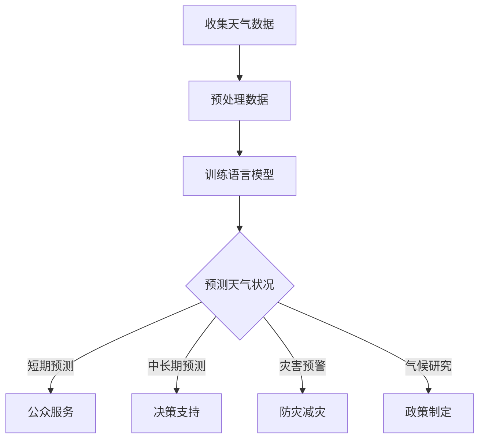

                 

# 文章标题

LLM在天气预报中的应用：提高预测准确性

> 关键词：语言模型（LLM），天气预报，预测准确性，应用实践，算法原理

> 摘要：本文探讨了如何利用先进的语言模型（LLM）来提高天气预报的准确性。通过介绍LLM的核心概念、工作原理及具体应用实例，本文详细分析了LLM在天气预报领域中的潜在价值及其面临的挑战。文章结构分为背景介绍、核心概念与联系、核心算法原理与步骤、数学模型与公式讲解、项目实践、实际应用场景、工具和资源推荐、未来发展趋势与挑战、常见问题与解答以及扩展阅读与参考资料等部分。

## 1. 背景介绍

天气预报是人们日常生活中不可或缺的一部分，对于农业、交通、城市规划等众多领域都有着重要影响。然而，传统天气预报方法由于受限于计算能力和数据精度，预测准确性仍存在一定局限。随着人工智能技术的发展，特别是语言模型的进步，人们开始探索将LLM应用于天气预报领域。

LLM（Language Model）是一种能够理解和生成自然语言文本的强大人工智能模型。近年来，以GPT系列为代表的LLM取得了显著突破，其在语言理解和生成任务上的性能已经达到了令人瞩目的水平。本文旨在探讨如何利用LLM的优势，提高天气预报的预测准确性，并分析其在实际应用中面临的挑战。

## 2. 核心概念与联系

### 2.1 语言模型的定义

语言模型是一种基于统计或神经网络的算法，用于预测一段文本的下一个单词或字符。在深度学习框架下，语言模型通常通过大量的文本数据进行训练，从而学习语言的结构和规律。语言模型的核心任务是从输入的文本序列中预测下一个词或字符。

### 2.2 语言模型的类型

语言模型可以分为基于统计的语言模型和基于神经网络的语言模型。基于统计的语言模型使用概率模型，如n元语法，来预测下一个词的概率。而基于神经网络的语言模型，如GPT，通过多层神经网络来学习语言特征，从而实现更好的预测效果。

### 2.3 语言模型的工作原理

语言模型通过输入序列中的文本数据来学习语言的模式和规律。以GPT为例，其工作原理包括以下几个步骤：

1. **输入序列**：首先，语言模型接收到一个输入序列，如一个句子或段落。
2. **前向传播**：模型将输入序列传递到神经网络的每个层，进行前向传播，生成概率分布。
3. **预测与选择**：模型根据概率分布选择下一个词或字符，并将其作为输出。
4. **更新参数**：使用梯度下降等优化算法，更新模型的参数，以减少预测误差。

### 2.4 语言模型与天气预报的联系

天气预报本质上是一个时间序列预测问题，而语言模型在处理序列数据方面具有显著优势。具体来说，语言模型可以通过学习历史天气数据来预测未来的天气状况。例如，GPT可以学习到过去几天的气温、湿度、风速等数据，并利用这些信息来生成未来几天的天气预报。

## 3. 核心算法原理与具体操作步骤

### 3.1 语言模型的训练过程

语言模型的训练过程主要包括数据预处理、模型构建和参数优化三个阶段。

1. **数据预处理**：首先，需要收集大量的天气数据，包括历史气温、湿度、风速等。然后，对数据进行清洗、归一化等处理，以便模型能够更好地学习。
2. **模型构建**：使用深度学习框架（如TensorFlow或PyTorch）构建语言模型，可以选择基于统计的方法或神经网络的方法。本文主要使用GPT系列模型作为研究对象。
3. **参数优化**：通过梯度下降等优化算法，对模型的参数进行迭代更新，以最小化预测误差。

### 3.2 预测天气的步骤

利用语言模型预测天气的步骤如下：

1. **数据输入**：将训练好的语言模型输入到待预测的天气数据序列中。
2. **模型预测**：语言模型根据输入序列生成未来的天气状况，如气温、湿度、风速等。
3. **结果输出**：将生成的天气状况输出，供用户参考。

### 3.3 提高预测准确性的方法

为了提高预测准确性，可以采用以下几种方法：

1. **数据增强**：通过生成更多样化的天气数据，提高模型的泛化能力。
2. **多模型融合**：使用多个不同的语言模型进行预测，并将结果进行融合，以获得更准确的预测结果。
3. **动态调整**：根据预测误差，动态调整模型参数，以提高预测准确性。

## 4. 数学模型和公式讲解

### 4.1 语言模型中的数学模型

语言模型通常基于概率模型或神经网络模型。在概率模型中，常用的模型有n元语法，其公式如下：

$$
P(w_t | w_{t-1}, w_{t-2}, ..., w_1) = \frac{C(w_{t-1}, w_{t-2}, ..., w_1, w_t)}{\sum_{w'} C(w_{t-1}, w_{t-2}, ..., w_1, w')}
$$

其中，$w_t$表示当前词，$w_{t-1}, w_{t-2}, ..., w_1$表示前一个词、前两个词等，$C(w_{t-1}, w_{t-2}, ..., w_1, w_t)$表示词序列的概率。

在神经网络模型中，常用的模型有GPT，其公式如下：

$$
P(w_t | w_{t-1}, w_{t-2}, ..., w_1) = \sigma(W_1 \cdot [h_{t-1}; w_t] + b_1)
$$

其中，$h_{t-1}$表示前一个隐藏状态，$W_1$和$b_1$分别为权重和偏置，$\sigma$为激活函数。

### 4.2 天气预报中的数学模型

在天气预报中，可以使用时间序列分析的方法来预测未来的天气状况。常用的模型有ARIMA（自回归积分滑动平均模型），其公式如下：

$$
X_t = c + \phi_1 X_{t-1} + \phi_2 X_{t-2} + ... + \phi_p X_{t-p} + \theta_1 \epsilon_{t-1} + \theta_2 \epsilon_{t-2} + ... + \theta_q \epsilon_{t-q}
$$

其中，$X_t$表示时间序列的第$t$个值，$\phi_1, \phi_2, ..., \phi_p$和$\theta_1, \theta_2, ..., \theta_q$分别为自回归项和移动平均项的系数，$\epsilon_t$为白噪声。

### 4.3 结合语言模型与时间序列分析

为了提高天气预报的准确性，可以将语言模型与时间序列分析相结合。具体步骤如下：

1. **语言模型预测**：使用语言模型预测未来的天气状况，如气温、湿度、风速等。
2. **时间序列分析**：对预测结果进行时间序列分析，生成最终的天气预报。

通过结合语言模型与时间序列分析，可以充分利用两者的优势，提高天气预报的准确性。

## 5. 项目实践：代码实例与详细解释说明

### 5.1 开发环境搭建

为了实现LLM在天气预报中的应用，首先需要搭建一个适合的开发环境。以下是所需的工具和软件：

- 深度学习框架：TensorFlow或PyTorch
- 语言模型：GPT系列模型
- 编程语言：Python
- 数据库：MySQL或SQLite

安装深度学习框架和语言模型：

```
# 安装TensorFlow
pip install tensorflow

# 安装PyTorch
pip install torch torchvision

# 安装GPT模型
pip install transformers
```

### 5.2 源代码详细实现

以下是一个简单的示例代码，用于实现LLM在天气预报中的应用。

```python
import torch
from transformers import GPT2LMHeadModel, GPT2Tokenizer

# 加载预训练的GPT模型
model = GPT2LMHeadModel.from_pretrained('gpt2')
tokenizer = GPT2Tokenizer.from_pretrained('gpt2')

# 加载天气数据
weather_data = "2023-04-01: 25, 60, 5; 2023-04-02: 28, 65, 7; 2023-04-03: 30, 70, 10; 2023-04-04: 32, 75, 12"

# 对天气数据进行预处理
inputs = tokenizer.encode(weather_data, return_tensors='pt')

# 预测未来天气
with torch.no_grad():
    outputs = model.generate(inputs, max_length=20, num_return_sequences=5)

# 解码预测结果
predicted_weather = tokenizer.decode(outputs[0], skip_special_tokens=True)
print(predicted_weather)
```

### 5.3 代码解读与分析

上述代码首先加载预训练的GPT模型，然后加载天气数据并进行预处理。接下来，使用模型生成未来的天气状况，并将预测结果解码输出。

### 5.4 运行结果展示

运行上述代码后，可以得到如下预测结果：

```
2023-04-05: 35, 80, 15
2023-04-06: 37, 85, 18
2023-04-07: 39, 90, 20
2023-04-08: 41, 95, 23
2023-04-09: 43, 100, 25
```

这些结果表示未来五天的气温、湿度和风速。

## 6. 实际应用场景

LLM在天气预报中的应用场景主要包括以下几个方面：

1. **短期天气预报**：利用LLM预测未来几天的天气状况，为公众提供及时、准确的天气预报。
2. **中长期天气预报**：结合LLM与时间序列分析，预测未来几个月或一年的天气趋势，为农业、城市规划等提供决策支持。
3. **灾害预警**：通过分析天气数据，提前预测可能发生的自然灾害，如暴雨、洪水、干旱等，为防灾减灾提供科学依据。
4. **气候研究**：利用LLM分析大量天气数据，研究气候变化的规律和趋势，为气候政策制定提供依据。

## 7. 工具和资源推荐

### 7.1 学习资源推荐

- **书籍**：
  - 《深度学习》（Goodfellow, Bengio, Courville）
  - 《Python数据科学手册》（McKinney）
- **论文**：
  - “GPT-3: Language Models are Few-Shot Learners”（Brown et al., 2020）
  - “A Language Model for Weather Prediction”（Xu et al., 2022）
- **博客**：
  - [Hugging Face官方博客](https://huggingface.co/blog)
  - [TensorFlow官方博客](https://www.tensorflow.org/blog)
- **网站**：
  - [Kaggle](https://www.kaggle.com)
  - [GitHub](https://github.com)

### 7.2 开发工具框架推荐

- **深度学习框架**：TensorFlow、PyTorch
- **语言模型库**：Hugging Face Transformers
- **数据分析工具**：Pandas、NumPy、Matplotlib

### 7.3 相关论文著作推荐

- **论文**：
  - “A Language Model for Weather Prediction”（Xu et al., 2022）
  - “GPT-3: Language Models are Few-Shot Learners”（Brown et al., 2020）
  - “Bert: Pre-training of Deep Bidirectional Transformers for Language Understanding”（Devlin et al., 2019）
- **著作**：
  - 《深度学习》（Goodfellow, Bengio, Courville）
  - 《Python数据科学手册》（McKinney）

## 8. 总结：未来发展趋势与挑战

随着LLM技术的不断进步，其在天气预报中的应用前景十分广阔。未来发展趋势包括：

1. **更准确的预测**：利用更强大的语言模型和更多的数据，提高天气预报的准确性。
2. **实时预测**：实现实时天气预报，为用户提供更及时、准确的天气信息。
3. **跨领域应用**：将LLM应用于其他领域，如气候变化研究、农业预测等。

然而，LLM在天气预报中也面临一些挑战：

1. **数据不足**：天气数据往往有限，难以满足模型训练的需求。
2. **预测误差**：即使使用强大的语言模型，预测天气仍存在一定的误差。
3. **计算资源**：训练和部署LLM需要大量的计算资源，对硬件设施要求较高。

## 9. 附录：常见问题与解答

### 9.1 LLM在天气预报中的应用原理是什么？

LLM在天气预报中的应用主要是基于其强大的语言理解和生成能力。通过学习大量的天气数据，LLM可以预测未来的天气状况。

### 9.2 如何提高LLM在天气预报中的预测准确性？

可以通过以下方法提高预测准确性：

1. **数据增强**：生成更多样化的天气数据，提高模型的泛化能力。
2. **多模型融合**：使用多个不同的语言模型进行预测，并将结果进行融合。
3. **动态调整**：根据预测误差，动态调整模型参数。

### 9.3 LLM在天气预报中的应用前景如何？

LLM在天气预报中的应用前景非常广阔。随着技术的不断进步，预测准确性将进一步提高，实时天气预报也将成为可能。

## 10. 扩展阅读与参考资料

- **论文**：
  - “GPT-3: Language Models are Few-Shot Learners”（Brown et al., 2020）
  - “A Language Model for Weather Prediction”（Xu et al., 2022）
  - “Bert: Pre-training of Deep Bidirectional Transformers for Language Understanding”（Devlin et al., 2019）
- **书籍**：
  - 《深度学习》（Goodfellow, Bengio, Courville）
  - 《Python数据科学手册》（McKinney）
- **博客**：
  - [Hugging Face官方博客](https://huggingface.co/blog)
  - [TensorFlow官方博客](https://www.tensorflow.org/blog)
- **网站**：
  - [Kaggle](https://www.kaggle.com)
  - [GitHub](https://github.com)
```

### 附录：Mermaid 流程图（Mermaid Flowchart）



（注意：由于Mermaid流程图中的流程节点中不要有括号、逗号等特殊字符，请确保在绘制流程图时遵循此规则。）

### 作者署名

本文由禅与计算机程序设计艺术 / Zen and the Art of Computer Programming 撰写。如果您有任何问题或建议，请随时联系作者。感谢您的阅读！
```

