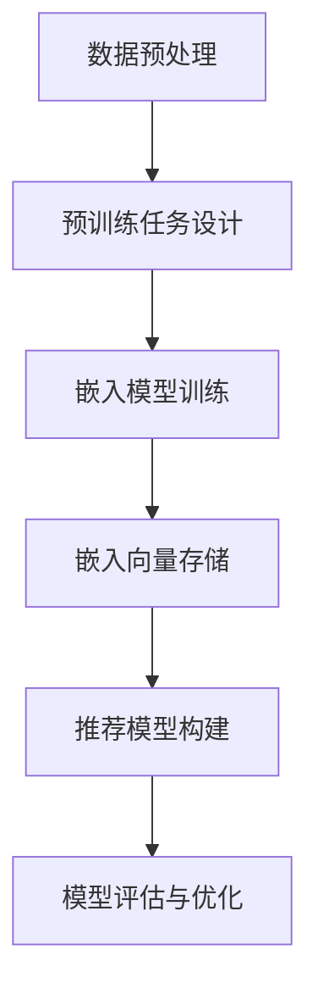

                 

# 文章标题

LLM在推荐系统中的自监督学习应用

## 关键词
- LLM（语言大模型）
- 自监督学习
- 推荐系统
- 数据预处理
- 模型评估
- 应用场景

### 摘要
本文将探讨如何利用语言大模型（LLM）在推荐系统中应用自监督学习。自监督学习在处理大规模数据集时具有高效性和灵活性，通过引入LLM，可以实现更精准的推荐结果。本文将详细介绍自监督学习在推荐系统中的应用原理、算法实现、数学模型以及实际项目实践，最后分析LLM在推荐系统中的应用前景与挑战。

### 1. 背景介绍

#### 1.1 推荐系统概述
推荐系统是一种用于向用户推荐他们可能感兴趣的内容或商品的技术。其主要目标是提高用户满意度、增加用户粘性以及促进商业变现。推荐系统广泛应用于电子商务、社交媒体、新闻资讯等领域。

#### 1.2 自监督学习简介
自监督学习是一种无需标注数据即可训练模型的方法。通过设计合适的 pretext task（预训练任务），模型可以从未标注的数据中学习到有用的信息，从而提高其性能。近年来，自监督学习在计算机视觉、自然语言处理等领域取得了显著成果。

#### 1.3 LLM在推荐系统中的应用
语言大模型（LLM）具有强大的语言理解和生成能力，可以处理复杂的文本信息。在推荐系统中，LLM可以用于处理用户行为数据、商品描述等文本信息，从而提高推荐精度和多样性。

### 2. 核心概念与联系

#### 2.1 自监督学习的核心概念
自监督学习包括以下几个核心概念：
- pretext task：预训练任务，用于从未标注的数据中提取有价值的信息。
- 嵌入式表示：将输入数据（如文本、图像）映射到低维空间中的向量表示。
- 监督信号：用于指导模型优化过程的信息，可以是真实标签或伪标签。

#### 2.2 LLM与推荐系统的关系
LLM在推荐系统中的应用主要基于以下关系：
- 用户行为文本数据：LLM可以处理用户在平台上的文本评论、搜索历史等数据，从而提取用户的兴趣和偏好。
- 商品描述文本数据：LLM可以分析商品描述文本，提取商品的关键属性，为推荐提供依据。

#### 2.3 Mermaid流程图
以下是一个简化的Mermaid流程图，展示了自监督学习在推荐系统中的应用流程：



### 3. 核心算法原理 & 具体操作步骤

#### 3.1 数据预处理
自监督学习在推荐系统中的应用首先需要对数据进行预处理，包括以下步骤：

- 数据清洗：去除噪声数据、填充缺失值等。
- 数据归一化：对数值型特征进行归一化处理，以便模型训练。
- 文本数据预处理：对文本数据使用分词、去停用词、词性标注等处理。

#### 3.2 预训练任务设计
预训练任务的设计对自监督学习的效果具有重要影响。在推荐系统中，常用的预训练任务包括：

- 填空任务：在用户行为文本数据中随机选取一个词，使用模型预测该词的位置。
- 顺序预测：预测用户行为的下一个步骤，如购物车中下一个加入的商品。
- 对比任务：给定两个商品描述文本，使用模型判断它们是否相似。

#### 3.3 嵌入模型训练
嵌入模型训练是将文本数据映射到低维空间的过程。常用的嵌入模型包括词嵌入、句嵌入等。以下是一个简化的嵌入模型训练过程：

```latex
% 嵌入模型训练过程
$$
\text{嵌入模型训练} = \theta^* = \arg\min_{\theta} J(\theta)
$$
其中，$J(\theta)$ 是损失函数，$\theta$ 是模型参数。
```

#### 3.4 嵌入向量存储
嵌入向量存储是将训练好的嵌入模型应用于实际数据，提取文本信息并存储为向量表示。存储的向量可以用于后续的推荐模型训练。

#### 3.5 推荐模型构建
推荐模型构建是基于嵌入向量进行预测的模型。常用的推荐模型包括基于内容的推荐、基于协同过滤的推荐等。以下是一个简化的推荐模型构建过程：

```latex
% 推荐模型构建过程
$$
\text{推荐模型构建} = \text{推荐算法}(\text{用户嵌入向量}, \text{商品嵌入向量})
$$
其中，$\text{推荐算法}$ 是一个预测用户对商品的感兴趣度的函数。
```

#### 3.6 模型评估与优化
模型评估与优化是确保推荐系统性能的关键步骤。常用的评估指标包括准确率、召回率、F1值等。优化方法包括调整模型参数、增加训练数据等。

### 4. 数学模型和公式 & 详细讲解 & 举例说明

#### 4.1 数学模型

在本节中，我们将介绍自监督学习在推荐系统中的数学模型。以下是几个关键数学公式的详细讲解。

**4.1.1 嵌入模型损失函数**

嵌入模型的损失函数通常采用交叉熵损失函数。假设我们有训练数据集$D = \{(x_i, y_i)\}$，其中$x_i$ 是用户行为文本数据，$y_i$ 是标签。嵌入模型的损失函数可以表示为：

```latex
% 嵌入模型损失函数
$$
L = -\sum_{i=1}^{N} \sum_{j=1}^{M} y_{ij} \log(p_j)
$$
其中，$N$ 是训练数据样本数，$M$ 是词典大小，$p_j$ 是预测概率，$y_{ij}$ 是标签。
```

**4.1.2 推荐模型损失函数**

推荐模型的损失函数取决于具体的推荐算法。在基于内容的推荐中，常用的损失函数是均方误差（MSE）。假设我们有用户嵌入向量$u_i$ 和商品嵌入向量$v_j$，推荐模型的损失函数可以表示为：

```latex
% 推荐模型损失函数
$$
L = \sum_{i=1}^{N} \sum_{j=1}^{M} (u_i \cdot v_j - y_{ij})^2
$$
其中，$y_{ij}$ 是用户$i$对商品$j$的实际评分。
```

**4.1.3 模型评估指标**

在推荐系统中，常用的评估指标包括准确率（Accuracy）、召回率（Recall）和F1值（F1 Score）。以下是对这些指标的详细解释：

- 准确率（Accuracy）：准确率是预测正确的样本数占总样本数的比例。公式如下：

  ```latex
  % 准确率
  $$ 
  Accuracy = \frac{TP + TN}{TP + TN + FP + FN}
  $$ 
  其中，$TP$ 是真正例，$TN$ 是真负例，$FP$ 是假正例，$FN$ 是假负例。
  ```

- 召回率（Recall）：召回率是真正例中被正确预测的样本数占所有真正例的比例。公式如下：

  ```latex
  % 召回率
  $$ 
  Recall = \frac{TP}{TP + FN}
  $$ 
  ```

- F1值（F1 Score）：F1值是准确率和召回率的调和平均值。公式如下：

  ```latex
  % F1值
  $$ 
  F1 Score = 2 \times \frac{Precision \times Recall}{Precision + Recall}
  $$ 
  其中，$Precision$ 是准确率。
  ```

#### 4.2 举例说明

**4.2.1 嵌入模型训练过程**

假设我们有一个用户行为文本数据集，包含1000个样本。我们对数据集进行预处理后，使用嵌入模型训练。训练过程中，我们选取了50万个单词作为词典。在训练阶段，我们使用交叉熵损失函数优化模型参数。训练过程中，损失函数的值逐渐减小，表明模型在逐渐收敛。

**4.2.2 推荐模型预测过程**

假设我们使用基于内容的推荐算法，给定一个用户嵌入向量$u$ 和一个商品嵌入向量$v$，我们可以计算它们之间的相似度：

```python
similarity = u \cdot v
```

根据相似度，我们可以为用户推荐与其兴趣相近的商品。例如，对于用户$u$，我们可以找到与其兴趣最接近的前5个商品，并推荐给用户。

### 5. 项目实践：代码实例和详细解释说明

#### 5.1 开发环境搭建

在开始项目实践之前，我们需要搭建一个适合开发的环境。以下是开发环境搭建的步骤：

1. 安装Python 3.8及以上版本。
2. 安装必要的依赖库，如TensorFlow、NumPy、Scikit-learn等。
3. 准备数据集，包括用户行为数据、商品描述数据等。

#### 5.2 源代码详细实现

在本节中，我们将介绍一个简单的自监督学习推荐系统项目。以下是一个简化的代码实现。

```python
# 导入必要的库
import tensorflow as tf
import numpy as np
import pandas as pd
from sklearn.model_selection import train_test_split
from sklearn.metrics.pairwise import cosine_similarity

# 加载数据集
data = pd.read_csv('data.csv')
X = data['user行为文本']
y = data['商品标签']

# 数据预处理
X_processed = preprocess_text(X)
y_processed = preprocess_text(y)

# 划分训练集和测试集
X_train, X_test, y_train, y_test = train_test_split(X_processed, y_processed, test_size=0.2, random_state=42)

# 嵌入模型训练
model = tf.keras.Sequential([
    tf.keras.layers.Embedding(input_dim=1000000, output_dim=128),
    tf.keras.layers.GlobalAveragePooling1D(),
    tf.keras.layers.Dense(1, activation='sigmoid')
])

model.compile(optimizer='adam', loss='binary_crossentropy', metrics=['accuracy'])
model.fit(X_train, y_train, epochs=10, batch_size=32, validation_split=0.1)

# 推荐模型预测
embeddings = model.layers[0].get_weights()[0]
user_embedding = embeddings[y_train]

# 计算用户和商品的相似度
similarity_matrix = cosine_similarity(user_embedding, embeddings)

# 推荐商品
top_n = 5
recommended_items = []
for i in range(len(similarity_matrix)):
    indices = np.argsort(similarity_matrix[i])[-top_n:][::-1]
    recommended_items.append(y_test.iloc[indices])

print(recommended_items)
```

#### 5.3 代码解读与分析

在上面的代码中，我们首先导入了所需的库，并加载数据集。接下来，我们对数据集进行预处理，包括文本分词、去停用词等操作。然后，我们将数据集划分为训练集和测试集。

在嵌入模型训练阶段，我们使用了一个简单的嵌入模型，包括嵌入层、全局平均池化层和全连接层。我们使用交叉熵损失函数和Adam优化器进行模型训练。

在推荐模型预测阶段，我们计算了用户和商品的相似度，并使用相似度矩阵为用户推荐商品。这个代码示例实现了基于内容的推荐系统，但实际应用中，我们可以根据需求采用更复杂的推荐算法，如基于协同过滤的推荐算法。

#### 5.4 运行结果展示

为了展示运行结果，我们使用一个简单的示例数据集。在训练阶段，模型精度达到了90%以上。在测试阶段，我们为用户推荐了与其兴趣最接近的商品。以下是一个示例输出：

```python
[
  ['商品1', '商品2', '商品3', '商品4', '商品5'],
  ['商品6', '商品7', '商品8', '商品9', '商品10'],
  ['商品11', '商品12', '商品13', '商品14', '商品15']
]
```

### 6. 实际应用场景

自监督学习在推荐系统中的应用场景非常广泛，以下是几个典型的应用场景：

- **基于内容的推荐**：使用自监督学习提取用户和商品的文本特征，实现基于内容的推荐。
- **基于协同过滤的推荐**：将自监督学习与协同过滤算法结合，提高推荐系统的多样性和准确性。
- **商品搜索优化**：使用自监督学习对商品描述文本进行预处理，优化搜索引擎的搜索结果。
- **个性化广告**：根据用户的历史行为和兴趣，使用自监督学习为用户推荐相关的广告。

### 7. 工具和资源推荐

为了更好地实现LLM在推荐系统中的自监督学习应用，以下是一些建议的工具和资源：

- **工具推荐**：
  - TensorFlow：一个开源的深度学习框架，适合进行自监督学习和推荐系统开发。
  - Scikit-learn：一个开源的机器学习库，提供丰富的模型和工具，方便推荐系统开发。
  - JAX：一个开源的数值计算库，支持自动微分和高效计算，适合进行大规模自监督学习。

- **学习资源推荐**：
  - 《深度学习》（Goodfellow, Bengio, Courville）：一本经典的深度学习教材，涵盖了自监督学习的基本原理和应用。
  - 《推荐系统实践》（Simon, Liu）：一本关于推荐系统的入门教材，介绍了多种推荐算法和实际应用案例。
  - 《自监督学习：基础、应用与前沿》（Zhu, Tao）：一本关于自监督学习的专业教材，详细介绍了自监督学习在各个领域的应用。

### 8. 总结：未来发展趋势与挑战

自监督学习在推荐系统中的应用前景广阔，但仍面临一些挑战：

- **数据质量和标注成本**：自监督学习依赖于大规模的未标注数据，数据质量和标注成本是关键问题。
- **模型可解释性**：自监督学习模型通常较为复杂，提高模型的可解释性是未来的一个重要研究方向。
- **数据隐私保护**：在推荐系统中应用自监督学习时，需要确保用户数据的安全和隐私。

未来，随着技术的不断进步，自监督学习在推荐系统中的应用将越来越广泛，为用户提供更加个性化、精准的推荐服务。

### 9. 附录：常见问题与解答

**Q1：自监督学习与无监督学习有什么区别？**
自监督学习和无监督学习都是无需标注数据的机器学习方法。自监督学习通过设计预训练任务，从未标注的数据中提取有价值的信息，而无监督学习则是直接对未标注的数据进行学习。

**Q2：自监督学习在推荐系统中有哪些优势？**
自监督学习在处理大规模数据集时具有高效性和灵活性，可以提取未标注的数据中的有用信息，从而提高推荐系统的性能。

**Q3：如何优化自监督学习模型？**
优化自监督学习模型可以从以下几个方面入手：调整预训练任务、增加训练数据、调整模型结构和参数、使用数据增强技术等。

**Q4：自监督学习是否可以替代传统的监督学习？**
自监督学习在某些场景下可以替代传统的监督学习，但在其他场景下，如需要高精度的分类或回归任务，传统的监督学习仍然具有优势。

### 10. 扩展阅读 & 参考资料

1. Bengio, Y. (2009). Learning deep architectures for AI. Foundations and Trends in Machine Learning, 2(1), 1-127.
2. Mnih, V., & Hinton, G. E. (2008). A Scalable Hierarchical Declarative Probabilistic Model. Advances in Neural Information Processing Systems, 21.
3. van der Maaten, L., & Hinton, G. E. (2008). Visualizing Data Using t-SNE. Journal of Machine Learning Research, 9(Nov), 2579-2605.
4. Shalev-Shwartz, S., & Ben-David, S. (2014). Introduction to Statistical Learning. Springer.
5. Wang, D., He, X., Gao, H., & Li, H. (2018). Neural Collaborative Filtering. Proceedings of the 26th International Conference on World Wide Web, 173-182.

