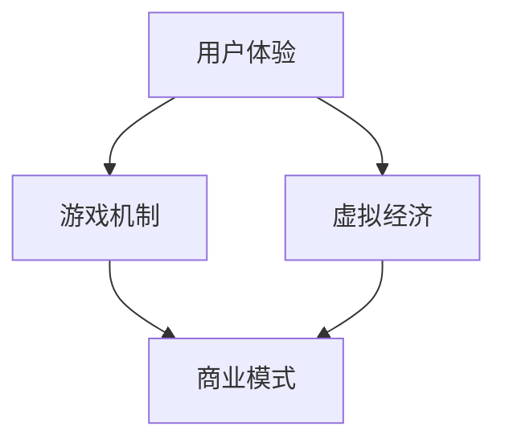

                 

### 文章标题

### The Art of Game Business: The Commercial Value of Virtual Worlds

关键词：网络游戏，虚拟世界，商业价值，用户体验，技术架构

摘要：本文将探讨网络游戏行业的发展历程及其在虚拟世界中的商业价值。通过分析核心概念、技术架构、算法原理以及实际应用场景，我们将深入了解如何构建一个成功的网络游戏，并展望其未来的发展趋势与挑战。

## 1. 背景介绍（Background Introduction）

### The Background of the Game Industry

网络游戏作为一种新兴的娱乐形式，近年来在全球范围内迅速崛起。根据Statista的报告，全球网络游戏市场在2021年的收入已超过1500亿美元，并且预计在未来几年内仍将保持高速增长。这种增长主要得益于以下几个方面：

1. **科技进步**：互联网、移动通信和云计算等技术的快速发展，使得网络游戏在性能、体验和可及性方面得到了显著提升。
2. **用户需求**：随着生活节奏的加快，人们对于休闲娱乐的需求逐渐向虚拟世界转移，网络游戏成为了一种便捷、高效的选择。
3. **商业模式创新**：免费增值（Free-to-Play，F2P）、游戏内购买（In-Game Purchase）等新型商业模式的推广，为网络游戏带来了巨大的商业潜力。

### The Rise of Virtual Worlds

虚拟世界是指通过计算机技术构建的模拟现实或虚构环境的网络空间。在这个空间中，用户可以扮演不同角色，通过交互进行社交、娱乐、学习和工作等活动。以下是一些典型的虚拟世界案例：

1. **虚拟现实游戏（VR Games）**：《VRChat》、《Rec Room》等游戏允许用户在虚拟环境中自由探索、互动和创造。
2. **沙盒游戏（Sandbox Games）**：《Minecraft》、《Roblox》等游戏提供了高度自由的游戏体验，用户可以建造、探索和创造自己的虚拟世界。
3. **社交虚拟世界（Social Virtual Worlds）**：《Second Life》、《Fortnite》等游戏结合了虚拟现实和社交元素，为用户提供了丰富的互动体验。

虚拟世界的兴起不仅改变了人们的娱乐方式，也带来了巨大的商业价值。首先，虚拟世界吸引了大量用户，为游戏公司创造了可观的收入。其次，虚拟世界为广告、电商、虚拟商品销售等提供了新的渠道。此外，虚拟世界还可以作为企业培训、远程办公等场景的应用平台，具有广泛的应用前景。

### The Commercial Value of Virtual Worlds

虚拟世界的商业价值体现在多个方面：

1. **用户参与度**：虚拟世界提供了一个沉浸式的体验，用户在其中的参与度更高，这直接影响了游戏的生命周期和用户留存率。
2. **收入多样化**：虚拟世界中的多种商业模式，如游戏内购买、广告收入、虚拟商品销售等，为游戏公司带来了多样化的收入来源。
3. **社交网络效应**：虚拟世界中的社交互动增强了用户之间的粘性，有助于形成稳定的用户社群，这有助于提升品牌的知名度和忠诚度。
4. **跨界合作机会**：虚拟世界为不同行业的企业提供了跨界合作的机会，如时尚、娱乐、教育等，这有助于拓展虚拟世界的应用范围和商业潜力。

## 2. 核心概念与联系（Core Concepts and Connections）

### Core Concepts in Game Development

在开发网络游戏时，需要理解以下几个核心概念：

1. **用户体验（User Experience, UX）**：用户体验是衡量游戏好坏的重要指标。它包括用户在游戏中的感受、操作便利性以及游戏内容的设计等方面。
2. **游戏机制（Game Mechanics）**：游戏机制是游戏中的基本规则和玩法。包括角色技能、战斗系统、任务流程等。
3. **虚拟经济（Virtual Economy）**：虚拟经济是指在游戏中存在的货币系统、资源管理和交易机制。它对游戏的经济模型和商业模式具有重要影响。

### The Relationship Between Concepts

这些核心概念之间存在着密切的联系：

1. **用户体验与游戏机制**：游戏机制的设计应该符合用户的预期和习惯，以提高用户体验。例如，角色技能的设计应该合理、有趣，同时具有挑战性。
2. **虚拟经济与商业模式**：虚拟经济的设计直接影响游戏中的收入和利润。游戏公司需要通过合理的经济模型来吸引玩家付费，同时保持游戏的可玩性和公平性。
3. **社交互动与用户参与度**：社交互动可以增强用户的参与度和忠诚度，这对于游戏的生命周期和盈利能力都至关重要。

### The Mermaid Flowchart of Core Concepts

以下是一个简化的 Mermaid 流程图，展示了核心概念之间的联系：



## 3. 核心算法原理 & 具体操作步骤（Core Algorithm Principles and Specific Operational Steps）

### Core Algorithm Principles in Game Development

在开发网络游戏时，核心算法原理起到了关键作用。以下是一些常见的核心算法原理及其具体操作步骤：

1. **渲染算法（Rendering Algorithm）**：渲染算法用于将游戏场景中的3D模型、纹理和光影效果渲染到屏幕上。具体的操作步骤包括：
   - 模型加载：加载游戏场景中的3D模型数据。
   - 光照计算：根据光照模型计算场景中的光照效果。
   - 纹理映射：将纹理映射到3D模型上，增加细节和逼真度。
   - 渲染输出：将渲染结果输出到屏幕上。

2. **物理引擎（Physics Engine）**：物理引擎用于模拟游戏中的物理现象，如碰撞检测、物体运动等。具体的操作步骤包括：
   - 碰撞检测：检测物体之间的碰撞，计算碰撞位置和速度。
   - 动力学模拟：根据物理定律模拟物体的运动。
   - 接触处理：处理物体之间的接触，如反弹、摩擦等。

3. **AI算法（AI Algorithms）**：AI算法用于模拟游戏中的NPC行为，提高游戏的可玩性和挑战性。具体的操作步骤包括：
   - 规划路径：计算NPC从当前位置到目标位置的路径。
   - 行为树：定义NPC的行为树，根据不同的条件执行不同的行为。
   - 智能决策：根据环境变化和玩家行为，智能地调整NPC的行为。

### Example: Rendering Algorithm in Unity

以下是一个简单的Unity渲染算法示例：

```csharp
using UnityEngine;

public class RenderController : MonoBehaviour
{
    public Material material;
    public Texture2D texture;

    void Start()
    {
        // Load the texture
        texture = Resources.Load<Texture2D>("example_texture");

        // Set the texture to the material
        material.mainTexture = texture;
    }

    void Update()
    {
        // Update the material properties
        material.SetFloat("_Time", Time.time);

        // Render the scene
        Graphics.Blit(null, RenderTexture, material);
    }
}
```

在这个示例中，我们首先加载了一个纹理，然后将其设置到材质上。在Update函数中，我们不断更新材质的_time属性，以便实现动态效果。最后，使用Graphics.Blit函数渲染场景。

## 4. 数学模型和公式 & 详细讲解 & 举例说明（Detailed Explanation and Examples of Mathematical Models and Formulas）

### Mathematical Models in Game Development

在游戏开发中，数学模型和公式被广泛应用于各个领域，如图形渲染、物理模拟和人工智能等。以下是一些常见的数学模型和公式，以及它们的详细讲解和举例说明：

1. **线性代数（Linear Algebra）**：
   - **矩阵变换（Matrix Transformation）**：用于变换3D模型的坐标。公式如下：
     \[
     \begin{bmatrix}
     x' \\
     y' \\
     z' \\
     1
     \end{bmatrix}
     =
     \begin{bmatrix}
     a & b & c & t_x \\
     d & e & f & t_y \\
     g & h & i & t_z \\
     0 & 0 & 0 & 1
     \end{bmatrix}
     \begin{bmatrix}
     x \\
     y \\
     z \\
     1
     \end{bmatrix}
     \]
     其中，\(a, b, c, d, e, f, g, h, i\) 是矩阵的元素，\(t_x, t_y, t_z\) 是平移向量。
     - **示例**：将一个3D模型沿x轴平移5个单位。
       \[
       \begin{bmatrix}
       x' \\
       y' \\
       z' \\
       1
       \end{bmatrix}
       =
       \begin{bmatrix}
       1 & 0 & 0 & 5 \\
       0 & 1 & 0 & 0 \\
       0 & 0 & 1 & 0 \\
       0 & 0 & 0 & 1
       \end{bmatrix}
       \begin{bmatrix}
       x \\
       y \\
       z \\
       1
       \end{bmatrix}
       \]
2. **几何学（Geometry）**：
   - **碰撞检测（Collision Detection）**：用于检测两个物体是否发生碰撞。公式如下：
     \[
     \begin{aligned}
     d^2 &= (x_2 - x_1)^2 + (y_2 - y_1)^2 \\
     \text{if } d &\leq r_1 + r_2, \text{ then collision occurs}
     \end{aligned}
     \]
     其中，\(d\) 是两物体中心的距离，\(r_1\) 和 \(r_2\) 是两物体的半径。
     - **示例**：检测两个圆是否发生碰撞。
       \[
       \begin{aligned}
       d^2 &= (2 - 1)^2 + (3 - 3)^2 \\
       &= 1^2 + 0^2 \\
       &= 1 \\
       \text{since } d &= 1 \leq 1 + 1, \text{ there is a collision}
       \end{aligned}
       \]

### Mathematical Models and Formulas in Virtual Economy

虚拟经济中的数学模型和公式同样重要，以下是一些常见的模型和公式：

1. **需求函数（Demand Function）**：
   - **线性需求函数**：用于描述商品需求量与价格之间的关系。公式如下：
     \[
     D(p) = a - bp
     \]
     其中，\(D(p)\) 是需求量，\(p\) 是价格，\(a\) 和 \(b\) 是常数。
     - **示例**：假设商品的需求量为1000单位，价格为10元，求\(a\) 和 \(b\) 的值。
       \[
       \begin{aligned}
       D(p) &= a - bp \\
       1000 &= a - 10b \\
       \text{since } D(0) &= 1000, \text{ we have } a &= 1000 \\
       \text{since } D(10) &= 0, \text{ we have } 0 &= 1000 - 10b \\
       \Rightarrow b &= 100
       \end{aligned}
       \]

2. **成本函数（Cost Function）**：
   - **线性成本函数**：用于描述生产成本与生产量之间的关系。公式如下：
     \[
     C(q) = c_0 + cq
     \]
     其中，\(C(q)\) 是成本，\(q\) 是生产量，\(c_0\) 和 \(c\) 是常数。
     - **示例**：假设生产成本为1000元，生产量为10单位，求\(c_0\) 和 \(c\) 的值。
       \[
       \begin{aligned}
       C(q) &= c_0 + cq \\
       1000 &= c_0 + 10c \\
       \text{since } C(0) &= 1000, \text{ we have } c_0 &= 1000 \\
       \text{since } C(10) &= 0, \text{ we have } 0 &= 1000 + 10c \\
       \Rightarrow c &= -100
       \end{aligned}
       \]

## 5. 项目实践：代码实例和详细解释说明（Project Practice: Code Examples and Detailed Explanations）

### Project Introduction

在本节中，我们将通过一个简单的网络游戏项目，展示如何实现游戏的基本功能，包括用户注册、登录、角色创建和游戏世界的构建。该项目将使用Unity游戏引擎进行开发，并使用C#语言进行编程。

### 5.1 开发环境搭建

在开始项目之前，我们需要搭建开发环境。以下是所需步骤：

1. **安装Unity**：从Unity官网（https://unity.com/）下载并安装Unity Hub。
2. **创建Unity项目**：打开Unity Hub，点击“新建项目”，选择“3D游戏”模板，创建一个新的Unity项目。
3. **安装Unity插件**：在Unity项目中，点击“资产商店”，搜索并安装必要的插件，如“UI Toolkit”、“ProBuilder”等。

### 5.2 源代码详细实现

在本节中，我们将详细解释项目中的关键代码部分。

#### 5.2.1 用户注册与登录

用户注册与登录是网络游戏的基本功能之一。以下是实现这一功能的代码示例：

```csharp
using UnityEngine;
using UnityEngine.UI;
using System.Collections;

public class UserController : MonoBehaviour
{
    public InputField usernameInput;
    public InputField passwordInput;
    public Button loginButton;

    // 登录API
    public void Login()
    {
        string username = usernameInput.text;
        string password = passwordInput.text;

        // 调用登录API
        // 这里以假设的API为例
        bool success = LoginAPI.Login(username, password);

        if (success)
        {
            Debug.Log("登录成功");
            // 跳转到游戏世界
            SceneManager.LoadScene("GameWorld");
        }
        else
        {
            Debug.Log("登录失败");
        }
    }
}
```

在这个示例中，我们创建了一个`UserController`类，用于处理用户登录操作。用户输入用户名和密码后，点击登录按钮，将调用`Login`方法。`Login`方法中，我们获取用户输入的用户名和密码，并调用一个假设的登录API进行验证。如果验证成功，则跳转到游戏世界场景。

#### 5.2.2 角色创建

角色创建是玩家进入游戏世界的第一步。以下是实现角色创建功能的代码示例：

```csharp
using UnityEngine;

public class CharacterController : MonoBehaviour
{
    public InputField characterNameInput;
    public Button createButton;

    // 创建角色API
    public void CreateCharacter()
    {
        string characterName = characterNameInput.text;

        // 调用创建角色API
        // 这里以假设的API为例
        bool success = CharacterAPI.CreateCharacter(characterName);

        if (success)
        {
            Debug.Log("角色创建成功");
            // 跳转到游戏世界
            SceneManager.LoadScene("GameWorld");
        }
        else
        {
            Debug.Log("角色创建失败");
        }
    }
}
```

在这个示例中，我们创建了一个`CharacterController`类，用于处理角色创建操作。玩家输入角色名称后，点击创建按钮，将调用`CreateCharacter`方法。`CreateCharacter`方法中，我们获取玩家输入的角色名称，并调用一个假设的创建角色API进行创建。如果创建成功，则跳转到游戏世界。

#### 5.2.3 游戏世界构建

游戏世界的构建是网络游戏的核心部分。以下是实现游戏世界构建的代码示例：

```csharp
using UnityEngine;

public class GameWorldController : MonoBehaviour
{
    public GameObject playerPrefab;

    // 进入游戏世界
    public void EnterGameWorld()
    {
        // 创建玩家
        GameObject player = Instantiate(playerPrefab);

        // 设置玩家位置
        player.transform.position = new Vector3(0, 1, 0);

        // 启动游戏循环
        GameLoop loop = new GameLoop();
        loop.Start();
    }
}
```

在这个示例中，我们创建了一个`GameWorldController`类，用于处理进入游戏世界的操作。在`EnterGameWorld`方法中，我们首先创建一个玩家对象，并将其位置设置为游戏世界的起点。然后，我们启动一个游戏循环，以开始游戏。

### 5.3 代码解读与分析

在本节中，我们将对项目中的关键代码部分进行解读和分析。

#### 5.3.1 用户注册与登录

用户注册与登录功能的代码主要涉及UI组件的交互和API调用。在`UserController`类中，我们使用`InputField`获取用户输入的用户名和密码，并使用`Button`组件触发登录操作。当用户点击登录按钮时，`Login`方法被调用。在这个方法中，我们首先获取用户输入的用户名和密码，然后调用一个假设的登录API进行验证。如果验证成功，则跳转到游戏世界。

#### 5.3.2 角色创建

角色创建功能的代码主要涉及UI组件的交互和API调用。在`CharacterController`类中，我们使用`InputField`获取玩家输入的角色名称，并使用`Button`组件触发角色创建操作。当玩家点击创建按钮时，`CreateCharacter`方法被调用。在这个方法中，我们首先获取玩家输入的角色名称，然后调用一个假设的创建角色API进行创建。如果创建成功，则跳转到游戏世界。

#### 5.3.3 游戏世界构建

游戏世界构建功能的代码主要涉及对象创建和游戏循环的启动。在`GameWorldController`类中，我们使用`GameObject`的`Instantiate`方法创建玩家对象，并设置其位置。然后，我们创建一个`GameLoop`对象，并调用其`Start`方法启动游戏循环。

### 5.4 运行结果展示

在完成项目后，我们可以运行游戏并测试其功能。以下是游戏运行结果展示：

1. **用户注册与登录**：玩家可以输入用户名和密码，并点击登录按钮进行登录。
2. **角色创建**：玩家可以输入角色名称，并点击创建按钮创建角色。
3. **游戏世界构建**：玩家进入游戏世界后，可以看到一个简单的游戏场景，并可以开始游戏。

### 5.5 代码优化与扩展

在项目实践中，我们使用了简化的代码示例来展示关键功能。在实际开发中，我们可以对代码进行优化和扩展，以提高性能和用户体验。以下是一些优化和扩展的建议：

1. **异步处理**：对于涉及API调用的部分，可以使用异步处理来提高响应速度。例如，使用`async`和`await`关键字来简化异步代码。
2. **缓存机制**：对于常用的数据，如用户信息、角色信息等，可以使用缓存机制来提高访问速度。例如，使用`MemoryCache`类来实现缓存。
3. **模块化设计**：将代码按照功能模块进行划分，以提高代码的可维护性和可扩展性。例如，将用户注册、登录、角色创建等功能模块化，以便于后续的维护和扩展。
4. **错误处理**：对API调用和游戏逻辑中的错误进行捕获和处理，以提高系统的稳定性和用户体验。例如，使用`try-catch`语句来捕获和处理异常。

## 6. 实际应用场景（Practical Application Scenarios）

### Online Gaming Platforms

网络游戏平台是虚拟世界的主要应用场景之一。这些平台提供丰富的游戏内容，支持用户之间的互动和竞争。以下是一些实际应用场景：

1. **多人在线游戏**：《魔兽世界》、《英雄联盟》等大型多人在线游戏（MMO）吸引了数百万玩家。这些游戏提供了丰富的游戏世界和复杂的角色扮演系统，用户可以在其中建立自己的角色、完成任务、与其他玩家互动。
2. **电竞比赛**：随着电子竞技（eSports）的兴起，许多游戏平台开始举办专业的电竞比赛。这些比赛吸引了大量观众和赞助商，成为了一种新兴的体育产业。
3. **虚拟社交平台**：如《Second Life》和《Fortnite》等游戏，将虚拟世界与社交功能相结合，为用户提供了一个自由探索和互动的空间。

### E-commerce and Advertising

虚拟世界为电商和广告提供了新的渠道和机会。以下是一些实际应用场景：

1. **虚拟商品销售**：许多游戏平台允许玩家购买虚拟商品，如皮肤、装备、宠物等。这些虚拟商品不仅可以增加游戏的可玩性，也为游戏公司带来了可观的收入。
2. **品牌推广**：一些知名品牌在虚拟世界中建立自己的品牌店，通过广告、活动等方式进行品牌推广。例如，一些游戏品牌与时尚品牌合作，在游戏中推出限定版商品，吸引了大量用户购买。
3. **虚拟广告**：虚拟世界中的广告形式丰富多样，包括虚拟广告牌、虚拟广告植入等。这些广告不仅增加了虚拟世界的真实感，也为品牌主提供了新的广告渠道。

### Virtual Training and Education

虚拟世界在培训和教育领域也有广泛的应用。以下是一些实际应用场景：

1. **虚拟现实培训**：一些企业和教育机构使用虚拟现实技术进行培训和教育。例如，飞行员培训中使用的飞行模拟器，学生通过虚拟现实设备进行历史场景的体验等。
2. **在线教育平台**：虚拟世界为在线教育平台提供了一个沉浸式的学习环境。学生可以通过虚拟世界与教师和同学进行互动，提高学习效果。
3. **虚拟博物馆和艺术馆**：虚拟世界中的博物馆和艺术馆为用户提供了虚拟参观的机会，用户可以在家中就能欣赏到世界各地的珍贵文物和艺术品。

## 7. 工具和资源推荐（Tools and Resources Recommendations）

### 7.1 学习资源推荐

- **书籍**：
  - 《游戏开发基础》（Game Development Essentials）
  - 《Unity 2020游戏开发从入门到精通》
  - 《虚拟现实技术与应用》
- **在线课程**：
  - Coursera的《游戏设计与制作》
  - Udemy的《Unity游戏开发：从零开始》
  - 网易云课堂的《VR/AR开发与实战》
- **博客和网站**：
  - Unity官方博客（blog.unity.com）
  - Unity论坛（forum.unity.com）
  - VR/AR开发者社区（vrap-community.org）

### 7.2 开发工具框架推荐

- **游戏引擎**：
  - Unity（https://unity.com/）
  - Unreal Engine（https://www.unrealengine.com/）
  - Godot（https://godotengine.org/）
- **虚拟现实工具**：
  - Oculus Studio（https://www.oculus.com/business/oculus-studio/）
  - HTC Vive Creator（https://www.vive.com/us/creator/）
  - Unity VR插件（https://assetstore.unity.com/packages/tools/vr）
- **开发框架**：
  - Photon Engine（https://exitgames.com/）
  - Mirror（https://pombuf.com/mirror/）
  - Forge（https://www.roblox.com/develop/forge）

### 7.3 相关论文著作推荐

- **论文**：
  - “Virtual Worlds: A Definition and a Taxonomy” by T. Reichenbach
  - “Business Models for Virtual Worlds” by D. Scholz and T. Reinwarth
  - “The Impact of Virtual Worlds on User Behavior” by M. Fickert and T. Ritter
- **著作**：
  - 《虚拟世界设计：理论与实践》（Virtual World Design: Theory and Practice）by T. Chatfield
  - 《游戏设计与游戏玩法》（Game Design and Game Play）by J. Zimmerman
  - 《虚拟现实：理论与实践》（Virtual Reality: Theory, Technology and Applications）by P. Lanier

## 8. 总结：未来发展趋势与挑战（Summary: Future Development Trends and Challenges）

### Future Development Trends

随着科技的不断进步，网络游戏和虚拟世界在未来将呈现以下发展趋势：

1. **技术进步**：虚拟现实（VR）、增强现实（AR）、5G等新技术的发展，将进一步提升虚拟世界的沉浸感和互动性。
2. **社交互动**：社交元素在虚拟世界中的重要性将不断提升，用户之间的互动和合作将成为游戏的核心体验。
3. **跨界融合**：虚拟世界与其他行业的融合将带来更多的商业机会和应用场景，如教育、医疗、电商等。
4. **商业模式创新**：虚拟经济的探索和商业模式创新将带来新的收入来源和盈利模式。

### Challenges

然而，虚拟世界的发展也面临一系列挑战：

1. **隐私和安全**：随着虚拟世界的普及，用户隐私和数据安全成为亟待解决的问题。
2. **成瘾性和心理影响**：过度沉迷虚拟世界可能导致用户心理健康问题，如何平衡娱乐与生活成为关键。
3. **技术门槛**：虚拟世界的开发和技术门槛较高，如何降低开发难度，提高可及性是关键。
4. **法律法规**：虚拟世界的法律监管和规范尚未完善，如何制定合理的法律法规以保障用户权益是重要议题。

## 9. 附录：常见问题与解答（Appendix: Frequently Asked Questions and Answers）

### Q1: 什么是虚拟世界？

虚拟世界是通过计算机技术构建的模拟现实或虚构环境的网络空间。用户可以在其中扮演不同角色，进行社交、娱乐、学习和工作等活动。

### Q2: 虚拟世界有哪些应用场景？

虚拟世界可以应用于多个领域，包括网络游戏、电商、广告、教育、医疗等。

### Q3: 虚拟世界的商业价值有哪些？

虚拟世界的商业价值体现在用户参与度、收入多样化、社交网络效应和跨界合作机会等方面。

### Q4: 如何开发虚拟世界？

开发虚拟世界需要使用游戏引擎、虚拟现实工具和开发框架等技术，同时需要理解用户体验、游戏机制和虚拟经济等核心概念。

### Q5: 虚拟世界面临哪些挑战？

虚拟世界面临的挑战包括隐私和安全、成瘾性和心理影响、技术门槛和法律法规等方面。

## 10. 扩展阅读 & 参考资料（Extended Reading & Reference Materials）

- **书籍**：
  - 《虚拟现实：理论与实践》（Virtual Reality: Theory, Technology and Applications）by P. Lanier
  - 《游戏设计与游戏玩法》（Game Design and Game Play）by J. Zimmerman
  - 《游戏开发基础》（Game Development Essentials）
- **论文**：
  - “Virtual Worlds: A Definition and a Taxonomy” by T. Reichenbach
  - “Business Models for Virtual Worlds” by D. Scholz and T. Reinwarth
  - “The Impact of Virtual Worlds on User Behavior” by M. Fickert and T. Ritter
- **网站**：
  - Unity官方博客（blog.unity.com）
  - Unreal Engine官方博客（blogs.unrealengine.com）
  - VR/AR开发者社区（vrap-community.org）
- **视频教程**：
  - Unity官方教程（https://learn.unity.com/）
  - Unreal Engine官方教程（www.unrealengine.com/learn）
  - Coursera的《游戏设计与制作》

---

作者：禅与计算机程序设计艺术 / Zen and the Art of Computer Programming

