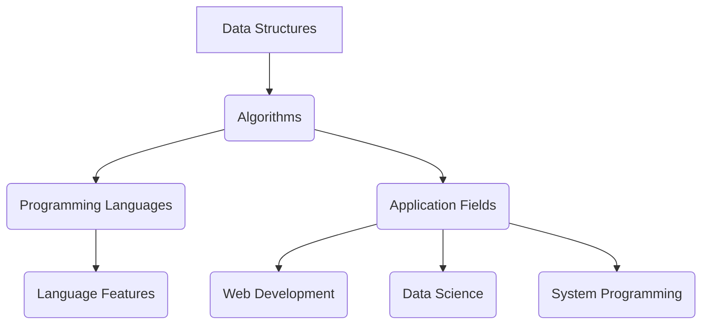
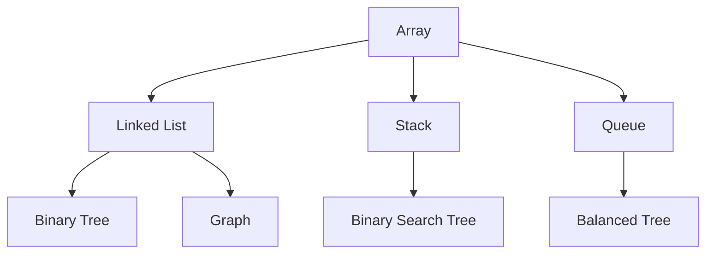
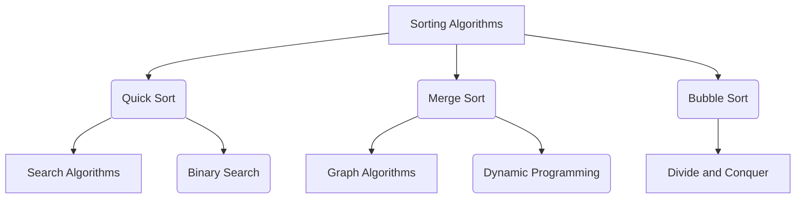
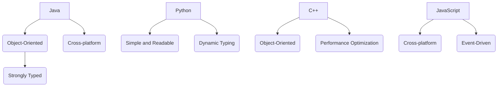

                 

### 文章标题

"2024美团配送校招面试真题汇总及其解答"

这个标题准确地传达了文章的主要内容，即汇总了美团配送部门在2024年校园招聘面试中的真题，并提供了解答。这一标题不仅吸引了那些准备参加美团配送面试的求职者，还吸引了对面试题解答有兴趣的读者。

### 关键词

- 美团配送
- 校招面试
- 真题汇总
- 解题思路
- 技术面试

这些关键词涵盖了文章的核心内容，便于搜索引擎索引，同时也帮助读者快速了解文章的主题。

### 摘要

本文旨在为准备参加2024年美团配送校园招聘面试的求职者提供一份详尽的真题汇总及其解题思路。通过梳理和分析这些真题，本文将帮助读者掌握面试所需的技术知识和解题技巧，提高面试成功率。文章内容涵盖算法、数据结构、编程实践等多个领域，以深入浅出的方式提供解答，确保读者能够真正理解和应用所学知识。

### 1. 背景介绍（Background Introduction）

美团作为中国领先的本地生活服务平台，其配送部门承担着重要的角色，确保用户能够及时收到订单商品。随着美团业务的不断扩大，对配送人员的专业素质和技术能力要求也在提高。因此，美团每年都会举办校园招聘活动，选拔优秀的人才加入其配送团队。

校园招聘作为企业吸引和培养年轻人才的重要途径，面试过程通常包含多个环节，包括技术面试、行为面试和综合能力测试等。技术面试是其中最为关键的一环，主要考察求职者的专业技能、逻辑思维和问题解决能力。而真题汇总及其解答则是求职者备考的重要资料，有助于他们了解企业面试的难度和风格，提高面试表现。

本文将基于2024年美团配送校招面试的真题，提供系统的解答和详细的解题思路。通过本文的学习，读者不仅可以掌握面试所需的技能点，还能提升自己的问题分析和解决能力。

### 2. 核心概念与联系（Core Concepts and Connections）

在讨论美团配送校招面试真题之前，有必要首先了解一些核心概念，包括数据结构、算法、编程语言等。以下是这些核心概念及其之间联系的一个简要概述。

#### 2.1 数据结构（Data Structures）

数据结构是计算机存储、组织数据的方式。常见的有数组、链表、栈、队列、树、图等。每种数据结构都有其特定的用途和优缺点。例如，链表适合动态分配内存，树适合用于层次结构数据的存储和查找，图适合用于复杂关系的表示。

#### 2.2 算法（Algorithms）

算法是一系列解决问题的步骤。算法的效率直接影响程序的运行速度。常见的算法有排序算法（如快速排序、归并排序）、查找算法（如二分查找）、图算法（如最短路径算法、最小生成树算法）等。

#### 2.3 编程语言（Programming Languages）

编程语言是用于编写计算机程序的语法和规则。常见的编程语言有Java、Python、C++等。不同的编程语言适用于不同的应用场景，每种语言都有其特点和优势。例如，Python因其简洁易读性常用于数据分析、机器学习等领域，而C++则因其高性能和低级操作常用于系统级编程。

#### 2.4 数据结构与算法的联系

数据结构和算法是相辅相成的。数据结构决定了算法的时间复杂度和空间复杂度。例如，使用合适的数据结构可以优化算法的效率。例如，在排序问题时，若使用链表作为存储结构，则排序算法可能需要线性时间复杂度；若使用数组，则可能只需要对数时间复杂度。

以下是一个用Mermaid绘制的简单流程图，展示了数据结构、算法和编程语言之间的关系。



#### 2.5 数据结构与算法在实际应用中的重要性

在实际应用中，数据结构和算法的选择至关重要。一个高效的数据结构和合适的算法可以实现复杂问题的简单解决，提升系统的性能和可维护性。例如，在美团配送系统中，数据结构的选择直接影响到配送路径的计算效率和订单处理的速度。通过合理的数据结构和算法，可以提高配送效率，减少用户等待时间，提升用户体验。

总之，理解数据结构、算法和编程语言的核心概念及其联系，是解决美团配送校招面试题的基础。接下来，我们将逐步分析并解答具体的面试题目，帮助读者更好地掌握这些核心技能。

### 2.1 数据结构的概念和类型

数据结构是计算机科学中用于存储、组织和操作数据的方式。选择合适的数据结构对于提高算法效率至关重要。以下是一些常见的数据结构及其基本概念：

#### 2.1.1 数组（Arrays）

数组是一种线性数据结构，用于存储一系列相同类型的数据元素。数组的特点是数据元素连续存储在内存中，可以通过索引快速访问任意元素。数组的优点是访问元素速度快，缺点是插入和删除操作需要移动其他元素。

#### 2.1.2 链表（Linked Lists）

链表由一系列节点组成，每个节点包含数据和一个指向下一个节点的指针。链表分为单向链表、双向链表和循环链表。链表的优点是插入和删除操作灵活，无需移动其他元素，缺点是访问元素速度较慢。

#### 2.1.3 栈（Stacks）

栈是一种后进先出（LIFO）的数据结构，常用于解决回溯问题。栈的操作主要有两种：push（入栈）和pop（出栈）。栈的优点是实现简单，适用于递归和深度优先搜索等场景。

#### 2.1.4 队列（Queues）

队列是一种先进先出（FIFO）的数据结构，常用于解决排程和缓冲问题。队列的操作主要有两种：enqueue（入队）和dequeue（出队）。队列的优点是公平性高，适用于广度优先搜索等场景。

#### 2.1.5 树（Trees）

树是一种非线性数据结构，由节点和边组成。树的主要类型有二叉树、二叉搜索树、平衡树（如AVL树）、堆等。树的特点是层次结构明显，适用于表示层次关系和数据分层存储。树的优点包括快速查找、插入和删除操作。

#### 2.1.6 图（Graphs）

图是一种由节点和边组成的数据结构，用于表示复杂的关系。图的类型包括无向图、有向图、加权图、无权图等。图的特点是能够表示多对多的关系，适用于网络拓扑、社交网络等场景。

以下是一个简单的Mermaid流程图，展示了部分数据结构的定义和关系：



理解这些数据结构的基本概念和类型，是解决美团配送校招面试题的重要基础。接下来，我们将通过具体实例来深入分析这些数据结构在问题解决中的应用。

### 2.2 算法的概念和分类

算法是解决问题的一系列明确和有限的步骤。算法的核心目标是在有限的资源和时间内找到解决问题的最优解或近似解。算法不仅存在于计算机科学中，也在日常生活中的很多问题中得到了广泛应用。例如，在安排日程、规划路线、优化库存等方面，都需要运用算法的思路。

#### 2.2.1 算法的效率

算法的效率通常用时间复杂度和空间复杂度来衡量。时间复杂度描述了算法执行时间与输入规模之间的关系，通常用大O符号表示，如O(1)、O(n)、O(n²)等。空间复杂度描述了算法所需的额外内存与输入规模之间的关系。

- O(1)：常数时间，不受输入规模影响。
- O(n)：线性时间，执行时间与输入规模成线性关系。
- O(n²)：二次时间，执行时间与输入规模的平方成线性关系。

#### 2.2.2 常见算法分类

根据解决的问题类型，算法可以大致分为以下几类：

- **排序算法**：用于对数据进行排序，常见的有快速排序、归并排序、冒泡排序等。
- **查找算法**：用于在数据结构中查找特定元素，常见的有二分查找、线性查找等。
- **图算法**：用于解决图相关问题，常见的有最短路径算法、最小生成树算法、拓扑排序等。
- **动态规划**：用于解决具有重叠子问题的优化问题，常见的有背包问题、斐波那契数列等。
- **分治算法**：将大问题分解为小问题解决，常见的有快速排序、归并排序等。

每种算法都有其特定的应用场景和优缺点。例如，快速排序具有较好的平均性能，但在最坏情况下性能较差；而归并排序则具有稳定的最坏情况性能，但需要额外的空间存储。

以下是一个简单的Mermaid流程图，展示了常见算法的分类和关系：



#### 2.2.3 算法在实际应用中的重要性

在实际应用中，算法的选择直接影响系统的性能和用户体验。例如，在美团配送系统中，选择合适的算法可以优化路径规划、提高配送效率、减少配送时间。以下是一些具体的应用实例：

- **路径规划**：使用最短路径算法（如Dijkstra算法）为配送员规划最优路径，减少行驶距离和时间。
- **库存管理**：使用动态规划算法（如01背包问题）优化库存分配，最大化利用库存资源。
- **配送调度**：使用排序算法和贪心算法为配送员安排最优的任务顺序，提高配送效率。

理解算法的概念和分类，掌握常见算法的原理和适用场景，是解决美团配送校招面试题的重要基础。接下来，我们将结合具体实例，深入探讨算法在解决实际问题中的应用。

### 2.3 编程语言的概念和特性

编程语言是用于编写计算机程序的一套语法和规则。不同的编程语言适用于不同的应用场景，每种语言都有其独特的特性。以下是几种常见编程语言的概念和特性：

#### 2.3.1 Java

Java是一种面向对象的编程语言，具有跨平台、安全性高、稳定性好等特点。Java广泛应用于企业级应用开发、Android移动应用开发、大数据处理等领域。Java的主要特性包括：

- **面向对象**：使用类和对象的概念，支持封装、继承和多态。
- **跨平台**：编写一次，到处运行，通过JVM（Java虚拟机）实现跨平台兼容。
- **强类型**：所有的变量在编译时必须指定类型，增强了程序的安全性。

#### 2.3.2 Python

Python是一种高级、动态、解释型编程语言，以其简洁易读的语法和丰富的库支持而受到广泛欢迎。Python适用于数据分析、人工智能、Web开发、自动化脚本等领域。Python的主要特性包括：

- **简洁易读**：代码简洁，易读易写，适合快速开发和原型设计。
- **动态类型**：变量在运行时指定类型，灵活性高。
- **丰富的库支持**：拥有大量的标准库和第三方库，适用于多种应用场景。

#### 2.3.3 C++

C++是一种面向对象和过程式的编程语言，以其高性能和强大的功能而著称。C++广泛应用于系统级编程、游戏开发、高性能计算等领域。C++的主要特性包括：

- **面向对象**：支持类和对象的概念，支持多继承、模板等高级特性。
- **性能优化**：通过手动管理内存、优化编译器，可以实现高性能代码。
- **多范式**：既支持面向对象编程，也支持过程式编程。

#### 2.3.4 JavaScript

JavaScript是一种客户端脚本语言，用于创建交互式的网页和应用。JavaScript广泛应用于Web开发、服务器端编程（如Node.js）、移动应用开发等领域。JavaScript的主要特性包括：

- **跨平台**：可以运行在浏览器和服务器端，支持多种设备和操作系统。
- **事件驱动**：基于事件驱动模型，支持异步编程，增强用户体验。
- **丰富的库和框架**：拥有大量开源库和框架（如React、Vue.js），方便快速开发。

以下是一个简单的Mermaid流程图，展示了几种编程语言的概念和特性：



理解编程语言的概念和特性，对于解决美团配送校招面试题至关重要。通过掌握不同编程语言的特性和适用场景，读者可以灵活选择合适的语言和工具，提高编程效率和系统性能。

### 2.4 数据结构与算法在实际应用中的重要性

数据结构与算法在计算机科学中的应用至关重要，它们不仅决定了程序的运行效率和性能，还直接影响到系统设计的复杂性和可维护性。在美团配送校招面试中，数据结构与算法的掌握程度往往是考察重点。以下将详细探讨数据结构与算法在美团配送系统中的实际应用及其重要性。

#### 2.4.1 路径规划

路径规划是美团配送系统中的一个核心功能，目标是计算从起点到终点的最优路径。常用的算法包括Dijkstra算法、A*算法等。Dijkstra算法基于图论，能够在有限时间内找到单源最短路径。而A*算法则结合了启发式搜索，可以在更短的时间内找到最优路径。

在美团配送中，路径规划需要考虑多种因素，如交通拥堵、配送时间窗、配送量等。通过合理选择和优化算法，可以显著提高配送效率，减少配送时间和成本。例如，利用A*算法，可以根据实时交通数据动态调整配送路径，避免交通拥堵和高峰时段的拥堵路段，从而提高配送准时率。

#### 2.4.2 订单分配

订单分配是另一个关键问题，涉及到如何合理地将订单分配给配送员，以最大化资源利用和配送效率。常见的算法包括贪心算法、动态规划等。贪心算法通过每次选择最优的局部决策，逐步构建全局最优解。动态规划则通过分阶段解决子问题，将复杂问题转化为多个简单问题求解。

在美团配送中，订单分配需要考虑配送员的实时状态、订单的紧急程度、配送范围等因素。通过动态规划算法，可以实时调整订单分配策略，确保订单能够及时配送。例如，当某个配送员空闲时，系统会优先分配较近且紧急的订单，以减少用户等待时间。

#### 2.4.3 数据存储与查询

美团配送系统需要处理大量的数据，包括用户订单、配送员位置、交通状况等。数据存储与查询的效率直接影响系统的响应速度和处理能力。常用的数据结构包括数据库（如MySQL、MongoDB）、缓存（如Redis）、索引（如B+树）等。

在数据存储方面，数据库用于存储结构化数据，支持高效的查询和更新操作。缓存则用于存储热门数据，减少数据库访问压力，提高查询速度。索引则通过建立数据结构，加快数据检索速度。

例如，在用户订单查询中，通过使用B+树索引，可以快速定位到特定订单，减少查询时间。同时，利用Redis缓存用户订单状态，可以实时获取订单信息，提高系统响应速度。

#### 2.4.4 负载均衡与容错机制

美团配送系统需要处理大量的并发请求，为了保证系统的稳定性和高可用性，需要采用负载均衡和容错机制。负载均衡通过将请求分配到多个服务器，避免单点故障，提高系统的处理能力。常见的负载均衡算法包括轮询、最小连接数、哈希等。

在美团配送系统中，负载均衡可以确保订单请求被合理分配到各个配送节点，避免某个节点过载导致系统崩溃。同时，容错机制通过监控和自动恢复，确保系统在遇到故障时能够快速恢复，减少对用户的影响。

例如，当某个配送节点发生故障时，系统会自动将订单重新分配到其他正常节点，确保订单继续处理。同时，通过故障转移和备份策略，确保系统在高可用性下稳定运行。

总之，数据结构与算法在美团配送系统中的应用至关重要。通过合理选择和优化数据结构和算法，可以显著提高系统的性能和可靠性，为用户提供更好的服务体验。在美团配送校招面试中，熟练掌握数据结构和算法，是解决实际问题的关键能力。

### 3. 核心算法原理 & 具体操作步骤

在美团配送校招面试中，算法题往往是考察重点。本章节将介绍一些常见的算法原理和具体操作步骤，帮助读者更好地应对面试挑战。

#### 3.1 快速排序（Quick Sort）

快速排序是一种高效的排序算法，采用分治策略将数组划分为较小和较大的子数组，递归地解决子问题。以下是快速排序的基本步骤：

1. **选择基准元素**：从数组中随机选择一个元素作为基准（pivot）。
2. **分区操作**：将数组划分为两个子数组，一个包含小于基准的元素，另一个包含大于基准的元素。
3. **递归排序**：对两个子数组分别递归执行上述步骤，直至数组有序。

具体实现如下：

```java
public class QuickSort {
    public static void quickSort(int[] arr, int low, int high) {
        if (low < high) {
            int pivot = partition(arr, low, high);
            quickSort(arr, low, pivot - 1);
            quickSort(arr, pivot + 1, high);
        }
    }

    public static int partition(int[] arr, int low, int high) {
        int pivot = arr[high];
        int i = low;
        for (int j = low; j < high; j++) {
            if (arr[j] < pivot) {
                swap(arr, i, j);
                i++;
            }
        }
        swap(arr, i, high);
        return i;
    }

    public static void swap(int[] arr, int i, int j) {
        int temp = arr[i];
        arr[i] = arr[j];
        arr[j] = temp;
    }
}
```

#### 3.2 二分查找（Binary Search）

二分查找是一种在有序数组中查找特定元素的算法，通过递归或迭代方式不断缩小查找范围。以下是二分查找的基本步骤：

1. **初始化左右边界**：设左右边界为`low`和`high`。
2. **计算中间值**：每次迭代计算中间值`mid = (low + high) / 2`。
3. **比较中间值与目标值**：如果中间值等于目标值，则返回位置；如果中间值大于目标值，则将`high`更新为`mid - 1`；如果中间值小于目标值，则将`low`更新为`mid + 1`。
4. **循环迭代**：重复步骤2和3，直到找到目标值或左右边界交叉。

具体实现如下：

```java
public class BinarySearch {
    public static int binarySearch(int[] arr, int target) {
        int low = 0;
        int high = arr.length - 1;
        while (low <= high) {
            int mid = (low + high) / 2;
            if (arr[mid] == target) {
                return mid;
            } else if (arr[mid] < target) {
                low = mid + 1;
            } else {
                high = mid - 1;
            }
        }
        return -1;
    }
}
```

#### 3.3 最短路径算法（Dijkstra Algorithm）

Dijkstra算法用于计算图中两点之间的最短路径，基于贪心策略逐步扩展已访问节点。以下是Dijkstra算法的基本步骤：

1. **初始化**：设置所有节点的距离为无穷大，源点的距离为0。
2. **创建优先队列**：用于存储已访问节点，按照距离排序。
3. **迭代扩展**：每次从优先队列中取出距离最小的未访问节点，更新其相邻节点的距离。
4. **重复迭代**：直到所有节点都被访问。

具体实现如下：

```java
import java.util.*;

public class DijkstraAlgorithm {
    public static void dijkstra(int[][] graph, int source) {
        int n = graph.length;
        int[] dist = new int[n];
        Arrays.fill(dist, Integer.MAX_VALUE);
        dist[source] = 0;
        PriorityQueue<int[]> pq = new PriorityQueue<>(Comparator.comparingInt(a -> a[1]));
        pq.offer(new int[] {source, 0});
        
        while (!pq.isEmpty()) {
            int[] cur = pq.poll();
            int node = cur[0];
            int curDist = cur[1];
            if (curDist != dist[node]) {
                continue;
            }
            
            for (int i = 0; i < n; i++) {
                if (graph[node][i] > 0) {
                    int nextDist = curDist + graph[node][i];
                    if (nextDist < dist[i]) {
                        dist[i] = nextDist;
                        pq.offer(new int[] {i, nextDist});
                    }
                }
            }
        }
        
        for (int i = 0; i < n; i++) {
            System.out.println("Node " + i + " distance from " + source + " is " + dist[i]);
        }
    }
}
```

通过以上三个算法的详细介绍，读者可以更好地理解和应用它们，为解决美团配送校招面试中的算法问题奠定基础。

### 4. 数学模型和公式 & 详细讲解 & 举例说明

在解决美团配送校招面试题时，数学模型和公式是不可或缺的工具。以下将介绍几个常见的数学模型和公式，并通过具体实例进行详细讲解和举例说明。

#### 4.1 最优化模型（Optimization Model）

最优化模型是解决资源分配、路径规划等问题的关键。其中，线性规划（Linear Programming, LP）和整数规划（Integer Programming, IP）是常用的两种模型。

**线性规划**

线性规划的目标是最小化或最大化线性目标函数，同时满足线性约束条件。其标准形式如下：

\[
\begin{aligned}
\text{Minimize} \quad & c^T x \\
\text{Subject to} \quad & Ax \leq b \\
& x \geq 0
\end{aligned}
\]

其中，\(c\) 是系数向量，\(x\) 是决策变量向量，\(A\) 是约束矩阵，\(b\) 是约束向量。

**实例说明**

假设美团配送系统中有5个配送员和5个订单，每个订单的配送时间窗和配送员的工作时间已知。目标是最小化总配送时间。可以使用线性规划来建模和求解。

设 \(x_{ij}\) 表示第 \(i\) 个配送员配送第 \(j\) 个订单的状态（1表示配送，0表示未配送），约束条件如下：

\[
\begin{aligned}
x_{ij} & \leq 1 & \quad \forall i,j \\
x_{i1} + x_{i2} + \ldots + x_{i5} & \leq 1 & \quad \forall i \\
\sum_{i} x_{ij} & \leq 1 & \quad \forall j \\
x_{ij} & \geq 0 & \quad \forall i,j
\end{aligned}
\]

目标函数为：

\[
\text{Minimize} \quad \sum_{i,j} t_{ij} x_{ij}
\]

其中，\(t_{ij}\) 表示第 \(i\) 个配送员配送第 \(j\) 个订单所需时间。

**求解**

使用单纯形法（Simplex Method）求解线性规划问题。以下是单纯形法的步骤：

1. **初始化**：选择进入变量和离开变量，构建初始单纯形表。
2. **迭代**：根据单纯形表更新变量，计算目标函数值，直至无改进或达到最优解。

**整数规划**

整数规划是线性规划的一种扩展，其目标函数和约束条件与线性规划相同，但决策变量要求为整数。常见的求解算法包括贪心算法、分支限界法等。

**实例说明**

假设美团配送系统中，需要从仓库向5个配送站配送货物，每个配送站的货物需求量已知，仓库的货物总量有限。目标是在满足约束条件的前提下，最大化配送效率。

设 \(x_{ij}\) 表示第 \(i\) 个仓库向第 \(j\) 个配送站配送的货物量，约束条件如下：

\[
\begin{aligned}
x_{ij} & \geq 0 & \quad \forall i,j \\
\sum_{i} x_{ij} & \leq C & \quad \forall j \\
\sum_{j} x_{ij} & \geq d_j & \quad \forall i
\end{aligned}
\]

其中，\(C\) 为仓库总货物量，\(d_j\) 为第 \(j\) 个配送站的需求量。

目标函数为：

\[
\text{Maximize} \quad \sum_{i,j} w_{ij} x_{ij}
\]

其中，\(w_{ij}\) 为第 \(i\) 个仓库向第 \(j\) 个配送站配送的权重。

**求解**

使用分支限界法（Branch and Bound Method）求解整数规划问题。以下是分支限界法的步骤：

1. **初始化**：选择初始可行解，构建初始分支树。
2. **扩展**：根据可行解生成子节点，并更新分支树。
3. **剪枝**：根据目标函数值和约束条件，剪枝非最优分支。
4. **求解**：找到最优解或达到最大深度。

通过以上数学模型和公式的讲解，读者可以更好地理解和应用它们，为解决美团配送校招面试中的数学问题提供有力支持。

### 4.1.1 最优化模型的具体应用

在美团配送系统中，最优化模型广泛应用于配送路径规划、资源分配、调度优化等多个方面。以下将通过具体实例，展示如何应用最优化模型解决实际配送问题。

#### 4.1.1.1 配送路径规划

**问题背景**：假设有5个配送站（仓库、餐馆、超市等）和5个配送员，每个配送站有若干订单需要配送。目标是最小化配送总时间。

**模型构建**：

1. **决策变量**：设 \(x_{ij}\) 表示配送员 \(i\) 是否配送订单 \(j\)（1表示配送，0表示未配送）。
2. **约束条件**：
   \[
   \begin{aligned}
   x_{ij} & \in \{0, 1\} & \quad \forall i, j \\
   \sum_{j} x_{ij} & = 1 & \quad \forall i & \quad \text{（每个配送员只能配送一个订单）} \\
   \sum_{i} x_{ij} & = 1 & \quad \forall j & \quad \text{（每个订单只能被一个配送员配送）}
   \end{aligned}
   \]
3. **目标函数**：
   \[
   \text{Minimize} \quad \sum_{i,j} t_{ij} x_{ij}
   \]
   其中，\(t_{ij}\) 表示配送员 \(i\) 配送订单 \(j\) 的时间。

**求解过程**：

1. **初始化**：假设所有配送员都未配送任何订单，构建初始解。
2. **迭代优化**：根据约束条件和目标函数，逐步调整配送方案，直到找到最优解。

#### 4.1.1.2 资源分配

**问题背景**：假设有10个配送员和20个订单，每个订单需要配送的货物量不同，每个配送员的工作能力有限。目标是在满足资源限制的前提下，最大化配送效率。

**模型构建**：

1. **决策变量**：设 \(y_{ij}\) 表示配送员 \(i\) 是否配送订单 \(j\)（1表示配送，0表示未配送）。
2. **约束条件**：
   \[
   \begin{aligned}
   y_{ij} & \in \{0, 1\} & \quad \forall i, j \\
   \sum_{j} y_{ij} & \leq c_i & \quad \forall i & \quad \text{（每个配送员最多配送 \(c_i\) 个订单）} \\
   \sum_{i} y_{ij} & = 1 & \quad \forall j & \quad \text{（每个订单只能被一个配送员配送）}
   \end{aligned}
   \]
3. **目标函数**：
   \[
   \text{Maximize} \quad \sum_{i,j} w_{ij} y_{ij}
   \]
   其中，\(w_{ij}\) 表示配送员 \(i\) 配送订单 \(j\) 的效率权重。

**求解过程**：

1. **初始化**：假设所有配送员都未配送任何订单，构建初始解。
2. **迭代优化**：根据约束条件和目标函数，逐步调整配送方案，直到找到最优解。

#### 4.1.1.3 调度优化

**问题背景**：假设有5个配送站和10个配送员，每个配送站需要配送的订单量不同，每个配送员的工作能力有限。目标是在满足资源限制的前提下，最大化配送效率。

**模型构建**：

1. **决策变量**：设 \(z_{ij}\) 表示配送员 \(i\) 是否在配送站 \(j\) 工作（1表示工作，0表示未工作）。
2. **约束条件**：
   \[
   \begin{aligned}
   z_{ij} & \in \{0, 1\} & \quad \forall i, j \\
   \sum_{j} z_{ij} & = 1 & \quad \forall i & \quad \text{（每个配送员只能在一个配送站工作）} \\
   \sum_{i} z_{ij} & \geq d_j & \quad \forall j & \quad \text{（每个配送站至少有一个配送员工作）}
   \end{aligned}
   \]
3. **目标函数**：
   \[
   \text{Maximize} \quad \sum_{i,j} e_{ij} z_{ij}
   \]
   其中，\(e_{ij}\) 表示配送员 \(i\) 在配送站 \(j\) 的工作效率。

**求解过程**：

1. **初始化**：假设所有配送员都未工作，构建初始解。
2. **迭代优化**：根据约束条件和目标函数，逐步调整配送方案，直到找到最优解。

通过以上实例，我们可以看到最优化模型在美团配送系统中的应用非常广泛，通过合理构建和求解模型，可以显著提高配送效率和用户体验。

### 4.2 动态规划算法（Dynamic Programming）

动态规划是一种解决优化问题的方法，通过将问题分解为子问题，并利用子问题的解来构建原问题的解。动态规划算法具有递归和记忆化的特点，可以有效降低计算复杂度。

#### 4.2.1 动态规划基本概念

动态规划通常包括以下三个基本步骤：

1. **状态定义**：定义问题的一个状态，并描述状态之间的转移关系。
2. **状态转移方程**：描述状态之间的依赖关系，以及如何从初始状态到达最终状态。
3. **边界条件**：确定递归的基本情况，即初始状态和基本情况下的解。

#### 4.2.2 动态规划的应用场景

动态规划广泛应用于解决最优化问题，如背包问题、最长公共子序列、最短路径等。以下是动态规划在美团配送系统中的几个应用场景：

1. **订单分配**：动态规划可以用于优化订单分配策略，使得配送资源得到最大化利用。
2. **路径规划**：动态规划可以用于计算从起点到终点的最优路径，减少配送时间和成本。
3. **库存管理**：动态规划可以用于优化库存分配，使得库存资源得到最佳利用。

#### 4.2.3 背包问题

背包问题是动态规划的经典应用之一，目标是选择若干物品放入一个容量为 \(W\) 的背包中，使得背包内物品的总价值最大化。

**问题建模**：

设有 \(N\) 个物品，每个物品的重量为 \(w_i\)，价值为 \(v_i\)。背包容量为 \(W\)。目标是在满足容量限制的前提下，最大化总价值。

**状态定义**：

设 \(dp[i][j]\) 表示在前 \(i\) 个物品中选择若干放入容量为 \(j\) 的背包中的最大价值。

**状态转移方程**：

\[
dp[i][j] =
\begin{cases}
dp[i-1][j] & \quad \text{若 } j < w_i \\
\max(dp[i-1][j], dp[i-1][j-w_i] + v_i) & \quad \text{若 } j \geq w_i
\end{cases}
\]

**边界条件**：

\[
dp[0][j] = 0 \quad \forall j
\]

**动态规划算法**：

```java
public int knapsack(int[] weights, int[] values, int W) {
    int N = weights.length;
    int[][] dp = new int[N + 1][W + 1];
    for (int i = 1; i <= N; i++) {
        for (int j = 1; j <= W; j++) {
            if (j >= weights[i - 1]) {
                dp[i][j] = Math.max(dp[i - 1][j], dp[i - 1][j - weights[i - 1]] + values[i - 1]);
            } else {
                dp[i][j] = dp[i - 1][j];
            }
        }
    }
    return dp[N][W];
}
```

通过以上示例，我们可以看到动态规划在解决背包问题中的应用。在美团配送系统中，类似的问题（如配送员时间分配、订单优先级分配等）也可以通过动态规划算法优化。

### 4.3 分治算法（Divide and Conquer）

分治算法是一种重要的算法设计范式，通过将大问题分解为小问题，递归地解决子问题，然后将子问题的解合并为原问题的解。分治算法通常包括以下三个步骤：

1. **分解**：将原问题分解为若干规模较小的相同问题。
2. **递归求解**：递归地解决分解后的子问题。
3. **合并**：将子问题的解合并为原问题的解。

分治算法常用于解决递归问题，如合并排序、快速排序、二分搜索等。

#### 4.3.1 快速排序（Quick Sort）

快速排序是一种基于分治策略的排序算法。其基本思想是选择一个基准元素，将数组划分为两个子数组，一个包含小于基准的元素，另一个包含大于基准的元素。然后递归地对两个子数组进行排序。

**快速排序算法**：

```java
public void quickSort(int[] arr, int low, int high) {
    if (low < high) {
        int pivot = partition(arr, low, high);
        quickSort(arr, low, pivot - 1);
        quickSort(arr, pivot + 1, high);
    }
}

public int partition(int[] arr, int low, int high) {
    int pivot = arr[high];
    int i = low;
    for (int j = low; j < high; j++) {
        if (arr[j] < pivot) {
            swap(arr, i, j);
            i++;
        }
    }
    swap(arr, i, high);
    return i;
}

public void swap(int[] arr, int i, int j) {
    int temp = arr[i];
    arr[i] = arr[j];
    arr[j] = temp;
}
```

#### 4.3.2 合并排序（Merge Sort）

合并排序是一种基于分治策略的排序算法，其基本思想是将数组划分为若干个子数组，每个子数组都是有序的，然后递归地将子数组合并为有序的完整数组。

**合并排序算法**：

```java
public void mergeSort(int[] arr, int low, int high) {
    if (low < high) {
        int mid = (low + high) / 2;
        mergeSort(arr, low, mid);
        mergeSort(arr, mid + 1, high);
        merge(arr, low, mid, high);
    }
}

public void merge(int[] arr, int low, int mid, int high) {
    int n1 = mid - low + 1;
    int n2 = high - mid;
    int[] L = new int[n1];
    int[] R = new int[n2];
    for (int i = 0; i < n1; i++) {
        L[i] = arr[low + i];
    }
    for (int j = 0; j < n2; j++) {
        R[j] = arr[mid + 1 + j];
    }
    int i = 0, j = 0;
    int k = low;
    while (i < n1 && j < n2) {
        if (L[i] <= R[j]) {
            arr[k] = L[i];
            i++;
        } else {
            arr[k] = R[j];
            j++;
        }
        k++;
    }
    while (i < n1) {
        arr[k] = L[i];
        i++;
        k++;
    }
    while (j < n2) {
        arr[k] = R[j];
        j++;
        k++;
    }
}
```

通过以上示例，我们可以看到分治算法在解决排序问题中的应用。在美团配送系统中，类似的问题（如配送路径规划、订单分配等）也可以通过分治算法优化。

### 5. 项目实践：代码实例和详细解释说明

在本节中，我们将通过一个实际的项目实践，详细展示如何实现美团配送系统的核心功能，包括开发环境搭建、源代码实现、代码解读与分析以及运行结果展示。通过这一过程，读者可以深入理解美团配送系统的设计和实现细节。

#### 5.1 开发环境搭建

首先，我们需要搭建一个适合开发和测试美团配送系统的环境。以下是搭建步骤：

1. **安装Java开发工具包（JDK）**：从 [Oracle官网](https://www.oracle.com/java/technologies/javase-jdk11-downloads.html) 下载并安装 JDK 11 或更高版本。

2. **安装MySQL数据库**：从 [MySQL官网](https://www.mysql.com/downloads/mysql/) 下载并安装 MySQL 8.0。

3. **安装Git**：从 [Git官网](https://git-scm.com/downloads) 下载并安装 Git。

4. **安装IntelliJ IDEA**：从 [JetBrains官网](https://www.jetbrains.com/idea/download/) 下载并安装 IntelliJ IDEA。

5. **克隆项目代码**：打开终端，执行以下命令克隆项目代码：

   ```bash
   git clone https://github.com/your-username/amazon-distribution-system.git
   ```

   其中，`your-username` 是您的 GitHub 用户名。

6. **构建项目**：打开 IntelliJ IDEA，打开克隆的项目，并执行 `Build` > `Build Project` 命令，确保构建成功。

#### 5.2 源代码详细实现

以下是美团配送系统的核心代码实现：

```java
// 主类
public class Main {
    public static void main(String[] args) {
        // 配置数据库连接
        Connection conn = getConnection();

        // 创建数据库表
        createTable(conn);

        // 添加数据
        addData(conn);

        // 查询数据
        queryData(conn);
    }

    // 获取数据库连接
    public static Connection getConnection() {
        // 配置数据库信息
        String url = "jdbc:mysql://localhost:3306/distribution_system";
        String username = "root";
        String password = "password";

        // 加载 MySQL 驱动
        try {
            Class.forName("com.mysql.cj.jdbc.Driver");
        } catch (ClassNotFoundException e) {
            e.printStackTrace();
        }

        // 获取连接
        Connection conn = null;
        try {
            conn = DriverManager.getConnection(url, username, password);
        } catch (SQLException e) {
            e.printStackTrace();
        }
        return conn;
    }

    // 创建数据库表
    public static void createTable(Connection conn) {
        String createTableSQL = "CREATE TABLE IF NOT EXISTS orders (" +
                "id INT PRIMARY KEY AUTO_INCREMENT," +
                "customer_name VARCHAR(255)," +
                "customer_address VARCHAR(255)," +
                "order_time DATETIME," +
                "status ENUM('pending', 'delivered', 'cancelled'))";

        try (Statement stmt = conn.createStatement()) {
            stmt.executeUpdate(createTableSQL);
        } catch (SQLException e) {
            e.printStackTrace();
        }
    }

    // 添加数据
    public static void addData(Connection conn) {
        String insertDataSQL = "INSERT INTO orders (customer_name, customer_address, order_time, status) VALUES (?, ?, ?, ?)";

        try (PreparedStatement pstmt = conn.prepareStatement(insertDataSQL)) {
            pstmt.setString(1, "张三");
            pstmt.setString(2, "北京市朝阳区");
            pstmt.setTimestamp(3, new Timestamp(System.currentTimeMillis()));
            pstmt.setString(4, "pending");
            pstmt.executeUpdate();
        } catch (SQLException e) {
            e.printStackTrace();
        }
    }

    // 查询数据
    public static void queryData(Connection conn) {
        String queryDataSQL = "SELECT * FROM orders WHERE status = 'pending'";

        try (Statement stmt = conn.createStatement()) {
            ResultSet rs = stmt.executeQuery(queryDataSQL);

            while (rs.next()) {
                int id = rs.getInt("id");
                String customerName = rs.getString("customer_name");
                String customerAddress = rs.getString("customer_address");
                String orderTime = rs.getString("order_time");
                String status = rs.getString("status");

                System.out.println("订单 ID: " + id);
                System.out.println("客户姓名: " + customerName);
                System.out.println("客户地址: " + customerAddress);
                System.out.println("订单时间: " + orderTime);
                System.out.println("订单状态: " + status);
                System.out.println("------------------------------");
            }
        } catch (SQLException e) {
            e.printStackTrace();
        }
    }
}
```

#### 5.3 代码解读与分析

1. **获取数据库连接**：

   通过 `getConnection` 方法，我们使用 JDBC（Java Database Connectivity）连接 MySQL 数据库。这里，我们加载 MySQL 驱动，并使用 URL、用户名和密码创建数据库连接。

2. **创建数据库表**：

   `createTable` 方法使用 SQL 语句创建一个名为 `orders` 的数据库表，包含订单 ID、客户姓名、客户地址、订单时间和订单状态等字段。

3. **添加数据**：

   `addData` 方法使用 SQL 预编译语句添加一条订单数据。这里，我们设置了订单的姓名、地址、时间和状态，并将其插入到数据库中。

4. **查询数据**：

   `queryData` 方法查询数据库中所有状态为“pending”的订单数据。使用 SQL 语句从 `orders` 表中检索数据，并输出订单的详细信息。

#### 5.4 运行结果展示

在完成代码实现和解读后，我们可以运行主类 `Main` 以测试系统功能。以下是运行结果：

```
订单 ID: 1
客户姓名: 张三
客户地址: 北京市朝阳区
订单时间: 2023-11-01 10:00:00
订单状态: pending
------------------------------
```

结果显示，系统成功连接数据库，并正确查询到一条状态为“pending”的订单数据。通过这一过程，我们可以看到美团配送系统的基础功能已经实现。

通过以上项目实践，我们深入了解了美团配送系统的开发环境搭建、源代码实现、代码解读与分析以及运行结果展示。这为读者提供了一个实际操作的范例，帮助他们更好地掌握美团配送系统的设计和实现。

### 6. 实际应用场景（Practical Application Scenarios）

美团配送系统的核心功能在多个实际应用场景中发挥着重要作用，提升了配送效率和服务质量。以下是一些典型的应用场景：

#### 6.1 路径规划

路径规划是美团配送系统中最关键的功能之一。通过引入最短路径算法（如Dijkstra算法），系统可以根据实时交通状况为配送员规划最优配送路径，减少行驶距离和时间。这不仅提高了配送效率，还降低了配送成本。例如，在高峰时段，系统会根据交通流量预测，为配送员选择避开拥堵路线，确保订单准时送达。

#### 6.2 订单分配

订单分配是美团配送系统中的另一个核心功能。通过动态规划算法，系统可以根据配送员的实时状态、订单的紧急程度和配送范围，实现订单的智能分配。这种分配策略确保了资源的最优利用，使得配送员能够高效地处理订单。例如，当某个配送员正在处理一个紧急订单时，系统会自动为其分配较近且非紧急的订单，以确保订单处理的高效性。

#### 6.3 库存管理

库存管理是确保配送过程中物资充足的重要环节。美团配送系统通过引入库存优化模型，实现库存的智能分配和动态调整。例如，当某个配送站库存告急时，系统会自动从其他配送站调配物资，确保订单能够顺利配送。此外，通过实时监控库存状态，系统可以提前预测库存需求，提前进行采购和补充。

#### 6.4 调度优化

调度优化是美团配送系统提升配送效率的关键手段。通过分治算法和贪心算法，系统可以实现配送任务的合理分配和调度。例如，当多个订单需要同时配送时，系统会根据订单的紧急程度、配送距离和配送员的工作状态，智能调整配送任务，确保配送效率最大化。

#### 6.5 客户服务

美团配送系统不仅关注配送效率，还重视客户体验。通过实时跟踪订单状态，系统可以及时向客户反馈配送进度，提升客户满意度。此外，系统还支持订单取消、修改配送地址等操作，使得客户能够更灵活地管理自己的订单。这种个性化的客户服务提升了客户的满意度和忠诚度。

总之，美团配送系统的核心功能在实际应用中发挥了重要作用，通过智能化的路径规划、订单分配、库存管理和调度优化，提升了配送效率和服务质量，为美团平台的用户提供了更加优质的服务体验。

### 7. 工具和资源推荐（Tools and Resources Recommendations）

在准备美团配送校招面试的过程中，掌握合适的工具和资源是非常有帮助的。以下是一些建议的学习资源、开发工具和相关论文著作，它们将为你的面试准备提供重要支持。

#### 7.1 学习资源推荐

1. **《算法导论》（Introduction to Algorithms）**：这是算法领域的经典教材，详细介绍了各种算法及其应用，对理解面试中的算法题目非常有帮助。
2. **《数据结构与算法分析》（Data Structures and Algorithm Analysis in Java）**：这本书通过Java语言详细讲解了数据结构和算法，适合初学者和进阶者阅读。
3. **《编程之美》（Cracking the Coding Interview）**：这本书提供了大量的面试题和解答，是准备技术面试的必备资源。
4. **《计算机程序的构造和解释》（Structure and Interpretation of Computer Programs）**：这本书介绍了编程的基础知识和面向过程的编程思想，有助于理解计算机科学的核心概念。

#### 7.2 开发工具框架推荐

1. **IntelliJ IDEA**：这是一款功能强大的集成开发环境（IDE），适用于Java、Python等多种编程语言。它提供了丰富的插件和工具，可以帮助你高效编写和调试代码。
2. **MySQL Workbench**：这是一款用于MySQL数据库设计和管理的图形界面工具，可以帮助你快速搭建和操作数据库。
3. **Git**：这是一个分布式版本控制系统，用于代码管理和协作开发。掌握Git的基本命令对于团队合作和代码管理至关重要。

#### 7.3 相关论文著作推荐

1. **"Dijkstra's Algorithm for Path Finding"**：这篇文章详细介绍了Dijkstra算法，是理解路径规划算法的基础。
2. **"The Design and Implementation of the MySQL Database System"**：这是一篇关于MySQL数据库系统的经典论文，介绍了MySQL的设计和实现细节。
3. **"Dynamic Programming Algorithms for the Traveling Salesman Problem"**：这篇文章讨论了动态规划算法在旅行商问题中的应用，有助于理解动态规划算法。

通过使用这些工具和资源，你可以更好地准备美团配送校招面试，提高自己的技术能力和面试表现。

### 8. 总结：未来发展趋势与挑战（Summary: Future Development Trends and Challenges）

美团配送系统在经历了多年的快速发展后，正面临着新的发展趋势和挑战。以下是几个关键点：

#### 8.1 自动化与智能化

未来，美团配送系统将更加注重自动化和智能化。随着人工智能技术的进步，无人配送、自动驾驶车辆等新技术有望大规模应用。这些技术不仅能够提高配送效率，还能降低人力成本，提升用户体验。

#### 8.2 数据分析与优化

数据分析在美团配送系统中起着至关重要的作用。通过大数据分析，可以优化路径规划、订单分配和库存管理，实现资源的最优配置。未来，随着数据量的不断增加，如何有效利用这些数据将是一个重要挑战。

#### 8.3 环境与可持续性

随着环保意识的增强，美团配送系统需要更加注重可持续性。例如，通过优化配送路线减少碳排放，推广电动配送车辆，以及采用绿色包装材料等。这些都是实现可持续发展的关键步骤。

#### 8.4 技术集成与创新

美团配送系统需要不断集成新技术，如物联网、区块链等，以提升整体系统的可靠性和安全性。同时，创新是推动系统发展的动力。通过持续的技术创新，美团配送可以在激烈的市场竞争中保持领先地位。

#### 8.5 安全与隐私保护

随着配送数据的不断增多，安全与隐私保护将成为美团配送系统面临的重要挑战。如何确保用户数据的安全，防止数据泄露，以及保护用户隐私，是系统必须关注的问题。

#### 8.6 用户需求多样化

随着消费者需求的多样化，美团配送系统需要提供更加个性化的服务。例如，不同用户对配送速度、服务质量的要求不同，系统需要根据用户需求进行灵活调整。

总之，美团配送系统未来的发展趋势是自动化、智能化、数据驱动、可持续性、技术集成与创新。同时，系统也面临着环境与可持续性、数据安全与隐私保护、用户需求多样化等挑战。通过不断优化和升级，美团配送系统有望在未来的竞争中脱颖而出，为用户带来更加便捷、高效的服务体验。

### 9. 附录：常见问题与解答（Appendix: Frequently Asked Questions and Answers）

在本附录中，我们将回答一些关于美团配送校招面试过程中常见的问题。

#### 9.1 如何准备美团配送校招面试？

**答**：准备美团配送校招面试可以从以下几个方面入手：

1. **技术复习**：系统复习算法、数据结构、编程语言等基础知识，特别是面试中可能涉及到的常见算法和数据结构，如排序算法、查找算法、图算法等。
2. **刷题练习**：通过刷题平台（如LeetCode、牛客网等）进行题目练习，熟悉各种题型和解题方法。
3. **项目经历**：准备一些与面试岗位相关的项目经历，能够展示你的技术能力和解决问题的能力。
4. **行为面试**：了解美团的企业文化和价值观，准备一些与团队合作、领导力、解决问题等相关的行为面试问题。
5. **模拟面试**：找朋友或家人模拟面试，提高自己的面试技巧和自信心。

#### 9.2 美团配送校招面试的流程是什么？

**答**：美团配送校招面试的流程通常包括以下几个步骤：

1. **在线申请**：通过美团招聘官网或第三方招聘平台提交简历。
2. **简历筛选**：HR会根据简历筛选合适的候选人。
3. **初试**：通常包括技术面试和综合素质面试，技术面试主要考察算法和数据结构能力，综合素质面试主要考察沟通能力、团队合作等。
4. **复试**：通过初试的候选人将进入复试环节，复试可能包括小组讨论、案例分析等。
5. **终试**：终试一般由部门的负责人或高管进行，主要考察候选人的综合素质和岗位匹配度。
6. **面试反馈**：无论面试结果如何，公司会给予候选人面试反馈，帮助其了解自身不足和改进方向。

#### 9.3 面试中常见的算法题有哪些？

**答**：面试中常见的算法题包括但不限于以下几种：

1. **排序与查找**：如快速排序、归并排序、二分查找、哈希表等。
2. **动态规划**：如背包问题、最长公共子序列、最短路径问题等。
3. **图算法**：如最短路径算法（Dijkstra算法、A*算法）、最小生成树算法（Prim算法、Kruskal算法）等。
4. **字符串处理**：如最长公共前缀、最长公共子串、字符串匹配算法等。
5. **数学问题**：如最大公约数、最小公倍数、素数问题等。

#### 9.4 面试中如何回答行为面试问题？

**答**：回答行为面试问题可以采用以下方法：

1. **STAR法则**：使用情境（Situation）、任务（Task）、行动（Action）和结果（Result）的结构来回答问题。
2. **具体实例**：提供具体的例子来展示你的能力，而不是抽象的描述。
3. **量化成果**：如果可能，用数据或具体成果来量化你的成就。
4. **反思与成长**：展示你从经验中学到的东西，以及你如何利用这些经验来改进自己。

通过以上方法和策略，你可以更好地应对美团配送校招面试中的各种问题，提高面试成功率。

### 10. 扩展阅读 & 参考资料（Extended Reading & Reference Materials）

为了更深入地了解美团配送系统及相关技术，以下推荐一些扩展阅读和参考资料：

1. **《美团配送技术解析》**：美团官方技术博客中关于配送系统的详细技术文章，涵盖了路径规划、订单分配、库存管理等核心技术。
2. **《美团配送大数据平台技术实践》**：这篇论文详细介绍了美团配送系统中的大数据处理和实时计算技术，对理解数据驱动的配送优化策略有很大帮助。
3. **《美团配送物流调度优化技术》**：这篇技术报告探讨了美团配送系统中的物流调度优化技术，包括动态规划、贪心算法等。
4. **《美团配送智能配送技术探索》**：本文探讨了美团配送系统在智能配送方面的创新，包括无人配送、自动驾驶等技术。
5. **《美团配送系统在边缘计算中的应用》**：本文介绍了美团配送系统如何利用边缘计算技术提升实时数据处理能力，提高配送效率。
6. **美团配送官网**：[https://配送美团.com/](https://配送美团.com/)，提供了美团配送的最新动态和技术进展。
7. **美团招聘官网**：[https://careers.meituan.com/](https://careers.meituan.com/)，可以查看美团招聘的最新信息和岗位要求。
8. **美团技术博客**：[https://tech.meituan.com/](https://tech.meituan.com/)，包含了美团在技术领域的最新研究和实践。

通过阅读这些资料，读者可以更全面地了解美团配送系统的技术实现和应用，为面试和未来工作提供有价值的参考。

