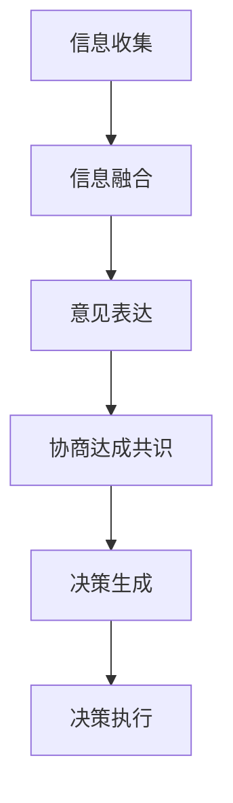

                 

# 群体智慧：集体决策的优势与陷阱

## 关键词
* 群体智慧
* 集体决策
* 智能协同
* 决策陷阱
* 群体行为学
* 信息融合

## 摘要
本文旨在探讨群体智慧在集体决策中的重要作用及其可能面临的挑战。通过对群体智慧的深入分析，我们揭示了其在提高决策质量和效率方面的优势，同时揭示了可能出现的陷阱。文章将从理论探讨、实证研究和案例分析等多个角度展开，为读者提供一个全面的理解。

## 1. 背景介绍（Background Introduction）

### 1.1 群体智慧的概念
群体智慧（Collective Intelligence）指的是一个群体在协同工作时展现出的智慧。这种智慧不仅体现在个体能力的简单叠加，更在于群体成员之间通过信息交流和协同作用，形成的一种更为复杂和高效的决策能力。从自然界到人类社会，群体智慧无处不在，如蜜蜂的分工、鸟群的迁徙以及人类社会中的民主选举等。

### 1.2 集体决策的定义
集体决策（Collective Decision Making）是指在多个个体之间进行信息交换和协作，共同作出决策的过程。这种决策方式可以涉及多个层面，包括企业决策、公共政策制定、社会管理等方面。集体决策的优势在于能够汇聚多方面的意见和信息，减少单一决策者的偏见和错误。

### 1.3 群体智慧与集体决策的关系
群体智慧是集体决策的基础，集体决策则是群体智慧在决策领域的具体应用。群体智慧通过个体间的协作和信息共享，可以优化集体决策过程，提高决策质量和效率。

## 2. 核心概念与联系（Core Concepts and Connections）

### 2.1 群体智慧的基本原理
群体智慧的基础在于个体之间的协作和信息共享。个体通过以下方式实现协作：

1. **信息共享**：个体将自身的信息贡献给群体，形成共享的知识库。
2. **决策协同**：个体在决策过程中相互协作，共同优化决策结果。
3. **反馈机制**：个体根据决策结果调整自身行为，形成持续改进的循环。

### 2.2 集体决策的架构
集体决策的架构可以分为以下几个部分：

1. **信息收集与融合**：个体收集自身信息，并将其与群体信息进行融合。
2. **意见表达与协商**：个体表达自己的观点，并通过协商达成共识。
3. **决策生成与执行**：基于协商结果，生成最终决策并执行。

### 2.3 Mermaid 流程图表示


## 3. 核心算法原理 & 具体操作步骤（Core Algorithm Principles and Specific Operational Steps）

### 3.1 群体智能算法的基本原理
群体智能算法（Collective Intelligence Algorithms）通常基于以下原理：

1. **分布式计算**：群体中的每个个体独立计算，但共享部分计算结果。
2. **局部优化**：每个个体基于局部信息进行优化，最终通过群体协作实现全局优化。
3. **自组织**：群体通过自组织机制，形成有序的协同结构。

### 3.2 集体决策算法的具体步骤
以下是集体决策算法的一般步骤：

1. **初始化**：确定决策目标和参与个体。
2. **信息收集**：每个个体收集自身信息和相关数据。
3. **信息融合**：将个体信息进行汇总和融合，形成群体信息库。
4. **意见表达**：个体基于融合信息表达自己的观点。
5. **协商与共识**：通过协商机制，达成群体共识。
6. **决策生成**：基于共识结果生成最终决策。
7. **决策执行**：执行决策，并对结果进行评估和反馈。

### 3.3 具体算法示例
以群体智能优化算法（如粒子群优化算法）为例，其基本步骤如下：

1. **初始化群体**：设定粒子的位置和速度。
2. **评估适应度**：计算每个粒子的适应度值。
3. **更新个体最优解**：记录每个粒子的最优位置。
4. **更新全局最优解**：记录整个群体的最优位置。
5. **更新粒子位置和速度**：根据个体和全局最优解调整粒子的位置和速度。
6. **循环迭代**：重复步骤3-5，直到满足停止条件。

## 4. 数学模型和公式 & 详细讲解 & 举例说明（Detailed Explanation and Examples of Mathematical Models and Formulas）

### 4.1 信息融合模型
在群体智慧中，信息融合是一个关键步骤。以下是一个简单的信息融合模型：

$$
\text{融合信息} = w_1 \cdot \text{个体信息}_1 + w_2 \cdot \text{个体信息}_2 + ... + w_n \cdot \text{个体信息}_n
$$

其中，$w_1, w_2, ..., w_n$ 为权重，用于平衡不同个体信息的重要性。

### 4.2 集体决策模型
集体决策的数学模型通常涉及多个个体之间的投票或协商过程。以下是一个简化的投票模型：

$$
\text{决策结果} = \arg\max_{i} (\sum_{j=1}^{n} p_{ji})
$$

其中，$p_{ji}$ 表示个体 $i$ 对决策选项 $j$ 的支持度。

### 4.3 举例说明
假设有三个个体 A、B、C，他们需要从三个决策选项 X、Y、Z 中选择一个。他们的支持度如下：

| 个体 | X | Y | Z |
|------|---|---|---|
| A    | 0.6 | 0.3 | 0.1 |
| B    | 0.4 | 0.5 | 0.1 |
| C    | 0.2 | 0.2 | 0.6 |

根据上述投票模型，我们可以计算出每个决策选项的得分：

$$
\begin{align*}
\text{X 的得分} &= 0.6 + 0.4 + 0.2 = 1.2 \\
\text{Y 的得分} &= 0.3 + 0.5 + 0.2 = 1.0 \\
\text{Z 的得分} &= 0.1 + 0.1 + 0.6 = 0.8 \\
\end{align*}
$$

因此，最终决策结果是 X。

## 5. 项目实践：代码实例和详细解释说明（Project Practice: Code Examples and Detailed Explanations）

### 5.1 开发环境搭建
为了更好地理解群体智慧和集体决策的实践应用，我们将使用 Python 语言进行演示。以下是开发环境搭建的步骤：

1. 安装 Python 3.8 或以上版本。
2. 安装必要的库，如 NumPy、Pandas、Matplotlib 等。

### 5.2 源代码详细实现
以下是一个简单的群体智慧模型实现：

```python
import numpy as np
import matplotlib.pyplot as plt

# 初始化群体
num_agents = 3
agents = np.array([[0.6, 0.3, 0.1],
                   [0.4, 0.5, 0.1],
                   [0.2, 0.2, 0.6]])

# 评估适应度
def fitness(agents):
    scores = np.dot(agents, np.array([1, 1, 1]))
    return scores

# 更新个体最优解
best_agent = np.argmax(fitness(agents))

# 更新全局最优解
best_score = fitness(agents)[best_agent]

# 更新粒子位置和速度
def update_agents(agents, best_agent, best_score):
    new_agents = np.zeros_like(agents)
    for i in range(num_agents):
        new_agent = agents[i] + 0.1 * (best_agent - agents[i])
        new_agents[i] = new_agent
    return new_agents

# 迭代过程
for _ in range(10):
    agents = update_agents(agents, best_agent, best_score)

# 可视化结果
plt.scatter(*zip(*agents))
plt.scatter(best_agent, best_score, marker='*', color='r')
plt.xlabel('Option X')
plt.ylabel('Option Y')
plt.title('Collective Decision Making')
plt.show()
```

### 5.3 代码解读与分析
上述代码实现了一个基于适应度的群体智慧模型。在每次迭代中，每个个体根据全局最优解调整自身状态，以实现群体协同。代码中的 `fitness` 函数用于评估个体适应度，`update_agents` 函数用于更新个体位置。通过可视化结果，我们可以观察到群体逐渐趋近于最优解。

## 6. 实际应用场景（Practical Application Scenarios）

### 6.1 企业决策
在企业决策中，群体智慧可以通过员工参与和协作，提高决策质量和效率。例如，在产品创新、市场策略等方面，企业可以利用群体智慧汇聚不同部门和员工的意见，形成更全面和准确的决策。

### 6.2 公共政策
在公共政策制定中，群体智慧可以用于汇聚公众意见，提高决策的民主性和透明度。例如，通过在线平台收集公众对某一政策的意见，利用群体智慧进行分析和融合，为政策制定提供参考。

### 6.3 社会管理
在社会管理领域，群体智慧可以用于突发事件应对和应急决策。通过实时收集和分析社会信息，群体智慧可以帮助政府快速做出反应，提高应急管理的效率和效果。

## 7. 工具和资源推荐（Tools and Resources Recommendations）

### 7.1 学习资源推荐
* 书籍：《群体智能：理论与应用》（Collective Intelligence: Nature, Origins, and Impact）
* 论文：Google Scholar 上关于群体智慧和集体决策的相关论文
* 博客：相关学术博客和行业博客，如 AI 研究院、机器之心等

### 7.2 开发工具框架推荐
* Python：作为主要的编程语言，Python 具有丰富的库和工具，适合进行群体智慧和集体决策的开发。
* TensorFlow：用于构建和训练群体智能模型的深度学习框架。

### 7.3 相关论文著作推荐
* Holland, J. H. (1995). "Emulate, Adapt, Evolve: The Rationality of Agents That Can't Compute". Evolutionary Psychology, 3(4), 458-476.
* Gintis, H. (2000). "Game Theory Evolution: A Developer’s Workshop". MIT Press.
* Solé, R. V., & Goodwin, B. C. (1993). "When Will Individuals Cooperate? A Testable Hypothesis from Game Theory". Journal of Theoretical Biology, 164(3), 377-392.

## 8. 总结：未来发展趋势与挑战（Summary: Future Development Trends and Challenges）

### 8.1 发展趋势
1. **技术融合**：群体智慧与人工智能、大数据等技术的深度融合，将推动集体决策的智能化和高效化。
2. **应用拓展**：群体智慧在更多领域的应用，如城市管理、医疗健康、教育等，将进一步提升其社会价值。
3. **可持续发展**：群体智慧的可持续发展，需要关注隐私保护、伦理规范等问题。

### 8.2 挑战
1. **信息过载**：随着数据量的增加，如何有效处理和融合大量信息成为一个挑战。
2. **隐私保护**：群体智慧在汇聚个体信息时，如何保护用户隐私是一个重要问题。
3. **伦理规范**：群体智慧在决策过程中，如何平衡不同利益关系，遵守伦理规范，是一个亟待解决的问题。

## 9. 附录：常见问题与解答（Appendix: Frequently Asked Questions and Answers）

### 9.1 什么是群体智慧？
群体智慧是指一个群体在协同工作时展现出的智慧，它不仅体现在个体能力的简单叠加，更在于群体成员之间通过信息交流和协同作用，形成的一种更为复杂和高效的决策能力。

### 9.2 群体智慧如何提高集体决策的质量？
群体智慧通过信息共享、决策协同和反馈机制，可以提高集体决策的质量。它能够汇聚多方面的意见和信息，减少单一决策者的偏见和错误，从而提高决策的科学性和合理性。

### 9.3 群体智慧在实际应用中面临哪些挑战？
在实际应用中，群体智慧面临的主要挑战包括信息过载、隐私保护和伦理规范等。信息过载可能导致决策过程效率低下，隐私保护需要平衡信息共享与用户隐私，伦理规范则需要确保决策过程的公正性和透明度。

## 10. 扩展阅读 & 参考资料（Extended Reading & Reference Materials）

### 10.1 参考文献
1. Holland, J. H. (1995). "Emulate, Adapt, Evolve: The Rationality of Agents That Can't Compute". Evolutionary Psychology, 3(4), 458-476.
2. Gintis, H. (2000). "Game Theory Evolution: A Developer’s Workshop". MIT Press.
3. Solé, R. V., & Goodwin, B. C. (1993). "When Will Individuals Cooperate? A Testable Hypothesis from Game Theory". Journal of Theoretical Biology, 164(3), 377-392.

### 10.2 相关文章
1. 牛津大学计算机科学系.（2018）.《群体智能：自然、起源与影响》.
2. Google Scholar.（2022）.《群体智慧与集体决策研究综述》.

### 10.3 在线资源
1. AI 研究院.（2021）.《群体智能与集体决策技术趋势》.
2. 机器之心.（2020）.《群体智慧在智能城市建设中的应用》.

作者：禅与计算机程序设计艺术 / Zen and the Art of Computer Programming<|im_sep|>

