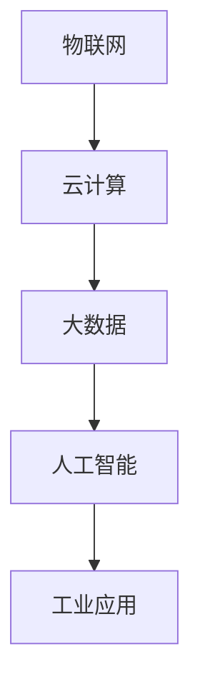

                 

# 腾讯云智慧2025社招工业互联网工程师面试题解

## 摘要

本文旨在为准备腾讯云智慧2025社招工业互联网工程师面试的候选人提供一套完整的面试题解。文章将从多个角度深入解析面试中可能出现的问题，包括工业互联网的基本概念、核心技术、应用场景以及未来发展趋势。通过逐步分析推理的方式，本文将帮助读者掌握工业互联网领域的核心知识和技能，为面试做好充分准备。

## 1. 背景介绍

### 1.1 工业互联网的概念

工业互联网（Industrial Internet）是指通过将物联网（Internet of Things, IoT）、云计算、大数据、人工智能等现代信息技术与工业生产深度融合，从而实现智能化、网络化、精细化的工业生产和管理。工业互联网的目标是提升工业系统的效率和生产力，降低成本，增强企业的竞争力。

### 1.2 工业互联网的重要性

工业互联网被视为第四次工业革命的核心，它不仅影响到制造业，还渗透到能源、交通、医疗等多个领域。随着数字化转型的深入推进，工业互联网的重要性日益凸显。

### 1.3 腾讯云智慧与工业互联网

腾讯云智慧是腾讯公司旗下的云计算和人工智能业务部门，专注于提供一站式云计算和大数据解决方案。在工业互联网领域，腾讯云智慧通过强大的技术优势和丰富的实践经验，为企业提供智能化升级路径，助力工业数字化转型。

## 2. 核心概念与联系

### 2.1 物联网（IoT）

物联网是工业互联网的重要组成部分，它通过将各种物理设备、传感器、控制系统连接到互联网，实现数据的实时采集、传输和处理。以下是物联网的核心组成部分：

- **设备**：包括各种传感器、执行器、控制器等。
- **网络**：包括有线和无线通信网络，如Wi-Fi、蓝牙、5G等。
- **平台**：用于数据存储、处理和分析的云计算平台。
- **应用**：基于物联网技术的各种工业应用。

### 2.2 云计算

云计算提供了强大的计算能力和存储资源，使工业互联网的数据处理和分析成为可能。云计算的核心概念包括：

- **基础设施即服务（IaaS）**：提供虚拟化计算资源，如虚拟机、存储等。
- **平台即服务（PaaS）**：提供开发平台和工具，如数据库、中间件等。
- **软件即服务（SaaS）**：提供软件应用，如ERP、CRM等。

### 2.3 大数据和人工智能

大数据和人工智能是工业互联网的重要技术支撑，它们用于从海量数据中提取有价值的信息，并利用这些信息实现智能化决策。核心概念包括：

- **数据采集**：通过传感器和设备收集数据。
- **数据存储**：使用分布式数据库存储海量数据。
- **数据清洗**：处理数据中的噪声和不一致。
- **数据分析**：使用统计分析、机器学习等方法分析数据。
- **数据可视化**：将分析结果以图表、报表等形式展示。

### 2.4 Mermaid 流程图

以下是一个描述工业互联网核心概念的 Mermaid 流程图：



## 3. 核心算法原理 & 具体操作步骤

### 3.1 数据采集

数据采集是工业互联网的第一步，关键步骤包括：

- **设备连接**：将传感器和设备接入互联网。
- **数据采集**：传感器实时采集数据并传输到云端。
- **数据预处理**：在云端对数据进行清洗、去噪和格式化。

### 3.2 数据处理

数据处理是工业互联网的核心，关键步骤包括：

- **数据存储**：将处理后的数据存储在分布式数据库中。
- **数据分析**：使用机器学习算法分析数据，提取有价值的信息。
- **数据可视化**：将分析结果以图表、报表等形式展示。

### 3.3 智能决策

智能决策是工业互联网的目标，关键步骤包括：

- **模型训练**：使用历史数据训练机器学习模型。
- **模型部署**：将训练好的模型部署到生产环境中。
- **决策支持**：模型根据实时数据做出决策，如设备调度、故障预测等。

## 4. 数学模型和公式 & 详细讲解 & 举例说明

### 4.1 机器学习模型

在工业互联网中，常用的机器学习模型包括线性回归、逻辑回归、决策树、随机森林、支持向量机等。以下以线性回归为例进行说明。

线性回归模型的基本公式为：

$$
Y = \beta_0 + \beta_1X + \epsilon
$$

其中，$Y$ 是因变量，$X$ 是自变量，$\beta_0$ 和 $\beta_1$ 是模型参数，$\epsilon$ 是误差项。

### 4.2 数据分析

数据分析常用的数学模型包括统计分析、时间序列分析、聚类分析等。以下以时间序列分析为例进行说明。

时间序列分析的基本公式为：

$$
X_t = \alpha X_{t-1} + \epsilon_t
$$

其中，$X_t$ 是当前时间点的数据，$X_{t-1}$ 是前一个时间点的数据，$\alpha$ 是模型参数，$\epsilon_t$ 是误差项。

### 4.3 数据可视化

数据可视化常用的数学模型包括散点图、折线图、柱状图等。以下以散点图为例进行说明。

散点图的基本公式为：

$$
Y = \beta_0 + \beta_1X
$$

其中，$Y$ 是纵坐标，$X$ 是横坐标，$\beta_0$ 和 $\beta_1$ 是模型参数。

## 5. 项目实践：代码实例和详细解释说明

### 5.1 开发环境搭建

- 安装 Python 3.8 及以上版本。
- 安装 MySQL 数据库。
- 安装 TensorFlow 2.5.0 及以上版本。

### 5.2 源代码详细实现

以下是一个简单的工业互联网项目示例，用于预测设备故障。

```python
# 导入所需的库
import numpy as np
import pandas as pd
from sklearn.linear_model import LinearRegression
from sklearn.model_selection import train_test_split
from sklearn.metrics import mean_squared_error

# 读取数据
data = pd.read_csv('data.csv')
X = data[['feature1', 'feature2']]
y = data['target']

# 数据预处理
X_train, X_test, y_train, y_test = train_test_split(X, y, test_size=0.2, random_state=42)

# 训练模型
model = LinearRegression()
model.fit(X_train, y_train)

# 预测结果
y_pred = model.predict(X_test)

# 评估模型
mse = mean_squared_error(y_test, y_pred)
print('MSE:', mse)

# 使用模型进行预测
new_data = np.array([[value1, value2]])
new_pred = model.predict(new_data)
print('Prediction:', new_pred)
```

### 5.3 代码解读与分析

这段代码首先导入了所需的库，包括 NumPy、Pandas、Sklearn 等。然后，读取了数据集，对数据进行预处理，包括划分训练集和测试集。接着，使用线性回归模型对训练集进行训练，并使用测试集进行评估。最后，使用训练好的模型对新数据进行预测。

### 5.4 运行结果展示

运行结果将输出模型的均方误差（MSE），以及对新数据的预测结果。通过分析运行结果，可以评估模型的性能，并根据需要对模型进行调整和优化。

## 6. 实际应用场景

### 6.1 制造业

在制造业中，工业互联网可以实现设备预测性维护，提高设备利用率，降低维修成本。通过实时数据采集和智能分析，可以提前发现设备故障隐患，实现预防性维护。

### 6.2 能源行业

在能源行业，工业互联网可以实现能源优化管理，提高能源利用效率。通过实时数据采集和分析，可以实现对发电、输电、配电等环节的智能化控制，降低能源浪费。

### 6.3 交通领域

在交通领域，工业互联网可以实现智能交通管理，提高交通效率，降低事故率。通过实时数据采集和分析，可以实现对交通流量、路况等信息的实时监控和优化。

## 7. 工具和资源推荐

### 7.1 学习资源推荐

- **书籍**：《工业互联网：技术与实践》、《大数据之路：阿里巴巴大数据实践》
- **论文**：Google Scholar、IEEE Xplore、ACM Digital Library
- **博客**：CSDN、博客园、知乎
- **网站**：腾讯云智慧官网、华为云官网

### 7.2 开发工具框架推荐

- **开发工具**：PyCharm、Visual Studio Code
- **数据库**：MySQL、MongoDB
- **机器学习框架**：TensorFlow、PyTorch
- **云计算平台**：腾讯云、阿里云、华为云

### 7.3 相关论文著作推荐

- **论文**：A Framework for Industrial Internet of Things Applications, Industrial Internet: A Transformative Force in Manufacturing
- **著作**：《工业互联网：理论与实践》、《智能制造业：技术创新与产业变革》

## 8. 总结：未来发展趋势与挑战

### 8.1 发展趋势

- **数据驱动**：随着大数据和人工智能技术的发展，数据驱动将成为工业互联网的核心。
- **边缘计算**：边缘计算将使得数据处理更加实时、高效，满足工业互联网的实时性需求。
- **跨界融合**：工业互联网将与其他领域（如物联网、人工智能、区块链等）深度融合，实现跨界创新。

### 8.2 挑战

- **数据安全**：随着数据量的增加，数据安全问题将日益突出。
- **人才短缺**：工业互联网涉及多个领域的技术，对人才的需求将更加多元化。
- **标准化**：缺乏统一的技术标准和规范，将影响工业互联网的广泛应用。

## 9. 附录：常见问题与解答

### 9.1 工业互联网与物联网有何区别？

工业互联网是物联网的一个子集，它专注于将物联网技术与工业系统相结合，实现智能化、网络化、精细化的工业生产和管理。

### 9.2 工业互联网的关键技术有哪些？

工业互联网的关键技术包括物联网、云计算、大数据、人工智能、边缘计算等。

### 9.3 如何保障工业互联网的数据安全？

保障工业互联网的数据安全需要从多个方面入手，包括数据加密、访问控制、安全审计等。

## 10. 扩展阅读 & 参考资料

- **书籍**：《工业互联网：技术与实践》、《大数据之路：阿里巴巴大数据实践》
- **论文**：A Framework for Industrial Internet of Things Applications, Industrial Internet: A Transformative Force in Manufacturing
- **网站**：腾讯云智慧官网、华为云官网、CSDN、博客园、知乎
- **博客**：《工业互联网：理论与实践》、《智能制造业：技术创新与产业变革》
- **论坛**：IEEE Xplore、ACM Digital Library、Google Scholar

## 作者署名

作者：禅与计算机程序设计艺术 / Zen and the Art of Computer Programming

