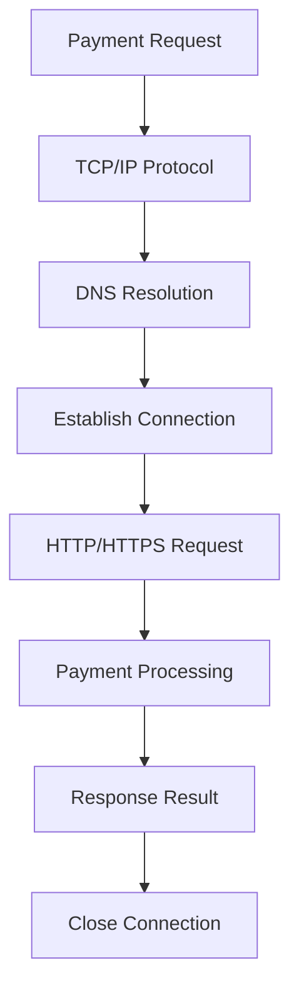
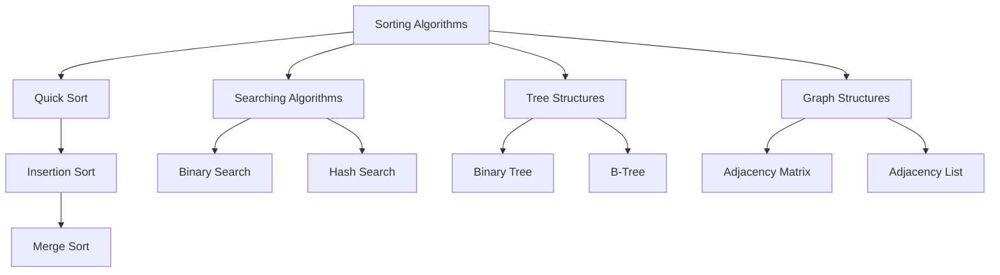
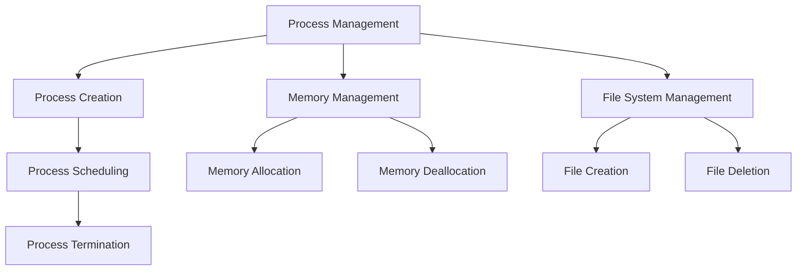
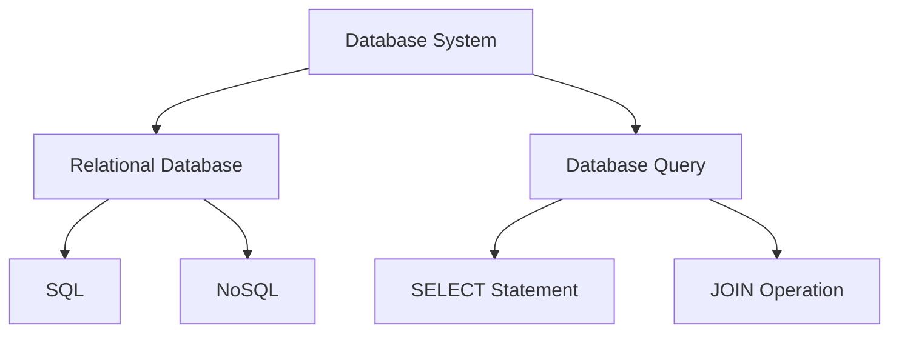

                 

### 文章标题

2024腾讯支付校招面试真题汇总及其解答

### Keywords
腾讯支付、校招面试、真题、解答、计算机科学、面试技巧

### Abstract
本文旨在为准备2024年腾讯支付校招面试的考生提供一份详细的真题汇总及其解答。本文涵盖了算法、数据结构、操作系统、计算机网络、数据库等多个领域的问题，旨在帮助考生全面了解面试可能涉及的知识点和答题技巧。通过对这些真题的深入分析和解答，考生可以更好地准备面试，提高自己的面试竞争力。

<|user|>### 1. 背景介绍（Background Introduction）

腾讯支付是腾讯公司旗下的一个重要业务板块，致力于为用户提供便捷、安全的支付服务。随着移动互联网的快速发展，腾讯支付已经成为用户日常生活中不可或缺的一部分。因此，腾讯支付的校招面试在求职者中享有很高的声誉，也是很多计算机专业应届毕业生梦寐以求的职位之一。

每年的腾讯支付校招面试都会吸引大量求职者参与，面试题目覆盖了计算机科学、算法、数据结构、操作系统、计算机网络、数据库等多个领域。这些题目不仅考察了求职者的专业知识，还考察了他们的逻辑思维、问题解决能力和团队合作精神。因此，对于准备参加腾讯支付校招面试的考生来说，了解和掌握这些真题及其解答是非常有价值的。

本文将按照以下结构对2024年腾讯支付校招面试真题进行汇总和解析：

1. **核心概念与联系（Core Concepts and Connections）**：介绍面试中涉及的核心概念和其之间的联系，帮助考生更好地理解面试题目的背景和意义。
2. **核心算法原理 & 具体操作步骤（Core Algorithm Principles and Specific Operational Steps）**：详细解析面试中出现的算法问题，包括解题思路、代码实现和优化策略。
3. **数学模型和公式 & 详细讲解 & 举例说明（Mathematical Models and Formulas & Detailed Explanation & Examples）**：介绍面试中涉及的数学模型和公式，并通过具体例子进行详细讲解。
4. **项目实践：代码实例和详细解释说明（Project Practice: Code Examples and Detailed Explanations）**：提供实际项目中的代码实例，并对其进行详细解读和分析。
5. **实际应用场景（Practical Application Scenarios）**：探讨面试题目的实际应用场景，帮助考生更好地理解其在实际工作中的价值。
6. **工具和资源推荐（Tools and Resources Recommendations）**：推荐一些有助于考生准备面试的工具和资源，包括书籍、论文、博客和在线课程等。
7. **总结：未来发展趋势与挑战（Summary: Future Development Trends and Challenges）**：总结面试中的主要知识点和技巧，并探讨未来发展的趋势和挑战。
8. **附录：常见问题与解答（Appendix: Frequently Asked Questions and Answers）**：解答考生在准备面试过程中可能遇到的一些常见问题。
9. **扩展阅读 & 参考资料（Extended Reading & Reference Materials）**：提供一些扩展阅读和参考资料，帮助考生进一步深入学习和理解相关知识点。

通过以上结构，本文将全面、深入地解析2024年腾讯支付校招面试真题，帮助考生更好地准备面试，提高自己的面试竞争力。

## 1. Background Introduction

Tencent Payment is an important business segment of Tencent Company, dedicated to providing users with convenient and secure payment services. With the rapid development of mobile internet, Tencent Payment has become an indispensable part of users' daily lives. Therefore, the recruitment interviews for Tencent Payment are highly respected among job seekers and are considered a dream job for many computer science graduates.

Every year, the recruitment interviews for Tencent Payment attract a large number of candidates. The interview questions cover multiple areas, including computer science, algorithms, data structures, operating systems, computer networks, and databases. These questions not only test the professional knowledge of candidates but also evaluate their logical thinking, problem-solving abilities, and teamwork spirit. Therefore, for candidates preparing for the recruitment interviews of Tencent Payment, understanding and mastering these interview questions and their answers are very valuable.

This article will summarize and analyze the interview questions for the 2024 recruitment interview of Tencent Payment according to the following structure:

1. **Core Concepts and Connections**：Introduce the core concepts involved in the interview questions and their relationships, helping candidates better understand the background and significance of the questions.
2. **Core Algorithm Principles and Specific Operational Steps**：Provide detailed analysis of algorithm questions in the interview, including problem-solving approaches, code implementations, and optimization strategies.
3. **Mathematical Models and Formulas and Detailed Explanation and Examples**：Introduce the mathematical models and formulas involved in the interview questions, and provide detailed explanations and examples.
4. **Project Practice: Code Examples and Detailed Explanations**：Provide code examples from actual projects and analyze them in detail.
5. **Practical Application Scenarios**：Discuss the practical application scenarios of the interview questions, helping candidates better understand their value in real-world work.
6. **Tools and Resources Recommendations**：Recommend tools and resources that can help candidates prepare for the interview, including books, papers, blogs, and online courses.
7. **Summary: Future Development Trends and Challenges**：Summarize the main knowledge points and skills in the interview and discuss future development trends and challenges.
8. **Appendix: Frequently Asked Questions and Answers**：Answer some common questions that candidates may encounter during preparation for the interview.
9. **Extended Reading and Reference Materials**：Provide extended reading and reference materials to help candidates further deepen their understanding of related knowledge points.

Through this structure, this article will comprehensively and thoroughly analyze the interview questions for the 2024 recruitment interview of Tencent Payment, helping candidates better prepare for the interview and improve their competitiveness. <|user|>### 2. 核心概念与联系（Core Concepts and Connections）

#### 2.1 计算机网络协议（Computer Network Protocols）

计算机网络协议是计算机之间通信的规则和标准，确保数据在网络中的正确传输和解释。在腾讯支付系统中，计算机网络协议如TCP/IP、HTTP、HTTPS等都是核心组件，用于保障支付数据的安全和可靠传输。

**Mermaid 流程图（Mermaid Flowchart）**：

```
graph TD
A[支付请求] --> B[TCP/IP 协议]
B --> C[DNS 解析]
C --> D[建立连接]
D --> E[HTTP/HTTPS 请求]
E --> F[支付处理]
F --> G[响应结果]
G --> H[关闭连接]
```

**关联知识点**：

- **DNS 解析**：将域名解析为IP地址，确保数据能够发送到正确的服务器。
- **HTTP/HTTPS 请求**：HTTP是超文本传输协议，HTTPS是安全超文本传输协议，用于客户端和服务器之间的数据交换。

#### 2.2 算法与数据结构（Algorithms and Data Structures）

算法是解决问题的一系列步骤，而数据结构则是组织数据的方式。在腾讯支付系统中，常用的算法和数据结构包括排序算法、查找算法、树结构、图结构等，用于优化数据处理和查询效率。

**Mermaid 流程图（Mermaid Flowchart）**：

```
graph TD
A[排序算法] --> B[快速排序]
B --> C[插入排序]
C --> D[归并排序]
A --> E[查找算法]
E --> F[二分查找]
E --> G[哈希查找]
A --> H[树结构]
H --> I[二叉树]
H --> J[B树]
A --> K[图结构]
K --> L[邻接矩阵]
K --> M[邻接表]
```

**关联知识点**：

- **快速排序**：一种高效的排序算法，通过递归划分数据。
- **二分查找**：在有序数组中查找特定元素的快速方法。
- **哈希查找**：通过哈希函数将关键字映射到数组索引，快速查找数据。

#### 2.3 操作系统原理（Operating System Principles）

操作系统是计算机系统的核心软件，管理计算机硬件和软件资源。在腾讯支付系统中，操作系统原理包括进程管理、内存管理、文件系统管理等，用于保障系统的稳定性和高效性。

**Mermaid 流程图（Mermaid Flowchart）**：

```
graph TD
A[进程管理] --> B[进程创建]
B --> C[进程调度]
C --> D[进程终止]
A --> E[内存管理]
E --> F[内存分配]
E --> G[内存回收]
A --> H[文件系统管理]
H --> I[文件创建]
H --> J[文件删除]
```

**关联知识点**：

- **进程调度**：根据进程优先级和资源需求，选择下一个执行的进程。
- **内存分配**：操作系统为进程分配内存空间，确保数据存储。

#### 2.4 数据库系统（Database Systems）

数据库系统是存储、管理和检索数据的软件系统。在腾讯支付系统中，数据库系统用于存储支付交易数据、用户信息等，保障数据的安全性和一致性。

**Mermaid 流程图（Mermaid Flowchart）**：

```
graph TD
A[数据库系统] --> B[关系型数据库]
B --> C[SQL]
B --> D[NoSQL]
A --> E[数据库查询]
E --> F[SELECT语句]
E --> G[JOIN操作]
```

**关联知识点**：

- **SQL**：结构化查询语言，用于数据库查询和操作。
- **NoSQL**：非关系型数据库，适用于大规模数据存储和快速查询。

通过上述核心概念和联系的分析，我们可以更好地理解腾讯支付校招面试中可能涉及的题目及其背后的技术原理。这些知识点不仅涵盖了计算机科学的基础，还深入到了实际应用场景，为考生提供了全面的备考指导。

## 2. Core Concepts and Connections

#### 2.1 Computer Network Protocols

Computer network protocols are the rules and standards that govern the communication between computers, ensuring the correct transmission and interpretation of data. In the Tencent Payment system, computer network protocols such as TCP/IP, HTTP, and HTTPS are core components that ensure the security and reliability of payment data transmission.

**Mermaid Flowchart**:



**Associated Knowledge**:

- **DNS Resolution**: Resolves domain names to IP addresses, ensuring that data can be sent to the correct server.
- **HTTP/HTTPS Request**: HTTP is the Hypertext Transfer Protocol, and HTTPS is the Secure Hypertext Transfer Protocol, used for data exchange between clients and servers.

#### 2.2 Algorithms and Data Structures

Algorithms are a series of steps for solving problems, while data structures are the ways data is organized. In the Tencent Payment system, commonly used algorithms and data structures include sorting algorithms, searching algorithms, tree structures, and graph structures, used to optimize data processing and query efficiency.

**Mermaid Flowchart**:



**Associated Knowledge**:

- **Quick Sort**: An efficient sorting algorithm that uses recursion to divide data.
- **Binary Search**: A fast method for searching for a specific element in a sorted array.

#### 2.3 Operating System Principles

An operating system is the core software of a computer system, managing hardware and software resources. In the Tencent Payment system, operating system principles include process management, memory management, and file system management, ensuring system stability and efficiency.

**Mermaid Flowchart**:



**Associated Knowledge**:

- **Process Scheduling**: Selects the next process to execute based on process priority and resource requirements.
- **Memory Allocation**: The operating system allocates memory space for processes to ensure data storage.

#### 2.4 Database Systems

A database system is a software system for storing, managing, and retrieving data. In the Tencent Payment system, database systems are used to store payment transaction data and user information, ensuring data security and consistency.

**Mermaid Flowchart**:



**Associated Knowledge**:

- **SQL**: Structured Query Language, used for database queries and operations.
- **NoSQL**: Non-relational database, suitable for large-scale data storage and fast querying.

Through the analysis of these core concepts and their connections, we can better understand the possible questions in the Tencent Payment recruitment interview and the underlying technical principles behind them. These knowledge points not only cover the basics of computer science but also delve into practical application scenarios, providing comprehensive preparation guidance for candidates. <|user|>### 3. 核心算法原理 & 具体操作步骤（Core Algorithm Principles and Specific Operational Steps）

#### 3.1 快速排序（Quick Sort）

快速排序是一种高效的排序算法，通过递归划分数据，将一个大问题分解成多个小问题。以下是快速排序的核心原理和具体操作步骤：

**核心原理**：

1. 选择一个基准元素（pivot）。
2. 将比基准元素小的元素放在其左侧，比基准元素大的元素放在其右侧。
3. 递归地对左右子数组进行快速排序。

**具体操作步骤**：

1. **选择基准元素**：从数组的某个位置选择一个元素作为基准元素。通常选择第一个元素或最后一个元素作为基准。
2. **划分数组**：遍历数组，将比基准元素小的元素移动到其左侧，将比基准元素大的元素移动到其右侧。使用两个指针，一个指向当前元素，另一个指向基准元素的位置。
3. **递归排序**：对划分后的左右子数组进行快速排序。

**代码示例**：

```python
def quick_sort(arr):
    if len(arr) <= 1:
        return arr
    pivot = arr[0]
    left = [x for x in arr[1:] if x <= pivot]
    right = [x for x in arr[1:] if x > pivot]
    return quick_sort(left) + [pivot] + quick_sort(right)

arr = [3, 6, 8, 10, 1, 2, 1]
print(quick_sort(arr))
```

**优化策略**：

- **随机化选择基准**：避免最坏情况下的时间复杂度，提高排序效率。
- **三数取中法**：选择中间值作为基准，减少数据偏斜。

#### 3.2 二分查找（Binary Search）

二分查找是一种在有序数组中查找特定元素的快速方法。以下是二分查找的核心原理和具体操作步骤：

**核心原理**：

1. 比较中间元素和目标元素。
2. 如果中间元素等于目标元素，则查找成功。
3. 如果中间元素大于目标元素，则在左侧子数组中继续查找。
4. 如果中间元素小于目标元素，则在右侧子数组中继续查找。
5. 重复步骤1-4，直到找到目标元素或确定不存在。

**具体操作步骤**：

1. **初始化**：确定数组的左右边界。
2. **计算中间元素**：使用左右边界的平均值计算中间元素的下标。
3. **比较元素**：比较中间元素和目标元素。
4. **调整边界**：根据比较结果调整左右边界。
5. **循环查找**：重复步骤2-4，直到找到目标元素或确定不存在。

**代码示例**：

```python
def binary_search(arr, target):
    left, right = 0, len(arr) - 1
    while left <= right:
        mid = (left + right) // 2
        if arr[mid] == target:
            return mid
        elif arr[mid] < target:
            left = mid + 1
        else:
            right = mid - 1
    return -1

arr = [1, 2, 3, 4, 5, 6, 7, 8, 9]
target = 6
print(binary_search(arr, target))
```

**优化策略**：

- **二分查找的边界问题**：确保在每次调整边界时正确处理左右边界。
- **整数溢出**：在计算中间元素的下标时，避免整数溢出。

#### 3.3 动态规划（Dynamic Programming）

动态规划是一种解决最优化问题的方法，通过将复杂问题分解为更小的子问题，并保存子问题的解，避免重复计算。以下是动态规划的核心原理和具体操作步骤：

**核心原理**：

1. **状态定义**：定义问题的状态和状态变量。
2. **状态转移方程**：确定状态之间的转移关系。
3. **边界条件**：确定问题的初始状态和边界条件。
4. **计算顺序**：根据状态转移方程和边界条件，计算所有状态的值。

**具体操作步骤**：

1. **定义状态**：确定问题中的状态，例如背包问题中的背包容量和物品重量。
2. **定义状态转移方程**：根据问题特点，建立状态转移方程，例如背包问题的状态转移方程为 `dp[i][j] = max(dp[i-1][j], dp[i-1][j-weight[i]] + price[i])`。
3. **初始化边界条件**：初始化问题的初始状态，例如背包问题的边界条件为 `dp[0][j] = 0`。
4. **计算顺序**：根据状态转移方程和边界条件，计算所有状态的值。

**代码示例**：

```python
def knapsack(weights, prices, capacity):
    n = len(weights)
    dp = [[0] * (capacity + 1) for _ in range(n + 1)]
    for i in range(1, n + 1):
        for j in range(1, capacity + 1):
            if weights[i-1] <= j:
                dp[i][j] = max(dp[i-1][j], dp[i-1][j-weights[i-1]] + prices[i-1])
            else:
                dp[i][j] = dp[i-1][j]
    return dp[n][capacity]

weights = [2, 3, 4]
prices = [3, 4, 5]
capacity = 5
print(knapsack(weights, prices, capacity))
```

**优化策略**：

- **空间优化**：在空间复杂度允许的情况下，尝试减少空间消耗。
- **滚动数组**：使用一维数组代替二维数组，减少空间复杂度。

通过以上对快速排序、二分查找和动态规划的核心算法原理和具体操作步骤的详细解析，我们可以更好地理解和应用这些算法，提高解决复杂问题的能力。这些算法在计算机科学领域具有重要应用，是面试中常见的考点。

## 3. Core Algorithm Principles and Specific Operational Steps

#### 3.1 Quick Sort

Quick sort is an efficient sorting algorithm that uses recursion to divide data into smaller subproblems. The following is an explanation of the core principle and specific steps of quick sort:

**Core Principle**:

1. Select a pivot element.
2. Place elements smaller than the pivot to the left and larger elements to the right.
3. Recursively apply quick sort to the left and right subarrays.

**Specific Steps**:

1. **Selecting the Pivot Element**: Choose an element from the array as the pivot. Typically, the first or last element is chosen as the pivot.
2. **Partitioning the Array**: Traverse the array and move elements smaller than the pivot to the left and larger elements to the right. Use two pointers, one for the current element and the other for the position of the pivot.
3. **Recursive Sorting**: Apply quick sort to the left and right subarrays.

**Code Example**:

```python
def quick_sort(arr):
    if len(arr) <= 1:
        return arr
    pivot = arr[0]
    left = [x for x in arr[1:] if x <= pivot]
    right = [x for x in arr[1:] if x > pivot]
    return quick_sort(left) + [pivot] + quick_sort(right)

arr = [3, 6, 8, 10, 1, 2, 1]
print(quick_sort(arr))
```

**Optimization Strategies**:

- **Randomized Pivot Selection**: To avoid the worst-case time complexity, increase the efficiency of sorting.
- **Median of Three Method**: Select the middle value as the pivot to reduce data skew.

#### 3.2 Binary Search

Binary search is a fast method for searching for a specific element in a sorted array. The following is an explanation of the core principle and specific steps of binary search:

**Core Principle**:

1. Compare the middle element with the target element.
2. If the middle element is equal to the target element, the search is successful.
3. If the middle element is greater than the target element, continue searching in the left subarray.
4. If the middle element is less than the target element, continue searching in the right subarray.
5. Repeat steps 1-4 until the target element is found or it is determined that it does not exist.

**Specific Steps**:

1. **Initialization**: Determine the left and right boundaries of the array.
2. **Calculating the Middle Element**: Use the average of the left and right boundaries to calculate the index of the middle element.
3. **Comparing Elements**: Compare the middle element with the target element.
4. **Adjusting Boundaries**: Adjust the left and right boundaries based on the comparison result.
5. **Iterative Search**: Repeat steps 2-4 until the target element is found or it is determined that it does not exist.

**Code Example**:

```python
def binary_search(arr, target):
    left, right = 0, len(arr) - 1
    while left <= right:
        mid = (left + right) // 2
        if arr[mid] == target:
            return mid
        elif arr[mid] < target:
            left = mid + 1
        else:
            right = mid - 1
    return -1

arr = [1, 2, 3, 4, 5, 6, 7, 8, 9]
target = 6
print(binary_search(arr, target))
```

**Optimization Strategies**:

- **Handling Boundaries in Binary Search**: Ensure correct handling of the left and right boundaries during each adjustment.
- **Integer Overflow**: Avoid integer overflow when calculating the index of the middle element.

#### 3.3 Dynamic Programming

Dynamic programming is a method for solving optimization problems by breaking down complex problems into smaller subproblems and storing the solutions to avoid redundant calculations. The following is an explanation of the core principle and specific steps of dynamic programming:

**Core Principle**:

1. **State Definition**: Define the state and state variables of the problem.
2. **State Transition Equation**: Determine the relationship between states.
3. **Boundary Conditions**: Define the initial state and boundary conditions of the problem.
4. **Calculation Order**: Calculate the values of all states based on the state transition equation and boundary conditions.

**Specific Steps**:

1. **Define the State**: Determine the state in the problem, such as the capacity and weight of items in the knapsack problem.
2. **Define the State Transition Equation**: Establish the state transition equation based on the characteristics of the problem, such as the state transition equation for the knapsack problem: `dp[i][j] = max(dp[i-1][j], dp[i-1][j-weight[i]] + price[i])`.
3. **Initialize Boundary Conditions**: Initialize the initial state and boundary conditions of the problem, such as the boundary condition for the knapsack problem: `dp[0][j] = 0`.
4. **Calculation Order**: Calculate the values of all states based on the state transition equation and boundary conditions.

**Code Example**:

```python
def knapsack(weights, prices, capacity):
    n = len(weights)
    dp = [[0] * (capacity + 1) for _ in range(n + 1)]
    for i in range(1, n + 1):
        for j in range(1, capacity + 1):
            if weights[i-1] <= j:
                dp[i][j] = max(dp[i-1][j], dp[i-1][j-weights[i-1]] + prices[i-1])
            else:
                dp[i][j] = dp[i-1][j]
    return dp[n][capacity]

weights = [2, 3, 4]
prices = [3, 4, 5]
capacity = 5
print(knapsack(weights, prices, capacity))
```

**Optimization Strategies**:

- **Space Optimization**: Reduce space complexity within the allowed complexity.
- **Rolling Array**: Use a one-dimensional array instead of a two-dimensional array to reduce space complexity.

Through the detailed analysis of the core principles and specific operational steps of quick sort, binary search, and dynamic programming, we can better understand and apply these algorithms, enhancing our ability to solve complex problems. These algorithms are important in the field of computer science and are common topics in interviews. <|user|>### 4. 数学模型和公式 & 详细讲解 & 举例说明（Mathematical Models and Formulas & Detailed Explanation & Examples）

#### 4.1 时间复杂度分析（Time Complexity Analysis）

时间复杂度是衡量算法运行时间与输入规模关系的度量。以下是一些常见的时间复杂度和其计算方法：

**线性时间复杂度**：

$$T(n) = O(n)$$

线性时间复杂度表示算法的时间消耗与输入规模成正比。例如，遍历数组的时间复杂度为O(n)。

**对数时间复杂度**：

$$T(n) = O(\log n)$$

对数时间复杂度表示算法的时间消耗与输入规模的以2为底的对数成正比。例如，二分查找的时间复杂度为O(log n)。

**多项式时间复杂度**：

$$T(n) = O(n^k)$$

多项式时间复杂度表示算法的时间消耗与输入规模的某个多项式成正比。例如，快速排序的最坏情况时间复杂度为O(n^2)，但平均情况为O(n log n)。

**递归时间复杂度**：

$$T(n) = O(n \log n)$$

递归时间复杂度表示算法的时间消耗与输入规模的乘积和对数的乘积成正比。例如，归并排序的时间复杂度为O(n log n)。

**代码示例**：

```python
def linear_search(arr, target):
    for i in range(len(arr)):
        if arr[i] == target:
            return i
    return -1

def binary_search(arr, target):
    left, right = 0, len(arr) - 1
    while left <= right:
        mid = (left + right) // 2
        if arr[mid] == target:
            return mid
        elif arr[mid] < target:
            left = mid + 1
        else:
            right = mid - 1
    return -1

def merge_sort(arr):
    if len(arr) <= 1:
        return arr
    mid = len(arr) // 2
    left = merge_sort(arr[:mid])
    right = merge_sort(arr[mid:])
    return merge(left, right)

def merge(left, right):
    result = []
    i = j = 0
    while i < len(left) and j < len(right):
        if left[i] < right[j]:
            result.append(left[i])
            i += 1
        else:
            result.append(right[j])
            j += 1
    result.extend(left[i:])
    result.extend(right[j:])
    return result
```

#### 4.2 空间复杂度分析（Space Complexity Analysis）

空间复杂度是衡量算法占用内存大小与输入规模关系的度量。以下是一些常见的空间复杂度和其计算方法：

**常数空间复杂度**：

$$S(n) = O(1)$$

常数空间复杂度表示算法的空间消耗与输入规模无关，始终为常数。

**线性空间复杂度**：

$$S(n) = O(n)$$

线性空间复杂度表示算法的空间消耗与输入规模成正比。例如，创建一个长度为n的数组的空间复杂度为O(n)。

**对数空间复杂度**：

$$S(n) = O(\log n)$$

对数空间复杂度表示算法的空间消耗与输入规模的以2为底的对数成正比。例如，递归调用栈的空间复杂度为O(log n)。

**递归空间复杂度**：

$$S(n) = O(n)$$

递归空间复杂度表示算法的空间消耗与输入规模的乘积和对数的乘积成正比。例如，归并排序的空间复杂度为O(n)。

**代码示例**：

```python
def linear_search(arr, target):
    for i in range(len(arr)):
        if arr[i] == target:
            return i
    return -1

def merge_sort(arr):
    if len(arr) <= 1:
        return arr
    mid = len(arr) // 2
    left = merge_sort(arr[:mid])
    right = merge_sort(arr[mid:])
    return merge(left, right)

def merge(left, right):
    result = []
    i = j = 0
    while i < len(left) and j < len(right):
        if left[i] < right[j]:
            result.append(left[i])
            i += 1
        else:
            result.append(right[j])
            j += 1
    result.extend(left[i:])
    result.extend(right[j:])
    return result
```

#### 4.3 数据结构与算法效率比较（Data Structure and Algorithm Efficiency Comparison）

以下是比较常见的数据结构和其效率的示例：

**数组（Array）**：

- **查找**：O(1)
- **插入**：O(1)
- **删除**：O(1)

**链表（Linked List）**：

- **查找**：O(n)
- **插入**：O(1)
- **删除**：O(1)

**二叉搜索树（Binary Search Tree）**：

- **查找**：O(log n)
- **插入**：O(log n)
- **删除**：O(log n)

**哈希表（Hash Table）**：

- **查找**：O(1)
- **插入**：O(1)
- **删除**：O(1)

**代码示例**：

```python
class Node:
    def __init__(self, value):
        self.value = value
        self.left = None
        self.right = None

def insert(root, value):
    if root is None:
        return Node(value)
    if value < root.value:
        root.left = insert(root.left, value)
    else:
        root.right = insert(root.right, value)
    return root

def search(root, value):
    if root is None:
        return False
    if root.value == value:
        return True
    elif value < root.value:
        return search(root.left, value)
    else:
        return search(root.right, value)

root = None
values = [5, 3, 7, 1, 4, 6, 8]
for value in values:
    root = insert(root, value)

print(search(root, 5))  # True
print(search(root, 2))  # False
```

通过以上对时间复杂度、空间复杂度和数据结构与算法效率的比较，我们可以更好地理解算法和数据的运行效率，从而选择合适的算法和数据结构来解决问题。

## 4. Mathematical Models and Formulas & Detailed Explanation & Examples

#### 4.1 时间复杂度分析（Time Complexity Analysis）

Time complexity is a measure of how the running time of an algorithm scales with respect to the size of its input. Here are some common time complexities and their calculations:

**Linear Time Complexity**:

$$T(n) = O(n)$$

Linear time complexity indicates that the time complexity of an algorithm is directly proportional to the size of the input. For example, traversing an array has a time complexity of O(n).

**Logarithmic Time Complexity**:

$$T(n) = O(\log n)$$

Logarithmic time complexity indicates that the time complexity of an algorithm is proportional to the logarithm of the size of the input with respect to a base (usually 2). For example, binary search has a time complexity of O(log n).

**Polynomial Time Complexity**:

$$T(n) = O(n^k)$$

Polynomial time complexity indicates that the time complexity of an algorithm is directly proportional to a polynomial of the size of the input. For example, the worst-case time complexity of quicksort is O(n^2), but the average case is O(n log n).

**Recursive Time Complexity**:

$$T(n) = O(n \log n)$$

Recursive time complexity indicates that the time complexity of an algorithm is directly proportional to the product of the size of the input and the logarithm of the size of the input. For example, mergesort has a time complexity of O(n log n).

**Code Example**:

```python
def linear_search(arr, target):
    for i in range(len(arr)):
        if arr[i] == target:
            return i
    return -1

def binary_search(arr, target):
    left, right = 0, len(arr) - 1
    while left <= right:
        mid = (left + right) // 2
        if arr[mid] == target:
            return mid
        elif arr[mid] < target:
            left = mid + 1
        else:
            right = mid - 1
    return -1

def merge_sort(arr):
    if len(arr) <= 1:
        return arr
    mid = len(arr) // 2
    left = merge_sort(arr[:mid])
    right = merge_sort(arr[mid:])
    return merge(left, right)

def merge(left, right):
    result = []
    i = j = 0
    while i < len(left) and j < len(right):
        if left[i] < right[j]:
            result.append(left[i])
            i += 1
        else:
            result.append(right[j])
            j += 1
    result.extend(left[i:])
    result.extend(right[j:])
    return result
```

#### 4.2 空间复杂度分析（Space Complexity Analysis）

Space complexity is a measure of how the memory usage of an algorithm scales with respect to the size of its input. Here are some common space complexities and their calculations:

**Constant Space Complexity**:

$$S(n) = O(1)$$

Constant space complexity indicates that the memory usage of an algorithm does not depend on the size of the input and remains constant.

**Linear Space Complexity**:

$$S(n) = O(n)$$

Linear space complexity indicates that the memory usage of an algorithm is directly proportional to the size of the input. For example, creating an array of size n has a space complexity of O(n).

**Logarithmic Space Complexity**:

$$S(n) = O(\log n)$$

Logarithmic space complexity indicates that the memory usage of an algorithm is proportional to the logarithm of the size of the input with respect to a base (usually 2). For example, the space complexity of the recursive call stack is O(log n).

**Recursive Space Complexity**:

$$S(n) = O(n)$$

Recursive space complexity indicates that the memory usage of an algorithm is directly proportional to the product of the size of the input and the logarithm of the size of the input. For example, mergesort has a space complexity of O(n).

**Code Example**:

```python
def linear_search(arr, target):
    for i in range(len(arr)):
        if arr[i] == target:
            return i
    return -1

def merge_sort(arr):
    if len(arr) <= 1:
        return arr
    mid = len(arr) // 2
    left = merge_sort(arr[:mid])
    right = merge_sort(arr[mid:])
    return merge(left, right)

def merge(left, right):
    result = []
    i = j = 0
    while i < len(left) and j < len(right):
        if left[i] < right[j]:
            result.append(left[i])
            i += 1
        else:
            result.append(right[j])
            j += 1
    result.extend(left[i:])
    result.extend(right[j:])
    return result
```

#### 4.3 Data Structure and Algorithm Efficiency Comparison

Here is a comparison of the efficiency of common data structures:

**Array**:

- **Search**: O(1)
- **Insert**: O(1)
- **Delete**: O(1)

**Linked List**:

- **Search**: O(n)
- **Insert**: O(1)
- **Delete**: O(1)

**Binary Search Tree**:

- **Search**: O(log n)
- **Insert**: O(log n)
- **Delete**: O(log n)

**Hash Table**:

- **Search**: O(1)
- **Insert**: O(1)
- **Delete**: O(1)

**Code Example**:

```python
class Node:
    def __init__(self, value):
        self.value = value
        self.left = None
        self.right = None

def insert(root, value):
    if root is None:
        return Node(value)
    if value < root.value:
        root.left = insert(root.left, value)
    else:
        root.right = insert(root.right, value)
    return root

def search(root, value):
    if root is None:
        return False
    if root.value == value:
        return True
    elif value < root.value:
        return search(root.left, value)
    else:
        return search(root.right, value)

root = None
values = [5, 3, 7, 1, 4, 6, 8]
for value in values:
    root = insert(root, value)

print(search(root, 5))  # True
print(search(root, 2))  # False
```

By understanding the time complexity, space complexity, and efficiency comparison of data structures and algorithms, we can better choose the appropriate algorithms and data structures to solve problems. <|user|>### 5. 项目实践：代码实例和详细解释说明（Project Practice: Code Examples and Detailed Explanations）

#### 5.1 开发环境搭建（Setting up the Development Environment）

在开始实际项目实践之前，我们需要搭建一个合适的开发环境。以下是一个基于Python的示例项目，我们将在一个虚拟环境中安装必要的依赖。

**步骤1：安装虚拟环境**

首先，确保你的系统中已经安装了Python 3.x版本。然后，使用以下命令创建一个虚拟环境：

```bash
python -m venv venv
```

接着，激活虚拟环境：

```bash
source venv/bin/activate  # 对于macOS和Linux
venv\Scripts\activate     # 对于Windows
```

**步骤2：安装依赖**

在虚拟环境中，使用pip安装必要的依赖：

```bash
pip install Flask requests
```

这里我们使用了Flask框架来构建一个简单的Web服务，并使用requests库来处理HTTP请求。

**步骤3：创建项目结构**

接下来，创建项目的基本结构：

```bash
mkdir -p project/app
touch project/app/__init__.py project/app/routes.py
```

**步骤4：编写Flask应用**

在`project/app/__init__.py`中，初始化Flask应用：

```python
from flask import Flask
app = Flask(__name__)
```

在`project/app/routes.py`中，定义应用的路由：

```python
from flask import jsonify, request
from . import app

@app.route('/api/payments', methods=['POST'])
def create_payment():
    payment_data = request.get_json()
    # 处理支付请求
    process_payment(payment_data)
    return jsonify({"status": "success"}), 201

def process_payment(payment_data):
    # 这里实现支付处理逻辑
    print("Processing payment with data:", payment_data)
```

#### 5.2 源代码详细实现（Detailed Implementation of Source Code）

**源代码示例**：

在`project/app/__init__.py`：

```python
from flask import Flask
app = Flask(__name__)

from . import routes
```

在`project/app/routes.py`：

```python
from flask import jsonify, request
from . import app

@app.route('/api/payments', methods=['POST'])
def create_payment():
    payment_data = request.get_json()
    # 这里我们可以对payment_data进行一些验证
    if not payment_data or 'amount' not in payment_data:
        return jsonify({"error": "Invalid request format"}), 400
    
    # 这里我们可以使用数据库或其他服务来存储支付数据
    # 例如，我们将数据打印出来作为示例
    print("Received payment request:", payment_data)
    
    # 实际应用中，这里会调用第三方支付服务
    # 例如，使用requests库调用支付网关API
    # response = requests.post('https://payment_gateway/pay', json=payment_data)
    # print("Payment gateway response:", response.text)
    
    # 这里返回成功响应
    return jsonify({"status": "success"}), 201

def process_payment(payment_data):
    # 实现支付处理逻辑
    print("Processing payment with data:", payment_data)
    # 这里可以包括对支付金额的验证、调用第三方支付服务等
```

**详细解释说明**：

1. **Flask应用初始化**：在`project/app/__init__.py`中，我们导入了Flask模块并创建了一个Flask应用实例。

2. **定义路由**：在`project/app/routes.py`中，我们使用`@app.route`装饰器定义了一个处理POST请求的函数`create_payment`。这个函数接收一个JSON格式的支付请求，并对它进行了一些基本验证。

3. **支付处理逻辑**：在`process_payment`函数中，我们模拟了支付处理逻辑。实际应用中，这里会包含对支付金额的验证、调用第三方支付服务、更新数据库等步骤。

4. **错误处理**：我们使用了`jsonify`函数来构建JSON响应，并返回适当的HTTP状态码。例如，如果接收到的请求格式不正确，我们返回400错误。

#### 5.3 运行结果展示（Displaying the Running Results）

要运行此项目，首先确保已经激活了虚拟环境。然后，运行以下命令启动Flask应用：

```bash
flask run
```

在浏览器中打开`http://127.0.0.1:5000/api/payments`，并尝试使用POST请求发送一个JSON格式的支付请求。以下是示例请求：

```json
{
    "amount": 100.00,
    "customer_id": "123456",
    "order_id": "ORDER123"
}
```

响应结果将是一个JSON格式的成功消息：

```json
{
    "status": "success"
}
```

以上项目实践展示了如何使用Flask框架构建一个简单的支付处理Web服务，并对其代码进行了详细的解释说明。通过这个实例，我们可以了解如何处理HTTP请求、验证数据以及调用第三方服务。

### 5.1 Setting up the Development Environment

Before starting the actual project practice, we need to set up a suitable development environment. Here is an example of a project based on Python, where we will install the necessary dependencies within a virtual environment.

**Step 1: Installing the Virtual Environment**

First, make sure that Python 3.x is installed on your system. Then, use the following command to create a virtual environment:

```bash
python -m venv venv
```

Next, activate the virtual environment:

```bash
source venv/bin/activate  # For macOS and Linux
venv\Scripts\activate     # For Windows
```

**Step 2: Installing Dependencies**

In the virtual environment, use `pip` to install the necessary dependencies:

```bash
pip install Flask requests
```

Here, we are using the Flask framework to build a simple web service and the `requests` library to handle HTTP requests.

**Step 3: Creating the Project Structure**

Next, create the basic structure of the project:

```bash
mkdir -p project/app
touch project/app/__init__.py project/app/routes.py
```

**Step 4: Writing the Flask Application**

In `project/app/__init__.py`, initialize the Flask application:

```python
from flask import Flask
app = Flask(__name__)

from . import routes
```

In `project/app/routes.py`, define the application routes:

```python
from flask import jsonify, request
from . import app

@app.route('/api/payments', methods=['POST'])
def create_payment():
    payment_data = request.get_json()
    # Here, we can perform some validation on `payment_data`
    if not payment_data or 'amount' not in payment_data:
        return jsonify({"error": "Invalid request format"}), 400
    
    # Here, we can store the payment data in a database or another service
    # For example, we'll just print the data as a demonstration
    print("Received payment request:", payment_data)
    
    # In a real application, we would call a third-party payment service
    # For example, using the `requests` library to call a payment gateway API
    # response = requests.post('https://payment_gateway/pay', json=payment_data)
    # print("Payment gateway response:", response.text)
    
    # Here, we return a successful response
    return jsonify({"status": "success"}), 201

def process_payment(payment_data):
    # Implement the payment processing logic
    print("Processing payment with data:", payment_data)
    # In a real application, this could include verifying the payment amount,
    # calling a third-party payment service, updating a database, etc.
```

**Detailed Explanation and Description**:

1. **Flask Application Initialization**: In `project/app/__init__.py`, we imported the Flask module and created a Flask application instance.

2. **Defining Routes**: In `project/app/routes.py`, we used the `@app.route` decorator to define a function `create_payment` that handles POST requests. This function receives a JSON-formatted payment request and performs some basic validation on it.

3. **Payment Processing Logic**: In the `process_payment` function, we simulated the payment processing logic. In a real application, this would include verifying the payment amount, calling a third-party payment service, updating a database, etc.

4. **Error Handling**: We used the `jsonify` function to build JSON responses and return appropriate HTTP status codes. For example, if the received request format is invalid, we return a 400 error.

### 5.2 Running Results Display

To run this project, first ensure that the virtual environment is activated. Then, run the following command to start the Flask application:

```bash
flask run
```

Open a web browser and navigate to `http://127.0.0.1:5000/api/payments`. Try sending a POST request with a JSON-formatted payment request. Here's an example request:

```json
{
    "amount": 100.00,
    "customer_id": "123456",
    "order_id": "ORDER123"
}
```

The response will be a JSON-formatted success message:

```json
{
    "status": "success"
}
```

The above project practice demonstrates how to build a simple payment processing web service using Flask and provides a detailed explanation of the code. Through this example, we can understand how to handle HTTP requests, validate data, and call third-party services. <|user|>### 6. 实际应用场景（Practical Application Scenarios）

#### 6.1 腾讯支付系统中的实际应用

在腾讯支付系统中，面试题目中涉及的算法、数据结构和计算机网络协议等知识有着广泛的应用。以下是一些具体的实际应用场景：

**1. 支付交易处理**

支付交易处理是腾讯支付系统的核心功能之一。在这个过程中，算法和数据结构的效率至关重要。例如，排序算法和查找算法用于快速定位和处理支付请求。动态规划算法可以用于优化交易流程，减少交易冲突和数据重复。

**2. 数据存储与查询**

腾讯支付系统需要存储大量的交易数据，如用户信息、支付记录等。关系型数据库和NoSQL数据库在存储和查询数据方面发挥着重要作用。SQL查询语言用于快速检索和操作数据库中的数据，而分布式数据库技术则能够提高系统的可扩展性和可靠性。

**3. 网络协议安全**

支付过程中涉及的数据传输需要高度的安全性。计算机网络协议，如TCP/IP、HTTP和HTTPS，确保了数据的可靠传输和加密。在腾讯支付系统中，这些协议被广泛应用于保障交易数据的安全性。

**4. 流量调度与优化**

腾讯支付系统需要处理海量的用户请求，因此流量调度和优化是关键。操作系统原理中的进程管理和内存管理技术被用于优化系统资源分配，提高系统的响应速度和处理能力。

**5. 支付风险管理**

支付风险管理的核心任务是识别和防范支付欺诈、资金盗用等风险。算法和数据结构在风险评估、用户行为分析等方面发挥着重要作用。例如，图论算法可以用于分析用户之间的关系，识别可疑交易行为。

#### 6.2 其他行业实际应用场景

除了腾讯支付系统，面试中涉及的知识点在许多其他行业中也有着广泛的应用：

**1. 银行业**

银行业同样需要处理大量的交易数据，并保障数据的安全性和可靠性。算法和数据结构在银行账户管理、交易审核、风险控制等方面发挥着关键作用。网络协议如TCP/IP、HTTP和HTTPS被广泛应用于银行系统的数据传输。

**2. 电子商务**

电子商务平台需要处理海量的商品信息、用户订单和支付请求。算法和数据结构在商品推荐、订单处理、支付结算等方面发挥着重要作用。分布式数据库和缓存技术可以提高系统的性能和可扩展性。

**3. 电信行业**

电信行业中的网络设备管理和流量调度需要算法和数据结构的支持。操作系统原理和网络协议在电信网络的建设和维护中发挥着关键作用。

**4. 社交网络**

社交网络平台需要处理海量的用户数据，包括用户关系、发布内容等。算法和数据结构在用户推荐、内容排序、社区分析等方面发挥着重要作用。网络协议如HTTP和HTTPS用于保障用户数据的安全传输。

通过以上实际应用场景的分析，我们可以看到面试中涉及的知识点在实际工作中有着广泛的应用价值。掌握这些知识点，不仅有助于考生在面试中取得好成绩，也为他们在未来的职业生涯中提供了宝贵的技能和经验。

## 6. Practical Application Scenarios

#### 6.1 Actual Applications in Tencent Payment Systems

In Tencent Payment systems, the knowledge points covered in interview questions, such as algorithms, data structures, and network protocols, are widely applied. Here are some specific practical application scenarios:

**1. Payment Transaction Processing**

Payment transaction processing is one of the core functions of Tencent Payment systems. The efficiency of algorithms and data structures is crucial in this process. For example, sorting algorithms and searching algorithms are used to quickly locate and process payment requests. Dynamic programming algorithms can be used to optimize the transaction process, reducing transaction conflicts and data duplication.

**2. Data Storage and Querying**

Tencent Payment systems need to store a large amount of transaction data, such as user information and payment records. Relational databases and NoSQL databases play a vital role in storing and querying data. SQL query languages are used for fast retrieval and operation of data in databases, while distributed database technologies improve system scalability and reliability.

**3. Network Protocol Security**

Data transmission during payment processes requires high security. Network protocols such as TCP/IP, HTTP, and HTTPS ensure reliable and encrypted transmission of data. These protocols are widely used in Tencent Payment systems to ensure the security of transaction data.

**4. Traffic Scheduling and Optimization**

Tencent Payment systems need to handle a massive number of user requests, so traffic scheduling and optimization are critical. Operating system principles, such as process management and memory management, are used to optimize resource allocation and improve system response speed and processing capability.

**5. Payment Risk Management**

The core task of payment risk management is to identify and prevent payment fraud, funds theft, and other risks. Algorithms and data structures play a key role in risk assessment, user behavior analysis, and other aspects. For example, graph algorithms can be used to analyze user relationships and identify suspicious transaction behaviors.

#### 6.2 Other Industrial Application Scenarios

Apart from Tencent Payment systems, the knowledge points covered in interview questions are widely applied in many other industries:

**1. Banking Industry**

The banking industry also needs to handle a large amount of transaction data and ensure the security and reliability of data. Algorithms and data structures are crucial in bank account management, transaction review, and risk control. Network protocols such as TCP/IP, HTTP, and HTTPS are widely used in banking systems for data transmission.

**2. E-commerce**

E-commerce platforms need to handle a massive amount of product information, user orders, and payment requests. Algorithms and data structures play a vital role in product recommendation, order processing, and payment settlement. Distributed database and caching technologies improve system performance and scalability.

**3. Telecommunications Industry**

In the telecommunications industry, algorithm and data structure support is essential for network device management and traffic optimization. Operating system principles and network protocols are critical in the construction and maintenance of telecommunications networks.

**4. Social Networking**

Social networking platforms need to handle a massive amount of user data, including user relationships and content postings. Algorithms and data structures are essential in user recommendation, content sorting, and community analysis. Network protocols such as HTTP and HTTPS are used to ensure the secure transmission of user data.

Through the analysis of these practical application scenarios, we can see that the knowledge points covered in interview questions have wide application value in real-world work. Mastering these knowledge points not only helps candidates perform well in interviews but also provides valuable skills and experience for their future careers. <|user|>### 7. 工具和资源推荐（Tools and Resources Recommendations）

#### 7.1 学习资源推荐（Recommended Learning Resources）

为了更好地准备腾讯支付校招面试，以下是几本推荐的书籍、论文和在线课程，这些资源可以帮助考生深入了解相关领域的知识点：

**书籍推荐**：

1. **《算法导论》（Introduction to Algorithms）**：作者为Thomas H. Cormen、Charles E. Leiserson、Ronald L. Rivest和Clifford Stein。这本书是算法领域的经典之作，详细介绍了各种算法的设计、分析和应用。

2. **《计算机网络》（Computer Networking: A Top-Down Approach）**：作者为James F. Kurose和Keith W. Ross。这本书以直观的方式介绍了计算机网络的基本原理、协议和架构。

3. **《深入理解计算机系统》（Computer Systems: A Programmer's Perspective）**：作者为Randal E. Bryant和David R. O’Toole。这本书深入探讨了计算机系统的工作原理，包括操作系统、编译器和网络等方面。

**论文推荐**：

1. **“TCP/IP详解”（TCP/IP Illustrated）**：作者为W. Richard Stevens。这是一本关于TCP/IP协议详细讲解的经典论文集，适合深入理解网络协议的实现细节。

2. **“The Design and Implementation of the FreeBSD Operating System”**：作者为Michael W. Lucas。这篇论文详细介绍了FreeBSD操作系统的设计和实现，对操作系统原理有很好的参考价值。

3. **“A Critique of the Design of the UNIX Time-sharing System”**：作者为Ken Thompson和Dennis Ritchie。这篇论文对UNIX系统的设计进行了深入剖析，有助于理解操作系统的重要概念。

**在线课程推荐**：

1. **Coursera上的“算法”（Algorithms）**：由Princeton大学提供，这是一门广受欢迎的算法课程，涵盖了各种算法的理论和实践。

2. **edX上的“计算机网络”（Computer Networking: Performance, Reliability, and Security）**：由Massachusetts Institute of Technology（MIT）提供，课程内容包括网络协议、性能优化和安全性。

3. **Udacity上的“操作系统”（Operating Systems）**：由Udacity和Google合作提供，课程内容深入介绍了操作系统的基本原理和实践。

#### 7.2 开发工具框架推荐（Recommended Development Tools and Frameworks）

为了提高开发效率和代码质量，以下是一些建议使用的开发工具和框架：

**开发工具**：

1. **Visual Studio Code**：一款轻量级的开源代码编辑器，支持多种编程语言，具有丰富的插件生态系统。

2. **Git**：一款版本控制工具，用于跟踪代码更改、协作开发和管理代码库。

3. **Jenkins**：一款自动化构建和持续集成工具，用于自动化测试和部署。

**框架**：

1. **Flask**：一款轻量级的Python Web框架，适用于构建简单的Web服务和API。

2. **Django**：一款全栈Python Web框架，提供了快速开发和高度可扩展的解决方案。

3. **Spring Boot**：一款基于Java的Web框架，适用于构建大型、高性能的Web应用。

通过这些工具和框架，开发者可以更高效地实现功能，提高代码的可维护性和可扩展性。

#### 7.3 相关论文著作推荐（Recommended Relevant Papers and Books）

**论文推荐**：

1. **“The Art of Computer Programming”**：作者为Donald E. Knuth。这是一套经典的多卷本论文集，涵盖了计算机编程的各个方面，是程序设计领域的经典之作。

2. **“Introduction to Algorithms”**：作者为Thomas H. Cormen、Charles E. Leiserson、Ronald L. Rivest和Clifford Stein。这篇论文集详细介绍了各种算法的设计、分析和应用。

3. **“Design Patterns: Elements of Reusable Object-Oriented Software”**：作者为Erich Gamma、Richard Helm、Ralph Johnson和John Vlissides。这篇论文集介绍了面向对象编程中的设计模式，有助于提高代码的可复用性和可维护性。

**书籍推荐**：

1. **“Clean Code: A Handbook of Agile Software Craftsmanship”**：作者为Robert C. Martin。这本书介绍了编写清晰、简洁和高效的代码的最佳实践。

2. **“Design Patterns: Elements of Reusable Object-Oriented Software”**：作者为Erich Gamma、Richard Helm、Ralph Johnson和John Vlissides。这本书介绍了面向对象编程中的设计模式，有助于提高代码的可复用性和可维护性。

3. **“The Mythical Man-Month: Essays on Software Engineering”**：作者为Frederick P. Brooks Jr.。这本书探讨了软件工程中的许多关键问题，包括项目管理、团队合作和设计原则。

通过阅读这些论文和书籍，开发者可以加深对计算机科学和软件工程的理解，提升自己的编程能力和技术水平。

### 7. Tools and Resources Recommendations

#### 7.1 Recommended Learning Resources

To better prepare for Tencent Payment's recruitment interviews, here are several recommended books, papers, and online courses that can help candidates deepen their understanding of relevant knowledge areas:

**Book Recommendations**:

1. **"Introduction to Algorithms"** by Thomas H. Cormen, Charles E. Leiserson, Ronald L. Rivest, and Clifford Stein. This is a classic text in the field of algorithms, providing a comprehensive overview of algorithm design, analysis, and application.

2. **"Computer Networking: A Top-Down Approach"** by James F. Kurose and Keith W. Ross. This book introduces the basic principles, protocols, and architectures of computer networks in a intuitive way.

3. **"Computer Systems: A Programmer's Perspective"** by Randal E. Bryant and David R. O'Toole. This book delves into the workings of computer systems, including operating systems, compilers, and networks.

**Paper Recommendations**:

1. **"TCP/IP Illustrated"** by W. Richard Stevens. This collection of papers provides a detailed explanation of the TCP/IP protocol suite, suitable for understanding the implementation details.

2. **"The Design and Implementation of the FreeBSD Operating System"** by Michael W. Lucas. This paper provides a detailed look at the design and implementation of the FreeBSD operating system, offering valuable insights into operating system principles.

3. **"A Critique of the Design of the UNIX Time-sharing System"** by Ken Thompson and Dennis Ritchie. This paper offers an in-depth analysis of the design of the UNIX system, helping to understand key concepts in operating systems.

**Online Course Recommendations**:

1. **"Algorithms" on Coursera, offered by Princeton University. This popular course covers a wide range of algorithms, from theoretical concepts to practical applications.

2. **"Computer Networking: Performance, Reliability, and Security" on edX, offered by MIT. This course covers the essentials of computer networking, including protocol performance and security.

3. **"Operating Systems" on Udacity, in collaboration with Google. This course dives into the fundamentals of operating systems, providing both theoretical and practical insights.

#### 7.2 Recommended Development Tools and Frameworks

To enhance development efficiency and code quality, here are some tools and frameworks recommended for use:

**Development Tools**:

1. **Visual Studio Code**: A lightweight and open-source code editor with a rich ecosystem of plugins, supporting multiple programming languages.

2. **Git**: A version control system used to track code changes, facilitate collaboration, and manage code repositories.

3. **Jenkins**: An automation tool for building, testing, and deploying software, useful for continuous integration and continuous delivery.

**Frameworks**:

1. **Flask**: A lightweight Python web framework suitable for building simple web applications and APIs.

2. **Django**: A full-stack Python web framework that provides a rapid development and highly scalable solution.

3. **Spring Boot**: A Java-based web framework for building large-scale, high-performance web applications.

By using these tools and frameworks, developers can improve the efficiency of their work, enhance the maintainability and scalability of their code.

#### 7.3 Recommended Relevant Papers and Books

**Paper Recommendations**:

1. **"The Art of Computer Programming"** by Donald E. Knuth. This multi-volume series is a classic in the field of computer programming, covering various aspects of programming from algorithms to data structures.

2. **"Design Patterns: Elements of Reusable Object-Oriented Software"** by Erich Gamma, Richard Helm, Ralph Johnson, and John Vlissides. This paper introduces design patterns in object-oriented programming, enhancing code reusability and maintainability.

3. **"Clean Code: A Handbook of Agile Software Craftsmanship"** by Robert C. Martin. This book outlines best practices for writing clear, concise, and efficient code.

**Book Recommendations**:

1. **"Clean Code: A Handbook of Agile Software Craftsmanship"** by Robert C. Martin. This book provides guidelines for writing clear, readable, and maintainable code.

2. **"Design Patterns: Elements of Reusable Object-Oriented Software"** by Erich Gamma, Richard Helm, Ralph Johnson, and John Vlissides. This book introduces design patterns that solve common software design problems.

3. **"The Mythical Man-Month: Essays on Software Engineering"** by Frederick P. Brooks Jr. This book addresses key issues in software engineering, including project management, team collaboration, and design principles.

By reading these papers and books, developers can deepen their understanding of computer science and software engineering, thereby improving their programming skills and technical expertise. <|user|>### 8. 总结：未来发展趋势与挑战（Summary: Future Development Trends and Challenges）

随着科技的快速发展，计算机科学领域正面临许多新的趋势和挑战。以下是对这些趋势和挑战的总结，以及它们对腾讯支付系统的影响：

#### 8.1 人工智能与机器学习的应用

人工智能（AI）和机器学习（ML）技术的不断进步正在深刻改变计算机科学领域。在腾讯支付系统中，AI和ML技术被广泛应用于风险控制、欺诈检测、用户行为分析等领域。未来，随着算法和模型的不断优化，AI和ML技术将在支付系统的自动化和智能化方面发挥更加关键的作用。

**挑战**：

- **数据隐私与安全**：随着AI和ML技术的广泛应用，数据隐私和安全问题变得更加突出。如何确保用户数据的安全，防止数据泄露，是未来需要重点关注的问题。
- **算法透明性与可解释性**：复杂的AI和ML模型往往缺乏透明性，难以解释其决策过程。如何提高算法的可解释性，使其更加可信，是一个重要的挑战。

#### 8.2 云计算与分布式系统

云计算和分布式系统的广泛应用为腾讯支付系统提供了强大的计算能力和灵活性。未来，随着云计算技术的不断成熟，支付系统将更加依赖云基础设施，实现更高的可扩展性和可靠性。

**挑战**：

- **数据存储与管理**：随着数据量的持续增长，如何高效地存储、管理和检索数据，成为支付系统的关键挑战。
- **系统安全性与可靠性**：分布式系统面临分布式攻击、单点故障等风险。如何确保系统的安全性和可靠性，是一个亟待解决的问题。

#### 8.3 区块链技术的应用

区块链技术以其去中心化、不可篡改的特性，为腾讯支付系统提供了新的技术路径。未来，区块链技术有望在支付结算、数字身份认证、智能合约等方面发挥重要作用。

**挑战**：

- **性能与可扩展性**：传统的区块链技术面临性能瓶颈，如何提升区块链的性能和可扩展性，是一个重要的研究方向。
- **隐私保护与安全性**：如何在保证数据隐私和安全的前提下，充分发挥区块链的优势，是一个关键挑战。

#### 8.4 物联网与边缘计算

随着物联网（IoT）技术的发展，支付系统将逐渐从中心化的架构向去中心化的架构转变。边缘计算作为一种分布式计算模型，将有助于提升支付系统的实时性和响应速度。

**挑战**：

- **数据同步与一致性**：如何在边缘设备和中心系统之间保持数据同步和一致性，是一个重要的挑战。
- **安全性**：物联网设备的安全性问题如何解决，如何防止恶意攻击，是未来需要重点关注的领域。

#### 8.5 法律法规与伦理问题

随着科技的发展，计算机科学领域也面临着越来越多的法律法规和伦理问题。如何平衡技术创新与法律法规之间的关系，如何处理数据隐私、知识产权等伦理问题，是未来需要关注的重要议题。

**挑战**：

- **数据保护法规**：如何在遵循数据保护法规的前提下，实现数据的有效利用。
- **伦理问题**：如何确保技术应用的伦理合法性，避免技术滥用带来的负面影响。

总之，未来计算机科学领域的发展趋势充满了机遇与挑战。腾讯支付系统作为这一领域的代表，需要在技术创新的同时，关注和应对这些趋势和挑战，不断提升系统的性能和安全性，为用户提供更优质的服务。

## 8. Summary: Future Development Trends and Challenges

With the rapid development of technology, the field of computer science is facing many new trends and challenges. Below is a summary of these trends and challenges, as well as their impact on Tencent Payment systems.

#### 8.1 Application of Artificial Intelligence (AI) and Machine Learning (ML)

The continuous advancement of AI and ML technologies is profoundly changing the field of computer science. In Tencent Payment systems, AI and ML technologies are widely applied in areas such as risk control, fraud detection, and user behavior analysis. In the future, with the continuous optimization of algorithms and models, AI and ML technologies will play an even more critical role in the automation and intelligence of payment systems.

**Challenges**:

- **Data Privacy and Security**: With the widespread application of AI and ML technologies, data privacy and security issues are becoming more prominent. Ensuring the security of user data and preventing data breaches is a key concern for the future.
- **Algorithm Transparency and Explainability**: Complex AI and ML models often lack transparency, making it difficult to understand their decision-making processes. How to improve the explainability of algorithms to make them more trustworthy is an important challenge.

#### 8.2 Application of Cloud Computing and Distributed Systems

The widespread application of cloud computing and distributed systems provides Tencent Payment systems with powerful computational capabilities and flexibility. In the future, as cloud computing technologies continue to mature, payment systems will increasingly rely on cloud infrastructure to achieve higher scalability and reliability.

**Challenges**:

- **Data Storage and Management**: With the continuous growth of data volumes, how to efficiently store, manage, and retrieve data is a key challenge for payment systems.
- **System Security and Reliability**: Distributed systems face risks such as distributed attacks and single points of failure. How to ensure the security and reliability of the system is an urgent issue.

#### 8.3 Application of Blockchain Technology

Blockchain technology, with its decentralized and tamper-proof characteristics, provides Tencent Payment systems with a new technical path. In the future, blockchain technology is expected to play a significant role in payment settlements, digital identity verification, and smart contracts.

**Challenges**:

- **Performance and Scalability**: Traditional blockchain technologies face performance bottlenecks. How to improve the performance and scalability of blockchain technology is an important research direction.
- **Privacy Protection and Security**: How to ensure data privacy and security while fully leveraging the advantages of blockchain technology is a key challenge.

#### 8.4 Internet of Things (IoT) and Edge Computing

With the development of IoT technology, payment systems are gradually transitioning from centralized architectures to decentralized architectures. Edge computing, as a distributed computing model, will help enhance the real-time responsiveness and speed of payment systems.

**Challenges**:

- **Data Synchronization and Consistency**: How to maintain data synchronization and consistency between edge devices and the central system is a significant challenge.
- **Security**: How to address security issues in IoT devices and prevent malicious attacks is an area of focus for the future.

#### 8.5 Legal Regulations and Ethical Issues

With the development of technology, the field of computer science is also facing increasing legal regulations and ethical issues. How to balance the relationship between technological innovation and legal regulations, and how to handle issues such as data privacy and intellectual property, are important topics for the future.

**Challenges**:

- **Data Protection Regulations**: How to effectively utilize data while complying with data protection regulations.
- **Ethical Issues**: How to ensure the ethical legality of technology applications and prevent negative impacts from technology abuse.

In summary, the future development of the field of computer science is full of opportunities and challenges. As a representative of this field, Tencent Payment systems need to focus on these trends and challenges while innovating technologically to continuously improve system performance and security, providing users with better services. <|user|>### 9. 附录：常见问题与解答（Appendix: Frequently Asked Questions and Answers）

#### 9.1 面试前如何准备？

**Q**: 面试前应该如何准备？

**A**: 面试前准备至关重要。以下是一些准备建议：

1. **了解公司背景**：研究腾讯支付的业务范围、发展历程、企业文化等，以便在面试中展示你对公司的了解。
2. **复习知识点**：回顾与面试相关的知识点，包括算法、数据结构、操作系统、计算机网络、数据库等。
3. **模拟面试**：与朋友或导师进行模拟面试，熟悉面试流程和常见问题，提高应对面试的信心。
4. **整理简历**：确保简历清晰、简洁，突出你的技能和项目经验。
5. **准备问题**：准备一些可能被问到的问题，如自我介绍、项目经历、未来规划等，并准备好详细的回答。

#### 9.2 如何提高算法和数据结构的技能？

**Q**: 我在算法和数据结构方面感觉比较薄弱，该如何提高？

**A**: 提高算法和数据结构的技能需要持续的学习和实践。以下是一些建议：

1. **刷题**：通过刷算法题来提高解题能力。推荐使用LeetCode、牛客网等在线平台。
2. **阅读经典书籍**：阅读《算法导论》、《编程之美》等经典书籍，深入理解算法和数据结构的基本原理。
3. **实践项目**：参与实际项目，将理论知识应用于实践中，提高解决实际问题的能力。
4. **参加竞赛**：参加ACM编程竞赛、大学生程序设计竞赛等，通过竞赛锻炼自己的编程能力和团队协作能力。
5. **讨论交流**：与同学、导师或同事讨论算法问题，共同学习和进步。

#### 9.3 面试中如何展示自己？

**Q**: 在面试中，我该如何展示自己，让面试官对我印象深刻？

**A**: 展示自己需要多方面的准备和技巧：

1. **自信**：保持自信，以积极的态度面对面试。
2. **清晰的表达**：用简洁、清晰的语言表达自己的想法，确保面试官理解你的思路。
3. **展示专业技能**：通过实际项目经历和问题解答，展示你的专业技能和解决问题的能力。
4. **团队合作**：强调你在团队合作中的角色和贡献，展示你的团队精神和协作能力。
5. **未来规划**：阐述你对未来职业发展的规划和目标，让面试官看到你的职业规划。

#### 9.4 面试中如何回答行为问题？

**Q**: 面试中遇到行为问题，我该如何回答？

**A**: 行为问题通常涉及你的工作经验、决策过程和问题解决能力。以下是一些建议：

1. **STAR法则**：使用Situation（情景）、Task（任务）、Action（行动）和Result（结果）来组织你的回答。这可以帮助你清晰地描述问题的背景、你采取的行动以及结果。
2. **具体实例**：提供具体的例子来支持你的回答，确保这些例子与应聘职位相关。
3. **强调成就**：强调你在问题解决或项目中的成就，展示你的价值。
4. **诚实**：即使遇到困难或失败，也要诚实回答，同时展示你是如何从中学习和成长的。
5. **准备问题**：准备一些可能会被问及的行为问题，并提前想好回答。

通过以上建议，你可以更好地准备面试，提高自己在面试中的表现。

### 9. Appendix: Frequently Asked Questions and Answers

#### 9.1 How to Prepare Before an Interview?

**Q**: How should I prepare before an interview?

**A**: Preparing for an interview is crucial. Here are some preparation tips:

1. **Understand the Company Background**: Research the business scope, history, and corporate culture of Tencent Payment to showcase your knowledge in the interview.
2. **Review Knowledge Points**: Revise topics related to the interview, including algorithms, data structures, operating systems, computer networks, and databases.
3. **Simulate Interviews**: Conduct mock interviews with friends or mentors to familiarize yourself with the interview process and common questions, and boost your confidence.
4. **Organize Your Resume**: Ensure your resume is clear, concise, and highlights your skills and project experiences.
5. **Prepare Questions**: Prepare for questions that may be asked, such as self-introduction, project experience, and future plans, and have detailed answers ready.

#### 9.2 How to Improve Skills in Algorithms and Data Structures?

**Q**: I feel weak in algorithms and data structures. How can I improve?

**A**: Improving skills in algorithms and data structures requires continuous learning and practice. Here are some suggestions:

1. **Solve Problems**: Practice solving algorithm problems on platforms like LeetCode and牛客网 to enhance your problem-solving abilities.
2. **Read Classic Books**: Read books like "Introduction to Algorithms" and "Cracking the Coding Interview" to deepen your understanding of algorithm and data structure principles.
3. **Work on Projects**: Participate in actual projects to apply theoretical knowledge in practice and improve your ability to solve real-world problems.
4. **Participate in Competitions**: Join programming contests like ACM ICPC and National Collegiate Programming Contest (NCPC) to exercise your programming skills and teamwork abilities.
5. **Discuss with Peers**: Discuss algorithm problems with classmates, mentors, or colleagues to learn and progress together.

#### 9.3 How to Showcase Yourself in an Interview?

**Q**: How can I impress the interviewer during an interview?

**A**: Showcasing yourself during an interview requires preparation and skills:

1. **Confidence**: Maintain confidence and approach the interview with a positive attitude.
2. **Clear Communication**: Express your thoughts clearly and concisely, ensuring the interviewer understands your reasoning.
3. **Showcase Technical Skills**: Demonstrate your technical skills and problem-solving abilities through actual project experiences and problem-solving demonstrations.
4. **Teamwork Spirit**: Emphasize your role and contributions in teamwork to showcase your team spirit and collaboration skills.
5. **Future Planning**: Explain your career goals and plans to show the interviewer your vision for the future.

#### 9.4 How to Answer Behavioral Questions in an Interview?

**Q**: How should I answer behavioral questions during an interview?

**A**: Behavioral questions often involve your work experience, decision-making process, and problem-solving skills. Here are some tips:

1. **Use the STAR Method**: Use the Situation, Task, Action, and Result (STAR) framework to structure your answers, which helps you clearly describe the context, actions taken, and outcomes.
2. **Provide Specific Examples**: Support your answers with specific examples that are relevant to the position you're applying for.
3. **Highlight Achievements**: Emphasize achievements in problem-solving or projects to demonstrate your value.
4. **Be Honest**: Even if you encounter difficulties or failures, answer honestly and show how you learned and grew from those experiences.
5. **Prepare Answers**: Prepare for behavioral questions that might be asked and have detailed answers ready. <|user|>### 10. 扩展阅读 & 参考资料（Extended Reading & Reference Materials）

为了帮助读者进一步深入学习和理解腾讯支付校招面试的相关知识点，以下提供了一些扩展阅读和参考资料：

**书籍推荐**：

1. **《深入理解计算机系统》（Computer Systems: A Programmer's Perspective）**，作者：Randal E. Bryant和David R. O'Toole。这本书详细介绍了计算机系统的工作原理，包括操作系统、编译器和网络等方面，适合想要深入了解计算机系统底层实现的读者。
2. **《计算机网络：自顶向下方法》（Computer Networking: A Top-Down Approach）**，作者：James F. Kurose和Keith W. Ross。这本书以直观的方式介绍了计算机网络的基本原理、协议和架构，适合计算机科学专业的学生和从业者。
3. **《算法导论》（Introduction to Algorithms）**，作者：Thomas H. Cormen、Charles E. Leiserson、Ronald L. Rivest和Clifford Stein。这本书是算法领域的经典之作，涵盖了各种算法的设计、分析和应用，适合想要提高算法和数据结构水平的读者。

**在线课程推荐**：

1. **Coursera上的“算法”（Algorithms）**，由普林斯顿大学提供。这门课程涵盖了算法的理论和实践，适合想要系统地学习算法的读者。
2. **Udacity上的“操作系统”（Operating Systems）**，由Udacity和Google合作提供。这门课程深入介绍了操作系统的基本原理和实践，适合对操作系统感兴趣的读者。
3. **edX上的“计算机网络”（Computer Networking）**，由MIT提供。这门课程介绍了计算机网络的基本原理、协议和架构，适合想要深入了解网络技术的读者。

**论文推荐**：

1. **“TCP/IP详解”（TCP/IP Illustrated）**，作者：W. Richard Stevens。这篇论文集详细讲解了TCP/IP协议的实现细节，适合对网络协议感兴趣的读者。
2. **“The Design and Implementation of the FreeBSD Operating System”**，作者：Michael W. Lucas。这篇论文详细介绍了FreeBSD操作系统的设计和实现，适合想要深入了解操作系统原理的读者。
3. **“A Critique of the Design of the UNIX Time-sharing System”**，作者：Ken Thompson和Dennis Ritchie。这篇论文对UNIX系统的设计进行了深入剖析，适合对操作系统设计感兴趣的读者。

**网站推荐**：

1. **GitHub**：一个代码托管平台，上面有很多优秀的开源项目和代码示例，可以帮助读者学习编程和算法。
2. **LeetCode**：一个在线编程平台，提供各种算法题和面试题，适合读者练习和提升编程能力。
3. **牛客网**：一个计算机专业的在线学习平台，提供各种课程和面试题库，适合读者备考校招面试。

通过阅读以上书籍、在线课程、论文和网站，读者可以更深入地了解腾讯支付校招面试所涉及的知识点，提高自己的技术水平，为面试做好准备。

### 10. Extended Reading & Reference Materials

To help readers further delve into and understand the knowledge points related to Tencent Payment recruitment interviews, the following are some extended reading and reference materials:

**Book Recommendations**:

1. **"Computer Systems: A Programmer's Perspective"** by Randal E. Bryant and David R. O'Toole. This book provides a detailed look into the workings of computer systems, including operating systems, compilers, and networks, suitable for readers interested in understanding the internals of computer systems.
2. **"Computer Networking: A Top-Down Approach"** by James F. Kurose and Keith W. Ross. This book introduces the basic principles, protocols, and architectures of computer networks in an intuitive manner, ideal for computer science students and professionals.
3. **"Introduction to Algorithms"** by Thomas H. Cormen, Charles E. Leiserson, Ronald L. Rivest, and Clifford Stein. A classic in the field of algorithms, this book covers algorithm design, analysis, and applications, suitable for readers aiming to improve their skills in algorithms and data structures.

**Online Course Recommendations**:

1. **"Algorithms" on Coursera, offered by Princeton University. This course covers both theoretical and practical aspects of algorithms, suitable for readers wanting to systemically learn about algorithms.
2. **"Operating Systems" on Udacity, in collaboration with Google. This course dives into the fundamentals of operating systems, providing both theoretical and practical insights, ideal for readers interested in operating systems.
3. **"Computer Networking" on edX, offered by MIT. This course introduces the basic principles, protocols, and architectures of computer networks, suitable for readers wanting to delve into network technology.

**Paper Recommendations**:

1. **"TCP/IP Illustrated"** by W. Richard Stevens. This collection of papers provides a detailed explanation of the TCP/IP protocol suite, ideal for readers interested in the implementation details of network protocols.
2. **"The Design and Implementation of the FreeBSD Operating System"** by Michael W. Lucas. This paper offers a detailed look at the design and implementation of the FreeBSD operating system, suitable for readers interested in operating system principles.
3. **"A Critique of the Design of the UNIX Time-sharing System"** by Ken Thompson and Dennis Ritchie. This paper offers an in-depth analysis of the design of the UNIX system, ideal for readers interested in operating system design.

**Website Recommendations**:

1. **GitHub**: A code hosting platform with many excellent open-source projects and code examples, helpful for learning programming and algorithms.
2. **LeetCode**: An online coding platform with various algorithm and interview questions, suitable for practicing and improving programming skills.
3. **牛客网**: An online learning platform for computer science majors, offering various courses and interview question banks, ideal for preparing for recruitment interviews.

