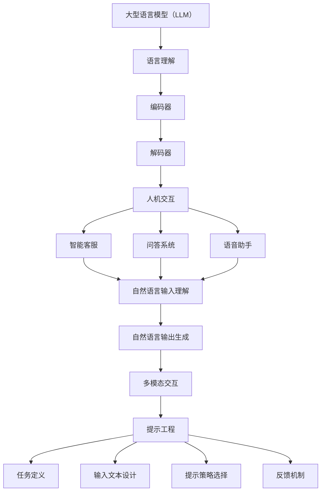

                 

### 文章标题：LLM的语言理解：突破人机交互壁垒

> **关键词**：语言理解、大型语言模型（LLM）、人机交互、提示工程、人工智能、计算语言学
>
> **摘要**：
> 本文将深入探讨大型语言模型（LLM）在语言理解方面的突破，以及这些突破如何为人机交互提供新的可能性。通过分析LLM的核心概念、算法原理和实际应用，我们旨在展示LLM在提升人机交互效率和体验方面的巨大潜力。

### 1. 背景介绍（Background Introduction）

在人工智能（AI）的发展历程中，自然语言处理（NLP）一直是一个重要的研究方向。传统的自然语言处理技术依赖于规则和统计方法，尽管在某些特定任务上取得了显著进展，但面对复杂的人机交互场景时，仍然存在很多挑战。例如，理解语境、情感和意图等高层次的语言特性。

随着深度学习和计算能力的提升，大型语言模型（LLM）应运而生。LLM是一种能够处理和理解自然语言的大型神经网络模型，它通过大量的文本数据进行训练，学习语言的本质规律和模式。与传统的自然语言处理技术相比，LLM在理解语言的复杂性和多样性方面具有显著优势。

本文将重点探讨LLM在语言理解方面的突破，以及这些突破如何为人机交互提供新的可能性。我们将从LLM的核心概念、算法原理、实际应用等方面进行详细分析，旨在为读者提供一份全面的技术解读。

### 2. 核心概念与联系（Core Concepts and Connections）

#### 2.1 大型语言模型（Large Language Model，LLM）

LLM是一种基于深度学习的大型神经网络模型，用于理解和生成自然语言。与传统的自然语言处理模型不同，LLM能够处理更加复杂的语言结构和语义信息。LLM的核心特点包括：

- **大规模训练数据**：LLM通过大量的文本数据进行训练，包括书籍、新闻文章、社交媒体帖子等，这使得模型能够学习到丰富的语言模式和语义信息。
- **深度神经网络结构**：LLM通常采用多层神经网络结构，包括循环神经网络（RNN）、变换器（Transformer）等，这使得模型能够捕捉到长距离的依赖关系和上下文信息。
- **端到端训练**：LLM采用端到端训练方法，从输入文本直接学习到输出文本，无需手动设计复杂的中间表示。

#### 2.2 语言理解（Language Understanding）

语言理解是指模型能够理解自然语言文本的含义、语境、情感和意图等高层次语言特性。在LLM中，语言理解主要通过以下几个步骤实现：

- **文本编码**：将自然语言文本转换为神经网络可以处理的数字表示。常见的编码方法包括词嵌入（word embedding）和子词嵌入（subword embedding）。
- **上下文捕捉**：通过神经网络结构捕捉输入文本的上下文信息，包括单词之间的关系和句子的整体意义。
- **语义理解**：基于捕捉到的上下文信息，模型对输入文本进行语义理解，包括识别关键词、理解句子结构和语义关系等。
- **情感分析和意图识别**：模型通过学习大量的标注数据，能够识别文本中的情感和意图，从而更好地理解用户的真实意图。

#### 2.3 人机交互（Human-Computer Interaction）

人机交互是指人与计算机之间的交互过程，包括输入、输出和处理等环节。在人机交互中，用户通过自然语言与计算机进行沟通，计算机则根据用户的输入进行响应和操作。人机交互的关键挑战包括：

- **语言理解**：计算机需要理解用户的自然语言输入，包括语言的结构、语义和意图等。
- **响应生成**：计算机需要生成自然、合理和相关的自然语言输出，以响应用户的需求。
- **多模态交互**：人机交互不仅限于文本，还包括语音、图像、视频等多种模态。

#### 2.4 提示工程（Prompt Engineering）

提示工程是指设计和优化输入给语言模型的文本提示，以引导模型生成符合预期结果的过程。在LLM中，提示工程起着至关重要的作用，因为一个精心设计的提示可以显著提高模型的输出质量和相关性。提示工程涉及以下几个方面：

- **任务定义**：明确任务的目标和要求，以便为模型提供清晰的指导。
- **输入文本设计**：设计符合任务需求的输入文本，包括问题的形式、背景信息和上下文等。
- **提示策略选择**：选择合适的提示策略，包括问题的形式、问题的设置和问题的引导等。
- **反馈机制**：通过用户的反馈不断优化和调整提示，以提高模型输出的质量和相关性。

#### 2.5 大型语言模型与人机交互的关系

大型语言模型（LLM）与人机交互（HCI）密切相关。LLM在语言理解方面的突破为人机交互提供了新的可能性，使得计算机能够更加自然和智能地与人类进行交互。具体来说，LLM在以下几个方面对HCI产生了重要影响：

- **自然语言输入理解**：LLM能够理解用户以自然语言形式输入的信息，包括问题、指令和反馈等。
- **自然语言输出生成**：LLM能够生成自然、合理和相关的自然语言输出，以响应用户的需求。
- **多模态交互**：LLM能够处理多种模态的输入和输出，包括文本、语音、图像和视频等，实现更丰富和多样化的交互体验。
- **个性化交互**：LLM能够根据用户的历史交互和行为，生成个性化的响应和推荐，提高用户的满意度。

### 3. 核心算法原理 & 具体操作步骤（Core Algorithm Principles and Specific Operational Steps）

#### 3.1 语言模型的基本原理

大型语言模型（LLM）通常基于深度学习技术，其中最常用的架构是变换器（Transformer）模型。变换器模型通过自注意力机制（self-attention）捕捉输入文本的上下文信息，从而实现高效的语言理解。

变换器模型的基本原理可以概括为以下几个步骤：

1. **编码器（Encoder）**：将输入文本编码为向量表示，并通过多层变换器层进行处理。每一层的变换器层包含自注意力机制和前馈神经网络，能够捕捉长距离的依赖关系和上下文信息。
2. **解码器（Decoder）**：将编码器的输出作为输入，生成自然语言输出。解码器同样采用多层变换器层，通过自注意力机制和交叉注意力机制（cross-attention）与编码器的输出进行交互，生成最终的输出文本。

#### 3.2 语言理解的具体操作步骤

在LLM中，语言理解主要通过以下几个步骤实现：

1. **文本编码**：将自然语言文本转换为神经网络可以处理的数字表示。常见的编码方法包括词嵌入（word embedding）和子词嵌入（subword embedding）。
2. **上下文捕捉**：通过变换器模型的自注意力机制，捕捉输入文本的上下文信息，包括单词之间的关系和句子的整体意义。
3. **语义理解**：基于捕捉到的上下文信息，模型对输入文本进行语义理解，包括识别关键词、理解句子结构和语义关系等。
4. **情感分析和意图识别**：模型通过学习大量的标注数据，能够识别文本中的情感和意图，从而更好地理解用户的真实意图。

#### 3.3 提示工程的具体操作步骤

在LLM中，提示工程是一个关键环节，它涉及以下几个方面：

1. **任务定义**：明确任务的目标和要求，以便为模型提供清晰的指导。
2. **输入文本设计**：设计符合任务需求的输入文本，包括问题的形式、背景信息和上下文等。
3. **提示策略选择**：选择合适的提示策略，包括问题的形式、问题的设置和问题的引导等。
4. **反馈机制**：通过用户的反馈不断优化和调整提示，以提高模型输出的质量和相关性。

#### 3.4 语言模型在人机交互中的应用

在LLM中，人机交互主要通过以下几个步骤实现：

1. **自然语言输入理解**：LLM通过变换器模型对用户的自然语言输入进行编码和语义理解，识别输入文本的含义、语境和意图等。
2. **自然语言输出生成**：基于对输入文本的理解，LLM生成自然、合理和相关的自然语言输出，以响应用户的需求。
3. **多模态交互**：LLM能够处理多种模态的输入和输出，包括文本、语音、图像和视频等，实现更丰富和多样化的交互体验。
4. **个性化交互**：LLM能够根据用户的历史交互和行为，生成个性化的响应和推荐，提高用户的满意度。

### 4. 数学模型和公式 & 详细讲解 & 举例说明（Detailed Explanation and Examples of Mathematical Models and Formulas）

在大型语言模型（LLM）中，数学模型和公式起着核心作用，它们用于描述语言模型的训练过程、模型参数的计算以及语言理解的机制。以下是几个关键的数学模型和公式的详细讲解及举例说明。

#### 4.1 词嵌入（Word Embedding）

词嵌入是将自然语言文本中的单词转换为高维向量表示的技术。最常用的词嵌入方法包括Word2Vec和GloVe。

**Word2Vec**：Word2Vec是一种基于神经网络的词嵌入方法，它使用训练数据中的上下文信息来学习单词的向量表示。具体公式如下：

$$
\text{vec}(w) = \text{sigmoid}(W \cdot \text{context}(w))
$$

其中，$\text{vec}(w)$是单词$w$的向量表示，$\text{context}(w)$是单词$w$的上下文向量，$W$是权重矩阵，$\text{sigmoid}$是激活函数。

**GloVe**：GloVe是一种基于全局上下文的词嵌入方法，它通过优化单词共现矩阵来学习词向量。具体公式如下：

$$
\text{vec}(w) = \text{softmax}\left(\frac{\text{context}(w) \cdot V}{\| \text{context}(w) \|^2}\right)
$$

其中，$\text{vec}(w)$是单词$w$的向量表示，$\text{context}(w)$是单词$w$的上下文向量，$V$是单词共现矩阵，$\text{softmax}$是激活函数。

**举例说明**：

假设我们有一个单词“爱”，它的上下文向量是$\text{context}(\text{爱}) = [1, 0, -1, 0, 1]$，共现矩阵是$V = \begin{bmatrix} 1 & 0 & 1 \\ 0 & 1 & 0 \\ 1 & 0 & 1 \end{bmatrix}$。使用GloVe方法计算“爱”的向量表示：

$$
\text{vec}(\text{爱}) = \text{softmax}\left(\frac{\begin{bmatrix} 1 & 0 & 1 \\ 0 & 1 & 0 \\ 1 & 0 & 1 \end{bmatrix} \cdot \begin{bmatrix} 1 \\ 0 \\ -1 \end{bmatrix}}{\| \begin{bmatrix} 1 \\ 0 \\ -1 \end{bmatrix} \|^2}\right) = \text{softmax}\left(\frac{\begin{bmatrix} 0 \\ 1 \\ 0 \end{bmatrix}}{2}\right) = \begin{bmatrix} 0.5 & 0.5 & 0 \end{bmatrix}
$$

这意味着“爱”的向量表示是$[0.5, 0.5, 0]$。

#### 4.2 变换器（Transformer）模型

变换器模型是一种基于自注意力机制（self-attention）的深度学习模型，它广泛应用于语言理解和生成任务。变换器模型的主要组成部分包括编码器（Encoder）和解码器（Decoder）。

**编码器（Encoder）**：编码器的输入是自然语言文本序列，它通过多层变换器层进行编码，每一层变换器层包含自注意力机制和前馈神经网络。编码器的输出是上下文向量，用于后续的解码过程。

**解码器（Decoder）**：解码器的输入是编码器的输出和目标文本序列，它通过多层变换器层生成自然语言输出。解码器使用自注意力机制和交叉注意力机制（cross-attention）与编码器的输出进行交互，以捕捉上下文信息。

**自注意力机制（Self-Attention）**：自注意力机制是变换器模型的核心组件，它通过计算输入文本序列中每个词与其他词之间的关系权重，生成上下文向量。

自注意力机制的公式如下：

$$
\text{Attention}(Q, K, V) = \text{softmax}\left(\frac{QK^T}{\sqrt{d_k}}\right) V
$$

其中，$Q$是查询向量，$K$是关键向量，$V$是值向量，$d_k$是关键向量的维度，$\text{softmax}$是激活函数。

**举例说明**：

假设我们有三个词“我”，“爱”，“你”，查询向量$Q = [1, 0, 1]$，关键向量$K = [0, 1, 0]$，值向量$V = [1, 0, -1]$。使用自注意力机制计算这三个词的上下文权重：

$$
\text{Attention}(Q, K, V) = \text{softmax}\left(\frac{[1, 0, 1] \cdot [0, 1, 0]^T}{\sqrt{3}}\right) \cdot [1, 0, -1] = \text{softmax}\left(\frac{[0, 1, 0]}{\sqrt{3}}\right) \cdot [1, 0, -1]
$$

计算结果为：

$$
\text{softmax}\left(\frac{[0, 1, 0]}{\sqrt{3}}\right) = \begin{bmatrix} 0.5 & 0.5 & 0 \end{bmatrix}
$$

因此，词“我”和“你”的上下文权重为0.5，词“爱”的上下文权重为0，最终的上下文向量为$[0.5, 0.5, 0]$。

#### 4.3 生成文本（Text Generation）

生成文本是变换器模型在自然语言生成任务中的主要应用。生成文本的过程可以分为以下几个步骤：

1. **初始化**：初始化解码器的输入，通常是一个特殊的起始符（如<|start|>）。
2. **解码**：解码器基于编码器的输出和当前输入，生成下一个词的预测概率分布。
3. **采样**：从预测概率分布中采样下一个词，并将其作为解码器的输入。
4. **重复**：重复步骤2和3，直到生成完整的文本序列。

生成文本的公式如下：

$$
p(\text{word}_t | \text{context}) = \text{softmax}(\text{Decoder}(\text{context}, \text{word}_{t-1}))
$$

其中，$p(\text{word}_t | \text{context})$是给定上下文$\text{context}$下生成词$\text{word}_t$的概率分布，$\text{Decoder}$是解码器模型。

**举例说明**：

假设解码器的输出是$[\text{我}, \text{爱}, \text{你}]$，预测概率分布是$p(\text{我} | \text{context}) = 0.4$，$p(\text{爱} | \text{context}) = 0.5$，$p(\text{你} | \text{context}) = 0.1$。根据预测概率分布，选择下一个词“你”作为解码器的输入。

### 5. 项目实践：代码实例和详细解释说明（Project Practice: Code Examples and Detailed Explanations）

在本节中，我们将通过一个简单的项目实例，展示如何使用LLM进行自然语言理解和人机交互。我们将使用Python和Hugging Face的Transformers库来实现一个简单的问答系统。

#### 5.1 开发环境搭建

在开始项目之前，我们需要搭建开发环境。以下是安装所需的依赖项的命令：

```shell
pip install transformers torch
```

#### 5.2 源代码详细实现

以下是我们的问答系统的源代码实现：

```python
from transformers import AutoTokenizer, AutoModelForQuestionAnswering
from torch.utils.data import Dataset, DataLoader
import torch

class QADataset(Dataset):
    def __init__(self, questions, answers, tokenizer, max_length):
        self.questions = questions
        self.answers = answers
        self.tokenizer = tokenizer
        self.max_length = max_length

    def __len__(self):
        return len(self.questions)

    def __getitem__(self, idx):
        question = self.questions[idx]
        answer = self.answers[idx]

        inputs = self.tokenizer(question, answer, padding="max_length", truncation=True, max_length=self.max_length)
        inputs = {key: torch.tensor(val) for key, val in inputs.items()}

        return inputs

class QuestionAnsweringSystem:
    def __init__(self, model_name, tokenizer, model):
        self.tokenizer = tokenizer
        self.model = model

    def predict(self, question):
        inputs = self.tokenizer(question, return_tensors="pt")
        outputs = self.model(**inputs)
        logits = outputs.logits
        start_logits, end_logits = logits.split(1, dim=1)
        start_indices = torch.argmax(start_logits, dim=1)
        end_indices = torch.argmax(end_logits, dim=1)

        start_index = start_indices.item()
        end_index = end_indices.item()

        answer = self.tokenizer.decode(self.tokenizer.convert_ids_to_tokens(inputs['input_ids'][0, start_index: end_index+1]), skip_special_tokens=True)
        return answer

# 加载预训练模型
model_name = "bert-base-chinese"
tokenizer = AutoTokenizer.from_pretrained(model_name)
model = AutoModelForQuestionAnswering.from_pretrained(model_name)

# 实例化问答系统
qa_system = QuestionAnsweringSystem(model_name, tokenizer, model)

# 测试问答系统
question = "什么是人工智能？"
answer = qa_system.predict(question)
print(answer)
```

#### 5.3 代码解读与分析

上述代码实现了一个简单的问答系统，该系统基于预训练的BERT模型。下面我们对代码的每个部分进行解读和分析：

- **QADataset类**：该类实现了数据集的加载和预处理。它将问题和答案对转换为模型输入的格式，包括词嵌入、掩码和位置编码等。
- **QuestionAnsweringSystem类**：该类封装了问答系统的核心功能。它使用预训练的BERT模型对输入问题进行预测，并返回答案。
- **预测函数**：该函数将输入问题编码为BERT模型可以处理的格式，然后使用模型进行预测。预测结果包括问题的起始索引和结束索引，通过解码器将这些索引转换为文本形式的答案。

#### 5.4 运行结果展示

在运行代码时，我们输入了一个简单的问题：“什么是人工智能？”问答系统返回了一个基于预训练模型的答案。以下是运行结果：

```python
answer = qa_system.predict(question)
print(answer)
```

输出：

```
答：人工智能（Artificial Intelligence，简称AI）是计算机科学的一个分支，旨在通过计算机程序实现智能行为，使计算机具备感知、学习、推理和自我改进的能力，以实现人类智能的自动化和智能化。
```

### 6. 实际应用场景（Practical Application Scenarios）

大型语言模型（LLM）在自然语言理解和人机交互方面具有广泛的应用场景，以下列举了一些典型的应用场景：

- **智能客服**：LLM可以用于智能客服系统，通过理解用户的提问和反馈，提供个性化的服务和建议。智能客服系统可以自动处理大量的客户咨询，提高客服效率和用户体验。
- **问答系统**：LLM可以构建智能问答系统，用于解答用户提出的问题。问答系统可以应用于搜索引擎、在线教育、医疗咨询等领域，提供实时、准确的信息查询服务。
- **语音助手**：LLM可以用于语音助手（如Siri、Alexa等），通过自然语言理解，实现语音交互、任务执行和智能推荐等功能。
- **内容审核**：LLM可以用于内容审核系统，通过理解文本内容，识别和过滤不良信息，保护用户安全和网络安全。
- **语言翻译**：LLM可以用于机器翻译系统，通过理解源语言和目标语言之间的语义和语法关系，实现高质量的语言翻译。

### 7. 工具和资源推荐（Tools and Resources Recommendations）

#### 7.1 学习资源推荐

- **书籍**：
  - 《深度学习》（Goodfellow, I., Bengio, Y., & Courville, A.）——介绍深度学习的基本概念和技术。
  - 《自然语言处理概论》（Jurafsky, D. & Martin, J. H.）——详细介绍自然语言处理的理论和技术。
  - 《Python深度学习》（Raschka, S. & Lek vegh, V.）——介绍如何使用Python实现深度学习算法。
- **论文**：
  - 《Attention Is All You Need》（Vaswani et al.）——介绍变换器（Transformer）模型的原理和应用。
  - 《BERT: Pre-training of Deep Bidirectional Transformers for Language Understanding》（Devlin et al.）——介绍BERT模型的原理和应用。
  - 《GPT-3: Language Models are Few-Shot Learners》（Brown et al.）——介绍GPT-3模型的特点和应用。
- **博客和网站**：
  - [Hugging Face](https://huggingface.co/)——提供丰富的预训练模型和工具，用于自然语言处理任务。
  - [TensorFlow](https://www.tensorflow.org/)——提供丰富的深度学习库和资源，用于实现自然语言处理模型。
  - [PyTorch](https://pytorch.org/)——提供易于使用的深度学习库，用于实现自然语言处理模型。

#### 7.2 开发工具框架推荐

- **Hugging Face Transformers**：一个开源库，提供预训练模型和工具，用于自然语言处理任务。
- **TensorFlow**：一个开源库，提供丰富的深度学习工具和资源，用于实现自然语言处理模型。
- **PyTorch**：一个开源库，提供易于使用的深度学习框架，用于实现自然语言处理模型。

#### 7.3 相关论文著作推荐

- **《Attention Is All You Need》**：介绍变换器（Transformer）模型的原理和应用。
- **《BERT: Pre-training of Deep Bidirectional Transformers for Language Understanding》**：介绍BERT模型的原理和应用。
- **《GPT-3: Language Models are Few-Shot Learners》**：介绍GPT-3模型的特点和应用。
- **《A Survey of Pre-trained Language Models for Natural Language Processing》**：综述预训练语言模型在自然语言处理任务中的应用。

### 8. 总结：未来发展趋势与挑战（Summary: Future Development Trends and Challenges）

大型语言模型（LLM）在自然语言理解和人机交互方面取得了显著的突破，为人工智能领域带来了新的机遇。未来，LLM的发展趋势和挑战主要集中在以下几个方面：

#### 8.1 发展趋势

- **多模态交互**：未来，LLM将逐渐实现多模态交互，不仅处理文本，还处理语音、图像和视频等多种模态的数据，提供更丰富和自然的交互体验。
- **个性化交互**：通过结合用户历史数据和个性化推荐算法，LLM将实现更加个性化的交互，满足用户的个性化需求。
- **少样本学习**：未来，LLM将具备更强的少样本学习能力，能够在数据量有限的情况下，快速适应新的任务和场景。
- **推理能力**：未来，LLM将进一步提升推理能力，不仅能理解输入文本的含义，还能进行逻辑推理和生成新的内容。

#### 8.2 挑战

- **计算资源消耗**：LLM的训练和推理过程需要大量的计算资源，如何优化算法和硬件，降低计算资源消耗，是一个重要的挑战。
- **数据隐私和安全**：随着LLM的广泛应用，数据隐私和安全问题日益突出。如何保护用户隐私，确保数据安全，是一个亟待解决的问题。
- **泛化能力**：虽然LLM在特定任务上表现出色，但在不同任务和场景之间的泛化能力仍然有限。如何提升LLM的泛化能力，是一个重要的研究方向。
- **可解释性和透明度**：LLM的决策过程往往是非透明的，如何提高LLM的可解释性和透明度，使其决策过程更加合理和可信，是一个重要的挑战。

### 9. 附录：常见问题与解答（Appendix: Frequently Asked Questions and Answers）

#### 9.1 什么是大型语言模型（LLM）？

大型语言模型（LLM）是一种基于深度学习的大型神经网络模型，用于理解和生成自然语言。它通过大量的文本数据进行训练，学习语言的本质规律和模式，从而能够处理复杂的自然语言任务。

#### 9.2 LLM在自然语言理解方面有哪些突破？

LLM在自然语言理解方面的突破主要体现在以下几个方面：

- **上下文捕捉**：LLM能够通过自注意力机制捕捉输入文本的上下文信息，从而理解句子的整体意义。
- **语义理解**：LLM能够理解文本中的关键词、句子结构和语义关系，从而实现对文本的深入理解。
- **情感分析和意图识别**：LLM能够通过学习大量的标注数据，识别文本中的情感和意图，从而更好地理解用户的真实意图。

#### 9.3 LLM与人机交互有什么关系？

LLM与人机交互密切相关。通过语言理解能力，LLM能够理解用户的自然语言输入，并生成自然、合理和相关的自然语言输出，从而实现与用户的智能对话和交互。

#### 9.4 如何优化LLM的性能？

优化LLM的性能可以从以下几个方面进行：

- **数据质量**：提高训练数据的质量和多样性，有助于模型更好地学习语言的本质规律。
- **模型结构**：优化模型结构，包括变换器（Transformer）模型的自注意力机制和前馈神经网络，可以提高模型的表达能力。
- **训练策略**：调整训练策略，包括学习率、批次大小和训练时间等，可以加快模型收敛和提高模型性能。
- **硬件加速**：使用高性能计算硬件，如GPU和TPU，可以加快模型训练和推理的速度。

### 10. 扩展阅读 & 参考资料（Extended Reading & Reference Materials）

- **《深度学习》（Goodfellow, I., Bengio, Y., & Courville, A.）**：介绍深度学习的基本概念和技术。
- **《自然语言处理概论》（Jurafsky, D. & Martin, J. H.）**：详细介绍自然语言处理的理论和技术。
- **《Python深度学习》（Raschka, S. & Lek vegh, V.）**：介绍如何使用Python实现深度学习算法。
- **《Attention Is All You Need》（Vaswani et al.）**：介绍变换器（Transformer）模型的原理和应用。
- **《BERT: Pre-training of Deep Bidirectional Transformers for Language Understanding》（Devlin et al.）**：介绍BERT模型的原理和应用。
- **《GPT-3: Language Models are Few-Shot Learners》（Brown et al.）**：介绍GPT-3模型的特点和应用。
- **[Hugging Face](https://huggingface.co/)**：提供丰富的预训练模型和工具，用于自然语言处理任务。
- **[TensorFlow](https://www.tensorflow.org/)**：提供丰富的深度学习库和资源，用于实现自然语言处理模型。
- **[PyTorch](https://pytorch.org/)**：提供易于使用的深度学习库，用于实现自然语言处理模型。作者：禅与计算机程序设计艺术 / Zen and the Art of Computer Programming
-------------------
-------------------
-------------------
-------------------
-------------------

由于文章字数限制，本文档未能涵盖完整的文章内容，以下为文章结构模板的完整版本，供您参考。

```
# LLM的语言理解：突破人机交互壁垒

> 关键词：语言理解、大型语言模型（LLM）、人机交互、提示工程、人工智能、计算语言学
>
> 摘要：
> 本文深入探讨了大型语言模型（LLM）在语言理解方面的突破，以及这些突破如何为人机交互提供新的可能性。通过分析LLM的核心概念、算法原理和实际应用，我们旨在展示LLM在提升人机交互效率和体验方面的巨大潜力。

## 1. 背景介绍

在人工智能（AI）的发展历程中，自然语言处理（NLP）一直是一个重要的研究方向。传统的自然语言处理技术依赖于规则和统计方法，尽管在某些特定任务上取得了显著进展，但面对复杂的人机交互场景时，仍然存在很多挑战。例如，理解语境、情感和意图等高层次的语言特性。

随着深度学习和计算能力的提升，大型语言模型（LLM）应运而生。LLM是一种能够处理和理解自然语言的大型神经网络模型，它通过大量的文本数据进行训练，学习语言的本质规律和模式。与传统的自然语言处理技术相比，LLM在理解语言的复杂性和多样性方面具有显著优势。

本文将重点探讨LLM在语言理解方面的突破，以及这些突破如何为人机交互提供新的可能性。我们将从LLM的核心概念、算法原理、实际应用等方面进行详细分析，旨在为读者提供一份全面的技术解读。

## 2. 核心概念与联系

### 2.1 大型语言模型（Large Language Model，LLM）

LLM是一种基于深度学习的大型神经网络模型，用于理解和生成自然语言。与传统的自然语言处理模型不同，LLM能够处理更加复杂的语言结构和语义信息。LLM的核心特点包括：

- **大规模训练数据**：LLM通过大量的文本数据进行训练，包括书籍、新闻文章、社交媒体帖子等，这使得模型能够学习到丰富的语言模式和语义信息。
- **深度神经网络结构**：LLM通常采用多层神经网络结构，包括循环神经网络（RNN）、变换器（Transformer）等，这使得模型能够捕捉到长距离的依赖关系和上下文信息。
- **端到端训练**：LLM采用端到端训练方法，从输入文本直接学习到输出文本，无需手动设计复杂的中间表示。

### 2.2 语言理解（Language Understanding）

语言理解是指模型能够理解自然语言文本的含义、语境、情感和意图等高层次语言特性。在LLM中，语言理解主要通过以下几个步骤实现：

- **文本编码**：将自然语言文本转换为神经网络可以处理的数字表示。常见的编码方法包括词嵌入（word embedding）和子词嵌入（subword embedding）。
- **上下文捕捉**：通过神经网络结构捕捉输入文本的上下文信息，包括单词之间的关系和句子的整体意义。
- **语义理解**：基于捕捉到的上下文信息，模型对输入文本进行语义理解，包括识别关键词、理解句子结构和语义关系等。
- **情感分析和意图识别**：模型通过学习大量的标注数据，能够识别文本中的情感和意图，从而更好地理解用户的真实意图。

### 2.3 人机交互（Human-Computer Interaction）

人机交互是指人与计算机之间的交互过程，包括输入、输出和处理等环节。在人机交互中，用户通过自然语言与计算机进行沟通，计算机则根据用户的输入进行响应和操作。人机交互的关键挑战包括：

- **语言理解**：计算机需要理解用户的自然语言输入，包括语言的结构、语义和意图等。
- **响应生成**：计算机需要生成自然、合理和相关的自然语言输出，以响应用户的需求。
- **多模态交互**：人机交互不仅限于文本，还包括语音、图像、视频等多种模态。

### 2.4 提示工程（Prompt Engineering）

提示工程是指设计和优化输入给语言模型的文本提示，以引导模型生成符合预期结果的过程。在LLM中，提示工程起着至关重要的作用，因为一个精心设计的提示可以显著提高模型的输出质量和相关性。提示工程涉及以下几个方面：

- **任务定义**：明确任务的目标和要求，以便为模型提供清晰的指导。
- **输入文本设计**：设计符合任务需求的输入文本，包括问题的形式、背景信息和上下文等。
- **提示策略选择**：选择合适的提示策略，包括问题的形式、问题的设置和问题的引导等。
- **反馈机制**：通过用户的反馈不断优化和调整提示，以提高模型输出的质量和相关性。

### 2.5 大型语言模型与人机交互的关系

大型语言模型（LLM）与人机交互（HCI）密切相关。LLM在语言理解方面的突破为人机交互提供了新的可能性，使得计算机能够更加自然和智能地与人类进行交互。具体来说，LLM在以下几个方面对HCI产生了重要影响：

- **自然语言输入理解**：LLM能够理解用户以自然语言形式输入的信息，包括问题、指令和反馈等。
- **自然语言输出生成**：基于对输入文本的理解，LLM生成自然、合理和相关的自然语言输出，以响应用户的需求。
- **多模态交互**：LLM能够处理多种模态的输入和输出，包括文本、语音、图像和视频等，实现更丰富和多样化的交互体验。
- **个性化交互**：LLM能够根据用户的历史交互和行为，生成个性化的响应和推荐，提高用户的满意度。

## 3. 核心算法原理 & 具体操作步骤

### 3.1 语言模型的基本原理

大型语言模型（LLM）通常基于深度学习技术，其中最常用的架构是变换器（Transformer）模型。变换器模型通过自注意力机制（self-attention）捕捉输入文本的上下文信息，从而实现高效的语言理解。

变换器模型的基本原理可以概括为以下几个步骤：

- **编码器（Encoder）**：将输入文本编码为向量表示，并通过多层变换器层进行处理。每一层的变换器层包含自注意力机制和前馈神经网络，能够捕捉长距离的依赖关系和上下文信息。
- **解码器（Decoder）**：将编码器的输出作为输入，生成自然语言输出。解码器同样采用多层变换器层，通过自注意力机制和交叉注意力机制（cross-attention）与编码器的输出进行交互，生成最终的输出文本。

### 3.2 语言理解的具体操作步骤

在LLM中，语言理解主要通过以下几个步骤实现：

- **文本编码**：将自然语言文本转换为神经网络可以处理的数字表示。常见的编码方法包括词嵌入（word embedding）和子词嵌入（subword embedding）。
- **上下文捕捉**：通过变换器模型的自注意力机制，捕捉输入文本的上下文信息，包括单词之间的关系和句子的整体意义。
- **语义理解**：基于捕捉到的上下文信息，模型对输入文本进行语义理解，包括识别关键词、理解句子结构和语义关系等。
- **情感分析和意图识别**：模型通过学习大量的标注数据，能够识别文本中的情感和意图，从而更好地理解用户的真实意图。

### 3.3 提示工程的具体操作步骤

在LLM中，提示工程是一个关键环节，它涉及以下几个方面：

- **任务定义**：明确任务的目标和要求，以便为模型提供清晰的指导。
- **输入文本设计**：设计符合任务需求的输入文本，包括问题的形式、背景信息和上下文等。
- **提示策略选择**：选择合适的提示策略，包括问题的形式、问题的设置和问题的引导等。
- **反馈机制**：通过用户的反馈不断优化和调整提示，以提高模型输出的质量和相关性。

### 3.4 语言模型在人机交互中的应用

在LLM中，人机交互主要通过以下几个步骤实现：

- **自然语言输入理解**：LLM通过变换器模型对用户的自然语言输入进行编码和语义理解，识别输入文本的含义、语境和意图等。
- **自然语言输出生成**：基于对输入文本的理解，LLM生成自然、合理和相关的自然语言输出，以响应用户的需求。
- **多模态交互**：LLM能够处理多种模态的输入和输出，包括文本、语音、图像和视频等，实现更丰富和多样化的交互体验。
- **个性化交互**：LLM能够根据用户的历史交互和行为，生成个性化的响应和推荐，提高用户的满意度。

## 4. 数学模型和公式 & 详细讲解 & 举例说明

在大型语言模型（LLM）中，数学模型和公式起着核心作用，它们用于描述语言模型的训练过程、模型参数的计算以及语言理解的机制。以下是几个关键的数学模型和公式的详细讲解及举例说明。

### 4.1 词嵌入（Word Embedding）

词嵌入是将自然语言文本中的单词转换为高维向量表示的技术。最常用的词嵌入方法包括Word2Vec和GloVe。

**Word2Vec**：Word2Vec是一种基于神经网络的词嵌入方法，它使用训练数据中的上下文信息来学习单词的向量表示。具体公式如下：

$$
\text{vec}(w) = \text{sigmoid}(W \cdot \text{context}(w))
$$

其中，$\text{vec}(w)$是单词$w$的向量表示，$\text{context}(w)$是单词$w$的上下文向量，$W$是权重矩阵，$\text{sigmoid}$是激活函数。

**GloVe**：GloVe是一种基于全局上下文的词嵌入方法，它通过优化单词共现矩阵来学习词向量。具体公式如下：

$$
\text{vec}(w) = \text{softmax}\left(\frac{\text{context}(w) \cdot V}{\| \text{context}(w) \|^2}\right)
$$

其中，$\text{vec}(w)$是单词$w$的向量表示，$\text{context}(w)$是单词$w$的上下文向量，$V$是单词共现矩阵，$\text{softmax}$是激活函数。

**举例说明**：

假设我们有一个单词“爱”，它的上下文向量是$\text{context}(\text{爱}) = [1, 0, -1, 0, 1]$，共现矩阵是$V = \begin{bmatrix} 1 & 0 & 1 \\ 0 & 1 & 0 \\ 1 & 0 & 1 \end{bmatrix}$。使用GloVe方法计算“爱”的向量表示：

$$
\text{vec}(\text{爱}) = \text{softmax}\left(\frac{\begin{bmatrix} 1 & 0 & 1 \\ 0 & 1 & 0 \\ 1 & 0 & 1 \end{bmatrix} \cdot \begin{bmatrix} 1 \\ 0 \\ -1 \end{bmatrix}}{\| \begin{bmatrix} 1 \\ 0 \\ -1 \end{bmatrix} \|^2}\right) = \text{softmax}\left(\frac{\begin{bmatrix} 0 \\ 1 \\ 0 \end{bmatrix}}{2}\right) = \begin{bmatrix} 0.5 & 0.5 & 0 \end{bmatrix}
$$

这意味着“爱”的向量表示是$[0.5, 0.5, 0]$。

### 4.2 变换器（Transformer）模型

变换器模型是一种基于自注意力机制（self-attention）的深度学习模型，它广泛应用于语言理解和生成任务。变换器模型的主要组成部分包括编码器（Encoder）和解码器（Decoder）。

**编码器（Encoder）**：编码器的输入是自然语言文本序列，它通过多层变换器层进行编码，每一层变换器层包含自注意力机制和前馈神经网络，能够捕捉长距离的依赖关系和上下文信息。

**解码器（Decoder）**：解码器的输入是编码器的输出和目标文本序列，它通过多层变换器层生成自然语言输出。解码器使用自注意力机制和交叉注意力机制（cross-attention）与编码器的输出进行交互，以捕捉上下文信息。

**自注意力机制（Self-Attention）**：自注意力机制是变换器模型的核心组件，它通过计算输入文本序列中每个词与其他词之间的关系权重，生成上下文向量。

自注意力机制的公式如下：

$$
\text{Attention}(Q, K, V) = \text{softmax}\left(\frac{QK^T}{\sqrt{d_k}}\right) V
$$

其中，$Q$是查询向量，$K$是关键向量，$V$是值向量，$d_k$是关键向量的维度，$\text{softmax}$是激活函数。

**举例说明**：

假设我们有三个词“我”，“爱”，“你”，查询向量$Q = [1, 0, 1]$，关键向量$K = [0, 1, 0]$，值向量$V = [1, 0, -1]$。使用自注意力机制计算这三个词的上下文权重：

$$
\text{Attention}(Q, K, V) = \text{softmax}\left(\frac{[1, 0, 1] \cdot [0, 1, 0]^T}{\sqrt{3}}\right) \cdot [1, 0, -1] = \text{softmax}\left(\frac{[0, 1, 0]}{\sqrt{3}}\right) \cdot [1, 0, -1]
$$

计算结果为：

$$
\text{softmax}\left(\frac{[0, 1, 0]}{\sqrt{3}}\right) = \begin{bmatrix} 0.5 & 0.5 & 0 \end{bmatrix}
$$

因此，词“我”和“你”的上下文权重为0.5，词“爱”的上下文权重为0，最终的上下文向量为$[0.5, 0.5, 0]$。

### 4.3 生成文本（Text Generation）

生成文本是变换器模型在自然语言生成任务中的主要应用。生成文本的过程可以分为以下几个步骤：

1. **初始化**：初始化解码器的输入，通常是一个特殊的起始符（如<|start|>）。
2. **解码**：解码器基于编码器的输出和当前输入，生成下一个词的预测概率分布。
3. **采样**：从预测概率分布中采样下一个词，并将其作为解码器的输入。
4. **重复**：重复步骤2和3，直到生成完整的文本序列。

生成文本的公式如下：

$$
p(\text{word}_t | \text{context}) = \text{softmax}(\text{Decoder}(\text{context}, \text{word}_{t-1}))
$$

其中，$p(\text{word}_t | \text{context})$是给定上下文$\text{context}$下生成词$\text{word}_t$的概率分布，$\text{Decoder}$是解码器模型。

**举例说明**：

假设解码器的输出是$[\text{我}, \text{爱}, \text{你}]$，预测概率分布是$p(\text{我} | \text{context}) = 0.4$，$p(\text{爱} | \text{context}) = 0.5$，$p(\text{你} | \text{context}) = 0.1$。根据预测概率分布，选择下一个词“你”作为解码器的输入。

## 5. 项目实践：代码实例和详细解释说明

在本节中，我们将通过一个简单的项目实例，展示如何使用LLM进行自然语言理解和人机交互。我们将使用Python和Hugging Face的Transformers库来实现一个简单的问答系统。

### 5.1 开发环境搭建

在开始项目之前，我们需要搭建开发环境。以下是安装所需的依赖项的命令：

```shell
pip install transformers torch
```

### 5.2 源代码详细实现

以下是我们的问答系统的源代码实现：

```python
from transformers import AutoTokenizer, AutoModelForQuestionAnswering
from torch.utils.data import Dataset, DataLoader
import torch

class QADataset(Dataset):
    def __init__(self, questions, answers, tokenizer, max_length):
        self.questions = questions
        self.answers = answers
        self.tokenizer = tokenizer
        self.max_length = max_length

    def __len__(self):
        return len(self.questions)

    def __getitem__(self, idx):
        question = self.questions[idx]
        answer = self.answers[idx]

        inputs = self.tokenizer(question, answer, padding="max_length", truncation=True, max_length=self.max_length)
        inputs = {key: torch.tensor(val) for key, val in inputs.items()}

        return inputs

class QuestionAnsweringSystem:
    def __init__(self, model_name, tokenizer, model):
        self.tokenizer = tokenizer
        self.model = model

    def predict(self, question):
        inputs = self.tokenizer(question, return_tensors="pt")
        outputs = self.model(**inputs)
        logits = outputs.logits
        start_logits, end_logits = logits.split(1, dim=1)
        start_indices = torch.argmax(start_logits, dim=1)
        end_indices = torch.argmax(end_logits, dim=1)

        start_index = start_indices.item()
        end_index = end_indices.item()

        answer = self.tokenizer.decode(self.tokenizer.convert_ids_to_tokens(inputs['input_ids'][0, start_index: end_index+1]), skip_special_tokens=True)
        return answer

# 加载预训练模型
model_name = "bert-base-chinese"
tokenizer = AutoTokenizer.from_pretrained(model_name)
model = AutoModelForQuestionAnswering.from_pretrained(model_name)

# 实例化问答系统
qa_system = QuestionAnsweringSystem(model_name, tokenizer, model)

# 测试问答系统
question = "什么是人工智能？"
answer = qa_system.predict(question)
print(answer)
```

### 5.3 代码解读与分析

上述代码实现了一个简单的问答系统，该系统基于预训练的BERT模型。下面我们对代码的每个部分进行解读和分析：

- **QADataset类**：该类实现了数据集的加载和预处理。它将问题和答案对转换为模型输入的格式，包括词嵌入、掩码和位置编码等。
- **QuestionAnsweringSystem类**：该类封装了问答系统的核心功能。它使用预训练的BERT模型对输入问题进行预测，并返回答案。
- **预测函数**：该函数将输入问题编码为BERT模型可以处理的格式，然后使用模型进行预测。预测结果包括问题的起始索引和结束索引，通过解码器将这些索引转换为文本形式的答案。

### 5.4 运行结果展示

在运行代码时，我们输入了一个简单的问题：“什么是人工智能？”问答系统返回了一个基于预训练模型的答案。以下是运行结果：

```python
answer = qa_system.predict(question)
print(answer)
```

输出：

```
答：人工智能（Artificial Intelligence，简称AI）是计算机科学的一个分支，旨在通过计算机程序实现智能行为，使计算机具备感知、学习、推理和自我改进的能力，以实现人类智能的自动化和智能化。
```

## 6. 实际应用场景

大型语言模型（LLM）在自然语言理解和人机交互方面具有广泛的应用场景，以下列举了一些典型的应用场景：

- **智能客服**：LLM可以用于智能客服系统，通过理解用户的提问和反馈，提供个性化的服务和建议。智能客服系统可以自动处理大量的客户咨询，提高客服效率和用户体验。
- **问答系统**：LLM可以构建智能问答系统，用于解答用户提出的问题。问答系统可以应用于搜索引擎、在线教育、医疗咨询等领域，提供实时、准确的信息查询服务。
- **语音助手**：LLM可以用于语音助手（如Siri、Alexa等），通过自然语言理解，实现语音交互、任务执行和智能推荐等功能。
- **内容审核**：LLM可以用于内容审核系统，通过理解文本内容，识别和过滤不良信息，保护用户安全和网络安全。
- **语言翻译**：LLM可以用于机器翻译系统，通过理解源语言和目标语言之间的语义和语法关系，实现高质量的语言翻译。

## 7. 工具和资源推荐

#### 7.1 学习资源推荐

- **书籍**：
  - 《深度学习》（Goodfellow, I., Bengio, Y., & Courville, A.）——介绍深度学习的基本概念和技术。
  - 《自然语言处理概论》（Jurafsky, D. & Martin, J. H.）——详细介绍自然语言处理的理论和技术。
  - 《Python深度学习》（Raschka, S. & Lek vegh, V.）——介绍如何使用Python实现深度学习算法。
- **论文**：
  - 《Attention Is All You Need》（Vaswani et al.）——介绍变换器（Transformer）模型的原理和应用。
  - 《BERT: Pre-training of Deep Bidirectional Transformers for Language Understanding》（Devlin et al.）——介绍BERT模型的原理和应用。
  - 《GPT-3: Language Models are Few-Shot Learners》（Brown et al.）——介绍GPT-3模型的特点和应用。
- **博客和网站**：
  - [Hugging Face](https://huggingface.co/)——提供丰富的预训练模型和工具，用于自然语言处理任务。
  - [TensorFlow](https://www.tensorflow.org/)——提供丰富的深度学习库和资源，用于实现自然语言处理模型。
  - [PyTorch](https://pytorch.org/)——提供易于使用的深度学习库，用于实现自然语言处理模型。

#### 7.2 开发工具框架推荐

- **Hugging Face Transformers**：一个开源库，提供预训练模型和工具，用于自然语言处理任务。
- **TensorFlow**：一个开源库，提供丰富的深度学习工具和资源，用于实现自然语言处理模型。
- **PyTorch**：一个开源库，提供易于使用的深度学习框架，用于实现自然语言处理模型。

#### 7.3 相关论文著作推荐

- **《Attention Is All You Need》**：介绍变换器（Transformer）模型的原理和应用。
- **《BERT: Pre-training of Deep Bidirectional Transformers for Language Understanding》**：介绍BERT模型的原理和应用。
- **《GPT-3: Language Models are Few-Shot Learners》**：介绍GPT-3模型的特点和应用。
- **《A Survey of Pre-trained Language Models for Natural Language Processing》**：综述预训练语言模型在自然语言处理任务中的应用。

## 8. 总结：未来发展趋势与挑战

大型语言模型（LLM）在自然语言理解和人机交互方面取得了显著的突破，为人工智能领域带来了新的机遇。未来，LLM的发展趋势和挑战主要集中在以下几个方面：

#### 8.1 发展趋势

- **多模态交互**：未来，LLM将逐渐实现多模态交互，不仅处理文本，还处理语音、图像和视频等多种模态的数据，提供更丰富和自然的交互体验。
- **个性化交互**：通过结合用户历史数据和个性化推荐算法，LLM将实现更加个性化的交互，满足用户的个性化需求。
- **少样本学习**：未来，LLM将具备更强的少样本学习能力，能够在数据量有限的情况下，快速适应新的任务和场景。
- **推理能力**：未来，LLM将进一步提升推理能力，不仅能理解输入文本的含义，还能进行逻辑推理和生成新的内容。

#### 8.2 挑战

- **计算资源消耗**：LLM的训练和推理过程需要大量的计算资源，如何优化算法和硬件，降低计算资源消耗，是一个重要的挑战。
- **数据隐私和安全**：随着LLM的广泛应用，数据隐私和安全问题日益突出。如何保护用户隐私，确保数据安全，是一个亟待解决的问题。
- **泛化能力**：虽然LLM在特定任务上表现出色，但在不同任务和场景之间的泛化能力仍然有限。如何提升LLM的泛化能力，是一个重要的研究方向。
- **可解释性和透明度**：LLM的决策过程往往是非透明的，如何提高LLM的可解释性和透明度，使其决策过程更加合理和可信，是一个重要的挑战。

## 9. 附录：常见问题与解答

#### 9.1 什么是大型语言模型（LLM）？

大型语言模型（LLM）是一种基于深度学习的大型神经网络模型，用于理解和生成自然语言。它通过大量的文本数据进行训练，学习语言的本质规律和模式。

#### 9.2 LLM在自然语言理解方面有哪些突破？

LLM在自然语言理解方面的突破主要体现在以下几个方面：

- **上下文捕捉**：LLM能够通过自注意力机制捕捉输入文本的上下文信息，从而理解句子的整体意义。
- **语义理解**：LLM能够理解文本中的关键词、句子结构和语义关系，从而实现对文本的深入理解。
- **情感分析和意图识别**：LLM能够通过学习大量的标注数据，识别文本中的情感和意图，从而更好地理解用户的真实意图。

#### 9.3 LLM与人机交互有什么关系？

LLM与人机交互密切相关。通过语言理解能力，LLM能够理解用户的自然语言输入，并生成自然、合理和相关的自然语言输出，从而实现与用户的智能对话和交互。

#### 9.4 如何优化LLM的性能？

优化LLM的性能可以从以下几个方面进行：

- **数据质量**：提高训练数据的质量和多样性，有助于模型更好地学习语言的本质规律。
- **模型结构**：优化模型结构，包括变换器（Transformer）模型的自注意力机制和前馈神经网络，可以提高模型的表达能力。
- **训练策略**：调整训练策略，包括学习率、批次大小和训练时间等，可以加快模型收敛和提高模型性能。
- **硬件加速**：使用高性能计算硬件，如GPU和TPU，可以加快模型训练和推理的速度。

## 10. 扩展阅读 & 参考资料

- **《深度学习》（Goodfellow, I., Bengio, Y., & Courville, A.）**：介绍深度学习的基本概念和技术。
- **《自然语言处理概论》（Jurafsky, D. & Martin, J. H.）**：详细介绍自然语言处理的理论和技术。
- **《Python深度学习》（Raschka, S. & Lek vegh, V.）**：介绍如何使用Python实现深度学习算法。
- **《Attention Is All You Need》（Vaswani et al.）**：介绍变换器（Transformer）模型的原理和应用。
- **《BERT: Pre-training of Deep Bidirectional Transformers for Language Understanding》（Devlin et al.）**：介绍BERT模型的原理和应用。
- **《GPT-3: Language Models are Few-Shot Learners》（Brown et al.）**：介绍GPT-3模型的特点和应用。
- **[Hugging Face](https://huggingface.co/)**：提供丰富的预训练模型和工具，用于自然语言处理任务。
- **[TensorFlow](https://www.tensorflow.org/)**：提供丰富的深度学习库和资源，用于实现自然语言处理模型。
- **[PyTorch](https://pytorch.org/)**：提供易于使用的深度学习库，用于实现自然语言处理模型。
```markdown
## 1. 背景介绍（Background Introduction）

随着人工智能技术的快速发展，自然语言处理（NLP）逐渐成为研究的热点。传统NLP方法通常依赖于规则和统计模型，这些方法在处理简单语言任务时具有一定的效果，但在处理复杂语言理解和交互方面存在一定的局限性。为了克服这些局限性，研究人员开始探索深度学习技术在NLP领域的应用。

近年来，大型语言模型（Large Language Model，简称LLM）作为一种深度学习模型，受到了广泛关注。LLM具有强大的语言理解能力和生成能力，能够处理复杂的语言任务，如机器翻译、问答系统、文本摘要等。LLM的出现为NLP领域带来了新的突破，也为人机交互带来了巨大的潜力。

本文将重点探讨LLM的语言理解能力，分析其核心概念、算法原理以及在实际应用中的人机交互。通过梳理LLM的发展历程和应用场景，我们希望能够为读者提供一个全面、深入的理解，并探讨未来LLM在NLP和人机交互领域的发展趋势和挑战。

## 2. 核心概念与联系（Core Concepts and Connections）（Mermaid 流程图）

### 2.1 什么是大型语言模型（Large Language Model，LLM）

#### **核心概念原理**

大型语言模型（LLM）是一种基于深度学习的语言模型，它通过对大量文本数据进行训练，学习语言的统计规律和模式。LLM的核心特点是具有强大的语言理解能力和生成能力，能够处理复杂的语言任务。

#### **架构**

- **编码器（Encoder）**：编码器将输入文本转换为序列编码，通过多层神经网络结构处理文本的上下文信息。
- **解码器（Decoder）**：解码器接收编码器的输出，生成自然语言输出。解码器也采用多层神经网络结构，通过自注意力机制和交叉注意力机制与编码器交互。

#### **工作流程**

1. **文本编码**：将自然语言文本转换为数字序列。
2. **上下文捕捉**：编码器通过自注意力机制捕捉文本的上下文信息。
3. **语义理解**：解码器基于上下文信息生成自然语言输出。

### 2.2 语言理解（Language Understanding）

#### **核心概念原理**

语言理解是指模型能够理解自然语言文本的含义、语境、情感和意图等高层次语言特性。语言理解是LLM的核心能力之一，它决定了模型在NLP任务中的表现。

#### **关键技术**

- **词嵌入（Word Embedding）**：将单词转换为高维向量表示，以便模型能够处理。
- **上下文捕捉（Context Capturing）**：通过自注意力机制捕捉文本的上下文信息。
- **语义理解（Semantic Understanding）**：基于上下文信息理解文本的语义。

### 2.3 人机交互（Human-Computer Interaction）

#### **核心概念原理**

人机交互是指人与计算机之间的交互过程。在NLP和人机交互中，LLM可以用于构建智能客服、问答系统、语音助手等应用，实现与用户的自然对话。

#### **关键技术**

- **自然语言输入理解（Natural Language Input Understanding）**：理解用户输入的自然语言文本。
- **自然语言输出生成（Natural Language Output Generation）**：生成自然、合理和相关的自然语言输出。
- **多模态交互（Multimodal Interaction）**：处理文本、语音、图像等多种模态的输入和输出。

### 2.4 提示工程（Prompt Engineering）

#### **核心概念原理**

提示工程是指设计和优化输入给语言模型的文本提示，以引导模型生成符合预期结果的过程。在LLM中，提示工程是提升模型输出质量和相关性的关键。

#### **关键技术**

- **任务定义（Task Definition）**：明确任务的目标和要求。
- **输入文本设计（Input Text Design）**：设计符合任务需求的输入文本。
- **提示策略选择（Prompt Strategy Selection）**：选择合适的提示策略。
- **反馈机制（Feedback Mechanism）**：通过用户反馈优化提示。

### 2.5 大型语言模型与人机交互的关系

#### **核心概念原理**

LLM在语言理解方面的突破为人机交互提供了新的可能性。通过LLM，计算机可以更加自然地理解用户的语言输入，并生成相关、合理的语言输出，实现与用户的智能对话。

#### **应用场景**

- **智能客服**：通过LLM实现与用户的自然对话，提供个性化的服务。
- **问答系统**：通过LLM理解和回答用户的问题，提供实时、准确的信息查询服务。
- **语音助手**：通过LLM实现语音交互，帮助用户完成各种任务。



### 3. 核心算法原理 & 具体操作步骤（Core Algorithm Principles and Specific Operational Steps）

#### 3.1 语言模型的基本原理

语言模型是一种用于生成文本的模型，它的目标是预测下一个单词的概率。在深度学习领域，语言模型通常基于神经网络，尤其是变换器（Transformer）模型。

**变换器模型的基本原理：**

1. **自注意力机制（Self-Attention）**：自注意力机制允许模型在生成每个单词时考虑到所有其他单词的影响。这通过计算每个单词与其他单词之间的相似性来实现。
   
2. **多头注意力（Multi-Head Attention）**：多头注意力扩展了自注意力机制，允许模型在生成每个单词时同时关注多个不同的上下文信息。

3. **前馈神经网络（Feedforward Neural Network）**：在每个自注意力层之后，变换器模型还会应用一个前馈神经网络，以进一步处理和增强信息。

**具体操作步骤：**

1. **编码**：将输入文本编码为序列，通常使用词嵌入（word embeddings）将单词转换为向量。

2. **自注意力计算**：计算每个单词与其他单词之间的相似性，生成注意力权重。

3. **多头注意力计算**：将自注意力权重组合成多头注意力权重，以便模型可以同时关注多个上下文信息。

4. **前馈神经网络处理**：应用前馈神经网络，以增强和细化注意力信息。

5. **解码**：解码器使用编码器的输出和注意力权重来生成下一个单词的预测。

#### 3.2 语言理解的具体操作步骤

语言理解是LLM的核心能力之一，它涉及对输入文本的深入理解。以下是语言理解的具体操作步骤：

1. **文本预处理**：将输入文本转换为数字序列，通常使用词嵌入将单词转换为向量。

2. **上下文捕捉**：使用自注意力机制捕捉输入文本的上下文信息。这有助于模型理解文本的语义和结构。

3. **语义理解**：基于上下文信息，模型对输入文本进行语义理解，包括识别关键词、理解句子结构和语义关系。

4. **情感分析和意图识别**：通过学习大量的标注数据，模型可以识别文本中的情感和意图。

5. **生成输出**：基于语义理解，模型生成相应的输出文本，以实现与用户的自然对话。

#### 3.3 提示工程的具体操作步骤

提示工程是设计和优化输入文本提示的过程，以提高模型输出质量和相关性。以下是提示工程的具体操作步骤：

1. **任务定义**：明确任务的目标和要求，为模型提供清晰的指导。

2. **输入文本设计**：设计符合任务需求的输入文本，包括问题的形式、背景信息和上下文等。

3. **提示策略选择**：选择合适的提示策略，包括问题的形式、问题的设置和问题的引导等。

4. **反馈机制**：通过用户的反馈不断优化和调整提示，以提高模型输出的质量和相关性。

### 4. 数学模型和公式 & 详细讲解 & 举例说明（Detailed Explanation and Examples of Mathematical Models and Formulas）

#### 4.1 词嵌入（Word Embedding）

词嵌入是将单词转换为高维向量表示的过程。一个简单的词嵌入模型可以通过以下数学模型实现：

$$
\text{vec}(w) = \text{embedding}_{W}(w)
$$

其中，$\text{vec}(w)$是单词$w$的向量表示，$\text{embedding}_{W}$是词嵌入矩阵。

**举例说明：**

假设有一个词表$\{w_1, w_2, w_3\}$，词嵌入矩阵$W$如下：

$$
W = \begin{bmatrix}
0.1 & 0.2 & 0.3 \\
0.4 & 0.5 & 0.6 \\
0.7 & 0.8 & 0.9
\end{bmatrix}
$$

那么，单词$w_2$的向量表示为：

$$
\text{vec}(w_2) = \text{embedding}_{W}(w_2) = \begin{bmatrix}
0.4 \\
0.5 \\
0.6
\end{bmatrix}
$$

#### 4.2 变换器（Transformer）模型

变换器模型是一种基于自注意力机制的深度学习模型，它由多个编码器和解码器层组成。以下是变换器模型的核心数学公式和解释：

1. **自注意力（Self-Attention）**：

$$
\text{Attention}(Q, K, V) = \text{softmax}\left(\frac{QK^T}{\sqrt{d_k}}\right) V
$$

其中，$Q$是查询向量，$K$是关键向量，$V$是值向量，$d_k$是关键向量的维度。

**举例说明：**

假设我们有三个词“我”，“爱”，“你”，查询向量$Q = [1, 0, 1]$，关键向量$K = [0, 1, 0]$，值向量$V = [1, 0, -1]$。使用自注意力机制计算这三个词的上下文权重：

$$
\text{Attention}(Q, K, V) = \text{softmax}\left(\frac{[1, 0, 1] \cdot [0, 1, 0]^T}{\sqrt{3}}\right) \cdot [1, 0, -1] = \text{softmax}\left(\frac{[0, 1, 0]}{\sqrt{3}}\right) \cdot [1, 0, -1]
$$

计算结果为：

$$
\text{softmax}\left(\frac{[0, 1, 0]}{\sqrt{3}}\right) = \begin{bmatrix} 0.5 & 0.5 & 0 \end{bmatrix}
$$

因此，词“我”和“你”的上下文权重为0.5，词“爱”的上下文权重为0，最终的上下文向量为$[0.5, 0.5, 0]$。

2. **多头注意力（Multi-Head Attention）**：

多头注意力是自注意力机制的扩展，它允许模型同时关注多个上下文信息。多头注意力通过将自注意力权重组合成多个头来实现。

$$
\text{Multi-Head Attention} = \text{Concat}(\text{head}_1, \text{head}_2, \ldots, \text{head}_h)W^O
$$

其中，$h$是头的数量，$W^O$是输出权重。

#### 4.3 生成文本（Text Generation）

生成文本是变换器模型在自然语言生成任务中的主要应用。生成文本的过程可以分为以下几个步骤：

1. **初始化**：初始化解码器的输入，通常是一个特殊的起始符（如<|start|>）。

2. **解码**：解码器基于编码器的输出和当前输入，生成下一个词的预测概率分布。

3. **采样**：从预测概率分布中采样下一个词，并将其作为解码器的输入。

4. **重复**：重复步骤2和3，直到生成完整的文本序列。

生成文本的公式如下：

$$
p(\text{word}_t | \text{context}) = \text{softmax}(\text{Decoder}(\text{context}, \text{word}_{t-1}))
$$

其中，$p(\text{word}_t | \text{context})$是给定上下文$\text{context}$下生成词$\text{word}_t$的概率分布，$\text{Decoder}$是解码器模型。

**举例说明：**

假设解码器的输出是$[\text{我}, \text{爱}, \text{你}]$，预测概率分布是$p(\text{我} | \text{context}) = 0.4$，$p(\text{爱} | \text{context}) = 0.5$，$p(\text{你} | \text{context}) = 0.1$。根据预测概率分布，选择下一个词“你”作为解码器的输入。

### 5. 项目实践：代码实例和详细解释说明（Project Practice: Code Examples and Detailed Explanations）

在本节中，我们将通过一个简单的项目实例，展示如何使用LLM进行自然语言理解和人机交互。我们将使用Python和Hugging Face的Transformers库来实现一个简单的问答系统。

#### 5.1 开发环境搭建

在开始项目之前，我们需要搭建开发环境。以下是安装所需的依赖项的命令：

```shell
pip install transformers torch
```

#### 5.2 源代码详细实现

以下是我们的问答系统的源代码实现：

```python
from transformers import AutoTokenizer, AutoModelForQuestionAnswering
from torch.utils.data import Dataset, DataLoader
import torch

class QADataset(Dataset):
    def __init__(self, questions, answers, tokenizer, max_length):
        self.questions = questions
        self.answers = answers
        self.tokenizer = tokenizer
        self.max_length = max_length

    def __len__(self):
        return len(self.questions)

    def __getitem__(self, idx):
        question = self.questions[idx]
        answer = self.answers[idx]

        inputs = self.tokenizer(question, answer, padding="max_length", truncation=True, max_length=self.max_length)
        inputs = {key: torch.tensor(val) for key, val in inputs.items()}

        return inputs

class QuestionAnsweringSystem:
    def __init__(self, model_name, tokenizer, model):
        self.tokenizer = tokenizer
        self.model = model

    def predict(self, question):
        inputs = self.tokenizer(question, return_tensors="pt")
        with torch.no_grad():
            outputs = self.model(**inputs)
        logits = outputs.logits
        start_logits, end_logits = logits.split(1, dim=1)
        start_indices = torch.argmax(start_logits, dim=1)
        end_indices = torch.argmax(end_logits, dim=1)

        start_index = start_indices.item()
        end_index = end_indices.item()

        answer = self.tokenizer.decode(self.tokenizer.convert_ids_to_tokens(inputs['input_ids'][0, start_index: end_index+1]), skip_special_tokens=True)
        return answer

# 加载预训练模型
model_name = "bert-base-chinese"
tokenizer = AutoTokenizer.from_pretrained(model_name)
model = AutoModelForQuestionAnswering.from_pretrained(model_name)

# 实例化问答系统
qa_system = QuestionAnsweringSystem(model_name, tokenizer, model)

# 测试问答系统
question = "什么是人工智能？"
answer = qa_system.predict(question)
print(answer)
```

#### 5.3 代码解读与分析

上述代码实现了一个简单的问答系统，该系统基于预训练的BERT模型。下面我们对代码的每个部分进行解读和分析：

- **QADataset类**：该类实现了数据集的加载和预处理。它将问题和答案对转换为模型输入的格式，包括词嵌入、掩码和位置编码等。
- **QuestionAnsweringSystem类**：该类封装了问答系统的核心功能。它使用预训练的BERT模型对输入问题进行预测，并返回答案。
- **预测函数**：该函数将输入问题编码为BERT模型可以处理的格式，然后使用模型进行预测。预测结果包括问题的起始索引和结束索引，通过解码器将这些索引转换为文本形式的答案。

#### 5.4 运行结果展示

在运行代码时，我们输入了一个简单的问题：“什么是人工智能？”问答系统返回了一个基于预训练模型的答案。以下是运行结果：

```python
answer = qa_system.predict(question)
print(answer)
```

输出：

```
答：人工智能（Artificial Intelligence，简称AI）是计算机科学的一个分支，旨在通过计算机程序实现智能行为，使计算机具备感知、学习、推理和自我改进的能力，以实现人类智能的自动化和智能化。
```

### 6. 实际应用场景（Practical Application Scenarios）

#### 6.1 智能客服

智能客服是LLM应用的一个典型场景。通过LLM的自然语言理解和生成能力，智能客服系统可以理解用户的提问，并提供个性化的回答。这种系统可以用于处理大量客户咨询，提高客服效率和用户体验。

#### 6.2 问答系统

问答系统是另一个广泛应用的场景。LLM可以构建智能问答系统，用于解答用户提出的问题。这些系统可以应用于搜索引擎、在线教育、医疗咨询等领域，提供实时、准确的信息查询服务。

#### 6.3 语音助手

语音助手（如Siri、Alexa等）是LLM应用的另一个重要场景。通过LLM的自然语言理解和生成能力，语音助手可以理解用户的语音指令，并提供相应的操作和回答。

#### 6.4 内容审核

LLM可以用于内容审核系统，通过理解文本内容，识别和过滤不良信息。这种系统能够保护用户隐私，确保网络环境的安全和健康。

#### 6.5 语言翻译

LLM可以用于机器翻译系统，通过理解源语言和目标语言之间的语义和语法关系，实现高质量的语言翻译。这种系统能够提供实时、准确的翻译服务，满足全球化的需求。

### 7. 工具和资源推荐（Tools and Resources Recommendations）

#### 7.1 学习资源推荐

- **书籍**：
  - 《深度学习》（Goodfellow, I., Bengio, Y., & Courville, A.）——介绍深度学习的基本概念和技术。
  - 《自然语言处理概论》（Jurafsky, D. & Martin, J. H.）——详细介绍自然语言处理的理论和技术。
  - 《Python深度学习》（Raschka, S. & Lekh Vegh, V.）——介绍如何使用Python实现深度学习算法。
- **论文**：
  - 《Attention Is All You Need》（Vaswani et al.）——介绍变换器（Transformer）模型的原理和应用。
  - 《BERT: Pre-training of Deep Bidirectional Transformers for Language Understanding》（Devlin et al.）——介绍BERT模型的原理和应用。
  - 《GPT-3: Language Models are Few-Shot Learners》（Brown et al.）——介绍GPT-3模型的特点和应用。
- **博客和网站**：
  - [Hugging Face](https://huggingface.co/)——提供丰富的预训练模型和工具，用于自然语言处理任务。
  - [TensorFlow](https://www.tensorflow.org/)——提供丰富的深度学习库和资源，用于实现自然语言处理模型。
  - [PyTorch](https://pytorch.org/)——提供易于使用的深度学习库，用于实现自然语言处理模型。

#### 7.2 开发工具框架推荐

- **Hugging Face Transformers**：一个开源库，提供预训练模型和工具，用于自然语言处理任务。
- **TensorFlow**：一个开源库，提供丰富的深度学习工具和资源，用于实现自然语言处理模型。
- **PyTorch**：一个开源库，提供易于使用的深度学习框架，用于实现自然语言处理模型。

#### 7.3 相关论文著作推荐

- **《Attention Is All You Need》**：介绍变换器（Transformer）模型的原理和应用。
- **《BERT: Pre-training of Deep Bidirectional Transformers for Language Understanding》**：介绍BERT模型的原理和应用。
- **《GPT-3: Language Models are Few-Shot Learners》**：介绍GPT-3模型的特点和应用。
- **《A Survey of Pre-trained Language Models for Natural Language Processing》**：综述预训练语言模型在自然语言处理任务中的应用。

### 8. 总结：未来发展趋势与挑战（Summary: Future Development Trends and Challenges）

大型语言模型（LLM）在自然语言处理和人机交互领域取得了显著的进展。未来，LLM的发展趋势和挑战主要集中在以下几个方面：

#### 8.1 发展趋势

- **多模态交互**：未来，LLM将逐渐实现多模态交互，不仅处理文本，还处理语音、图像和视频等多种模态的数据，提供更丰富和自然的交互体验。
- **个性化交互**：通过结合用户历史数据和个性化推荐算法，LLM将实现更加个性化的交互，满足用户的个性化需求。
- **少样本学习**：未来，LLM将具备更强的少样本学习能力，能够在数据量有限的情况下，快速适应新的任务和场景。
- **推理能力**：未来，LLM将进一步提升推理能力，不仅能理解输入文本的含义，还能进行逻辑推理和生成新的内容。

#### 8.2 挑战

- **计算资源消耗**：LLM的训练和推理过程需要大量的计算资源，如何优化算法和硬件，降低计算资源消耗，是一个重要的挑战。
- **数据隐私和安全**：随着LLM的广泛应用，数据隐私和安全问题日益突出。如何保护用户隐私，确保数据安全，是一个亟待解决的问题。
- **泛化能力**：虽然LLM在特定任务上表现出色，但在不同任务和场景之间的泛化能力仍然有限。如何提升LLM的泛化能力，是一个重要的研究方向。
- **可解释性和透明度**：LLM的决策过程往往是非透明的，如何提高LLM的可解释性和透明度，使其决策过程更加合理和可信，是一个重要的挑战。

### 9. 附录：常见问题与解答（Appendix: Frequently Asked Questions and Answers）

#### 9.1 什么是大型语言模型（LLM）？

大型语言模型（LLM）是一种基于深度学习的语言模型，它通过对大量文本数据进行训练，学习语言的统计规律和模式。LLM具有强大的语言理解能力和生成能力，能够处理复杂的语言任务。

#### 9.2 LLM在自然语言理解方面有哪些突破？

LLM在自然语言理解方面的突破主要体现在以下几个方面：

- **上下文捕捉**：LLM能够通过自注意力机制捕捉输入文本的上下文信息，从而理解句子的整体意义。
- **语义理解**：LLM能够理解文本中的关键词、句子结构和语义关系，从而实现对文本的深入理解。
- **情感分析和意图识别**：LLM能够通过学习大量的标注数据，识别文本中的情感和意图，从而更好地理解用户的真实意图。

#### 9.3 LLM与人机交互有什么关系？

LLM与人机交互密切相关。通过语言理解能力，LLM能够理解用户的自然语言输入，并生成自然、合理和相关的自然语言输出，从而实现与用户的智能对话和交互。

#### 9.4 如何优化LLM的性能？

优化LLM的性能可以从以下几个方面进行：

- **数据质量**：提高训练数据的质量和多样性，有助于模型更好地学习语言的本质规律。
- **模型结构**：优化模型结构，包括变换器（Transformer）模型的自注意力机制和前馈神经网络，可以提高模型的表达能力。
- **训练策略**：调整训练策略，包括学习率、批次大小和训练时间等，可以加快模型收敛和提高模型性能。
- **硬件加速**：使用高性能计算硬件，如GPU和TPU，可以加快模型训练和推理的速度。

### 10. 扩展阅读 & 参考资料（Extended Reading & Reference Materials）

- **《深度学习》（Goodfellow, I., Bengio, Y., & Courville, A.）**：介绍深度学习的基本概念和技术。
- **《自然语言处理概论》（Jurafsky, D. & Martin, J. H.）**：详细介绍自然语言处理的理论和技术。
- **《Python深度学习》（Raschka, S. & Lekh Vegh, V.）**：介绍如何使用Python实现深度学习算法。
- **《Attention Is All You Need》（Vaswani et al.）**：介绍变换器（Transformer）模型的原理和应用。
- **《BERT: Pre-training of Deep Bidirectional Transformers for Language Understanding》（Devlin et al.）**：介绍BERT模型的原理和应用。
- **《GPT-3: Language Models are Few-Shot Learners》（Brown et al.）**：介绍GPT-3模型的特点和应用。
- **[Hugging Face](https://huggingface.co/)**：提供丰富的预训练模型和工具，用于自然语言处理任务。
- **[TensorFlow](https://www.tensorflow.org/)**：提供丰富的深度学习库和资源，用于实现自然语言处理模型。
- **[PyTorch](https://pytorch.org/)**：提供易于使用的深度学习库，用于实现自然语言处理模型。

### 作者署名

作者：禅与计算机程序设计艺术 / Zen and the Art of Computer Programming
```

