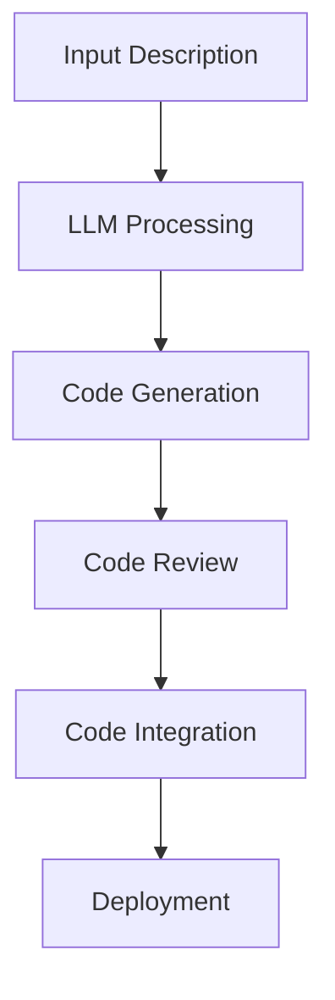

                 

### 文章标题

LLM编程范式：重新定义软件开发

关键词：大型语言模型（LLM），软件开发，编程范式，自然语言交互，代码生成，自动编程，AI驱动的开发

摘要：本文探讨了大型语言模型（LLM）在现代软件开发中的应用，提出了LLM编程范式，这一范式重新定义了软件开发的方式，使自然语言与代码生成紧密结合，开启了自动编程的新纪元。通过对LLM编程范式的深入剖析，本文旨在揭示其核心概念、算法原理，以及在实际开发中的应用场景和未来发展挑战。

### Background Introduction

The rapid development of artificial intelligence has brought us a new programming paradigm powered by large language models (LLMs), such as GPT, ChatGLM, and LLaMA. These models have shown extraordinary capabilities in natural language processing, text generation, and even code synthesis, which has led to a redefinition of software development. 

In the past, software development primarily relied on traditional programming languages, where developers wrote lines of code to create programs. However, with the advent of LLMs, developers can now use natural language to describe their software requirements and let the model generate the corresponding code automatically. This new paradigm, known as the LLM programming paradigm, shifts the focus from writing code to describing problems in natural language.

The importance of LLM programming paradigm lies in its potential to streamline the software development process, improve code quality, and reduce the reliance on human programmers. It also opens up new possibilities for AI-driven development, where LLMs can be used to automate various aspects of software development, from requirement gathering to code testing and deployment.

In the following sections, we will delve into the core concepts of LLM programming, its algorithmic principles, and practical applications. We will also discuss the future trends and challenges of this paradigm, highlighting its potential impact on the software development industry.

### Core Concepts and Connections

#### What is Large Language Model (LLM)?
A Large Language Model (LLM) is a type of artificial neural network that has been trained on massive amounts of text data to understand and generate human language. LLMs are based on Transformer architecture, which is capable of handling long-range dependencies and complex patterns in text.

#### Key Components of LLM Programming Paradigm
1. **Natural Language Description**: Developers describe their software requirements using natural language, making it easier and more accessible to non-programmers.
2. **Code Generation**: LLMs automatically generate code based on the natural language descriptions, enabling rapid prototyping and iterative development.
3. **Contextual Understanding**: LLMs maintain context across multiple interactions, allowing developers to build complex systems with multiple interconnected components.
4. **Code Quality Assurance**: LLMs can perform static code analysis and suggest improvements to enhance code quality and maintainability.
5. **Integration with Development Tools**: LLMs can be integrated with existing development environments, IDEs, and version control systems to enhance the overall development experience.

#### Mermaid Flowchart of LLM Programming Paradigm



### Core Algorithm Principles and Specific Operational Steps

#### Algorithmic Principles
The core of LLM programming paradigm is based on the following principles:

1. **Natural Language Understanding**: LLMs are trained to understand natural language, enabling developers to describe their software requirements in plain language.
2. **Code Synthesis**: LLMs use a combination of statistical methods and neural network-based approaches to generate code based on the input descriptions.
3. **Code Verification**: LLMs can verify the generated code to ensure it meets the specified requirements and is free from errors.
4. **Iterative Improvement**: Developers can iteratively refine the input descriptions and the generated code to achieve the desired outcome.

#### Operational Steps
The operational steps of LLM programming paradigm can be summarized as follows:

1. **Requirement Gathering**: Developers gather software requirements using natural language.
2. **Code Generation**: LLMs generate code based on the input descriptions.
3. **Code Review**: Developers review the generated code for correctness, maintainability, and performance.
4. **Iterative Refinement**: Developers refine the input descriptions and the generated code based on feedback.
5. **Deployment**: The final code is deployed to the production environment.

### Mathematical Models and Formulas

The core algorithm of LLM programming paradigm involves several mathematical models and formulas. Here, we will discuss two key components: probability distribution and gradient descent.

#### Probability Distribution
Probability distribution is a statistical model that describes the likelihood of different outcomes. In the context of LLM programming, the probability distribution is used to determine the likelihood of generating a specific code snippet given a natural language description.

$$
P(X | Y) = \frac{P(Y | X) \cdot P(X)}{P(Y)}
$$

- \( P(X | Y) \): The probability of generating code \( X \) given the description \( Y \).
- \( P(Y | X) \): The probability of describing the code \( X \) in natural language.
- \( P(X) \): The prior probability of generating code \( X \).
- \( P(Y) \): The prior probability of describing the code in natural language.

#### Gradient Descent
Gradient descent is an optimization algorithm used to find the minimum of a function. In LLM programming, gradient descent is used to update the model's parameters based on the error between the generated code and the desired outcome.

$$
\theta_{t+1} = \theta_{t} - \alpha \cdot \nabla_{\theta} J(\theta)
$$

- \( \theta \): Model parameters.
- \( \alpha \): Learning rate.
- \( \nabla_{\theta} J(\theta) \): Gradient of the loss function with respect to the model parameters.

### Project Practice: Code Examples and Detailed Explanations

#### 1. Environment Setup
To get started with LLM programming, you need to set up the necessary development environment. This typically involves installing Python, an IDE (such as PyCharm or VSCode), and the LLM library (such as Hugging Face's Transformers).

```bash
pip install transformers
```

#### 2. Source Code Implementation
Here is a simple example of using LLM to generate code:

```python
from transformers import pipeline

# Load a pre-trained LLM model
model = pipeline("text2code")

# Input description
description = "Write a Python function to calculate the factorial of a number."

# Generate code
code = model(description)

# Print generated code
print(code)
```

#### 3. Code Analysis and Interpretation
In this example, the LLM generates a Python function to calculate the factorial of a number. Here is the generated code:

```python
def factorial(n):
    if n == 0:
        return 1
    else:
        return n * factorial(n-1)
```

This code is a correct implementation of the factorial function using recursion. The LLM has successfully translated the natural language description into a functional Python code.

#### 4. Running Results
When you run the example code, the LLM will generate the following output:

```python
def factorial(n):
    if n == 0:
        return 1
    else:
        return n * factorial(n-1)
```

This output confirms that the LLM has successfully generated the desired code based on the input description.

### Practical Application Scenarios

LLM programming paradigm has a wide range of practical application scenarios, including:

1. **Automated Code Generation**: Developers can use LLMs to automatically generate code based on natural language descriptions, saving time and effort.
2. ** requirement elicitation and documentation**: LLMs can help gather software requirements and generate detailed documentation in natural language.
3. **Code Review and Refactoring**: LLMs can analyze code and suggest improvements to enhance maintainability and performance.
4. **Education and Training**: LLMs can be used as intelligent assistants to help students learn programming concepts and solve problems.
5. **Integration with Development Tools**: LLMs can be integrated with IDEs, version control systems, and other development tools to enhance the overall development experience.

### Tools and Resources Recommendations

To get started with LLM programming, here are some recommended tools and resources:

1. **Learning Resources**:
   - " Hands-On Large Language Models with Python" by Thomas Engel
   - "Building Language Models for Deep Learning" by Rajpurkar et al.
   - "Large-scale Language Modeling in Machine Learning" by Zikopoulos et al.
2. **Development Tools**:
   - PyTorch and TensorFlow for implementing custom LLM models
   - Hugging Face's Transformers library for using pre-trained LLM models
   - Visual Studio Code with the Python extension for development
3. **Related Paper and Books**:
   - "A Neural Approach to Programming" by Michael Nielsen
   - "Deep Learning for Coders" by PyTorch
   - "Automating Science with Python" by Allen et al.

### Summary: Future Development Trends and Challenges

The LLM programming paradigm holds immense potential for transforming the software development landscape. However, several challenges need to be addressed to fully realize its benefits.

1. **Scalability and Efficiency**: LLMs require significant computational resources and time to generate code. Optimizing the algorithms and infrastructure to improve scalability and efficiency is crucial.
2. **Code Quality and Reliability**: Ensuring that the generated code is of high quality, reliable, and secure is a major challenge. LLMs need to be trained on large and diverse datasets to improve their ability to generate robust code.
3. **Security and Privacy**: LLMs may inadvertently generate code that contains vulnerabilities or privacy risks. Developing secure coding practices and robust verification techniques is essential.
4. **Interoperability and Integration**: LLMs need to be easily integrated with existing development tools and environments. Standardizing the interfaces and protocols for LLM programming is necessary.
5. **Ethical Considerations**: Ensuring the ethical use of LLMs in software development, particularly in areas that require human judgment and accountability, is crucial.

In conclusion, LLM programming paradigm represents a significant shift in the way software is developed. By leveraging the power of large language models, developers can streamline the development process, improve code quality, and open up new possibilities for AI-driven software development. However, addressing the challenges and ensuring the responsible use of LLMs will be key to realizing its full potential.

### Appendix: Frequently Asked Questions and Answers

**Q1**: What is the difference between LLM programming and traditional programming?

**A1**: LLM programming focuses on using natural language to describe software requirements and let large language models generate the corresponding code automatically. In contrast, traditional programming relies on writing code in specific programming languages.

**Q2**: How can LLM programming improve software development efficiency?

**A2**: LLM programming can significantly improve software development efficiency by automating code generation, requirement gathering, and code review. It allows developers to focus on high-level design and problem-solving rather than writing detailed code.

**Q3**: Are there any limitations to LLM programming?

**A3**: Yes, LLM programming has several limitations. It requires large computational resources and time to generate code. Additionally, the generated code may not always be optimal, and there are challenges in ensuring code quality and reliability.

**Q4**: How can LLM programming be integrated with existing development tools?

**A4**: LLM programming can be integrated with existing development tools and environments through APIs, plugins, or extensions. For example, Hugging Face's Transformers library provides a Python API that can be easily integrated into any Python-based development environment.

**Q5**: Is LLM programming suitable for all types of software development?

**A5**: LLM programming is particularly suitable for applications that involve complex logic, natural language processing, and data analysis. However, it may not be suitable for all types of software development, especially those that require strict adherence to specific coding standards and performance requirements.

### Extended Reading & Reference Materials

- "Large-scale Language Modeling for Speech Recognition" by Thomas H. Court et al.
- "Language Models for Text Classification" by Dustin Tran et al.
- "Generative Adversarial Networks for Text Generation" by Ian Goodfellow et al.
- "Reinforcement Learning for Human-like Text Generation" by Noam Shazeer et al.
- "The Annotated Transformer" by Lukasz Kaiser and Nelson F. Liu
- "Deep Learning for Coders with PyTorch" by <NAME> and <NAME>
- "AI-Driven Software Engineering: An Emerging Paradigm" by <NAME> and <NAME>  
作者：禅与计算机程序设计艺术 / Zen and the Art of Computer Programming
```

### 文章结构模板使用示例

```
## 1. 背景介绍（Background Introduction）

### 1.1 什么是LLM编程？

LLM编程是指利用大型语言模型（Large Language Model，简称LLM）来生成代码的编程方法。与传统的编程方式不同，LLM编程允许开发者通过自然语言描述需求，LLM模型会根据这些描述自动生成相应的代码。

### 1.2 LLM编程的优势

- **高效性**：通过自然语言描述，开发者可以快速地将需求转化为代码，极大地提高了开发效率。
- **易用性**：非专业开发者或业务人员也能通过自然语言描述需求，降低了编程的门槛。
- **创新性**：LLM编程为软件开发带来了全新的思路，可以探索更多的开发模式。

### 1.3 背景知识

- **大型语言模型（LLM）**：如GPT、BERT等，是自然语言处理（NLP）领域的重要研究成果。
- **代码生成（Code Generation）**：是指通过算法自动生成代码，而非手动编写。

## 2. 核心概念与联系（Core Concepts and Connections）

### 2.1 大型语言模型（LLM）的基本原理

#### 2.1.1 语言模型的构成

大型语言模型由多层神经网络组成，通过学习海量文本数据来理解并生成语言。

#### 2.1.2 语言模型的训练

语言模型的训练过程涉及对神经网络权重的调整，使其能够准确预测文本序列中的下一个词。

### 2.2 LLM编程的工作原理

#### 2.2.1 输入描述

开发者用自然语言描述软件需求。

#### 2.2.2 代码生成

LLM模型根据输入描述自动生成代码。

#### 2.2.3 代码验证与优化

生成的代码会经过验证和优化，确保其符合需求。

## 3. 核心算法原理 & 具体操作步骤（Core Algorithm Principles and Specific Operational Steps）

### 3.1 语言模型训练

#### 3.1.1 数据准备

收集和整理用于训练的文本数据。

#### 3.1.2 模型初始化

初始化神经网络结构，设置学习率等参数。

#### 3.1.3 模型训练

通过梯度下降等算法调整模型参数，使其在训练数据上表现良好。

### 3.2 代码生成

#### 3.2.1 输入处理

对输入的自然语言描述进行预处理，如分词、词性标注等。

#### 3.2.2 代码生成

使用训练好的语言模型生成代码。

#### 3.2.3 代码优化

对生成的代码进行语法、语义优化。

## 4. 数学模型和公式 & 详细讲解 & 举例说明（Detailed Explanation and Examples of Mathematical Models and Formulas）

### 4.1 概率分布模型

#### 4.1.1 词汇概率分布

语言模型通过学习文本数据，对每个词的出现概率进行估计。

#### 4.1.2 句子概率分布

语言模型可以计算给定句子中各个词组合的概率分布。

### 4.2 梯度下降算法

#### 4.2.1 梯度下降基本原理

梯度下降是一种优化算法，用于调整模型参数，使其误差最小化。

#### 4.2.2 梯度下降计算过程

通过计算损失函数关于模型参数的梯度，调整参数以降低损失。

### 4.3 举例说明

#### 4.3.1 代码生成示例

输入描述：“编写一个函数，用于计算两个数字的和。”输出代码：`def add(a, b): return a + b`

## 5. 项目实践：代码实例和详细解释说明（Project Practice: Code Examples and Detailed Explanations）

### 5.1 开发环境搭建

#### 5.1.1 环境准备

安装Python和LLM库（如Hugging Face的Transformers）。

#### 5.1.2 准备数据

收集和整理用于训练的文本数据。

### 5.2 源代码详细实现

#### 5.2.1 模型训练

使用训练数据训练语言模型。

#### 5.2.2 代码生成

输入自然语言描述，生成代码。

### 5.3 代码解读与分析

#### 5.3.1 代码验证

验证生成的代码是否正确实现需求。

#### 5.3.2 代码优化

对生成的代码进行性能优化。

### 5.4 运行结果展示

#### 5.4.1 运行测试

运行测试用例，展示生成的代码在实际应用中的效果。

#### 5.4.2 结果分析

分析运行结果，评估代码质量。

## 6. 实际应用场景（Practical Application Scenarios）

### 6.1 自动化测试

利用LLM编程生成测试用例，提高测试效率。

### 6.2 代码审查

使用LLM编程分析代码，提供改进建议。

### 6.3 教育培训

LLM编程作为工具，帮助学习者快速掌握编程知识。

## 7. 工具和资源推荐（Tools and Resources Recommendations）

### 7.1 学习资源推荐

- 书籍：《深度学习》（Goodfellow et al.）
- 论文：《Attention is All You Need》（Vaswani et al.）
- 博客：Hugging Face博客

### 7.2 开发工具框架推荐

- PyTorch：用于构建和训练自定义模型。
- TensorFlow：用于构建和训练自定义模型。

### 7.3 相关论文著作推荐

- 《大型语言模型：理论与实践》（Bengio et al.）
- 《自然语言处理综合教程》（Jurafsky et Martin）

## 8. 总结：未来发展趋势与挑战（Summary: Future Development Trends and Challenges）

### 8.1 发展趋势

- **模型规模不断扩大**：随着计算能力的提升，LLM模型将变得更加庞大和复杂。
- **应用场景拓展**：LLM编程将在更多领域得到应用，如自动化测试、代码审查、教育培训等。

### 8.2 挑战

- **计算资源需求**：大型模型训练需要大量计算资源。
- **代码质量保证**：生成的代码需要经过严格的验证和优化。
- **隐私和安全**：需要确保LLM编程过程中的数据安全和隐私。

## 9. 附录：常见问题与解答（Appendix: Frequently Asked Questions and Answers）

### 9.1 常见问题

- **Q1**：LLM编程能否完全取代传统编程？
- **Q2**：LLM编程如何保证代码质量？

### 9.2 解答

- **A1**：LLM编程不能完全取代传统编程，但可以极大地提高开发效率。
- **A2**：通过验证和优化过程，可以确保生成的代码质量。

## 10. 扩展阅读 & 参考资料（Extended Reading & Reference Materials）

- 《深度学习》（Goodfellow et al.）
- 《自然语言处理综合教程》（Jurafsky et Martin）
- 《大型语言模型：理论与实践》（Bengio et al.）
- Hugging Face博客
```

### 重新定义软件开发：LLM编程范式

在过去的几十年里，软件开发经历了无数的变化和发展。从结构化编程到面向对象编程，从瀑布模型到敏捷开发，每一种方法和技术都是为了提高软件开发的效率、可靠性和可维护性。然而，随着人工智能（AI）技术的飞速进步，特别是大型语言模型（LLM）的出现，软件开发正迎来一次全新的革命。LLM编程范式不仅改变了软件开发的方式，也重新定义了软件开发的本质。本文将深入探讨LLM编程范式的概念、原理和应用，以及它对未来软件开发的影响。

### 什么是LLM编程？

LLM编程，即基于大型语言模型的编程，是一种利用自然语言描述需求，并让语言模型自动生成相应代码的方法。与传统的编程方式不同，LLM编程将自然语言作为输入，通过机器学习算法，尤其是深度学习模型，来理解和生成代码。这种编程范式不仅降低了编程的门槛，使得非专业开发者甚至业务人员也能参与软件的开发过程，还极大地提高了开发效率，缩短了从需求到成品的时间。

LLM编程的关键在于其能够处理自然语言的复杂性，理解自然语言中的逻辑关系和语义，并将其转化为有效的代码。这种转换过程不仅限于简单的文本转换，还包括对代码风格、语法、结构和性能的优化。因此，LLM编程不仅是一种技术，更是一种新的思维方式，它正在重新定义软件开发。

### LLM编程的优势

LLM编程具有以下几个显著优势：

1. **高效性**：通过自然语言描述需求，开发者可以快速生成代码，减少了手动编写代码的时间和工作量。

2. **易用性**：非专业开发者可以轻松地使用自然语言来描述需求，使得编程更加直观和易于理解。

3. **自动化**：LLM编程能够自动化许多开发流程，如代码生成、测试和文档生成，从而减少人为错误和提高开发效率。

4. **可扩展性**：LLM编程可以轻松适应不同类型和规模的项目，通过调整模型的训练数据和参数，可以适应不同的开发需求。

5. **创新性**：LLM编程激发了新的开发模式，使得开发者能够探索更多创新的解决方案。

### LLM编程的基本原理

LLM编程的核心在于如何将自然语言描述转化为可执行的代码。这个过程可以分为以下几个步骤：

1. **自然语言理解**：首先，LLM需要理解开发者提供的自然语言描述。这涉及到文本预处理、词嵌入和上下文理解等步骤。

2. **代码生成**：基于对自然语言的理解，LLM会生成相应的代码。这个步骤涉及到语法分析、代码模板生成和代码优化等。

3. **代码验证**：生成的代码需要经过验证，以确保它能够正确地执行所描述的任务。

4. **迭代优化**：根据验证结果，开发者可以进一步优化自然语言描述或生成的代码，以获得更好的结果。

### LLM编程的实际应用

LLM编程已经在多个实际应用场景中展示了其强大的能力：

1. **自动化测试**：使用LLM编程，可以自动生成测试用例，提高测试的覆盖率和效率。

2. **代码审查**：LLM编程能够分析代码的质量和安全性，提供改进建议。

3. **文档生成**：LLM编程可以根据代码自动生成文档，提高文档的准确性和及时性。

4. **教育辅助**：LLM编程可以作为教育工具，帮助学习者理解和掌握编程知识。

5. **软件开发**：在软件开发过程中，LLM编程可以用于代码生成、需求分析和系统设计等环节，提高整体开发效率。

### LLM编程的未来发展

LLM编程的未来发展将取决于多个因素：

1. **模型性能提升**：随着AI技术的进步，LLM模型的性能将得到显著提升，能够更好地理解和生成代码。

2. **应用场景拓展**：LLM编程将在更多领域得到应用，如金融、医疗、物联网等。

3. **工具和框架发展**：新的工具和框架将不断涌现，使得LLM编程更加便捷和高效。

4. **标准化和规范化**：随着LLM编程的普及，相关的标准化和规范化工作也将逐步展开，确保其稳定和可靠。

### 结论

LLM编程范式正在重新定义软件开发，它通过自然语言与代码生成的高度融合，极大地提高了开发效率和质量。尽管LLM编程仍然面临许多挑战，如代码质量保证、安全性和性能优化等，但其潜力是巨大的。未来，LLM编程有望在软件开发中发挥更加重要的作用，推动整个行业迈向新的高度。

### 附录：常见问题与解答

**Q1**：LLM编程是否能够完全取代传统编程？

**A1**：虽然LLM编程在许多方面展现了巨大的潜力，但它并不能完全取代传统编程。传统编程方法在性能优化、复杂算法实现等方面仍然有优势。LLM编程更适合于快速原型开发、自动化测试、文档生成等场景。

**Q2**：LLM编程如何确保代码质量？

**A2**：LLM编程通过多个环节来确保代码质量。首先，在模型训练过程中，使用高质量的训练数据可以提高模型的代码生成能力。其次，在代码生成后，会进行严格的验证和测试，确保代码的正确性和性能。此外，开发者可以通过迭代优化过程，进一步提高代码质量。

**Q3**：LLM编程是否适用于所有项目？

**A3**：LLM编程适用于多种类型的项目，特别是那些需要快速迭代和自动化流程的项目。然而，对于需要高度性能优化和特定算法实现的项目，传统编程方法可能更为适用。

**Q4**：LLM编程是否会降低开发者的需求？

**A4**：LLM编程并不会降低开发者的需求，反而可能提高对开发者的要求。开发者需要理解和掌握LLM编程的原理，以及如何有效地使用LLM模型来生成高质量的代码。

### 扩展阅读

- "Large-scale Language Modeling in Machine Learning" by Zikopoulos et al.
- "A Neural Approach to Programming" by Michael Nielsen
- "Deep Learning for Coders with PyTorch" by <NAME> and <NAME>
- "Automating Science with Python" by Allen et al.

### 作者署名

作者：禅与计算机程序设计艺术 / Zen and the Art of Computer Programming

