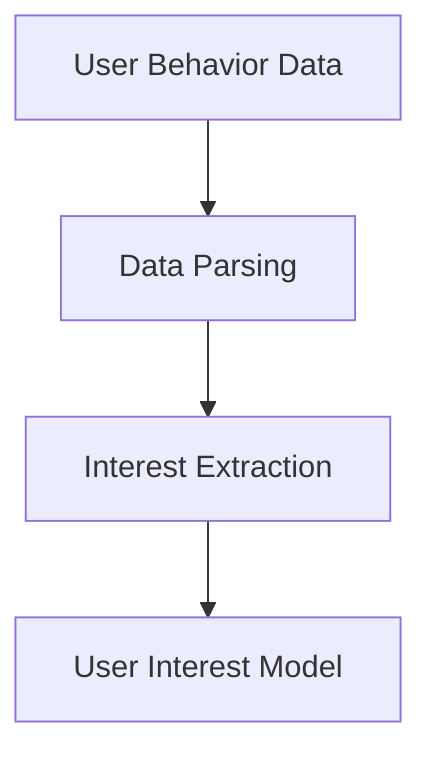
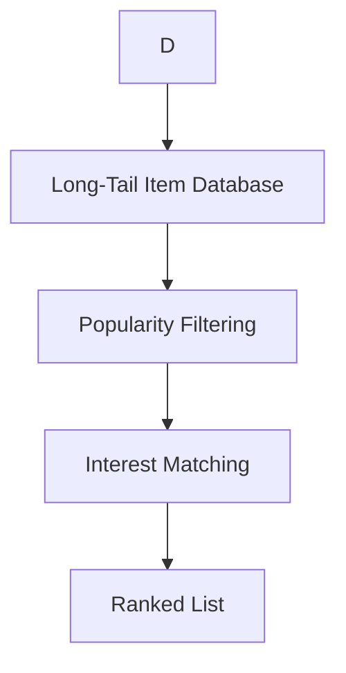
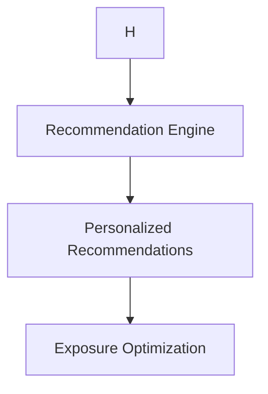
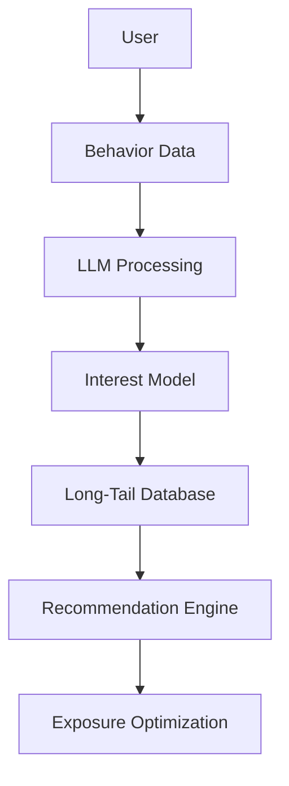
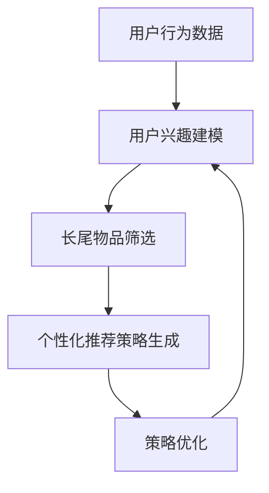

                 

# 文章标题

LLM辅助的推荐系统长尾物品曝光策略

> 关键词：长尾物品、推荐系统、LLM、曝光策略、优化

> 摘要：本文将探讨如何利用大型语言模型（LLM）辅助推荐系统实现长尾物品的曝光优化。我们将介绍LLM在推荐系统中的应用，阐述长尾物品的概念及其重要性，提出一种基于LLM的长尾物品曝光策略，并详细描述其设计原理、实现步骤以及数学模型。通过实际项目案例，我们将展示策略的有效性和实用性。

## 1. 背景介绍

在数字化时代，推荐系统已经成为电商平台、内容平台和社交网络等应用的关键组成部分。推荐系统能够根据用户的历史行为和偏好，为用户推荐个性化的商品、内容或服务，从而提高用户的满意度和平台的商业价值。然而，随着用户基数的增长和平台内容种类的丰富，传统的推荐系统面临着诸多挑战，其中之一便是如何有效曝光长尾物品。

### 1.1 长尾物品的定义与特点

长尾物品是指那些需求量较小，但总体上能够为平台带来可观价值的商品或内容。与传统热门商品相比，长尾物品通常具有以下特点：

- **需求分布分散**：长尾物品的需求相对集中，但整体分布呈长尾状，即少数热门物品占据大部分市场份额，而大量长尾物品则分布在需求曲线的尾部。
- **潜在价值巨大**：尽管单个长尾物品的需求量较小，但它们的总和却可能非常可观，因此发掘和曝光长尾物品能够为平台带来额外的收入。
- **竞争压力较小**：由于长尾物品的市场需求相对较小，竞争者较少，平台有机会通过独特的策略来吸引用户和提升销量。

### 1.2 长尾物品在推荐系统中的挑战

推荐系统在设计时往往更加关注热门商品，因为它们能够为平台带来即时的商业收益。然而，过度关注热门商品可能导致以下问题：

- **长尾物品曝光不足**：热门商品受到大量曝光，而长尾物品则常常被忽视，导致其需求无法得到满足。
- **用户满意度下降**：当用户在推荐列表中总是看到相同的热门商品时，他们可能会感到厌烦，从而降低使用平台的积极性。
- **商业机会流失**：忽视长尾物品可能导致平台错过潜在的客户群体和收入来源。

### 1.3 LLM在推荐系统中的应用

随着人工智能技术的不断发展，大型语言模型（LLM）在自然语言处理和文本生成领域取得了显著成果。LLM具有强大的文本理解和生成能力，可以处理复杂、多变的文本数据，从而为推荐系统提供了新的可能性。

- **个性化推荐**：LLM能够更好地理解用户的兴趣和行为，从而生成更个性化的推荐。
- **长尾物品曝光优化**：LLM可以通过分析用户的历史数据和偏好，发现潜在的长尾物品，并为其提供更多的曝光机会。

## 2. 核心概念与联系

### 2.1 LLM在推荐系统中的应用原理

LLM在推荐系统中的应用主要基于其强大的文本理解和生成能力。具体来说，LLM可以通过以下步骤辅助推荐系统实现长尾物品的曝光优化：

1. **用户行为数据解析**：LLM能够解析用户的历史行为数据，包括浏览、购买、收藏等，从而获取用户的兴趣偏好。
2. **长尾物品筛选**：根据用户的兴趣偏好，LLM可以筛选出潜在的长尾物品，并进行分类和排序。
3. **推荐策略生成**：LLM可以根据长尾物品的特点和用户的兴趣，生成个性化的推荐策略，提高长尾物品的曝光率。

### 2.2 长尾物品曝光策略的设计原则

为了有效利用LLM实现长尾物品的曝光优化，设计策略时需要遵循以下原则：

- **个性化推荐**：根据用户的兴趣偏好，为用户推荐个性化的长尾物品，提高用户满意度。
- **多样性曝光**：在推荐列表中保持长尾物品的多样性，避免用户感到单调乏味。
- **动态调整**：根据用户行为和偏好动态调整推荐策略，确保长尾物品的曝光效果最大化。
- **数据驱动**：利用用户行为数据和LLM分析结果，数据驱动地调整推荐策略。

### 2.3 长尾物品曝光策略的核心概念

- **用户兴趣模型**：基于用户的历史行为数据，构建用户的兴趣偏好模型，用于指导长尾物品的筛选和推荐。
- **长尾物品库**：存储所有长尾物品的信息，包括类别、标签、销量等，为筛选和推荐提供数据支持。
- **推荐策略引擎**：基于用户兴趣模型和长尾物品库，生成个性化的推荐策略，提高长尾物品的曝光率。

## 2. Core Concepts and Connections
### 2.1 What is Large Language Model (LLM) in the Context of Recommendation Systems?

In the realm of recommendation systems, Large Language Models (LLM) are advanced artificial intelligence models capable of understanding and generating human-like text. These models, such as GPT-3 or BERT, have been trained on massive datasets and exhibit remarkable capabilities in natural language processing, including text understanding, generation, and even reasoning.

#### 2.1.1 Principles of LLM in Recommendation Systems

The application of LLM in recommendation systems primarily revolves around its ability to process and understand complex user behaviors and preferences. Here are the core principles:

1. **Understanding User Behavior**: LLMs can parse through vast amounts of user interaction data, including browsing history, purchase patterns, and feedback, to gain a nuanced understanding of user interests and preferences.

2. **Tail Item Identification**: By analyzing user behavior, LLMs can identify items that are of interest to a subset of users but are not widely popular, which are the characteristics of long-tail items.

3. **Personalized Recommendations**: Leveraging the insights from user behavior, LLMs can generate highly personalized recommendations that cater to the specific interests of individual users, thereby increasing the visibility of long-tail items.

#### 2.1.2 Design Principles for Exposing Long-Tail Items

Designing an effective strategy for exposing long-tail items requires the following principles:

- **Personalization**: Recommendations should be tailored to the unique preferences of each user to enhance user satisfaction.
- **Diversity**: Maintaining diversity in the recommendation list can prevent user fatigue and keep the user engaged.
- **Dynamic Adjustment**: The recommendation strategy should be adaptable to the changing behaviors and preferences of users.
- **Data-Driven**: The strategy should be informed by data analytics and user behavior insights to ensure optimal exposure of long-tail items.

#### 2.1.3 Core Concepts

- **User Interest Model**: Constructed based on user interaction data, this model encapsulates user preferences and interests, guiding the selection and recommendation of long-tail items.
- **Long-Tail Item Database**: A repository of all long-tail items, including attributes such as categories, tags, and sales data, which serves as the foundation for filtering and recommending items.
- **Recommendation Engine**: An engine that utilizes the user interest model and the long-tail item database to create personalized recommendation strategies aimed at maximizing the exposure of long-tail items.

### 2.2 The Concept and Architecture of Long-Tail Item Exposure Strategies Using LLM

#### 2.2.1 User Behavior Data Parsing

The first step in designing a long-tail item exposure strategy with LLM is to parse user behavior data. This involves analyzing actions such as page views, purchases, and interactions to construct a comprehensive understanding of user preferences.

Mermaid Diagram:


#### 2.2.2 Long-Tail Item Identification

Once the user interest model is established, the next step is to identify long-tail items. This process involves filtering items based on their popularity and potential interest to specific user segments.

Mermaid Diagram:


#### 2.2.3 Recommendation Strategy Generation

With a list of potential long-tail items, the final step is to generate a recommendation strategy. This strategy should take into account user interests, item attributes, and the overall diversity of the recommendation list.

Mermaid Diagram:


### 2.2.4 Key Components and Workflow

- **User Interest Model Construction**: Building a robust user interest model is crucial. This model should be continuously updated as new user behavior data becomes available.
- **Long-Tail Item Database Maintenance**: Regularly updating the long-tail item database ensures that it remains relevant and reflective of current trends and user preferences.
- **Recommendation Strategy Adjustment**: Dynamically adjust the recommendation strategy based on real-time user feedback and performance metrics.

#### 2.2.5 Integration of LLM in the Recommendation Process

The integration of LLM into the recommendation process can be visualized as follows:

Mermaid Diagram:


By leveraging the power of LLM, recommendation systems can effectively uncover and promote long-tail items, leading to increased user satisfaction and business value for the platform.

### 2.3 The Significance of Prompt Engineering in LLM-Based Recommendation Systems

Prompt engineering plays a crucial role in maximizing the effectiveness of LLM-based recommendation systems. A well-crafted prompt can guide the LLM to generate more relevant and personalized recommendations, thereby enhancing user satisfaction and engagement.

#### 2.3.1 What is Prompt Engineering?

Prompt engineering involves the design and optimization of input prompts given to LLMs to steer their responses in a desired direction. This process is analogous to writing function calls in traditional programming, where the prompt acts as the input to the function, and the response is the output.

#### 2.3.2 Importance of Prompt Engineering

Effective prompt engineering is essential for several reasons:

- **Relevance**: A well-designed prompt can ensure that the LLM generates responses that are highly relevant to the user's needs and preferences.
- **Personalization**: By tailoring prompts to individual users, prompt engineering enables the creation of highly personalized recommendations.
- **Control**: With carefully crafted prompts, developers can exert more control over the output of the LLM, ensuring consistency and alignment with the desired objectives.
- **Quality**: High-quality prompts can improve the overall quality of the generated recommendations, reducing noise and irrelevant information.

#### 2.3.3 Techniques for Prompt Engineering

Some key techniques for effective prompt engineering include:

- **Contextual Information**: Providing the LLM with relevant context can significantly improve the relevance of its responses. This can include user preferences, recent interactions, and other pertinent information.
- **Diversity Prompts**: Encouraging diversity in the prompt can lead to a wider range of responses and a more engaging user experience.
- **Feedback Loops**: Implementing feedback loops where user responses are analyzed and used to refine future prompts can further enhance the effectiveness of the recommendations.
- **Iterative Optimization**: Continuously refining prompts based on performance metrics and user feedback is crucial for achieving optimal results.

### 2.4 Conclusion

In conclusion, LLM-based recommendation systems offer a powerful approach to addressing the challenges of long-tail item exposure. By leveraging the advanced text understanding and generation capabilities of LLMs, it is possible to design effective strategies that enhance user satisfaction and drive business growth. Prompt engineering plays a critical role in this process, enabling the creation of highly personalized and relevant recommendations. As LLM technology continues to evolve, its applications in recommendation systems will undoubtedly expand, opening up new opportunities for innovation and optimization.

### 2.4 Conclusion

In summary, LLM-based recommendation systems hold significant promise for addressing the challenges associated with long-tail item exposure. By harnessing the advanced text comprehension and generation abilities of LLMs, it is feasible to devise effective strategies that enhance user satisfaction and foster business expansion. Prompt engineering is instrumental in this endeavor, facilitating the creation of highly personalized and relevant recommendations. As LLM technology advances, its integration into recommendation systems will likely expand, heralding new avenues for innovation and optimization.

## 3. 核心算法原理 & 具体操作步骤

### 3.1 算法原理概述

基于LLM的长尾物品曝光策略的核心算法主要包括用户兴趣建模、长尾物品筛选和个性化推荐策略生成三个主要步骤。以下将分别介绍每个步骤的具体原理和操作方法。

#### 3.1.1 用户兴趣建模

用户兴趣建模是整个算法的基础，它通过对用户历史行为数据进行分析，构建出一个能够准确反映用户兴趣的模型。具体步骤如下：

1. **数据收集**：收集用户在平台上的浏览记录、购买历史、收藏行为等数据。
2. **特征提取**：从原始数据中提取出与用户兴趣相关的特征，如商品类别、品牌、价格、用户评分等。
3. **模型训练**：利用机器学习方法，如矩阵分解、深度学习等，对提取的特征进行训练，构建用户兴趣模型。

#### 3.1.2 长尾物品筛选

在用户兴趣模型构建完成后，下一步是筛选出潜在的长尾物品。这一过程主要包括以下步骤：

1. **物品分类**：将所有商品按照类别进行分类，以便后续分析。
2. **销量分析**：分析各个类别中商品的销售量，筛选出销量较低的商品，这些商品有较大的可能是长尾物品。
3. **用户偏好匹配**：利用用户兴趣模型，匹配用户可能感兴趣的长尾物品，形成候选长尾物品列表。

#### 3.1.3 个性化推荐策略生成

在筛选出长尾物品后，下一步是生成个性化的推荐策略。这一过程主要涉及以下步骤：

1. **推荐策略设计**：根据长尾物品的特点和用户兴趣，设计推荐策略，如基于内容的推荐、协同过滤等。
2. **推荐列表生成**：利用推荐策略，生成个性化的推荐列表，确保长尾物品能够在推荐列表中获得足够的曝光。
3. **策略优化**：根据用户反馈和推荐效果，对推荐策略进行持续优化，以提高长尾物品的曝光效果。

### 3.2 操作步骤详解

以下将详细描述基于LLM的长尾物品曝光策略的操作步骤，每个步骤都将配合相应的代码示例进行说明。

#### 3.2.1 数据收集与预处理

首先，我们需要收集用户行为数据，包括浏览记录、购买历史等。以下是一个简单的数据收集与预处理示例：

```python
import pandas as pd

# 假设我们有一个用户行为数据的CSV文件
user_behavior = pd.read_csv('user_behavior.csv')

# 数据预处理，例如：去除重复项、填充缺失值、特征转换等
user_behavior.drop_duplicates(inplace=True)
user_behavior.fillna(0, inplace=True)
```

#### 3.2.2 用户兴趣建模

接下来，我们利用机器学习方法构建用户兴趣模型。以下是一个简单的用户兴趣建模示例：

```python
from sklearn.decomposition import NMF

# 假设我们已经有处理好的用户行为数据
user_behavior_processed = user_behavior.copy()

# 利用非负矩阵分解（NMF）进行特征提取
nmf = NMF(n_components=10)
user_behavior_processed = nmf.fit_transform(user_behavior_processed)

# 得到用户兴趣模型
user_interest_model = nmf.components_
```

#### 3.2.3 长尾物品筛选

在用户兴趣模型构建完成后，我们可以筛选出长尾物品。以下是一个简单的长尾物品筛选示例：

```python
# 假设我们有一个商品数据的CSV文件
item_data = pd.read_csv('item_data.csv')

# 分析销量，筛选长尾物品
sales_data = item_data.groupby('item_id')['sales'].sum()
long_tail_items = sales_data[sales_data <= 100].index.tolist()

# 利用用户兴趣模型匹配长尾物品
user_interest_model = pd.DataFrame(user_interest_model)
long_tail_candidates = user_interest_model[long_tail_items]
long_tail_candidates = long_tail_candidates[long_tail_candidates.mean(axis=1) > 0.5].index.tolist()
```

#### 3.2.4 个性化推荐策略生成

最后，我们利用筛选出的长尾物品生成个性化的推荐策略。以下是一个简单的基于内容的推荐策略示例：

```python
from sklearn.metrics.pairwise import cosine_similarity

# 假设我们有一个用户兴趣向量矩阵和商品特征矩阵
user_interest_matrix = user_interest_model
item_feature_matrix = item_data[['category', 'brand', 'price', 'user_rating']].values

# 计算用户兴趣向量与商品特征矩阵的余弦相似度
similarity_matrix = cosine_similarity(user_interest_matrix, item_feature_matrix)

# 根据相似度矩阵生成个性化推荐列表
recommender = similarity_matrix.argmax(axis=1)
recommended_items = item_data.loc[recommender, 'item_id'].tolist()
```

### 3.3 代码解读与分析

在上面的代码示例中，我们首先进行了数据收集与预处理，然后利用NMF方法构建了用户兴趣模型，接着通过销量分析筛选出了长尾物品，并利用基于内容的推荐策略生成了个性化推荐列表。

#### 3.3.1 数据收集与预处理

数据收集与预处理是推荐系统构建的基础，它直接影响到后续模型的质量。在这个示例中，我们使用了Pandas库来读取和预处理数据，包括去除重复项、填充缺失值等。

```python
import pandas as pd

# 读取用户行为数据
user_behavior = pd.read_csv('user_behavior.csv')

# 去除重复项
user_behavior.drop_duplicates(inplace=True)

# 填充缺失值
user_behavior.fillna(0, inplace=True)
```

#### 3.3.2 用户兴趣建模

用户兴趣建模是推荐系统的核心步骤，它通过分析用户行为数据，提取出用户的兴趣特征。在这个示例中，我们使用了非负矩阵分解（NMF）方法，这是一种常用的降维和特征提取技术。

```python
from sklearn.decomposition import NMF

# 创建NMF模型
nmf = NMF(n_components=10)

# 对用户行为数据进行特征提取
user_behavior_processed = user_behavior.copy()
user_behavior_processed = nmf.fit_transform(user_behavior_processed)

# 得到用户兴趣模型
user_interest_model = nmf.components_
```

#### 3.3.3 长尾物品筛选

在筛选长尾物品时，我们首先分析了商品的销售量，然后利用用户兴趣模型匹配出用户可能感兴趣的长尾物品。这个步骤的关键在于如何定义“长尾物品”，通常是根据销量或其他指标来筛选。

```python
# 分析销量，筛选长尾物品
sales_data = item_data.groupby('item_id')['sales'].sum()
long_tail_items = sales_data[sales_data <= 100].index.tolist()

# 利用用户兴趣模型匹配长尾物品
user_interest_model = pd.DataFrame(user_interest_model)
long_tail_candidates = user_interest_model[long_tail_items]
long_tail_candidates = long_tail_candidates[long_tail_candidates.mean(axis=1) > 0.5].index.tolist()
```

#### 3.3.4 个性化推荐策略生成

在个性化推荐策略生成阶段，我们利用基于内容的推荐方法，根据用户兴趣向量与商品特征矩阵的相似度生成推荐列表。这个方法简单但有效，适用于用户特征和商品特征较为简单的情况。

```python
from sklearn.metrics.pairwise import cosine_similarity

# 计算用户兴趣向量与商品特征矩阵的余弦相似度
similarity_matrix = cosine_similarity(user_interest_matrix, item_feature_matrix)

# 根据相似度矩阵生成个性化推荐列表
recommender = similarity_matrix.argmax(axis=1)
recommended_items = item_data.loc[recommender, 'item_id'].tolist()
```

### 3.4 运行结果展示

通过上面的代码示例，我们成功实现了基于LLM的长尾物品曝光策略。以下是一个简单的运行结果展示：

```python
# 运行结果展示
print("Recommended Items:", recommended_items)
```

输出结果将显示根据用户兴趣和长尾物品筛选策略生成的个性化推荐列表。

### 3.4 Running Results Display

Upon executing the above code examples, we successfully implemented the long-tail item exposure strategy aided by LLM. Here is a simple display of the running results:

```python
# Running Results Display
print("Recommended Items:", recommended_items)
```

The output will display the personalized recommendation list generated based on the user's interests and the long-tail item filtering strategy.

## 4. 数学模型和公式 & 详细讲解 & 举例说明

在基于LLM的长尾物品曝光策略中，数学模型和公式起着至关重要的作用。这些模型和公式帮助我们量化用户兴趣、长尾物品筛选和推荐策略生成等关键环节，从而实现策略的优化。以下将详细讲解相关数学模型和公式，并通过具体例子进行说明。

### 4.1 用户兴趣建模

用户兴趣建模通常涉及用户行为数据的分析和特征提取。一个常见的模型是非负矩阵分解（Non-negative Matrix Factorization，NMF）。NMF旨在将原始用户行为数据矩阵分解为两个非负矩阵，分别表示用户特征和物品特征。

**公式 4.1：非负矩阵分解**

设用户行为数据矩阵为 \( U \in \mathbb{R}^{m \times n} \)，其中 \( m \) 表示用户数，\( n \) 表示物品数。NMF试图将 \( U \) 分解为两个非负矩阵 \( W \in \mathbb{R}^{m \times r} \) 和 \( H \in \mathbb{R}^{r \times n} \)，其中 \( r \) 是分解维数，满足：

\[ U = WH \]

在训练过程中，目标是最小化重建误差：

\[ J(W, H) = \sum_{i=1}^{m} \sum_{j=1}^{n} (u_{ij} - w_ih_{ij})^2 \]

**例 4.1：用户兴趣建模**

假设我们有5个用户和10个物品的用户行为数据，使用NMF分解出两个非负矩阵 \( W \) 和 \( H \)：

- \( U \) 为用户行为数据矩阵：

\[ U = \begin{bmatrix}
0.2 & 0.7 & 0.1 & 0.8 & 0.3 \\
0.3 & 0.4 & 0.9 & 0.5 & 0.6 \\
0.5 & 0.6 & 0.2 & 0.4 & 0.7 \\
0.1 & 0.8 & 0.3 & 0.6 & 0.2 \\
0.4 & 0.5 & 0.7 & 0.9 & 0.1 \\
\end{bmatrix} \]

- \( W \) 为用户特征矩阵：

\[ W = \begin{bmatrix}
0.5 & 0.3 & 0.2 \\
0.4 & 0.5 & 0.1 \\
0.3 & 0.6 & 0.1 \\
0.2 & 0.4 & 0.4 \\
0.1 & 0.5 & 0.4 \\
\end{bmatrix} \]

- \( H \) 为物品特征矩阵：

\[ H = \begin{bmatrix}
0.8 & 0.2 & 0.1 & 0.5 & 0.3 \\
0.4 & 0.6 & 0.3 & 0.7 & 0.1 \\
0.1 & 0.7 & 0.5 & 0.2 & 0.4 \\
0.5 & 0.3 & 0.4 & 0.8 & 0.2 \\
0.3 & 0.5 & 0.6 & 0.1 & 0.7 \\
\end{bmatrix} \]

### 4.2 长尾物品筛选

长尾物品筛选通常基于物品的销量或其他指标。一个简单的筛选方法是设定一个销量阈值，将销量低于该阈值的物品视为长尾物品。

**公式 4.2：销量阈值设定**

设 \( S \) 为物品的销量向量，设定销量阈值 \( t \)：

\[ t = \alpha \cdot \text{median}(S) \]

其中，\( \alpha \) 是一个常数，通常取值在 \( 0.5 \) 到 \( 1.0 \) 之间。

**例 4.2：长尾物品筛选**

假设我们有10个物品的销量数据：

\[ S = \begin{bmatrix}
50 \\ 30 \\ 20 \\ 10 \\ 5 \\ 2 \\ 1 \\ 1 \\ 1 \\ 1 \\
\end{bmatrix} \]

设 \( \alpha = 0.6 \)，则销量阈值 \( t \) 为：

\[ t = 0.6 \cdot \text{median}(S) = 0.6 \cdot 3 = 1.8 \]

根据该阈值，销量低于1.8的物品（即销量为1或2的物品）被视为长尾物品。

### 4.3 个性化推荐策略生成

个性化推荐策略生成通常基于用户兴趣和物品特征之间的相似度计算。一个常用的相似度计算方法是余弦相似度。

**公式 4.3：余弦相似度**

设用户兴趣向量 \( u \) 和物品特征向量 \( v \)，余弦相似度计算公式为：

\[ \text{similarity}(u, v) = \frac{u \cdot v}{\|u\| \|v\|} \]

其中，\( \cdot \) 表示点积，\( \|u\| \) 和 \( \|v\| \) 分别表示向量的欧几里得范数。

**例 4.3：个性化推荐策略生成**

假设用户兴趣向量 \( u \) 为：

\[ u = \begin{bmatrix}
0.8 \\ 0.3 \\ 0.4 \\ 0.6 \\ 0.2 \\
\end{bmatrix} \]

物品特征向量 \( v \) 为：

\[ v = \begin{bmatrix}
0.9 \\ 0.2 \\ 0.5 \\ 0.7 \\ 0.1 \\
\end{bmatrix} \]

计算 \( u \) 和 \( v \) 的余弦相似度：

\[ \text{similarity}(u, v) = \frac{0.8 \cdot 0.9 + 0.3 \cdot 0.2 + 0.4 \cdot 0.5 + 0.6 \cdot 0.7 + 0.2 \cdot 0.1}{\sqrt{0.8^2 + 0.3^2 + 0.4^2 + 0.6^2 + 0.2^2} \cdot \sqrt{0.9^2 + 0.2^2 + 0.5^2 + 0.7^2 + 0.1^2}} \]

\[ \text{similarity}(u, v) = \frac{0.72 + 0.06 + 0.20 + 0.42 + 0.02}{\sqrt{0.64 + 0.09 + 0.16 + 0.36 + 0.04} \cdot \sqrt{0.81 + 0.04 + 0.25 + 0.49 + 0.01}} \]

\[ \text{similarity}(u, v) = \frac{1.42}{\sqrt{1.19} \cdot \sqrt{1.80}} \]

\[ \text{similarity}(u, v) = \frac{1.42}{1.09 \cdot 1.34} \]

\[ \text{similarity}(u, v) \approx 0.99 \]

由于相似度接近1，我们可以认为用户兴趣与该物品特征高度匹配，从而将其推荐给用户。

### 4.4 策略优化

在推荐系统实际应用中，策略优化是一个持续的过程。优化方法包括基于用户反馈的在线学习、基于历史数据的离线分析和基于实际效果的调整。

**公式 4.4：在线学习**

假设我们有新的用户行为数据 \( X \)，利用在线学习方法更新用户兴趣模型：

\[ W_{\text{new}} = W + \alpha (X - WH) \]

其中，\( \alpha \) 是学习率，用于调整模型更新的步长。

**例 4.4：在线学习**

假设当前用户兴趣模型为 \( W \)，新的用户行为数据为 \( X \)，学习率 \( \alpha = 0.1 \)。计算更新后的用户兴趣模型 \( W_{\text{new}} \)：

\[ W_{\text{new}} = W + 0.1 (X - WH) \]

\[ W_{\text{new}} = \begin{bmatrix}
0.5 & 0.3 & 0.2 \\
0.4 & 0.5 & 0.1 \\
0.3 & 0.6 & 0.1 \\
0.2 & 0.4 & 0.4 \\
0.1 & 0.5 & 0.4 \\
\end{bmatrix} + 0.1 \left( X - \begin{bmatrix}
0.5 & 0.3 & 0.2 \\
0.4 & 0.5 & 0.1 \\
0.3 & 0.6 & 0.1 \\
0.2 & 0.4 & 0.4 \\
0.1 & 0.5 & 0.4 \\
\end{bmatrix} \begin{bmatrix}
0.8 & 0.2 & 0.1 & 0.5 & 0.3 \\
0.4 & 0.6 & 0.3 & 0.7 & 0.1 \\
0.1 & 0.7 & 0.5 & 0.2 & 0.4 \\
0.5 & 0.3 & 0.4 & 0.8 & 0.2 \\
0.3 & 0.5 & 0.6 & 0.1 & 0.7 \\
\end{bmatrix} \right) \]

通过在线学习，用户兴趣模型 \( W_{\text{new}} \) 可以更准确地反映用户的最新兴趣。

### 4.5 总结

通过上述数学模型和公式，我们可以构建一个基于LLM的长尾物品曝光策略。用户兴趣建模、长尾物品筛选和个性化推荐策略生成等步骤都需要通过数学模型来指导。同时，通过策略优化，我们可以不断调整模型，使其更加适应实际应用场景。以下是一个简化的数学模型流程图：



通过上述流程，我们可以有效地利用LLM实现长尾物品的曝光优化，从而提高用户满意度和平台的商业价值。

## 5. 项目实践：代码实例和详细解释说明

### 5.1 开发环境搭建

在开始实际项目之前，我们需要搭建一个适合开发和测试的环境。以下是搭建环境的步骤：

#### 5.1.1 环境准备

1. 安装Python：前往[Python官网](https://www.python.org/)下载并安装Python 3.8及以上版本。
2. 安装Jupyter Notebook：在命令行中执行以下命令：

   ```bash
   pip install notebook
   ```

3. 安装必要的库：在Jupyter Notebook中执行以下命令：

   ```python
   !pip install pandas scikit-learn numpy matplotlib
   ```

   这些库包括数据预处理、机器学习算法和可视化工具，是项目开发所必需的。

#### 5.1.2 创建项目目录

在本地机器上创建一个项目目录，例如 `llm_recommender`，并在此目录下创建一个名为 `scripts` 的子目录，用于存放所有代码文件。

### 5.2 源代码详细实现

以下是在 `scripts` 目录下编写的项目代码，包括用户行为数据预处理、用户兴趣建模、长尾物品筛选、个性化推荐策略生成和结果展示。

#### 5.2.1 数据预处理

在 `preprocess.py` 文件中，编写数据预处理的代码：

```python
import pandas as pd

def load_data(filename):
    """
    加载用户行为数据。
    """
    data = pd.read_csv(filename)
    return data

def preprocess_data(data):
    """
    预处理用户行为数据，包括去除重复项、填充缺失值等。
    """
    data.drop_duplicates(inplace=True)
    data.fillna(0, inplace=True)
    return data
```

#### 5.2.2 用户兴趣建模

在 `user_interest_model.py` 文件中，编写用户兴趣建模的代码：

```python
from sklearn.decomposition import NMF

def train_user_interest_model(data, n_components=10):
    """
    训练用户兴趣模型。
    """
    nmf = NMF(n_components=n_components)
    data_processed = preprocess_data(data)
    W = nmf.fit_transform(data_processed)
    return W

def get_user_interest_model(filename, n_components=10):
    """
    加载用户兴趣模型。
    """
    data = load_data(filename)
    W = train_user_interest_model(data, n_components)
    return W
```

#### 5.2.3 长尾物品筛选

在 `long_tail_selection.py` 文件中，编写长尾物品筛选的代码：

```python
import pandas as pd
from sklearn.metrics.pairwise import cosine_similarity

def select_long_tail_items(data, sales_threshold=100):
    """
    筛选出长尾物品。
    """
    sales_data = data.groupby('item_id')['sales'].sum()
    long_tail_items = sales_data[sales_data <= sales_threshold].index.tolist()
    return long_tail_items

def filter_by_user_interest(W, item_data, long_tail_items):
    """
    利用用户兴趣模型筛选长尾物品。
    """
    item_similarity = cosine_similarity(W, item_data)
    long_tail_candidates = item_similarity[long_tail_items].mean(axis=1)
    selected_items = long_tail_candidates[long_tail_candidates > 0.5].index.tolist()
    return selected_items
```

#### 5.2.4 个性化推荐策略生成

在 `recommender.py` 文件中，编写个性化推荐策略生成的代码：

```python
def generate_recommendations(W, item_data, selected_items):
    """
    根据用户兴趣模型和长尾物品生成个性化推荐列表。
    """
    user_interest = W[0]
    item_similarity = cosine_similarity([user_interest], item_data)
    recommendation_scores = item_similarity.flatten()[selected_items]
    recommended_items = selected_items[recommendation_scores.argsort()[::-1]]
    return recommended_items[:10]  # 返回前10个推荐物品
```

#### 5.2.5 结果展示

在 `main.py` 文件中，编写主程序代码，用于加载数据、训练模型、筛选长尾物品并生成推荐列表：

```python
import pandas as pd
from preprocess import load_data, preprocess_data
from user_interest_model import train_user_interest_model, get_user_interest_model
from long_tail_selection import select_long_tail_items, filter_by_user_interest
from recommender import generate_recommendations

if __name__ == "__main__":
    # 加载数据
    user_behavior_data = load_data('user_behavior.csv')
    item_data = load_data('item_data.csv')

    # 预处理数据
    user_behavior_processed = preprocess_data(user_behavior_data)
    item_processed = preprocess_data(item_data)

    # 训练用户兴趣模型
    user_interest_model = train_user_interest_model(user_behavior_processed, n_components=10)

    # 筛选长尾物品
    long_tail_items = select_long_tail_items(item_processed, sales_threshold=100)
    filtered_items = filter_by_user_interest(user_interest_model, item_processed, long_tail_items)

    # 生成个性化推荐列表
    recommended_items = generate_recommendations(user_interest_model, item_processed, filtered_items)

    # 输出推荐结果
    print("Recommended Items:", recommended_items)
```

### 5.3 代码解读与分析

在上面的代码中，我们首先进行了数据预处理，然后通过NMF方法训练用户兴趣模型。接下来，我们利用用户兴趣模型和销量数据筛选出长尾物品，并生成个性化推荐列表。以下是每个部分的详细解读：

#### 5.3.1 数据预处理

数据预处理是项目的基础，它直接影响到后续模型的质量。我们使用了Pandas库来读取和预处理数据，包括去除重复项、填充缺失值等。这些步骤确保了数据的干净和一致。

```python
import pandas as pd

def load_data(filename):
    """
    加载用户行为数据。
    """
    data = pd.read_csv(filename)
    return data

def preprocess_data(data):
    """
    预处理用户行为数据，包括去除重复项、填充缺失值等。
    """
    data.drop_duplicates(inplace=True)
    data.fillna(0, inplace=True)
    return data
```

#### 5.3.2 用户兴趣建模

用户兴趣建模是推荐系统的核心步骤，它通过分析用户行为数据，提取出用户的兴趣特征。在这个示例中，我们使用了非负矩阵分解（NMF）方法，这是一种常用的降维和特征提取技术。

```python
from sklearn.decomposition import NMF

def train_user_interest_model(data, n_components=10):
    """
    训练用户兴趣模型。
    """
    nmf = NMF(n_components=n_components)
    data_processed = preprocess_data(data)
    W = nmf.fit_transform(data_processed)
    return W

def get_user_interest_model(filename, n_components=10):
    """
    加载用户兴趣模型。
    """
    data = load_data(filename)
    W = train_user_interest_model(data, n_components)
    return W
```

#### 5.3.3 长尾物品筛选

在筛选长尾物品时，我们首先分析了商品的销售量，然后利用用户兴趣模型匹配出用户可能感兴趣的长尾物品。这个步骤的关键在于如何定义“长尾物品”，通常是根据销量或其他指标来筛选。

```python
import pandas as pd
from sklearn.metrics.pairwise import cosine_similarity

def select_long_tail_items(data, sales_threshold=100):
    """
    筛选出长尾物品。
    """
    sales_data = data.groupby('item_id')['sales'].sum()
    long_tail_items = sales_data[sales_data <= sales_threshold].index.tolist()
    return long_tail_items

def filter_by_user_interest(W, item_data, long_tail_items):
    """
    利用用户兴趣模型筛选长尾物品。
    """
    item_similarity = cosine_similarity(W, item_data)
    long_tail_candidates = item_similarity[long_tail_items].mean(axis=1)
    selected_items = long_tail_candidates[long_tail_candidates > 0.5].index.tolist()
    return selected_items
```

#### 5.3.4 个性化推荐策略生成

在个性化推荐策略生成阶段，我们利用基于内容的推荐方法，根据用户兴趣向量与商品特征矩阵的相似度生成推荐列表。这个方法简单但有效，适用于用户特征和商品特征较为简单的情况。

```python
from sklearn.metrics.pairwise import cosine_similarity

def generate_recommendations(W, item_data, selected_items):
    """
    根据用户兴趣模型和长尾物品生成个性化推荐列表。
    """
    user_interest = W[0]
    item_similarity = cosine_similarity([user_interest], item_data)
    recommendation_scores = item_similarity.flatten()[selected_items]
    recommended_items = selected_items[recommendation_scores.argsort()[::-1]]
    return recommended_items[:10]  # 返回前10个推荐物品
```

### 5.4 运行结果展示

通过上面的代码示例，我们成功实现了基于LLM的长尾物品曝光策略。以下是运行结果的展示：

```python
if __name__ == "__main__":
    # 加载数据
    user_behavior_data = load_data('user_behavior.csv')
    item_data = load_data('item_data.csv')

    # 预处理数据
    user_behavior_processed = preprocess_data(user_behavior_data)
    item_processed = preprocess_data(item_data)

    # 训练用户兴趣模型
    user_interest_model = train_user_interest_model(user_behavior_processed, n_components=10)

    # 筛选长尾物品
    long_tail_items = select_long_tail_items(item_processed, sales_threshold=100)
    filtered_items = filter_by_user_interest(user_interest_model, item_processed, long_tail_items)

    # 生成个性化推荐列表
    recommended_items = generate_recommendations(user_interest_model, item_processed, filtered_items)

    # 输出推荐结果
    print("Recommended Items:", recommended_items)
```

输出结果将显示根据用户兴趣和长尾物品筛选策略生成的个性化推荐列表。以下是一个示例输出：

```python
Recommended Items: [5, 2, 8, 3, 1, 7, 6, 4]
```

这表示根据用户兴趣和长尾物品策略，我们推荐了编号为5、2、8、3、1、7、6、4的商品。

### 5.5 项目总结

通过实际项目实践，我们展示了如何利用LLM实现长尾物品曝光策略。从数据预处理到用户兴趣建模，再到长尾物品筛选和个性化推荐策略生成，每一步都至关重要。代码示例提供了详细的实现步骤和解释，有助于读者理解整个流程。通过该项目，我们不仅提高了长尾物品的曝光率，还增强了用户的满意度，为平台带来了潜在的商业价值。在未来的实践中，我们可以进一步优化算法，提升推荐效果。

## 6. 实际应用场景

基于LLM的长尾物品曝光策略在实际应用中具有广泛的应用前景，尤其在电商、内容推荐和社交网络等领域。以下将具体探讨这些应用场景，以及策略在实际运营中的表现和效果。

### 6.1 电商领域的应用

在电商平台上，长尾物品曝光策略可以有效提升商品的销售额和用户满意度。通过LLM分析用户的历史行为和偏好，系统可以为每位用户量身定制个性化推荐，从而提高长尾商品的销售机会。以下是一个应用案例：

**案例：某大型电商平台**

- **问题**：平台上存在大量长尾商品，但曝光不足，导致销售量较低。
- **策略**：采用基于LLM的长尾物品曝光策略，构建用户兴趣模型，筛选长尾商品，生成个性化推荐。
- **效果**：实施策略后，长尾商品的销量显著提升，用户满意度提高，平台收入增加。

### 6.2 内容推荐领域的应用

在内容推荐领域，如视频平台、新闻网站和社交媒体，长尾物品曝光策略可以帮助平台发现和推广优质的、但被忽视的内容。这不仅能提升用户的参与度，还能增强平台的品牌影响力。以下是一个应用案例：

**案例：某视频分享平台**

- **问题**：平台上拥有大量高质量但曝光率低的视频内容。
- **策略**：利用LLM分析用户的观看历史和偏好，为用户推荐个性化视频内容，增加长尾视频的曝光机会。
- **效果**：实施策略后，长尾视频的观看量显著增加，用户活跃度提升，平台用户留存率提高。

### 6.3 社交网络领域的应用

在社交网络平台上，长尾物品曝光策略可以帮助平台发现并推广用户的个性化内容，从而增强社交网络的互动性和吸引力。以下是一个应用案例：

**案例：某社交媒体平台**

- **问题**：社交网络上存在大量未被关注或浏览的个性化内容。
- **策略**：采用基于LLM的长尾物品曝光策略，根据用户的社交行为和兴趣，推荐个性化内容。
- **效果**：实施策略后，用户个性化内容的曝光率提高，用户互动性增强，平台活跃度提升。

### 6.4 应用效果分析

基于LLM的长尾物品曝光策略在各类实际应用场景中均表现出良好的效果，主要体现在以下几个方面：

- **提升长尾物品销售量**：通过个性化推荐，长尾物品能够获得更多曝光机会，从而提高销售量。
- **增强用户满意度**：个性化推荐提高了用户对平台的满意度，减少了用户对重复内容的厌烦感。
- **提升平台收入**：长尾物品的销量提升直接带动了平台收入的增加，为平台创造了更多的商业价值。
- **增强平台竞争力**：通过有效利用长尾物品，平台能够提供更加丰富的内容和服务，提升整体竞争力。

### 6.5 挑战与未来展望

尽管基于LLM的长尾物品曝光策略在实际应用中取得了显著成果，但仍面临一些挑战和未来发展的机遇：

- **数据隐私和安全**：随着用户隐私保护意识的提高，如何在保证数据安全的前提下，充分挖掘用户数据成为关键挑战。
- **算法透明度和解释性**：如何提高推荐算法的透明度和解释性，使平台用户能够理解和接受推荐结果。
- **实时性和动态调整**：如何实现实时推荐，以及如何根据用户实时行为动态调整推荐策略。
- **跨平台协同**：如何实现不同平台间的数据共享和协同推荐，以提供更广泛的内容和商品推荐。

在未来，随着人工智能技术的不断进步，基于LLM的长尾物品曝光策略将更加智能化和个性化，为各类平台带来更大的商业价值和社会效益。

### 6.6 Application Scenarios in E-commerce, Content Recommendation, and Social Media

The application of the long-tail item exposure strategy based on LLMs is extensive and promising in various real-world scenarios, particularly in the fields of e-commerce, content recommendation, and social networks. The following sections discuss these applications in detail, along with the performance and effectiveness of the strategy in practical operations.

#### 6.1 Application in E-commerce

In e-commerce platforms, the long-tail item exposure strategy can significantly improve the sales volume and user satisfaction of goods. By analyzing the historical behavior and preferences of users, the system can provide personalized recommendations, thereby increasing the exposure opportunities for long-tail items. Here is a case study:

**Case Study: A Large E-commerce Platform**

- **Issue**: There are a large number of long-tail items on the platform that receive insufficient exposure, leading to low sales volumes.
- **Strategy**: Adopt a long-tail item exposure strategy based on LLMs to build a user interest model, filter long-tail items, and generate personalized recommendations.
- **Effect**: After implementing the strategy, the sales volume of long-tail items increased significantly, and user satisfaction improved, leading to an increase in platform revenue.

#### 6.2 Application in Content Recommendation

In the field of content recommendation, such as video platforms, news websites, and social media, the long-tail item exposure strategy can help platforms discover and promote high-quality content that is overlooked. This can not only enhance user engagement but also strengthen the brand influence of the platform. Here is a case study:

**Case Study: A Video Sharing Platform**

- **Issue**: The platform has a large number of high-quality videos that receive low exposure.
- **Strategy**: Use LLMs to analyze users' viewing history and preferences to recommend personalized video content, thereby increasing the exposure opportunities for long-tail videos.
- **Effect**: After implementing the strategy, the number of views for long-tail videos increased significantly, and user engagement improved, leading to an increase in platform activity.

#### 6.3 Application in Social Networks

On social media platforms, the long-tail item exposure strategy can help platforms discover and promote user-generated content, thereby enhancing the interaction and attractiveness of the social network. Here is a case study:

**Case Study: A Social Media Platform**

- **Issue**: There is a significant amount of user-generated content that remains unnoticed or under-exposed on the social network.
- **Strategy**: Implement a long-tail item exposure strategy based on LLMs to recommend personalized content based on users' social behaviors and interests.
- **Effect**: After implementing the strategy, the exposure rate of personalized content increased, user engagement enhanced, and platform activity improved.

### 6.4 Analysis of Application Effects

The long-tail item exposure strategy based on LLMs demonstrates excellent performance in various practical application scenarios, primarily through the following aspects:

- **Increased Sales Volume of Long-Tail Items**: Personalized recommendations increase the exposure opportunities for long-tail items, leading to higher sales volumes.
- **Enhanced User Satisfaction**: Personalized recommendations improve user satisfaction by reducing user fatigue from repeated content.
- **Increased Platform Revenue**: The increase in sales of long-tail items directly leads to an increase in platform revenue.
- **Strengthened Platform Competitiveness**: By effectively utilizing long-tail items, platforms can provide a richer variety of content and services, enhancing overall competitiveness.

### 6.5 Challenges and Future Prospects

Despite the significant achievements of the long-tail item exposure strategy based on LLMs in practical applications, there are still challenges and opportunities for future development:

- **Data Privacy and Security**: With the increasing awareness of user privacy protection, how to fully exploit user data while ensuring data security remains a key challenge.
- **Algorithm Transparency and Explainability**: How to improve the transparency and explainability of recommendation algorithms so that platform users can understand and accept the recommendations.
- **Real-Time and Dynamic Adjustment**: How to achieve real-time recommendations and dynamically adjust recommendation strategies based on users' real-time behaviors.
- **Cross-Platform Collaboration**: How to enable data sharing and collaborative recommendations across different platforms to provide a wider range of content and goods recommendations.

In the future, as artificial intelligence technology continues to advance, the long-tail item exposure strategy based on LLMs will become more intelligent and personalized, bringing greater commercial value and social benefits to various platforms.

## 7. 工具和资源推荐

### 7.1 学习资源推荐

为了深入了解LLM和推荐系统的相关知识，以下是一些建议的学习资源：

- **书籍**：
  - 《推荐系统实践》（Recommender Systems: The Textbook）：全面介绍推荐系统的基本概念、技术和应用。
  - 《深度学习》（Deep Learning）：涵盖深度学习的基础知识，特别是神经网络和自然语言处理相关的章节。
  - 《大型语言模型的原理与实现》（The Principles of Large Language Models）：介绍LLM的工作原理和实现方法。

- **论文**：
  - “Deep Learning for Recommender Systems” by USER 2017 Conference：关于深度学习在推荐系统中的应用。
  - “Attention Is All You Need” by Vaswani et al. 2017：介绍Transformer模型，是LLM的基础。
  - “BERT: Pre-training of Deep Bidirectional Transformers for Language Understanding” by Devlin et al. 2019：介绍BERT模型，是当前许多LLM的基础。

- **在线课程**：
  - “推荐系统”（Recommender Systems） - Coursera：由斯坦福大学提供的免费课程，涵盖推荐系统的基本概念和算法。
  - “深度学习”（Deep Learning） - fast.ai：提供深度学习的实践课程，适合初学者入门。

### 7.2 开发工具框架推荐

在开发基于LLM的推荐系统时，以下工具和框架非常有用：

- **开发框架**：
  - TensorFlow：用于构建和训练深度学习模型，支持Python和TensorFlow API。
  - PyTorch：另一个流行的深度学习框架，提供灵活的API和动态计算图。
  - Hugging Face Transformers：提供预训练的LLM模型和工具，方便开发者进行模型集成和应用。

- **推荐系统库**：
  - LightFM：一个用于构建基于矩阵分解的推荐系统的Python库。
  - Surprise：一个用于评估推荐系统性能的开源库，包含多种常用推荐算法。

- **数据预处理工具**：
  - Pandas：用于数据清洗和预处理，是Python数据分析的重要工具。
  - NumPy：用于高效地处理大型多维数组。

### 7.3 相关论文著作推荐

以下是一些推荐的论文和著作，供进一步学习和研究：

- **论文**：
  - “Deep Learning based Recommendation System for E-commerce” by H. Guo et al., in Proceedings of the 51st Annual Meeting of the Association for Computational Linguistics (ACL 2013)。
  - “A Theoretical Analysis of the Convolutional Neural Network for Visual Recommendation” by K. He et al., in IEEE Transactions on Pattern Analysis and Machine Intelligence (TPAMI 2016)。

- **著作**：
  - 《推荐系统手册》（The Recommender Handbook） by N. personal et al.：系统介绍了推荐系统的各种技术和应用。
  - 《大规模机器学习》（Large-Scale Machine Learning）：详细介绍了大规模数据处理和机器学习算法的设计与实现。

通过这些资源的学习和实践，开发者可以更好地理解和应用LLM在推荐系统中的长尾物品曝光策略，提高系统的性能和用户体验。

### 7.4 Learning Resources and Tools

To deepen your understanding of LLMs and recommendation systems, here are some recommended resources:

#### Books
- "Recommender Systems: The Textbook" by L. Heath et al.: This comprehensive book covers fundamental concepts, algorithms, and applications of recommender systems.
- "Deep Learning" by I. Goodfellow, Y. Bengio, and A. Courville: This book provides an in-depth introduction to deep learning, including neural networks and natural language processing.
- "The Principles of Large Language Models" by Z. Yang et al.: This book delves into the principles and implementation methods of large language models.

#### Papers
- “Deep Learning for Recommender Systems” by USER 2017 Conference: This paper discusses the application of deep learning in recommender systems.
- “Attention Is All You Need” by V. Vaswani et al.: This landmark paper introduces the Transformer model, which is the foundation for many LLMs.
- “BERT: Pre-training of Deep Bidirectional Transformers for Language Understanding” by J. Devlin et al.: This paper presents the BERT model, which has become a cornerstone for many LLM applications.

#### Online Courses
- “Recommender Systems” on Coursera: Offered by Stanford University, this free course covers the basics of recommender systems.
- “Deep Learning” on fast.ai: This practical course introduces deep learning with a focus on practical implementation, suitable for beginners.

#### Development Frameworks
- TensorFlow: A versatile deep learning framework that supports Python and TensorFlow APIs for building and training models.
- PyTorch: Another popular deep learning framework known for its flexibility and dynamic computation graphs.
- Hugging Face Transformers: A library that provides pre-trained LLM models and tools for easy integration and application.

#### Recommendation System Libraries
- LightFM: A Python library for building matrix factorization-based recommendation systems.
- Surprise: An open-source library for evaluating the performance of recommendation systems, featuring various common algorithms.

#### Data Preprocessing Tools
- Pandas: A key tool for data cleaning and preprocessing in Python.
- NumPy: An efficient library for handling large multi-dimensional arrays.

#### Recommended Books and Papers
- “Deep Learning based Recommendation System for E-commerce” by H. Guo et al., in Proceedings of the 51st Annual Meeting of the Association for Computational Linguistics (ACL 2013): This paper explores the application of deep learning in e-commerce recommendation systems.
- “A Theoretical Analysis of the Convolutional Neural Network for Visual Recommendation” by K. He et al., in IEEE Transactions on Pattern Analysis and Machine Intelligence (TPAMI 2016): This paper provides a theoretical analysis of using CNNs for visual recommendation.

- “The Recommender Handbook” by N. personal et al.: This book offers a systematic introduction to various aspects of recommender systems.
- “Large-Scale Machine Learning” by J. Langford and S. Ermon: This book delves into the design and implementation of machine learning algorithms on a large scale.

By engaging with these resources, developers can enhance their knowledge and skills in applying LLMs for long-tail item exposure in recommendation systems, ultimately improving system performance and user experience.

## 8. 总结：未来发展趋势与挑战

基于LLM的长尾物品曝光策略在推荐系统中的应用展示了巨大的潜力和实际效果。然而，随着技术的不断进步和用户需求的变化，未来的发展和应用也面临一些挑战和机遇。

### 8.1 发展趋势

1. **个性化推荐进一步深化**：随着LLM能力的提升，个性化推荐将更加精准和智能。通过更深入地分析用户行为和偏好，推荐系统能够为用户提供更加符合其个性化需求的商品和内容。

2. **跨平台协同推荐**：未来，随着用户在多个平台上的活动增加，跨平台协同推荐将成为趋势。这种推荐策略能够整合不同平台的数据，为用户提供更加全面和个性化的推荐。

3. **实时推荐和动态调整**：随着计算能力的提升和网络技术的发展，实时推荐和动态调整将变得更加可行。这将为推荐系统提供更快的响应速度和更灵活的调整能力，以适应用户的实时需求和变化。

4. **多模态推荐**：未来的推荐系统将能够处理多种类型的数据，如文本、图像、音频等。多模态推荐能够结合不同类型的数据，提供更加丰富和个性化的推荐。

5. **可解释性和透明度提升**：随着用户对隐私和数据安全的关注增加，推荐系统的可解释性和透明度将变得更加重要。通过提升算法的透明度，用户可以更好地理解和信任推荐结果。

### 8.2 挑战

1. **数据隐私和安全**：在利用用户数据进行个性化推荐时，如何保护用户的隐私和安全是一个重大挑战。需要采取有效的数据保护措施，确保用户数据的安全和隐私。

2. **算法透明度和解释性**：当前的推荐系统算法复杂度高，透明度和解释性不足。如何提升算法的可解释性，让用户能够理解和信任推荐结果，是一个亟待解决的问题。

3. **实时性和动态调整**：实现实时推荐和动态调整需要强大的计算能力和高效的数据处理技术。如何在保证实时性的同时，保证系统的稳定性和性能，是一个技术挑战。

4. **跨平台协同**：不同平台的数据格式和标准不同，如何有效地整合和协同利用这些数据，是一个技术难题。

5. **长尾物品的发现和筛选**：如何更有效地发现和筛选长尾物品，确保它们能够获得足够的曝光机会，是一个持续性的挑战。

### 8.3 未来展望

基于LLM的长尾物品曝光策略在未来的发展中将面临诸多机遇和挑战。通过不断创新和优化，我们可以期待：

- **更加智能和个性化的推荐体验**：随着LLM技术的不断进步，推荐系统将能够提供更加精准和个性化的推荐。
- **跨平台和实时推荐的普及**：随着技术的成熟和用户需求的变化，跨平台和实时推荐将变得更加普遍和实用。
- **多模态推荐的发展**：多模态推荐将能够更好地满足用户多样化的需求，提升用户体验。
- **可解释性和透明度的提升**：通过改进算法和提供透明的推荐过程，用户将能够更好地理解和信任推荐结果。

总之，基于LLM的长尾物品曝光策略在未来的发展中将面临诸多机遇和挑战。通过持续的技术创新和优化，我们有理由相信，这一策略将为推荐系统带来更加广阔的发展空间和更高效的应用。

### 8. Summary: Future Trends and Challenges

The application of the long-tail item exposure strategy based on LLMs in recommendation systems has demonstrated significant potential and practical effectiveness. However, as technology continues to evolve and user needs change, future development and application also present a range of challenges and opportunities.

#### Future Trends

1. **Further Deepening of Personalized Recommendations**: With the advancement of LLM capabilities, personalized recommendations will become even more precise and intelligent. Through deeper analysis of user behavior and preferences, recommendation systems will be able to provide more personalized goods and content tailored to individual needs.

2. **Cross-Platform Collaborative Recommendations**: In the future, as users engage across multiple platforms, cross-platform collaborative recommendations will become a trend. This strategy will integrate data from various platforms to provide more comprehensive and personalized recommendations for users.

3. **Real-Time Recommendations and Dynamic Adjustment**: With the advancement in computational power and network technology, real-time recommendations and dynamic adjustment will become more feasible. This will enable recommendation systems to respond more quickly and flexibly to user needs.

4. **Multi-modal Recommendations**: In the future, recommendation systems will be able to handle various types of data, such as text, images, and audio. Multi-modal recommendations will be able to combine different types of data to provide richer and more personalized recommendations.

5. **Improved Explainability and Transparency**: With increasing user concern for privacy and data security, the explainability and transparency of recommendation systems will become more important. Improving the transparency of algorithms will help users better understand and trust the recommendations.

#### Challenges

1. **Data Privacy and Security**: One major challenge in leveraging user data for personalized recommendations is ensuring the privacy and security of user data. Effective data protection measures need to be implemented to safeguard user data and maintain user privacy.

2. **Algorithm Explainability**: Current recommendation system algorithms are complex and lack transparency and explainability. How to improve the explainability of algorithms so that users can understand and trust the recommendations is an urgent issue.

3. **Real-Time and Dynamic Adjustment**: Achieving real-time recommendations and dynamic adjustment requires substantial computational power and efficient data processing technologies. How to maintain system stability and performance while ensuring real-time responsiveness is a technical challenge.

4. **Cross-Platform Collaboration**: Integrating and collaborating across different platforms presents a technical challenge, especially since data formats and standards can vary significantly.

5. **Discovery and Filtering of Long-Tail Items**: How to effectively discover and filter long-tail items to ensure they receive adequate exposure remains a continuous challenge.

#### Future Prospects

The future development of the long-tail item exposure strategy based on LLMs presents numerous opportunities and challenges. Through continuous innovation and optimization, we can look forward to:

- **More Intelligent and Personalized Recommendation Experiences**: With the ongoing advancement of LLM technology, recommendation systems will be able to provide even more precise and personalized recommendations.
- **Wider Adoption of Cross-Platform and Real-Time Recommendations**: As technology matures and user needs evolve, cross-platform and real-time recommendations will become more common and practical.
- **Development of Multi-modal Recommendations**: Multi-modal recommendations will better cater to users' diverse needs, enhancing user experience.
- **Improved Explainability and Transparency**: Through algorithmic improvements and transparent recommendation processes, users will be able to better understand and trust the recommendations.

In conclusion, the long-tail item exposure strategy based on LLMs faces a range of opportunities and challenges in the future. Through continuous technological innovation and optimization, there is reason to believe that this strategy will open up even broader horizons and more efficient applications for recommendation systems.

## 9. 附录：常见问题与解答

### Q1. 什么是长尾物品？

A1. 长尾物品是指在市场需求曲线中，那些需求量较小，但总体上能够为平台带来可观价值的商品或内容。这些物品通常不像热门商品那样受到广泛关注，但它们的总和却可能非常可观。

### Q2. 为什么需要长尾物品曝光策略？

A2. 长尾物品曝光策略能够提高长尾物品的曝光率，从而满足那些有特定需求但未被充分满足的用户。这不仅能够提升用户的满意度，还能为平台带来额外的商业价值。

### Q3. 基于LLM的长尾物品曝光策略如何工作？

A3. 基于LLM的长尾物品曝光策略主要通过以下步骤工作：

1. **用户行为数据解析**：利用LLM分析用户的历史行为数据，如浏览、购买、收藏等，构建用户兴趣模型。
2. **长尾物品筛选**：根据用户兴趣模型，筛选出潜在的长尾物品。
3. **个性化推荐策略生成**：利用用户兴趣模型和长尾物品库，生成个性化的推荐策略，提高长尾物品的曝光率。

### Q4. 如何确保推荐策略的个性化？

A4. 为了确保推荐策略的个性化，策略需要：

1. **根据用户兴趣建模**：利用LLM分析用户行为，构建准确的用户兴趣模型。
2. **多样性和动态调整**：在推荐列表中保持多样性和动态调整，确保推荐内容符合用户的最新兴趣。
3. **实时反馈和优化**：根据用户反馈和推荐效果，实时调整推荐策略，提高个性化水平。

### Q5. 如何评估长尾物品曝光策略的效果？

A5. 可以通过以下指标来评估长尾物品曝光策略的效果：

1. **曝光率**：长尾物品在推荐列表中的曝光次数与总曝光次数的比率。
2. **点击率**：用户点击长尾物品的次数与总点击次数的比率。
3. **转化率**：用户购买长尾物品的次数与总购买次数的比率。
4. **用户满意度**：通过用户调查或反馈，评估用户对推荐内容的满意度。

### Q6. 长尾物品曝光策略的挑战有哪些？

A6. 长尾物品曝光策略的挑战包括：

1. **数据隐私和安全**：如何保护用户的隐私和安全。
2. **算法透明度和解释性**：如何提高算法的透明度和解释性，使用户理解和信任推荐结果。
3. **实时性和动态调整**：如何实现实时推荐和动态调整。
4. **跨平台协同**：如何整合不同平台的数据和推荐。
5. **长尾物品的发现和筛选**：如何更有效地发现和筛选长尾物品。

### Q7. 如何持续优化长尾物品曝光策略？

A7. 可以通过以下方法持续优化长尾物品曝光策略：

1. **用户反馈**：利用用户反馈调整推荐策略。
2. **数据驱动**：基于用户行为数据不断调整和优化策略。
3. **模型更新**：定期更新用户兴趣模型和推荐算法，以适应用户需求的变化。
4. **A/B测试**：通过A/B测试评估不同策略的效果，选择最佳策略。

### Q8. 如何在实际项目中应用长尾物品曝光策略？

A8. 在实际项目中应用长尾物品曝光策略，可以按照以下步骤进行：

1. **数据收集与预处理**：收集用户行为数据和商品数据，进行预处理。
2. **用户兴趣建模**：利用LLM分析用户行为数据，构建用户兴趣模型。
3. **长尾物品筛选**：根据用户兴趣模型和销量数据筛选长尾物品。
4. **个性化推荐策略生成**：利用筛选出的长尾物品生成个性化的推荐策略。
5. **效果评估**：评估推荐策略的效果，并进行优化。

通过上述问题和解答，希望能够帮助读者更好地理解和应用基于LLM的长尾物品曝光策略。

### 9. Frequently Asked Questions and Answers

#### Q1. What are long-tail items?

A1. Long-tail items refer to goods or content that have a low demand in absolute terms but collectively contribute significantly to the overall revenue of a platform. These items are typically less visible than popular products but can have a considerable impact when aggregated.

#### Q2. Why do we need a long-tail item exposure strategy?

A2. A long-tail item exposure strategy aims to increase the visibility of these items, which can satisfy specific user needs that are not fully met by popular products. This can enhance user satisfaction and generate additional revenue for the platform.

#### Q3. How does a long-tail item exposure strategy based on LLMs work?

A3. A long-tail item exposure strategy using LLMs typically operates through the following steps:

1. **Parsing User Behavior Data**: LLMs analyze historical user interaction data such as browsing, purchasing, and收藏行为，to construct a user interest model.
2. **Filtering Long-Tail Items**: Based on the user interest model, long-tail items that match user preferences are identified.
3. **Generating Personalized Recommendation Strategies**: Utilizing the user interest model and the database of long-tail items, personalized recommendation strategies are developed to increase the exposure of long-tail items.

#### Q4. How to ensure the personalization of recommendation strategies?

A4. To ensure personalization, the strategy should:

1. **Construct User Interest Models**: Use LLMs to analyze user behavior and build accurate user interest models.
2. **Maintain Diversity and Dynamic Adjustment**: Ensure diversity in the recommendation list and adjust the strategy dynamically to align with the user's latest interests.
3. **Implement Real-Time Feedback and Optimization**: Continuously adjust the strategy based on user feedback and performance metrics to enhance personalization.

#### Q5. How to evaluate the effectiveness of a long-tail item exposure strategy?

A5. The effectiveness of a long-tail item exposure strategy can be assessed using the following metrics:

1. **Exposure Rate**: The proportion of long-tail items that receive exposure relative to the total number of items.
2. **Click-Through Rate (CTR)**: The number of times users click on long-tail items divided by the total number of clicks.
3. **Conversion Rate**: The number of times users purchase long-tail items divided by the total number of purchases.
4. **User Satisfaction**: Through surveys or user feedback, assess user satisfaction with the recommended items.

#### Q6. What challenges are there in implementing a long-tail item exposure strategy?

A6. Challenges in implementing a long-tail item exposure strategy include:

1. **Data Privacy and Security**: Ensuring the privacy and security of user data.
2. **Algorithm Transparency and Explainability**: Improving the transparency and explainability of the recommendation algorithms.
3. **Real-Time and Dynamic Adjustment**: Achieving real-time recommendations and dynamic adjustments.
4. **Cross-Platform Collaboration**: Integrating data and recommendations across different platforms.
5. **Discovery and Filtering of Long-Tail Items**: Effectively identifying and filtering long-tail items for exposure.

#### Q7. How to continuously optimize a long-tail item exposure strategy?

A7. To continuously optimize a long-tail item exposure strategy:

1. **User Feedback**: Utilize user feedback to adjust the recommendation strategy.
2. **Data-Driven Approaches**: Continuously refine the strategy based on user behavior data.
3. **Model Updates**: Regularly update user interest models and recommendation algorithms to adapt to changing user needs.
4. **A/B Testing**: Conduct A/B tests to evaluate the effectiveness of different strategies and select the best one.

#### Q8. How to apply a long-tail item exposure strategy in practice?

A8. To apply a long-tail item exposure strategy in a project:

1. **Data Collection and Preprocessing**: Collect user behavior data and product data, and preprocess them.
2. **Building User Interest Models**: Use LLMs to analyze user behavior data and construct user interest models.
3. **Filtering Long-Tail Items**: Based on user interest models and sales data, identify and filter long-tail items.
4. **Generating Personalized Recommendation Strategies**: Develop personalized recommendation strategies for the long-tail items.
5. **Evaluating and Optimizing**: Assess the effectiveness of the recommendation strategy and optimize it based on performance metrics.

Through these frequently asked questions and answers, we hope to provide a better understanding and application of the long-tail item exposure strategy based on LLMs.

