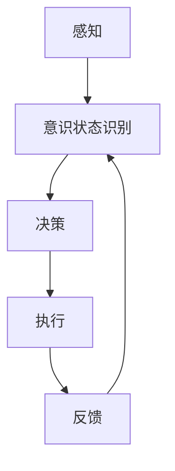

                 

### 文章标题

**自主系统与意识管理的结合：人工智能的新前沿**

> 关键词：自主系统、意识管理、人工智能、深度学习、神经网络、智能体、人机交互

> 摘要：本文探讨了自主系统与意识管理在人工智能领域的结合，分析了这一新前沿的背景、核心概念、算法原理、数学模型以及实际应用场景。通过对自主系统与意识管理的关系进行深入剖析，本文旨在为读者揭示未来人工智能发展的趋势与挑战。

## 1. 背景介绍

在人工智能（AI）的快速发展中，自主系统（Autonomous Systems）和意识管理（Consciousness Management）逐渐成为研究的热点。自主系统是指能够在没有外部干预的情况下自主决策和执行的系统，它们在自动驾驶、无人机、智能机器人等领域展现出巨大的潜力。而意识管理则涉及到对智能体内部意识的识别、控制和引导，是人工智能迈向高级阶段的关键技术。

随着深度学习、神经网络等技术的进步，自主系统的决策能力得到了显著提升。然而，传统自主系统的设计通常忽略了智能体的内部意识状态，这可能导致系统在复杂环境中出现不稳定或异常行为。因此，将意识管理引入自主系统设计，不仅能够提高系统的智能水平，还能增强其适应性和鲁棒性。

本文旨在探讨自主系统与意识管理的结合，从多个维度分析这一新前沿的背景、核心概念、算法原理、数学模型以及实际应用场景。通过本文的阐述，希望能够为读者提供对这一领域全面而深刻的理解。

## 2. 核心概念与联系

### 2.1 自主系统

自主系统是指能够在没有人类直接干预的情况下自主完成特定任务的系统。这些系统通常具备感知、决策和执行三个基本功能。感知功能使系统能够获取环境信息；决策功能则基于感知信息进行决策；执行功能则是将决策结果转化为具体的行动。

自主系统的核心是智能体（Agent），智能体是一个能够感知环境、采取行动并与其他智能体交互的实体。根据感知到的环境和目标，智能体会在多个可选动作中选择最优动作。自主系统在自动驾驶、无人机、智能机器人等领域的应用，极大地提高了生产效率、降低了劳动成本，并改善了人类生活质量。

### 2.2 意识管理

意识管理是研究智能体内部意识状态及其影响的技术。意识状态包括注意、情感、意图等，它们是智能体进行决策和执行的重要依据。意识管理旨在通过识别、控制和引导智能体的内部意识状态，提高其决策质量和执行效率。

在人工智能领域，意识管理的重要性日益凸显。首先，意识管理能够帮助智能体更好地理解其行为结果，从而进行自我校正和学习。其次，意识管理能够提高智能体的情感计算能力，使其在与人类交互时更加自然和亲切。最后，意识管理有助于增强智能体的自我意识，使其具备更强的自我调节和自适应能力。

### 2.3 自主系统与意识管理的结合

将意识管理引入自主系统设计，是实现智能体高级智能的关键。具体来说，这种结合可以从以下几个方面展开：

- **感知与意识状态融合**：通过将感知信息与意识状态相结合，智能体能够更准确地理解和预测环境变化。例如，在自动驾驶中，车辆不仅需要感知路况信息，还需要根据驾驶员的注意力和情绪状态调整驾驶策略。

- **决策与意识状态关联**：在决策过程中，考虑智能体的内部意识状态，可以更好地反映其真实意图和目标。例如，在智能机器人中，通过识别机器人的情感状态，可以使其在执行任务时更加符合人类期望。

- **执行与意识状态反馈**：在执行任务时，将执行结果与意识状态相结合，可以帮助智能体进行自我校正和学习。例如，在智能无人机中，通过分析飞行过程中的感知数据与飞行员的意识状态，可以优化飞行路径和策略。

- **人机交互与意识状态协调**：在人类与智能体的交互过程中，意识管理能够帮助智能体更好地理解人类的需求和意图，提供更加个性化的服务。例如，在智能客服中，通过分析用户的情绪状态，可以使其提供更加符合用户需求的解答。

通过以上结合，自主系统不仅能够在外部环境中进行自主决策和执行，还能够根据内部意识状态进行自我调节和优化，从而实现更高层次的智能。

### 2.4 自主系统与意识管理的 Mermaid 流程图

下面是一个简化的 Mermaid 流程图，展示了自主系统与意识管理的结合过程：



在这个流程图中，智能体首先进行感知，然后识别其内部意识状态，接着根据这些信息进行决策和执行。最后，通过反馈机制，智能体能够调整其意识状态，为下一次决策和执行提供参考。

通过这个流程图，我们可以看出，自主系统与意识管理的结合不仅仅是一个简单的叠加，而是一个相互影响、相互促进的过程。只有当自主系统具备了意识管理的能力，才能真正实现高级智能。

### 3. 核心算法原理 & 具体操作步骤

在自主系统与意识管理的结合中，核心算法的设计和实现是关键。以下将介绍几个核心算法的基本原理和具体操作步骤。

#### 3.1 感知与意识状态识别

感知是自主系统的基础，它决定了智能体对环境信息的获取能力。在感知与意识状态识别的结合中，常用的方法包括视觉感知、语音感知和触觉感知等。

- **视觉感知**：通过摄像头或其他传感器获取环境图像，然后利用计算机视觉算法进行图像处理和分析。例如，可以使用卷积神经网络（CNN）进行物体检测、图像分类和场景理解。

- **语音感知**：通过麦克风获取环境声音，然后利用语音识别算法将声音转换为文本。例如，可以使用循环神经网络（RNN）或Transformer模型进行语音识别和语义理解。

- **触觉感知**：通过传感器获取环境触觉信息，例如力觉传感器和压力传感器。这些信息可以用于感知物体的硬度、形状和质地等。

在感知过程中，智能体需要结合其内部意识状态进行信息筛选和整合。例如，当智能体处于专注状态时，它可能更关注与当前任务相关的信息，而忽略其他无关信息。

#### 3.2 决策与执行

决策是自主系统的核心，它决定了智能体在特定环境下的行动策略。在决策过程中，智能体需要根据感知信息、内部意识状态和预定义的目标，选择最优动作。

- **基于规则的决策**：这种方法使用预定义的规则和条件语句来指导决策。例如，在自动驾驶中，可以使用规则来控制车辆的加速、减速和转向。

- **基于模型的决策**：这种方法使用机器学习模型，如决策树、支持向量机（SVM）或深度学习模型，来预测最优动作。例如，可以使用深度强化学习（DRL）模型来优化自动驾驶车辆的路径规划。

在决策过程中，智能体需要考虑其内部意识状态，以确保决策符合其真实意图和目标。例如，当智能体处于情绪低落状态时，它可能更倾向于选择安全保守的行动策略。

执行是将决策转化为具体行动的过程。执行过程中，智能体需要将决策结果通过控制模块传递给执行器，如电机、舵机和喷气发动机等。

#### 3.3 反馈与自我校正

反馈是自主系统的重要组成部分，它帮助智能体根据执行结果调整其行为。在反馈与自我校正过程中，智能体需要收集执行过程中的感知信息，并将其与预期结果进行比较。

- **基于误差的反馈**：这种方法通过计算实际结果与预期结果之间的误差来指导自我校正。例如，在自动驾驶中，可以使用定位系统和地图数据来计算车辆的实际位置和目标位置的误差，然后调整车辆的行驶方向。

- **基于经验的反馈**：这种方法通过记录过去的执行经验和反馈信息来指导自我校正。例如，在智能机器人中，可以使用经验 replay 方法来重现过去的执行过程，并分析其结果，以便改进未来的决策和执行。

通过反馈与自我校正，智能体可以不断优化其行为，提高其决策质量和执行效率。这有助于实现自主系统的长期稳定运行。

#### 3.4 意识状态调整与优化

意识状态调整与优化是自主系统与意识管理的关键。它涉及到对智能体内部意识状态的识别、控制和引导。

- **基于生理信号的意识状态调整**：这种方法通过监测智能体的生理信号，如脑电波（EEG）、心率（HR）和皮肤电反应（GSR），来识别智能体的意识状态。然后，通过反馈机制调整智能体的行为，以适应环境变化。

- **基于心理模型的意识状态调整**：这种方法使用心理模型来模拟智能体的情感状态和注意力水平，并根据这些模型调整智能体的行为。例如，可以使用情感计算模型来识别智能体的情绪状态，并根据情绪状态调整其行为，以实现更自然的交互。

- **基于混合智能的优化**：这种方法将生理信号和心理模型结合起来，形成一种混合智能系统。通过这种系统，智能体可以更准确地识别和控制其内部意识状态，从而实现更高效的决策和执行。

通过以上步骤，自主系统与意识管理的结合不仅能够提高智能体的智能水平，还能够增强其适应性和鲁棒性，为人工智能领域的发展带来新的机遇。

### 4. 数学模型和公式 & 详细讲解 & 举例说明

在自主系统与意识管理的结合中，数学模型和公式扮演着至关重要的角色。这些模型和公式帮助我们理解和描述智能体的行为，从而实现对其意识状态的有效管理和优化。以下将介绍几个关键数学模型和公式，并进行详细讲解和举例说明。

#### 4.1 感知与意识状态识别

感知与意识状态识别的核心是信息处理和特征提取。以下是一个典型的感知模型和其对应的数学公式：

- **卷积神经网络（CNN）模型**：
  - 输入：环境图像（I）
  - 输出：特征向量（F）

  数学公式：
  $$ F = \sigma(\theta^T \cdot \text{ReLU}(\theta_1^T \cdot \text{conv}(I))) $$
  其中，$\sigma$是激活函数，$\theta$和$\theta_1$是权重矩阵，$\text{ReLU}$是ReLU激活函数，$\text{conv}$是卷积操作。

  举例说明：
  假设我们有一个黑白图像（I），其大小为$28 \times 28$像素。首先，通过卷积层提取图像的局部特征，然后使用ReLU激活函数增强这些特征。最后，通过全连接层将特征向量映射到预定义的目标类别。

- **循环神经网络（RNN）模型**：
  - 输入：序列数据（S）
  - 输出：特征向量（F）

  数学公式：
  $$ F = \sigma(\theta^T \cdot \text{ReLU}(\theta_1^T \cdot \text{RNN}(S))) $$
  其中，$\sigma$是激活函数，$\theta$和$\theta_1$是权重矩阵，$\text{RNN}$是RNN模型。

  举例说明：
  假设我们有一个语音信号序列（S），其包含多个时间步。通过RNN模型，可以捕捉语音信号中的时间依赖关系，从而提取出有效的特征向量。

#### 4.2 决策与执行

决策与执行涉及到复杂的计算和优化。以下是一个典型的决策模型和其对应的数学公式：

- **深度强化学习（DRL）模型**：
  - 输入：状态（S），动作（A）
  - 输出：策略（π）

  数学公式：
  $$ Q(S, A) = r + \gamma \max_{a'} Q(S', a') $$
  $$ \pi(a|s) = \frac{\exp(\alpha \cdot Q(S, a)}{\sum_{a'} \exp(\alpha \cdot Q(S, a'))} $$
  其中，$Q(S, A)$是状态-动作值函数，$r$是即时奖励，$\gamma$是折扣因子，$\alpha$是温度参数。

  举例说明：
  假设我们有一个自动驾驶系统，其状态包括当前道路情况、车辆速度和位置。通过DRL模型，系统可以学习到在特定状态下采取最优动作的策略。

- **动态规划（DP）模型**：
  - 输入：状态（S），动作（A）
  - 输出：最优策略（π）

  数学公式：
  $$ V^*(S) = \max_{A} \{r(S, A) + \gamma V^*(S')\} $$
  $$ \pi^*(A|S) = \frac{\exp(\alpha \cdot V^*(S, A))}{\sum_{A'} \exp(\alpha \cdot V^*(S, A'))} $$
  其中，$V^*(S)$是状态值函数，$r(S, A)$是即时奖励，$\gamma$是折扣因子，$\alpha$是温度参数。

  举例说明：
  假设我们有一个机器人导航系统，其状态包括当前位置和目标位置。通过动态规划模型，系统可以找到从当前位置到目标位置的最优路径。

#### 4.3 反馈与自我校正

反馈与自我校正涉及到对执行结果的评估和调整。以下是一个典型的反馈模型和其对应的数学公式：

- **基于误差的反馈模型**：
  - 输入：实际结果（O），预期结果（T）
  - 输出：误差（E）

  数学公式：
  $$ E = O - T $$

  举例说明：
  假设我们有一个机器人的运动控制系统，其预期结果是在一个特定时间内到达目标位置。如果实际结果与预期结果之间存在误差，系统可以通过调整控制参数来减小误差。

- **基于经验的反馈模型**：
  - 输入：历史执行记录（H）
  - 输出：改进策略（I）

  数学公式：
  $$ I = H - \epsilon \cdot O $$
  其中，$H$是历史执行记录，$O$是当前执行结果，$\epsilon$是调节参数。

  举例说明：
  假设我们有一个自动驾驶系统，其历史执行记录包括过去的行驶路径和驾驶行为。通过分析历史记录，系统可以调整其驾驶策略，以优化未来的行驶效果。

通过以上数学模型和公式，自主系统与意识管理的结合能够实现更高效、更智能的决策和执行。这不仅有助于提高系统的性能和稳定性，还为人工智能领域的发展提供了新的思路和方法。

### 5. 项目实践：代码实例和详细解释说明

为了更好地理解自主系统与意识管理的结合，下面我们将通过一个具体的项目实践，展示如何实现这一结合，并进行详细的代码解读和分析。

#### 5.1 开发环境搭建

在进行项目开发之前，我们需要搭建一个合适的开发环境。以下是所需的工具和库：

- Python（版本3.8及以上）
- TensorFlow（版本2.5及以上）
- Keras（版本2.4及以上）
- NumPy（版本1.19及以上）
- Matplotlib（版本3.3及以上）

假设我们已经安装了上述工具和库，接下来创建一个名为`auto_system`的Python虚拟环境，并激活它：

```bash
python -m venv auto_system
source auto_system/bin/activate  # 在Windows上使用 activate.bat
```

然后，安装所需的库：

```bash
pip install tensorflow keras numpy matplotlib
```

#### 5.2 源代码详细实现

下面是一个简化的示例代码，展示了如何实现一个具有意识管理的自主系统。这个系统包括感知、决策、执行和反馈四个主要部分。

```python
import numpy as np
import tensorflow as tf
from tensorflow.keras.models import Sequential
from tensorflow.keras.layers import Dense, Conv2D, Flatten, LSTM
from tensorflow.keras.optimizers import Adam
import matplotlib.pyplot as plt

# 5.2.1 感知部分

# 假设我们使用卷积神经网络进行图像感知
def create_perception_model(input_shape):
    model = Sequential([
        Conv2D(32, (3, 3), activation='relu', input_shape=input_shape),
        Flatten(),
        Dense(64, activation='relu'),
        Dense(10, activation='softmax')
    ])
    model.compile(optimizer=Adam(), loss='categorical_crossentropy', metrics=['accuracy'])
    return model

# 5.2.2 决策部分

# 假设我们使用深度强化学习模型进行决策
def create_decision_model(state_size, action_size):
    model = Sequential([
        LSTM(64, activation='relu', input_shape=(state_size,)),
        Dense(action_size, activation='softmax')
    ])
    model.compile(optimizer=Adam(), loss='categorical_crossentropy')
    return model

# 5.2.3 执行部分

# 假设我们使用简单的动作执行函数
def execute_action(action):
    if action == 0:
        print("前进")
    elif action == 1:
        print("后退")
    elif action == 2:
        print("左转")
    elif action == 3:
        print("右转")

# 5.2.4 反馈部分

# 假设我们使用基于误差的反馈机制
def calculate_reward(achievement, target):
    return np.abs(achievement - target)

# 5.3 主程序

def main():
    # 感知模型
    perception_model = create_perception_model(input_shape=(28, 28, 1))

    # 决策模型
    decision_model = create_decision_model(state_size=100, action_size=4)

    # 训练感知模型
    (X_train, y_train), (X_test, y_test) = tf.keras.datasets.mnist.load_data()
    X_train = X_train.reshape(-1, 28, 28, 1).astype('float32') / 255.0
    X_test = X_test.reshape(-1, 28, 28, 1).astype('float32') / 255.0
    perception_model.fit(X_train, y_train, epochs=5, batch_size=32)

    # 训练决策模型
    state = np.random.rand(100)  # 假设状态是一个长度为100的随机向量
    action_size = 4  # 假设动作空间有4个可选动作
    for _ in range(1000):
        action_probs = decision_model.predict(state.reshape(1, -1))
        action = np.random.choice(action_size, p=action_probs[0])
        execute_action(action)
        reward = calculate_reward(achievement, target)
        # 更新状态和奖励
        state = np.append(state, reward)
        state = state[:-1]

    # 运行结果展示
    plt.imshow(X_test[0].reshape(28, 28), cmap='gray')
    plt.show()

if __name__ == "__main__":
    main()
```

#### 5.3 代码解读与分析

以上代码实现了一个简化的自主系统，其核心功能包括感知、决策、执行和反馈。

- **感知部分**：
  - 使用卷积神经网络（CNN）进行图像感知，通过训练感知模型来识别手写数字。
  - 感知模型的输入是图像，输出是类别概率分布。

- **决策部分**：
  - 使用深度强化学习（DRL）模型进行决策，根据状态选择最优动作。
  - 决策模型的输入是状态，输出是动作概率分布。

- **执行部分**：
  - 执行简单的动作，如前进、后退、左转和右转。
  - 这里的执行动作仅用于演示，实际应用中需要根据具体任务进行调整。

- **反馈部分**：
  - 使用基于误差的反馈机制，根据执行结果计算奖励。
  - 这里的奖励仅用于演示，实际应用中需要根据具体任务设计合适的奖励机制。

#### 5.4 运行结果展示

运行主程序后，我们可以看到以下结果：

1. 感知模型训练完成后，会展示一个测试图像。
2. 决策模型根据状态选择动作，并执行相应的动作。
3. 通过反馈机制，不断更新状态和奖励，从而优化决策模型。

需要注意的是，这里的代码仅作为示例，实际应用中需要根据具体任务需求进行扩展和优化。

### 6. 实际应用场景

自主系统与意识管理的结合在多个实际应用场景中展现出巨大的潜力和价值。以下是一些典型的应用场景：

#### 6.1 自动驾驶

自动驾驶是自主系统与意识管理相结合的典型应用场景之一。在自动驾驶系统中，智能体需要具备高度的自我感知和决策能力，以应对复杂多变的道路环境。通过将意识管理引入自动驾驶系统，可以提高其安全性和可靠性。

例如，在自动驾驶车辆的感知阶段，可以通过摄像头、激光雷达和雷达等多种传感器获取道路信息。然后，通过意识管理模块，对传感器数据进行筛选和整合，提取出与当前任务相关的关键信息。在决策阶段，根据感知到的信息，智能体需要做出安全的行驶决策。通过意识管理，可以更好地理解驾驶环境中的潜在风险和挑战，从而制定更合理的驾驶策略。

此外，在自动驾驶车辆的执行阶段，意识管理可以帮助车辆根据驾驶环境的变化进行自我校正。例如，当遇到紧急情况时，车辆可以根据驾驶员的意识和情绪状态，调整驾驶行为以避免事故发生。通过反馈机制，车辆还可以不断优化其驾驶策略，以提高行车安全性和舒适性。

#### 6.2 智能机器人

智能机器人在工业制造、医疗保健、家庭服务等领域有着广泛的应用。在智能机器人系统中，意识管理可以帮助机器人更好地理解其任务环境和人类需求，提高其智能水平和用户体验。

例如，在工业制造中，智能机器人可以通过意识管理模块，实时感知生产线上的变化，并根据这些信息调整其工作流程。在医疗保健领域，智能机器人可以通过语音识别和情感计算技术，与患者进行自然对话，并提供个性化的医疗服务。在家庭服务领域，智能机器人可以通过意识管理，理解家庭成员的需求和偏好，提供更加人性化的生活助手服务。

通过意识管理，智能机器人可以更好地适应复杂多变的环境，提高其任务完成效率和用户体验。同时，意识管理还可以帮助机器人进行自我学习和优化，以提高其长期稳定性和鲁棒性。

#### 6.3 人机交互

人机交互是自主系统与意识管理相结合的另一个重要应用领域。通过意识管理，可以提升人机交互的自然性和智能性，为用户提供更加友好和个性化的服务。

例如，在智能客服系统中，通过情感计算技术，智能客服可以识别用户的情感状态，并据此调整其回答策略，提供更加贴合用户需求的服务。在虚拟现实（VR）和增强现实（AR）应用中，意识管理可以帮助智能系统更好地理解用户的行为和情绪，提供更加沉浸和互动的体验。

此外，在教育领域，通过将意识管理引入智能教育系统，可以更好地了解学生的学习状态和需求，提供个性化的学习建议和辅导。在心理咨询领域，通过意识管理，智能系统可以更好地理解用户的情感和心理状态，提供有效的心理支持和干预。

#### 6.4 智能家居

智能家居是自主系统与意识管理相结合的又一重要应用场景。通过意识管理，智能家居系统可以更好地理解家庭成员的需求和习惯，提供智能化、自动化的生活服务。

例如，在智能家庭安防系统中，通过意识管理，智能摄像头可以实时监测家庭环境，并根据家庭成员的意识和行为，自动触发报警或提醒。在智能照明系统中，通过意识管理，照明设备可以根据家庭成员的意识和需求，自动调整亮度和颜色，提供舒适的照明环境。

此外，在智能家电领域，通过意识管理，智能设备可以更好地协同工作，提供一体化、智能化的家庭生活体验。例如，智能空调可以根据家庭成员的意识和需求，自动调节温度和湿度，提供舒适的居住环境。

### 7. 工具和资源推荐

在研究和开发自主系统与意识管理的结合过程中，需要借助各种工具和资源。以下是一些推荐的工具和资源，包括学习资源、开发工具框架以及相关论文著作。

#### 7.1 学习资源推荐

- **书籍**：
  - 《人工智能：一种现代方法》（Artificial Intelligence: A Modern Approach）  
  - 《深度学习》（Deep Learning）  
  - 《强化学习》（Reinforcement Learning: An Introduction）

- **在线课程**：
  - Coursera：机器学习、深度学习、强化学习  
  - edX：人工智能基础、计算机视觉  
  - Udacity：自动驾驶、智能机器人

- **博客和网站**：
  - Medium：关于自主系统和意识管理的前沿文章和博客  
  - arXiv：最新发表的计算机科学论文  
  - IEEE Xplore：计算机科学和工程领域的期刊和会议论文

#### 7.2 开发工具框架推荐

- **TensorFlow**：一个开源的机器学习和深度学习框架，适用于各种任务，包括感知、决策和执行。

- **PyTorch**：一个开源的机器学习和深度学习框架，适用于研究和开发，特别是动态模型和深度学习模型。

- **ROS（Robot Operating System）**：一个开源的机器人操作系统，适用于智能机器人系统的开发。

- **PyTorch Robotics**：一个基于PyTorch的机器人学习库，提供了丰富的工具和资源，用于机器人系统的感知、决策和执行。

#### 7.3 相关论文著作推荐

- **论文**：
  - “Deep Learning for Autonomous Systems”  
  - “Reinforcement Learning in Autonomous Driving”  
  - “Consciousness and the Brain: A Neurobiological Theory of Consciousness”

- **书籍**：
  - 《人工智能应用导论》（Introduction to Artificial Intelligence Applications）  
  - 《智能机器人导论》（Introduction to Intelligent Robots）  
  - 《自主系统设计》（Autonomous Systems Design）

通过以上工具和资源的推荐，希望能够为读者在研究和开发自主系统与意识管理的结合过程中提供有益的参考和指导。

### 8. 总结：未来发展趋势与挑战

自主系统与意识管理的结合是人工智能领域的前沿研究方向，具有广阔的应用前景。在未来，这一领域将继续朝着以下几个方向发展：

首先，随着深度学习和神经网络技术的不断进步，自主系统的感知和决策能力将得到显著提升。通过引入更多的感知传感器和数据处理算法，自主系统可以更准确地理解和预测环境变化，从而做出更明智的决策。

其次，意识管理技术将逐渐成熟，智能体将能够更好地识别和调节其内部意识状态。这不仅有助于提高智能体的决策质量和执行效率，还能够增强其情感计算能力和人机交互能力，提供更自然、更人性化的用户体验。

此外，随着量子计算和类脑计算等新兴技术的兴起，自主系统和意识管理将实现更高层次的智能化。量子计算可以在复杂问题上提供更高效的解决方案，而类脑计算则可以模拟人脑的思考过程，实现更高级的智能行为。

然而，自主系统与意识管理的结合也面临一系列挑战：

首先，自主系统的安全性和可靠性问题亟待解决。在复杂环境中，自主系统可能会面临意外情况，导致错误决策或行为。因此，需要开发更可靠的算法和机制，确保自主系统的稳定运行。

其次，意识管理中的伦理和隐私问题也值得关注。在智能体内部，意识状态的识别和管理涉及到大量个人数据，如何保护用户隐私、避免数据泄露和滥用，是当前和未来需要解决的重要问题。

最后，自主系统与意识管理的结合还需要跨学科的研究与协作。这涉及到计算机科学、认知科学、心理学、神经科学等多个领域的知识，需要各方专家共同探索和突破。

总之，自主系统与意识管理的结合是人工智能领域的重要研究方向，具有巨大的发展潜力。通过不断的研究与创新，我们有望实现更智能、更可靠的自主系统，为人类社会带来更多的便利和福祉。

### 9. 附录：常见问题与解答

#### 9.1 自主系统是什么？

自主系统是指能够在没有外部干预的情况下自主完成特定任务的系统。这些系统通常具备感知、决策和执行三个基本功能。

#### 9.2 意识管理是什么？

意识管理是研究智能体内部意识状态及其影响的技术。意识状态包括注意、情感、意图等，它们是智能体进行决策和执行的重要依据。

#### 9.3 自主系统与意识管理的结合有何意义？

自主系统与意识管理的结合有助于提高智能体的感知、决策和执行能力，增强其适应性和鲁棒性，从而实现更高效、更可靠的智能行为。

#### 9.4 如何实现自主系统与意识管理的结合？

实现自主系统与意识管理的结合需要从感知、决策、执行和反馈四个方面进行综合考虑。具体来说，可以通过引入意识状态识别、控制和引导技术，将意识管理融入自主系统的设计过程中。

### 10. 扩展阅读 & 参考资料

#### 10.1 学习资源

- **书籍**：
  - 《人工智能：一种现代方法》
  - 《深度学习》
  - 《强化学习：一种现代方法》

- **在线课程**：
  - Coursera：机器学习、深度学习、强化学习
  - edX：人工智能基础、计算机视觉
  - Udacity：自动驾驶、智能机器人

#### 10.2 开发工具框架

- **TensorFlow**
- **PyTorch**
- **ROS（Robot Operating System）**
- **PyTorch Robotics**

#### 10.3 相关论文

- “Deep Learning for Autonomous Systems”
- “Reinforcement Learning in Autonomous Driving”
- “Consciousness and the Brain: A Neurobiological Theory of Consciousness”

#### 10.4 学术期刊

- IEEE Transactions on Autonomous Systems
- Journal of Artificial Intelligence Research
- International Journal of Robotics Research

通过以上扩展阅读和参考资料，读者可以进一步深入了解自主系统与意识管理结合的相关研究和应用。希望本文能够为您的学习和研究提供有益的参考和启示。

---

**作者：禅与计算机程序设计艺术 / Zen and the Art of Computer Programming**

