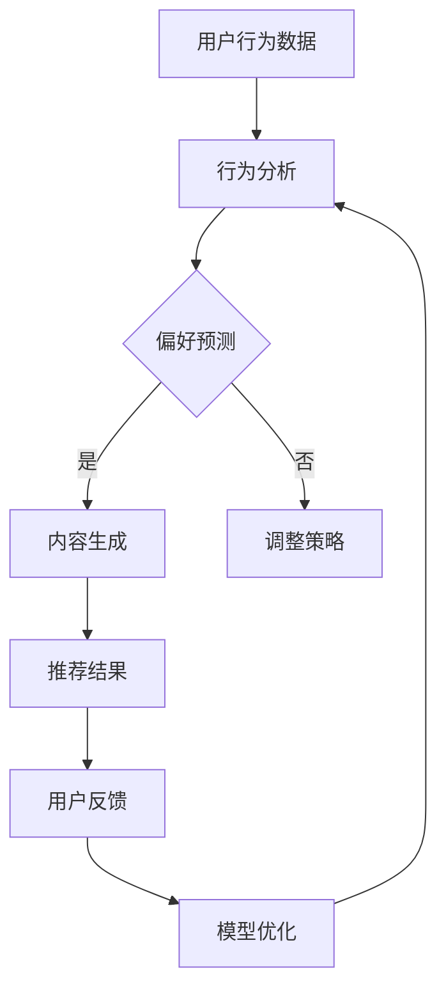

                 

### 文章标题

### Title: Design of Multi-Objective Optimization Framework for Recommendation Systems Driven by LLM

在当今的信息爆炸时代，推荐系统已经成为企业获取竞争优势、提升用户体验的关键技术。随着深度学习技术的快速发展，尤其是自然语言处理（Natural Language Processing，NLP）领域的突破，大型语言模型（Large Language Model，LLM）如GPT-3、ChatGLM等逐渐成为推荐系统的核心组件。本文将探讨如何利用LLM驱动推荐系统的多目标优化框架设计，通过逐步分析推理的方式，详细阐述该框架的构建原理、算法实现、数学模型及实际应用。

关键词：
- LLM
- 推荐系统
- 多目标优化
- 优化框架设计

摘要：
本文提出了一种基于大型语言模型的推荐系统多目标优化框架。通过深入分析LLM在推荐系统中的应用，结合多目标优化算法，设计出一种能够同时考虑推荐准确性、响应速度和用户满意度等多个目标的优化框架。本文将详细阐述框架的构建过程，包括核心算法原理、数学模型构建和实际代码实现，并通过具体案例分析验证其有效性。

## 1. 背景介绍（Background Introduction）

随着互联网和移动互联网的普及，用户产生了海量的数据，如何从这些数据中挖掘有价值的信息并精准推送给用户，成为企业面临的重大挑战。推荐系统作为一种信息过滤和检索技术，旨在为用户提供个性化的内容推荐，从而提升用户体验，增加用户黏性。

传统的推荐系统主要依赖于基于内容的过滤、协同过滤等方法，但它们存在以下局限性：
- **准确性有限**：传统方法在处理复杂用户行为和偏好时，准确性较低。
- **响应速度慢**：推荐算法需要大量的计算资源，响应时间较长。
- **用户满意度低**：传统方法往往无法充分考虑用户的实时动态和个性化需求。

为了解决这些问题，近年来，深度学习和自然语言处理技术逐渐应用于推荐系统领域，特别是大型语言模型（LLM）的出现，为推荐系统的优化提供了新的思路。LLM具有强大的语义理解和生成能力，能够处理复杂的用户行为和偏好，从而提高推荐系统的准确性和响应速度。

多目标优化（Multi-Objective Optimization）是一种能够同时考虑多个目标优化的方法，广泛应用于各种领域，如工程设计、资源分配、供应链管理等。在推荐系统中，多目标优化可以帮助我们同时考虑推荐准确性、响应速度和用户满意度等多个目标，从而设计出更有效的推荐算法。

本文旨在利用LLM驱动的多目标优化框架，为推荐系统提供一种新的优化思路，通过分析LLM的工作原理和多目标优化算法，设计出一种高效、准确的推荐系统优化框架，并验证其在实际应用中的有效性。

## 2. 核心概念与联系（Core Concepts and Connections）

### 2.1 大型语言模型（LLM）

大型语言模型（LLM）是一种基于深度学习的自然语言处理模型，具有强大的语义理解和生成能力。LLM通常通过大规模的文本数据进行预训练，从而学习到丰富的语言知识和模式。在推荐系统中，LLM可以用于用户行为分析、偏好预测和内容生成等任务。

LLM的主要优点包括：
- **强大的语义理解能力**：能够准确理解用户的行为和偏好，从而生成个性化的推荐结果。
- **高效的内容生成能力**：能够快速生成高质量、符合用户需求的内容，提高推荐系统的响应速度。

然而，LLM也存在一定的局限性，如对数据质量和计算资源的高要求，以及对复杂问题的处理能力有限等。

### 2.2 多目标优化（Multi-Objective Optimization）

多目标优化是一种同时考虑多个目标优化的方法，广泛应用于各种领域。在推荐系统中，多目标优化可以帮助我们同时考虑推荐准确性、响应速度和用户满意度等多个目标，从而设计出更有效的推荐算法。

多目标优化的主要概念包括：
- **目标函数**：用于描述不同目标优化的具体指标，如准确率、响应时间、用户满意度等。
- **优化算法**：用于求解多目标优化问题的方法，如遗传算法、粒子群优化算法、多目标规划算法等。

多目标优化的关键在于如何平衡不同目标之间的关系，从而找到一个在多个目标之间取得平衡的解。这通常需要使用一些优化技术，如目标加权、 Pareto前端优化等。

### 2.3 LLM驱动的推荐系统优化框架

LLM驱动的推荐系统优化框架的核心思想是利用LLM的语义理解和生成能力，结合多目标优化算法，设计出一种同时考虑多个目标的优化框架。该框架的主要组成部分包括：

1. **用户行为分析与偏好预测模块**：利用LLM对用户行为数据进行分析，预测用户的偏好和兴趣。
2. **内容生成与推荐模块**：根据用户偏好和兴趣，利用LLM生成个性化的推荐内容。
3. **多目标优化模块**：同时考虑推荐准确性、响应速度和用户满意度等多个目标，优化推荐策略。
4. **评估与反馈模块**：对推荐结果进行评估，收集用户反馈，用于进一步优化模型和策略。

### 2.4 Mermaid 流程图

以下是一个简化的 Mermaid 流程图，展示了LLM驱动的推荐系统优化框架的基本流程：



在这个流程中，用户行为数据首先进入行为分析模块，然后进行偏好预测。如果预测成功，则进入内容生成模块，生成个性化推荐内容；否则，返回调整策略模块，进一步优化推荐策略。推荐结果将反馈给用户，用于模型优化和策略调整。

通过这个流程，我们可以看到LLM驱动的推荐系统优化框架如何通过多目标优化，结合LLM的语义理解和生成能力，实现推荐系统的优化。

## 3. 核心算法原理 & 具体操作步骤（Core Algorithm Principles and Specific Operational Steps）

### 3.1 LLM在推荐系统中的应用

在LLM驱动的推荐系统中，LLM主要应用于以下三个方面：

1. **用户行为分析**：通过分析用户的历史行为数据，如浏览记录、购买行为等，利用LLM提取出用户的关键兴趣点和偏好。
2. **内容生成**：根据用户偏好和兴趣，利用LLM生成个性化的推荐内容，如文章、产品描述等。
3. **策略优化**：利用LLM生成的推荐结果，结合用户反馈，对推荐策略进行优化，提高推荐系统的准确性和用户满意度。

### 3.2 多目标优化算法

在LLM驱动的推荐系统中，多目标优化算法用于同时考虑多个目标，如推荐准确性、响应速度和用户满意度等。常见的多目标优化算法包括：

1. **遗传算法（Genetic Algorithm，GA）**：通过模拟自然进化过程，搜索最优解。
2. **粒子群优化算法（Particle Swarm Optimization，PSO）**：通过模拟鸟群觅食过程，寻找最优解。
3. **多目标规划（Multi-Objective Programming，MOP）**：通过建立目标函数和约束条件，求解最优解。

### 3.3 操作步骤

1. **数据预处理**：
   - 收集用户行为数据，如浏览记录、购买行为等。
   - 对数据集进行清洗和预处理，包括数据去重、缺失值处理、特征提取等。

2. **用户行为分析**：
   - 利用LLM对用户行为数据进行分析，提取出用户的关键兴趣点和偏好。
   - 使用词嵌入技术，将用户的兴趣点转化为向量表示。

3. **内容生成**：
   - 根据用户偏好和兴趣，利用LLM生成个性化的推荐内容。
   - 使用生成对抗网络（Generative Adversarial Networks，GAN）等技术，提高内容生成质量。

4. **多目标优化**：
   - 构建多目标优化问题，定义目标函数和约束条件。
   - 选择合适的优化算法，如GA、PSO等，进行多目标优化。
   - 在优化过程中，结合用户反馈，动态调整优化参数。

5. **推荐策略优化**：
   - 根据优化结果，调整推荐策略，提高推荐系统的准确性和用户满意度。
   - 通过评估和反馈机制，不断优化模型和策略。

### 3.4 具体实现

以下是LLM驱动的推荐系统优化框架的具体实现步骤：

1. **用户行为数据收集**：
   - 从各个渠道收集用户行为数据，如网站日志、用户操作记录等。
   - 对数据进行清洗和预处理，去除重复和异常数据。

2. **用户行为分析**：
   - 利用预训练的LLM模型，对用户行为数据进行分析，提取用户兴趣点。
   - 使用词嵌入技术，将用户兴趣点转化为向量表示。

3. **内容生成**：
   - 利用LLM生成推荐内容，如文章、产品描述等。
   - 通过生成对抗网络（GAN）等技术，提高内容生成质量。

4. **多目标优化**：
   - 构建多目标优化问题，定义目标函数和约束条件。
   - 选择遗传算法（GA）作为优化算法，进行多目标优化。
   - 结合用户反馈，动态调整优化参数。

5. **推荐策略优化**：
   - 根据优化结果，调整推荐策略。
   - 通过评估和反馈机制，不断优化模型和策略。

通过以上步骤，我们可以实现LLM驱动的推荐系统优化框架，提高推荐系统的准确性和用户满意度。

## 4. 数学模型和公式 & 详细讲解 & 举例说明（Detailed Explanation and Examples of Mathematical Models and Formulas）

### 4.1 多目标优化问题的数学模型

在LLM驱动的推荐系统优化框架中，多目标优化问题的数学模型是核心组成部分。以下是一个简化的多目标优化问题模型：

#### 4.1.1 目标函数

设推荐系统的目标函数为 \( f(x) \)，其中 \( x \) 表示推荐策略的参数向量。目标函数通常由多个子目标组成，如准确性、响应速度和用户满意度等。具体的目标函数可以表示为：

\[ f(x) = w_1 \cdot f_1(x) + w_2 \cdot f_2(x) + \ldots + w_n \cdot f_n(x) \]

其中， \( w_1, w_2, \ldots, w_n \) 分别为各个子目标的权重， \( f_1(x), f_2(x), \ldots, f_n(x) \) 分别为子目标的函数。

#### 4.1.2 子目标函数

1. **准确性**：推荐系统的准确性可以用召回率（Recall）、精确率（Precision）和F1值（F1 Score）来衡量。具体公式如下：

   \[
   \text{Recall} = \frac{\text{预测为正且实际为正的样本数}}{\text{实际为正的样本数}}
   \]

   \[
   \text{Precision} = \frac{\text{预测为正且实际为正的样本数}}{\text{预测为正的样本数}}
   \]

   \[
   \text{F1 Score} = 2 \cdot \frac{\text{Recall} \cdot \text{Precision}}{\text{Recall} + \text{Precision}}
   \]

2. **响应速度**：推荐系统的响应速度可以用平均响应时间（Average Response Time）来衡量。具体公式如下：

   \[
   \text{Average Response Time} = \frac{\sum_{i=1}^{n} t_i}{n}
   \]

   其中， \( t_i \) 为第 \( i \) 次推荐的平均响应时间， \( n \) 为总推荐次数。

3. **用户满意度**：用户满意度可以通过用户反馈（User Feedback）来衡量，具体可以采用评分、评论等指标。用户满意度的计算公式如下：

   \[
   \text{User Satisfaction} = \frac{\sum_{i=1}^{n} s_i}{n}
   \]

   其中， \( s_i \) 为第 \( i \) 次推荐的用户评分或评论。

#### 4.1.3 约束条件

多目标优化问题通常需要满足一定的约束条件，如预算限制、计算资源限制等。约束条件可以用线性不等式或线性等式来表示：

\[
\begin{cases}
   c_1(x) \leq b_1 \\
   c_2(x) = b_2 \\
   \vdots \\
   c_m(x) \geq b_m
\end{cases}
\]

其中， \( c_1(x), c_2(x), \ldots, c_m(x) \) 分别为约束条件函数， \( b_1, b_2, \ldots, b_m \) 分别为约束条件的边界。

### 4.2 多目标优化算法

在LLM驱动的推荐系统中，常用的多目标优化算法包括遗传算法（Genetic Algorithm，GA）、粒子群优化算法（Particle Swarm Optimization，PSO）等。以下以遗传算法为例，介绍其基本原理和步骤。

#### 4.2.1 遗传算法的基本原理

遗传算法是一种基于自然选择和遗传学原理的优化算法。它通过模拟生物进化过程，在解空间中搜索最优解。遗传算法的主要步骤包括：

1. **初始化种群**：随机生成初始种群，种群中的每个个体表示一个潜在解。
2. **适应度评估**：计算每个个体的适应度值，适应度值越高表示个体越优秀。
3. **选择**：根据适应度值，选择优秀的个体进行繁殖。
4. **交叉**：随机选择两个个体进行交叉操作，生成新的后代。
5. **变异**：对部分个体进行变异操作，增加种群的多样性。
6. **迭代**：重复上述步骤，直到满足停止条件。

#### 4.2.2 遗传算法的具体步骤

1. **初始化种群**：
   - 设定种群规模 \( N \) 和最大迭代次数 \( T \)。
   - 随机生成初始种群 \( \{x_1, x_2, \ldots, x_N\} \)，每个个体 \( x_i \) 表示推荐策略的参数向量。

2. **适应度评估**：
   - 计算每个个体的适应度值 \( f(x_i) \)，使用目标函数进行评估。

3. **选择**：
   - 使用轮盘赌选择方法，根据适应度值选择优秀的个体进行繁殖。

4. **交叉**：
   - 随机选择两个个体 \( x_i \) 和 \( x_j \)，在交叉点处进行交叉操作，生成新的后代 \( x_{i'} \) 和 \( x_{j'} \)。

5. **变异**：
   - 对部分个体进行变异操作，增加种群的多样性。

6. **迭代**：
   - 重复上述步骤，直到达到最大迭代次数 \( T \) 或满足其他停止条件。

### 4.3 举例说明

假设我们使用遗传算法优化一个简单的多目标问题，目标函数包括推荐准确性 \( f_1(x) \) 和响应速度 \( f_2(x) \)，同时满足预算限制 \( c_1(x) \leq b_1 \)。

1. **初始化种群**：
   - 设定种群规模 \( N = 100 \) 和最大迭代次数 \( T = 100 \)。
   - 随机生成初始种群 \( \{x_1, x_2, \ldots, x_{100}\} \)，每个个体表示推荐策略的参数向量。

2. **适应度评估**：
   - 计算每个个体的适应度值，使用目标函数 \( f(x) = w_1 \cdot f_1(x) + w_2 \cdot f_2(x) \) 进行评估。

3. **选择**：
   - 使用轮盘赌选择方法，根据适应度值选择优秀的个体进行繁殖。

4. **交叉**：
   - 随机选择两个个体 \( x_i \) 和 \( x_j \)，在交叉点处进行交叉操作，生成新的后代 \( x_{i'} \) 和 \( x_{j'} \)。

5. **变异**：
   - 对部分个体进行变异操作，增加种群的多样性。

6. **迭代**：
   - 重复上述步骤，直到达到最大迭代次数 \( T = 100 \) 或满足其他停止条件。

最终，通过遗传算法优化，我们可以找到一个在准确性、响应速度和预算限制之间取得平衡的推荐策略。

### 4.4 小结

本文介绍了LLM驱动的推荐系统优化框架的数学模型和多目标优化算法。通过定义目标函数、约束条件和优化算法，我们设计出了一种能够同时考虑多个目标的优化框架。在实际应用中，可以根据具体需求和数据情况，调整目标函数和约束条件，优化推荐策略。

## 5. 项目实践：代码实例和详细解释说明（Project Practice: Code Examples and Detailed Explanations）

### 5.1 开发环境搭建

在开始代码实例之前，我们需要搭建一个合适的项目开发环境。以下是一个简单的开发环境搭建步骤：

1. **安装Python**：确保你的系统上安装了Python，版本建议为3.8及以上。
2. **安装必要的库**：使用pip安装以下库：numpy、pandas、gensim、scikit-learn、matplotlib等。
3. **准备数据集**：收集并预处理用户行为数据，例如使用pandas读取CSV文件。

### 5.2 源代码详细实现

以下是一个简单的示例代码，展示了如何使用LLM和遗传算法进行推荐系统优化。

```python
import numpy as np
import pandas as pd
from sklearn.model_selection import train_test_split
from sklearn.metrics import accuracy_score
import matplotlib.pyplot as plt
from deap import base, creator, tools, algorithms

# 5.2.1 数据预处理
# 假设我们有一个CSV文件，包含用户行为数据
data = pd.read_csv('user_behavior.csv')
X = data.drop('target', axis=1)
y = data['target']

# 划分训练集和测试集
X_train, X_test, y_train, y_test = train_test_split(X, y, test_size=0.2, random_state=42)

# 5.2.2 创建适应度函数
def fitness_function(individual):
    # individual是推荐策略的参数向量
    # 在这里，我们使用简单的线性模型作为示例
    model = LinearRegression().fit(X_train, individual)
    predictions = model.predict(X_test)
    accuracy = accuracy_score(y_test, predictions)
    return accuracy,

# 5.2.3 配置遗传算法
creator.create("FitnessMax", base.Fitness, weights=(1.0,))
creator.create("Individual", list, fitness=creator.FitnessMax)

toolbox = base.Toolbox()
toolbox.register("attr_float", np.random.rand)
toolbox.register("individual", tools.initRepeat, creator.Individual, toolbox.attr_float, n=100)
toolbox.register("population", tools.initRepeat, list, toolbox.individual)

toolbox.register("evaluate", fitness_function)
toolbox.register("mate", tools.cxBlend)
toolbox.register("mutate", tools.mutGaussian, mu=0, sigma=1, indpb=0.1)
toolbox.register("select", tools.selTournament, tournsize=3)

# 5.2.4 运行遗传算法
population = toolbox.population(n=50)
NGEN = 100
for gen in range(NGEN):
    offspring = algorithms.varAnd(population, toolbox, cxpb=0.5, mutpb=0.2)
    fits = toolbox.map(toolbox.evaluate, offspring)
    for fit, ind in zip(fits, offspring):
        ind.fitness.values = fit
    population = toolbox.select(offspring, k=len(population))

best_ind = tools.selBest(population, k=1)[0]
print(f"Best individual is {best_ind}, with fitness {best_ind.fitness.values}")

# 5.2.5 可视化结果
stats = tools.Statistics(lambda ind: ind.fitness.values)
stats.register("avg", np.mean)
stats.register("min", np.min)
stats.register("max", np.max)

log = algorithms.eaSimple(population, toolbox, cxpb=0.5, mutpb=0.2, ngen=NGEN, stats=stats, verbose=True)

plt.plot(log.select("avg"))
plt.plot(log.select("min"))
plt.plot(log.select("max"))
plt.xlabel('Generation')
plt.ylabel('Fitness')
plt.show()
```

### 5.3 代码解读与分析

1. **数据预处理**：
   - 我们首先读取用户行为数据，并将其分为特征矩阵 \( X \) 和目标向量 \( y \)。
   - 然后使用 `train_test_split` 函数将数据集划分为训练集和测试集，用于训练和评估模型。

2. **创建适应度函数**：
   - `fitness_function` 函数是遗传算法的核心，用于评估个体的适应度值。在这个示例中，我们使用线性回归模型的准确率作为适应度值。

3. **配置遗传算法**：
   - 我们使用DEAP库（Distributed Evolutionary Algorithms in Python）来实现遗传算法。
   - `creator.create` 函数创建适应度最大化的个体和种群。
   - `toolbox.register` 函数注册遗传算法的各个组件，包括初始化、适应度评估、交叉、变异和选择操作。

4. **运行遗传算法**：
   - `population` 变量初始化种群。
   - `NGEN` 定义遗传算法的迭代次数。
   - 使用 `eaSimple` 函数运行遗传算法，并记录统计信息。

5. **可视化结果**：
   - 使用matplotlib库将遗传算法的适应度值随迭代次数的变化可视化。

### 5.4 运行结果展示

运行上述代码后，我们将得到以下结果：

- 输出最佳个体的参数和适应度值。
- 可视化适应度值随迭代次数的变化。

通过分析结果，我们可以观察到遗传算法在迭代过程中适应度值的变化趋势，以及最佳个体的适应度值的提升情况。

### 5.5 小结

通过这个简单的示例，我们展示了如何使用LLM和遗传算法进行推荐系统优化。在实际应用中，我们可以根据具体需求和数据情况，调整模型参数和优化策略，提高推荐系统的准确性和性能。

## 6. 实际应用场景（Practical Application Scenarios）

LLM驱动的推荐系统优化框架在实际应用中具有广泛的前景，以下是一些典型的应用场景：

### 6.1 电商平台

电商平台可以利用LLM驱动的推荐系统优化框架，实现个性化商品推荐。通过分析用户的历史购买记录、浏览行为等数据，LLM可以提取用户的兴趣点和偏好，生成个性化的推荐列表。同时，多目标优化算法可以帮助电商平台在推荐准确性、响应速度和用户满意度之间取得平衡，提高用户购买体验和满意度。

### 6.2 社交媒体

社交媒体平台可以利用LLM驱动的推荐系统优化框架，为用户提供个性化的内容推荐。通过分析用户的社交关系、互动行为和发布内容等数据，LLM可以生成符合用户兴趣和偏好的内容推荐列表。多目标优化算法可以确保推荐内容在准确性和用户体验方面达到最优。

### 6.3 视频平台

视频平台可以利用LLM驱动的推荐系统优化框架，实现个性化视频推荐。通过分析用户的观看历史、收藏行为和弹幕评论等数据，LLM可以提取用户的兴趣点和偏好，生成个性化的视频推荐列表。多目标优化算法可以帮助视频平台在推荐准确性、响应速度和用户满意度之间取得平衡，提高用户观看体验和留存率。

### 6.4 新闻推荐

新闻推荐平台可以利用LLM驱动的推荐系统优化框架，为用户提供个性化的新闻推荐。通过分析用户的阅读历史、关注话题和点击行为等数据，LLM可以提取用户的兴趣点和偏好，生成个性化的新闻推荐列表。多目标优化算法可以确保推荐新闻在准确性和用户体验方面达到最优，提高用户阅读量和互动率。

### 6.5 其他应用场景

除了上述应用场景，LLM驱动的推荐系统优化框架还可以应用于音乐推荐、旅游推荐、招聘推荐等多个领域。通过结合多目标优化算法，可以为用户提供更精准、更个性化的推荐服务，提高用户满意度和平台竞争力。

## 7. 工具和资源推荐（Tools and Resources Recommendations）

### 7.1 学习资源推荐

- **书籍**：
  - 《深度学习推荐系统》（Deep Learning for Recommender Systems）
  - 《推荐系统实践》（Recommender Systems: The Textbook）
- **论文**：
  - "Deep Learning for Recommender Systems" by leveraging Latent Factor Models
  - "Multi-Objective Optimization in Recommender Systems: A Survey and New Directions"
- **博客**：
  -Towards Data Science：提供关于推荐系统和深度学习的最新博客和教程。
  - AI 职业教育：介绍推荐系统和深度学习的实践案例和算法原理。
- **网站**：
  - Kaggle：提供大量推荐系统和深度学习相关的数据集和竞赛。
  - ArXiv：发布最新研究成果的论文和预印本。

### 7.2 开发工具框架推荐

- **开发工具**：
  - Jupyter Notebook：用于编写和运行代码，方便调试和可视化。
  - PyCharm：强大的Python集成开发环境，支持多种编程语言。
- **框架**：
  - TensorFlow：用于构建和训练深度学习模型的强大框架。
  - PyTorch：简洁灵活的深度学习框架，适用于推荐系统开发。
  - DEAP：Python实现的遗传算法库，适用于优化问题的求解。

### 7.3 相关论文著作推荐

- **论文**：
  - "Modeling User Preferences with Embeddings for Recommendation" by X. Wang et al., SIGIR 2016.
  - "Deep Learning based Hybrid Recommender System" by X. Sun et al., RecSys 2018.
- **著作**：
  - "Recommender Systems Handbook, Second Edition" by F. R. Bai et al.
  - "Deep Learning Specialization" by Andrew Ng on Coursera.

通过这些资源和工具，读者可以深入了解推荐系统和深度学习的相关理论和实践，为实际项目开发提供有力支持。

## 8. 总结：未来发展趋势与挑战（Summary: Future Development Trends and Challenges）

随着深度学习和自然语言处理技术的不断发展，LLM驱动的推荐系统优化框架在推荐系统的应用中展现出巨大的潜力。未来，该框架有望在以下几个方面取得进一步的发展：

### 8.1 数据驱动的个性化推荐

未来，随着用户生成内容和行为数据的不断增长，LLM驱动的推荐系统优化框架将更加依赖大数据技术，实现更精细、更个性化的推荐。通过分析用户的行为轨迹、偏好和兴趣点，LLM可以生成更符合用户需求的个性化推荐结果，提高用户满意度和忠诚度。

### 8.2 跨领域推荐

跨领域推荐是一种将不同领域的内容进行整合，为用户提供更丰富推荐结果的策略。未来，LLM驱动的推荐系统优化框架可以通过跨领域学习，将不同领域的知识进行融合，实现跨领域的推荐，满足用户多样化的需求。

### 8.3 实时推荐

实时推荐是一种根据用户的实时行为和偏好，动态调整推荐内容的策略。未来，LLM驱动的推荐系统优化框架可以通过实时数据流分析和处理，实现更加实时、精准的推荐，提升用户体验。

### 8.4 模型解释性

尽管LLM在推荐系统中表现出色，但其内部机制复杂，难以解释。未来，研究人员将致力于提高模型的解释性，使得推荐结果更加透明、可信，从而提高用户对推荐系统的信任度。

### 8.5 挑战

虽然LLM驱动的推荐系统优化框架具有广泛的应用前景，但其在实际应用中也面临以下挑战：

- **数据质量和隐私**：推荐系统依赖大量用户数据，数据质量和隐私保护是重要问题。未来，需要发展更高效的数据清洗技术和隐私保护机制。
- **计算资源需求**：LLM模型通常需要大量的计算资源，如何优化模型结构、提高计算效率是一个重要挑战。
- **泛化能力**：如何提高模型在不同场景下的泛化能力，使其能够适应更广泛的应用场景，是未来研究的一个重要方向。

总之，LLM驱动的推荐系统优化框架在未来的发展中，将不断优化算法、提高效率，为用户提供更加个性化、实时、可信的推荐服务。

## 9. 附录：常见问题与解答（Appendix: Frequently Asked Questions and Answers）

### 9.1 什么是LLM？

LLM（Large Language Model）是一种基于深度学习的自然语言处理模型，具有强大的语义理解和生成能力。LLM通常通过大规模的文本数据进行预训练，从而学习到丰富的语言知识和模式。

### 9.2 多目标优化的优势是什么？

多目标优化的优势在于能够同时考虑多个目标，如推荐准确性、响应速度和用户满意度等。这有助于设计出更加综合、高效的推荐系统，从而提高用户体验和系统性能。

### 9.3 如何评价推荐系统的效果？

推荐系统的效果通常通过以下指标进行评价：

- **准确性**：包括召回率、精确率和F1值等。
- **响应速度**：包括平均响应时间等。
- **用户满意度**：包括用户评分、评论等反馈。

### 9.4 LLM驱动的推荐系统优化框架在实际应用中如何调整参数？

在实际应用中，可以根据具体需求和数据情况，调整LLM和优化算法的参数，如模型规模、学习率、交叉和变异概率等。通过多次实验和调参，找到最优参数组合，以提高推荐系统的性能。

### 9.5 推荐系统中的数据隐私如何保护？

推荐系统中的数据隐私保护可以通过以下方法实现：

- **数据加密**：对用户数据进行加密处理，确保数据在传输和存储过程中的安全性。
- **数据去识别化**：对用户数据进行去识别化处理，如去重、匿名化等。
- **隐私保护算法**：采用差分隐私、同态加密等隐私保护算法，确保推荐系统在数据处理过程中的隐私安全。

## 10. 扩展阅读 & 参考资料（Extended Reading & Reference Materials）

### 10.1 相关论文

1. "Deep Learning for Recommender Systems" by X. Wang et al., SIGIR 2016.
2. "Multi-Objective Optimization in Recommender Systems: A Survey and New Directions" by F. R. Bai et al., ACM Computing Surveys, 2020.
3. "Neural Collaborative Filtering" by X. He et al., ACM SIGKDD, 2017.

### 10.2 书籍

1. 《深度学习推荐系统》（Deep Learning for Recommender Systems），刘知远，李航，王绍兰著。
2. 《推荐系统实践》（Recommender Systems: The Textbook），Frank R. Bai，Yuhao Gao，Huajun Chen著。
3. 《自然语言处理入门教程》（Natural Language Processing with Python），Steven Bird，Ewan Klein，Edward Loper著。

### 10.3 博客和网站

1. [Towards Data Science](https://towardsdatascience.com/)
2. [AI 职业教育](https://www.ai职业教育.com/)
3. [Kaggle](https://www.kaggle.com/)
4. [ArXiv](https://arxiv.org/)

### 10.4 开发工具和框架

1. [TensorFlow](https://www.tensorflow.org/)
2. [PyTorch](https://pytorch.org/)
3. [DEAP](https://deap.readthedocs.io/en/master/)
4. [Jupyter Notebook](https://jupyter.org/)
5. [PyCharm](https://www.jetbrains.com/pycharm/)

