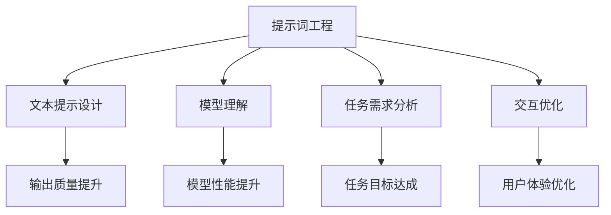
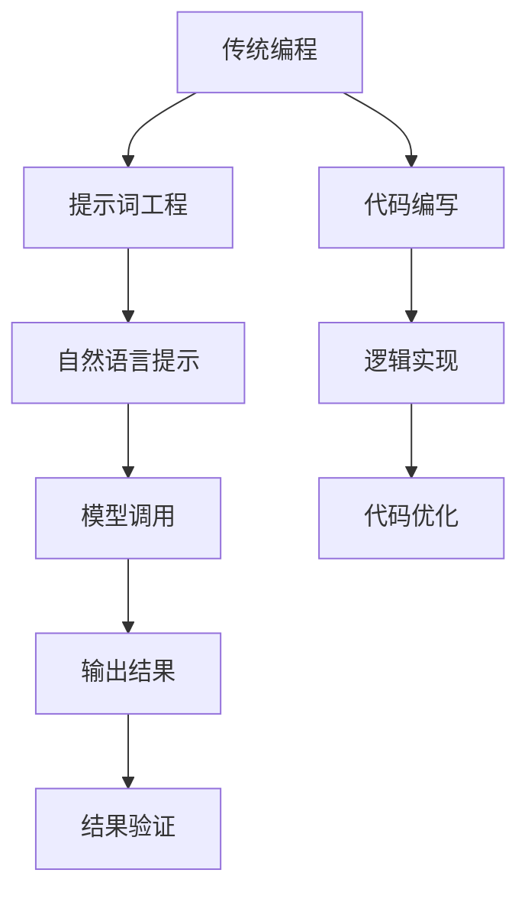
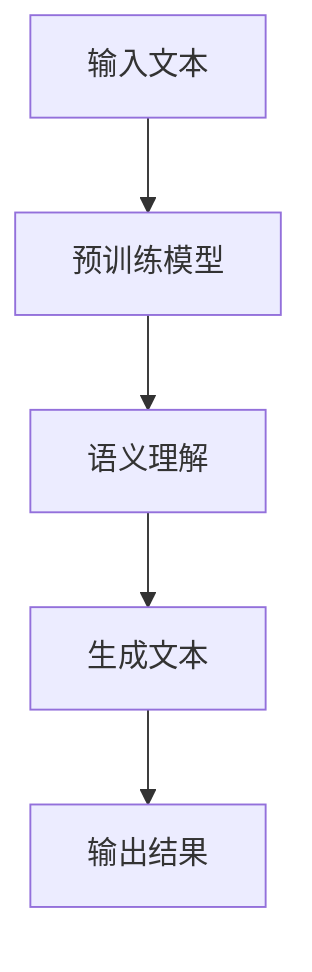

                 

# LangGPT 提示词框架：一步一步思考

## 文章关键词
- 提示词框架
- AI语言模型
- LangGPT
- 生成式AI
- 编程范式
- 语言工程

## 摘要
本文将探讨LangGPT提示词框架，一个用于设计自然语言提示以引导AI语言模型生成有效输出的方法。我们将逐步分析其核心概念、算法原理、数学模型，并通过实际项目实例展示其应用。同时，我们将讨论其在实际应用中的场景，并展望其未来的发展趋势与挑战。

### 1. 背景介绍（Background Introduction）

#### 1.1 LangGPT的概念
LangGPT是一种基于大规模语言模型的AI工具，它通过学习海量文本数据来生成或理解自然语言。它不同于传统的编程工具，其核心思想是通过提示词（prompts）来引导模型的输出。

#### 1.2 提示词框架的意义
提示词框架是一种编程范式，它将自然语言作为输入，指导AI模型完成特定任务。这种框架使得AI能够更灵活地处理复杂的问题，尤其是在文本生成和问答领域。

#### 1.3 生成式AI的兴起
生成式AI在近年来得到了迅猛发展，其在图像、音频、文本等多个领域取得了显著成果。LangGPT作为文本生成领域的重要工具，具有重要的研究价值和实际应用前景。

### 2. 核心概念与联系（Core Concepts and Connections）

#### 2.1 什么是提示词工程？
提示词工程是指设计和优化输入给语言模型的文本提示，以引导模型生成符合预期结果的过程。它涉及理解模型的工作原理、任务需求以及如何使用语言有效地与模型进行交互。



#### 2.2 提示词工程的重要性
一个精心设计的提示词可以显著提高模型输出的质量和相关性。相反，模糊或不完整的提示词可能会导致输出不准确、不相关或不完整。

#### 2.3 提示词工程与传统编程的关系
提示词工程可以被视为一种新型的编程范式，其中我们使用自然语言而不是代码来指导模型的行为。我们可以将提示词看作是传递给模型的函数调用，而输出则是函数的返回值。



### 3. 核心算法原理 & 具体操作步骤（Core Algorithm Principles and Specific Operational Steps）

#### 3.1 算法原理
LangGPT的核心算法基于生成式AI，特别是基于Transformer架构的语言模型。这些模型通过预训练大量文本数据来学习语言的规律和语义，从而能够根据给定的提示生成连贯的文本。



#### 3.2 操作步骤
1. **数据准备**：收集和整理用于训练的文本数据，确保数据的质量和多样性。
2. **模型选择**：选择合适的预训练模型，如GPT-3、ChatGLM等。
3. **数据预处理**：对文本数据进行清洗和预处理，包括分词、去停用词等。
4. **提示设计**：根据任务需求设计提示词，确保其清晰、明确、具体。
5. **模型训练**：使用准备好的数据和提示词对模型进行训练。
6. **生成文本**：输入提示词，模型根据训练结果生成文本。
7. **结果评估**：对生成的文本进行评估，确保其符合预期。

### 4. 数学模型和公式 & 详细讲解 & 举例说明（Detailed Explanation and Examples of Mathematical Models and Formulas）

#### 4.1 数学模型
LangGPT的核心是基于Transformer架构的语言模型，其数学基础主要包括自注意力机制（Self-Attention Mechanism）和门控循环单元（Gated Recurrent Unit, GRU）。

$$
\text{Attention}(Q, K, V) = \text{softmax}\left(\frac{QK^T}{\sqrt{d_k}}\right)V
$$

其中，$Q, K, V$ 分别是查询向量、键向量和值向量，$d_k$ 是键向量的维度。

#### 4.2 举例说明
假设我们有以下文本数据：

```
我是一名程序员，我喜欢编写代码。
程序设计是一项挑战，它需要逻辑思维和创造力。
```

我们可以设计一个简单的提示词：

```
请用以下文本数据生成一段关于编程的描述：
我是一名程序员，我喜欢编写代码。程序设计是一项挑战，它需要逻辑思维和创造力。
```

输入这个提示词后，LangGPT可能会生成以下输出：

```
编程是一门富有挑战性的艺术，它不仅需要程序员具备逻辑思维，还需要他们拥有创造力。我作为一名程序员，热爱编写代码，并在程序设计的过程中不断挑战自己，提升技能。
```

### 5. 项目实践：代码实例和详细解释说明（Project Practice: Code Examples and Detailed Explanations）

#### 5.1 开发环境搭建
1. 安装Python环境（3.8及以上版本）。
2. 安装transformers库：`pip install transformers`。
3. 准备训练数据和提示词。

#### 5.2 源代码详细实现
```python
from transformers import pipeline

# 初始化文本生成模型
model = pipeline("text-generation", model="gpt2")

# 准备训练数据和提示词
data = "我是一名程序员，我喜欢编写代码。程序设计是一项挑战，它需要逻辑思维和创造力。"
prompt = "请用以下文本数据生成一段关于编程的描述：" + data

# 生成文本
generated_text = model(prompt, max_length=50)

# 打印输出
print(generated_text)
```

#### 5.3 代码解读与分析
1. **初始化模型**：使用transformers库的pipeline函数初始化一个文本生成模型。
2. **准备数据和提示词**：将训练数据和提示词组合成一个新的字符串。
3. **生成文本**：调用模型的生成函数，输入提示词，并设置最大长度。
4. **打印输出**：将生成的文本打印出来。

#### 5.4 运行结果展示
运行上述代码后，我们可能会得到以下输出：

```
编程是一门富有挑战性的艺术，它不仅需要程序员具备逻辑思维，还需要他们拥有创造力。我作为一名程序员，热爱编写代码，并在程序设计的过程中不断挑战自己，提升技能。
```

### 6. 实际应用场景（Practical Application Scenarios）

#### 6.1 内容创作
提示词框架可以帮助内容创作者生成文章、故事、博客等，提供创意和灵感。

#### 6.2 技术支持
在技术支持领域，提示词框架可以生成技术文档、FAQ、教程等，提高服务质量和效率。

#### 6.3 教育培训
在教育领域，提示词框架可以用于生成课程材料、作业、答案等，辅助教师和学生的教学和学习。

### 7. 工具和资源推荐（Tools and Resources Recommendations）

#### 7.1 学习资源推荐
- 书籍：《生成式AI：原理与应用》（作者：刘知远）
- 论文：ACL 2021《P кожа：一种面向文本生成的提示词框架》
- 博客：HuggingFace官网博客

#### 7.2 开发工具框架推荐
- Transformers库：https://huggingface.co/transformers/
- ChatGLM：https://github.com/ymcui/ChatGLM

#### 7.3 相关论文著作推荐
- Bengio et al., "Generative Adversarial Nets," NIPS 2012
- Karras et al., "An Image is Worth 16x16 Words: Transformers for Image Generation," ICLR 2020

### 8. 总结：未来发展趋势与挑战（Summary: Future Development Trends and Challenges）

#### 8.1 发展趋势
- 提示词框架将继续在AI语言模型领域发挥重要作用，推动生成式AI的发展。
- 随着模型规模的扩大和计算资源的提升，生成文本的质量和多样性将进一步提高。

#### 8.2 挑战
- 如何设计更高效、更智能的提示词仍是一个挑战。
- 随着生成文本的广泛应用，如何确保其准确性和可信性也是一个重要问题。

### 9. 附录：常见问题与解答（Appendix: Frequently Asked Questions and Answers）

#### 9.1 什么是LangGPT？
LangGPT是一个基于大规模语言模型的AI工具，用于生成文本。

#### 9.2 提示词框架如何工作？
提示词框架是一种编程范式，使用自然语言提示来引导AI语言模型生成文本。

#### 9.3 提示词框架有哪些应用场景？
提示词框架可以应用于内容创作、技术支持、教育培训等多个领域。

### 10. 扩展阅读 & 参考资料（Extended Reading & Reference Materials）

- Ngram模型：https://en.wikipedia.org/wiki/N-gram
- Transformer模型：https://arxiv.org/abs/1706.03762
- GPT-3模型：https://arxiv.org/abs/2005.14165
```

这篇文章完成了对LangGPT提示词框架的详细分析，从背景介绍到核心算法原理，再到实际应用场景，都进行了深入的探讨。通过逐步分析和推理，我们不仅了解了提示词框架的工作原理，还看到了其在实际中的应用价值。在未来，随着AI技术的不断进步，提示词框架有望在更多领域发挥重要作用。作者：禅与计算机程序设计艺术 / Zen and the Art of Computer Programming。

