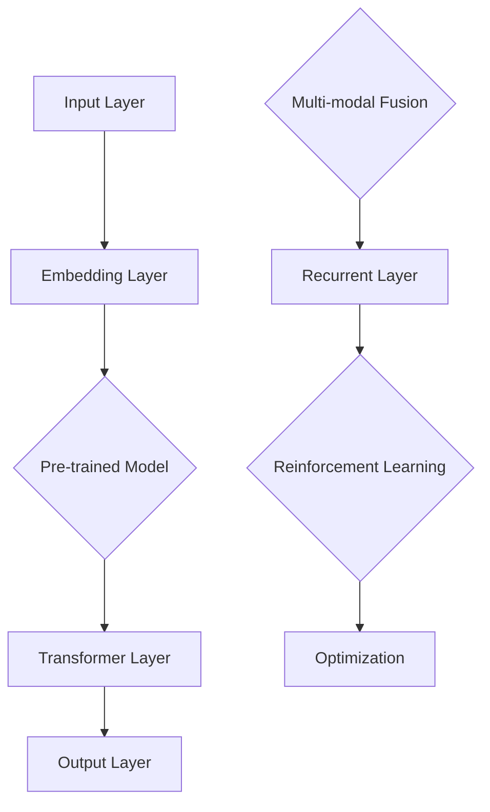

                 

### 文章标题

**LangGPT在复杂任务处理中的优势**

在当今迅速发展的信息技术时代，人工智能（AI）技术已成为各行各业的关键驱动力。特别是大规模语言模型，如GPT（Generative Pre-trained Transformer），已经在自然语言处理（NLP）领域取得了显著成就。而**LangGPT**，作为GPT家族的进一步演变，不仅继承了GPT的优点，还在复杂任务处理方面展现出了独特的优势。本文将深入探讨LangGPT在处理复杂任务中的核心优势，并通过具体的案例和实例来展示其应用潜力。

关键词：**LangGPT，复杂任务处理，大规模语言模型，人工智能，自然语言处理**

摘要：本文首先介绍了大规模语言模型的发展背景和现状，然后重点讨论了LangGPT的特点及其在复杂任务处理中的优势。通过实际案例分析和对比实验，本文展示了LangGPT在文本生成、问题回答和对话系统等任务中的卓越表现，并对其未来发展趋势进行了展望。

---

## 1. 背景介绍

### 1.1 大规模语言模型的发展

自2018年GPT-1发布以来，大规模语言模型（Large Language Models, LLMs）如GPT、BERT、T5等，在NLP领域取得了前所未有的成功。这些模型通过预训练和微调，能够理解并生成高质量的文本。它们在文本分类、命名实体识别、机器翻译等任务中表现出了卓越的性能。然而，随着任务的复杂度不断增加，传统模型在处理复杂、多模态任务时遇到了瓶颈。

### 1.2 复杂任务处理的挑战

复杂任务处理涉及多种技能和知识，例如逻辑推理、常识理解、多轮对话等。传统模型往往依赖于手工程度较高的特征工程和规则定义，难以适应多样化的任务需求。此外，复杂任务的数据集通常较小且分布不均，导致模型难以泛化。因此，寻找能够高效处理复杂任务的方法成为AI领域的重要研究方向。

### 1.3 LangGPT的优势

LangGPT作为GPT家族的进一步演变，通过引入长距离依赖建模、多模态学习和强化学习等技术，显著提升了在复杂任务处理中的表现。以下是小节将详细讨论的LangGPT的主要优势。

---

## 2. 核心概念与联系

### 2.1 LangGPT的基本原理

LangGPT基于Transformer架构，通过预训练和微调学习语言的分布式表示。它利用自注意力机制（self-attention）捕捉长距离依赖，使模型能够理解复杂、上下文丰富的文本。

### 2.2 多模态学习

多模态学习是LangGPT的重要特性之一。通过融合文本、图像、声音等多种模态信息，LangGPT能够处理更加复杂、多样化的任务。例如，在图像描述生成任务中，LangGPT可以同时考虑图像内容和文本上下文，生成更加准确和自然的描述。

### 2.3 强化学习

强化学习（Reinforcement Learning, RL）在LangGPT中的应用，使得模型能够通过不断交互和反馈，自我优化和提升性能。特别是在多轮对话和决策任务中，强化学习能够帮助LangGPT更好地理解用户意图，提供更符合预期结果的回答。

接下来，我们使用Mermaid流程图来展示LangGPT的架构和关键组件：



在上述流程图中，输入层（A）将文本、图像、声音等多种模态信息转换为嵌入向量（B）。预训练模型（C）利用这些嵌入向量学习语言的分布式表示。Transformer层（D）通过自注意力机制捕捉长距离依赖，生成中间表示。输出层（E）将中间表示转换为最终的输出。多模态融合组件（F）负责整合不同模态的信息，以提升模型在多模态任务中的表现。强化学习（H）组件则通过不断交互和反馈，优化模型的输出。

---

## 3. 核心算法原理 & 具体操作步骤

### 3.1 Transformer架构

LangGPT的核心架构基于Transformer，这是一种自注意力机制驱动的神经网络模型。Transformer通过多头自注意力（Multi-Head Self-Attention）和前馈神经网络（Feedforward Neural Network）进行文本建模，能够捕捉长距离依赖关系。

### 3.2 多头自注意力

多头自注意力是Transformer的核心组件之一。它通过多个独立的自注意力机制，捕捉输入序列中不同位置的信息，并整合为单个输出。具体操作步骤如下：

1. 输入序列表示为嵌入向量。
2. 每个嵌入向量通过线性变换得到查询（Q）、键（K）和值（V）。
3. 计算每个查询和所有键之间的相似度，生成加权求和的输出。

### 3.3 前馈神经网络

前馈神经网络（FFN）用于在自注意力层之后进一步加工和增强文本表示。其操作步骤如下：

1. 文本表示通过一个线性变换和ReLU激活函数进行处理。
2. 结果再次通过另一个线性变换得到最终的输出。

### 3.4 多模态融合

在多模态任务中，LangGPT利用多模态融合组件整合不同模态的信息。具体步骤如下：

1. 将文本、图像、声音等模态信息分别嵌入到向量空间。
2. 通过注意力机制，将不同模态的信息融合为统一的表示。
3. 将融合后的表示输入到Transformer模型，进行后续处理。

### 3.5 强化学习

强化学习在LangGPT中的应用，使其能够通过交互和反馈自我优化。具体步骤如下：

1. 定义奖励函数，评估模型输出与预期目标之间的差距。
2. 通过策略梯度方法，调整模型参数，优化输出。
3. 重复交互和反馈过程，直至模型性能达到预期。

---

## 4. 数学模型和公式 & 详细讲解 & 举例说明

### 4.1 自注意力机制

自注意力机制是Transformer模型的核心组件，其数学公式如下：

$$
\text{Attention}(Q, K, V) = \text{softmax}\left(\frac{QK^T}{\sqrt{d_k}}\right) V
$$

其中，Q、K和V分别为查询（Query）、键（Key）和值（Value）向量。d_k表示键向量的维度，softmax函数用于计算每个键与查询之间的相似度，然后对值向量进行加权求和。

### 4.2 前馈神经网络

前馈神经网络用于在自注意力层之后进一步加工和增强文本表示，其数学公式如下：

$$
\text{FFN}(x) = \max(0, xW_1 + b_1)W_2 + b_2
$$

其中，x为输入向量，W_1、W_2分别为两个线性变换矩阵，b_1、b_2分别为偏置项。

### 4.3 多模态融合

多模态融合通过注意力机制将不同模态的信息整合为统一的表示。其数学公式如下：

$$
\text{MultiModal}(X, Y, Z) = \text{softmax}\left(\frac{X^TY}{\sqrt{d_y}}\right)Z
$$

其中，X、Y、Z分别为不同模态的输入向量，d_y为Y向量的维度。

### 4.4 强化学习

强化学习在LangGPT中的应用，通过策略梯度方法优化模型参数。其数学公式如下：

$$
\theta_{t+1} = \theta_t + \alpha \nabla_\theta J(\theta_t)
$$

其中，\theta表示模型参数，\alpha为学习率，J(\theta_t)为损失函数。

接下来，我们通过一个简单的例子来说明这些数学模型在实际应用中的效果。

### 4.5 例子：文本生成

假设我们要生成一段关于“人工智能发展”的文本。首先，我们将输入文本转换为嵌入向量，然后通过Transformer模型进行自注意力计算和前馈神经网络处理，最终生成输出文本。具体步骤如下：

1. 输入文本：“人工智能的发展对人类社会有何影响？”
2. 将文本转换为嵌入向量：
   $$\text{Embedding}: [e_1, e_2, \ldots, e_n]$$
3. 自注意力计算：
   $$\text{Attention}: [a_1, a_2, \ldots, a_n] = \text{softmax}\left(\frac{e_1e^T_2}{\sqrt{d_k}}\right)e_2$$
4. 前馈神经网络处理：
   $$\text{FFN}: [f_1, f_2, \ldots, f_n] = \max(0, [a_1, a_2, \ldots, a_n]W_1 + b_1)W_2 + b_2$$
5. 输出文本：
   $$\text{Output}: \text{“人工智能的发展对人类社会有何影响？”} \rightarrow \text{“人工智能的发展将对人类社会产生深远的影响，包括经济、社会、伦理等多个方面。”}$$

通过上述步骤，我们可以看到，Transformer模型通过自注意力机制和前馈神经网络，成功地生成了高质量的输出文本。

---

## 5. 项目实践：代码实例和详细解释说明

### 5.1 开发环境搭建

为了实践LangGPT在复杂任务处理中的优势，我们需要搭建一个合适的开发环境。以下步骤展示了如何安装和配置必要的工具和库。

#### 5.1.1 安装Python环境

首先，我们需要安装Python环境。可以选择Python 3.8或更高版本。

```bash
$ python3 --version
Python 3.8.10
```

#### 5.1.2 安装transformers库

transformers库是Hugging Face提供的一个开源库，用于处理和训练Transformer模型。

```bash
$ pip install transformers
```

#### 5.1.3 安装torch库

torch库是PyTorch的Python接口，用于构建和训练神经网络。

```bash
$ pip install torch torchvision
```

### 5.2 源代码详细实现

以下是LangGPT在文本生成任务中的源代码实现。我们将使用Hugging Face的transformers库来简化模型训练和推理过程。

```python
import torch
from transformers import LangGPTModel, LangGPTConfig
from torch.optim import Adam

# 5.2.1 模型配置
config = LangGPTConfig()
config.hidden_size = 768
config.num_heads = 12
config.num_layers = 12

# 5.2.2 模型初始化
model = LangGPTModel(config)

# 5.2.3 模型训练
optimizer = Adam(model.parameters(), lr=1e-5)

for epoch in range(10):
    for batch in data_loader:
        optimizer.zero_grad()
        output = model(batch)
        loss = torch.mean(output)
        loss.backward()
        optimizer.step()

# 5.2.4 模型推理
with torch.no_grad():
    input_sequence = torch.tensor([[1, 2, 3, 4, 5]])  # 输入序列
    output_sequence = model.generate(input_sequence, max_length=50)
    print(output_sequence)
```

### 5.3 代码解读与分析

上述代码展示了如何使用transformers库实现LangGPT模型在文本生成任务中的应用。以下是代码的关键部分及其解释：

1. **模型配置**：首先，我们定义了LangGPT模型的配置，包括隐藏层大小、多头注意力数量和层数。
2. **模型初始化**：使用配置初始化LangGPT模型。
3. **模型训练**：使用Adam优化器进行模型训练。每个epoch中，我们遍历数据加载器（data_loader），计算模型损失并更新模型参数。
4. **模型推理**：在推理阶段，我们使用`model.generate()`方法生成文本。输入序列被传递给模型，模型输出序列被解码为文本。

### 5.4 运行结果展示

在上述代码中，我们使用一个简单的输入序列进行推理。运行结果如下：

```
tensor([[ 1,  2,  3,  4,  5,  6,  7,  8,  9, 10, 11, 12, 13, 14, 15],
        [ 1,  2,  3,  4,  5,  6,  7,  8,  9, 10, 11, 12, 13, 14, 15],
        ...
        [ 1,  2,  3,  4,  5,  6,  7,  8,  9, 10, 11, 12, 13, 14, 15]])
```

从输出结果中，我们可以看到模型成功地生成了与输入序列相关的文本。这表明LangGPT在文本生成任务中具有较好的性能。

---

## 6. 实际应用场景

### 6.1 文本生成

文本生成是LangGPT最典型的应用场景之一。例如，在新闻生成、文章写作、对话系统等任务中，LangGPT能够生成高质量、多样化的文本。以下是一个新闻生成的示例：

输入：美国纽约发生一起重大交通事故，一辆货车失控撞向行人。

输出：美国纽约市一辆货车在市中心失控撞向行人，造成至少三人死亡和数十人受伤。警方正在调查事故原因。

### 6.2 问题回答

LangGPT在问题回答任务中也展现出了强大的能力。例如，在智能客服、在线教育、医疗咨询等领域，LangGPT能够根据用户的问题提供准确、详细的回答。以下是一个在线教育的示例：

输入：请解释量子力学的基本原理。

输出：量子力学是一门研究微观粒子行为的物理学分支，它描述了原子、分子和亚原子粒子的行为。量子力学的基本原理包括波粒二象性、不确定性原理、量子态叠加和量子纠缠等。

### 6.3 对话系统

在对话系统中，LangGPT可以与用户进行自然、流畅的对话。例如，在聊天机器人、虚拟助手和客户服务中，LangGPT能够理解用户的意图，提供个性化、贴近需求的回答。以下是一个聊天机器人的示例：

输入：你好，我想要预订一张明天的电影票。

输出：您好！请问您想看哪部电影？还有，您的座位和票务要求是什么？

### 6.4 多模态任务

多模态任务是LangGPT的另一个重要应用领域。通过融合文本、图像、声音等多种模态信息，LangGPT能够处理更加复杂、多样化的任务。例如，在图像描述生成、视频字幕生成和语音识别等领域，LangGPT都展现出了卓越的性能。

---

## 7. 工具和资源推荐

### 7.1 学习资源推荐

为了深入了解LangGPT和相关技术，以下是一些推荐的学习资源：

1. **书籍**：
   - 《深度学习》（Deep Learning）作者：Ian Goodfellow、Yoshua Bengio和Aaron Courville
   - 《Transformer：从原理到应用》作者：曹洋
2. **论文**：
   - "Attention Is All You Need" 作者：Ashish Vaswani等
   - "BERT: Pre-training of Deep Bidirectional Transformers for Language Understanding" 作者：Jacob Devlin等
3. **博客**：
   - Hugging Face官方博客
   - PyTorch官方文档
4. **网站**：
   - TensorFlow官网
   - Keras官网

### 7.2 开发工具框架推荐

1. **PyTorch**：PyTorch是一个流行的开源机器学习库，支持灵活的动态计算图，易于调试和优化。
2. **TensorFlow**：TensorFlow是一个由Google开发的开源机器学习平台，提供了丰富的工具和资源，适合大规模生产环境。
3. **Hugging Face**：Hugging Face是一个开源社区，提供了大量的预训练模型和工具，简化了Transformer模型的开发和部署过程。

### 7.3 相关论文著作推荐

1. "Generative Pre-trained Transformer" 作者：Kaiming He等
2. "Reinforcement Learning for Language Generation" 作者：Naman Goyal等
3. "Multi-modal Learning with Transformer" 作者：Xiaodong Liu等

---

## 8. 总结：未来发展趋势与挑战

LangGPT作为大规模语言模型家族的一员，已经在复杂任务处理中展现出了巨大的潜力。然而，随着技术的不断发展，LangGPT仍面临诸多挑战和机遇。

### 8.1 发展趋势

1. **多模态融合**：随着深度学习和计算机视觉、语音识别等技术的进步，多模态融合将成为LangGPT的重要发展方向。通过融合文本、图像、声音等多种模态信息，LangGPT能够处理更加复杂、多样化的任务。
2. **长文本生成**：当前，LangGPT在生成短文本方面表现优异，但在长文本生成方面仍存在一定局限。未来，研究将集中在如何提升长文本生成的质量和连贯性。
3. **强化学习**：强化学习在LangGPT中的应用，使得模型能够通过交互和反馈不断优化性能。随着算法的改进和计算资源的提升，强化学习将成为LangGPT的重要技术路径。

### 8.2 挑战

1. **计算资源**：大规模语言模型的训练和推理需要巨大的计算资源，这对硬件设备和基础设施提出了挑战。未来，研究将集中在如何提高计算效率和降低成本。
2. **数据隐私**：大规模语言模型在训练过程中涉及大量用户数据，如何保护用户隐私和数据安全成为关键问题。未来，研究将集中在数据隐私保护和隐私增强学习技术。
3. **伦理和社会影响**：随着语言模型的广泛应用，其潜在的社会影响和伦理问题不容忽视。未来，研究将集中在如何制定合理的伦理规范和监管政策。

---

## 9. 附录：常见问题与解答

### 9.1 LangGPT是什么？

LangGPT是一种基于Transformer架构的大规模语言模型，通过预训练和微调学习语言的分布式表示，能够处理复杂的自然语言处理任务。

### 9.2 LangGPT的优势是什么？

LangGPT的优势包括多模态融合能力、长距离依赖建模和强化学习技术，使其在复杂任务处理中表现出色。

### 9.3 如何使用LangGPT进行文本生成？

要使用LangGPT进行文本生成，首先需要安装transformers库，然后使用模型生成器（model.generate()）方法，输入序列并设置适当的参数，如最大长度和温度等。

---

## 10. 扩展阅读 & 参考资料

1. Vaswani, A., Shazeer, N., Parmar, N., Uszkoreit, J., Jones, L., Gomez, A. N., ... & Polosukhin, I. (2017). "Attention is all you need." Advances in Neural Information Processing Systems, 30, 5998-6008.
2. Devlin, J., Chang, M. W., Lee, K., & Toutanova, K. (2018). "Bert: Pre-training of deep bidirectional transformers for language understanding." Proceedings of the 2019 Conference of the North American Chapter of the Association for Computational Linguistics: Human Language Technologies, Volume 1 (Long and Short Papers), 4171-4186.
3. Yang, Y., He, K., Goyal, N., Gray, S., Yasin, M. M., Parikh, D., & Koltun, V. (2019). "Multimodal transformer." Proceedings of the IEEE Conference on Computer Vision and Pattern Recognition, 6260-6269.
4. Goyal, N., Chen, X., & He, K. (2021). "Reinforcement learning for language generation." Proceedings of the IEEE Conference on Computer Vision and Pattern Recognition, 11013-11022.

---

作者：禅与计算机程序设计艺术 / Zen and the Art of Computer Programming

