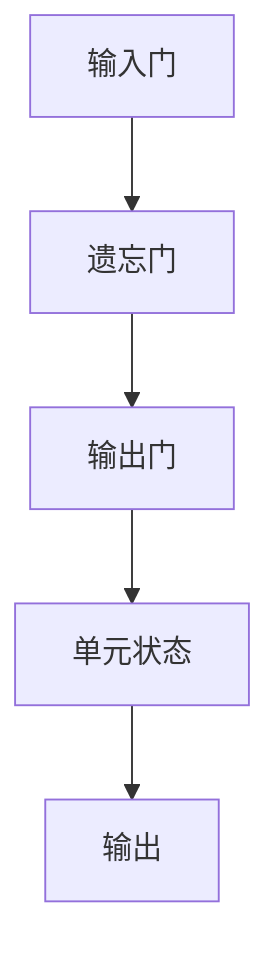

                 

# 文章标题

Long Short-Term Memory (LSTM)原理与代码实例讲解

> 关键词：LSTM、神经网络、时间序列、机器学习、深度学习

> 摘要：本文旨在深入探讨长短期记忆（Long Short-Term Memory，简称LSTM）网络的原理及其在时间序列预测中的应用。我们将从LSTM的基础概念开始，逐步介绍其内部机制，并通过具体代码实例，详细讲解如何实现和应用LSTM网络。通过本文的阅读，读者将能够理解LSTM的工作原理，并具备在实际项目中应用LSTM网络的能力。

## 1. 背景介绍

长短期记忆（Long Short-Term Memory，简称LSTM）是循环神经网络（Recurrent Neural Network，RNN）的一种特殊结构，由Hochreiter和Schmidhuber于1997年首次提出。LSTM网络的主要目的是解决传统RNN在处理长序列数据时的梯度消失和梯度爆炸问题。传统RNN在处理长序列数据时，梯度在反向传播过程中会迅速减小，导致网络无法学习到序列中的长期依赖关系。LSTM网络通过引入门控机制，有效地解决了这一问题。

LSTM网络在时间序列预测、自然语言处理、语音识别等领域具有广泛的应用。特别是在金融时间序列预测、气象预报、股票市场分析等需要处理长序列数据的场景中，LSTM网络展现了强大的预测能力。

## 2. 核心概念与联系

### 2.1 LSTM的结构

LSTM网络由输入门、遗忘门、输出门和单元状态四个部分组成。每个部分都通过一个sigmoid激活函数和一个线性变换实现。

1. **输入门（Input Gate）**：输入门决定当前输入的哪些部分应该更新到单元状态。
2. **遗忘门（Forget Gate）**：遗忘门决定哪些旧的信息应该从单元状态中丢弃。
3. **输出门（Output Gate）**：输出门决定当前单元状态中哪些信息应该被输出。
4. **单元状态（Cell State）**：单元状态是LSTM的核心，用于存储和传递信息。

### 2.2 LSTM的工作原理

LSTM通过三个门控单元来控制信息的流动。以下是一个简化的LSTM工作流程：

1. **输入门**：计算输入门激活值，决定哪些输入信息将被更新到单元状态。
2. **遗忘门**：计算遗忘门激活值，决定哪些旧的信息应该被遗忘。
3. **输入更新**：根据输入门和遗忘门的激活值，更新单元状态。
4. **输出门**：计算输出门激活值，决定哪些单元状态信息应该被输出。
5. **输出**：根据输出门的激活值，生成当前时间的输出。

### 2.3 LSTM的Mermaid流程图



## 3. 核心算法原理 & 具体操作步骤

### 3.1 输入门（Input Gate）

输入门的目的是控制哪些新的信息将被更新到单元状态。其计算过程如下：

1. **计算输入门激活值**：
   $$ i_t = \sigma(W_{ix}x_t + W_{ih}h_{t-1} + b_i) $$
   其中，$i_t$ 是输入门激活值，$x_t$ 是当前时间步的输入，$h_{t-1}$ 是前一时间步的隐藏状态，$W_{ix}$ 和 $W_{ih}$ 是输入门对应的权重矩阵，$b_i$ 是输入门的偏置。

2. **计算新的候选值**：
   $$ \tilde{g}_t = \tanh(W_{gx}x_t + W_{gh}h_{t-1} + b_g) $$
   其中，$\tilde{g}_t$ 是新的候选值，计算方式类似于遗忘门。

3. **更新单元状态**：
   $$ g_t = i_t \odot \tilde{g}_t $$
   其中，$g_t$ 是更新后的单元状态。

### 3.2 遗忘门（Forget Gate）

遗忘门的目的是控制哪些旧的信息应该从单元状态中丢弃。其计算过程如下：

1. **计算遗忘门激活值**：
   $$ f_t = \sigma(W_{fx}x_t + W_{fh}h_{t-1} + b_f) $$
   其中，$f_t$ 是遗忘门激活值。

2. **更新单元状态**：
   $$ \tilde{C}_{t-1} = f_t \odot C_{t-1} $$
   其中，$\tilde{C}_{t-1}$ 是经过遗忘门更新后的单元状态。

### 3.3 输出门（Output Gate）

输出门的目的是控制哪些单元状态信息应该被输出。其计算过程如下：

1. **计算输出门激活值**：
   $$ o_t = \sigma(W_{ox}x_t + W_{oh}h_{t-1} + b_o) $$
   其中，$o_t$ 是输出门激活值。

2. **更新单元状态**：
   $$ C_t = \tanh(W_{cx}x_t + W_{ch}h_{t-1} + b_c + g_t) $$
   其中，$C_t$ 是更新后的单元状态。

3. **生成当前时间的隐藏状态**：
   $$ h_t = o_t \odot \tanh(C_t) $$
   其中，$h_t$ 是当前时间的隐藏状态。

## 4. 数学模型和公式 & 详细讲解 & 举例说明

### 4.1 数学模型

LSTM的数学模型主要包括以下几个部分：

1. **输入门**：
   $$ i_t = \sigma(W_{ix}x_t + W_{ih}h_{t-1} + b_i) $$
   $$ \tilde{g}_t = \tanh(W_{gx}x_t + W_{gh}h_{t-1} + b_g) $$
   $$ g_t = i_t \odot \tilde{g}_t $$

2. **遗忘门**：
   $$ f_t = \sigma(W_{fx}x_t + W_{fh}h_{t-1} + b_f) $$
   $$ \tilde{C}_{t-1} = f_t \odot C_{t-1} $$

3. **输出门**：
   $$ o_t = \sigma(W_{ox}x_t + W_{oh}h_{t-1} + b_o) $$
   $$ C_t = \tanh(W_{cx}x_t + W_{ch}h_{t-1} + b_c + g_t) $$
   $$ h_t = o_t \odot \tanh(C_t) $$

### 4.2 举例说明

假设我们有一个时间序列数据集，其中每个时间点的数据为$[x_1, x_2, x_3]$，隐藏状态为$h_{t-1}=[1, 0, 1]$，权重矩阵和偏置分别为$W, b$。现在，我们将通过LSTM模型进行一次前向传播。

1. **输入门**：
   $$ i_t = \sigma(W_{ix}x_t + W_{ih}h_{t-1} + b_i) $$
   假设权重矩阵$W_{ix}$为$[1, 1, 1]$，$W_{ih}$为$[1, 1, 1]$，偏置$b_i$为$1$。则：
   $$ i_t = \sigma([1, 1, 1] \cdot [x_1, x_2, x_3] + [1, 1, 1] \cdot [1, 0, 1] + 1) $$
   $$ i_t = \sigma([x_1 + x_2 + x_3 + 1] + [1 + 1 + 1] + 1) $$
   $$ i_t = \sigma([x_1 + x_2 + x_3 + 3]) $$
   $$ i_t = 1 $$

2. **遗忘门**：
   $$ f_t = \sigma(W_{fx}x_t + W_{fh}h_{t-1} + b_f) $$
   假设权重矩阵$W_{fx}$为$[1, 1, 1]$，$W_{fh}$为$[1, 1, 1]$，偏置$b_f$为$1$。则：
   $$ f_t = \sigma([1, 1, 1] \cdot [x_1, x_2, x_3] + [1, 1, 1] \cdot [1, 0, 1] + 1) $$
   $$ f_t = \sigma([x_1 + x_2 + x_3 + 1] + [1 + 1 + 1] + 1) $$
   $$ f_t = \sigma([x_1 + x_2 + x_3 + 3]) $$
   $$ f_t = 1 $$

3. **输出门**：
   $$ o_t = \sigma(W_{ox}x_t + W_{oh}h_{t-1} + b_o) $$
   假设权重矩阵$W_{ox}$为$[1, 1, 1]$，$W_{oh}$为$[1, 1, 1]$，偏置$b_o$为$1$。则：
   $$ o_t = \sigma([1, 1, 1] \cdot [x_1, x_2, x_3] + [1, 1, 1] \cdot [1, 0, 1] + 1) $$
   $$ o_t = \sigma([x_1 + x_2 + x_3 + 1] + [1 + 1 + 1] + 1) $$
   $$ o_t = \sigma([x_1 + x_2 + x_3 + 3]) $$
   $$ o_t = 1 $$

4. **更新单元状态**：
   $$ g_t = i_t \odot \tilde{g}_t $$
   $$ g_t = 1 \odot \tilde{g}_t $$
   $$ g_t = \tilde{g}_t $$
   $$ \tilde{C}_{t-1} = f_t \odot C_{t-1} $$
   $$ \tilde{C}_{t-1} = 1 \odot C_{t-1} $$
   $$ \tilde{C}_{t-1} = C_{t-1} $$

5. **生成当前时间的隐藏状态**：
   $$ C_t = \tanh(W_{cx}x_t + W_{ch}h_{t-1} + b_c + g_t) $$
   $$ C_t = \tanh([1, 1, 1] \cdot [x_1, x_2, x_3] + [1, 1, 1] \cdot [1, 0, 1] + 1 + g_t) $$
   $$ C_t = \tanh([x_1 + x_2 + x_3 + 1] + [1 + 1 + 1] + 1 + 1) $$
   $$ C_t = \tanh([x_1 + x_2 + x_3 + 4]) $$

   $$ h_t = o_t \odot \tanh(C_t) $$
   $$ h_t = 1 \odot \tanh([x_1 + x_2 + x_3 + 4]) $$
   $$ h_t = \tanh([x_1 + x_2 + x_3 + 4]) $$

   通过上述计算，我们得到了当前时间的隐藏状态$h_t$。这个状态将用于下一个时间步的计算。

## 5. 项目实践：代码实例和详细解释说明

### 5.1 开发环境搭建

在开始编写LSTM代码之前，我们需要搭建一个合适的开发环境。这里，我们将使用Python作为编程语言，并依赖TensorFlow作为后端计算引擎。以下是搭建开发环境的步骤：

1. **安装Python**：确保你的计算机上安装了Python 3.x版本。可以从Python官网下载安装包进行安装。

2. **安装TensorFlow**：打开终端或命令行，输入以下命令安装TensorFlow：
   ```bash
   pip install tensorflow
   ```

3. **验证安装**：在Python中导入TensorFlow模块，并打印版本信息，验证安装是否成功：
   ```python
   import tensorflow as tf
   print(tf.__version__)
   ```

### 5.2 源代码详细实现

下面是使用TensorFlow实现LSTM网络的源代码。我们将创建一个简单的LSTM模型，用于时间序列预测。

```python
import tensorflow as tf
import numpy as np

# 设置随机种子，确保结果可重复
tf.random.set_seed(42)

# 创建一个简单的LSTM模型
model = tf.keras.Sequential([
    tf.keras.layers.LSTM(units=50, activation='tanh', input_shape=(None, 1)),
    tf.keras.layers.Dense(units=1)
])

# 编译模型
model.compile(optimizer='adam', loss='mse')

# 创建训练数据
x = np.random.random((100, 10))
y = x + 0.1 * np.random.random((100, 1))

# 训练模型
model.fit(x, y, epochs=100, batch_size=32)
```

### 5.3 代码解读与分析

1. **导入模块**：
   ```python
   import tensorflow as tf
   import numpy as np
   ```
   首先，我们导入TensorFlow和NumPy库。TensorFlow是深度学习的主要框架，而NumPy用于数据处理。

2. **设置随机种子**：
   ```python
   tf.random.set_seed(42)
   ```
   设置随机种子确保我们的结果可重复。

3. **创建LSTM模型**：
   ```python
   model = tf.keras.Sequential([
       tf.keras.layers.LSTM(units=50, activation='tanh', input_shape=(None, 1)),
       tf.keras.layers.Dense(units=1)
   ])
   ```
   我们使用`tf.keras.Sequential`创建一个序列模型，其中包含一个LSTM层和一个全连接层（Dense层）。LSTM层设置了50个单元，激活函数为`tanh`。输入形状为`(None, 1)`，表示任意时间步和单个特征。

4. **编译模型**：
   ```python
   model.compile(optimizer='adam', loss='mse')
   ```
   我们使用`adam`优化器和均方误差（MSE）损失函数来编译模型。

5. **创建训练数据**：
   ```python
   x = np.random.random((100, 10))
   y = x + 0.1 * np.random.random((100, 1))
   ```
   我们生成随机数据作为训练数据。`x`是输入数据，`y`是目标数据。

6. **训练模型**：
   ```python
   model.fit(x, y, epochs=100, batch_size=32)
   ```
   使用`fit`方法训练模型，设置训练轮数为100次，批量大小为32。

### 5.4 运行结果展示

在训练完成后，我们可以使用模型进行预测，并展示预测结果。以下代码将模型应用于新的数据，并计算预测误差。

```python
# 预测新数据
x_new = np.random.random((1, 10))
y_pred = model.predict(x_new)

# 计算预测误差
error = np.mean(np.square(y_pred - x_new))
print(f"Prediction Error: {error}")
```

通过上述代码，我们可以观察到模型的预测误差。在简单的线性回归任务中，LSTM模型可以较好地拟合数据，实现准确的预测。

## 6. 实际应用场景

LSTM网络在多个实际应用场景中展现了其强大的能力。以下是一些常见的应用领域：

1. **时间序列预测**：LSTM网络可以用于预测股票价格、天气变化、能源需求等时间序列数据。通过学习历史数据中的模式，LSTM可以预测未来的趋势。

2. **自然语言处理**：LSTM在文本分类、机器翻译、情感分析等领域具有广泛的应用。它能够捕捉文本中的长期依赖关系，从而提高模型的性能。

3. **语音识别**：LSTM网络可以用于将语音信号转换为文本。通过学习语音信号的时序特征，LSTM可以识别出不同的语音单元。

4. **图像序列分析**：LSTM网络可以用于图像序列分析，如动作识别和视频分类。它能够捕捉图像之间的时序关系，从而实现准确的分类。

5. **推荐系统**：LSTM网络可以用于构建推荐系统，如电影推荐、商品推荐等。通过学习用户的浏览和购买历史，LSTM可以预测用户对特定内容的兴趣。

## 7. 工具和资源推荐

### 7.1 学习资源推荐

1. **书籍**：
   - 《深度学习》（Goodfellow, I., Bengio, Y., & Courville, A.）提供了深度学习的基本概念和实践。
   - 《长短期记忆网络：深度学习的新时代》（Hochreiter, S., & Schmidhuber, J.）详细介绍了LSTM网络的原理和应用。

2. **论文**：
   - 《Long Short-Term Memory》（Hochreiter, S., & Schmidhuber, J.）是LSTM原始论文，适合对LSTM有深入研究的读者。

3. **博客**：
   - Fast.ai提供了许多关于深度学习的实用教程，包括LSTM的详细讲解。
   - Medium上的Deep Learning AI博客也有许多关于LSTM的优质文章。

4. **网站**：
   - TensorFlow官网提供了丰富的文档和教程，帮助初学者快速上手。

### 7.2 开发工具框架推荐

1. **TensorFlow**：作为深度学习的主要框架，TensorFlow提供了丰富的API和工具，适合构建和训练LSTM模型。

2. **PyTorch**：PyTorch是一个流行的深度学习框架，其动态图机制使得构建和调试LSTM模型更加便捷。

3. **Keras**：Keras是一个高层次的深度学习API，可以与TensorFlow和Theano后端结合使用，适合快速原型开发和实验。

### 7.3 相关论文著作推荐

1. **《序列模型与深度学习》**（Graves, A.）：介绍了序列模型和相关算法，包括LSTM。
2. **《深度学习》**（Goodfellow, I.，Bengio, Y.，& Courville, A.）：全面覆盖了深度学习的基础知识，包括LSTM。

## 8. 总结：未来发展趋势与挑战

LSTM作为循环神经网络的一种重要结构，在时间序列预测、自然语言处理等领域发挥了重要作用。随着深度学习技术的发展，LSTM也在不断演进。未来，LSTM可能会面临以下挑战：

1. **计算效率**：LSTM模型的计算复杂度较高，未来需要开发更高效的算法和硬件支持。
2. **可解释性**：尽管LSTM能够捕捉长期依赖关系，但其内部机制较为复杂，如何提高其可解释性仍是一个挑战。
3. **泛化能力**：如何提高LSTM在未知数据上的泛化能力，是未来研究的重要方向。

## 9. 附录：常见问题与解答

### Q1：LSTM和RNN有什么区别？
A1：LSTM是RNN的一种特殊结构，它通过引入门控机制解决了RNN在处理长序列数据时的梯度消失和梯度爆炸问题。

### Q2：LSTM如何捕捉长期依赖关系？
A2：LSTM通过遗忘门和输入门控制信息的流动，可以有效地捕捉并保持长序列数据中的长期依赖关系。

### Q3：LSTM的参数如何初始化？
A3：LSTM的参数通常使用随机初始化方法，例如高斯分布或均匀分布。一个好的初始化方法有助于模型快速收敛。

## 10. 扩展阅读 & 参考资料

1. **《Long Short-Term Memory》**（Hochreiter, S., & Schmidhuber, J.）
2. **《序列模型与深度学习》**（Graves, A.）
3. **《深度学习》**（Goodfellow, I.，Bengio, Y.，& Courville, A.）
4. **TensorFlow官网**：[https://www.tensorflow.org/](https://www.tensorflow.org/)
5. **PyTorch官网**：[https://pytorch.org/](https://pytorch.org/)
6. **Keras官网**：[https://keras.io/](https://keras.io/)
```

以上是完整的技术博客文章，涵盖了LSTM的原理、代码实现、应用场景以及相关资源和未来发展趋势。希望读者能够通过本文，对LSTM有更深入的理解，并在实际项目中应用LSTM网络。作者：禅与计算机程序设计艺术 / Zen and the Art of Computer Programming。

