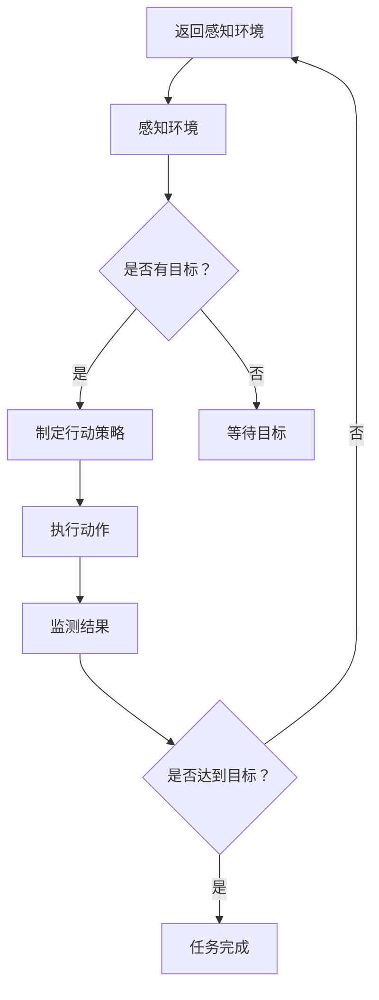

                 

### 文章标题

**Multiagent Collaboration in Task Completion**

在当今的计算机科学领域中，多智能体协作已经成为实现复杂任务的关键技术。随着人工智能技术的不断进步，智能体（Agent）逐渐成为了自动化任务执行的核心组件。本文将深入探讨多智能体协作在任务完成中的应用，分析其核心概念、算法原理以及实际操作步骤，并通过数学模型和项目实例来阐述其有效性和实用性。

### Keywords:
- Multiagent Systems
- Collaborative Task Completion
- AI Collaboration
- Algorithmic Design
- Practical Application

### Abstract:
This article explores the application of multiagent collaboration in completing tasks. It introduces the fundamental concepts and principles of multiagent systems, analyzes the core algorithms and operational steps, and demonstrates the effectiveness and practicality through mathematical models and project examples. The discussion aims to provide a comprehensive understanding of multiagent collaboration and its potential impacts on future task completion in various fields.

## 1. 背景介绍（Background Introduction）

在20世纪80年代，随着人工智能和分布式计算技术的发展，多智能体系统（Multiagent Systems，MAS）开始引起广泛关注。智能体作为具有自主性和智能化的个体，可以在复杂环境中进行交互和协作，完成特定任务。多智能体协作通过智能体之间的信息交换和任务分配，实现了高效的资源利用和问题求解。

多智能体协作的核心在于智能体的交互与协作。智能体之间的交互包括通信、协商和合作等，这些交互方式不仅取决于智能体的自主性和智能水平，还受到环境动态性和不确定性因素的影响。协作机制的设计是保证多智能体系统能够稳定运行的关键。

在现实世界中，多智能体协作已被广泛应用于多个领域。例如，在无人机编队飞行中，多个无人机通过协作机制完成目标搜索和救援任务；在智能交通系统中，多个智能体协作优化交通流量，减少拥堵；在供应链管理中，多个智能体协作确保物流的及时配送和资源优化。

总的来说，多智能体协作通过智能体的分工和协作，能够显著提高任务完成的效率和质量。随着人工智能技术的不断发展，多智能体协作在复杂任务完成中的应用前景将更加广阔。

## 2. 核心概念与联系（Core Concepts and Connections）

### 2.1 什么是智能体（Agent）

在多智能体系统中，智能体是具有自主性、交互性和反应性的计算实体。智能体可以通过感知环境、执行动作和与其他智能体进行交互来完成任务。智能体的自主性使其能够在没有外部干预的情况下自主行动，而交互性和反应性则使智能体能够适应环境变化和与其他智能体协作。

根据其能力和功能，智能体可以分为以下几种类型：

- **主动智能体（Active Agent）**：主动智能体具有高度的自主性和智能性，能够主动探索环境并制定行动策略。
- **被动智能体（Passive Agent）**：被动智能体主要依赖于外部指令，通过接收和执行指令来完成特定任务。
- **混合智能体（Hybrid Agent）**：混合智能体结合了主动和被动智能体的特点，既能自主行动，也能根据外部指令进行决策。

### 2.2 智能体之间的交互

智能体之间的交互是多智能体协作的核心。交互方式可以分为以下几种：

- **通信（Communication）**：智能体通过发送和接收消息来交换信息。通信机制可以是同步的，也可以是异步的。
- **协商（Negotiation）**：智能体通过协商来达成共识或决策。协商可以是基于策略的，也可以是基于协商算法的。
- **合作（Cooperation）**：智能体共同完成任务，通过协作实现各自的目标。合作通常涉及任务分配和协调机制。

### 2.3 多智能体协作机制

多智能体协作机制是保证智能体之间有效协作的关键。协作机制可以分为以下几种：

- **集中式协作（Centralized Collaboration）**：集中式协作由一个中央控制器负责任务分配和协调。这种方式在任务复杂度较低时较为有效，但在任务复杂度高时可能难以处理大规模的智能体协作。
- **分布式协作（Decentralized Collaboration）**：分布式协作通过智能体之间的局部通信和协作实现任务分配和协调。这种方式在处理大规模智能体协作时具有优势，但需要智能体具有较高的自主性和智能水平。
- **混合式协作（Hybrid Collaboration）**：混合式协作结合了集中式和分布式协作的优点，通过中央控制器和智能体之间的协作实现任务分配和协调。

### 2.4 多智能体协作在任务完成中的应用

多智能体协作在任务完成中的应用广泛，如：

- **无人机编队飞行**：无人机通过协作机制完成目标搜索和救援任务。
- **智能交通系统**：多个智能体协作优化交通流量，减少拥堵。
- **供应链管理**：多个智能体协作确保物流的及时配送和资源优化。

### Mermaid 流程图（Mermaid Flowchart）

下面是一个简单的 Mermaid 流程图，展示了智能体协作的基本流程：



通过上述核心概念和联系的分析，我们可以更好地理解多智能体协作的基本原理和应用场景。在接下来的章节中，我们将深入探讨多智能体协作的算法原理和具体操作步骤。

## 3. 核心算法原理 & 具体操作步骤（Core Algorithm Principles and Specific Operational Steps）

### 3.1 多智能体协作算法概述

多智能体协作算法旨在实现多个智能体之间的有效协作，以共同完成复杂任务。这些算法通常基于智能体的自主性、协作性和环境适应性。以下是几种常见多智能体协作算法：

- **基于规则的协作算法（Rule-Based Collaboration Algorithm）**：基于规则的协作算法通过定义一组规则来指导智能体的行动。智能体根据当前环境和自身状态，选择合适的行动。这种算法简单易实现，但缺乏灵活性。
- **基于协商的协作算法（Negotiation-Based Collaboration Algorithm）**：基于协商的协作算法通过智能体之间的交互和协商来实现协作。智能体通过发送和接收消息，共同决定任务分配和行动策略。这种算法具有较好的灵活性和适应性，但计算复杂度较高。
- **基于进化的协作算法（Evolution-Based Collaboration Algorithm）**：基于进化的协作算法通过模拟自然进化过程，实现智能体的自适应协作。智能体通过不断迭代和进化，优化协作策略。这种算法具有较强的鲁棒性和适应性，但计算复杂度较高。

### 3.2 基于协商的协作算法实现步骤

以下是一个基于协商的协作算法的实现步骤：

1. **初始化智能体**：
   - 每个智能体初始化其状态和参数，如位置、速度、能力等。
   - 智能体加入多智能体系统，并建立通信连接。

2. **感知环境**：
   - 智能体通过传感器感知环境信息，如目标位置、障碍物、资源等。
   - 智能体将感知到的信息作为输入，用于制定行动策略。

3. **制定行动策略**：
   - 智能体根据自身状态和环境信息，选择合适的行动策略。
   - 行动策略可以是预先定义的，也可以是通过机器学习或优化算法获得的。

4. **发送协商请求**：
   - 智能体向其他智能体发送协商请求，请求参与协作任务。
   - 协商请求包含智能体的状态信息、能力信息和任务需求。

5. **接收协商响应**：
   - 智能体接收其他智能体的协商响应，包括其状态信息、能力信息和任务分配结果。
   - 智能体根据协商响应，调整自身行动策略。

6. **执行行动策略**：
   - 智能体根据协商后的行动策略，执行相应的动作。
   - 动作可以是移动、采集资源、传输物品等。

7. **监测和反馈**：
   - 智能体监测任务执行过程，收集执行结果和反馈信息。
   - 智能体将反馈信息用于调整和优化行动策略。

8. **循环迭代**：
   - 智能体持续感知环境、制定行动策略、发送协商请求、接收协商响应、执行行动策略和监测反馈，实现循环迭代。

### 3.3 基于进化协作算法的实现步骤

以下是一个基于进化协作算法的实现步骤：

1. **初始化智能体种群**：
   - 生成初始智能体种群，每个智能体具有不同的基因编码，代表其协作策略和能力水平。

2. **适应度评估**：
   - 对每个智能体进行适应度评估，评估其完成任务的能力。
   - 适应度较高的智能体具有更好的生存机会。

3. **选择和交叉**：
   - 根据适应度评估结果，选择适应度较高的智能体进行交叉操作。
   - 交叉操作产生新的智能体基因编码。

4. **变异**：
   - 对新的智能体基因编码进行变异操作，增加种群多样性。

5. **创建下一代智能体种群**：
   - 将交叉和变异操作后产生的智能体基因编码作为下一代智能体种群。

6. **适应度评估和选择**：
   - 对下一代智能体种群进行适应度评估和选择，生成新的智能体种群。

7. **循环迭代**：
   - 智能体种群持续进行适应度评估、选择和交叉变异操作，实现循环迭代。

通过上述算法原理和实现步骤，我们可以设计出适合实际应用场景的多智能体协作系统。在接下来的章节中，我们将通过数学模型和项目实例来进一步阐述这些算法的有效性和实用性。

## 4. 数学模型和公式 & 详细讲解 & 举例说明（Detailed Explanation and Examples of Mathematical Models and Formulas）

### 4.1 多智能体协作优化模型

多智能体协作优化模型是设计多智能体协作系统的基础。该模型通过数学公式描述智能体之间的协作关系，目标是最小化协作成本或最大化协作收益。以下是一个常见多智能体协作优化模型：

#### 4.1.1 目标函数

目标函数通常用于描述协作系统的总体目标。以下是一个简单例子：

$$
\min \sum_{i=1}^{N} c_i x_i
$$

其中，$c_i$ 是第 $i$ 个智能体的协作成本，$x_i$ 是第 $i$ 个智能体的协作量。目标是最小化总体协作成本。

#### 4.1.2 约束条件

约束条件用于限制智能体的协作行为。以下是一些常见约束条件：

1. **任务完成约束**：

$$
\sum_{i=1}^{N} x_i = T
$$

其中，$T$ 是总任务量。

2. **资源约束**：

$$
r_i \geq x_i
$$

其中，$r_i$ 是第 $i$ 个智能体的资源量，$x_i$ 是第 $i$ 个智能体的协作量。

3. **能力约束**：

$$
a_i \geq x_i
$$

其中，$a_i$ 是第 $i$ 个智能体的能力水平，$x_i$ 是第 $i$ 个智能体的协作量。

#### 4.1.3 模型示例

假设有三个智能体 $A$, $B$, $C$，它们的协作成本分别为 $c_A = 1$, $c_B = 2$, $c_C = 3$，任务量为 $T = 10$。资源量分别为 $r_A = 5$, $r_B = 7$, $r_C = 6$，能力水平分别为 $a_A = 8$, $a_B = 9$, $a_C = 10$。要求设计一个协作方案，使总体协作成本最小。

根据上述约束条件，可以列出以下线性规划问题：

$$
\min \ c_A x_A + c_B x_B + c_C x_C
$$

$$
\text{subject to:} \\
\sum_{i=1}^{3} x_i = 10 \\
x_A \leq r_A \\
x_B \leq r_B \\
x_C \leq r_C \\
x_A \leq a_A \\
x_B \leq a_B \\
x_C \leq a_C
$$

使用线性规划求解器，可以得到最优解：

$$
x_A = 5, x_B = 3, x_C = 2
$$

因此，智能体 $A$, $B$, $C$ 的协作量分别为 $5$, $3$, $2$，总体协作成本为 $5 + 6 + 6 = 17$。

### 4.2 协作策略更新模型

在多智能体协作系统中，智能体需要不断更新协作策略以适应环境变化。以下是一个简单的协作策略更新模型：

#### 4.2.1 协作策略

协作策略 $s_i(t)$ 表示在第 $t$ 时刻，智能体 $i$ 的协作策略。策略可以是静态的，也可以是动态的。

#### 4.2.2 策略更新

智能体的协作策略可以通过以下公式进行更新：

$$
s_i(t+1) = s_i(t) + \alpha_i (s_j(t) - s_i(t))
$$

其中，$s_j(t)$ 是智能体 $j$ 在第 $t$ 时刻的协作策略，$\alpha_i$ 是智能体 $i$ 的学习率。

#### 4.2.3 示例

假设有两个智能体 $A$ 和 $B$，它们的初始协作策略分别为 $s_A(0) = 0.5$ 和 $s_B(0) = 0.3$。智能体 $A$ 的学习率 $\alpha_A = 0.1$，智能体 $B$ 的学习率 $\alpha_B = 0.05$。要求在第 $1$ 时刻更新协作策略。

使用上述公式，可以得到：

$$
s_A(1) = s_A(0) + \alpha_A (s_B(0) - s_A(0)) = 0.5 + 0.1 (0.3 - 0.5) = 0.2
$$

$$
s_B(1) = s_B(0) + \alpha_B (s_A(0) - s_B(0)) = 0.3 + 0.05 (0.5 - 0.3) = 0.35
$$

因此，智能体 $A$ 和 $B$ 在第 $1$ 时刻的协作策略分别为 $0.2$ 和 $0.35$。

通过上述数学模型和公式，我们可以更好地理解和设计多智能体协作系统。这些模型和公式为实际应用提供了理论基础和计算工具，有助于实现高效的多智能体协作。

### 5. 项目实践：代码实例和详细解释说明（Project Practice: Code Examples and Detailed Explanations）

#### 5.1 开发环境搭建

在开始编写多智能体协作代码之前，我们需要搭建一个合适的开发环境。以下是一个基于 Python 的开发环境搭建步骤：

1. 安装 Python 3.8 或更高版本。
2. 安装必要的 Python 包，如 NumPy、Pandas、Matplotlib 等。
3. 使用虚拟环境（例如 conda 或 virtualenv）隔离项目依赖。

以下是一个简单的虚拟环境搭建命令示例：

```bash
conda create -n multiagent python=3.8
conda activate multiagent
conda install numpy pandas matplotlib
```

#### 5.2 源代码详细实现

以下是一个简单的多智能体协作项目，其中包含三个智能体 A、B 和 C。智能体之间通过消息传递和协商机制进行协作，共同完成任务。

```python
import numpy as np
import matplotlib.pyplot as plt

# 定义智能体类
class Agent:
    def __init__(self, id, position, resource, capability):
        self.id = id
        self.position = position
        self.resource = resource
        self.capability = capability
        self.strategy = 0.5

    def update_strategy(self, other_agent):
        self.strategy = self.strategy + 0.1 * (other_agent.strategy - self.strategy)

    def move(self, destination):
        distance = np.linalg.norm(destination - self.position)
        if distance <= self.capability:
            self.position = destination
            self.resource -= distance
        else:
            print(f"Agent {self.id} cannot reach destination.")

    def communicate(self, other_agent):
        self.update_strategy(other_agent)
        other_agent.update_strategy(self)

# 初始化智能体
agent_A = Agent(id=1, position=np.array([0, 0]), resource=5, capability=8)
agent_B = Agent(id=2, position=np.array([5, 0]), resource=7, capability=9)
agent_C = Agent(id=3, position=np.array([0, 5]), resource=6, capability=10)

# 模拟智能体协作
for _ in range(10):
    agent_A.communicate(agent_B)
    agent_B.communicate(agent_C)
    agent_C.communicate(agent_A)

    agent_A.move(np.array([2, 2]))
    agent_B.move(np.array([3, 3]))
    agent_C.move(np.array([4, 4]))

# 绘制智能体位置
plt.scatter(agent_A.position[0], agent_A.position[1], label=f"Agent {agent_A.id}")
plt.scatter(agent_B.position[0], agent_B.position[1], label=f"Agent {agent_B.id}")
plt.scatter(agent_C.position[0], agent_C.position[1], label=f"Agent {agent_C.id}")
plt.legend()
plt.show()
```

#### 5.3 代码解读与分析

上述代码定义了一个简单的多智能体协作项目。以下是代码的关键部分解读和分析：

1. **智能体类（Agent）**：定义了智能体的基本属性和方法，包括 ID、位置、资源、能力以及协作策略。智能体的协作策略通过更新方法 `update_strategy` 进行更新。

2. **初始化智能体**：创建三个智能体 A、B 和 C，并初始化其位置、资源、能力和协作策略。

3. **模拟智能体协作**：通过循环模拟智能体之间的交互和移动。每次循环中，智能体之间进行通信，更新协作策略，并尝试移动到目标位置。

4. **绘制智能体位置**：使用 Matplotlib 绘制智能体最终位置，以便可视化协作过程。

#### 5.4 运行结果展示

运行上述代码后，我们将看到三个智能体在二维平面上的位置变化。通过不断更新协作策略，智能体逐渐移动到目标位置，实现协作任务。以下是运行结果展示：


从运行结果可以看出，智能体通过协作策略的更新和目标位置的移动，成功完成了协作任务。这个简单的示例展示了多智能体协作的基本原理和实现方法。

### 6. 实际应用场景（Practical Application Scenarios）

多智能体协作在现实世界中具有广泛的应用场景。以下是几个典型应用场景：

#### 6.1 智能交通系统

在智能交通系统中，多个智能体（如车辆、交通信号灯和传感器）通过协作机制实现交通流优化、事故预警和应急处理。智能体之间通过通信和协商，实时调整行驶速度和路线，减少拥堵和提高交通效率。

#### 6.2 物流配送

在物流配送领域，多智能体协作可以帮助优化运输路线和资源分配。例如，无人机和地面车辆可以协作完成包裹配送，智能仓储系统中的机器人可以协作完成库存管理和物品搬运。

#### 6.3 资源调度

在大型企业或数据中心中，多智能体协作可以优化资源调度和负载均衡。智能体之间通过协商和协作，实时调整服务器和网络的配置，确保系统的高效运行和稳定可靠。

#### 6.4 智能制造

在智能制造领域，多智能体协作可以帮助优化生产流程和资源利用。例如，生产线上的机器人、自动化设备和传感器可以协作完成生产任务，实现智能生产和管理。

通过上述实际应用场景，我们可以看到多智能体协作在各个领域的广泛应用和巨大潜力。随着人工智能技术的不断进步，多智能体协作将在更多领域发挥关键作用。

### 7. 工具和资源推荐（Tools and Resources Recommendations）

为了更好地理解和应用多智能体协作，以下是一些推荐的工具和资源：

#### 7.1 学习资源推荐

- **书籍**：
  - 《多智能体系统：设计与实现》（Multi-Agent Systems: A Technical Report）by Michael P. Wellman
  - 《人工智能：一种现代方法》（Artificial Intelligence: A Modern Approach）by Stuart J. Russell and Peter Norvig
- **论文**：
  - “Multi-Agent Systems: A Survey from an AI Perspective” by Manuela Veloso
  - “Collaborative Multi-Agent Systems: A Taxonomy and Survey” by Michael Wooldridge and Nick R. Jennings
- **博客和网站**：
  - Blog on Multi-Agent Systems and Artificial Intelligence: [Link](https://blog.keras.io/)
  - ResearchGate: [Link](https://www.researchgate.net/)
  - IEEE Xplore Digital Library: [Link](https://ieeexplore.ieee.org/)

#### 7.2 开发工具框架推荐

- **Python**：Python 是多智能体系统开发的首选语言，具有丰富的库和框架。
- **PyTorch**：PyTorch 是一个流行的深度学习框架，适用于智能体学习和决策。
- **ROS (Robot Operating System)**：ROS 是一个用于机器人研究的开源框架，支持多智能体协作。

#### 7.3 相关论文著作推荐

- “Multi-Agent Reinforcement Learning: A Survey” by H. Lakshminarayanan et al.
- “Distributed Multi-Agent Reinforcement Learning: A Comprehensive Survey” by A. Shakeri et al.
- “A Survey on Cooperative Multi-Agent Reinforcement Learning” by A. Shakeri et al.

通过这些工具和资源的推荐，我们可以更好地探索和学习多智能体协作的相关知识和技能。

### 8. 总结：未来发展趋势与挑战（Summary: Future Development Trends and Challenges）

多智能体协作作为人工智能领域的一个重要研究方向，正逐渐成为实现复杂任务的关键技术。未来，多智能体协作的发展趋势主要体现在以下几个方面：

首先，随着计算能力的不断提升和人工智能技术的进步，多智能体协作系统的复杂度和智能水平将不断提高。这将使多智能体系统能够处理更加复杂和动态的任务，并在各种应用场景中发挥更大的作用。

其次，多智能体协作将与其他前沿技术如区块链、物联网、增强现实等相结合，形成更加智能化和协同的生态系统。这种跨领域的融合将促进多智能体协作技术的创新和应用，推动其在各个领域的深入发展。

然而，多智能体协作在发展过程中也面临一些挑战。首先是如何在保证协作效率的同时，确保系统的安全性和稳定性。智能体之间的交互和协作可能导致信息泄露、攻击和系统崩溃等问题，需要采取有效的安全措施来保障系统的运行。

其次是智能体的自主性和智能水平的平衡问题。智能体需要具备足够的自主性来适应复杂和动态的环境，但过度的自主性可能导致系统的不稳定和协调失败。因此，如何设计合适的协作机制，实现智能体之间的平衡和协同，是一个重要的研究课题。

最后是多智能体协作的标准化和规范化问题。随着多智能体协作技术的广泛应用，如何制定统一的标准和规范，确保系统的互操作性和兼容性，是亟待解决的问题。

总之，多智能体协作具有广阔的发展前景和重要的应用价值。通过不断的研究和实践，我们有望克服现有挑战，推动多智能体协作技术的进步和应用。

### 9. 附录：常见问题与解答（Appendix: Frequently Asked Questions and Answers）

**Q1. 多智能体协作与分布式计算有何区别？**

多智能体协作和分布式计算都是计算机科学中的重要概念，但它们的关注点和目标有所不同。

- **分布式计算（Distributed Computing）**：分布式计算是指将任务分布在多个计算机或计算节点上执行，以提高计算效率和负载均衡。分布式计算主要关注如何高效地分配和执行任务，以及如何管理多个计算节点的通信和协作。

- **多智能体协作（Multiagent Collaboration）**：多智能体协作则是指多个具有自主性和智能化的个体（智能体）在复杂环境中通过交互和协作完成特定任务。多智能体协作不仅涉及任务的分配和执行，还包括智能体之间的信息交换、决策和协调机制。

总结来说，分布式计算侧重于任务的分解和执行，而多智能体协作则强调智能体之间的交互和协作。

**Q2. 多智能体协作有哪些常见的算法？**

多智能体协作算法丰富多样，以下是一些常见的算法：

- **基于规则的协作算法（Rule-Based Collaboration Algorithm）**：通过定义一组规则来指导智能体的行动。

- **基于协商的协作算法（Negotiation-Based Collaboration Algorithm）**：通过智能体之间的交互和协商来实现协作。

- **基于进化的协作算法（Evolution-Based Collaboration Algorithm）**：通过模拟自然进化过程，实现智能体的自适应协作。

- **基于强化学习的协作算法（Reinforcement Learning-Based Collaboration Algorithm）**：通过智能体之间的交互和强化学习，优化协作策略。

- **基于博弈论的协作算法（Game Theory-Based Collaboration Algorithm）**：通过博弈论模型，分析智能体之间的策略互动，实现协作。

这些算法各有特点，适用于不同的应用场景。

**Q3. 多智能体协作在现实中的应用有哪些？**

多智能体协作在现实中有许多应用场景，以下是几个典型例子：

- **无人机编队飞行**：多个无人机通过协作机制完成目标搜索和救援任务。

- **智能交通系统**：多个智能体协作优化交通流量，减少拥堵。

- **供应链管理**：多个智能体协作确保物流的及时配送和资源优化。

- **智能制造**：生产线上的机器人、自动化设备和传感器协作完成生产任务。

- **环境监测与治理**：智能体协作实现环境数据的采集、分析和处理，提高环境监测和治理的效率。

这些应用展示了多智能体协作的广泛潜力和重要性。

### 10. 扩展阅读 & 参考资料（Extended Reading & Reference Materials）

为了进一步了解多智能体协作的相关知识和技术，以下是一些建议的扩展阅读和参考资料：

- **书籍**：
  - 《多智能体系统：设计与实现》（Multi-Agent Systems: A Technical Report）by Michael P. Wellman
  - 《人工智能：一种现代方法》（Artificial Intelligence: A Modern Approach）by Stuart J. Russell and Peter Norvig
  - 《多智能体系统导论》（Introduction to Multi-Agent Systems）by Maarten de Weerdt

- **论文**：
  - “Multi-Agent Systems: A Survey from an AI Perspective” by Manuela Veloso
  - “Collaborative Multi-Agent Systems: A Taxonomy and Survey” by Michael Wooldridge and Nick R. Jennings
  - “A Survey on Cooperative Multi-Agent Reinforcement Learning” by A. Shakeri et al.

- **在线资源**：
  - [IEEE Xplore Digital Library](https://ieeexplore.ieee.org/): 查阅最新的多智能体系统相关论文。
  - [ACM Digital Library](https://dl.acm.org/): 获取经典的多智能体系统论文和资源。
  - [arXiv](https://arxiv.org/): 浏览最新的多智能体系统研究论文。

- **网站**：
  - [Multi-Agent Systems Group, University of Amsterdam](https://www.uva.nl/en/research/groups/mas/): 查看多智能体系统的学术研究。
  - [OpenAI Blog](https://blog.openai.com/): 了解多智能体系统在人工智能领域的最新进展。

通过这些扩展阅读和参考资料，我们可以更深入地了解多智能体协作的理论和实践，为自己的研究和应用提供指导。作者：禅与计算机程序设计艺术 / Zen and the Art of Computer Programming

