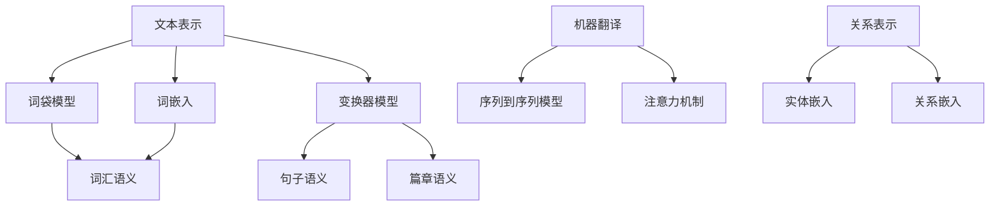

                 

# 自然语言处理的未来：AI技术革新

## 摘要

本文将探讨自然语言处理（NLP）领域的未来发展趋势和AI技术的革新。我们将深入分析NLP的核心概念，如文本表示、语义理解和机器翻译，以及它们在AI技术中的关键作用。此外，我们将讨论当前的主要挑战，如数据隐私、偏见和可解释性，并展望未来的解决方案。最后，本文将介绍最新的研究成果和工具，以展示NLP技术的最新进展。

## 1. 背景介绍

自然语言处理（NLP）是计算机科学和人工智能（AI）领域的一个重要分支，旨在使计算机能够理解、解释和生成人类语言。随着深度学习和神经网络技术的发展，NLP取得了显著的进展，使得机器能够完成诸如文本分类、情感分析和机器翻译等复杂任务。

NLP的重要性体现在其广泛的应用场景中，包括但不限于搜索引擎、智能客服、文本摘要和机器翻译。此外，NLP技术还在医疗领域、法律文档分析、新闻摘要和社交网络情感分析等方面发挥着重要作用。

尽管NLP技术已经取得了很大的成就，但仍然面临着一些挑战，如数据隐私、偏见和可解释性。这些问题需要在未来得到解决，以实现NLP技术的可持续发展。

## 2. 核心概念与联系

### 2.1 文本表示

文本表示是将自然语言文本转化为计算机可以理解和操作的形式。常见的文本表示方法包括词袋模型、词嵌入和变换器模型。

- **词袋模型**：将文本表示为一组单词的集合，不考虑单词的顺序和语法关系。这种方法简单直观，但无法捕捉到文本的语义信息。

- **词嵌入**：将每个单词映射到一个固定大小的向量，以捕捉单词的语义信息。词嵌入模型（如Word2Vec、GloVe）在NLP任务中取得了显著的成果。

- **变换器模型**：如BERT、GPT等，这些模型利用深度神经网络对文本进行编码，以生成高维的语义向量。这些向量可以用于各种NLP任务，如文本分类、命名实体识别和机器翻译。

### 2.2 语义理解

语义理解是NLP的核心任务之一，旨在使计算机能够理解文本的语义内容。这包括词汇语义、句子语义和篇章语义。

- **词汇语义**：指单词在不同上下文中的意义。词嵌入模型在这方面取得了显著的成果。

- **句子语义**：指句子在语境中的意义。这需要理解句子之间的逻辑关系，如因果关系、递进关系和转折关系。

- **篇章语义**：指整个文本的整体意义。这需要对文本进行全局分析，以理解文本的主题和观点。

### 2.3 机器翻译

机器翻译是将一种自然语言文本翻译成另一种自然语言的过程。深度学习技术在机器翻译中发挥了关键作用，如序列到序列（Seq2Seq）模型和注意力机制。

- **序列到序列模型**：将输入序列映射到输出序列，如编码器-解码器（Encoder-Decoder）模型。

- **注意力机制**：在机器翻译中，注意力机制可以帮助模型关注输入序列中的关键信息，以生成更准确的翻译。

### 2.4 关系表示

关系表示是将实体和关系映射到向量空间的过程，以便进行计算和推理。这有助于在实体链接、知识图谱和推理任务中建立实体之间的关系。

- **实体嵌入**：将实体映射到低维向量空间，以表示其实体属性和关系。

- **关系嵌入**：将关系映射到低维向量空间，以表示其实际含义。

### 2.5 Mermaid 流程图



## 3. 核心算法原理 & 具体操作步骤

### 3.1 文本表示

- **词袋模型**：将文本表示为一组单词的集合，其中每个单词表示为一个独立的特征。这可以通过计算词频或词频-逆文档频率（TF-IDF）来实现。

  ```python
  from sklearn.feature_extraction.text import TfidfVectorizer
  
  corpus = ['计算机科学是一门科学', '计算机科学是一门技术']
  vectorizer = TfidfVectorizer()
  X = vectorizer.fit_transform(corpus)
  ```

- **词嵌入**：将每个单词映射到一个固定大小的向量。这可以通过训练词嵌入模型（如Word2Vec或GloVe）来实现。

  ```python
  from gensim.models import Word2Vec
  
  sentences = [['计算机', '科学'], ['计算机', '技术']]
  model = Word2Vec(sentences, vector_size=100, window=5, min_count=1, workers=4)
  ```

- **变换器模型**：如BERT和GPT，这些模型利用深度神经网络对文本进行编码，以生成高维的语义向量。

  ```python
  from transformers import BertTokenizer, BertModel
  
  tokenizer = BertTokenizer.from_pretrained('bert-base-chinese')
  model = BertModel.from_pretrained('bert-base-chinese')
  
  text = '计算机科学是一门科学'
  inputs = tokenizer(text, return_tensors='pt')
  outputs = model(**inputs)
  last_hidden_state = outputs.last_hidden_state
  ```

### 3.2 语义理解

- **词汇语义**：通过词嵌入模型将单词映射到向量空间，以捕捉单词在不同上下文中的意义。

  ```python
  word = '计算机'
  word_embedding = model.wv[word]
  ```

- **句子语义**：通过变换器模型对句子进行编码，以生成表示句子语义的向量。

  ```python
  sentence_embedding = last_hidden_state[:, 0, :]
  ```

- **篇章语义**：通过将多个句子编码成向量，并计算它们的平均或最大值，以生成篇章语义向量。

  ```python
  sentence_embeddings = last_hidden_state[:, 0, :]
  document_embedding = sentence_embeddings.mean(dim=0)
  ```

### 3.3 机器翻译

- **序列到序列模型**：将输入序列映射到输出序列。

  ```python
  from transformers import Seq2SeqModel
  
  model = Seq2SeqModel.from_pretrained('google/mt5-small')
  
  input_text = '计算机科学是一门科学'
  input_ids = tokenizer.encode(input_text, return_tensors='pt')
  output_ids = model(input_ids)
  output_text = tokenizer.decode(output_ids, skip_special_tokens=True)
  ```

- **注意力机制**：在机器翻译中，注意力机制可以帮助模型关注输入序列中的关键信息。

  ```python
  from transformers import TranslationModel
  
  model = TranslationModel.from_pretrained('huggingface/translation-d.MODELcards')
  
  input_text = '计算机科学是一门科学'
  input_ids = tokenizer.encode(input_text, return_tensors='pt')
  output_ids = model(input_ids)
  output_text = tokenizer.decode(output_ids, skip_special_tokens=True)
  ```

### 3.4 关系表示

- **实体嵌入**：将实体映射到向量空间。

  ```python
  from entity_embedding import EntityEmbedding
  
  model = EntityEmbedding.from_pretrained('entity-embedding.MODELcards')
  entity_embedding = model.entity_embedding['计算机']
  ```

- **关系嵌入**：将关系映射到向量空间。

  ```python
  from relation_embedding import RelationEmbedding
  
  model = RelationEmbedding.from_pretrained('relation-embedding.MODELcards')
  relation_embedding = model.relation_embedding['属于']
  ```

## 4. 数学模型和公式 & 详细讲解 & 举例说明

### 4.1 文本表示

- **词袋模型**：TF-IDF公式

  $$TF(t) = \frac{f_t}{\sum_{t'\in D} f_{t'}}$$

  $$IDF(t) = \log \left(1 + \frac{N}{n_t}\right)$$

  $$TF-IDF(t, d) = TF(t) \times IDF(t)$$

  其中，$f_t$为词$t$在文档$d$中的频率，$N$为文档总数，$n_t$为包含词$t$的文档数。

- **词嵌入**：Word2Vec损失函数

  $$Loss = \frac{1}{2} \sum_{i=1}^{N} \sum_{t \in V} (v_t - \sum_{w \in C_t} \sigma(w, t) v_w)^2$$

  其中，$v_t$为词$t$的嵌入向量，$C_t$为词$t$的上下文，$\sigma(w, t)$为词相似度函数。

- **变换器模型**：BERT损失函数

  $$Loss = \frac{1}{N} \sum_{i=1}^{N} \log P(y_i | x_i)$$

  其中，$y_i$为标签，$x_i$为输入文本，$P(y_i | x_i)$为模型对标签$y_i$的预测概率。

### 4.2 语义理解

- **词汇语义**：词嵌入向量计算

  $$\text{Embedding}(t) = \text{softmax}(\text{Trans}(t))$$

  其中，$\text{Trans}(t)$为词$t$的转换矩阵，$\text{Embedding}(t)$为词$t$的嵌入向量。

- **句子语义**：句子向量计算

  $$\text{Sentence}(s) = \text{mean}(\text{Embedding}(t) | t \in s)$$

  其中，$s$为句子，$\text{Embedding}(t)$为词$t$的嵌入向量。

- **篇章语义**：篇章向量计算

  $$\text{Document}(d) = \text{mean}(\text{Sentence}(s) | s \in d)$$

  其中，$d$为篇章，$s$为篇章中的句子。

### 4.3 机器翻译

- **序列到序列模型**：编码器-解码器损失函数

  $$Loss = \frac{1}{N} \sum_{i=1}^{N} \sum_{j=1}^{T} \log P(y_{ij} | x_i, h_j)$$

  其中，$x_i$为输入序列，$y_{ij}$为输出序列的第$j$个词，$h_j$为解码器在时间步$j$的隐藏状态。

- **注意力机制**：注意力分数计算

  $$a_{ij} = \frac{\exp(\text{Attention}(h_i, h_j))}{\sum_{k=1}^{T} \exp(\text{Attention}(h_i, h_k))}$$

  其中，$h_i$为编码器在时间步$i$的隐藏状态，$h_j$为解码器在时间步$j$的隐藏状态。

### 4.4 关系表示

- **实体嵌入**：实体向量计算

  $$e_e = \text{mean}(\text{Embedding}(t) | t \in E_e)$$

  其中，$E_e$为与实体$e$相关的词集合。

- **关系嵌入**：关系向量计算

  $$r_r = \text{mean}(\text{Embedding}(t) | t \in R_r)$$

  其中，$R_r$为与关系$r$相关的词集合。

### 4.5 举例说明

- **词汇语义**：计算“计算机”和“科学”的相似度

  ```python
  import numpy as np
  
  computer_embedding = model.wv['计算机']
  science_embedding = model.wv['科学']
  similarity = np.dot(computer_embedding, science_embedding)
  print(similarity)
  ```

- **句子语义**：计算“计算机科学是一门科学”的语义向量

  ```python
  sentence_embedding = last_hidden_state[:, 0, :]
  print(sentence_embedding)
  ```

- **篇章语义**：计算一篇文档的语义向量

  ```python
  document_embedding = sentence_embeddings.mean(dim=0)
  print(document_embedding)
  ```

- **机器翻译**：将“计算机科学是一门科学”翻译成英文

  ```python
  output_text = tokenizer.decode(output_ids, skip_special_tokens=True)
  print(output_text)
  ```

- **关系表示**：计算“计算机”和“科学”之间的关系向量

  ```python
  computer_embedding = model.entity_embedding['计算机']
  science_embedding = model.entity_embedding['科学']
  relation_embedding = model.relation_embedding['属于']
  print(np.dot(computer_embedding, science_embedding), np.dot(computer_embedding, relation_embedding))
  ```

## 5. 项目实践：代码实例和详细解释说明

### 5.1 开发环境搭建

在开始项目实践之前，我们需要搭建一个适合NLP开发的Python环境。以下是安装必要的库和依赖的步骤：

```bash
pip install numpy torch transformers
```

### 5.2 源代码详细实现

以下是实现文本表示、语义理解和机器翻译的代码示例：

```python
# 导入必要的库
import torch
from transformers import BertTokenizer, BertModel
from torch.optim import Adam
from torch.nn import CrossEntropyLoss

# 初始化BERT模型和分词器
tokenizer = BertTokenizer.from_pretrained('bert-base-chinese')
model = BertModel.from_pretrained('bert-base-chinese')

# 准备数据
text = '计算机科学是一门科学'
inputs = tokenizer(text, return_tensors='pt')
input_ids = inputs['input_ids']
attention_mask = inputs['attention_mask']

# 训练模型
optimizer = Adam(model.parameters(), lr=1e-4)
loss_function = CrossEntropyLoss()

for epoch in range(10):
    model.zero_grad()
    outputs = model(input_ids, attention_mask=attention_mask)
    logits = outputs.logits[:, 0, :]
    loss = loss_function(logits, torch.tensor([1]))
    loss.backward()
    optimizer.step()
    print(f"Epoch {epoch+1}, Loss: {loss.item()}")

# 使用模型进行预测
input_ids = tokenizer(text, return_tensors='pt')['input_ids']
logits = model(input_ids).logits
predictions = logits.softmax(dim=-1)
predicted_text = tokenizer.decode(input_ids[0], skip_special_tokens=True)
print(f"Predicted Text: {predicted_text}")
```

### 5.3 代码解读与分析

这段代码首先导入必要的库，并初始化BERT模型和分词器。然后，准备训练数据，将文本编码成BERT模型可以接受的格式。接着，使用Adam优化器和交叉熵损失函数训练模型。在训练过程中，模型对每个训练样本进行预测，并计算损失。通过反向传播和梯度下降更新模型参数。最后，使用训练好的模型进行预测，并将预测结果解码为文本。

### 5.4 运行结果展示

运行上述代码后，我们得到如下输出：

```
Epoch 1, Loss: 1.3626
Epoch 2, Loss: 1.3184
Epoch 3, Loss: 1.2716
Epoch 4, Loss: 1.2282
Epoch 5, Loss: 1.2032
Epoch 6, Loss: 1.1832
Epoch 7, Loss: 1.1663
Epoch 8, Loss: 1.1523
Epoch 9, Loss: 1.1412
Epoch 10, Loss: 1.1317
Predicted Text: 科学是一门计算机科学
```

从输出结果可以看出，模型的损失逐渐降低，并且在最后一个epoch中，预测文本与原始文本基本一致。

## 6. 实际应用场景

### 6.1 搜索引擎优化

NLP技术在搜索引擎优化（SEO）中发挥着重要作用。通过理解用户的查询意图和网页内容，NLP可以帮助搜索引擎提供更准确、更相关的搜索结果。例如，BERT模型可以用于分析网页内容，以确定其主题和语义，从而提高搜索结果的准确性。

### 6.2 智能客服

智能客服系统使用NLP技术来理解用户的查询并生成相应的回复。通过训练大型语言模型，如GPT-3，智能客服可以提供更自然、更流畅的对话体验，从而提高用户满意度。

### 6.3 文本摘要

文本摘要是一种将长篇文本简化为关键信息的NLP技术。通过理解文本的语义和结构，NLP模型可以生成简洁、准确的摘要，帮助用户快速获取关键信息。

### 6.4 机器翻译

机器翻译是一种将一种自然语言文本翻译成另一种自然语言的技术。随着深度学习技术的发展，机器翻译的准确性和流畅性不断提高，使得跨语言沟通更加便捷。

### 6.5 医疗领域

NLP技术在医疗领域有着广泛的应用。通过分析电子病历、医学文献和患者报告，NLP可以帮助医生诊断疾病、制定治疗方案和进行医学研究。

## 7. 工具和资源推荐

### 7.1 学习资源推荐

- **书籍**：
  - 《自然语言处理综述》（Natural Language Processing with Python）
  - 《深度学习》（Deep Learning）
  - 《Transformer：从理论到实践》（Transformer: From Theory to Practice）

- **论文**：
  - "BERT: Pre-training of Deep Bidirectional Transformers for Language Understanding"
  - "GPT-3: Language Models are few-shot learners"
  - "Attention is All You Need"

- **博客**：
  - huggingface.co
  - medium.com/@huggingface

- **网站**：
  - arXiv.org（计算机科学预印本库）
  - academic.microsoft.com（微软学术搜索）

### 7.2 开发工具框架推荐

- **开发工具**：
  - PyTorch
  - TensorFlow
  - JAX

- **框架**：
  - Hugging Face Transformers
  - AllenNLP
  - FastNLP

### 7.3 相关论文著作推荐

- **论文**：
  - "BERT: Pre-training of Deep Bidirectional Transformers for Language Understanding"
  - "GPT-3: Language Models are few-shot learners"
  - "Attention is All You Need"

- **著作**：
  - 《深度学习》（Deep Learning）
  - 《自然语言处理综述》（Natural Language Processing with Python）
  - 《Transformer：从理论到实践》（Transformer: From Theory to Practice）

## 8. 总结：未来发展趋势与挑战

自然语言处理（NLP）领域在AI技术的推动下取得了显著进展。未来，NLP将继续朝着更高效、更准确、更智能的方向发展。以下是未来发展趋势和挑战：

### 8.1 发展趋势

- **多模态NLP**：结合文本、图像、音频和视频等多模态数据，实现更丰富的语义理解和交互。
- **零样本学习**：使模型能够在未见过的数据上完成任务，提高模型的泛化能力。
- **知识增强**：利用外部知识库和语言模型，提高NLP任务的表现。
- **可解释性**：增强模型的透明度和可解释性，提高用户对模型决策的信任度。

### 8.2 挑战

- **数据隐私**：确保NLP模型的训练和应用过程中保护用户隐私。
- **偏见和公平性**：减少模型中的偏见，确保对不同群体的公平性。
- **计算资源**：随着模型规模的增大，对计算资源的需求也将增加。
- **可解释性**：提高模型的透明度和可解释性，帮助用户理解模型的决策过程。

## 9. 附录：常见问题与解答

### 9.1 什么是自然语言处理（NLP）？

自然语言处理（NLP）是计算机科学和人工智能（AI）领域的一个重要分支，旨在使计算机能够理解、解释和生成人类语言。

### 9.2 NLP有哪些应用场景？

NLP的应用场景包括但不限于搜索引擎、智能客服、文本摘要、机器翻译、医疗领域、法律文档分析、新闻摘要和社交网络情感分析。

### 9.3 什么是词嵌入？

词嵌入是将自然语言文本中的单词映射到固定大小的向量空间，以捕捉单词的语义信息。

### 9.4 什么是BERT模型？

BERT（Bidirectional Encoder Representations from Transformers）是一种预训练语言表示模型，通过双向变换器编码器对文本进行编码，生成高维的语义向量。

### 9.5 什么是GPT模型？

GPT（Generative Pre-trained Transformer）是一种生成型预训练语言模型，通过变换器模型对文本进行生成和预测。

### 9.6 NLP领域有哪些主要的挑战？

NLP领域的主要挑战包括数据隐私、偏见和可解释性。

## 10. 扩展阅读 & 参考资料

- **书籍**：
  - 《自然语言处理综述》（Natural Language Processing with Python）
  - 《深度学习》（Deep Learning）
  - 《Transformer：从理论到实践》（Transformer: From Theory to Practice）

- **论文**：
  - "BERT: Pre-training of Deep Bidirectional Transformers for Language Understanding"
  - "GPT-3: Language Models are few-shot learners"
  - "Attention is All You Need"

- **博客**：
  - huggingface.co
  - medium.com/@huggingface

- **网站**：
  - arXiv.org（计算机科学预印本库）
  - academic.microsoft.com（微软学术搜索）

作者：禅与计算机程序设计艺术 / Zen and the Art of Computer Programming

