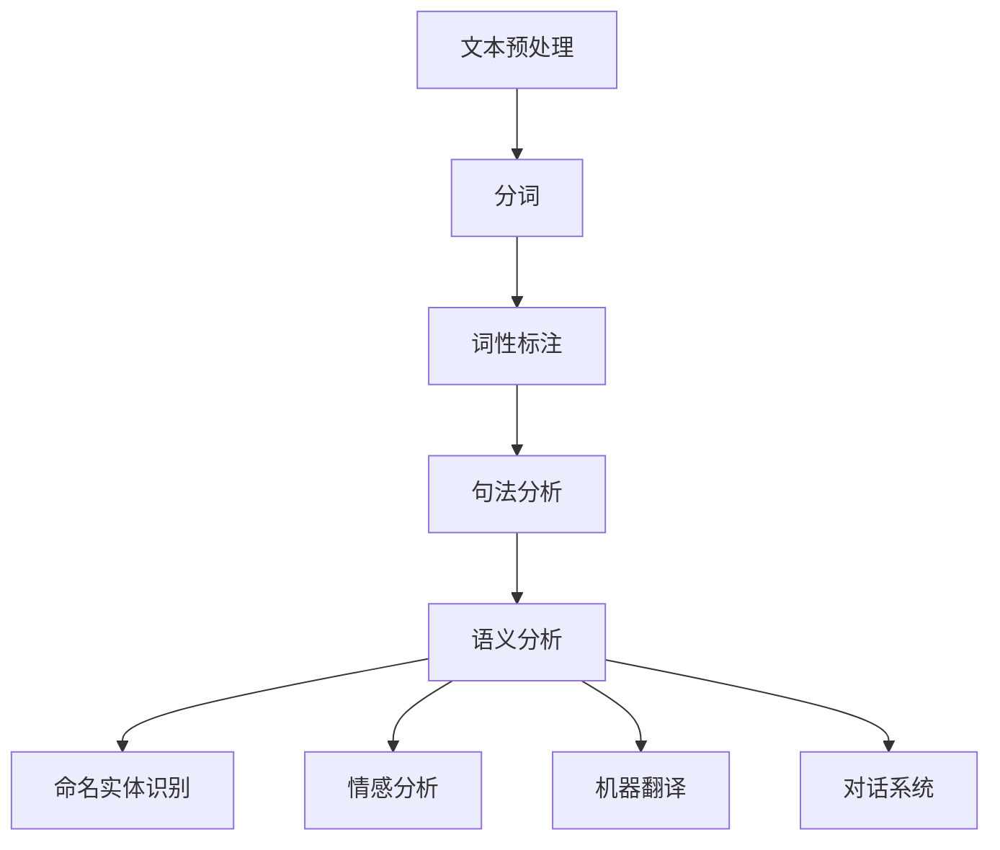
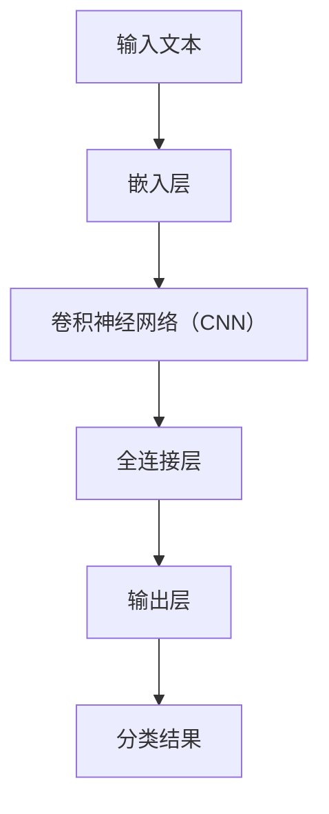

                 

# 自然语言处理（NLP）：AI语言理解技术

## 关键词
- 自然语言处理
- AI语言理解
- 语音识别
- 文本分析
- 情感分析
- 语言生成
- 对话系统

## 摘要
本文旨在探讨自然语言处理（NLP）领域的基本概念和最新技术进展，重点关注AI在语言理解方面的应用。我们将从背景介绍、核心概念与联系、核心算法原理、数学模型和公式、项目实践、实际应用场景、工具和资源推荐等多个角度展开讨论，旨在为读者提供一个全面、深入的了解。

### 1. 背景介绍（Background Introduction）

自然语言处理（NLP）是计算机科学和人工智能领域的一个重要分支，旨在使计算机能够理解和处理人类自然语言。这一领域的研究始于20世纪50年代，当时计算机科学家开始探索如何使计算机具备理解和生成自然语言的能力。随着计算能力的提升和算法的发展，NLP技术逐渐成熟，并在众多领域取得了显著的应用成果。

在过去的几十年里，NLP技术经历了多个发展阶段：

- **规则驱动方法**：早期的NLP系统主要依赖于手工编写的规则，这些规则用于解析和生成自然语言。这种方法存在扩展性和灵活性不足的问题。

- **统计方法**：20世纪80年代，统计学方法开始应用于NLP，如隐马尔可夫模型（HMM）和决策树。这些方法在一定程度上提高了系统的性能。

- **基于知识的表示方法**：20世纪90年代，研究者开始探索如何利用语义知识来提高NLP系统的性能。这些方法在信息检索和问答系统中取得了显著成果。

- **深度学习方法**：近年来，深度学习技术在NLP领域取得了突破性进展。通过利用大规模数据集和强大的计算能力，深度学习方法在文本分类、情感分析、机器翻译等方面取得了优异的性能。

### 2. 核心概念与联系（Core Concepts and Connections）

在NLP中，核心概念主要包括：

- **分词（Tokenization）**：将文本分割成词或其他有意义的标记。

- **词性标注（Part-of-Speech Tagging）**：为每个词分配一个词性标签，如名词、动词、形容词等。

- **句法分析（Parsing）**：分析句子的结构，确定词与词之间的语法关系。

- **语义分析（Semantic Analysis）**：理解句子所表达的意义。

- **命名实体识别（Named Entity Recognition）**：识别文本中的命名实体，如人名、地点、组织等。

- **情感分析（Sentiment Analysis）**：判断文本的情感倾向，如正面、负面、中性等。

- **机器翻译（Machine Translation）**：将一种语言翻译成另一种语言。

- **对话系统（Dialogue Systems）**：使计算机能够与人类进行自然对话。

下面是一个简单的Mermaid流程图，展示了NLP的一些核心流程：



### 3. 核心算法原理 & 具体操作步骤（Core Algorithm Principles and Specific Operational Steps）

在NLP中，核心算法主要包括：

- **基于规则的方法**：这种方法依赖于手工编写的规则。例如，分词可以使用词典匹配方法，将文本中的每个词与词典中的词进行匹配。

- **统计方法**：这种方法利用统计模型来预测词与词之间的关系。例如，隐马尔可夫模型（HMM）可以用于语音识别。

- **基于知识的方法**：这种方法利用语义知识来指导NLP任务。例如，本体论（Ontology）可以用于语义分析。

- **深度学习方法**：这种方法利用神经网络来学习词与词之间的关系。例如，循环神经网络（RNN）和变换器（Transformer）模型在NLP任务中取得了显著成果。

下面是一个简单的深度学习模型结构，用于文本分类任务：



#### 3.1 输入文本（Input Text）
输入文本是NLP任务的基础。我们需要将文本转换为计算机可以处理的形式。通常，我们会将文本转换为词袋（Bag-of-Words）或词嵌入（Word Embeddings）。

#### 3.2 嵌入层（Embedding Layer）
嵌入层是将词转换为密集向量的过程。这些向量可以在预训练的词向量（如Word2Vec、GloVe）的基础上进行微调。

#### 3.3 卷积神经网络（Convolutional Neural Network，CNN）
卷积神经网络是一种用于图像处理和文本分类的强大工具。它可以捕捉局部特征和模式。在文本分类任务中，CNN可以用于提取文本的局部特征。

#### 3.4 全连接层（Fully Connected Layer）
全连接层用于将卷积神经网络提取的局部特征融合成全局特征。这些特征将被用于分类任务。

#### 3.5 输出层（Output Layer）
输出层是模型进行分类的最终阶段。它将输入的文本映射到预定义的类别。

### 4. 数学模型和公式 & 详细讲解 & 举例说明（Detailed Explanation and Examples of Mathematical Models and Formulas）

在NLP中，常用的数学模型和公式包括：

- **词袋模型（Bag-of-Words）**：
    $$ V = \sum_{i=1}^n f_i(x_i) $$
    其中，$V$ 是词向量，$f_i(x_i)$ 是词频函数。

- **词嵌入（Word Embeddings）**：
    $$ \vec{w}_i = \text{Word2Vec}(\text{context}) $$
    其中，$\vec{w}_i$ 是词向量，$\text{context}$ 是词的上下文。

- **循环神经网络（Recurrent Neural Network，RNN）**：
    $$ \vec{h}_{t+1} = \text{tanh}(\text{W} \cdot \vec{h}_t + \text{U} \cdot \vec{x}_t + b) $$
    其中，$\vec{h}_{t+1}$ 是隐藏状态，$\vec{h}_t$ 是当前隐藏状态，$\vec{x}_t$ 是输入，$\text{W}$、$\text{U}$ 和 $b$ 是权重。

- **变换器（Transformer）**：
    $$ \text{Attn}(\vec{h}_1, \vec{h}_2) = \text{softmax}(\text{W}_a \cdot \text{dot}(\vec{h}_1, \vec{h}_2)^T) $$
    其中，$\text{Attn}$ 是注意力机制，$\vec{h}_1$ 和 $\vec{h}_2$ 是隐藏状态。

#### 4.1 词袋模型（Bag-of-Words）

词袋模型是一种将文本表示为词频向量的方法。在这个模型中，每个词都是一个独立的特征，不考虑词的顺序。例如，给定句子“The dog is running in the park”，词袋模型可以表示为：

$$
\begin{bmatrix}
0 & 1 & 0 & 0 & 1 & 0 & 0 \\
1 & 0 & 1 & 0 & 0 & 1 & 0 \\
0 & 0 & 0 & 1 & 0 & 1 & 0 \\
0 & 0 & 1 & 0 & 1 & 0 & 1 \\
\end{bmatrix}
$$

其中，每一行表示一个词的词频。

#### 4.2 词嵌入（Word Embeddings）

词嵌入是一种将词表示为稠密向量的方法。这些向量捕捉了词的语义和语法特征。例如，给定词“king”，词嵌入可以表示为：

$$
\vec{w}_\text{king} = \begin{bmatrix}
0.2 & 0.3 & 0.4 & 0.5 & 0.6 & 0.7 & 0.8 \\
\end{bmatrix}
$$

词嵌入的一个著名例子是Word2Vec，它通过学习词的上下文来生成词向量。例如，给定句子“The king is running in the park”，我们可以得到：

$$
\vec{w}_\text{king} = \text{Word2Vec}(\text{in, the, park})
$$

#### 4.3 循环神经网络（Recurrent Neural Network，RNN）

循环神经网络是一种用于序列数据的学习模型。它通过共享权重来处理序列中的依赖关系。例如，给定输入序列$\vec{x}_1, \vec{x}_2, \ldots, \vec{x}_T$，RNN可以表示为：

$$
\vec{h}_t = \text{tanh}(\text{W} \cdot \vec{h}_{t-1} + \text{U} \cdot \vec{x}_t + b)
$$

其中，$\vec{h}_t$ 是隐藏状态，$\text{W}$、$\text{U}$ 和 $b$ 是权重。

RNN的一个著名例子是LSTM（长短期记忆网络），它通过引入门控机制来解决这个问题。LSTM的公式为：

$$
\vec{i}_t = \text{sigmoid}(\text{W}_i \cdot [\vec{h}_{t-1}, \vec{x}_t] + b_i) \\
\vec{f}_t = \text{sigmoid}(\text{W}_f \cdot [\vec{h}_{t-1}, \vec{x}_t] + b_f) \\
\vec{g}_t = \text{tanh}(\text{W}_g \cdot [\vec{h}_{t-1}, \vec{x}_t] + b_g) \\
\vec{c}_t = \vec{f}_t \odot \vec{c}_{t-1} + \vec{i}_t \odot \vec{g}_t \\
\vec{h}_t = \text{tanh}(\text{W}_h \cdot \vec{c}_t + b_h)
$$

其中，$\vec{i}_t$、$\vec{f}_t$、$\vec{g}_t$ 是门控信号，$\vec{c}_t$ 是细胞状态，$\vec{h}_t$ 是隐藏状态。

#### 4.4 变换器（Transformer）

变换器是一种基于自注意力机制的序列模型。它通过多头自注意力机制来学习序列中的依赖关系。例如，给定输入序列$\vec{x}_1, \vec{x}_2, \ldots, \vec{x}_T$，变换器可以表示为：

$$
\vec{h}_t = \text{Attention}(\vec{h}_{<t}, \vec{h}_{<t}, \vec{h}_{<t}) \\
\vec{h}_{<t} = \text{Layer Normalization}(\vec{h}_{t} + \text{Linear}(\vec{h}_{t-1})) \\
\vec{h}_{t} = \text{Layer Normalization}(\vec{h}_{t} + \text{Linear}(\vec{h}_{<t}))
$$

其中，$\text{Attention}$ 是自注意力机制，$\text{Layer Normalization}$ 是层归一化，$\text{Linear}$ 是线性变换。

### 5. 项目实践：代码实例和详细解释说明（Project Practice: Code Examples and Detailed Explanations）

在本节中，我们将展示一个简单的文本分类项目，并详细解释代码的实现。

#### 5.1 开发环境搭建

为了运行下面的代码示例，您需要安装Python（3.8或更高版本）和以下库：TensorFlow、Keras、numpy、pandas。

#### 5.2 源代码详细实现

下面是一个使用Keras实现的简单文本分类器的示例代码：

```python
import numpy as np
import pandas as pd
from tensorflow.keras.models import Sequential
from tensorflow.keras.layers import Embedding, LSTM, Dense
from tensorflow.keras.preprocessing.text import Tokenizer
from tensorflow.keras.preprocessing.sequence import pad_sequences

# 数据准备
data = pd.read_csv('data.csv')
X = data['text']
y = data['label']

# 分词和序列化
tokenizer = Tokenizer(num_words=10000)
tokenizer.fit_on_texts(X)
sequences = tokenizer.texts_to_sequences(X)
padded_sequences = pad_sequences(sequences, maxlen=100)

# 模型构建
model = Sequential()
model.add(Embedding(10000, 32))
model.add(LSTM(32, dropout=0.2, recurrent_dropout=0.2))
model.add(Dense(1, activation='sigmoid'))

# 编译模型
model.compile(optimizer='adam', loss='binary_crossentropy', metrics=['accuracy'])

# 训练模型
model.fit(padded_sequences, y, epochs=10, batch_size=128)

# 评估模型
test_sequences = tokenizer.texts_to_sequences(data['test_text'])
test_padded_sequences = pad_sequences(test_sequences, maxlen=100)
predictions = model.predict(test_padded_sequences)
print(np.mean(predictions > 0.5))
```

#### 5.3 代码解读与分析

上面的代码实现了一个简单的文本分类器，用于判断文本是否属于某个类别。以下是代码的详细解读：

- **数据准备**：我们使用一个CSV文件作为数据源。这个文件包含文本和相应的标签。

- **分词和序列化**：我们使用Keras的Tokenizer将文本转换为整数序列。然后，我们使用pad_sequences将序列填充到相同的长度。

- **模型构建**：我们构建了一个简单的序列模型，包括嵌入层、LSTM层和全连接层。

- **编译模型**：我们使用adam优化器和binary_crossentropy损失函数来编译模型。

- **训练模型**：我们使用训练数据来训练模型，设置epochs和batch_size来控制训练过程。

- **评估模型**：我们使用测试数据来评估模型的性能，并打印分类准确率。

### 6. 实际应用场景（Practical Application Scenarios）

自然语言处理技术在许多领域都有广泛的应用：

- **语音识别**：将语音转换为文本，应用于智能助手、语音搜索、自动字幕等。

- **文本分析**：用于舆情监测、情感分析、信息提取等。

- **对话系统**：用于智能客服、虚拟助手、聊天机器人等。

- **机器翻译**：将一种语言翻译成另一种语言，应用于跨语言沟通、国际化业务等。

- **文本生成**：用于自动写作、内容生成、创意设计等。

### 7. 工具和资源推荐（Tools and Resources Recommendations）

在NLP领域，有许多优秀的工具和资源可以帮助您学习和实践：

- **学习资源**：
  - 《自然语言处理综论》（Foundations of Statistical Natural Language Processing） -Christopher D. Manning, Hinrich Schütze
  - 《Speech and Language Processing》 -Daniel Jurafsky, James H. Martin
  - 《Deep Learning》 -Ian Goodfellow, Yoshua Bengio, Aaron Courville

- **开源库**：
  - NLTK（自然语言工具包）
  - spaCy
  - Hugging Face Transformers

- **在线课程**：
  - Coursera - 自然语言处理与深度学习
  - edX - 人工智能与自然语言处理
  - Udacity - 自然语言处理工程师纳米学位

### 8. 总结：未来发展趋势与挑战（Summary: Future Development Trends and Challenges）

自然语言处理技术在不断发展，未来可能的发展趋势包括：

- **预训练模型**：越来越多的研究者和公司将使用预训练模型来提高NLP任务的性能。

- **多模态学习**：结合文本、图像、声音等多种数据来源，以实现更丰富的理解和交互。

- **自动化与人类协作**：使NLP系统更智能，同时保留人类在关键任务中的决策权。

- **隐私保护**：在处理个人数据时，确保隐私保护。

然而，NLP技术也面临一些挑战：

- **语言多样性**：如何处理不同的语言和方言。

- **语义理解**：如何更准确地理解复杂的语义关系。

- **伦理与道德**：如何确保NLP系统的公正性和透明性。

### 9. 附录：常见问题与解答（Appendix: Frequently Asked Questions and Answers）

- **问题1**：什么是词嵌入？
    **解答**：词嵌入是将词转换为稠密向量的过程，这些向量捕捉了词的语义和语法特征。

- **问题2**：什么是循环神经网络（RNN）？
    **解答**：循环神经网络是一种用于序列数据的学习模型，它通过共享权重来处理序列中的依赖关系。

- **问题3**：什么是变换器（Transformer）？
    **解答**：变换器是一种基于自注意力机制的序列模型，它通过多头自注意力机制来学习序列中的依赖关系。

### 10. 扩展阅读 & 参考资料（Extended Reading & Reference Materials）

- **参考书籍**：
  - 《深度学习》 - Ian Goodfellow, Yoshua Bengio, Aaron Courville
  - 《自然语言处理综论》 - Christopher D. Manning, Hinrich Schütze

- **参考论文**：
  - "Attention Is All You Need" - Vaswani et al., 2017
  - "Long Short-Term Memory" - Hochreiter and Schmidhuber, 1997

- **参考网站**：
  - Hugging Face Transformers
  - NLTK
  - spaCy

作者：禅与计算机程序设计艺术 / Zen and the Art of Computer Programming

