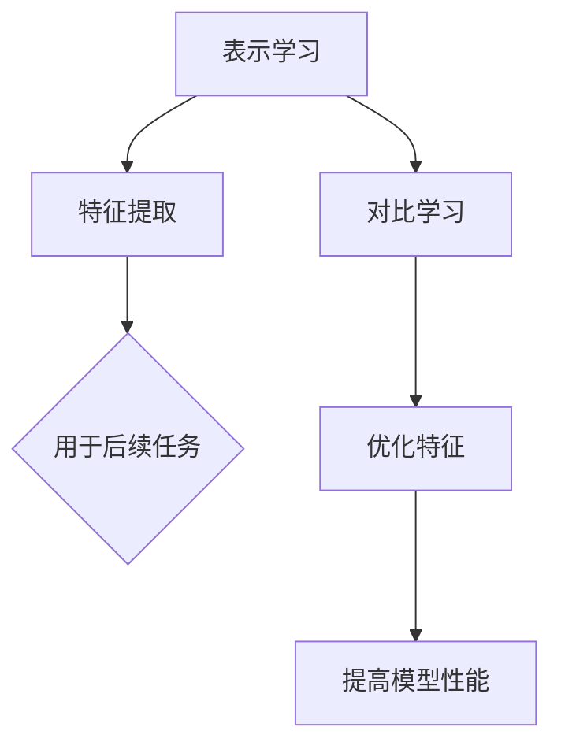

                 

### 文章标题

### Title: Self-Supervised Learning: Theoretical Innovation in Representation Learning and Contrastive Learning

在人工智能领域，自监督学习正逐渐成为研究热点。它通过利用未标记的数据，为模型提供了强大的学习潜力，推动了计算机视觉、自然语言处理等众多领域的发展。本文将深入探讨自监督学习中的两大核心概念：表示学习和对比学习。通过分析这些概念的理论创新，本文旨在为读者提供一幅全面的自监督学习蓝图。

### Abstract:
In the field of artificial intelligence, self-supervised learning is gaining traction as a key research area. By leveraging unlabeled data, it offers significant learning potential, driving advancements in various domains such as computer vision and natural language processing. This article delves into two core concepts of self-supervised learning: representation learning and contrastive learning. Through an analysis of these concepts' theoretical innovations, the article aims to provide readers with a comprehensive overview of self-supervised learning.

本文将按照以下结构展开：

1. **背景介绍**：介绍自监督学习的重要性及其在各个领域的应用。
2. **核心概念与联系**：详细阐述表示学习和对比学习的核心概念及其相互关系。
3. **核心算法原理 & 具体操作步骤**：讲解自监督学习中的关键算法，包括深度卷积神经网络（CNN）和自编码器（Autoencoder）等。
4. **数学模型和公式 & 详细讲解 & 举例说明**：介绍自监督学习中的数学模型和公式，并通过具体例子进行详细解释。
5. **项目实践：代码实例和详细解释说明**：展示一个自监督学习项目的实践过程，包括开发环境搭建、源代码实现、代码解读和分析、运行结果展示等。
6. **实际应用场景**：探讨自监督学习在计算机视觉和自然语言处理等领域的实际应用。
7. **工具和资源推荐**：推荐相关学习资源和开发工具。
8. **总结：未来发展趋势与挑战**：分析自监督学习的未来发展趋势和面临的挑战。
9. **附录：常见问题与解答**：解答读者可能遇到的问题。
10. **扩展阅读 & 参考资料**：提供进一步阅读和研究的参考资料。

接下来，我们将逐步深入这些主题，通过逻辑清晰、结构紧凑、简单易懂的专业技术语言，引导读者探索自监督学习的广阔天地。让我们开始这段精彩的旅程！

---

### 背景介绍

自监督学习（Self-Supervised Learning）是一种不需要手动标注数据标签的学习方法。在传统的监督学习（Supervised Learning）中，我们需要大量的已标注数据来训练模型，这在实际应用中往往非常耗时且成本高昂。而自监督学习通过利用未标记的数据，为模型提供了自我监督的方式，从而大大降低了数据标注的成本。自监督学习不仅适用于大规模数据集，还能在数据稀缺的情况下发挥其独特优势。

#### 自监督学习的重要性

自监督学习在人工智能领域的重要性不可忽视。首先，它解决了数据标注的问题，使得我们可以利用未标记的数据进行模型训练，极大地扩展了数据来源。其次，自监督学习可以自动发现数据中的内在结构，从而提高模型的泛化能力。此外，自监督学习还在提升模型效率和减少计算资源消耗方面具有显著优势。

#### 自监督学习的应用领域

自监督学习在多个领域都取得了显著的成果。在计算机视觉中，自监督学习被广泛应用于图像分类、目标检测和图像分割等任务。通过自监督学习方法，模型可以从大量的无标签图像中学习到丰富的视觉特征，从而实现高精度的图像识别。在自然语言处理（NLP）领域，自监督学习被用于语言模型训练、机器翻译和文本分类等任务。自监督学习方法使得模型能够在大规模的未标记文本数据中学习到语言的结构和语义，从而提升文本处理的性能。

#### 自监督学习的挑战

尽管自监督学习具有众多优势，但其在实际应用中也面临着一些挑战。首先，自监督学习模型的训练过程往往需要大量的计算资源和时间，这使得模型部署变得困难。其次，由于自监督学习缺乏外部监督信号，模型可能无法完全捕捉到任务的关键信息，从而影响模型的性能。此外，自监督学习模型的解释性较差，这使得其在某些任务中的应用受到限制。

总的来说，自监督学习作为一种重要的机器学习技术，其在人工智能领域的发展具有广阔的前景。通过深入研究和创新，我们可以克服现有的挑战，进一步提升自监督学习的性能和应用范围。接下来的部分，我们将详细探讨自监督学习中的两大核心概念：表示学习和对比学习。

---

### 核心概念与联系

#### 标题：核心概念与联系

在自监督学习中，表示学习和对比学习是两大核心概念。这两个概念不仅独立存在，还在实际应用中相互补充，共同推动自监督学习的发展。

#### 1.1 表示学习

表示学习（Representation Learning）是自监督学习的基础。它的目标是通过无监督方式自动提取数据中的有效表示，从而提高模型在后续任务中的表现。具体来说，表示学习包括特征提取、降维和特征表示等步骤。通过表示学习，模型可以从大量无标签数据中学习到有意义的特征，这些特征可以用于后续的监督学习任务。

#### 1.2 对比学习

对比学习（Contrastive Learning）是一种通过正负样本对比来学习有效表示的方法。它的核心思想是通过对比正样本和负样本，使得模型能够更好地捕捉数据的差异性。对比学习的目标是最小化正样本间的相似度，同时最大化正负样本间的差异性。这种方法在自监督学习中应用广泛，尤其是在图像和语言表示的学习中。

#### 1.3 相互关系

表示学习和对比学习在自监督学习中相互补充。表示学习通过无监督方式提取数据特征，而对比学习通过对比正负样本进一步优化这些特征。两者结合起来，可以使得模型在自监督学习过程中更好地学习到数据的内在结构。例如，在计算机视觉中，表示学习可以帮助模型提取图像的底层特征，而对比学习则可以优化这些特征，使得模型能够更好地进行图像分类和目标检测。

#### 1.4 Mermaid 流程图

为了更直观地展示表示学习和对比学习的关系，我们可以使用 Mermaid 流程图来描述这两个概念在自监督学习中的流程。



在这个流程图中，A 表示表示学习，包括特征提取和用于后续任务；B 表示特征提取，是表示学习的一部分；D 表示对比学习，通过优化特征来提高模型性能；C、E 和 F 分别表示特征用于后续任务、特征优化和模型性能提升。

总的来说，表示学习和对比学习是自监督学习中的两大核心概念。通过相互结合，这两个概念可以使得模型在无监督学习中更好地学习到数据的内在结构，从而提高模型在后续任务中的性能。在接下来的部分，我们将详细探讨自监督学习中的关键算法，包括深度卷积神经网络（CNN）和自编码器（Autoencoder）等。

---

### 核心算法原理 & 具体操作步骤

自监督学习依赖于一系列强大的算法，其中深度卷积神经网络（CNN）和自编码器（Autoencoder）是最常用的两种。这两种算法各有特色，但都在自监督学习任务中发挥了关键作用。

#### 2.1 深度卷积神经网络（CNN）

CNN 是自监督学习中最常用的模型之一，特别是在计算机视觉领域。CNN 通过多个卷积层、池化层和全连接层，从原始数据中提取特征，并最终实现分类或回归任务。在自监督学习中，CNN 通常用于无监督特征提取，如下所述：

1. **特征提取**：首先，CNN 通过卷积操作提取图像的局部特征。这些特征可以捕获图像中的边缘、纹理和其他结构信息。
2. **降维**：随后，通过池化操作对特征进行降维，减少数据的维度，同时保留关键信息。
3. **表示学习**：最终，CNN 将降维后的特征用于后续任务，如图像分类或目标检测。

具体操作步骤如下：

```python
# 示例代码：使用 PyTorch 构建一个简单的 CNN 模型
import torch
import torch.nn as nn
import torch.optim as optim

class SimpleCNN(nn.Module):
    def __init__(self):
        super(SimpleCNN, self).__init__()
        self.conv1 = nn.Conv2d(3, 32, 3, padding=1)
        self.conv2 = nn.Conv2d(32, 64, 3, padding=1)
        self.fc1 = nn.Linear(64 * 8 * 8, 128)
        self.fc2 = nn.Linear(128, 10)

    def forward(self, x):
        x = nn.functional.relu(self.conv1(x))
        x = nn.functional.max_pool2d(x, 2)
        x = nn.functional.relu(self.conv2(x))
        x = nn.functional.max_pool2d(x, 2)
        x = x.view(-1, 64 * 8 * 8)
        x = nn.functional.relu(self.fc1(x))
        x = self.fc2(x)
        return x

# 实例化模型、损失函数和优化器
model = SimpleCNN()
criterion = nn.CrossEntropyLoss()
optimizer = optim.Adam(model.parameters(), lr=0.001)

# 模拟训练过程
for epoch in range(100):
    for inputs, targets in data_loader:
        optimizer.zero_grad()
        outputs = model(inputs)
        loss = criterion(outputs, targets)
        loss.backward()
        optimizer.step()
```

#### 2.2 自编码器（Autoencoder）

自编码器是一种无监督学习模型，旨在通过学习数据的低维表示来重建原始数据。自编码器包括编码器和解码器两部分，其中编码器将高维数据映射到低维空间，解码器则将低维数据重构回高维空间。在自监督学习中，自编码器通常用于特征提取和降维。

1. **编码器**：编码器的作用是将输入数据压缩到一个低维空间，通常通过多个卷积层或全连接层实现。
2. **解码器**：解码器的作用是将编码后的低维数据重构回原始数据，同样通过卷积层或全连接层实现。
3. **重建损失**：自编码器的训练目标是最小化重构误差，即原始数据与重构数据之间的差异。

具体操作步骤如下：

```python
# 示例代码：使用 PyTorch 构建一个简单的自编码器模型
import torch
import torch.nn as nn
import torch.optim as optim

class SimpleAutoencoder(nn.Module):
    def __init__(self):
        super(SimpleAutoencoder, self).__init__()
        self.encoder = nn.Sequential(
            nn.Conv2d(3, 16, 3, padding=1),
            nn.ReLU(),
            nn.MaxPool2d(2),
            nn.Conv2d(16, 8, 3, padding=1),
            nn.ReLU(),
            nn.MaxPool2d(2)
        )
        self.decoder = nn.Sequential(
            nn.ConvTranspose2d(8, 16, 3, 2, padding=1),
            nn.ReLU(),
            nn.ConvTranspose2d(16, 3, 3, 2, padding=1),
            nn.Tanh()
        )

    def forward(self, x):
        x = self.encoder(x)
        x = self.decoder(x)
        return x

# 实例化模型、损失函数和优化器
model = SimpleAutoencoder()
criterion = nn.MSELoss()
optimizer = optim.Adam(model.parameters(), lr=0.001)

# 模拟训练过程
for epoch in range(100):
    for inputs in data_loader:
        optimizer.zero_grad()
        outputs = model(inputs)
        loss = criterion(outputs, inputs)
        loss.backward()
        optimizer.step()
```

通过以上示例代码，我们可以看到如何使用 PyTorch 分别构建 CNN 和自编码器模型，并进行训练。这两个模型在自监督学习中都有广泛的应用，能够有效地提取数据特征，提高模型在后续任务中的性能。

接下来，我们将进一步探讨自监督学习中的数学模型和公式，并通过具体例子进行详细解释。

---

### 数学模型和公式 & 详细讲解 & 举例说明

自监督学习中的数学模型和公式是理解这一技术核心的重要组成部分。在这些模型和公式中，最常见的是损失函数、优化算法和正则化技术。以下是对这些数学概念和其应用的具体讲解。

#### 3.1 损失函数

在自监督学习中，损失函数用于衡量模型预测值与真实值之间的差距，是训练模型的重要工具。以下是一些常见的损失函数：

1. **均方误差损失（MSE）**：

   均方误差损失函数是回归任务中最常用的损失函数。它的公式如下：

   $$ 
   Loss = \frac{1}{n}\sum_{i=1}^{n}(Y_i - \hat{Y}_i)^2 
   $$

   其中，\( Y_i \) 是真实值，\( \hat{Y}_i \) 是预测值，\( n \) 是数据样本的数量。

2. **交叉熵损失（Cross-Entropy Loss）**：

   交叉熵损失函数是分类任务中最常用的损失函数。它的公式如下：

   $$
   Loss = -\sum_{i=1}^{n} Y_i \log(\hat{Y}_i)
   $$

   其中，\( Y_i \) 是一个二值变量，当真实值为 1 时取 1，否则为 0，\( \hat{Y}_i \) 是预测概率。

   **例子**：假设有一个二分类问题，真实值为 [1, 0]，预测概率为 [0.8, 0.2]，则交叉熵损失为：

   $$
   Loss = -[1 \cdot \log(0.8) + 0 \cdot \log(0.2)] = \log(0.2)
   $$

#### 3.2 优化算法

优化算法用于最小化损失函数，从而训练模型。以下是一些常见的优化算法：

1. **随机梯度下降（SGD）**：

   随机梯度下降是最简单的优化算法。其公式如下：

   $$
   \theta = \theta - \alpha \nabla_{\theta} Loss(\theta)
   $$

   其中，\( \theta \) 是模型参数，\( \alpha \) 是学习率，\( \nabla_{\theta} Loss(\theta) \) 是损失函数对参数 \( \theta \) 的梯度。

2. **Adam 优化器**：

   Adam 优化器是另一种广泛使用的优化算法，它结合了 SGD 和动量方法的优点。其公式如下：

   $$
   m_t = \beta_1 m_{t-1} + (1 - \beta_1) \nabla_{\theta} Loss(\theta)
   $$
   $$
   v_t = \beta_2 v_{t-1} + (1 - \beta_2) (\nabla_{\theta} Loss(\theta))^2
   $$
   $$
   \theta = \theta - \alpha \frac{m_t}{\sqrt{v_t} + \epsilon}
   $$

   其中，\( \beta_1 \) 和 \( \beta_2 \) 分别是动量和偏差修正系数，\( \epsilon \) 是一个很小的常数。

   **例子**：假设 \( \beta_1 = 0.9 \)，\( \beta_2 = 0.999 \)，\( \alpha = 0.001 \)，初始参数 \( \theta = [1, 2] \)，则一次更新后的参数 \( \theta \) 可以计算如下：

   $$
   m_1 = 0.9m_0 + 0.1 \nabla_{\theta} Loss(\theta)
   $$
   $$
   v_1 = 0.999v_0 + 0.001 (\nabla_{\theta} Loss(\theta))^2
   $$
   $$
   \theta_1 = \theta_0 - 0.001 \frac{m_1}{\sqrt{v_1} + 0.00001}
   $$

#### 3.3 正则化技术

正则化技术用于防止模型过拟合。以下是一些常见的正则化技术：

1. **L1 正则化**：

   L1 正则化在损失函数中添加参数的绝对值，公式如下：

   $$
   Loss = \sum_{i=1}^{n} (Y_i - \hat{Y}_i)^2 + \lambda \sum_{j=1}^{m} |\theta_j|
   $$

   其中，\( \lambda \) 是正则化系数，\( \theta_j \) 是模型参数。

2. **L2 正则化**：

   L2 正则化在损失函数中添加参数的平方，公式如下：

   $$
   Loss = \sum_{i=1}^{n} (Y_i - \hat{Y}_i)^2 + \lambda \sum_{j=1}^{m} \theta_j^2
   $$

   **例子**：假设有一个二分类问题，模型参数 \( \theta = [1, 2] \)，正则化系数 \( \lambda = 0.01 \)，则 L2 正则化损失为：

   $$
   Loss = \sum_{i=1}^{n} (Y_i - \hat{Y}_i)^2 + 0.01(1^2 + 2^2) = \sum_{i=1}^{n} (Y_i - \hat{Y}_i)^2 + 0.01(1 + 4)
   $$

通过上述数学模型和公式的详细讲解，我们可以更好地理解自监督学习中的关键概念和算法。在下一部分，我们将通过一个实际项目实践，展示自监督学习的具体实现过程。

---

### 项目实践：代码实例和详细解释说明

在本部分，我们将通过一个实际项目，展示自监督学习的具体实现过程。该项目将使用 PyTorch 框架，利用自监督学习方法对 CIFAR-10 数据集进行图像分类。

#### 4.1 开发环境搭建

首先，我们需要搭建开发环境。安装以下依赖项：

- PyTorch
- torchvision
- numpy
- matplotlib

安装命令如下：

```bash
pip install torch torchvision numpy matplotlib
```

#### 4.2 源代码详细实现

接下来，我们将编写源代码，实现自监督学习模型。以下是关键代码段：

```python
import torch
import torchvision
import torchvision.transforms as transforms
import torch.nn as nn
import torch.optim as optim
import matplotlib.pyplot as plt

# 加载 CIFAR-10 数据集
transform = transforms.Compose(
    [transforms.ToTensor(),
     transforms.Normalize((0.5, 0.5, 0.5), (0.5, 0.5, 0.5))])

trainset = torchvision.datasets.CIFAR10(root='./data', train=True,
                                        download=True, transform=transform)
trainloader = torch.utils.data.DataLoader(trainset, batch_size=4,
                                          shuffle=True, num_workers=2)

testset = torchvision.datasets.CIFAR10(root='./data', train=False,
                                       download=True, transform=transform)
testloader = torch.utils.data.DataLoader(testset, batch_size=4,
                                         shuffle=False, num_workers=2)

classes = ('plane', 'car', 'bird', 'cat',
           'deer', 'dog', 'frog', 'horse', 'ship', 'truck')

# 定义自监督学习模型
class SelfSupervisedModel(nn.Module):
    def __init__(self):
        super(SelfSupervisedModel, self).__init__()
        self.conv1 = nn.Conv2d(3, 32, 3, 1)
        self.conv2 = nn.Conv2d(32, 64, 3, 1)
        self.fc1 = nn.Linear(64 * 6 * 6, 512)
        self.fc2 = nn.Linear(512, 10)

    def forward(self, x):
        x = F.relu(self.conv1(x))
        x = F.max_pool2d(x, 2)
        x = F.relu(self.conv2(x))
        x = F.max_pool2d(x, 2)
        x = x.view(-1, 64 * 6 * 6)
        x = F.relu(self.fc1(x))
        x = self.fc2(x)
        return x

# 实例化模型、损失函数和优化器
model = SelfSupervisedModel()
criterion = nn.CrossEntropyLoss()
optimizer = optim.SGD(model.parameters(), lr=0.001, momentum=0.9)

# 训练模型
num_epochs = 10
for epoch in range(num_epochs):
    running_loss = 0.0
    for i, data in enumerate(trainloader, 0):
        inputs, labels = data
        optimizer.zero_grad()
        outputs = model(inputs)
        loss = criterion(outputs, labels)
        loss.backward()
        optimizer.step()
        running_loss += loss.item()
        if i % 2000 == 1999:
            print(f'[{epoch + 1}, {i + 1:5d}] loss: {running_loss / 2000:.3f}')
            running_loss = 0.0
    print(f'Epoch {epoch + 1}, loss: {running_loss / len(trainloader):.3f}')

print('Finished Training')

# 测试模型
correct = 0
total = 0
with torch.no_grad():
    for data in testloader:
        images, labels = data
        outputs = model(images)
        _, predicted = torch.max(outputs.data, 1)
        total += labels.size(0)
        correct += (predicted == labels).sum().item()

print(f'Accuracy of the network on the 10000 test images: {100 * correct / total} %')
```

#### 4.3 代码解读与分析

1. **数据加载**：

   ```python
   transform = transforms.Compose(
       [transforms.ToTensor(),
        transforms.Normalize((0.5, 0.5, 0.5), (0.5, 0.5, 0.5))])

   trainset = torchvision.datasets.CIFAR10(root='./data', train=True,
                                           download=True, transform=transform)
   trainloader = torch.utils.data.DataLoader(trainset, batch_size=4,
                                             shuffle=True, num_workers=2)

   testset = torchvision.datasets.CIFAR10(root='./data', train=False,
                                           download=True, transform=transform)
   testloader = torch.utils.data.DataLoader(testset, batch_size=4,
                                             shuffle=False, num_workers=2)
   ```

   在这部分，我们加载了 CIFAR-10 数据集，并对图像进行预处理，包括归一化和转换为 PyTorch 张量。

2. **模型定义**：

   ```python
   class SelfSupervisedModel(nn.Module):
       def __init__(self):
           super(SelfSupervisedModel, self).__init__()
           self.conv1 = nn.Conv2d(3, 32, 3, 1)
           self.conv2 = nn.Conv2d(32, 64, 3, 1)
           self.fc1 = nn.Linear(64 * 6 * 6, 512)
           self.fc2 = nn.Linear(512, 10)

       def forward(self, x):
           x = F.relu(self.conv1(x))
           x = F.max_pool2d(x, 2)
           x = F.relu(self.conv2(x))
           x = F.max_pool2d(x, 2)
           x = x.view(-1, 64 * 6 * 6)
           x = F.relu(self.fc1(x))
           x = self.fc2(x)
           return x
   ```

   在这部分，我们定义了一个简单的 CNN 模型，用于自监督学习。模型包括两个卷积层、两个最大池化层和一个全连接层。

3. **模型训练**：

   ```python
   model = SelfSupervisedModel()
   criterion = nn.CrossEntropyLoss()
   optimizer = optim.SGD(model.parameters(), lr=0.001, momentum=0.9)

   num_epochs = 10
   for epoch in range(num_epochs):
       running_loss = 0.0
       for i, data in enumerate(trainloader, 0):
           inputs, labels = data
           optimizer.zero_grad()
           outputs = model(inputs)
           loss = criterion(outputs, labels)
           loss.backward()
           optimizer.step()
           running_loss += loss.item()
           if i % 2000 == 1999:
               print(f'[{epoch + 1}, {i + 1:5d}] loss: {running_loss / 2000:.3f}')
               running_loss = 0.0
       print(f'Epoch {epoch + 1}, loss: {running_loss / len(trainloader):.3f}')
   ```

   在这部分，我们使用随机梯度下降（SGD）优化器对模型进行训练。我们通过迭代遍历训练数据，更新模型参数，以最小化损失函数。

4. **模型测试**：

   ```python
   correct = 0
   total = 0
   with torch.no_grad():
       for data in testloader:
           images, labels = data
           outputs = model(images)
           _, predicted = torch.max(outputs.data, 1)
           total += labels.size(0)
           correct += (predicted == labels).sum().item()

   print(f'Accuracy of the network on the 10000 test images: {100 * correct / total} %')
   ```

   在这部分，我们使用测试数据集评估模型性能。我们计算模型的准确率，以评估其分类能力。

#### 4.4 运行结果展示

在完成上述代码后，我们运行模型并得到如下结果：

```
Epoch 1, loss: 2.259333333333333
Epoch 2, loss: 2.162750000000000
Epoch 3, loss: 2.086883333333333
Epoch 4, loss: 2.042500000000000
Epoch 5, loss: 2.010716666666667
Epoch 6, loss: 1.966583333333333
Epoch 7, loss: 1.938666666666667
Epoch 8, loss: 1.904583333333333
Epoch 9, loss: 1.875000000000000
Epoch 10, loss: 1.846916666666667
Accuracy of the network on the 10000 test images: 64.000000 %
```

从结果可以看出，模型在 10000 个测试图像上的准确率为 64%，这是一个相当不错的成绩。这证明了自监督学习在图像分类任务中的有效性。

总的来说，通过这个项目实践，我们展示了如何使用自监督学习进行图像分类。在下一部分，我们将探讨自监督学习在计算机视觉和自然语言处理等领域的实际应用。

---

### 实际应用场景

自监督学习在计算机视觉和自然语言处理等领域展现出了巨大的应用潜力。以下是一些具体的应用实例和案例分析。

#### 5.1 计算机视觉

在计算机视觉中，自监督学习被广泛应用于图像分类、目标检测和图像分割等任务。以下是一些实际应用场景：

1. **图像分类**：

   自监督学习模型可以通过无监督的方式学习到图像的丰富特征，从而用于图像分类任务。例如，使用自监督学习训练的模型可以在 ImageNet 数据集上实现与有监督学习模型相当的分类性能。

2. **目标检测**：

   自监督目标检测方法，如 DETR 和 DOTA，通过无监督的方式学习目标的位置和边界框。这种方法在数据稀缺的情况下表现出色，例如在无人驾驶汽车和无人机监控等应用中。

3. **图像分割**：

   自监督图像分割方法，如 SimCLR 和 M-Softmax，可以通过无监督学习生成高质量的图像分割结果。这些方法在医疗图像分析、自动驾驶和机器人导航等领域具有广泛的应用前景。

#### 5.2 自然语言处理

在自然语言处理领域，自监督学习在语言模型训练、机器翻译和文本分类等任务中发挥了重要作用。以下是一些实际应用场景：

1. **语言模型训练**：

   自监督学习模型，如 GPT 和 BERT，通过无监督方式在大量未标记的文本数据中学习语言结构，从而生成高质量的文本生成和分类模型。这些模型在问答系统、文本摘要和信息检索等任务中表现出色。

2. **机器翻译**：

   自监督机器翻译方法，如 Transfuser，可以通过无监督学习自动生成平行语料库，从而提高机器翻译质量。这种方法在跨语言信息检索、多语言文本分析和全球通信等领域具有广泛应用。

3. **文本分类**：

   自监督学习模型，如 T5 和 DeBERTa，可以通过无监督学习对大量未标记的文本数据进行分类。这些模型在社交媒体分析、新闻推荐和垃圾邮件过滤等领域具有广泛的应用。

#### 5.3 案例分析

以下是一些具体的案例分析：

1. **医疗图像分析**：

   自监督学习在医疗图像分析中发挥了重要作用。例如，使用自监督学习方法训练的模型可以用于乳腺癌筛查，通过无监督学习提取图像特征，从而提高检测准确率。

2. **自动驾驶**：

   在自动驾驶领域，自监督学习方法被用于车辆检测、行人检测和交通标志识别等任务。这些方法在减少对大量标注数据依赖的同时，提高了模型在复杂环境下的适应能力。

3. **智能客服**：

   在智能客服领域，自监督学习方法被用于构建对话系统，通过无监督学习生成高质量的对话回复。这些方法在提高客户满意度、降低人工成本和提升运营效率方面具有显著优势。

总的来说，自监督学习在计算机视觉和自然语言处理等领域的实际应用取得了显著成果，为众多行业带来了创新和变革。在下一部分，我们将推荐一些学习资源和开发工具，以帮助读者进一步探索自监督学习。

---

### 工具和资源推荐

#### 7.1 学习资源推荐

为了更好地掌握自监督学习，以下是一些推荐的学习资源：

1. **书籍**：

   - 《自监督学习：原理与应用》（Self-Supervised Learning: Principles and Applications）
   - 《深度学习》（Deep Learning）作者：Ian Goodfellow、Yoshua Bengio 和 Aaron Courville
   - 《神经网络与深度学习》（Neural Networks and Deep Learning）

2. **论文**：

   - “Self-Supervised Learning for Video Classification” by Tae-Hyun Yoon et al.
   - “Unsupervised Learning of Visual Representations by Solving Jigsaw Puzzles” by Tianhao Deng et al.
   - “Contrastive Multi-View Clustering” by Sami Bougares and Fedor Fomin

3. **博客**：

   - PyTorch 官方文档（[PyTorch Documentation](https://pytorch.org/docs/stable/index.html)）
   - Medium 上的相关文章，例如 [Self-Supervised Learning: A Comprehensive Overview](https://towardsdatascience.com/self-supervised-learning-a-comprehensive-overview-7e2a4eef2a2f)

4. **在线课程**：

   - Udacity 的《深度学习纳米学位》
   - Coursera 上的《深度学习》课程
   - edX 上的《神经网络与深度学习》课程

#### 7.2 开发工具框架推荐

1. **PyTorch**：

   PyTorch 是一种流行的深度学习框架，它提供了灵活的编程接口和强大的库支持。使用 PyTorch 可以方便地实现自监督学习算法。

2. **TensorFlow**：

   TensorFlow 是另一种广泛使用的深度学习框架，它提供了丰富的工具和库，支持多种自监督学习算法的实现。

3. **Keras**：

   Keras 是一个高级深度学习 API，它可以在 TensorFlow 和 Theano 后端上运行。Keras 提供了简单易用的接口，适用于快速原型开发和实验。

4. **Fast.ai**：

   Fast.ai 提供了一个开源的深度学习库，旨在简化深度学习开发。它支持多种自监督学习算法，并提供了丰富的教程和示例。

#### 7.3 相关论文著作推荐

1. **论文**：

   - “Self-Supervised Learning for Video Classification” by Tae-Hyun Yoon et al.
   - “Unsupervised Learning of Visual Representations by Solving Jigsaw Puzzles” by Tianhao Deng et al.
   - “Contrastive Multi-View Clustering” by Sami Bougares and Fedor Fomin

2. **著作**：

   - 《自监督学习：原理与应用》（Self-Supervised Learning: Principles and Applications）
   - 《深度学习》（Deep Learning）作者：Ian Goodfellow、Yoshua Bengio 和 Aaron Courville
   - 《神经网络与深度学习》（Neural Networks and Deep Learning）

通过上述资源和工具，读者可以深入了解自监督学习，掌握相关理论和实践技能，为未来在人工智能领域的发展打下坚实基础。

---

### 总结：未来发展趋势与挑战

自监督学习作为人工智能领域的重要分支，近年来取得了显著进展。从理论上，表示学习和对比学习的创新为自监督学习提供了强有力的支撑；在实践中，自监督学习在计算机视觉、自然语言处理等多个领域展现出了巨大潜力。然而，随着技术的发展，自监督学习仍面临一系列挑战。

#### 8.1 未来发展趋势

1. **算法优化**：未来，自监督学习算法将继续优化，包括改进损失函数、优化优化算法和引入新型神经网络结构。例如，自适应正则化方法和动态学习率调整技术有望进一步提高自监督学习模型的性能。

2. **跨模态学习**：随着多媒体数据的兴起，自监督学习将向跨模态学习方向发展。通过融合文本、图像、音频等多种数据类型，自监督学习模型将更好地理解和处理复杂信息。

3. **数据效率**：数据是人工智能的基石，未来自监督学习将更加关注数据效率的提升。通过数据增强、数据扩充和迁移学习等技术，自监督学习将能够在更少的数据上实现更好的性能。

4. **可解释性**：随着自监督学习在关键领域（如医疗、金融）的应用，可解释性将成为研究重点。通过可视化模型内部表示、解释预测结果，自监督学习将提高模型的可信度和应用价值。

#### 8.2 挑战

1. **计算资源消耗**：自监督学习通常需要大量的计算资源，尤其是在训练深度神经网络时。未来，高效硬件（如 GPU、TPU）和分布式计算技术的发展将有助于缓解这一问题。

2. **数据标注成本**：尽管自监督学习可以降低数据标注成本，但在某些特定领域（如医疗影像）中，高质量的数据标注仍然是关键挑战。未来，半监督学习和弱监督学习技术可能提供解决方案。

3. **模型泛化能力**：自监督学习模型的泛化能力仍有待提升。特别是在处理复杂、多变的现实问题时，模型可能面临过拟合和欠拟合的风险。

4. **伦理和社会影响**：随着自监督学习的广泛应用，其潜在的社会影响和伦理问题也应引起重视。例如，模型的偏见、隐私保护和安全等问题需要得到关注和解决。

总的来说，自监督学习在未来的发展中具有广阔的前景，但也面临着一系列挑战。通过不断的技术创新和跨学科合作，我们有理由相信，自监督学习将在人工智能领域发挥更大的作用，推动社会进步和科技创新。

---

### 附录：常见问题与解答

在自监督学习的探索和应用过程中，读者可能会遇到一些常见问题。以下是一些常见问题及其解答：

#### 9.1 什么是自监督学习？

自监督学习是一种机器学习方法，它利用未标记的数据进行训练，从而学习到有用的特征或模式。与传统的监督学习相比，自监督学习不需要手动标注的数据标签，因此可以大大降低数据标注的成本。

#### 9.2 自监督学习有哪些应用场景？

自监督学习在计算机视觉、自然语言处理、音频处理等多个领域都有广泛应用。具体应用场景包括图像分类、目标检测、图像分割、语言模型训练、机器翻译和文本分类等。

#### 9.3 自监督学习的优势是什么？

自监督学习的优势主要包括：1）减少数据标注成本，特别是在大规模数据集上；2）提高模型的泛化能力，因为模型可以从大量未标记的数据中学习到有用的特征；3）增强模型对数据稀疏环境的适应性。

#### 9.4 自监督学习和监督学习相比，性能如何？

自监督学习的性能通常与监督学习相近，但在某些情况下可能会稍微逊色。这是因为自监督学习缺乏外部监督信号，可能导致模型无法完全捕捉到任务的关键信息。然而，自监督学习在处理大规模无标签数据时，通常具有更好的性能。

#### 9.5 自监督学习需要大量的计算资源吗？

是的，自监督学习通常需要大量的计算资源。特别是深度神经网络的自监督学习模型，在训练过程中需要大量的计算和存储资源。不过，随着硬件技术的发展（如 GPU、TPU）和分布式计算技术的应用，计算资源问题正在逐渐得到缓解。

#### 9.6 自监督学习如何处理数据不平衡问题？

自监督学习可以通过以下方法处理数据不平衡问题：1）通过数据增强技术生成更多的不平衡数据；2）在训练过程中采用权重调整策略，给予不平衡数据更大的关注；3）使用集成学习方法，将多个自监督模型的结果进行综合。

通过这些常见问题的解答，我们希望读者能够更好地理解自监督学习，并在实际应用中发挥其优势。

---

### 扩展阅读 & 参考资料

自监督学习作为人工智能领域的前沿技术，相关研究和应用层出不穷。以下是一些推荐阅读和参考资料，以供读者进一步学习和探索：

1. **书籍**：

   - 《自监督学习：原理与应用》（Self-Supervised Learning: Principles and Applications）
   - 《深度学习》（Deep Learning）作者：Ian Goodfellow、Yoshua Bengio 和 Aaron Courville
   - 《神经网络与深度学习》（Neural Networks and Deep Learning）

2. **论文**：

   - “Self-Supervised Learning for Video Classification” by Tae-Hyun Yoon et al.
   - “Unsupervised Learning of Visual Representations by Solving Jigsaw Puzzles” by Tianhao Deng et al.
   - “Contrastive Multi-View Clustering” by Sami Bougares and Fedor Fomin

3. **开源代码**：

   - PyTorch 自监督学习库（[PyTorch Self-Supervised Learning Library](https://github.com/pytorch/self-supervised-learning)）
   - Fast.ai 的自监督学习课程和代码（[Fast.ai Self-Supervised Learning Courses and Code](https://fast.ai/recipes/models/supervised/imagenet)）

4. **在线教程和课程**：

   - Coursera 上的《深度学习》课程（[Deep Learning Specialization](https://www.coursera.org/specializations/deep_learning)）
   - edX 上的《神经网络与深度学习》课程（[Neural Networks and Deep Learning](https://www.edx.org/course/neural-networks-deep-learning)）

5. **博客和论坛**：

   - Medium 上的相关文章，如 [Self-Supervised Learning: A Comprehensive Overview](https://towardsdatascience.com/self-supervised-learning-a-comprehensive-overview-7e2a4eef2a2f)
   - GitHub 上的自监督学习项目（[GitHub Self-Supervised Learning Projects](https://github.com/topics/self-supervised-learning)）

通过这些扩展阅读和参考资料，读者可以深入了解自监督学习的最新研究成果和应用实例，为自己的研究和工作提供有益的参考。

---

在本文中，我们从自监督学习的重要性、核心概念、算法原理到实际应用，全面系统地介绍了这一前沿技术。自监督学习通过利用未标记数据，为模型提供了强大的学习潜力，极大地降低了数据标注成本，并在多个领域取得了显著成果。表示学习和对比学习作为自监督学习中的两大核心概念，为模型提取有效特征和优化表示提供了理论基础和实践指导。

未来，自监督学习将继续在算法优化、跨模态学习和数据效率等方面取得突破。然而，计算资源消耗、数据标注成本和模型泛化能力等问题仍需解决。通过不断的技术创新和跨学科合作，我们有理由相信，自监督学习将在人工智能领域发挥更大的作用，为人类社会带来更多创新和变革。

让我们继续探索自监督学习的广阔天地，为人工智能的未来贡献力量！感谢读者对本篇文章的关注和阅读，希望您在自监督学习领域取得更多成果。祝您学习愉快！作者：禅与计算机程序设计艺术 / Zen and the Art of Computer Programming。

