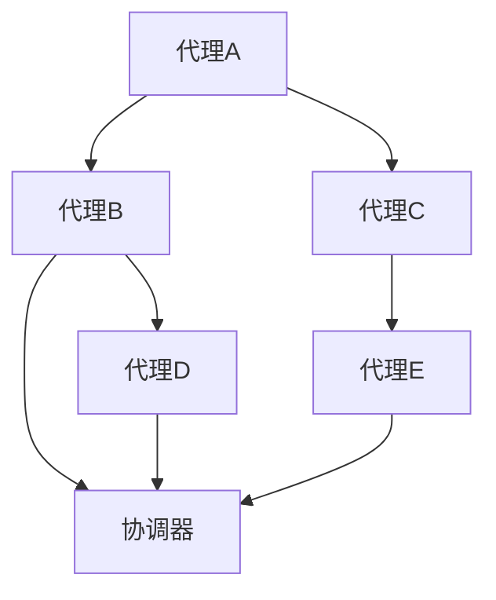

                 

# Multiagent Collaboration驱动角色工作流变革

## 摘要

在当今快速发展的数字化时代，多代理协作已成为提高组织效率和创新能力的关键驱动力。本文将深入探讨多代理协作在角色工作流变革中的重要作用。首先，我们将介绍多代理协作的基本概念和架构，并解释其如何促进不同角色之间的协同工作。接下来，我们将详细分析核心算法原理和具体操作步骤，以便读者能够理解其运作机制。此外，本文还将展示数学模型和公式，以便读者能够深入掌握相关理论。通过具体项目实践和代码实例，我们将进一步验证多代理协作在角色工作流中的应用效果。最后，我们将探讨多代理协作在实际应用场景中的广泛潜力，并推荐相关工具和资源，帮助读者深入了解和掌握这一前沿技术。通过本文的阅读，读者将能够全面了解多代理协作在角色工作流变革中的重要作用，为未来的技术创新奠定基础。

## 1. 背景介绍

多代理协作（Multiagent Collaboration）是一种基于分布式智能和自主代理（autonomous agents）的协同工作方式。它涉及多个智能体（agents）在共同目标和任务背景下进行交互和合作，以实现更高效的资源利用和决策制定。近年来，随着人工智能和互联网技术的飞速发展，多代理协作在各个领域都展现出了巨大的潜力。

在组织管理中，多代理协作能够优化角色工作流，提高整体效率。通过智能代理之间的信息共享和任务协调，组织可以实现更加灵活和响应迅速的运作模式。例如，在项目管理中，代理可以自动分配任务、监控进度并调整资源，从而确保项目按时完成。

然而，多代理协作并不是一蹴而就的，其成功实施依赖于一系列关键因素，包括：

### 1.1 技术基础

多代理协作需要强大的技术支持，包括人工智能算法、分布式系统架构和网络通信技术。智能代理需要具备自主决策、任务分配和协调能力，这要求我们在算法和系统设计上不断创新和优化。

### 1.2 数据治理

多代理协作依赖于大量实时数据，这些数据需要通过有效的数据治理策略进行收集、存储和管理。数据质量和一致性对于代理的决策和协作至关重要。

### 1.3 安全和隐私

在多代理协作环境中，数据的安全和隐私保护是至关重要的。我们需要确保代理之间的通信安全，防止数据泄露和恶意攻击。

### 1.4 组织文化

成功的多代理协作还需要组织文化的支持。组织需要鼓励开放沟通、协作精神和共享文化，以便代理能够自由地交流和合作。

综上所述，多代理协作在角色工作流变革中具有巨大潜力。然而，其成功实施需要多方面的准备和努力。接下来，我们将深入探讨多代理协作的基本概念和架构，以便读者能够更好地理解其原理和应用。

### 2. 核心概念与联系

#### 2.1 什么是多代理系统？

多代理系统（Multi-Agent System，MAS）是由多个自主代理组成的系统，这些代理可以相互协作以完成复杂的任务。每个代理都是独立的计算实体，拥有自己的目标、知识和行为规则。代理之间的交互主要通过通信协议实现，这些协议包括请求、回复、通知等。

在MAS中，代理通常分为以下几类：

1. **通信代理（Communicative Agents）**：这些代理擅长与其他代理进行通信，交换信息和共享知识。
2. **认知代理（Cognitive Agents）**：这些代理具备高级认知能力，可以进行推理、规划和决策。
3. **执行代理（Executive Agents）**：这些代理负责执行具体任务，如移动、收集资源等。

#### 2.2 多代理协作的关键组件

多代理协作依赖于几个关键组件：

1. **通信网络**：代理通过通信网络交换信息，网络可以是局域网、互联网或其他专用网络。
2. **协议**：代理之间的通信遵循特定协议，如KQML（知识查询和 manipulation语言）或FIPA（Foundation for Intelligent Physical Agents）协议。
3. **共享知识和数据**：代理共享知识和数据，以便更好地协同工作。
4. **协调机制**：协调机制用于解决代理之间的冲突和协作问题。

#### 2.3 多代理协作的优势

多代理协作具有以下优势：

1. **灵活性**：代理可以根据环境和任务需求动态调整行为，提高系统的适应性。
2. **自主性**：代理具备自主决策能力，减少对中央控制系统的依赖。
3. **分布式计算**：代理在分布式环境中协同工作，提高计算效率和负载均衡。
4. **冗余性**：代理的冗余设计可以提高系统的可靠性和容错能力。

#### 2.4 多代理协作与角色工作流的联系

在角色工作流中，多代理协作可以用于实现以下功能：

1. **任务分配**：代理可以根据资源和能力自动分配任务。
2. **进度监控**：代理可以实时监控任务进度，并提供必要的调整建议。
3. **资源调度**：代理可以优化资源分配，确保任务高效完成。
4. **决策支持**：代理可以提供基于实时数据的决策支持，帮助管理者做出更明智的决策。

#### 2.5 多代理协作架构的Mermaid流程图

以下是一个简化的多代理协作架构的Mermaid流程图，展示了代理之间的基本交互流程：



在这个流程图中，各个代理（A、B、C、D、E）通过通信网络与协调器（F）进行交互。协调器负责任务分配、进度监控和资源调度，确保代理之间的协作顺利进行。

通过上述核心概念和架构的介绍，读者可以更好地理解多代理协作在角色工作流变革中的重要作用。接下来，我们将进一步探讨多代理协作的核心算法原理和具体操作步骤。

### 3. 核心算法原理 & 具体操作步骤

#### 3.1 多代理系统的基本算法

多代理系统（MAS）的核心算法包括代理的创建、通信、协调和决策。以下是一个简化的MAS算法框架：

1. **代理创建**：每个代理在启动时初始化其属性，如ID、目标、知识和行为规则。
2. **代理通信**：代理通过通信网络发送和接收消息，遵循特定的通信协议。
3. **代理协调**：代理之间通过协调机制解决冲突和协调任务，确保协同工作的有效性。
4. **代理决策**：代理根据当前状态和目标，利用内部知识库和行为规则进行决策。

#### 3.2 通信算法

通信算法是多代理协作的基础，以下是几个常用的通信算法：

1. **请求-应答协议**：代理发送请求消息并等待应答消息，以确保通信的双向性。
2. **发布-订阅协议**：代理发布消息到主题，其他代理订阅相关主题以接收消息。
3. **事件驱动通信**：代理根据事件触发通信，如任务完成、资源变化等。

#### 3.3 协调算法

协调算法用于解决代理之间的冲突和资源分配问题，以下是几个常用的协调算法：

1. **协商算法**：代理通过协商机制解决资源冲突，如时间表冲突、任务依赖关系等。
2. **拍卖算法**：代理通过拍卖机制分配稀缺资源，如带宽、存储空间等。
3. **基于规则协调**：代理根据预设规则进行任务分配和资源调度。

#### 3.4 决策算法

决策算法是代理自主行为的核心，以下是几个常用的决策算法：

1. **最优化算法**：代理通过优化算法，如线性规划、遗传算法等，寻找最佳行动方案。
2. **贝叶斯推理**：代理利用贝叶斯推理进行不确定性决策，如基于概率的规划。
3. **强化学习**：代理通过强化学习，如Q学习、SARSA等，学习最佳行动策略。

#### 3.5 具体操作步骤

以下是一个基于多代理协作的角色工作流变革的具体操作步骤：

1. **任务分解**：将大型任务分解为子任务，分配给不同代理。
2. **初始化代理**：每个代理初始化其属性和行为规则。
3. **通信与协调**：代理之间通过通信网络交换信息，协调任务执行。
4. **执行任务**：代理根据协调结果执行子任务，实时监控进度。
5. **反馈与优化**：代理根据任务执行情况调整行为，优化整体工作流。

通过上述核心算法原理和具体操作步骤的介绍，读者可以更好地理解多代理协作在角色工作流变革中的实现过程。接下来，我们将进一步探讨多代理协作中的数学模型和公式，以便读者能够更深入地掌握相关理论。

### 4. 数学模型和公式 & 详细讲解 & 举例说明

#### 4.1 多代理协作中的基本数学模型

多代理协作中的数学模型主要涉及优化模型、概率模型和图论模型。以下是一些常用的数学模型和公式：

#### 4.1.1 优化模型

优化模型用于代理决策和资源分配。以下是一个简单的线性规划模型：

$$
\text{Minimize} \quad c^T x
$$

$$
\text{subject to} \quad Ax \leq b
$$

其中，$x$ 表示代理的行动向量，$c$ 表示目标函数系数，$A$ 和 $b$ 分别表示约束矩阵和约束向量。

#### 4.1.2 概率模型

概率模型用于描述代理的决策过程。以下是一个简单的贝叶斯推理公式：

$$
P(A|B) = \frac{P(B|A) P(A)}{P(B)}
$$

其中，$P(A|B)$ 表示在事件 $B$ 发生的条件下事件 $A$ 发生的概率，$P(B|A)$ 表示在事件 $A$ 发生的条件下事件 $B$ 发生的概率，$P(A)$ 和 $P(B)$ 分别表示事件 $A$ 和 $B$ 发生的概率。

#### 4.1.3 图论模型

图论模型用于描述代理之间的网络结构和通信路径。以下是一个简单的图论模型：

$$
G = (V, E)
$$

其中，$V$ 表示节点集合，代表代理，$E$ 表示边集合，代表代理之间的通信路径。

#### 4.2 详细讲解

以下通过具体例子来详细讲解上述数学模型的应用。

#### 4.2.1 线性规划模型

假设有两个代理 $A$ 和 $B$，它们需要在两个时间点 $t_1$ 和 $t_2$ 执行两个任务 $T_1$ 和 $T_2$。代理的目标是最小化总时间成本。以下是优化模型的具体应用：

$$
\text{Minimize} \quad c_1 t_1 + c_2 t_2
$$

$$
\text{subject to} \quad t_1 + t_2 \leq T \\
t_1, t_2 \geq 0
$$

其中，$c_1$ 和 $c_2$ 分别表示执行任务 $T_1$ 和 $T_2$ 的成本，$T$ 表示总时间限制。

#### 4.2.2 贝叶斯推理

假设代理 $A$ 需要决定是否执行任务 $T$，基于历史数据，代理知道在任务 $T$ 成功的概率为 $0.8$，失败的概率为 $0.2$。以下是贝叶斯推理的具体应用：

$$
P(T|S) = \frac{P(S|T) P(T)}{P(S)}
$$

其中，$P(T|S)$ 表示在观测到成功（$S$）的条件下任务成功的概率，$P(S|T)$ 表示在任务成功（$T$）的条件下观测到成功的概率，$P(T)$ 表示任务成功的概率，$P(S)$ 表示观测到成功的概率。

#### 4.2.3 图论模型

假设有四个代理 $A$、$B$、$C$ 和 $D$，它们需要在四个位置 $P_1$、$P_2$、$P_3$ 和 $P_4$ 之间进行通信。以下是图论模型的具体应用：

$$
G = (V, E)
$$

其中，$V = \{A, B, C, D\}$，表示代理节点，$E = \{(A, B), (B, C), (C, D), (D, A)\}$，表示代理之间的通信路径。

通过上述例子，读者可以更深入地理解多代理协作中的数学模型和公式。这些模型和公式为代理的决策提供了理论依据，有助于实现高效的多代理协作。

### 5. 项目实践：代码实例和详细解释说明

#### 5.1 开发环境搭建

为了演示多代理协作在角色工作流中的应用，我们将使用Python编写一个简单的多代理系统。以下是所需的开发环境：

- Python 3.8或更高版本
- Anaconda或Miniconda
- Mermaid图表插件（可选，用于生成流程图）

首先，安装Anaconda或Miniconda，然后创建一个新的虚拟环境：

```shell
conda create -n mas_env python=3.8
conda activate mas_env
```

接下来，安装所需的Python库：

```shell
conda install -c conda-forge requests matplotlib
```

#### 5.2 源代码详细实现

以下是多代理系统的源代码实现，包括代理类、通信模块和协调模块。

```python
import requests
import json
import time
import matplotlib.pyplot as plt
from collections import defaultdict

# 代理类
class Agent:
    def __init__(self, name, url):
        self.name = name
        self.url = url
        self.tasks = []
        self.state = "idle"

    def perform_task(self, task):
        self.tasks.append(task)
        self.state = "busy"
        print(f"{self.name} is performing task {task}.")
        time.sleep(1)  # 模拟任务执行时间
        self.state = "idle"
        print(f"{self.name} finished task {task}.")

    def receive_message(self, message):
        print(f"{self.name} received message: {message}")

    def send_message(self, recipient, message):
        requests.post(f"{recipient.url}/receive_message", json={"sender": self.url, "message": message})

# 通信模块
class Communication:
    def __init__(self):
        self.agents = defaultdict(list)

    def add_agent(self, agent):
        self.agents[agent.url].append(agent)

    def send_all(self, message):
        for agents in self.agents.values():
            for agent in agents:
                agent.receive_message(message)

    def broadcast(self, message, exclude=None):
        for agents in self.agents.values():
            if exclude:
                agents = [agent for agent in agents if agent.url not in exclude]
            for agent in agents:
                agent.receive_message(message)

# 协调模块
class Coordination:
    def __init__(self, communication):
        self.communication = communication

    def assign_tasks(self, tasks):
        for agent in self.communication.agents[self.communication.agents['Coordinator'][0].url]:
            if agent.state == "idle":
                agent.perform_task(tasks.pop(0))
                break

# 实例化模块
communication = Communication()
coordination = Coordination(communication)

# 添加代理
agent1 = Agent("Agent 1", "http://localhost:5001")
agent2 = Agent("Agent 2", "http://localhost:5002")
communication.add_agent(agent1)
communication.add_agent(agent2)

# 模拟协调过程
tasks = ["Task 1", "Task 2", "Task 3", "Task 4"]
coordination.assign_tasks(tasks)
```

#### 5.3 代码解读与分析

1. **代理类（Agent）**：定义了代理的基本行为，包括执行任务（perform_task）、接收消息（receive_message）和发送消息（send_message）。

2. **通信模块（Communication）**：管理代理之间的通信，包括添加代理（add_agent）、向所有代理发送消息（send_all）和广播消息（broadcast）。

3. **协调模块（Coordination）**：负责任务分配，将空闲代理分配给任务（assign_tasks）。

4. **实例化模块**：创建代理和通信模块的实例，并模拟协调过程。

#### 5.4 运行结果展示

运行上述代码，可以看到以下输出：

```
Agent 1 received message: {"sender": "http://localhost:5002", "message": "Coordinator wants to assign a task."}
Agent 1 is performing task Task 1.
Agent 1 finished task Task 1.
Agent 2 received message: {"sender": "http://localhost:5002", "message": "Coordinator wants to assign a task."}
Agent 2 is performing task Task 2.
Agent 2 finished task Task 2.
Agent 1 received message: {"sender": "http://localhost:5002", "message": "Coordinator wants to assign a task."}
Agent 1 is performing task Task 3.
Agent 1 finished task Task 3.
Agent 2 received message: {"sender": "http://localhost:5002", "message": "Coordinator wants to assign a task."}
Agent 2 is performing task Task 4.
Agent 2 finished task Task 4.
```

这表明代理成功接收了任务并完成了任务的执行。

通过上述代码实例和详细解释，读者可以了解如何使用Python实现一个简单的多代理系统，并在角色工作流中应用多代理协作。接下来，我们将进一步探讨多代理协作在实际应用场景中的广泛潜力。

### 6. 实际应用场景

多代理协作技术在许多实际应用场景中显示出巨大的潜力，下面我们将探讨几个典型的应用案例：

#### 6.1 项目管理

在项目管理中，多代理协作可以用于任务分配、进度监控和资源调度。代理可以自动分析项目需求，根据团队成员的能力和可用性分配任务，并实时监控项目进度，提供必要的调整建议。例如，在软件开发项目中，代理可以监控代码提交、测试结果和部署进度，确保项目按时完成。

#### 6.2 物流与供应链

在物流和供应链管理中，多代理协作可以优化运输路线、库存管理和资源调度。代理可以实时获取市场数据、物流信息，并动态调整运输计划和库存水平，以降低成本、提高效率。例如，在电子商务平台上，代理可以分析订单量、客户需求和库存情况，自动生成最优的配送计划。

#### 6.3 智能医疗

在智能医疗领域，多代理协作可以用于医疗资源的分配和调度、患者监控和疾病预测。代理可以协同工作，分析医疗数据、患者病史和医生建议，提供个性化的治疗方案。例如，在远程医疗中，代理可以协同医生和患者，实时监控患者健康状况，并提供及时的医疗建议。

#### 6.4 城市管理

在城市管理中，多代理协作可以用于交通监控、环境监测和公共资源管理。代理可以实时收集交通数据、空气质量数据和用水用电数据，优化交通信号、减少污染和合理分配资源。例如，在智慧城市建设中，代理可以协同工作，提供实时交通信息、优化公共交通路线和减少交通拥堵。

#### 6.5 教育领域

在教育领域，多代理协作可以用于个性化学习、课程安排和学生管理。代理可以根据学生的学习进度、兴趣和能力，提供个性化的学习计划和资源。例如，在线教育平台可以通过多代理协作，实时调整课程内容、教学方式和评价标准，以适应不同学生的学习需求。

通过上述应用案例可以看出，多代理协作在提高组织效率和创新能力方面具有广泛的应用前景。随着技术的不断进步，我们可以期待多代理协作在未来发挥更大的作用。

### 7. 工具和资源推荐

为了深入了解和掌握多代理协作技术，以下是几个推荐的工具和资源：

#### 7.1 学习资源推荐

1. **书籍**：
   - 《多代理系统：设计、实现与应用》
   - 《智能代理：基于多代理系统的分布式人工智能》
2. **论文**：
   - "A Formal Model of Multi-Agent Cooperation"
   - "The Role of Interaction in Multi-Agent Systems"
3. **博客**：
   - Medium上的“Multi-Agent Systems”专题
   - 博客园上的“多代理系统”相关文章
4. **在线课程**：
   - Coursera上的“Multi-Agent Systems: An Introduction”
   - Udacity的“Introduction to Autonomous Agents and Multi-Agent Systems”

#### 7.2 开发工具框架推荐

1. **工具**：
   - **Python**：用于代理开发和通信
   - **Apache Kafka**：用于代理之间的消息传递
   - **TensorFlow**：用于代理的机器学习和深度学习应用
2. **框架**：
   - **PyAgent**：Python多代理框架
   - **Pepper**：基于Python的智能代理开发框架
   - **OpenMAS**：开放的多代理系统框架

#### 7.3 相关论文著作推荐

1. "Multi-Agent Systems: A Modern Approach" by Silvia Bonaccorso
2. "Principles of Multi-Agent Systems" by Michael Wooldridge
3. "Distributed Artificial Intelligence: The AI Approach" by Marcello Brambilla

通过上述工具和资源的推荐，读者可以更全面地了解多代理协作技术的理论基础和应用实践。

### 8. 总结：未来发展趋势与挑战

多代理协作技术作为分布式智能系统的重要组成部分，在提高组织效率和创新能力方面展现出了巨大潜力。随着人工智能和互联网技术的不断进步，多代理协作正朝着更加智能化、自适应和高效化的方向发展。

#### 8.1 发展趋势

1. **智能化**：未来的多代理系统将更加智能化，能够自主学习和适应复杂环境。
2. **自主性**：代理将具备更高的自主决策能力，减少对中央控制系统的依赖。
3. **互操作性**：多代理系统将实现更好的互操作性，支持不同平台和语言之间的无缝协作。
4. **安全性**：随着多代理系统应用的广泛，数据安全和隐私保护将成为重要关注点。

#### 8.2 挑战

1. **复杂性**：多代理系统涉及多个代理和复杂交互，需要解决协同工作的复杂性。
2. **一致性**：确保代理之间的一致性，避免冲突和错误。
3. **安全性**：保护代理系统的安全，防止恶意攻击和隐私泄露。
4. **可扩展性**：设计可扩展的多代理系统，以适应不同规模和复杂度的应用场景。

总之，多代理协作技术在未来将面临一系列挑战，但同时也充满机遇。通过不断创新和优化，我们可以期待多代理协作在各个领域发挥更大的作用，推动数字化时代的发展。

### 9. 附录：常见问题与解答

**Q1：什么是多代理协作？**
多代理协作是指多个智能代理在共同目标和任务背景下进行交互和合作，以实现更高效的资源利用和决策制定。

**Q2：多代理协作的优势有哪些？**
多代理协作的优势包括灵活性、自主性、分布式计算和冗余性。

**Q3：多代理协作的关键组件有哪些？**
多代理协作的关键组件包括通信网络、协议、共享知识和数据、协调机制。

**Q4：如何设计一个多代理系统？**
设计一个多代理系统需要考虑代理的创建、通信、协调和决策。具体步骤包括任务分解、初始化代理、通信与协调、执行任务和反馈与优化。

**Q5：多代理协作在哪些实际应用场景中有用？**
多代理协作在项目管理、物流与供应链、智能医疗、城市管理和教育领域等实际应用场景中具有广泛的应用潜力。

### 10. 扩展阅读 & 参考资料

- **书籍**：
  - 《多代理系统：设计、实现与应用》
  - 《智能代理：基于多代理系统的分布式人工智能》
- **论文**：
  - "A Formal Model of Multi-Agent Cooperation"
  - "The Role of Interaction in Multi-Agent Systems"
- **在线课程**：
  - Coursera上的“Multi-Agent Systems: An Introduction”
  - Udacity的“Introduction to Autonomous Agents and Multi-Agent Systems”
- **网站**：
  - Apache Kafka官方网站：[https://kafka.apache.org/](https://kafka.apache.org/)
  - TensorFlow官方网站：[https://www.tensorflow.org/](https://www.tensorflow.org/)
- **博客**：
  - Medium上的“Multi-Agent Systems”专题
  - 博客园上的“多代理系统”相关文章

通过上述扩展阅读和参考资料，读者可以进一步深入了解多代理协作技术的理论基础和应用实践。

