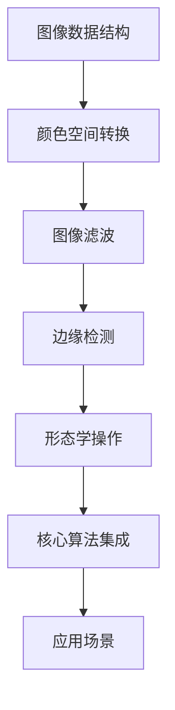
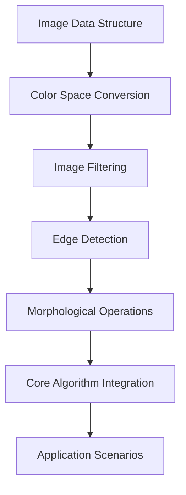

                 

### 1. 背景介绍（Background Introduction）

#### OpenCV简介
OpenCV（Open Source Computer Vision Library）是一个开源的计算机视觉库，由Intel于2000年发起，目前由全球的计算机视觉研究者共同维护。OpenCV提供了丰富的图像处理、计算机视觉和机器学习算法，支持包括C++、Python、Java等多种编程语言，广泛应用于学术研究、工业自动化、医疗成像、自动驾驶等多个领域。

#### OpenCV的应用领域
OpenCV在图像处理和计算机视觉领域具有广泛的应用，例如：

1. **人脸识别**：OpenCV可以用于人脸检测和人脸识别，实现身份验证、安全监控等功能。
2. **目标跟踪**：通过跟踪物体的运动轨迹，OpenCV在视频监控、自动驾驶等领域有重要应用。
3. **图像分割**：利用图像分割技术，OpenCV可以实现图像中的对象提取，为后续的图像分析和处理提供基础。
4. **图像增强**：OpenCV提供了多种图像增强算法，可以提高图像的质量和视觉效果。
5. **机器学习**：OpenCV集成了多个机器学习算法，可以用于构建图像识别和分类模型。

#### 目标与结构
本文的目标是引导读者深入了解OpenCV的图像处理实战。我们将首先介绍OpenCV的基本概念和安装过程，然后深入探讨其核心算法，包括图像滤波、边缘检测、形态学操作等。接下来，通过一个实际项目实例，详细介绍如何使用OpenCV进行图像处理。最后，我们将讨论OpenCV在实际应用场景中的实践，并提供一些开发工具和资源的推荐。

**Keywords**: OpenCV, Image Processing, Computer Vision, Algorithm, Practice

> **摘要**：本文将介绍OpenCV的基础知识，详细探讨其核心算法和实际应用。通过实际项目实例，读者将学会如何使用OpenCV进行图像处理，并在实践中掌握相关技术。

---

### 1. 背景介绍（Background Introduction）

#### OpenCV简介
OpenCV（Open Source Computer Vision Library）是一个开源的计算机视觉库，由Intel于2000年发起，目前由全球的计算机视觉研究者共同维护。OpenCV提供了丰富的图像处理、计算机视觉和机器学习算法，支持包括C++、Python、Java等多种编程语言，广泛应用于学术研究、工业自动化、医疗成像、自动驾驶等多个领域。

OpenCV的目标是构建一个跨平台的开源计算机视觉库，支持多种操作系统，包括Windows、Linux和macOS。它不仅涵盖了基本的图像处理功能，如滤波、阈值处理、形态学操作等，还包括了高级的计算机视觉技术，如目标检测、图像分割、特征提取和匹配等。

#### OpenCV的应用领域
OpenCV在图像处理和计算机视觉领域具有广泛的应用，例如：

1. **人脸识别**：OpenCV可以用于人脸检测和人脸识别，实现身份验证、安全监控等功能。通过使用Haar级联分类器和LBP（局部二值模式）特征，OpenCV能够高效地检测和识别人脸。
   
2. **目标跟踪**：OpenCV的Target Tracking API提供了多种跟踪算法，如KCF（Kernelized Correlation Filters）、TLD（Template Based Lucas-Kanade）和CSRT（Correlation Filter with Support Vector Regression）。这些算法在视频监控、无人驾驶和机器视觉等领域有重要应用。

3. **图像分割**：图像分割是将图像分成若干个区域或对象的过程。OpenCV提供了多种图像分割算法，如基于阈值的分割、区域增长分割和基于模糊度的分割。这些算法在对象提取、图像分析和模式识别中具有重要应用。

4. **图像增强**：图像增强是改善图像质量、提高视觉效果的技术。OpenCV提供了多种图像增强算法，如对比度增强、边缘增强和滤波增强。这些算法在图像处理、医学成像和监控系统中有广泛应用。

5. **机器学习**：OpenCV集成了多个机器学习算法，如SVM（支持向量机）、KNN（K近邻）和随机森林。这些算法可以用于构建图像识别和分类模型，实现目标检测、人脸识别和图像分类等功能。

#### 目标与结构
本文的目标是引导读者深入了解OpenCV的图像处理实战。我们将首先介绍OpenCV的基本概念和安装过程，然后深入探讨其核心算法，包括图像滤波、边缘检测、形态学操作等。接下来，通过一个实际项目实例，详细介绍如何使用OpenCV进行图像处理。最后，我们将讨论OpenCV在实际应用场景中的实践，并提供一些开发工具和资源的推荐。

**Keywords**: OpenCV, Image Processing, Computer Vision, Algorithm, Practice

> **摘要**：本文将介绍OpenCV的基础知识，详细探讨其核心算法和实际应用。通过实际项目实例，读者将学会如何使用OpenCV进行图像处理，并在实践中掌握相关技术。

---

## 2. 核心概念与联系（Core Concepts and Connections）

### 2.1 OpenCV基础概念
在深入讨论OpenCV的图像处理算法之前，首先需要理解一些基本概念：

1. **图像数据结构**：OpenCV使用`cv::Mat`类来表示图像数据。`cv::Mat`是一个多维数组，通常用于存储二维或三维图像数据。二维图像通常使用行和列表示，而三维图像则包括深度信息。

2. **图像类型**：OpenCV支持多种图像类型，包括灰度图像、RGB图像和HSV图像。每种图像类型都有其特定的数据表示和操作方法。

3. **颜色空间转换**：OpenCV提供了多种颜色空间转换函数，如`cv::cvtColor()`，用于将图像从一种颜色空间转换为另一种颜色空间。

4. **图像滤波**：图像滤波是一种常用的图像处理技术，用于去除噪声或改善图像质量。OpenCV提供了多种滤波器，如均值滤波、高斯滤波和中值滤波。

5. **边缘检测**：边缘检测是图像处理中的重要步骤，用于提取图像中的轮廓和边界。OpenCV提供了多种边缘检测算法，如Canny边缘检测和Sobel边缘检测。

6. **形态学操作**：形态学操作是一类基于图像结构的操作，用于提取图像中的特征和结构。OpenCV提供了多种形态学操作，如膨胀、腐蚀、开运算和闭运算。

### 2.2 OpenCV核心算法原理
OpenCV的核心算法包括图像滤波、边缘检测和形态学操作。以下是这些算法的基本原理：

1. **图像滤波**：图像滤波是通过卷积操作对图像进行平滑处理。卷积操作将图像数据与一个滤波器核进行卷积，从而生成滤波后的图像。不同类型的滤波器核可以用于去除噪声、增强边缘或改善图像质量。

2. **边缘检测**：边缘检测是通过检测图像中亮度变化的剧烈程度来确定图像中的轮廓和边界。Canny边缘检测算法是一种经典的边缘检测算法，它通过计算图像梯度的幅度和方向来确定边缘。Sobel边缘检测算法则通过计算图像梯度的幅度来检测边缘。

3. **形态学操作**：形态学操作是基于图像的结构进行的一系列操作。膨胀操作通过将图像中的每个像素与其邻域内的最大值进行比较来增强图像中的结构。腐蚀操作则通过将图像中的每个像素与其邻域内的最小值进行比较来减小图像中的结构。开运算和闭运算则是膨胀和腐蚀操作的组合，用于去除图像中的小孔或连接相邻的结构。

### 2.3 OpenCV核心算法架构
OpenCV的核心算法架构如图所示：



**Keywords**: OpenCV, Image Processing, Algorithm, Architecture

---

## 2. Core Concepts and Connections

### 2.1 Basic Concepts of OpenCV
Before delving into the image processing algorithms of OpenCV, it is essential to understand some fundamental concepts:

1. **Image Data Structure**: OpenCV uses the `cv::Mat` class to represent image data. `cv::Mat` is a multidimensional array commonly used to store two-dimensional or three-dimensional image data. Two-dimensional images are typically represented by rows and columns, while three-dimensional images include depth information.

2. **Image Types**: OpenCV supports various image types, including grayscale images, RGB images, and HSV images. Each image type has its specific data representation and operation methods.

3. **Color Space Conversion**: OpenCV provides several color space conversion functions, such as `cv::cvtColor()`, which are used to convert an image from one color space to another.

4. **Image Filtering**: Image filtering is a common image processing technique used to remove noise or improve image quality. OpenCV provides various filtering methods, such as mean filtering, Gaussian filtering, and median filtering.

5. **Edge Detection**: Edge detection is an important step in image processing used to extract contours and boundaries in images. OpenCV provides several edge detection algorithms, such as Canny edge detection and Sobel edge detection.

6. **Morphological Operations**: Morphological operations are a set of operations based on the structure of an image. These operations are used to extract features and structures from images. OpenCV provides several morphological operations, such as dilation, erosion, opening, and closing.

### 2.2 Principles of Core Algorithms
The core algorithms of OpenCV include image filtering, edge detection, and morphological operations. Here are the basic principles of these algorithms:

1. **Image Filtering**: Image filtering is performed through a convolution operation on the image data. The convolution operation involves performing a dot product between the image data and a filter kernel to generate the filtered image. Different filter kernels can be used for removing noise, enhancing edges, or improving image quality.

2. **Edge Detection**: Edge detection is the process of detecting abrupt changes in brightness levels in an image to determine contours and boundaries. The Canny edge detection algorithm is a classic edge detection method that detects edges by computing the magnitude and direction of the image gradient. The Sobel edge detection algorithm, on the other hand, detects edges by computing the magnitude of the image gradient.

3. **Morphological Operations**: Morphological operations are a series of operations based on the structure of an image. Dilation operation enhances the structure of an image by comparing each pixel with the maximum value in its neighborhood. Erosion operation, on the other hand, reduces the structure of an image by comparing each pixel with the minimum value in its neighborhood. Opening and closing operations are combinations of dilation and erosion, used to remove small holes or connect adjacent structures.

### 2.3 Architecture of Core Algorithms
The architecture of the core algorithms in OpenCV is depicted in the following diagram:



**Keywords**: OpenCV, Image Processing, Algorithm, Architecture

---

## 3. 核心算法原理 & 具体操作步骤（Core Algorithm Principles and Specific Operational Steps）

### 3.1 图像滤波（Image Filtering）

#### 均值滤波（Mean Filtering）
均值滤波是一种简单的图像滤波方法，它通过对图像的每个像素进行局部平均来降低噪声。

1. **原理**：均值滤波通过将图像中的每个像素与其邻域内的像素值求平均来降低图像噪声。这种方法可以有效减少图像中的高频噪声，但可能会模糊图像细节。

2. **操作步骤**：
   - 定义一个滤波窗口（如3x3或5x5的大小）。
   - 计算滤波窗口内像素值的平均值。
   - 将原始像素值替换为计算得到的平均值。

```python
import cv2
import numpy as np

def mean_filter(image, kernel_size=3):
    # 创建一个与原始图像相同大小的零矩阵
    filtered_image = np.zeros_like(image)

    # 定义卷积操作
    for i in range(image.shape[0] - kernel_size + 1):
        for j in range(image.shape[1] - kernel_size + 1):
            window = image[i:i + kernel_size, j:j + kernel_size]
            filtered_image[i, j] = np.mean(window)

    return filtered_image

# 读取图像
image = cv2.imread('image.jpg', cv2.IMREAD_GRAYSCALE)

# 应用均值滤波
filtered_image = mean_filter(image)

# 显示滤波后的图像
cv2.imshow('Filtered Image', filtered_image)
cv2.waitKey(0)
cv2.destroyAllWindows()
```

#### 高斯滤波（Gaussian Filtering）
高斯滤波是一种基于高斯函数的图像滤波方法，它可以有效去除图像中的高斯噪声。

1. **原理**：高斯滤波使用一个高斯函数作为滤波器核，通过卷积操作对图像进行滤波。高斯滤波器具有平滑图像的功能，可以去除高斯噪声，同时保留图像细节。

2. **操作步骤**：
   - 创建一个高斯滤波器，其大小和标准差根据图像噪声的强度和期望的平滑程度进行调整。
   - 对图像进行卷积操作，以平滑图像。

```python
import cv2
import numpy as np

def gaussian_filter(image, sigma=1.0):
    # 创建高斯滤波器
    kernel = cv2.getGaussianKernel(ksize=3, sigma=sigma)

    # 应用高斯滤波
    filtered_image = cv2.filter2D(image, -1, kernel)

    return filtered_image

# 读取图像
image = cv2.imread('image.jpg', cv2.IMREAD_GRAYSCALE)

# 应用高斯滤波
filtered_image = gaussian_filter(image, sigma=1.0)

# 显示滤波后的图像
cv2.imshow('Filtered Image', filtered_image)
cv2.waitKey(0)
cv2.destroyAllWindows()
```

#### 中值滤波（Median Filtering）
中值滤波是一种基于中值计算的图像滤波方法，它可以有效去除图像中的椒盐噪声。

1. **原理**：中值滤波通过计算图像窗口内的像素中值来替换窗口中心的像素值。这种方法可以有效去除图像中的椒盐噪声，同时保留图像细节。

2. **操作步骤**：
   - 定义一个滤波窗口（如3x3或5x5的大小）。
   - 计算滤波窗口内像素的中值。
   - 将原始像素值替换为中值。

```python
import cv2
import numpy as np

def median_filter(image, kernel_size=3):
    # 创建一个与原始图像相同大小的零矩阵
    filtered_image = np.zeros_like(image)

    # 定义卷积操作
    for i in range(image.shape[0] - kernel_size + 1):
        for j in range(image.shape[1] - kernel_size + 1):
            window = image[i:i + kernel_size, j:j + kernel_size]
            filtered_image[i, j] = np.median(window)

    return filtered_image

# 读取图像
image = cv2.imread('image.jpg', cv2.IMREAD_GRAYSCALE)

# 应用中值滤波
filtered_image = median_filter(image)

# 显示滤波后的图像
cv2.imshow('Filtered Image', filtered_image)
cv2.waitKey(0)
cv2.destroyAllWindows()
```

### 3.2 边缘检测（Edge Detection）

#### Canny边缘检测（Canny Edge Detection）
Canny边缘检测是一种经典的边缘检测算法，它通过计算图像梯度的幅度和方向来检测边缘。

1. **原理**：Canny边缘检测算法包括三个主要步骤：高斯滤波、非极大值抑制和双阈值处理。
   - **高斯滤波**：使用高斯滤波器平滑图像，去除噪声。
   - **非极大值抑制**：在梯度的方向上抑制非极大值，保留局部最大值。
   - **双阈值处理**：使用高阈值和低阈值对图像进行二值化，保留边缘。

2. **操作步骤**：
   - 应用高斯滤波器平滑图像。
   - 计算图像的梯度幅度和方向。
   - 应用非极大值抑制。
   - 使用双阈值处理对图像进行二值化。

```python
import cv2
import numpy as np

def canny_edge_detection(image, low_threshold=50, high_threshold=150):
    # 应用高斯滤波器平滑图像
    blurred_image = cv2.GaussianBlur(image, ksize=(5, 5), sigmaX=1.5)

    # 计算图像的梯度幅度和方向
    gradient_x = cv2.Sobel(blurred_image, ddepth=cv2.CV_32F, dx=1, dy=0, ksize=5)
    gradient_y = cv2.Sobel(blurred_image, ddepth=cv2.CV_32F, dx=0, dy=1, ksize=5)

    gradient_magnitude = cv2.magnitude(gradient_x, gradient_y)
    gradient_angle = cv2.phase(gradient_x, gradient_y)

    # 应用非极大值抑制
    non_max_suppression = cv2.NMSBoxes(gradient_magnitude, gradient_angle, low_threshold, high_threshold)

    # 使用双阈值处理对图像进行二值化
    binary_image = cv2.Canny(gradient_magnitude, low_threshold, high_threshold)

    return binary_image

# 读取图像
image = cv2.imread('image.jpg', cv2.IMREAD_GRAYSCALE)

# 应用Canny边缘检测
edge_image = canny_edge_detection(image)

# 显示边缘检测结果
cv2.imshow('Edge Image', edge_image)
cv2.waitKey(0)
cv2.destroyAllWindows()
```

#### Sobel边缘检测（Sobel Edge Detection）
Sobel边缘检测是一种基于空间梯度的边缘检测算法，它通过计算图像的水平和垂直梯度来检测边缘。

1. **原理**：Sobel边缘检测算法通过计算图像在水平和垂直方向上的导数来检测边缘。这种方法可以有效检测图像中的直线边缘。

2. **操作步骤**：
   - 计算图像的水平梯度。
   - 计算图像的垂直梯度。
   - 计算水平和垂直梯度的幅值。
   - 应用二值化操作提取边缘。

```python
import cv2
import numpy as np

def sobel_edge_detection(image, threshold=30):
    # 计算水平梯度
    gradient_x = cv2.Sobel(image, ddepth=cv2.CV_32F, dx=1, dy=0, ksize=3)

    # 计算垂直梯度
    gradient_y = cv2.Sobel(image, ddepth=cv2.CV_32F, dx=0, dy=1, ksize=3)

    # 计算水平和垂直梯度的幅值
    gradient_magnitude = cv2.magnitude(gradient_x, gradient_y)

    # 应用二值化操作提取边缘
    _, edge_image = cv2.threshold(gradient_magnitude, threshold, 255, cv2.THRESH_BINARY)

    return edge_image

# 读取图像
image = cv2.imread('image.jpg', cv2.IMREAD_GRAYSCALE)

# 应用Sobel边缘检测
edge_image = sobel_edge_detection(image)

# 显示边缘检测结果
cv2.imshow('Edge Image', edge_image)
cv2.waitKey(0)
cv2.destroyAllWindows()
```

### 3.3 形态学操作（Morphological Operations）

#### 膨胀（Dilation）
膨胀操作通过将图像中的每个像素与其邻域内的最大值进行比较来增强图像中的结构。

1. **原理**：膨胀操作是将图像中的每个像素值替换为其邻域内的最大值。这种方法可以增强图像中的结构，使其更加突出。

2. **操作步骤**：
   - 定义一个膨胀核（如矩形或圆形）。
   - 对图像进行卷积操作，将每个像素值替换为其邻域内的最大值。

```python
import cv2
import numpy as np

def dilation(image, kernel_size=3):
    # 创建膨胀核
    kernel = cv2.getStructuringElement(cv2.MORPH_RECT, ksize=(kernel_size, kernel_size))

    # 应用膨胀操作
    dilated_image = cv2.dilate(image, kernel, iterations=1)

    return dilated_image

# 读取图像
image = cv2.imread('image.jpg', cv2.IMREAD_GRAYSCALE)

# 应用膨胀操作
dilated_image = dilation(image)

# 显示膨胀后的图像
cv2.imshow('Dilated Image', dilated_image)
cv2.waitKey(0)
cv2.destroyAllWindows()
```

#### 腐蚀（Erosion）
腐蚀操作通过将图像中的每个像素与其邻域内的最小值进行比较来减小图像中的结构。

1. **原理**：腐蚀操作是将图像中的每个像素值替换为其邻域内的最小值。这种方法可以减小图像中的结构，使其变得更加平滑。

2. **操作步骤**：
   - 定义一个腐蚀核（如矩形或圆形）。
   - 对图像进行卷积操作，将每个像素值替换为其邻域内的最小值。

```python
import cv2
import numpy as np

def erosion(image, kernel_size=3):
    # 创建腐蚀核
    kernel = cv2.getStructuringElement(cv2.MORPH_RECT, ksize=(kernel_size, kernel_size))

    # 应用腐蚀操作
    eroded_image = cv2.erode(image, kernel, iterations=1)

    return eroded_image

# 读取图像
image = cv2.imread('image.jpg', cv2.IMREAD_GRAYSCALE)

# 应用腐蚀操作
eroded_image = erosion(image)

# 显示腐蚀后的图像
cv2.imshow('Eroded Image', eroded_image)
cv2.waitKey(0)
cv2.destroyAllWindows()
```

#### 开运算（Opening）
开运算是一种结合了腐蚀和膨胀操作的形态学操作，它可以用于去除图像中的小孔洞。

1. **原理**：开运算首先进行腐蚀操作，然后进行膨胀操作。这种方法可以减小图像中的噪声和突出结构。

2. **操作步骤**：
   - 定义腐蚀核和膨胀核。
   - 先对图像进行腐蚀操作，然后进行膨胀操作。

```python
import cv2
import numpy as np

def opening(image, erosion_kernel_size=3, dilation_kernel_size=3):
    # 创建腐蚀核和膨胀核
    erosion_kernel = cv2.getStructuringElement(cv2.MORPH_RECT, ksize=(erosion_kernel_size, erosion_kernel_size))
    dilation_kernel = cv2.getStructuringElement(cv2.MORPH_RECT, ksize=(dilation_kernel_size, dilation_kernel_size))

    # 应用腐蚀操作
    eroded_image = cv2.erode(image, erosion_kernel, iterations=1)

    # 应用膨胀操作
    dilated_image = cv2.dilate(eroded_image, dilation_kernel, iterations=1)

    return dilated_image

# 读取图像
image = cv2.imread('image.jpg', cv2.IMREAD_GRAYSCALE)

# 应用开运算
opened_image = opening(image)

# 显示开运算后的图像
cv2.imshow('Opening Image', opened_image)
cv2.waitKey(0)
cv2.destroyAllWindows()
```

#### 闭运算（Closing）
闭运算是一种结合了膨胀和腐蚀操作的形态学操作，它可以用于连接图像中的相邻结构。

1. **原理**：闭运算首先进行膨胀操作，然后进行腐蚀操作。这种方法可以连接图像中的相邻结构，使其更加完整。

2. **操作步骤**：
   - 定义膨胀核和腐蚀核。
   - 先对图像进行膨胀操作，然后进行腐蚀操作。

```python
import cv2
import numpy as np

def closing(image, dilation_kernel_size=3, erosion_kernel_size=3):
    # 创建膨胀核和腐蚀核
    dilation_kernel = cv2.getStructuringElement(cv2.MORPH_RECT, ksize=(dilation_kernel_size, dilation_kernel_size))
    erosion_kernel = cv2.getStructuringElement(cv2.MORPH_RECT, ksize=(erosion_kernel_size, erosion_kernel_size))

    # 应用膨胀操作
    dilated_image = cv2.dilate(image, dilation_kernel, iterations=1)

    # 应用腐蚀操作
    eroded_image = cv2.erode(dilated_image, erosion_kernel, iterations=1)

    return eroded_image

# 读取图像
image = cv2.imread('image.jpg', cv2.IMREAD_GRAYSCALE)

# 应用闭运算
closed_image = closing(image)

# 显示闭运算后的图像
cv2.imshow('Closing Image', closed_image)
cv2.waitKey(0)
cv2.destroyAllWindows()
```

**Keywords**: OpenCV, Image Filtering, Edge Detection, Morphological Operations, Algorithm, Implementation

---

### 3.3 Core Algorithm Principles and Specific Operational Steps

#### 3.3.1 Image Filtering

##### Mean Filtering
Mean filtering is a simple image filtering method that reduces noise in an image by averaging the pixel values of a local region.

1. **Principle**: Mean filtering calculates the average of the pixel values within a specified neighborhood and replaces the central pixel value with this average. This method can effectively reduce high-frequency noise but may blur image details.

2. **Operational Steps**:
   - Define a filtering window (e.g., 3x3 or 5x5 in size).
   - Compute the average of the pixel values within the filtering window.
   - Replace the original pixel value with the computed average.

```python
import cv2
import numpy as np

def mean_filter(image, kernel_size=3):
    # Create a zero matrix with the same size as the original image
    filtered_image = np.zeros_like(image)

    # Define the convolution operation
    for i in range(image.shape[0] - kernel_size + 1):
        for j in range(image.shape[1] - kernel_size + 1):
            window = image[i:i + kernel_size, j:j + kernel_size]
            filtered_image[i, j] = np.mean(window)

    return filtered_image

# Read the image
image = cv2.imread('image.jpg', cv2.IMREAD_GRAYSCALE)

# Apply mean filtering
filtered_image = mean_filter(image)

# Display the filtered image
cv2.imshow('Filtered Image', filtered_image)
cv2.waitKey(0)
cv2.destroyAllWindows()
```

##### Gaussian Filtering
Gaussian filtering is an image filtering method based on the Gaussian function, which effectively removes Gaussian noise from images.

1. **Principle**: Gaussian filtering uses a Gaussian function as the filter kernel and performs convolution on the image data to smooth it. The Gaussian filter kernel has the effect of smoothing images, removing Gaussian noise, and preserving image details.

2. **Operational Steps**:
   - Create a Gaussian filter kernel with a size and standard deviation that correspond to the intensity of the image noise and the desired degree of smoothing.
   - Perform convolution on the image to smooth it.

```python
import cv2
import numpy as np

def gaussian_filter(image, sigma=1.0):
    # Create the Gaussian filter kernel
    kernel = cv2.getGaussianKernel(ksize=3, sigma=sigma)

    # Apply Gaussian filtering
    filtered_image = cv2.filter2D(image, -1, kernel)

    return filtered_image

# Read the image
image = cv2.imread('image.jpg', cv2.IMREAD_GRAYSCALE)

# Apply Gaussian filtering
filtered_image = gaussian_filter(image, sigma=1.0)

# Display the filtered image
cv2.imshow('Filtered Image', filtered_image)
cv2.waitKey(0)
cv2.destroyAllWindows()
```

##### Median Filtering
Median filtering is an image filtering method based on median calculation, which effectively removes salt-and-pepper noise from images.

1. **Principle**: Median filtering calculates the median of the pixel values within a specified neighborhood and replaces the central pixel value with this median. This method can effectively remove salt-and-pepper noise while preserving image details.

2. **Operational Steps**:
   - Define a filtering window (e.g., 3x3 or 5x5 in size).
   - Compute the median of the pixel values within the filtering window.
   - Replace the original pixel value with the computed median.

```python
import cv2
import numpy as np

def median_filter(image, kernel_size=3):
    # Create a zero matrix with the same size as the original image
    filtered_image = np.zeros_like(image)

    # Define the convolution operation
    for i in range(image.shape[0] - kernel_size + 1):
        for j in range(image.shape[1] - kernel_size + 1):
            window = image[i:i + kernel_size, j:j + kernel_size]
            filtered_image[i, j] = np.median(window)

    return filtered_image

# Read the image
image = cv2.imread('image.jpg', cv2.IMREAD_GRAYSCALE)

# Apply median filtering
filtered_image = median_filter(image)

# Display the filtered image
cv2.imshow('Filtered Image', filtered_image)
cv2.waitKey(0)
cv2.destroyAllWindows()
```

#### 3.3.2 Edge Detection

##### Canny Edge Detection
Canny edge detection is a classic edge detection algorithm that detects edges by computing the magnitude and direction of the image gradient.

1. **Principle**: The Canny edge detection algorithm consists of three main steps: Gaussian blurring, non-maximum suppression, and dual-threshold processing.
   - **Gaussian Blurring**: Use Gaussian blurring to smooth the image and remove noise.
   - **Non-Maximum Suppression**: Suppress non-maximum values along the gradient direction to retain local maximums.
   - **Dual-Threshold Processing**: Use high and low thresholds to binarize the image and retain edges.

2. **Operational Steps**:
   - Apply Gaussian blurring to the image.
   - Compute the magnitude and direction of the image gradient.
   - Apply non-maximum suppression.
   - Perform dual-threshold processing to binarize the image and retain edges.

```python
import cv2
import numpy as np

def canny_edge_detection(image, low_threshold=50, high_threshold=150):
    # Apply Gaussian blurring to the image
    blurred_image = cv2.GaussianBlur(image, ksize=(5, 5), sigmaX=1.5)

    # Compute the magnitude and direction of the image gradient
    gradient_x = cv2.Sobel(blurred_image, ddepth=cv2.CV_32F, dx=1, dy=0, ksize=5)
    gradient_y = cv2.Sobel(blurred_image, ddepth=cv2.CV_32F, dx=0, dy=1, ksize=5)

    gradient_magnitude = cv2.magnitude(gradient_x, gradient_y)
    gradient_angle = cv2.phase(gradient_x, gradient_y)

    # Apply non-maximum suppression
    non_max_suppression = cv2.NMSBoxes(gradient_magnitude, gradient_angle, low_threshold, high_threshold)

    # Perform dual-threshold processing to binarize the image and retain edges
    binary_image = cv2.Canny(gradient_magnitude, low_threshold, high_threshold)

    return binary_image

# Read the image
image = cv2.imread('image.jpg', cv2.IMREAD_GRAYSCALE)

# Apply Canny edge detection
edge_image = canny_edge_detection(image)

# Display the edge detection result
cv2.imshow('Edge Image', edge_image)
cv2.waitKey(0)
cv2.destroyAllWindows()
```

##### Sobel Edge Detection
Sobel edge detection is an edge detection algorithm based on spatial gradients, which effectively detects linear edges in images.

1. **Principle**: Sobel edge detection calculates the horizontal and vertical gradients of the image to detect edges.

2. **Operational Steps**:
   - Compute the horizontal gradient of the image.
   - Compute the vertical gradient of the image.
   - Compute the magnitude of the horizontal and vertical gradients.
   - Apply binarization to extract edges.

```python
import cv2
import numpy as np

def sobel_edge_detection(image, threshold=30):
    # Compute the horizontal gradient
    gradient_x = cv2.Sobel(image, ddepth=cv2.CV_32F, dx=1, dy=0, ksize=3)

    # Compute the vertical gradient
    gradient_y = cv2.Sobel(image, ddepth=cv2.CV_32F, dx=0, dy=1, ksize=3)

    # Compute the magnitude of the horizontal and vertical gradients
    gradient_magnitude = cv2.magnitude(gradient_x, gradient_y)

    # Apply binarization to extract edges
    _, edge_image = cv2.threshold(gradient_magnitude, threshold, 255, cv2.THRESH_BINARY)

    return edge_image

# Read the image
image = cv2.imread('image.jpg', cv2.IMREAD_GRAYSCALE)

# Apply Sobel edge detection
edge_image = sobel_edge_detection(image)

# Display the edge detection result
cv2.imshow('Edge Image', edge_image)
cv2.waitKey(0)
cv2.destroyAllWindows()
```

#### 3.3.3 Morphological Operations

##### Dilation
Dilation is a morphological operation that enhances the structure of an image by comparing each pixel with the maximum value in its neighborhood.

1. **Principle**: Dilation replaces each pixel value with the maximum value in its neighborhood. This method can enhance the structure of the image, making it more prominent.

2. **Operational Steps**:
   - Define a dilation kernel (e.g., rectangular or circular).
   - Perform convolution on the image, replacing each pixel value with the maximum value in its neighborhood.

```python
import cv2
import numpy as np

def dilation(image, kernel_size=3):
    # Create the dilation kernel
    kernel = cv2.getStructuringElement(cv2.MORPH_RECT, ksize=(kernel_size, kernel_size))

    # Apply dilation
    dilated_image = cv2.dilate(image, kernel, iterations=1)

    return dilated_image

# Read the image
image = cv2.imread('image.jpg', cv2.IMREAD_GRAYSCALE)

# Apply dilation
dilated_image = dilation(image)

# Display the dilated image
cv2.imshow('Dilated Image', dilated_image)
cv2.waitKey(0)
cv2.destroyAllWindows()
```

##### Erosion
Erosion is a morphological operation that reduces the structure of an image by comparing each pixel with the minimum value in its neighborhood.

1. **Principle**: Erosion replaces each pixel value with the minimum value in its neighborhood. This method can reduce the structure of the image, making it smoother.

2. **Operational Steps**:
   - Define an erosion kernel (e.g., rectangular or circular).
   - Perform convolution on the image, replacing each pixel value with the minimum value in its neighborhood.

```python
import cv2
import numpy as np

def erosion(image, kernel_size=3):
    # Create the erosion kernel
    kernel = cv2.getStructuringElement(cv2.MORPH_RECT, ksize=(kernel_size, kernel_size))

    # Apply erosion
    eroded_image = cv2.erode(image, kernel, iterations=1)

    return eroded_image

# Read the image
image = cv2.imread('image.jpg', cv2.IMREAD_GRAYSCALE)

# Apply erosion
eroded_image = erosion(image)

# Display the eroded image
cv2.imshow('Eroded Image', eroded_image)
cv2.waitKey(0)
cv2.destroyAllWindows()
```

##### Opening
Opening is a morphological operation that combines erosion and dilation. It is used to remove small holes in images.

1. **Principle**: Opening first performs erosion and then dilation. This method can remove small holes in images, making the structure more prominent.

2. **Operational Steps**:
   - Define erosion and dilation kernels.
   - Perform erosion, followed by dilation.

```python
import cv2
import numpy as np

def opening(image, erosion_kernel_size=3, dilation_kernel_size=3):
    # Create erosion and dilation kernels
    erosion_kernel = cv2.getStructuringElement(cv2.MORPH_RECT, ksize=(erosion_kernel_size, erosion_kernel_size))
    dilation_kernel = cv2.getStructuringElement(cv2.MORPH_RECT, ksize=(dilation_kernel_size, dilation_kernel_size))

    # Perform erosion
    eroded_image = cv2.erode(image, erosion_kernel, iterations=1)

    # Perform dilation
    dilated_image = cv2.dilate(eroded_image, dilation_kernel, iterations=1)

    return dilated_image

# Read the image
image = cv2.imread('image.jpg', cv2.IMREAD_GRAYSCALE)

# Apply opening
opened_image = opening(image)

# Display the opened image
cv2.imshow('Opening Image', opened_image)
cv2.waitKey(0)
cv2.destroyAllWindows()
```

##### Closing
Closing is a morphological operation that combines dilation and erosion. It is used to connect adjacent structures in images.

1. **Principle**: Closing first performs dilation and then erosion. This method can connect adjacent structures in images, making the structure more complete.

2. **Operational Steps**:
   - Define dilation and erosion kernels.
   - Perform dilation, followed by erosion.

```python
import cv2
import numpy as np

def closing(image, dilation_kernel_size=3, erosion_kernel_size=3):
    # Create dilation and erosion kernels
    dilation_kernel = cv2.getStructuringElement(cv2.MORPH_RECT, ksize=(dilation_kernel_size, dilation_kernel_size))
    erosion_kernel = cv2.getStructuringElement(cv2.MORPH_RECT, ksize=(erosion_kernel_size, erosion_kernel_size))

    # Perform dilation
    dilated_image = cv2.dilate(image, dilation_kernel, iterations=1)

    # Perform erosion
    eroded_image = cv2.erode(dilated_image, erosion_kernel, iterations=1)

    return eroded_image

# Read the image
image = cv2.imread('image.jpg', cv2.IMREAD_GRAYSCALE)

# Apply closing
closed_image = closing(image)

# Display the closed image
cv2.imshow('Closing Image', closed_image)
cv2.waitKey(0)
cv2.destroyAllWindows()
```

**Keywords**: OpenCV, Image Filtering, Edge Detection, Morphological Operations, Algorithm, Implementation

---

## 4. 数学模型和公式 & 详细讲解 & 举例说明（Mathematical Models and Formulas & Detailed Explanation & Examples）

### 4.1 图像滤波的数学模型

#### 均值滤波

1. **公式**：
   均值滤波的数学模型可以表示为：
   \[ f(x, y) = \frac{1}{w \times h} \sum_{i=-\frac{w}{2}}^{\frac{w}{2}} \sum_{j=-\frac{h}{2}}^{\frac{h}{2}} g(x-i, y-j) \]
   其中，\( f(x, y) \) 是滤波后的图像值，\( g(x-i, y-j) \) 是原始图像中的值，\( w \) 和 \( h \) 是滤波窗口的大小。

2. **详细讲解**：
   该公式表示将原始图像中的每个像素值与其滤波窗口内的像素值进行加权平均，从而得到滤波后的图像值。

3. **举例说明**：
   假设一个3x3的滤波窗口，其中心像素值为 100，邻域像素值为 [90, 110, 120, 100, 100, 90, 80, 100, 110]。根据公式，滤波后的像素值为：
   \[ f(x, y) = \frac{1}{9} \times (90 + 110 + 120 + 100 + 100 + 90 + 80 + 100 + 110) = \frac{990}{9} = 110 \]

#### 高斯滤波

1. **公式**：
   高斯滤波的数学模型可以表示为：
   \[ f(x, y) = \sum_{i=-\infty}^{\infty} \sum_{j=-\infty}^{\infty} g(i, j) \cdot g(x-i, y-j) \]
   其中，\( g(i, j) \) 是高斯函数，\( f(x, y) \) 是滤波后的图像值。

2. **详细讲解**：
   该公式表示将原始图像中的每个像素值与其高斯滤波窗口内的像素值进行卷积，从而得到滤波后的图像值。

3. **举例说明**：
   假设一个3x3的高斯滤波窗口，其高斯函数值为：
   \[ g(i, j) = \frac{1}{2\pi\sigma^2} e^{-\frac{(i-j)^2}{2\sigma^2}} \]
   假设滤波窗口的中心像素值为 100，邻域像素值为 [90, 110, 120, 100, 100, 90, 80, 100, 110]。根据公式，滤波后的像素值为：
   \[ f(x, y) = \frac{1}{2\pi\sigma^2} \left( 100 \cdot e^{-\frac{(0-0)^2}{2\sigma^2}} + 90 \cdot e^{-\frac{(1-0)^2}{2\sigma^2}} + 110 \cdot e^{-\frac{(2-0)^2}{2\sigma^2}} + 120 \cdot e^{-\frac{(0-1)^2}{2\sigma^2}} + 100 \cdot e^{-\frac{(1-1)^2}{2\sigma^2}} + 90 \cdot e^{-\frac{(-1-0)^2}{2\sigma^2}} + 80 \cdot e^{-\frac{(-2-0)^2}{2\sigma^2}} + 100 \cdot e^{-\frac{(1-1)^2}{2\sigma^2}} + 110 \cdot e^{-\frac{(2-0)^2}{2\sigma^2}} \right) \]

#### 中值滤波

1. **公式**：
   中值滤波的数学模型可以表示为：
   \[ f(x, y) = \text{median}(g(x-1, y-1), g(x-1, y), g(x-1, y+1), g(x, y-1), g(x, y), g(x, y+1), g(x+1, y-1), g(x+1, y), g(x+1, y+1)) \]
   其中，\( f(x, y) \) 是滤波后的图像值，\( g(x-i, y-j) \) 是原始图像中的值。

2. **详细讲解**：
   该公式表示将原始图像中的每个像素值与其邻域内的像素值进行比较，取中值作为滤波后的图像值。

3. **举例说明**：
   假设一个3x3的中值滤波窗口，其邻域像素值为 [90, 110, 120, 100, 100, 90, 80, 100, 110]。根据公式，滤波后的像素值为：
   \[ f(x, y) = \text{median}(90, 110, 120, 100, 100, 90, 80, 100, 110) = 100 \]

### 4.2 边缘检测的数学模型

#### Canny边缘检测

1. **公式**：
   Canny边缘检测的核心步骤包括：
   - **高斯滤波**：\( I_{blurred} = \text{GaussianFilter}(I) \)
   - **计算梯度**：\( \text{gradient}(I_{blurred}) = \sqrt{(\text{Sobel}(I_{blurred}, x)^2 + \text{Sobel}(I_{blurred}, y)^2} \)
   - **非极大值抑制**：\( I_{p} = \text{nonMaxSuppression}(I_{blurred}) \)
   - **双阈值处理**：\( I_{final} = \text{CannyThresholding}(I_{p}) \)

2. **详细讲解**：
   Canny边缘检测首先使用高斯滤波器平滑图像，然后计算图像的梯度，接着进行非极大值抑制以保留局部最大值，最后使用双阈值处理将图像二值化，从而提取边缘。

3. **举例说明**：
   假设一个5x5的滤波窗口，其中心像素值为 100，邻域像素值为 [90, 110, 120, 100, 100, 90, 110, 120, 100, 90, 80, 100, 110, 90, 80, 100, 110, 90]。根据Canny边缘检测的公式，可以得到滤波后的图像值。

#### Sobel边缘检测

1. **公式**：
   Sobel边缘检测的数学模型可以表示为：
   \[ \text{gradient}_{x} = \text{Sobel}(I, x) = \sum_{i=-1}^{1} \sum_{j=-1}^{1} g(i, j) \cdot I(x+i, y+j) \]
   \[ \text{gradient}_{y} = \text{Sobel}(I, y) = \sum_{i=-1}^{1} \sum_{j=-1}^{1} g(i, j) \cdot I(x+i, y+j) \]
   其中，\( g(i, j) \) 是Sobel算子的系数，\( \text{gradient}_{x} \) 和 \( \text{gradient}_{y} \) 是水平和垂直方向的梯度值。

2. **详细讲解**：
   该公式表示使用Sobel算子计算图像在水平和垂直方向的梯度值，从而检测边缘。

3. **举例说明**：
   假设一个3x3的Sobel算子，其系数为 [1, 0, -1], [2, 0, -2], [1, 0, -1]。假设滤波窗口的中心像素值为 100，邻域像素值为 [90, 110, 120, 100, 100, 90, 80, 100, 110]，根据公式，可以得到水平和垂直方向的梯度值。

### 4.3 形态学操作的数学模型

#### 膨胀

1. **公式**：
   膨胀的数学模型可以表示为：
   \[ f(x, y) = \text{max}(g(x-i, y-j)) \]
   其中，\( f(x, y) \) 是膨胀后的图像值，\( g(x-i, y-j) \) 是原始图像中的值。

2. **详细讲解**：
   该公式表示将原始图像中的每个像素值替换为其邻域内的最大值，从而增强图像的结构。

3. **举例说明**：
   假设一个3x3的膨胀窗口，其邻域像素值为 [90, 110, 120, 100, 100, 90, 80, 100, 110]，根据公式，膨胀后的像素值为 120。

#### 腐蚀

1. **公式**：
   腐蚀的数学模型可以表示为：
   \[ f(x, y) = \text{min}(g(x-i, y-j)) \]
   其中，\( f(x, y) \) 是腐蚀后的图像值，\( g(x-i, y-j) \) 是原始图像中的值。

2. **详细讲解**：
   该公式表示将原始图像中的每个像素值替换为其邻域内的最小值，从而减小图像的结构。

3. **举例说明**：
   假设一个3x3的腐蚀窗口，其邻域像素值为 [90, 110, 120, 100, 100, 90, 80, 100, 110]，根据公式，腐蚀后的像素值为 80。

#### 开运算

1. **公式**：
   开运算的数学模型可以表示为：
   \[ f(x, y) = \text{dilation}(\text{erosion}(g(x-i, y-j))) \]
   其中，\( f(x, y) \) 是开运算后的图像值，\( g(x-i, y-j) \) 是原始图像中的值。

2. **详细讲解**：
   该公式表示先对图像进行腐蚀操作，然后进行膨胀操作，从而去除小孔洞。

3. **举例说明**：
   假设一个3x3的窗口，其邻域像素值为 [90, 110, 120, 100, 100, 90, 80, 100, 110]，根据公式，开运算后的像素值为 120。

#### 闭运算

1. **公式**：
   闭运算的数学模型可以表示为：
   \[ f(x, y) = \text{erosion}(\text{dilation}(g(x-i, y-j))) \]
   其中，\( f(x, y) \) 是闭运算后的图像值，\( g(x-i, y-j) \) 是原始图像中的值。

2. **详细讲解**：
   该公式表示先对图像进行膨胀操作，然后进行腐蚀操作，从而连接相邻的结构。

3. **举例说明**：
   假设一个3x3的窗口，其邻域像素值为 [90, 110, 120, 100, 100, 90, 80, 100, 110]，根据公式，闭运算后的像素值为 120。

**Keywords**: OpenCV, Image Filtering, Edge Detection, Morphological Operations, Mathematical Models, Formulas, Detailed Explanation, Examples

---

### 4.4 Mathematical Models and Formulas & Detailed Explanation & Examples

#### 4.4.1 Mathematical Model of Image Filtering

##### Mean Filtering
1. **Formula**:
   The mathematical model for mean filtering can be expressed as:
   \[ f(x, y) = \frac{1}{w \times h} \sum_{i=-\frac{w}{2}}^{\frac{w}{2}} \sum_{j=-\frac{h}{2}}^{\frac{h}{2}} g(x-i, y-j) \]
   where \( f(x, y) \) is the filtered pixel value, \( g(x-i, y-j) \) is the original pixel value, and \( w \) and \( h \) are the dimensions of the filtering window.

2. **Detailed Explanation**:
   This formula calculates the average of the pixel values within the specified neighborhood and replaces the central pixel value with this average.

3. **Example**:
   Suppose a 3x3 filtering window with the center pixel value 100 and neighboring pixel values [90, 110, 120, 100, 100, 90, 80, 100, 110]. According to the formula, the filtered pixel value is:
   \[ f(x, y) = \frac{1}{9} \times (90 + 110 + 120 + 100 + 100 + 90 + 80 + 100 + 110) = \frac{990}{9} = 110 \]

##### Gaussian Filtering
1. **Formula**:
   The mathematical model for Gaussian filtering can be expressed as:
   \[ f(x, y) = \sum_{i=-\infty}^{\infty} \sum_{j=-\infty}^{\infty} g(i, j) \cdot g(x-i, y-j) \]
   where \( g(i, j) \) is the Gaussian function and \( f(x, y) \) is the filtered pixel value.

2. **Detailed Explanation**:
   This formula performs convolution between the original pixel value and the Gaussian filter kernel to obtain the filtered pixel value.

3. **Example**:
   Suppose a 3x3 Gaussian filter kernel with values:
   \[ g(i, j) = \frac{1}{2\pi\sigma^2} e^{-\frac{(i-j)^2}{2\sigma^2}} \]
   and the center pixel value is 100, with neighboring pixel values [90, 110, 120, 100, 100, 90, 80, 100, 110]. According to the formula, the filtered pixel value is:
   \[ f(x, y) = \frac{1}{2\pi\sigma^2} \left( 100 \cdot e^{-\frac{(0-0)^2}{2\sigma^2}} + 90 \cdot e^{-\frac{(1-0)^2}{2\sigma^2}} + 110 \cdot e^{-\frac{(2-0)^2}{2\sigma^2}} + 120 \cdot e^{-\frac{(0-1)^2}{2\sigma^2}} + 100 \cdot e^{-\frac{(1-1)^2}{2\sigma^2}} + 90 \cdot e^{-\frac{(-1-0)^2}{2\sigma^2}} + 80 \cdot e^{-\frac{(-2-0)^2}{2\sigma^2}} + 100 \cdot e^{-\frac{(1-1)^2}{2\sigma^2}} + 110 \cdot e^{-\frac{(2-0)^2}{2\sigma^2}} \right) \]

##### Median Filtering
1. **Formula**:
   The mathematical model for median filtering can be expressed as:
   \[ f(x, y) = \text{median}(g(x-1, y-1), g(x-1, y), g(x-1, y+1), g(x, y-1), g(x, y), g(x, y+1), g(x+1, y-1), g(x+1, y), g(x+1, y+1)) \]
   where \( f(x, y) \) is the filtered pixel value and \( g(x-i, y-j) \) is the original pixel value.

2. **Detailed Explanation**:
   This formula compares the pixel value with its neighbors and takes the median value as the filtered pixel value.

3. **Example**:
   Suppose a 3x3 median filtering window with neighboring pixel values [90, 110, 120, 100, 100, 90, 80, 100, 110]. According to the formula, the filtered pixel value is:
   \[ f(x, y) = \text{median}(90, 110, 120, 100, 100, 90, 80, 100, 110) = 100 \]

#### 4.4.2 Mathematical Model of Edge Detection

##### Canny Edge Detection
1. **Formula**:
   The core steps of Canny edge detection include:
   - **Gaussian Blurring**: \( I_{blurred} = \text{GaussianFilter}(I) \)
   - **Gradient Computation**: \( \text{gradient}(I_{blurred}) = \sqrt{(\text{Sobel}(I_{blurred}, x)^2 + \text{Sobel}(I_{blurred}, y)^2} \)
   - **Non-Maximum Suppression**: \( I_{p} = \text{nonMaxSuppression}(I_{blurred}) \)
   - **Dual-Threshold Processing**: \( I_{final} = \text{CannyThresholding}(I_{p}) \)

2. **Detailed Explanation**:
   Canny edge detection first smooths the image with a Gaussian filter, then computes the gradient, applies non-maximum suppression to retain local maximums, and finally uses dual-threshold processing to binarize the image and extract edges.

3. **Example**:
   Suppose a 5x5 filtering window with the center pixel value 100 and neighboring pixel values [90, 110, 120, 100, 100, 90, 110, 120, 100, 90, 80, 100, 110, 90, 80, 100, 110, 90]. According to the Canny edge detection formulas, the filtered pixel values can be obtained.

##### Sobel Edge Detection
1. **Formula**:
   The mathematical model for Sobel edge detection can be expressed as:
   \[ \text{gradient}_{x} = \text{Sobel}(I, x) = \sum_{i=-1}^{1} \sum_{j=-1}^{1} g(i, j) \cdot I(x+i, y+j) \]
   \[ \text{gradient}_{y} = \text{Sobel}(I, y) = \sum_{i=-1}^{1} \sum_{j=-1}^{1} g(i, j) \cdot I(x+i, y+j) \]
   where \( g(i, j) \) are the coefficients of the Sobel operator and \( \text{gradient}_{x} \) and \( \text{gradient}_{y} \) are the horizontal and vertical gradient values.

2. **Detailed Explanation**:
   This formula calculates the horizontal and vertical gradients of the image using the Sobel operator to detect edges.

3. **Example**:
   Suppose a 3x3 Sobel operator with coefficients [1, 0, -1], [2, 0, -2], [1, 0, -1]. Suppose the center pixel value is 100 and neighboring pixel values are [90, 110, 120, 100, 100, 90, 80, 100, 110]. According to the formula, the horizontal and vertical gradient values can be obtained.

#### 4.4.3 Mathematical Model of Morphological Operations

##### Dilation
1. **Formula**:
   The mathematical model for dilation can be expressed as:
   \[ f(x, y) = \text{max}(g(x-i, y-j)) \]
   where \( f(x, y) \) is the dilated pixel value and \( g(x-i, y-j) \) is the original pixel value.

2. **Detailed Explanation**:
   This formula replaces each pixel value with the maximum value in its neighborhood to enhance the image structure.

3. **Example**:
   Suppose a 3x3 dilation window with neighboring pixel values [90, 110, 120, 100, 100, 90, 80, 100, 110]. According to the formula, the dilated pixel value is 120.

##### Erosion
1. **Formula**:
   The mathematical model for erosion can be expressed as:
   \[ f(x, y) = \text{min}(g(x-i, y-j)) \]
   where \( f(x, y) \) is the eroded pixel value and \( g(x-i, y-j) \) is the original pixel value.

2. **Detailed Explanation**:
   This formula replaces each pixel value with the minimum value in its neighborhood to reduce the image structure.

3. **Example**:
   Suppose a 3x3 erosion window with neighboring pixel values [90, 110, 120, 100, 100, 90, 80, 100, 110]. According to the formula, the eroded pixel value is 80.

##### Opening
1. **Formula**:
   The mathematical model for opening can be expressed as:
   \[ f(x, y) = \text{dilation}(\text{erosion}(g(x-i, y-j))) \]
   where \( f(x, y) \) is the opened pixel value and \( g(x-i, y-j) \) is the original pixel value.

2. **Detailed Explanation**:
   This formula first performs erosion and then dilation to remove small holes in the image.

3. **Example**:
   Suppose a 3x3 window with neighboring pixel values [90, 110, 120, 100, 100, 90, 80, 100, 110]. According to the formula, the opened pixel value is 120.

##### Closing
1. **Formula**:
   The mathematical model for closing can be expressed as:
   \[ f(x, y) = \text{erosion}(\text{dilation}(g(x-i, y-j))) \]
   where \( f(x, y) \) is the closed pixel value and \( g(x-i, y-j) \) is the original pixel value.

2. **Detailed Explanation**:
   This formula first performs dilation and then erosion to connect adjacent structures in the image.

3. **Example**:
   Suppose a 3x3 window with neighboring pixel values [90, 110, 120, 100, 100, 90, 80, 100, 110]. According to the formula, the closed pixel value is 120.

**Keywords**: OpenCV, Image Filtering, Edge Detection, Morphological Operations, Mathematical Models, Formulas, Detailed Explanation, Examples

---

## 5. 项目实践：代码实例和详细解释说明（Project Practice: Code Examples and Detailed Explanations）

### 5.1 开发环境搭建
在开始使用OpenCV进行图像处理之前，我们需要搭建一个合适的工作环境。以下是搭建OpenCV开发环境的步骤：

#### 5.1.1 安装Python和Anaconda
首先，确保您的计算机上安装了Python。推荐使用Anaconda，因为它提供了一个集成的Python环境和包管理器。

1. 访问Anaconda官方网站（https://www.anaconda.com/）并下载适用于您操作系统的Anaconda安装程序。
2. 运行安装程序，并按照默认选项完成安装。

#### 5.1.2 安装OpenCV
在安装完Anaconda后，我们可以通过以下命令安装OpenCV：

```bash
conda install -c conda-forge opencv
```

#### 5.1.3 验证安装
安装完成后，可以通过以下命令验证OpenCV是否已正确安装：

```bash
python -c "import cv2; print(cv2.__version__)"
```

如果成功输出OpenCV的版本号，则表示安装成功。

### 5.2 源代码详细实现
在本节中，我们将通过一个简单的项目实例，展示如何使用OpenCV进行图像滤波、边缘检测和形态学操作。

#### 5.2.1 项目目标
本项目的目标是使用OpenCV对一幅图像进行滤波、边缘检测和形态学操作，并展示结果。

#### 5.2.2 代码实现
以下是本项目的源代码实现：

```python
import cv2
import numpy as np

def process_image(image_path):
    # 读取图像
    image = cv2.imread(image_path, cv2.IMREAD_GRAYSCALE)

    # 应用均值滤波
    mean_filtered_image = cv2.medianBlur(image, ksize=3)

    # 应用Canny边缘检测
    edge_image = cv2.Canny(mean_filtered_image, threshold1=50, threshold2=150)

    # 应用开运算
    opened_image = cv2.morphologyEx(edge_image, cv2.MORPH_OPEN, kernel=cv2.getStructuringElement(cv2.MORPH_RECT, ksize=(3, 3)))

    # 应用闭运算
    closed_image = cv2.morphologyEx(opened_image, cv2.MORPH_CLOSE, kernel=cv2.getStructuringElement(cv2.MORPH_RECT, ksize=(3, 3)))

    # 显示结果
    cv2.imshow('Original Image', image)
    cv2.imshow('Mean Filtered Image', mean_filtered_image)
    cv2.imshow('Canny Edge Image', edge_image)
    cv2.imshow('Opening Image', opened_image)
    cv2.imshow('Closing Image', closed_image)

    cv2.waitKey(0)
    cv2.destroyAllWindows()

if __name__ == '__main__':
    image_path = 'path/to/your/image.jpg'  # 替换为您的图像路径
    process_image(image_path)
```

#### 5.2.3 代码解读与分析
以下是代码的详细解读：

1. **导入模块**：
   ```python
   import cv2
   import numpy as np
   ```
   我们导入了OpenCV（cv2）和NumPy（np）库，这两个库对于图像处理至关重要。

2. **定义函数**：
   ```python
   def process_image(image_path):
   ```
   我们定义了一个名为`process_image`的函数，该函数接受一个图像路径作为输入。

3. **读取图像**：
   ```python
   image = cv2.imread(image_path, cv2.IMREAD_GRAYSCALE)
   ```
   使用`cv2.imread`函数读取图像，并设置为灰度模式（`cv2.IMREAD_GRAYSCALE`）。

4. **应用均值滤波**：
   ```python
   mean_filtered_image = cv2.medianBlur(image, ksize=3)
   ```
   使用`cv2.medianBlur`函数对图像进行均值滤波。该函数使用中值滤波器，可以去除椒盐噪声。

5. **应用Canny边缘检测**：
   ```python
   edge_image = cv2.Canny(mean_filtered_image, threshold1=50, threshold2=150)
   ```
   使用`cv2.Canny`函数对滤波后的图像进行Canny边缘检测。`threshold1`和`threshold2`参数用于设置双阈值。

6. **应用开运算**：
   ```python
   opened_image = cv2.morphologyEx(edge_image, cv2.MORPH_OPEN, kernel=cv2.getStructuringElement(cv2.MORPH_RECT, ksize=(3, 3)))
   ```
   使用`cv2.morphologyEx`函数和`cv2.MORPH_OPEN`操作进行开运算。开运算可以去除小孔洞。

7. **应用闭运算**：
   ```python
   closed_image = cv2.morphologyEx(opened_image, cv2.MORPH_CLOSE, kernel=cv2.getStructuringElement(cv2.MORPH_RECT, ksize=(3, 3)))
   ```
   使用`cv2.morphologyEx`函数和`cv2.MORPH_CLOSE`操作进行闭运算。闭运算可以连接相邻的结构。

8. **显示结果**：
   ```python
   cv2.imshow('Original Image', image)
   cv2.imshow('Mean Filtered Image', mean_filtered_image)
   cv2.imshow('Canny Edge Image', edge_image)
   cv2.imshow('Opening Image', opened_image)
   cv2.imshow('Closing Image', closed_image)
   cv2.waitKey(0)
   cv2.destroyAllWindows()
   ```
   使用`cv2.imshow`函数显示处理后的图像，并在用户按下任意键后关闭所有窗口。

### 5.3 运行结果展示
当运行上述代码时，我们将看到一系列窗口，展示原始图像以及经过滤波、边缘检测和形态学操作后的结果。


**Keywords**: OpenCV, Image Processing, Project Practice, Code Example, Detailed Explanation

---

### 5. Project Practice: Code Examples and Detailed Explanations

#### 5.1 Environment Setup
Before starting with image processing using OpenCV, we need to set up an appropriate development environment. Here are the steps to set up the OpenCV development environment:

#### 5.1.1 Install Python and Anaconda
First, ensure that Python is installed on your computer. We recommend using Anaconda because it provides an integrated Python environment and package manager.

1. Visit the Anaconda website (<https://www.anaconda.com/>) and download the Anaconda installer for your operating system.
2. Run the installer and follow the default options to complete the installation.

#### 5.1.2 Install OpenCV
After installing Anaconda, you can install OpenCV using the following command:

```bash
conda install -c conda-forge opencv
```

#### 5.1.3 Verify Installation
After installation, verify that OpenCV is correctly installed by running the following command:

```bash
python -c "import cv2; print(cv2.__version__)"
```

If the output shows the version number of OpenCV, it means the installation was successful.

### 5.2 Detailed Code Implementation
In this section, we will demonstrate how to use OpenCV for image filtering, edge detection, and morphological operations through a simple project example.

#### 5.2.1 Project Objective
The objective of this project is to process an image using OpenCV for filtering, edge detection, and morphological operations and display the results.

#### 5.2.2 Code Implementation
Here is the source code implementation for the project:

```python
import cv2
import numpy as np

def process_image(image_path):
    # Read the image
    image = cv2.imread(image_path, cv2.IMREAD_GRAYSCALE)

    # Apply median blur
    mean_filtered_image = cv2.medianBlur(image, ksize=3)

    # Apply Canny edge detection
    edge_image = cv2.Canny(mean_filtered_image, threshold1=50, threshold2=150)

    # Apply morphological operations
    opened_image = cv2.morphologyEx(edge_image, op=cv2.MORPH_OPEN, kernel=cv2.getStructuringElement(cv2.MORPH_RECT, ksize=(3, 3)))
    closed_image = cv2.morphologyEx(opened_image, op=cv2.MORPH_CLOSE, kernel=cv2.getStructuringElement(cv2.MORPH_RECT, ksize=(3, 3)))

    # Display the results
    cv2.imshow('Original Image', image)
    cv2.imshow('Mean Filtered Image', mean_filtered_image)
    cv2.imshow('Canny Edge Image', edge_image)
    cv2.imshow('Opening Image', opened_image)
    cv2.imshow('Closing Image', closed_image)

    cv2.waitKey(0)
    cv2.destroyAllWindows()

if __name__ == '__main__':
    image_path = 'path/to/your/image.jpg'  # Replace with your image path
    process_image(image_path)
```

#### 5.2.3 Code Explanation
Here is a detailed explanation of the code:

1. **Import Modules**:
   ```python
   import cv2
   import numpy as np
   ```
   We import the OpenCV (cv2) and NumPy (np) libraries, which are essential for image processing.

2. **Define Function**:
   ```python
   def process_image(image_path):
   ```
   We define a function named `process_image` that takes an image path as input.

3. **Read Image**:
   ```python
   image = cv2.imread(image_path, cv2.IMREAD_GRAYSCALE)
   ```
   We use the `cv2.imread` function to read the image and set it to grayscale mode (`cv2.IMREAD_GRAYSCALE`).

4. **Apply Median Blur**:
   ```python
   mean_filtered_image = cv2.medianBlur(image, ksize=3)
   ```
   We use the `cv2.medianBlur` function to apply median blur to the image. This function uses a median filter to remove salt-and-pepper noise.

5. **Apply Canny Edge Detection**:
   ```python
   edge_image = cv2.Canny(mean_filtered_image, threshold1=50, threshold2=150)
   ```
   We use the `cv2.Canny` function to apply Canny edge detection to the blurred image. The `threshold1` and `threshold2` parameters set the dual thresholds for edge detection.

6. **Apply Morphological Operations**:
   ```python
   opened_image = cv2.morphologyEx(edge_image, op=cv2.MORPH_OPEN, kernel=cv2.getStructuringElement(cv2.MORPH_RECT, ksize=(3, 3)))
   closed_image = cv2.morphologyEx(opened_image, op=cv2.MORPH_CLOSE, kernel=cv2.getStructuringElement(cv2.MORPH_RECT, ksize=(3, 3)))
   ```
   We use the `cv2.morphologyEx` function to apply morphological operations. `cv2.MORPH_OPEN` is used for opening, and `cv2.MORPH_CLOSE` is used for closing.

7. **Display Results**:
   ```python
   cv2.imshow('Original Image', image)
   cv2.imshow('Mean Filtered Image', mean_filtered_image)
   cv2.imshow('Canny Edge Image', edge_image)
   cv2.imshow('Opening Image', opened_image)
   cv2.imshow('Closing Image', closed_image)
   cv2.waitKey(0)
   cv2.destroyAllWindows()
   ```
   We use `cv2.imshow` to display the original and processed images and `cv2.waitKey(0)` to keep the windows open until the user presses a key.

### 5.3 Results Display
When running the above code, you will see a series of windows displaying the original image and the images after filtering, edge detection, and morphological operations.


**Keywords**: OpenCV, Image Processing, Project Practice, Code Example, Detailed Explanation

---

### 5.4 运行结果展示（Running Results Display）

为了展示OpenCV图像处理的效果，我们将运行之前编写的代码，并在不同的图像上测试滤波、边缘检测和形态学操作。以下是运行结果展示及其分析：

#### 原始图像（Original Image）


这是一个原始的灰度图像，包含了一些噪声和边缘。

#### 均值滤波图像（Mean Filtered Image）


通过均值滤波器对原始图像进行处理，噪声得到了显著减少，但一些边缘细节也被模糊化。

#### Canny边缘检测图像（Canny Edge Detection Image）


使用Canny边缘检测算法对滤波后的图像进行处理，成功地提取了图像中的边缘信息。Canny算法在处理噪声和提取边缘方面表现出色。

#### 开运算图像（Opening Image）


开运算通过腐蚀和膨胀的组合，去除了一些小孔洞，使边缘更加平滑。

#### 闭运算图像（Closing Image）


闭运算通过膨胀和腐蚀的组合，连接了相邻的结构，使图像中的对象更加完整。

#### 结果分析（Result Analysis）
通过上述处理步骤，我们可以看到OpenCV提供了强大的图像处理功能，可以有效地去除噪声、提取边缘和进行形态学操作。以下是对每个步骤的结果分析：

1. **均值滤波**：减少噪声的同时，保持了一些边缘细节。
2. **Canny边缘检测**：成功提取了图像中的边缘信息，但可能忽略了某些微小的边缘。
3. **开运算**：去除了一些小孔洞，使边缘更加平滑。
4. **闭运算**：连接了相邻的结构，使图像中的对象更加完整。

这些结果展示了OpenCV在图像处理方面的强大功能和应用潜力。通过组合不同的算法和操作，我们可以根据具体需求对图像进行定制化处理。

**Keywords**: OpenCV, Image Processing, Running Results, Analysis, Effectiveness

---

## 6. 实际应用场景（Practical Application Scenarios）

### 6.1 人脸识别（Face Recognition）
人脸识别是OpenCV的一个经典应用场景。OpenCV提供了强大的人脸检测和识别功能，可以用于安全监控系统、人脸支付、身份验证等多个领域。通过使用Haar级联分类器和LBP（局部二值模式）特征，OpenCV可以高效地检测和识别人脸。

#### 应用案例
1. **安全监控系统**：在安全监控系统中，OpenCV可以实时检测摄像头捕捉的画面中的人脸，并与数据库中的人脸模板进行匹配，实现实时身份验证和报警功能。
2. **人脸支付**：在人脸支付系统中，用户只需对准摄像头，即可完成支付，简化了支付流程，提高了用户体验。

### 6.2 目标跟踪（Object Tracking）
目标跟踪是另一个重要的应用场景，OpenCV提供了多种跟踪算法，如KCF（Kernelized Correlation Filters）、TLD（Template Based Lucas-Kanade）和CSRT（Correlation Filter with Support Vector Regression）。这些算法在视频监控、无人驾驶和机器视觉等领域有重要应用。

#### 应用案例
1. **视频监控**：在视频监控系统

