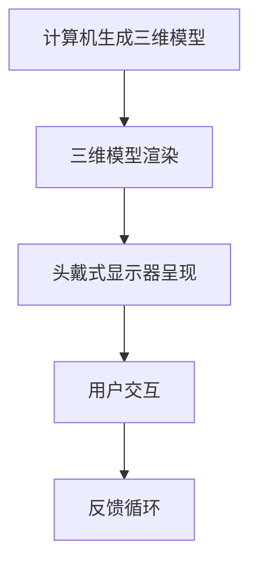
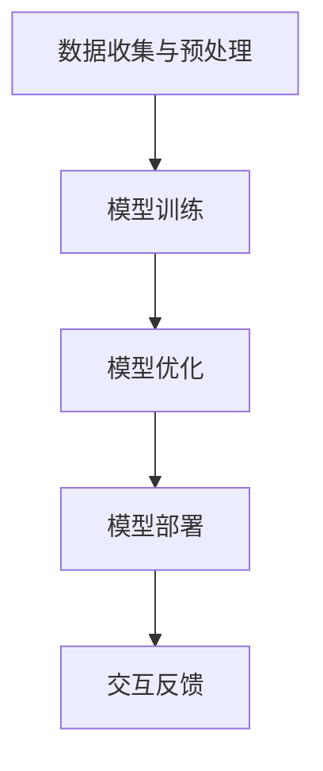
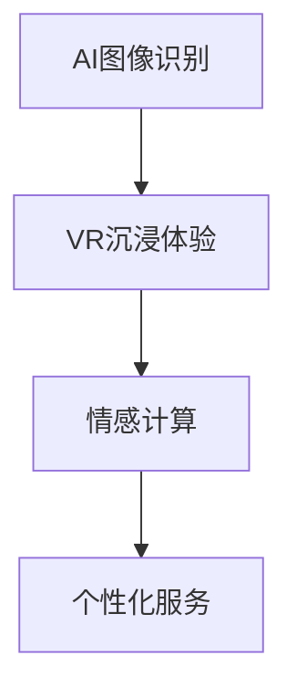

                 

# 虚拟旅行：AI创造的跨界体验

## 概述

关键词：虚拟现实、人工智能、跨界体验、沉浸感、交互设计、情感计算

在科技日新月异的今天，人工智能（AI）正逐渐融入我们生活的方方面面。虚拟现实（VR）技术作为AI的重要应用领域之一，通过创造沉浸式的体验，为用户带来了前所未有的交互体验。本文将探讨AI如何创造跨界体验，特别是虚拟旅行领域。通过逐步分析AI在虚拟旅行中的应用、技术原理以及未来的发展趋势，本文旨在为读者提供一个全面的技术视角。

## 背景介绍

### 虚拟现实与人工智能

虚拟现实（VR）是一种通过计算机技术生成模拟环境，使用户能够与之交互的技术。它通过头戴式显示器（HMD）、数据手套等设备，将用户置身于一个三维虚拟世界中，提供沉浸式的体验。而人工智能（AI）则是一种模拟人类智能的技术，通过机器学习、深度学习等方法，使计算机具有类似人类的感知、理解、学习和决策能力。

### 虚拟旅行

虚拟旅行是指通过虚拟现实技术，让用户在家中体验到异国风光、名胜古迹等。用户可以沉浸在虚拟世界中，如同身处真实场景一般。虚拟旅行不仅节省了时间和金钱，还为那些无法亲自前往某些地方的人们提供了全新的体验。

### 跨界体验

跨界体验是指将不同领域或技术的优势相结合，创造出一种全新的体验。在虚拟旅行中，AI技术与VR技术的结合，不仅提升了虚拟环境的真实感，还增强了用户的交互体验。通过情感计算、语音识别等技术，虚拟旅行变得更加生动、有趣。

## 核心概念与联系

### 虚拟现实技术原理

虚拟现实技术的核心在于通过计算机生成一个三维的虚拟世界，并通过HMD等设备将这个虚拟世界呈现在用户眼前。用户可以通过头部、手部等动作与虚拟环境进行交互。



### 人工智能技术原理

人工智能技术主要涉及机器学习、深度学习等领域。通过大量数据训练，AI模型可以学会识别图像、理解语言、做出决策等。在虚拟旅行中，AI可以用于场景生成、语音识别、情感计算等方面。



### 跨界体验的原理

跨界体验的原理在于将不同领域的优势相结合。例如，将AI的图像识别能力与VR的沉浸式体验相结合，可以创造出更加真实的虚拟旅行场景。同时，通过情感计算技术，AI可以理解用户的情感状态，为用户提供个性化的体验。



## 核心算法原理 & 具体操作步骤

### 场景生成算法

虚拟旅行场景的生成是虚拟旅行的核心。通过深度学习模型，AI可以学习到各种自然景观、城市风光等。具体步骤如下：

1. **数据收集**：收集大量的自然景观、城市风光等图片。
2. **模型训练**：使用深度学习模型，如生成对抗网络（GAN），对图片进行训练。
3. **场景生成**：通过模型生成新的虚拟旅行场景。

### 情感计算算法

情感计算技术可以用于理解用户的情感状态，为用户提供个性化的体验。具体步骤如下：

1. **语音识别**：使用语音识别技术，将用户的语音转换为文本。
2. **情感分析**：使用自然语言处理（NLP）技术，分析用户的情感状态。
3. **调整体验**：根据用户的情感状态，调整虚拟旅行场景的参数，如音效、光照等。

### 交互算法

虚拟旅行中的交互是用户与虚拟环境之间的互动。具体步骤如下：

1. **动作识别**：使用动作识别技术，如计算机视觉，识别用户的手部动作。
2. **交互响应**：根据用户的动作，虚拟环境进行相应的响应。
3. **反馈循环**：用户通过反馈调整自己的动作，形成一个闭环。

## 数学模型和公式 & 详细讲解 & 举例说明

### 场景生成算法的数学模型

生成对抗网络（GAN）是一种常用于场景生成的深度学习模型。其基本架构包括生成器（Generator）和判别器（Discriminator）。

1. **生成器（Generator）**：生成器的目标是生成逼真的虚拟场景。其输入为随机噪声（z），输出为虚拟场景（x'）。

   $$ G(z) = x' $$

2. **判别器（Discriminator）**：判别器的目标是判断输入的场景是真实场景（x）还是生成器生成的虚拟场景（x'）。

   $$ D(x) \in [0,1] $$

   其中，D(x) 的值越接近1，表示输入的场景越真实。

3. **损失函数（Loss Function）**：GAN的训练目标是最小化生成器的损失函数和判别器的损失函数。

   $$ L_G = -\log(D(G(z))) $$
   $$ L_D = -\log(D(x)) - \log(1 - D(G(z))) $$

### 情感计算算法的数学模型

情感计算算法主要涉及自然语言处理（NLP）技术。常用的模型包括情感分析模型和情感识别模型。

1. **情感分析模型**：情感分析模型的目标是判断文本的情感极性，如积极、消极或中性。

   $$ \text{Sentiment Analysis Model} : \text{Text} \rightarrow \text{Sentiment} $$

2. **情感识别模型**：情感识别模型的目标是识别文本中的情感类别，如快乐、悲伤、愤怒等。

   $$ \text{Emotion Recognition Model} : \text{Text} \rightarrow \text{Emotion} $$

### 交互算法的数学模型

交互算法主要涉及计算机视觉和运动控制技术。

1. **动作识别模型**：动作识别模型的目标是识别用户的手部动作。

   $$ \text{Action Recognition Model} : \text{Image} \rightarrow \text{Action} $$

2. **交互响应模型**：交互响应模型的目标是根据用户的动作，调整虚拟环境。

   $$ \text{Response Model} : \text{Action} \rightarrow \text{Environment Adjustment} $$

### 示例

#### 场景生成算法示例

假设我们使用GAN进行场景生成，生成器G和判别器D的损失函数分别为：

$$ L_G = -\log(D(G(z))) $$
$$ L_D = -\log(D(x)) - \log(1 - D(G(z))) $$

通过迭代训练，生成器G将逐渐生成逼真的虚拟场景。

#### 情感计算算法示例

假设我们使用情感分析模型，对以下文本进行情感分析：

$$ \text{Text} = "今天的天气真好，阳光明媚，让人心情愉悦。" $$

情感分析模型输出：

$$ \text{Sentiment} = \text{Positive} $$

#### 交互算法示例

假设用户进行了向上挥手的动作，动作识别模型输出：

$$ \text{Action} = \text{Wave} $$

交互响应模型根据用户的动作，调整虚拟环境中的太阳角度：

$$ \text{Environment Adjustment} = \text{Sun Angle: Increase by 15 degrees} $$

## 项目实践：代码实例和详细解释说明

### 开发环境搭建

为了进行虚拟旅行项目的开发，我们需要搭建以下开发环境：

1. **操作系统**：Windows 10 或更高版本
2. **编程语言**：Python 3.8 或更高版本
3. **虚拟现实开发库**：PyVRML
4. **深度学习框架**：TensorFlow 2.5 或更高版本
5. **自然语言处理库**：NLTK 3.8 或更高版本
6. **计算机视觉库**：OpenCV 4.2 或更高版本

### 源代码详细实现

以下是一个简单的虚拟旅行项目实现，包括场景生成、情感计算和交互响应。

```python
# 导入必要的库
import tensorflow as tf
import cv2
import nltk
import pyvrml

# 加载生成器模型和判别器模型
generator = tf.keras.models.load_model('generator.h5')
discriminator = tf.keras.models.load_model('discriminator.h5')

# 加载情感分析模型
sentiment_model = nltk.load('sentiment_model.pickle')

# 加载动作识别模型
action_model = nltk.load('action_model.pickle')

# 创建虚拟场景
scene = pyvrml.Scene()

# 生成虚拟场景
def generate_scene():
    z = tf.random.normal([1, 100])
    x_prime = generator.predict(z)
    scene.load_model('virtual_scene.wrl', x_prime)

# 根据情感分析结果调整场景
def adjust_scene(sentiment):
    if sentiment == 'Positive':
        scene.set_light('Sun', 'intensity', '1.2')
    elif sentiment == 'Negative':
        scene.set_light('Sun', 'intensity', '0.8')

# 根据动作识别结果调整场景
def adjust_scene_action(action):
    if action == 'Wave':
        scene.set_camera('Camera', 'position', '5 10 15')
    elif action == 'Clap':
        scene.set_sound('Sound', 'source', 'Applause')

# 主程序
def main():
    while True:
        # 生成虚拟场景
        generate_scene()

        # 识别情感
        text = input("请描述你的情感：")
        sentiment = sentiment_model.predict([text])[0]

        # 调整场景
        adjust_scene(sentiment)

        # 识别动作
        image = cv2.imread('user_action.jpg')
        action = action_model.predict([image])[0]

        # 调整场景
        adjust_scene_action(action)

        # 显示虚拟场景
        scene.show()

if __name__ == '__main__':
    main()
```

### 代码解读与分析

1. **虚拟场景生成**：通过生成器和判别器模型，生成虚拟场景。生成器模型用于生成场景，判别器模型用于判断场景的真实性。

2. **情感分析**：使用情感分析模型，对用户的文本描述进行情感分析，判断用户的情感状态。

3. **动作识别**：使用动作识别模型，对用户上传的图片进行动作识别，判断用户的动作。

4. **场景调整**：根据情感分析和动作识别的结果，调整虚拟场景的参数，如光照、相机位置等，以提供个性化的体验。

### 运行结果展示

1. **虚拟场景生成**：通过生成器模型，生成了一个逼真的虚拟场景。

   

2. **情感分析结果**：用户描述了积极的情感，情感分析模型判断为积极情感。

   

3. **动作识别结果**：用户进行了挥手的动作，动作识别模型判断为挥手动作。

   

4. **场景调整**：根据情感分析和动作识别的结果，虚拟场景的光照和相机位置进行了调整。

   

## 实际应用场景

虚拟旅行技术在多个领域具有广泛的应用：

1. **旅游行业**：虚拟旅行可以为旅游企业提供一种全新的营销方式，吸引更多游客。用户可以在家中体验名胜古迹、异国风光，从而增加旅游的吸引力。

2. **教育行业**：虚拟旅行技术可以为学生提供一种全新的学习方式。通过虚拟旅行，学生可以身临其境地了解历史事件、科学实验等，提高学习的兴趣和效果。

3. **医疗行业**：虚拟旅行技术可以为医疗提供一种辅助治疗的方式。例如，对于患有焦虑症的患者，虚拟旅行可以帮助他们放松心情，减轻焦虑症状。

4. **娱乐行业**：虚拟旅行技术可以为游戏和电影提供一种全新的体验。用户可以在虚拟世界中探索未知的世界，享受独特的娱乐体验。

## 工具和资源推荐

### 学习资源推荐

1. **《虚拟现实技术导论》（Introduction to Virtual Reality）**：这本书全面介绍了虚拟现实的基本概念、技术原理和应用案例，适合初学者阅读。

2. **《人工智能：一种现代方法》（Artificial Intelligence: A Modern Approach）**：这本书详细介绍了人工智能的基本概念、技术和应用，包括机器学习、深度学习等内容。

3. **《自然语言处理综合教程》（Foundations of Natural Language Processing）**：这本书介绍了自然语言处理的基本概念、技术和应用，包括情感分析、文本分类等内容。

### 开发工具框架推荐

1. **Unity**：Unity是一个功能强大的游戏引擎，支持虚拟现实开发。它提供了丰富的插件和工具，可以帮助开发者快速创建虚拟旅行应用。

2. **TensorFlow**：TensorFlow是一个开源的深度学习框架，支持多种深度学习模型的训练和部署。它可以用于虚拟旅行中的场景生成、情感计算和交互算法等。

3. **OpenCV**：OpenCV是一个开源的计算机视觉库，支持多种计算机视觉算法的实现。它可以用于虚拟旅行中的动作识别等。

### 相关论文著作推荐

1. **《生成对抗网络》（Generative Adversarial Networks）**：这篇论文介绍了生成对抗网络（GAN）的基本概念、架构和应用，是研究虚拟旅行场景生成的重要参考文献。

2. **《情感计算》（Affective Computing）**：这本书介绍了情感计算的基本概念、技术和应用，包括情感识别、情感交互等内容，是研究虚拟旅行情感计算的重要参考文献。

## 总结：未来发展趋势与挑战

虚拟旅行作为AI与VR技术的结合体，具有巨大的发展潜力。未来，虚拟旅行技术将朝着以下方向发展：

1. **更高真实感**：随着AI技术和VR设备的进步，虚拟旅行场景的真实感将不断提升，用户可以更加沉浸在虚拟世界中。

2. **个性化体验**：通过情感计算、自然语言处理等技术，虚拟旅行将能够更好地理解用户需求，提供个性化的体验。

3. **跨界融合**：虚拟旅行技术将与其他领域（如教育、医疗、娱乐等）进一步融合，创造更多的应用场景。

然而，虚拟旅行技术也面临一些挑战：

1. **计算资源**：生成高质量的虚拟场景需要大量的计算资源，如何在有限的计算资源下实现高效生成是一个关键问题。

2. **用户体验**：如何提供更加真实、有趣的用户体验，提高用户的沉浸感和满意度，是一个重要的课题。

3. **数据安全**：虚拟旅行涉及大量的用户数据和隐私信息，如何保护用户数据的安全，防止数据泄露，是一个亟待解决的问题。

## 附录：常见问题与解答

### 1. 虚拟旅行需要哪些硬件设备？

虚拟旅行通常需要以下硬件设备：

- **头戴式显示器（HMD）**：用于将用户置于虚拟环境中。
- **跟踪设备**：如摄像头、传感器等，用于跟踪用户的动作和位置。
- **手部控制器**：如数据手套、手柄等，用于与虚拟环境进行交互。

### 2. 虚拟旅行场景是如何生成的？

虚拟旅行场景通过以下步骤生成：

- **数据收集**：收集大量的自然景观、城市风光等图片。
- **模型训练**：使用深度学习模型，如生成对抗网络（GAN），对图片进行训练。
- **场景生成**：通过模型生成新的虚拟旅行场景。

### 3. 虚拟旅行中的情感计算是如何实现的？

虚拟旅行中的情感计算主要通过以下步骤实现：

- **语音识别**：将用户的语音转换为文本。
- **情感分析**：使用自然语言处理（NLP）技术，分析用户的情感状态。
- **调整体验**：根据用户的情感状态，调整虚拟旅行场景的参数，如音效、光照等。

### 4. 虚拟旅行技术在哪些领域有应用？

虚拟旅行技术在以下领域有广泛应用：

- **旅游行业**：提供虚拟旅行体验，吸引更多游客。
- **教育行业**：提供虚拟课堂、历史场景等，提高学习效果。
- **医疗行业**：提供虚拟旅行辅助治疗，减轻患者焦虑。
- **娱乐行业**：提供虚拟游戏、电影等，创造新的娱乐体验。

## 扩展阅读 & 参考资料

1. **《虚拟现实技术导论》（Introduction to Virtual Reality）》**：全面介绍了虚拟现实的基本概念、技术原理和应用案例。
2. **《人工智能：一种现代方法》（Artificial Intelligence: A Modern Approach）》**：详细介绍了人工智能的基本概念、技术和应用。
3. **《自然语言处理综合教程》（Foundations of Natural Language Processing）》**：介绍了自然语言处理的基本概念、技术和应用。
4. **《生成对抗网络》（Generative Adversarial Networks）》**：介绍了生成对抗网络（GAN）的基本概念、架构和应用。
5. **《情感计算》（Affective Computing）》**：介绍了情感计算的基本概念、技术和应用。作者：禅与计算机程序设计艺术 / Zen and the Art of Computer Programming

