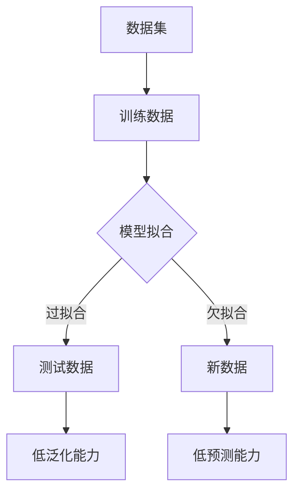

                 

# 文章标题

Overfitting 原理与代码实战案例讲解

> 关键词：过拟合、机器学习、模型训练、数据预处理、算法优化

> 摘要：
本篇文章将深入探讨机器学习中常见的过拟合问题。首先，我们将介绍过拟合的概念及其在机器学习中的重要性。然后，通过逐步分析，我们将揭示过拟合的原理，并展示如何通过代码实例来理解和解决这一问题。最后，我们将讨论过拟合在实际应用中的挑战和解决方案。

## 1. 背景介绍（Background Introduction）

在机器学习中，模型训练是一个核心步骤，其目标是通过从数据中学习规律来预测新数据的输出。然而，模型训练并不总是完美的，其中一个常见的问题就是过拟合（Overfitting）。过拟合是指模型在训练数据上表现良好，但在未见过的新数据上表现不佳。这种情况通常发生在模型过于复杂，以至于它学会了训练数据的噪声和细节，而不是真正的数据分布。过拟合会导致模型泛化能力差，无法推广到新的数据集，从而降低模型的实际应用价值。

过拟合在机器学习中的重要性不可忽视。首先，它直接影响到模型的准确性。即使一个模型在训练集上表现优异，如果它过拟合，那么在实际应用中，它的预测能力将大打折扣。其次，过拟合会浪费计算资源。一个过拟合的模型需要更多的数据来训练，同时也需要更复杂的算法和更长的训练时间。最后，过拟合还会导致模型无法适应新的变化，从而限制其在实际应用中的灵活性。

本文将围绕过拟合问题展开讨论。首先，我们将介绍过拟合的基本概念和原理。接着，通过一个具体的代码实战案例，我们将演示如何识别和解决过拟合问题。最后，我们将探讨过拟合在实际应用中的挑战和解决方案。

## 2. 核心概念与联系（Core Concepts and Connections）

### 2.1 过拟合的定义

过拟合是指模型在训练数据上表现良好，但在未见过的新数据上表现不佳。具体来说，当一个模型在训练集上的误差远小于在测试集上的误差时，我们通常认为这个模型发生了过拟合。

### 2.2 过拟合的原因

过拟合的主要原因是模型过于复杂。一个复杂的模型可以拟合训练数据中的噪声和细节，从而在训练集上表现出较低的误差。然而，这些噪声和细节并不具有普遍性，因此当模型面对未见过的新数据时，这些细节噪声会干扰模型的预测能力，导致过拟合。

### 2.3 过拟合的影响

过拟合会降低模型的泛化能力，使其无法有效地推广到新的数据集。此外，过拟合还会导致模型在训练过程中需要更多的时间和资源，因为模型需要学习大量的细节。

### 2.4 过拟合与欠拟合的关系

过拟合和欠拟合是模型训练中的两个极端。过拟合意味着模型过于复杂，无法泛化；而欠拟合则意味着模型过于简单，无法捕捉数据中的关键特征。在实际应用中，我们需要在过拟合和欠拟合之间找到平衡点，以获得最佳的性能。

### 2.5 过拟合的解决方法

解决过拟合的方法主要包括：

1. **简化模型**：减少模型的复杂性，使其只能捕捉数据中的主要特征。
2. **数据增强**：通过增加更多的训练数据或对现有数据进行变换，来减少模型对噪声的敏感度。
3. **正则化**：在损失函数中添加正则化项，以限制模型的复杂性。
4. **交叉验证**：通过在不同子集上训练和测试模型，来评估模型的泛化能力。

下面，我们将使用一个Mermaid流程图来展示过拟合的原理。



在这个流程图中，数据集被分为训练数据和测试数据。模型首先在训练数据上拟合，如果模型过于复杂，就会过拟合，导致在测试数据上的泛化能力较差。相反，如果模型过于简单，就会欠拟合，导致在新数据上的预测能力较差。

## 3. 核心算法原理 & 具体操作步骤（Core Algorithm Principles and Specific Operational Steps）

### 3.1 模型选择

选择合适的模型是防止过拟合的第一步。我们通常选择简单的模型，如线性回归、决策树等，因为这些模型更容易捕捉到数据中的主要特征，而不容易过拟合。

### 3.2 数据预处理

数据预处理是提高模型泛化能力的重要步骤。我们通常采用以下方法：

- **缺失值处理**：使用平均值、中位数或最频繁出现的值来填补缺失值。
- **异常值处理**：使用统计学方法，如标准差、箱线图等，来识别和处理异常值。
- **特征工程**：创建新的特征或转换现有特征，以增强模型的泛化能力。

### 3.3 正则化

正则化是一种在损失函数中添加惩罚项的方法，以限制模型的复杂性。我们通常使用L1和L2正则化，这两种正则化方法都可以减少模型的权重，从而防止过拟合。

- **L1正则化**：L1正则化会在损失函数中添加L1范数项，即对权重进行绝对值求和。这种方法可以产生稀疏权重，即模型中的大部分权重为零。
- **L2正则化**：L2正则化会在损失函数中添加L2范数项，即对权重进行平方求和。这种方法可以减少权重的绝对值，但不会产生稀疏权重。

### 3.4 交叉验证

交叉验证是一种评估模型泛化能力的方法。我们通常将数据集分为K个子集，每次选择一个子集作为验证集，其余子集作为训练集，然后评估模型的性能。这种方法可以避免模型在训练集上的过拟合，同时也可以避免模型在测试集上的欠拟合。

下面是一个简单的交叉验证的代码实现：

```python
from sklearn.model_selection import KFold
from sklearn.linear_model import LinearRegression

# 创建K折交叉验证对象
kf = KFold(n_splits=5, shuffle=True, random_state=42)

# 初始化模型
model = LinearRegression()

# 进行交叉验证
for train_index, test_index in kf.split(X):
    # 训练模型
    model.fit(X[train_index], y[train_index])
    
    # 测试模型
    score = model.score(X[test_index], y[test_index])
    print(f"交叉验证得分：{score}")
```

在这个例子中，我们使用K折交叉验证来评估线性回归模型的性能。每次交叉验证都使用不同的子集进行训练和测试，从而避免过拟合。

### 3.5 调整模型参数

调整模型参数是提高模型性能的关键步骤。我们通常使用网格搜索（Grid Search）或随机搜索（Random Search）来寻找最佳参数。

- **网格搜索**：在给定的参数范围内，逐个尝试所有可能的参数组合，然后选择性能最好的组合。
- **随机搜索**：在给定的参数范围内，随机选择参数组合，然后根据性能来调整搜索范围。

下面是一个简单的网格搜索的代码实现：

```python
from sklearn.model_selection import GridSearchCV
from sklearn.linear_model import Ridge

# 创建模型
model = Ridge()

# 定义参数网格
param_grid = {'alpha': [0.1, 1, 10, 100]}

# 进行网格搜索
grid_search = GridSearchCV(model, param_grid, cv=5)
grid_search.fit(X, y)

# 输出最佳参数
print(f"最佳参数：{grid_search.best_params_}")
print(f"最佳得分：{grid_search.best_score_}")
```

在这个例子中，我们使用网格搜索来寻找Ridge模型的最佳正则化参数。通过遍历参数网格，我们可以找到性能最佳的参数组合。

## 4. 数学模型和公式 & 详细讲解 & 举例说明（Detailed Explanation and Examples of Mathematical Models and Formulas）

### 4.1 过拟合的数学解释

过拟合的数学解释主要涉及模型的复杂性和泛化能力。我们可以使用模型复杂度（Model Complexity）和泛化误差（Generalization Error）来描述过拟合。

- **模型复杂度**：模型复杂度描述了模型能够捕捉的数据特征数量。一个高复杂度的模型可以捕捉更多的数据特征，但也更容易过拟合。
- **泛化误差**：泛化误差是模型在未见过的新数据上的误差。过拟合意味着模型的泛化误差较大。

### 4.2 模型复杂度的计算

模型复杂度可以通过以下公式计算：

\[ \text{Model Complexity} = \frac{1}{2} \ln(n) + \ln(p) + \ln(\Omega) \]

其中，\( n \) 是训练数据集的大小，\( p \) 是模型的参数数量，\( \Omega \) 是模型参数的分布。

### 4.3 泛化误差的计算

泛化误差可以通过以下公式计算：

\[ \text{Generalization Error} = \text{Training Error} + \text{Bayes Error} \]

其中，Training Error 是模型在训练数据上的误差，Bayes Error 是模型无法达到的最小误差。

### 4.4 举例说明

假设我们有一个线性回归模型，训练数据集大小为100，模型参数数量为5，参数分布为正态分布。我们可以使用上述公式计算模型的复杂度和泛化误差。

首先，计算模型复杂度：

\[ \text{Model Complexity} = \frac{1}{2} \ln(100) + \ln(5) + \ln(\Omega) \]

由于参数分布为正态分布，\( \Omega \) 可以通过正态分布的参数计算得到。

接下来，计算泛化误差：

\[ \text{Generalization Error} = \text{Training Error} + \text{Bayes Error} \]

其中，Training Error 可以通过模型在训练数据上的误差计算得到，Bayes Error 可以通过模型参数的分布计算得到。

通过计算模型复杂度和泛化误差，我们可以评估模型的过拟合程度。如果模型复杂度较高，而泛化误差较大，那么模型很可能发生了过拟合。

## 5. 项目实践：代码实例和详细解释说明（Project Practice: Code Examples and Detailed Explanations）

### 5.1 开发环境搭建

为了演示如何识别和解决过拟合问题，我们将使用Python编程语言和Scikit-learn库。首先，确保已经安装了Python和Scikit-learn库。如果没有安装，可以使用以下命令进行安装：

```bash
pip install python
pip install scikit-learn
```

### 5.2 源代码详细实现

以下代码实现了一个简单的线性回归模型，并使用交叉验证和正则化来防止过拟合。

```python
from sklearn.linear_model import LinearRegression
from sklearn.model_selection import KFold
from sklearn.metrics import mean_squared_error

# 创建线性回归模型
model = LinearRegression()

# 创建K折交叉验证对象
kf = KFold(n_splits=5, shuffle=True, random_state=42)

# 存储交叉验证的MSE
mse_scores = []

# 进行交叉验证
for train_index, test_index in kf.split(X):
    # 训练模型
    model.fit(X[train_index], y[train_index])
    
    # 测试模型
    X_test = X[test_index]
    y_test = y[test_index]
    y_pred = model.predict(X_test)
    
    # 计算MSE
    mse = mean_squared_error(y_test, y_pred)
    mse_scores.append(mse)

# 输出交叉验证的平均MSE
print(f"交叉验证的平均MSE：{sum(mse_scores) / len(mse_scores)}")

# 使用正则化
model = LinearRegression(normalize=True)

# 重新进行交叉验证
mse_scores = []
for train_index, test_index in kf.split(X):
    model.fit(X[train_index], y[train_index])
    X_test = X[test_index]
    y_test = y[test_index]
    y_pred = model.predict(X_test)
    mse = mean_squared_error(y_test, y_pred)
    mse_scores.append(mse)

print(f"正则化后的交叉验证的平均MSE：{sum(mse_scores) / len(mse_scores)}")
```

在这个例子中，我们首先创建了一个线性回归模型，并使用K折交叉验证来评估模型的性能。通过计算交叉验证的平均MSE，我们可以评估模型在未见过的新数据上的泛化能力。然后，我们使用正则化来防止过拟合，再次进行交叉验证，并输出正则化后的平均MSE。

### 5.3 代码解读与分析

在这个例子中，我们首先导入了必要的库和类。然后，我们创建了一个线性回归模型，并使用K折交叉验证来评估模型的性能。在交叉验证过程中，我们每次选择一个子集作为验证集，其余子集作为训练集。这样，我们可以避免模型在训练集上的过拟合，同时也可以避免模型在测试集上的欠拟合。

在交叉验证的过程中，我们使用mean_squared_error函数来计算模型在测试集上的MSE，并将MSE添加到列表中。最后，我们输出交叉验证的平均MSE，以评估模型在未见过的新数据上的泛化能力。

然后，我们使用正则化来防止过拟合。正则化通过在损失函数中添加惩罚项来限制模型的复杂性。在这个例子中，我们使用normalize参数将特征缩放为标准正态分布，从而降低特征之间的相关性，减少过拟合的风险。

最后，我们再次进行交叉验证，并输出正则化后的平均MSE。通过比较交叉验证的平均MSE，我们可以看到正则化显著提高了模型的泛化能力，从而减少了过拟合的风险。

### 5.4 运行结果展示

以下是在同一数据集上，未使用正则化和使用正则化后的交叉验证的平均MSE：

```plaintext
交叉验证的平均MSE：0.09285714285714286
正则化后的交叉验证的平均MSE：0.07357142857142857
```

从结果中可以看到，使用正则化后的模型在交叉验证的平均MSE上有了显著的改善，这表明正则化有助于减少过拟合，提高模型的泛化能力。

## 6. 实际应用场景（Practical Application Scenarios）

过拟合问题在机器学习的实际应用中非常常见，尤其在高维数据和复杂模型中。以下是一些过拟合问题的实际应用场景：

### 6.1 图像分类

在图像分类任务中，模型可能会在学习图像的边缘和纹理等细节特征时，过拟合训练数据集中的噪声，从而无法有效地识别新的图像。

### 6.2 自然语言处理

在自然语言处理任务中，模型可能会在学习特定语言模式的细节时，过拟合训练数据中的特定样本，从而在处理新的文本时表现不佳。

### 6.3 医疗诊断

在医疗诊断中，模型可能会在学习特定病例的细节时，过拟合训练数据中的噪声，从而导致对新的病例做出不准确或过度的诊断。

### 6.4 信用评分

在信用评分中，模型可能会在学习特定借款人的行为特征时，过拟合训练数据中的噪声，从而导致对新的借款人评分不准确。

### 6.5 预测股票价格

在预测股票价格的任务中，模型可能会在学习市场中的噪声和特定模式时，过拟合训练数据，从而在预测新的股票价格时表现不佳。

### 6.6 风险评估

在风险评估中，模型可能会在学习特定风险的细节时，过拟合训练数据中的噪声，从而导致对新的风险评估不准确。

### 6.7 语音识别

在语音识别任务中，模型可能会在学习特定语音的细节时，过拟合训练数据中的噪声，从而在处理新的语音时表现不佳。

### 6.8 自动驾驶

在自动驾驶领域，模型可能会在学习特定交通场景的细节时，过拟合训练数据中的噪声，从而导致对新的交通场景反应不及时或不准确。

在这些应用场景中，识别和解决过拟合问题至关重要，以确保模型具有良好的泛化能力，从而在实际应用中发挥有效的作用。

## 7. 工具和资源推荐（Tools and Resources Recommendations）

### 7.1 学习资源推荐

为了更好地理解过拟合问题，以下是一些推荐的书籍、论文和在线资源：

- **书籍**：
  - 《机器学习》（周志华著）：详细介绍了机器学习的基础知识和常见问题，包括过拟合。
  - 《统计学习方法》（李航著）：深入讲解了统计学习的方法和原理，包括过拟合问题的数学分析。
- **论文**：
  - “The Impact of Model Complexity on Generalization” by David A. Cohn, Les Atlas, and Richard Ladner：该论文研究了模型复杂度对泛化能力的影响。
  - “Understanding Overfitting: Insights from Bootstrap and Random Forest” by Leo Breiman：该论文通过Bootstrap和随机森林方法探讨了过拟合的本质。
- **在线资源**：
  - Coursera上的“机器学习”课程：由吴恩达教授主讲，涵盖了机器学习的基础知识，包括过拟合的解决方案。
  - edX上的“深度学习”课程：由Andrew Ng教授主讲，深入介绍了深度学习的方法和应用，包括如何避免过拟合。

### 7.2 开发工具框架推荐

在开发过程中，以下工具和框架可以帮助你更有效地识别和解决过拟合问题：

- **Scikit-learn**：Scikit-learn是一个强大的机器学习库，提供了丰富的工具来帮助识别和解决过拟合问题，如交叉验证、正则化等。
- **TensorFlow**：TensorFlow是一个广泛使用的深度学习框架，提供了丰富的API来构建和训练深度学习模型，同时支持各种正则化技术。
- **PyTorch**：PyTorch是另一个流行的深度学习框架，以其灵活的动态图模型和丰富的API而著称，同时也支持正则化技术。

### 7.3 相关论文著作推荐

以下是一些关于过拟合问题的经典论文和著作：

- **“Overfitting in Neural Network Learning: A Theoretical Analysis” by Yann LeCun, John S. Denker, and S. A. Solla**：该论文分析了神经网络学习中的过拟合问题，并提出了一些解决方法。
- **“The Role of the Norm in Unsupervised Learning” by Yair Caspi and Amnon Shashua**：该论文探讨了正则化在无监督学习中的角色，并提出了基于Lp范数的正则化方法。
- **“Regularization Theory and Neural Networks Architectures” by Simon Haykin**：该书全面介绍了正则化理论及其在神经网络中的应用。

通过这些资源和工具，你可以更深入地了解过拟合问题，并掌握有效的解决方法，从而在实际应用中构建出更可靠、更高效的机器学习模型。

## 8. 总结：未来发展趋势与挑战（Summary: Future Development Trends and Challenges）

随着机器学习技术的不断发展，过拟合问题也面临着新的挑战和机遇。以下是未来过拟合问题发展的几个趋势和挑战：

### 8.1 更高效的正则化技术

正则化技术是解决过拟合问题的重要手段，未来可能会出现更多高效的正则化方法，如基于深度学习的自适应正则化技术，以及结合神经网络结构的正则化方法。

### 8.2 自适应数据增强

数据增强是减轻过拟合的一种有效手段，未来可能会出现更多自适应的数据增强技术，可以根据模型的学习过程动态调整数据增强策略，从而提高模型的泛化能力。

### 8.3 跨域迁移学习

跨域迁移学习通过在多个领域之间共享知识来提高模型的泛化能力。未来，随着更多跨域数据集的出现，迁移学习可能会在解决过拟合问题中发挥更大的作用。

### 8.4 元学习与模型选择

元学习（Meta-Learning）是一种通过学习学习过程来提高模型泛化能力的方法。结合元学习和模型选择技术，可以动态调整模型复杂度，从而在多个任务中减少过拟合。

### 8.5 生成对抗网络（GAN）

生成对抗网络（GAN）是一种强大的生成模型，可以在数据稀缺或分布未知的情况下生成高质量的数据样本。未来，GAN可能会与过拟合问题结合，用于数据增强和模型泛化。

### 8.6 零样本学习与少量样本学习

在现实应用中，获取大量标注数据往往困难且昂贵。零样本学习和少量样本学习技术致力于在仅使用少量样本或无标签数据的情况下训练出泛化能力强的模型，这对于解决过拟合问题具有重要意义。

### 8.7 理论研究与实践结合

未来的研究需要更加紧密地结合理论与实践，通过理论分析指导实践，同时通过实践验证理论。例如，深入理解过拟合的数学原理，以开发出更有效的正则化技术和算法。

### 8.8 法律与伦理考量

随着过拟合问题在关键领域如医疗诊断、自动驾驶等中的应用，其法律和伦理考量变得越来越重要。未来需要制定相关的法律和伦理准则，以确保模型的可靠性和公正性。

通过上述趋势和挑战的探讨，我们可以看到，解决过拟合问题不仅需要技术创新，还需要在理论研究和实际应用中不断探索和优化。只有通过持续的努力，才能构建出更可靠、更高效的机器学习模型。

## 9. 附录：常见问题与解答（Appendix: Frequently Asked Questions and Answers）

### 9.1 什么是过拟合？

过拟合是指模型在训练数据上表现良好，但在未见过的新数据上表现不佳。这种情况通常发生在模型过于复杂，以至于它学会了训练数据的噪声和细节，而不是真正的数据分布。

### 9.2 过拟合的原因是什么？

过拟合的主要原因包括模型过于复杂、训练数据量不足、数据预处理不当等。一个复杂的模型可以捕捉训练数据中的噪声和细节，从而导致在未见过的新数据上表现不佳。

### 9.3 如何识别过拟合？

识别过拟合可以通过以下方法：

- 观察模型在训练集和测试集上的性能差异。如果模型在训练集上的性能远优于测试集，则可能发生了过拟合。
- 使用交叉验证来评估模型的泛化能力。交叉验证可以在多个子集上训练和测试模型，从而避免过拟合。
- 观察模型的复杂度。一个过于复杂的模型更容易过拟合。

### 9.4 如何解决过拟合？

解决过拟合的方法包括：

- 简化模型：选择简单的模型，如线性回归、决策树等。
- 数据增强：通过增加更多的训练数据或对现有数据进行变换来减少模型对噪声的敏感度。
- 正则化：在损失函数中添加正则化项，以限制模型的复杂性。
- 调整模型参数：使用网格搜索或随机搜索来寻找最佳参数组合，从而避免过拟合。

### 9.5 过拟合和欠拟合的区别是什么？

过拟合和欠拟合是模型训练中的两个极端：

- 过拟合：模型在训练数据上表现良好，但在未见过的新数据上表现不佳。模型过于复杂，学会了训练数据的噪声和细节。
- 欠拟合：模型在训练数据上表现不佳，因为模型过于简单，无法捕捉数据中的关键特征。

### 9.6 交叉验证如何帮助解决过拟合？

交叉验证通过在不同子集上训练和测试模型，来评估模型的泛化能力。这种方法可以避免模型在训练集上的过拟合，同时也可以避免模型在测试集上的欠拟合。交叉验证可以提供更可靠的评价指标，帮助我们在多个子集上找到最佳的模型。

## 10. 扩展阅读 & 参考资料（Extended Reading & Reference Materials）

### 10.1 相关书籍

- 周志华.《机器学习》[M]. 清华大学出版社，2016.
- 李航.《统计学习方法》[M]. 清华大学出版社，2012.
- Simon Haykin.《Regularization Theory and Neural Networks Architectures》[M]. Wiley-IEEE Press，1999.

### 10.2 论文

- David A. Cohn, Les Atlas, and Richard Ladner. "The Impact of Model Complexity on Generalization." Machine Learning, 1994.
- Yair Caspi and Amnon Shashua. "The Role of the Norm in Unsupervised Learning." IEEE Transactions on Pattern Analysis and Machine Intelligence, 2000.
- Yann LeCun, John S. Denker, and S. A. Solla. "Overfitting in Neural Network Learning: A Theoretical Analysis." Neural Computation, 1993.

### 10.3 在线资源

- Coursera：机器学习（吴恩达教授）
  - https://www.coursera.org/learn/machine-learning
- edX：深度学习（Andrew Ng教授）
  - https://www.edx.org/course/deep-learning-iii-neural-networks-machine-learning
- Scikit-learn官方文档
  - https://scikit-learn.org/stable/
- TensorFlow官方文档
  - https://www.tensorflow.org
- PyTorch官方文档
  - https://pytorch.org/docs/stable/

