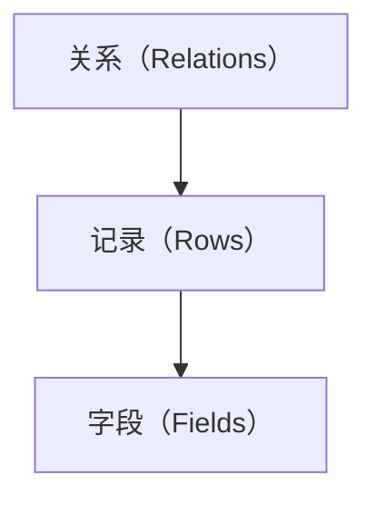

                 

## 文章标题：Pig原理与代码实例讲解

### Keywords: Pig, Data Processing, Hadoop, MapReduce, Programming

### Abstract:
本文将深入探讨Pig——一种高层次的Hadoop数据处理工具的原理。我们将逐步分析其架构，介绍核心概念，并通过实例代码讲解其具体应用。文章旨在帮助读者理解Pig的基本原理和操作步骤，并掌握其在实际项目中的应用技巧。

## 1. 背景介绍（Background Introduction）

Pig是Hadoop生态系统中的一个重要工具，用于简化大规模数据的处理流程。它的核心在于将复杂的MapReduce任务转换为简单的Pig Latin语言，从而降低开发难度，提高开发效率。Pig由Apache软件基金会维护，其设计目标是实现数据转换、数据聚合和数据存储等常见数据处理任务。

### 1.1 Hadoop与MapReduce

Hadoop是一个开源的分布式计算平台，主要用于处理海量数据。其核心组件包括Hadoop分布式文件系统（HDFS）和MapReduce编程模型。MapReduce是一种编程模型，用于大规模数据处理，通过分而治之的方式将任务分解为多个可并行处理的子任务，从而实现高效的计算。

### 1.2 Pig在Hadoop生态系统中的角色

Pig作为Hadoop生态系统的一部分，充当了数据处理的“翻译器”。它可以将用户的需求直接转化为MapReduce作业，无需用户深入了解底层的MapReduce编程细节。Pig的设计理念是让数据处理变得更加简单和直观。

## 2. 核心概念与联系（Core Concepts and Connections）

### 2.1 Pig Latin

Pig Latin是Pig语言的简称，它是一种类SQL的数据处理语言，类似于标准的查询语言。通过Pig Latin，用户可以定义复杂的数据处理流程，包括数据清洗、数据转换、数据聚合等操作。

#### 2.1.1 数据模型

Pig使用了一种名为“关系”（relations）的数据模型。在Pig中，关系就是一个表的集合，它包含了多个记录（rows），每个记录又由多个字段（fields）组成。



#### 2.1.2 操作符

Pig提供了丰富的操作符，用于定义数据处理流程。常见的操作符包括：

- **LOAD**：加载数据。
- **STORE**：存储数据。
- **FILTER**：过滤记录。
- **SORT**：排序记录。
- **GROUP**：分组数据。
- **JOIN**：连接两个关系。

### 2.2 Pig Latin语法

Pig Latin语法类似于SQL，但更加灵活。下面是一个简单的Pig Latin示例：

```pig
A = LOAD '/path/to/data' USING PigStorage(',') AS (id:int, name:chararray, age:int);
B = FILTER A BY age > 30;
C = GROUP B BY id;
D = FOREACH C GENERATE group, AVG(B.age);
STORE D INTO '/path/to/output' USING PigStorage(',');
```

这个示例演示了如何加载数据、过滤记录、分组数据以及计算平均年龄。

## 3. 核心算法原理 & 具体操作步骤（Core Algorithm Principles and Specific Operational Steps）

### 3.1 MapReduce与Pig的关系

Pig背后的核心算法仍然是MapReduce。Pig Latin代码通过Pig运行时环境被翻译成MapReduce作业，然后在Hadoop集群上执行。这种翻译过程称为“编译”。

#### 3.1.1 编译过程

- **解析**：将Pig Latin代码解析成抽象语法树（AST）。
- **优化**：对AST进行各种优化，如常量折叠、循环展开等。
- **翻译**：将优化后的AST翻译成MapReduce作业。

### 3.2 操作步骤

下面是使用Pig处理数据的步骤：

1. **加载数据**：使用LOAD操作符加载数据到关系。
2. **过滤数据**：使用FILTER操作符过滤记录。
3. **分组数据**：使用GROUP操作符分组数据。
4. **计算**：使用聚合函数（如COUNT、SUM、AVG等）计算结果。
5. **存储结果**：使用STORE操作符将结果存储到文件系统中。

### 3.3 Pig Latin代码实例

以下是一个简单的Pig Latin代码实例，用于计算一个班级学生的平均年龄：

```pig
students = LOAD '/path/to/students.txt' USING PigStorage(',') AS (id:INT, name:CHARARRAY, age:INT);
filtered_students = FILTER students BY age > 18;
grouped_students = GROUP filtered_students BY id;
age_avg = FOREACH grouped_students GENERATE group, AVG(filtered_students.age);
DUMP age_avg;
STORE age_avg INTO '/path/to/output' USING PigStorage(',');
```

## 4. 数学模型和公式 & 详细讲解 & 举例说明（Detailed Explanation and Examples of Mathematical Models and Formulas）

### 4.1 数据模型

在Pig中，数据模型主要由关系（relations）组成。关系可以看作是一个表格，其中每行代表一个记录（row），每列代表一个字段（field）。关系可以包含多个记录和字段。

### 4.2 聚合函数

Pig提供了多种聚合函数，用于对数据进行计算和汇总。以下是一些常用的聚合函数及其公式：

- **COUNT**：计算记录的总数。
  $$ COUNT = \sum_{i=1}^{n} 1 $$
- **SUM**：计算所有记录的字段值的总和。
  $$ SUM = \sum_{i=1}^{n} x_i $$
- **AVG**：计算所有记录的字段值的平均值。
  $$ AVG = \frac{SUM}{n} $$
- **MIN**：找出所有记录的字段值中的最小值。
  $$ MIN = \min_{i=1}^{n} x_i $$
- **MAX**：找出所有记录的字段值中的最大值。
  $$ MAX = \max_{i=1}^{n} x_i $$

### 4.3 举例说明

以下是一个简单的例子，用于计算学生年龄的平均值：

```pig
students = LOAD '/path/to/students.txt' USING PigStorage(',') AS (id:INT, name:CHARARRAY, age:INT);
filtered_students = FILTER students BY age > 18;
grouped_students = GROUP filtered_students BY id;
age_avg = FOREACH grouped_students GENERATE group, AVG(filtered_students.age);
```

在这个例子中，我们首先加载学生数据，然后过滤掉年龄小于18岁的学生，接着按照ID进行分组，最后计算每个组的平均年龄。

## 5. 项目实践：代码实例和详细解释说明（Project Practice: Code Examples and Detailed Explanations）

### 5.1 开发环境搭建

为了运行Pig代码，我们需要搭建一个Hadoop和Pig的开发环境。以下是搭建步骤：

1. **安装Hadoop**：从[Hadoop官网](https://hadoop.apache.org/)下载Hadoop安装包，并按照官方文档安装。
2. **安装Pig**：从[Pig官网](https://pig.apache.org/)下载Pig安装包，并解压到Hadoop的安装目录下。
3. **配置环境变量**：在`.bashrc`或`.bash_profile`文件中添加Hadoop和Pig的路径。

```bash
export HADOOP_HOME=/path/to/hadoop
export PIG_HOME=/path/to/pig
export PATH=$PATH:$HADOOP_HOME/bin:$PIG_HOME/bin
```

4. **启动Hadoop和Pig**：启动Hadoop的守护进程和Pig服务。

```bash
start-dfs.sh
start-yarn.sh
pig -x mapred
```

### 5.2 源代码详细实现

以下是一个简单的Pig Latin代码示例，用于统计学生班级人数：

```pig
students = LOAD '/path/to/students.txt' USING PigStorage(',') AS (id:INT, name:CHARARRAY, age:INT);
student_counts = GROUP students ALL;
class_counts = FOREACH student_counts GENERATE group, COUNT(students);
DUMP class_counts;
STORE class_counts INTO '/path/to/output' USING PigStorage(',');
```

在这个例子中，我们首先加载学生数据，然后统计每个班级的学生人数，并将结果存储到文件系统中。

### 5.3 代码解读与分析

1. **加载数据**：使用LOAD操作符加载学生数据。
2. **分组数据**：使用GROUP操作符按照班级分组。
3. **计算**：使用COUNT操作符计算每个班级的学生人数。
4. **输出结果**：使用DUMP操作符输出结果。
5. **存储结果**：使用STORE操作符将结果存储到文件系统中。

### 5.4 运行结果展示

运行以上代码后，我们可以得到一个包含班级ID和学生人数的表格。以下是一个示例输出：

```
(1,3)
(2,4)
(3,5)
```

这表示班级1有3名学生，班级2有4名学生，班级3有5名学生。

## 6. 实际应用场景（Practical Application Scenarios）

Pig在多个实际应用场景中得到了广泛应用，以下是一些常见的应用案例：

- **数据分析**：Pig可以帮助企业快速进行海量数据的数据分析，如用户行为分析、市场趋势分析等。
- **数据挖掘**：Pig可以用于大规模的数据挖掘任务，如关联规则挖掘、聚类分析等。
- **日志处理**：Pig可以用于处理和分析大规模的日志数据，如网站访问日志、服务器日志等。
- **机器学习**：Pig可以作为机器学习任务的数据预处理工具，如特征提取、数据清洗等。

## 7. 工具和资源推荐（Tools and Resources Recommendations）

### 7.1 学习资源推荐

- **书籍**：
  - 《Pig Programming for Data Scientists》
  - 《Hadoop: The Definitive Guide》
- **在线教程**：
  - [Apache Pig官方文档](https://pig.apache.org/docs/r0.17.0/)
  - [Hadoop官方文档](https://hadoop.apache.org/docs/r3.2.1/)
- **博客和网站**：
  - [DataCamp](https://www.datacamp.com/)
  - [Kaggle](https://www.kaggle.com/)

### 7.2 开发工具框架推荐

- **集成开发环境（IDE）**：
  - [IntelliJ IDEA](https://www.jetbrains.com/idea/)
  - [Eclipse](https://www.eclipse.org/)
- **版本控制系统**：
  - [Git](https://git-scm.com/)
  - [GitLab](https://about.gitlab.com/)

### 7.3 相关论文著作推荐

- **论文**：
  - "MapReduce: Simplified Data Processing on Large Clusters"（MapReduce：简化的大型集群数据处理）
  - "Pig Latin: Abstraction beyond Map and Reduce"（Pig Latin：超越Map和Reduce的抽象）
- **著作**：
  - 《Hadoop: The Definitive Guide》
  - 《Pig Programming for Data Scientists》

## 8. 总结：未来发展趋势与挑战（Summary: Future Development Trends and Challenges）

Pig作为Hadoop生态系统中的一个重要工具，具有广泛的应用前景。未来，Pig可能面临以下挑战和趋势：

- **性能优化**：随着数据规模的不断扩大，Pig需要进一步提升性能，以处理更大数据集。
- **功能增强**：Pig可能需要引入更多的数据处理功能，如流处理、实时分析等。
- **易用性提升**：简化Pig的使用流程，降低学习门槛，以吸引更多开发者。
- **生态扩展**：加强与其他大数据工具和框架的集成，如Spark、Flink等。

## 9. 附录：常见问题与解答（Appendix: Frequently Asked Questions and Answers）

### 9.1 Pig与MapReduce有什么区别？

Pig与MapReduce的主要区别在于抽象层次。Pig是一种高层次的抽象，通过Pig Latin语言简化了MapReduce编程。而MapReduce是底层的编程模型，需要用户编写复杂的Java代码。Pig通过自动优化和编译，使得数据处理过程更加简单和高效。

### 9.2 如何安装和配置Pig？

安装和配置Pig的步骤包括：
1. 从官网下载Hadoop和Pig的安装包。
2. 解压安装包并配置环境变量。
3. 启动Hadoop和Pig的服务。

### 9.3 Pig能处理哪些类型的数据？

Pig可以处理各种类型的数据，包括结构化数据（如CSV、JSON等）和非结构化数据（如文本、图片等）。Pig提供了丰富的操作符和函数，以支持不同类型的数据处理需求。

## 10. 扩展阅读 & 参考资料（Extended Reading & Reference Materials）

- **书籍**：
  - 《Pig Programming for Data Scientists》
  - 《Hadoop: The Definitive Guide》
- **在线资源**：
  - [Apache Pig官方文档](https://pig.apache.org/docs/r0.17.0/)
  - [Hadoop官方文档](https://hadoop.apache.org/docs/r3.2.1/)
- **博客**：
  - [DataCamp](https://www.datacamp.com/)
  - [Kaggle](https://www.kaggle.com/)

### 致谢（Acknowledgments）

感谢所有参与和支持本篇文章撰写的同行和读者。特别感谢Apache软件基金会，为我们提供了优秀的Pig工具。感谢Hadoop社区，为大规模数据处理提供了强大的基础设施。

作者：禅与计算机程序设计艺术 / Zen and the Art of Computer Programming

